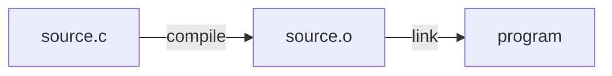

Create a new engine lesson teaching practical engineering skills — the build
systems, C language features, debugging techniques, and project structure that
make graphics applications work.

**When to use this skill:**

- You need to teach a concept about CMake, compilers, linkers, or build systems
- A learner is struggling with C language features (pointers, memory, structs)
- A GPU lesson requires build/toolchain knowledge that isn't covered yet
- You want to explain debugging techniques or common error patterns
- A lesson should cover adding or extending engine features — resource managers,
  asset pipelines, configuration systems, logging, input abstraction, or other
  infrastructure that supports a graphics application

**Smart behavior:**

- Before creating a lesson, check if an existing engine lesson already covers it
- Engine lessons are practical — they should include a buildable example project
- Focus on the *why* behind tools and techniques, not just the *how*
- Show common errors and how to diagnose them — this is what learners actually need
- Cross-reference GPU and math lessons where the concept appears in practice

## Arguments

The user (or you) can provide:

- **Number**: two-digit lesson number (e.g. 01, 02)
- **Topic name**: kebab-case (e.g. cmake-fundamentals, pointers-and-memory)
- **Description**: what this teaches (e.g. "CMake targets, properties, linking")

If any are missing, infer from context or ask.

## Steps

### 1. Analyze what's needed

- **Check existing engine lessons**: Is there already a lesson for this topic?
- **Identify the scope**: What specific concepts does this lesson cover?
- **Find cross-references**: Which GPU/math lessons use or benefit from this knowledge?

### 2. Create the lesson directory

`lessons/engine/NN-topic-name/`

### 3. Create an example program (`main.c`)

A small, focused C program that demonstrates the concept. Engine lessons differ
from GPU lessons — the program might:

- Show a build concept in action (e.g. linking, include paths)
- Demonstrate a C language feature (e.g. pointer arithmetic, struct layout)
- Reproduce and fix a common bug (e.g. memory leak, uninitialized variable)
- Print diagnostic output explaining what's happening

**Requirements:**

- **Standalone** — Builds independently with its own CMakeLists.txt
- **Clear output** — Shows the concept through printed results or behavior
- **Well-commented** — Explains what's happening and *why*
- **Demonstrates errors** — Where appropriate, show what goes wrong and how to
  fix it (commented-out "wrong" versions are valuable)

**Template structure:**

```c
/*
 * Engine Lesson NN — Topic Name
 *
 * Demonstrates: [what this shows]
 *
 * SPDX-License-Identifier: Zlib
 */

#include <SDL3/SDL.h>

int main(int argc, char *argv[])
{
    (void)argc;
    (void)argv;

    /* SDL_Init(0) initializes no subsystems — just core SDL state and error
     * handling.  This gives us SDL_Log and SDL_GetError without pulling in
     * video, audio, etc.  Pass SDL_INIT_VIDEO when you need a window. */
    if (!SDL_Init(0)) {
        SDL_Log("SDL_Init failed: %s", SDL_GetError());
        return 1;
    }

    /* Demonstrate the concept here */

    SDL_Quit();
    return 0;
}
```

**Notes on the template:**

- Use `SDL_Log` instead of `printf` for consistent cross-platform output
- Include SDL even for non-GPU lessons — it provides platform abstractions
  (`SDL_Log`, `SDL_malloc`, `SDL_GetBasePath`) that are used throughout
  forge-gpu
- If the lesson truly needs no SDL functionality, a plain `printf`-based
  program is acceptable

**Console output formatting:**

- **Use ASCII-only characters** for console output (cross-platform compatibility)
- Avoid Unicode box-drawing, symbols, or special characters that may not render
  on Windows Terminal
- Good: `-`, `=`, `*`, `|`, `->`, `[OK]`, `[!]`, "bytes", "offset"
- Bad: `─`, `═`, `•`, `↓`, `→`, `✓`, `⚠` (may render as garbled text on
  Windows)

### 4. Create `CMakeLists.txt`

```cmake
add_executable(NN-topic-name main.c)
target_include_directories(NN-topic-name PRIVATE ${FORGE_COMMON_DIR})
target_link_libraries(NN-topic-name PRIVATE SDL3::SDL3)

add_custom_command(TARGET NN-topic-name POST_BUILD
    COMMAND ${CMAKE_COMMAND} -E copy_if_different
        $<TARGET_FILE:SDL3::SDL3-shared>
        $<TARGET_FILE_DIR:NN-topic-name>
)
```

**Adapt as needed:** Some engine lessons may need additional sources, headers,
or libraries depending on the topic. For example, a lesson on multi-file
projects would have multiple `.c` files.

### 5. Create `README.md`

Structure:

````markdown
# Engine Lesson NN — Topic Name

[Brief subtitle explaining what this teaches]

## What you'll learn

[Bullet list of concepts covered]

## Why this matters

[1-2 paragraphs connecting this topic to real graphics/game development.
Explain when and why a learner will encounter this.]

## Result

[Brief description of what the example program demonstrates]

**Example output:**

```text
[Copy actual program output here]
```

**Important:** Copy output directly from running the program — don't manually
type it.

## Key concepts

[Bullet list of core takeaways:]
- **Concept 1** — Brief explanation
- **Concept 2** — Brief explanation

## The Details

[Main explanation of the topic, broken into subsections]

### [Subtopic 1]

[Explanation with code examples where appropriate]

### [Subtopic 2]

[Explanation with code examples where appropriate]

## Common errors

[This section is critical for engine lessons — show real error messages and
how to fix them]

### [Error description]

**What you see:**

```text
[Actual error message]
```

**Why it happens:** [Explanation]

**How to fix it:** [Solution]

## Where it's used

In forge-gpu lessons:
- [Link to GPU lesson] uses this for [purpose]
- [Link to math lesson] uses this for [purpose]

## Building

```bash
cmake -B build
cmake --build build --config Debug

# Windows
build\lessons\engine\NN-topic-name\Debug\NN-topic-name.exe

# Linux / macOS
./build/lessons/engine/NN-topic-name/NN-topic-name
```

## Exercises

1. [Exercise extending the concept]
2. [Exercise applying it differently]
3. [Exercise that deliberately breaks something so the learner can fix it]

## Further reading

- [Relevant engine/GPU/math lesson that builds on this]
- [External resource if helpful (official CMake docs, C reference, etc.)]
````

### 6. Update project files

- **`CMakeLists.txt` (root)**: Add `add_subdirectory(lessons/engine/NN-topic-name)`
  under an "Engine Lessons" section (create the section if it doesn't exist yet,
  placed between Math Lessons and GPU Lessons)
- **`README.md` (root)**: Add a row to the engine lessons table in the
  "Engine Lessons (lessons/engine/)" section — follow the same format as the
  existing rows (number, linked topic name, "What you'll learn" summary)
- **`lessons/engine/README.md`**: Add a row to the lessons table
- **`PLAN.md`**: Note the engine lesson if relevant

### 7. Cross-reference other lessons

- **Find GPU/math lessons that benefit**: Search for where this concept
  appears in practice
- **Update those lesson READMEs**: Add a note like "See
  [Engine Lesson NN](../../engine/NN-topic/) for details on [concept]"
- **Update engine lesson README**: List GPU/math lessons that use this
  knowledge in the "Where it's used" section

### 8. Build and test

```bash
cmake -B build
cmake --build build --config Debug
./build/lessons/engine/NN-topic-name/NN-topic-name
```

Verify the example runs and produces expected output.

### 9. Verify key topics are fully explained

**Before finalizing, launch a verification agent** using the Task tool
(`subagent_type: "general-purpose"`). Give the agent the paths to the lesson's
`README.md` and `main.c` and ask it to audit every key topic for completeness.
The agent reads both files and returns a pass/fail report — no script or
external tool is required.

**Inputs to the agent:**

- `lessons/engine/NN-topic-name/README.md`
- `lessons/engine/NN-topic-name/main.c`

**For each key topic / "What you'll learn" bullet, the agent must check:**

1. **Explained in the README** — Is the concept described clearly enough that
   a reader encountering it for the first time could understand it?
2. **Demonstrated in the example program** — Does `main.c` actually exercise
   this concept with code and output?
3. **All referenced terms are defined** — Read the exact wording of each key
   topic and identify every technical term. For each term, confirm it is
   explained somewhere in the lesson.

**What to flag:**

- A key topic references a term that is never defined or explained
- A key topic is listed in "What you'll learn" but has no corresponding
  section in "The Details" or the example program
- A "Common errors" entry shows an error message but doesn't explain the
  root cause clearly enough to fix it

**The lesson is incomplete until every key topic passes all three checks.**

### 10. Run markdown linting

Use the `/markdown-lint` skill to check all markdown files:

```bash
npx markdownlint-cli2 "**/*.md"
```

If errors are found:

1. Try auto-fix: `npx markdownlint-cli2 --fix "**/*.md"`
2. Manually fix remaining errors (especially MD040 - missing language tags)
3. Verify: `npx markdownlint-cli2 "**/*.md"`

## Engine Lesson Conventions

### Scope

Engine lessons cover the infrastructure of building graphics applications:

- **Build systems** — CMake, compiler toolchains, linking, dependencies
- **C language** — Memory, pointers, structs, data layout, header patterns
- **Debugging** — Error messages, debuggers, common bugs, diagnostic tools
- **Project structure** — File organization, shared libraries, asset loading
- **Engine features** — Resource managers, asset pipelines, configuration
  systems, logging, input abstraction, and other infrastructure that a
  graphics application or game engine needs beyond rendering

Engine lessons do **not** cover:

- GPU rendering techniques (that's GPU lessons)
- Mathematical concepts (that's math lessons)
- SDL GPU API calls for drawing (that's GPU lessons)

### Tone

Engine lessons should be especially patient and encouraging. Build errors are
one of the most frustrating parts of learning graphics programming. The goal
is to turn "I have no idea what this error means" into "I know exactly what
went wrong and how to fix it."

- Show the actual error message — don't paraphrase it
- Explain the error in plain language before giving the fix
- When a concept has platform differences, note all three (Windows, macOS,
  Linux)

### Error-first teaching

Many engine lessons benefit from an "error-first" approach:

1. Show a common mistake or error
2. Explain why it happens
3. Show the fix
4. Explain why the fix works

This mirrors how learners actually encounter these topics — they hit an
error and need to understand it.

### Code style

Follow the same conventions as all forge-gpu code:

- C99, matching SDL's style
- `PascalCase` for typedefs, `lowercase_snake_case` for locals
- `UPPER_SNAKE_CASE` for `#define` constants
- No magic numbers in production/library code — `#define` or `enum` everything.
  In lesson files, inline numeric literals are acceptable when one-off
  demonstration values improve readability (e.g. array sizes, sample
  coordinates, test inputs)
- Extensive comments explaining *why* and *purpose*

## Diagrams and Formulas

### Mermaid diagrams

For **flow/pipeline diagrams** (build process, compilation stages, memory
layout), use inline mermaid blocks — GitHub renders them natively:

````markdown

````

Mermaid is especially useful for engine lessons to show:

- Compilation pipeline (preprocess → compile → assemble → link)
- CMake target dependency graphs
- Memory layout diagrams
- Include file resolution order

### Matplotlib diagrams

For visual diagrams (memory layout, struct padding), add a diagram function
to the appropriate file in `scripts/forge_diagrams/`:

1. Write a function following the existing pattern
2. Register it in the `DIAGRAMS` dict in `__main__.py`
3. Run `python scripts/forge_diagrams --lesson engine/NN` to generate the PNG
4. Reference in the README: ``

### ASCII diagrams

For simple layouts (< 10 lines), inline ASCII art in ` ```text ` blocks is
often clearer than a generated image:

```text
Stack (grows down)         Heap (grows up)
+------------------+       +------------------+
| local variables  |       | malloc'd memory  |
| return address   |       | ...              |
| parameters       |       |                  |
+------------------+       +------------------+
```

## Example: CMake Fundamentals Lesson

**Scenario:** Learners keep asking why `target_link_libraries` is needed.

1. **Scope**: CMake targets, properties, `add_executable`, linking
2. **Create**: `lessons/engine/01-cmake-fundamentals/`
3. **Program**: Small multi-file project that prints values from a linked
   library
4. **README**: Explain targets as the core CMake concept, show what happens
   when you forget to link
5. **Common errors**: "undefined reference to..." — explain linker errors
6. **Cross-reference**: Note that every GPU lesson's CMakeLists.txt uses
   these patterns

## Example: Pointers and Memory Lesson

**Scenario:** A learner doesn't understand why vertex buffer uploads work.

1. **Scope**: Stack vs heap, `malloc`/`free`, pointer arithmetic, `sizeof`
2. **Create**: `lessons/engine/02-pointers-and-memory/`
3. **Program**: Allocate a struct array, show memory layout with `offsetof`,
   demonstrate pointer arithmetic
4. **README**: Explain how GPU lessons use these concepts for vertex data
5. **Common errors**: Use-after-free, memory leaks, wrong `sizeof`
6. **Cross-reference**: Link to GPU Lesson 02 (vertex buffers) and the
   `offsetof` pattern used throughout

## When NOT to Create an Engine Lesson

- The topic is covered by an existing engine lesson
- The concept is purely mathematical (belongs in a math lesson)
- The concept is about GPU rendering (belongs in a GPU lesson)
- The topic is too narrow for a full lesson (add a note to an existing lesson
  or FAQ instead)
- The topic is IDE-specific (VS Code, Visual Studio) rather than
  toolchain-general

In these cases, update existing documentation or add a FAQ entry.

## Tips

- **Start with the error** — Most learners arrive at engine topics because
  something broke. Lead with the problem they're trying to solve.
- **Show real output** — Actual compiler/linker error messages, actual program
  output. Don't paraphrase.
- **Platform differences matter** — MSVC, GCC, and Clang produce different
  error messages. Note the differences when relevant.
- **Keep examples minimal** — The example project should demonstrate exactly
  one concept. Don't combine CMake and pointer lessons.
- **Link to official docs** — CMake docs, C standard references, and compiler
  documentation are valuable further reading.
- **ASCII-only output** — Use only ASCII characters in printf output for
  cross-platform compatibility.
