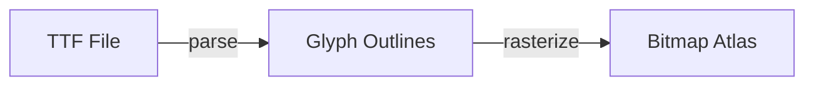

Create a new UI lesson teaching how to build an immediate-mode UI system from
scratch — font parsing, text rasterization, layout, and interactive controls.

UI lessons produce CPU-side data (textures, vertices, indices, UVs) that a
separate GPU lesson will later render. The UI library itself contains **no GPU
code** — it is a pure data-generation layer.

**When to use this skill:**

- You need to teach TTF font parsing or glyph rasterization
- A learner wants to build immediate-mode UI controls (buttons, sliders, text)
- You want to explain text layout, font metrics, or atlas packing
- A lesson should cover UI patterns for games (health bars, inventories) or
  developer tools (property editors, debug overlays)

**Smart behavior:**

- Before creating a lesson, check if an existing UI lesson already covers it
- UI lessons are data-oriented — they output textures, vertex arrays, and
  index buffers, not rendered pixels
- Focus on *why* each data structure exists and how it feeds into a renderer
- Show visual results through BMP images generated by the program and
  diagram assets (matplotlib), not GPU rendering
- Cross-reference math lessons (vectors, rects) and engine lessons (memory,
  structs) where the concept appears in practice

## Arguments

The user (or you) can provide:

- **Number**: two-digit lesson number (e.g. 01, 02)
- **Topic name**: kebab-case (e.g. ttf-parsing, immediate-mode-basics)
- **Description**: what this teaches (e.g. "Parse TTF font files, extract glyph outlines")

If any are missing, infer from context or ask.

## Steps

### 1. Analyze what's needed

- **Check existing UI lessons**: Is there already a lesson for this topic?
- **Check `common/ui/`**: Does relevant library code already exist?
- **Identify the scope**: What specific concepts does this lesson cover?
- **Find cross-references**: Which math/engine/GPU lessons relate?

### 2. Create the lesson directory

`lessons/ui/NN-topic-name/`

### 3. Create a demo program (`main.c`)

A focused C program that demonstrates the UI concept by producing data and
verifying it. UI lesson programs **must write BMP images** as their primary
visual output. These images are committed to `assets/` and embedded in the
README so readers see results immediately. Programs typically:

- Write output BMP images showing glyphs, atlases, or layouts
- Parse or generate font/UI data structures
- Print supplementary metrics, bounding boxes, or layout results to the console
- Validate data correctness (glyph counts, atlas coverage, vertex winding)

**Requirements:**

- **Standalone** — Builds independently with its own CMakeLists.txt
- **No GPU code** — All output is CPU-side (images, vertex arrays, console)
- **Clear output** — Shows the concept through printed results or saved images
- **Well-commented** — Explains what's happening and *why*
- **Uses shared libraries** — `#include "math/forge_math.h"` for vec2/rect math,
  `#include "ui/forge_ui.h"` for UI types (once the library exists)

**Template structure:**

```c
/*
 * UI Lesson NN — Topic Name
 *
 * Demonstrates: [what this shows]
 *
 * SPDX-License-Identifier: Zlib
 */

#include <SDL3/SDL.h>
#include "math/forge_math.h"

int main(int argc, char *argv[])
{
    (void)argc;
    (void)argv;

    if (!SDL_Init(0)) {
        SDL_Log("SDL_Init failed: %s", SDL_GetError());
        return 1;
    }

    /* Demonstrate the UI concept here */

    SDL_Quit();
    return 0;
}
```

**Console output formatting:**

- **Use ASCII-only characters** for console output (cross-platform compatibility)
- Avoid Unicode box-drawing, symbols, or special characters that may not render
  on Windows Terminal
- Good: `-`, `=`, `*`, `|`, `->`, `[OK]`, `[!]`, "px", "glyph", "atlas"
- Bad: `─`, `═`, `•`, `↓`, `→`, `✓`, `⚠` (may render as garbled text on
  Windows)

### 4. Create `CMakeLists.txt`

```cmake
add_executable(NN-topic-name main.c)
target_include_directories(NN-topic-name PRIVATE ${FORGE_COMMON_DIR})
target_link_libraries(NN-topic-name PRIVATE SDL3::SDL3)

if(TARGET SDL3::SDL3-shared)
    add_custom_command(TARGET NN-topic-name POST_BUILD
        COMMAND ${CMAKE_COMMAND} -E copy_if_different
            $<TARGET_FILE:SDL3::SDL3-shared>
            $<TARGET_FILE_DIR:NN-topic-name>
    )
endif()
```

**Adapt as needed:** Later lessons may link against a shared UI library
(`common/ui/`) once it exists.

### 5. Create `README.md`

Structure:

````markdown
# UI Lesson NN — Topic Name

[Brief subtitle explaining what this teaches]

## What you'll learn

[Bullet list of UI concepts covered]

## Why this matters

[1-2 paragraphs connecting this topic to real game/tool UI development.
Explain when and why a developer will need this.]

## Result

[Brief description of what the example program produces]

[Embed BMP images generated by the program. Copy the BMPs to the lesson's
`assets/` directory and reference them with ``.
Use tables to show multiple images side by side:]

| Glyph 1 | Glyph 2 | Glyph 3 |
|---------|---------|---------|
|  |  |  |

**Important:** Build and run the program first to generate the BMP files,
then copy them to `assets/`. Browsers render BMP files natively, so they
display correctly in GitHub READMEs.

## Key concepts

[Bullet list of core takeaways:]
- **Concept 1** — Brief explanation
- **Concept 2** — Brief explanation

## The Details

[Main explanation of the topic, broken into subsections]

### [Subtopic 1]

[Explanation with code examples and diagrams where appropriate]

### [Subtopic 2]

[Explanation with code examples and diagrams where appropriate]

## Data output

[Describe the data structures this lesson produces — vertex layouts, texture
formats, index buffers. This section bridges UI lessons to the GPU lesson
that will render the data.]

- **Vertices**: [format — position, UV, color]
- **Indices**: [format — triangle list, winding order]
- **Textures**: [format — RGBA, single-channel alpha, atlas dimensions]

## Where it's used

In forge-gpu lessons:
- [Link to GPU lesson] renders this data with [technique]
- [Link to math lesson] provides [math concept] used here
- [Link to engine lesson] explains [engineering concept] used here

## Building

```bash
cmake -B build
cmake --build build --config Debug

# Windows
build\lessons\ui\NN-topic-name\Debug\NN-topic-name.exe

# Linux / macOS
./build/lessons/ui/NN-topic-name/NN-topic-name
```

## Exercises

1. [Exercise extending the concept]
2. [Exercise applying it differently]
3. [Exercise that produces different output data for the GPU to render]

## Further reading

- [Relevant UI/math/engine lesson that builds on this]
- [External resource — TTF spec, stb_truetype, Dear ImGui, etc.]
````

### 6. Update project files

- **`CMakeLists.txt` (root)**: Add `add_subdirectory(lessons/ui/NN-topic-name)`
  under a "UI Lessons" section (create the section if it doesn't exist yet)
- **`PLAN.md`**: Check off or add the UI lesson entry

### 6b. Keep READMEs in sync

Every new UI lesson must update **all four** of these files:

- **`README.md` (root)**: Add a row to the UI lessons table in the
  "UI Lessons (lessons/ui/)" section — follow the same format as the
  existing rows
- **`lessons/ui/README.md`**: Add a row to the lessons table
- **`common/ui/README.md`**: If the lesson adds new types or functions to the
  shared library, add them to the API reference sections. Always add the
  lesson to the "Where It's Used" list
- **Previous lesson's `README.md`**: Update the "What's next" section to
  include the new lesson (and verify it matches the current plan order in
  `PLAN.md`)

### 7. Cross-reference other lessons

- **Find related lessons**: Search for math (vec2, rect), engine (memory,
  structs), and GPU lessons that will consume UI output
- **Update those lesson READMEs**: Add a note like "See
  [UI Lesson NN](../../ui/NN-topic-name/) for details on [concept]"
- **Update UI lesson README**: List related lessons in "Where it's used"

### 8. Build, run, and collect output images

```bash
cmake -B build
cmake --build build --config Debug

# Run from repo root so the program finds assets/fonts/
./build/lessons/ui/NN-topic-name/NN-topic-name

# Copy generated BMP files into the lesson's assets/ directory
cp *.bmp lessons/ui/NN-topic-name/assets/
```

Verify the demo runs and produces BMP files. Copy the BMPs to the lesson's
`assets/` directory so they can be referenced in the README. These images are
committed to the repository — browsers render BMP natively, so they display
correctly on GitHub.

### 9. Update the UI library (when applicable)

If this lesson introduces reusable types or functions (font metrics, rect
packing, text shaping), add them to `common/ui/` following the same
conventions as `common/math/`:

- **Header-only**: `static inline` functions in `.h` files
- **Documented**: Summary, parameters, returns, usage example
- **Naming**: `forge_ui_` prefix for public API, `ForgeUi` for types
- **Tested**: Add or update tests under `tests/ui/`

### 10. Verify key topics are fully explained

**Before finalizing, launch a verification agent** using the Task tool
(`subagent_type: "general-purpose"`). Give the agent the paths to the lesson's
`README.md` and `main.c` and ask it to audit every key topic for completeness.

**For each key topic / "What you'll learn" bullet, the agent must check:**

1. **Explained in the README** — Is the concept described clearly enough that
   a reader encountering it for the first time could understand it?
2. **Demonstrated in the example program** — Does `main.c` actually exercise
   this concept with code and output?
3. **All referenced terms are defined** — Read the exact wording of each key
   topic and identify every technical term. For each term, confirm it is
   explained somewhere in the lesson.

**What to flag:**

- A key topic references a term that is never defined or explained
- A key topic is listed in "What you'll learn" but has no corresponding
  section in "The Details" or the example program
- A data output section describes a format that the program doesn't actually
  produce

**The lesson is incomplete until every key topic passes all three checks.**

### 11. Run markdown linting

Use the `/markdown-lint` skill to check all markdown files:

```bash
npx markdownlint-cli2 "**/*.md"
```

If errors are found:

1. Try auto-fix: `npx markdownlint-cli2 --fix "**/*.md"`
2. Manually fix remaining errors (especially MD040 - missing language tags)
3. Verify: `npx markdownlint-cli2 "**/*.md"`

## UI Lesson Conventions

### Scope

UI lessons cover building an immediate-mode UI system from the ground up:

- **Font parsing** — TTF file format, glyph outlines, font metrics
- **Rasterization** — Converting glyph outlines to bitmaps, anti-aliasing
- **Atlas packing** — Arranging glyphs into texture atlases efficiently
- **Text layout** — Line breaking, kerning, shaping, alignment
- **Immediate-mode UI** — Retained vs immediate, widget state, input handling
- **Controls** — Buttons, sliders, checkboxes, text input, panels
- **Layout** — Horizontal/vertical stacking, padding, margins, scrolling
- **Game UI** — Health bars, inventories, HUD elements, menus
- **Dev UI** — Property editors, debug overlays, console, performance graphs

UI lessons do **not** cover:

- GPU rendering (a separate GPU lesson will render UI data)
- Shader programming (no HLSL in UI lessons)
- SDL GPU API calls (UI is a pure CPU data layer)

### Data-first approach

Every UI lesson should clearly document what data it produces:

- **Texture data** — Pixel format, dimensions, channel layout
- **Vertex data** — Position (vec2), UV (vec2), color (vec4), stride
- **Index data** — Triangle list, winding order (CCW), index type (uint16/uint32)
- **Metadata** — Glyph metrics, kerning pairs, widget bounds

This data contract is what connects UI lessons to the GPU lesson that
renders them.

### Tone

UI lessons should be practical and visual. Font parsing and text layout are
domains with deep history and real complexity — treat the material with
respect while keeping it accessible.

- Show data visually — output images of glyphs, atlases, layouts
- Explain the *why* behind data structures (why store advance width? why
  pack into an atlas?)
- Connect each concept to the renderer that will eventually consume the data
- Show common pitfalls — off-by-one in glyph rects, incorrect UV coordinates,
  missing kerning

### Code style

Follow the same conventions as all forge-gpu code:

- C99, matching SDL's style
- `ForgeUi` prefix for public types, `forge_ui_` for public functions
- `PascalCase` for typedefs, `lowercase_snake_case` for locals
- `UPPER_SNAKE_CASE` for `#define` constants
- No magic numbers — `#define` or `enum` everything
- Extensive comments explaining *why* and *purpose*

## Diagrams and Formulas

**Find opportunities to create compelling diagrams and visualizations via the
matplotlib scripts** — they increase reader engagement and help learners
understand the topics being taught. Use the `/create-diagram` skill to add
diagrams following the project's visual identity and quality standards.

### Matplotlib diagrams

For visual diagrams (glyph anatomy, atlas packing, text metrics, layout
boxes, widget trees), add a diagram function to
`scripts/forge_diagrams/ui_diagrams.py`:

1. Write a function following the existing pattern (shared `setup_axes`,
   `draw_vector`, `save` helpers from `_common.py`)
2. Register it in the `DIAGRAMS` dict in `__main__.py` with the lesson key
3. Run `python scripts/forge_diagrams --lesson ui/NN` to generate the PNG
4. Reference in the README: ``

Output goes to each lesson's `assets/` directory at 200 DPI (PNG only).

### Mermaid diagrams

For **flow/pipeline diagrams** (TTF parsing pipeline, UI layout pass, data
flow from CPU to GPU), use inline mermaid blocks:

````markdown

````

### KaTeX math

For **formulas** (Bezier curves, atlas packing ratios, font scaling), use
inline `$...$` and display `$$...$$` math notation:

- Inline: `$\text{scale} = \frac{\text{pixel height}}{\text{unitsPerEm}}$`
- Display math blocks must be split across three lines (CI enforces this):

```text
$$
B(t) = (1-t)^2 P_0 + 2(1-t)t P_1 + t^2 P_2
$$
```

## Example: TTF Parsing Lesson

**Scenario:** Learners want to understand how fonts work before rendering text.

1. **Scope**: TTF file structure, table directory, glyph outlines, font metrics
2. **Create**: `lessons/ui/01-ttf-parsing/`
3. **Program**: Parse a TTF file, extract glyph outlines, print metrics
4. **README**: Explain TTF tables, coordinate systems, compound glyphs
5. **Data output**: Glyph contours (point arrays), advance widths, bounding boxes
6. **Cross-reference**: Math Lesson 01 (vectors for glyph points), Engine
   Lesson 04 (memory layout for TTF tables)

## Example: Font Atlas Lesson

**Scenario:** A learner has parsed glyphs and wants to pack them into a texture.

1. **Scope**: Rectangle packing, atlas generation, UV coordinate calculation
2. **Create**: `lessons/ui/03-font-atlas/`
3. **Program**: Pack glyphs into an atlas, output the atlas image and UV table
4. **README**: Explain packing algorithms, padding, power-of-two textures
5. **Data output**: Atlas texture (RGBA), per-glyph UV rects, atlas dimensions
6. **Cross-reference**: GPU lesson that samples the atlas texture

## When NOT to Create a UI Lesson

- The topic is covered by an existing UI lesson
- The concept is pure math with no UI application (belongs in a math lesson)
- The concept is about GPU rendering (belongs in a GPU lesson)
- The concept is about build systems or debugging (belongs in an engine lesson)
- The topic is too narrow for a full lesson (add to an existing lesson instead)

In these cases, update existing documentation or plan for later.

## Tips

- **Start with data** — Every lesson should define its output format before
  writing code. The data contract is the bridge to the GPU.
- **Show images** — Font and UI concepts are inherently visual. Output images
  of glyphs, atlases, and layouts alongside console metrics.
- **Reference the spec** — TTF/OpenType specs are publicly available. Link to
  relevant sections when explaining file formats.
- **Keep examples minimal** — Each lesson should demonstrate exactly one concept.
  Don't combine font parsing and atlas packing in one lesson.
- **ASCII-only output** — Use only ASCII characters in printf output for
  cross-platform compatibility.
- **BMP images over text** — The README Result section should show BMP images
  generated by the program, not console text output. Build and run the program,
  copy BMPs to `assets/`, and embed with ``. Browsers
  render BMP natively.
