# forge-gpu

**Learn graphics fundamentals. Build real projects.**

A learning platform and building tool for real-time graphics with
[SDL's GPU API](https://wiki.libsdl.org/SDL3/CategoryGPU), written in C.

## Why forge-gpu?

**Two ways to use this project:**

1. **Learn** — Follow guided lessons teaching GPU programming, math, and game techniques
   - Each lesson is a standalone program introducing one concept
   - Progressive curriculum from "Hello Window" to advanced rendering
   - Covers SDL GPU API, math fundamentals, engine/toolchain skills, and more
   - Every line commented to explain *why*, not just *what*

2. **Forge** — Use skills and libraries to build games and tools with AI
   - Reusable math library (documented, readable, learning-focused)
   - Claude Code skills teaching AI agents the patterns from lessons
   - Copy skills to your project and build confidently with Claude
   - Understanding fundamentals makes working with AI more productive

**Philosophy:** Learn the concepts, then use them to build. When you hit a
problem building, dive deeper into the relevant lesson. Humans work better
with AI when they understand what they're building.

## Lessons

### GPU Lessons (lessons/gpu/)

Learn the SDL GPU API and modern rendering techniques:

<table>
<tr>
<td align="center">
<a href="lessons/gpu/01-hello-window/"></a><br />
<b>01</b> — Hello Window
</td>
<td align="center">
<a href="lessons/gpu/02-first-triangle/"></a><br />
<b>02</b> — First Triangle
</td>
<td align="center">
<a href="lessons/gpu/03-uniforms-and-motion/">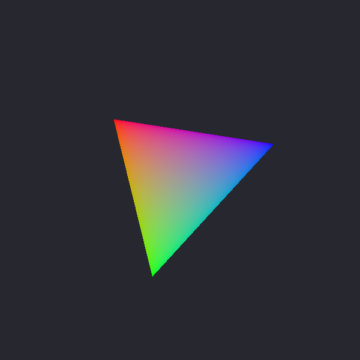</a><br />
<b>03</b> — Uniforms &amp; Motion
</td>
</tr>
<tr>
<td align="center">
<a href="lessons/gpu/04-textures-and-samplers/"></a><br />
<b>04</b> — Textures &amp; Samplers
</td>
<td align="center">
<a href="lessons/gpu/05-mipmaps/">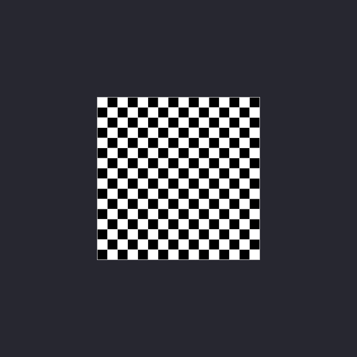</a><br />
<b>05</b> — Mipmaps
</td>
<td align="center">
<a href="lessons/gpu/06-depth-and-3d/">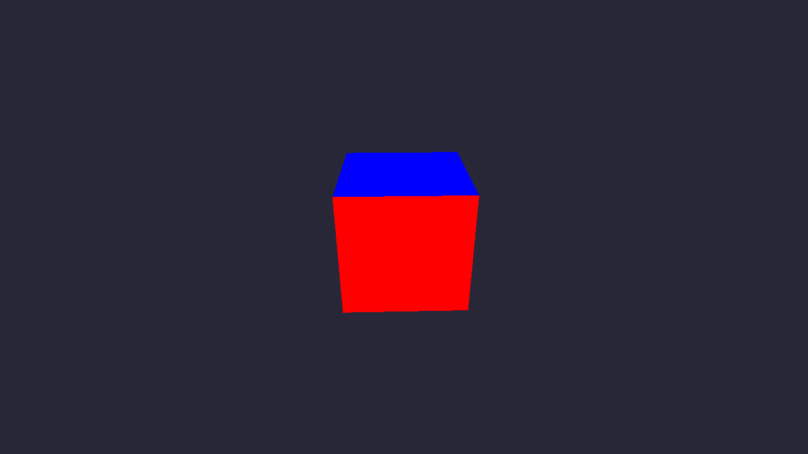</a><br />
<b>06</b> — Depth &amp; 3D
</td>
</tr>
<tr>
<td align="center">
<a href="lessons/gpu/07-camera-and-input/">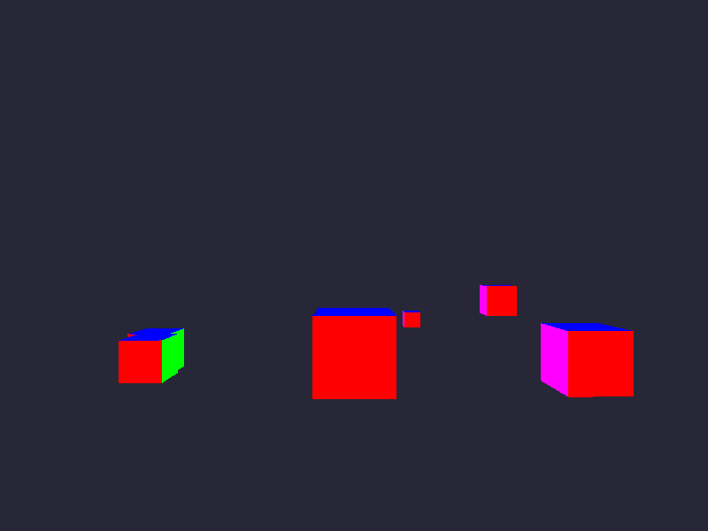</a><br />
<b>07</b> — Camera &amp; Input
</td>
<td align="center">
<a href="lessons/gpu/08-mesh-loading/"></a><br />
<b>08</b> — Mesh Loading
</td>
<td align="center">
<a href="lessons/gpu/09-scene-loading/">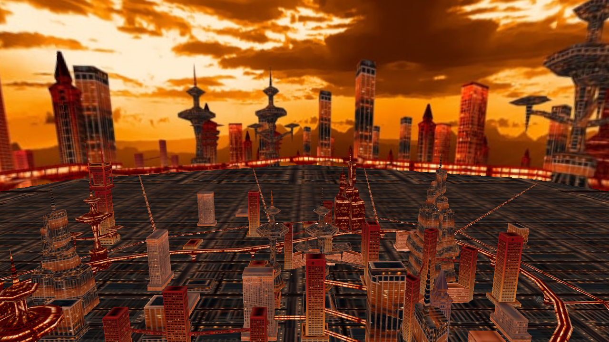</a><br />
<b>09</b> — Scene Loading
</td>
</tr>
<tr>
<td align="center">
<a href="lessons/gpu/10-basic-lighting/"></a><br />
<b>10</b> — Basic Lighting
</td>
<td align="center">
<a href="lessons/gpu/11-compute-shaders/">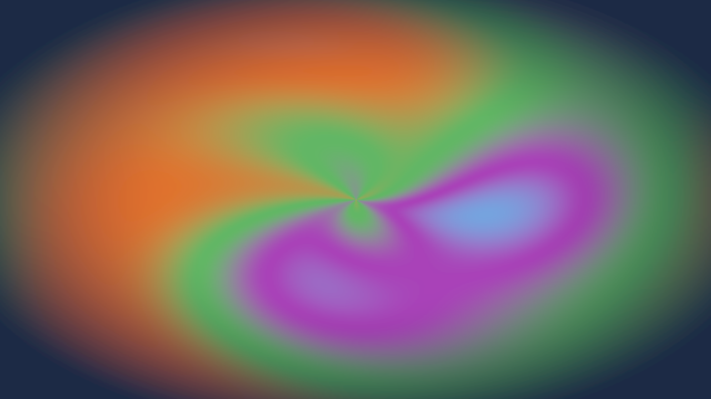</a><br />
<b>11</b> — Compute Shaders
</td>
<td align="center">
<a href="lessons/gpu/12-shader-grid/">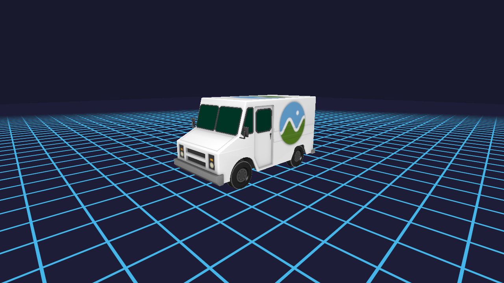</a><br />
<b>12</b> — Shader Grid
</td>
</tr>
<tr>
<td align="center">
<a href="lessons/gpu/13-instanced-rendering/">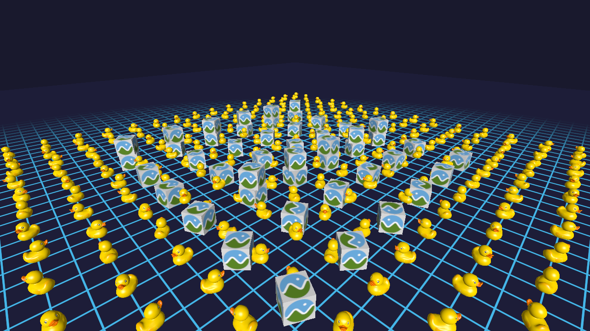</a><br />
<b>13</b> — Instanced Rendering
</td>
<td align="center">
<a href="lessons/gpu/14-environment-mapping/">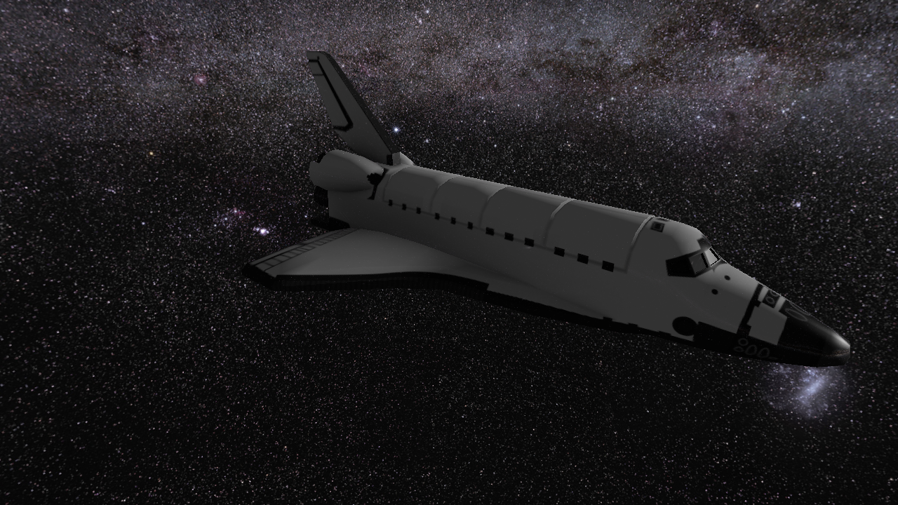</a><br />
<b>14</b> — Environment Mapping
</td>
<td align="center">
<a href="lessons/gpu/15-cascaded-shadow-maps/"></a><br />
<b>15</b> — Shadow Maps
</td>
</tr>
<tr>
<td align="center">
<a href="lessons/gpu/16-blending/">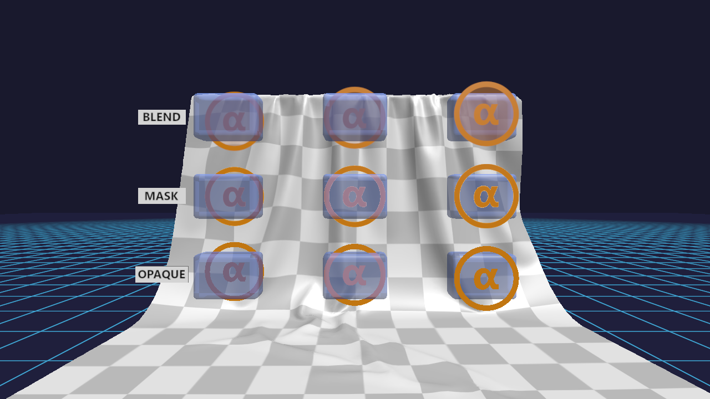</a><br />
<b>16</b> — Blending
</td>
<td align="center">
<a href="lessons/gpu/17-normal-maps/">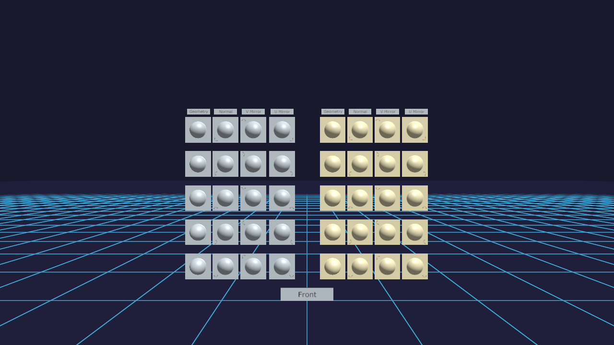</a><br />
<b>17</b> — Normal Maps
</td>
<td align="center">
<a href="lessons/gpu/18-blinn-phong-materials/">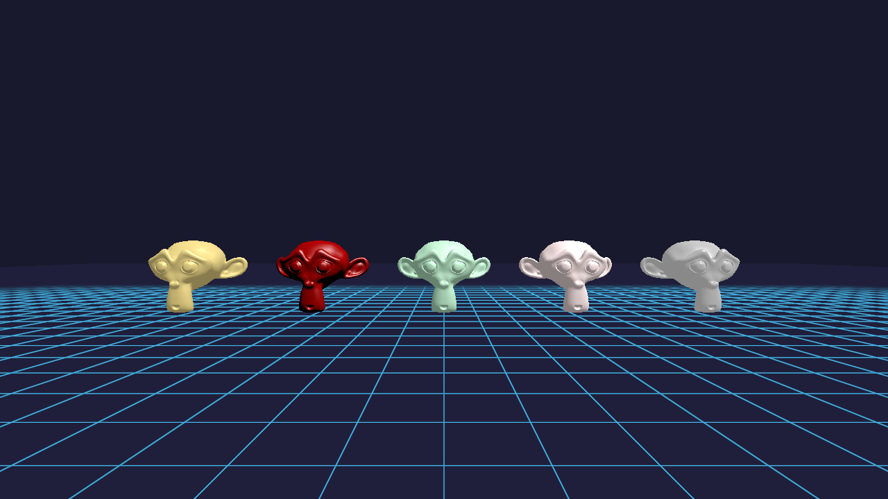</a><br />
<b>18</b> — Materials
</td>
</tr>
<tr>
<td align="center">
<a href="lessons/gpu/19-debug-lines/">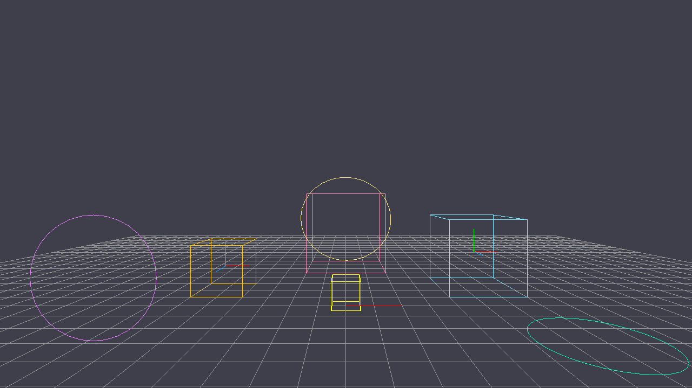</a><br />
<b>19</b> — Debug Lines
</td>
<td align="center">
<a href="lessons/gpu/20-linear-fog/"></a><br />
<b>20</b> — Linear Fog
</td>
<td align="center">
<a href="lessons/gpu/21-hdr-tone-mapping/">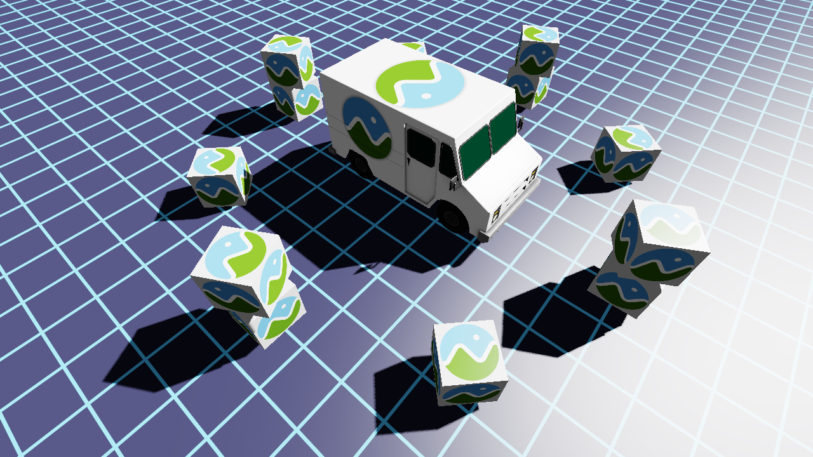</a><br />
<b>21</b> — HDR &amp; Tone Mapping
</td>
</tr>
<tr>
<td align="center">
<a href="lessons/gpu/22-bloom/">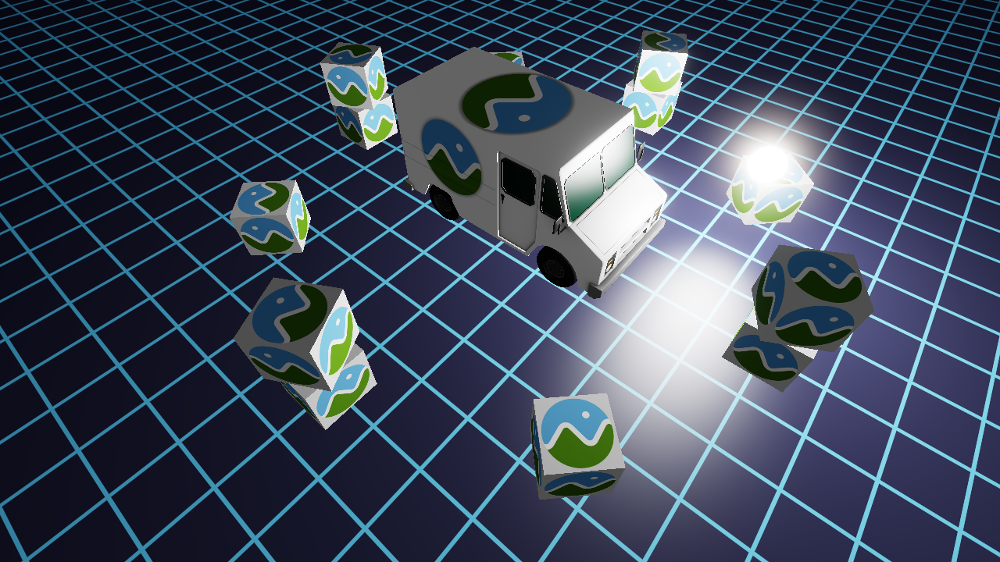</a><br />
<b>22</b> — Bloom
</td>
</tr>
</table>

### Math Lessons (lessons/math/)

Standalone programs teaching the math behind graphics:

| # | Topic | What you'll learn |
|---|-------|-------------------|
| 01 | [Vectors](lessons/math/01-vectors/) | Addition, dot/cross products, normalization, lerp |
| 02 | [Coordinate Spaces](lessons/math/02-coordinate-spaces/) | Model, world, view, clip, NDC, screen spaces |
| 03 | [Bilinear Interpolation](lessons/math/03-bilinear-interpolation/) | LINEAR texture filtering, nested lerps, nearest vs linear |
| 04 | [Mipmaps & LOD](lessons/math/04-mipmaps-and-lod/) | Mip chains, trilinear interpolation, LOD selection |
| 05 | [Matrices](lessons/math/05-matrices/) | Identity, translation, scaling, rotation, composition, MVP pipeline |
| 06 | [Projections](lessons/math/06-projections/) | Perspective, orthographic, frustums, clip space, NDC |
| 07 | [Floating Point](lessons/math/07-floating-point/) | IEEE 754, precision, epsilon comparison, z-fighting, float vs double |
| 08 | [Orientation](lessons/math/08-orientation/) | Quaternions, Euler angles, axis-angle, rotation matrices, gimbal lock, slerp |
| 09 | [View Matrix](lessons/math/09-view-matrix/) | View matrix, virtual camera, basis extraction, look-at vs quaternion |
| 10 | [Anisotropy vs Isotropy](lessons/math/10-anisotropy/) | Jacobian, singular values, anisotropic filtering, noise, friction |
| 11 | [Color Spaces](lessons/math/11-color-spaces/) | Gamma correction, linear vs sRGB, luminance, HSL/HSV, CIE XYZ/xyY, gamut, tone mapping |
| 12 | [Hash Functions & White Noise](lessons/math/12-hash-functions/) | Integer hash functions (Wang, PCG, xxHash32), avalanche effect, hash-to-float, seeding, white noise |
| 13 | [Gradient Noise (Perlin & Simplex)](lessons/math/13-gradient-noise/) | Gradient noise algorithm, Perlin improved noise, simplex noise, fBm, lacunarity, persistence, domain warping |
| 14 | [Blue Noise & Low-Discrepancy Sequences](lessons/math/14-blue-noise-sequences/) | Blue noise, Halton/Sobol/R2 sequences, dithering, sampling quality, discrepancy |

Each math lesson includes a demo program and updates the shared math
library (`common/math/`) with documented, reusable implementations.

### Engine Lessons (lessons/engine/)

Learn the practical engineering behind graphics applications — build systems,
C fundamentals, debugging, and project structure:

| # | Topic | What you'll learn |
|---|-------|-------------------|
| 01 | [Intro to C](lessons/engine/01-intro-to-c/) | Types, functions, control flow, arrays, strings, pointers, structs, dynamic memory |
| 02 | [CMake Fundamentals](lessons/engine/02-cmake-fundamentals/) | Targets, properties, `add_executable`, `target_link_libraries`, generator expressions, reading build errors |
| 03 | [FetchContent & Dependencies](lessons/engine/03-fetchcontent-dependencies/) | `FetchContent` lifecycle, version pinning with `GIT_TAG`, imported targets, adding dependencies, offline builds |
| 04 | [Pointers & Memory](lessons/engine/04-pointers-and-memory/) | Stack vs heap, `malloc`/`free`, pointer arithmetic, `sizeof`/`offsetof`, vertex buffer uploads |
| 05 | [Header-Only Libraries](lessons/engine/05-header-only-libraries/) | `static inline`, include guards vs `#pragma once`, one-definition rule, how `forge_math.h` works |
| 06 | [Reading Error Messages](lessons/engine/06-reading-error-messages/) | Build pipeline phases, compiler errors, linker errors, runtime crashes, warnings, systematic fixing strategy |
| 07 | [Using a Debugger](lessons/engine/07-using-a-debugger/) | Breakpoints, stepping, inspecting variables, call stack, conditional breakpoints, watchpoints |

See [lessons/engine/README.md](lessons/engine/README.md) for details and the
full topic list. See [PLAN.md](PLAN.md) for the roadmap.

## Shared Libraries (`common/`)

GPU lessons use shared, header-only libraries in `common/` instead of writing
bespoke code in each lesson. All libraries are documented, readable, and
reusable in your own projects.

### Math Library (`common/math/`)

Vectors, matrices, quaternions, and all the math needed for graphics programming.
See [`common/math/README.md`](common/math/README.md) for the full API reference.

```c
#include "math/forge_math.h"

vec3 position = vec3_create(0.0f, 1.0f, 0.0f);
mat4 rotation = mat4_rotate_z(FORGE_PI / 4.0f);
```

Every function has a corresponding math lesson explaining the concept. When you
need new math functionality, use the `/math-lesson` skill.

### OBJ Parser (`common/obj/`)

Load Wavefront OBJ models into a flat vertex array ready for GPU upload.
See [`common/obj/README.md`](common/obj/README.md) for details.

```c
#include "obj/forge_obj.h"

ForgeObjMesh mesh;
if (forge_obj_load("model.obj", &mesh)) {
    // mesh.vertices ready for GPU upload — draw with SDL_DrawGPUPrimitives
    forge_obj_free(&mesh);
}
```

### glTF Parser (`common/gltf/`)

Load glTF 2.0 scenes with multi-material meshes, scene hierarchy, and indexed
drawing. See [`common/gltf/README.md`](common/gltf/README.md) for details.

```c
#include "gltf/forge_gltf.h"

ForgeGltfScene scene;
if (forge_gltf_load("scene.gltf", &scene)) {
    // scene.nodes[], scene.meshes[], scene.materials[] all populated
    // World transforms computed automatically from the node hierarchy
    forge_gltf_free(&scene);
}
```

All three libraries are header-only — just include and use. No build
configuration needed.

## Getting Started

### Prerequisites

- **CMake 3.24+**
- **A C compiler** (MSVC, GCC, or Clang)
- **A GPU** with Vulkan, Direct3D 12, or Metal support
- **Python 3** (for helper scripts)

SDL3 is fetched automatically — no manual installation required.

**Verify your environment** with the setup script:

```bash
python scripts/setup.py
```

This checks all required tools, detects the Vulkan SDK and shader compiler,
and reports anything missing. Use `--fix` to install missing Python packages
or `--build` to configure and build in one step:

```bash
python scripts/setup.py --build
```

### Building

```bash
cmake -B build
cmake --build build --config Debug
```

Optionally, initialise the SDL source submodule if you want to browse the
SDL headers and GPU backend code locally (this is for reference only — the
build uses FetchContent):

```bash
git submodule update --init
```

### Running lessons

The easiest way to run a lesson is with the **run script**:

```bash
python scripts/run.py 01                  # by number
python scripts/run.py first-triangle      # by name
python scripts/run.py math/01             # math lesson
python scripts/run.py                     # list all lessons
```

You can also run executables directly:

```bash
# Windows
build\lessons\gpu\01-hello-window\Debug\01-hello-window.exe

# Linux / macOS
./build/lessons/gpu/01-hello-window/01-hello-window
```

## Testing

The shared libraries have automated tests covering math operations, OBJ parsing,
and glTF parsing.

**Run all tests:**

```bash
cd build
ctest -C Debug --output-on-failure
```

**Run a specific test suite:**

```bash
cmake --build build --config Debug --target test_math
cmake --build build --config Debug --target test_obj
cmake --build build --config Debug --target test_gltf
```

All tests use epsilon comparison for floating-point accuracy and return proper
exit codes for CI/CD integration.

See [tests/math/README.md](tests/math/README.md) for adding new tests.

## Shader compilation

Pre-compiled shader bytecodes are checked in, so you **don't need any extra
tools just to build and run the lessons**. If you want to modify the HLSL
shader source, you'll need:

- **[Vulkan SDK](https://vulkan.lunarg.com/)** — provides `dxc` with SPIR-V
  support (the Windows SDK `dxc` can only compile DXIL, not SPIR-V)

After installing, make sure the `VULKAN_SDK` environment variable is set
(the installer does this automatically). On Windows the default location is:

```text
C:\VulkanSDK\<version>\Bin\dxc.exe
```

> **Heads up:** If you just type `dxc` and get *"SPIR-V CodeGen not
> available"*, you're hitting the Windows SDK `dxc` instead of the Vulkan
> SDK one. Use the full path to the Vulkan SDK `dxc` or put its `Bin/`
> directory earlier on your PATH.

### Compiling shaders

The **shader compilation script** handles everything — finds `dxc`, compiles
each HLSL file to both SPIR-V and DXIL, and generates C byte-array headers:

```bash
python scripts/compile_shaders.py            # all lessons
python scripts/compile_shaders.py 02         # just lesson 02
python scripts/compile_shaders.py -v         # verbose (show dxc commands)
```

## Project Structure

```text
forge-gpu/
├── lessons/
│   ├── math/              Math lessons — standalone programs + theory
│   │   ├── README.md      Overview and navigation
│   │   └── NN-concept/    Each concept: program, README, updates math lib
│   ├── engine/            Engine lessons — build systems, C, debugging
│   │   ├── README.md      Overview and navigation
│   │   └── NN-topic/      Each topic: example project, README, common errors
│   └── gpu/               GPU lessons — SDL API and rendering
│       ├── 01-hello-window/
│       ├── ...
│       ├── 09-scene-loading/
│       ├── 10-basic-lighting/
│       ├── 11-compute-shaders/
│       ├── 12-shader-grid/
│       ├── 13-instanced-rendering/
│       ├── 14-environment-mapping/
│       ├── 15-cascaded-shadow-maps/
│       └── 16-blending/
├── common/
│   ├── math/              Math library (vectors, matrices, quaternions)
│   │   ├── forge_math.h   All math operations (header-only)
│   │   ├── README.md      API reference and usage guide
│   │   └── DESIGN.md      Design decisions and conventions
│   ├── obj/               OBJ parser (Wavefront .obj files)
│   │   ├── forge_obj.h    Parser implementation (header-only)
│   │   └── README.md      Usage guide and supported features
│   ├── gltf/              glTF parser (glTF 2.0 scenes)
│   │   ├── forge_gltf.h   Parser implementation (header-only)
│   │   └── README.md      Usage guide, scene hierarchy, materials
│   ├── capture/           Screenshot/GIF capture utility
│   │   └── forge_capture.h
│   └── forge.h            Shared utilities for lessons
├── tests/                 Test suite (CTest integration)
│   ├── math/              Math library tests
│   ├── obj/               OBJ parser tests
│   └── gltf/              glTF parser tests
├── .claude/skills/        Claude Code skills (AI-invokable patterns)
│   ├── math-lesson/       Add math concept + lesson + update library
│   ├── new-lesson/        Create new GPU lesson
│   ├── sdl-gpu-setup/     Scaffold SDL3 GPU application
│   └── ...
├── scripts/               Helper scripts (run, setup, shader compilation)
├── third_party/SDL/       SDL3 source (submodule, for reference)
├── PLAN.md                Lesson roadmap and progress
├── CLAUDE.md              AI coding guidelines for this project
└── CMakeLists.txt         Root build configuration
```

**How it fits together:**

- **Math lessons** teach concepts and add to `common/math/`
- **Engine lessons** teach build systems, C fundamentals, debugging, and project structure
- **GPU lessons** use the shared libraries and link to math lessons for theory
- **Parsers** (`common/obj/`, `common/gltf/`) load 3D models for GPU lessons
- **Skills** automate lesson creation and teach AI agents the patterns
- **Shared libraries** are reusable in lessons and your own projects

## Skills — Build with AI

Every lesson distills into a **[Claude Code skill](https://code.claude.com/docs/en/skills)**
that teaches AI agents the same pattern. Copy `.claude/skills/` into your own
project to enable Claude to build games and tools with you.

### Building skills (use these in your projects)

| Skill | Invoke with | What it does |
|-------|-------------|--------------|
| [sdl-gpu-setup](.claude/skills/sdl-gpu-setup/SKILL.md) | `/sdl-gpu-setup` | Scaffold SDL3 GPU app with window, swapchain, render loop |
| [first-triangle](.claude/skills/first-triangle/SKILL.md) | `/first-triangle` | Add vertex buffers, shaders, pipeline — draw colored geometry |
| [uniforms-and-motion](.claude/skills/uniforms-and-motion/SKILL.md) | `/uniforms-and-motion` | Pass data to shaders with push uniforms, animate geometry |
| [textures-and-samplers](.claude/skills/textures-and-samplers/SKILL.md) | `/textures-and-samplers` | Load images, create GPU textures/samplers, draw textured geometry |
| [mipmaps](.claude/skills/mipmaps/SKILL.md) | `/mipmaps` | Create mipmapped textures, trilinear filtering, LOD control |
| [depth-and-3d](.claude/skills/depth-and-3d/SKILL.md) | `/depth-and-3d` | Depth buffer, MVP pipeline, 3D rendering, back-face culling |
| [camera-and-input](.claude/skills/camera-and-input/SKILL.md) | `/camera-and-input` | First-person camera, keyboard/mouse input, delta time |
| [mesh-loading](.claude/skills/mesh-loading/SKILL.md) | `/mesh-loading` | Load OBJ models, textured mesh rendering, file-based textures |
| [scene-loading](.claude/skills/scene-loading/SKILL.md) | `/scene-loading` | Load glTF scenes, multi-material meshes, scene hierarchy, indexed rendering |
| [basic-lighting](.claude/skills/basic-lighting/SKILL.md) | `/basic-lighting` | Blinn-Phong lighting, ambient/diffuse/specular, normal transformation |
| [compute-shaders](.claude/skills/compute-shaders/SKILL.md) | `/compute-shaders` | Compute pipelines, storage textures, dispatch, compute-then-render pattern |
| [shader-grid](.claude/skills/shader-grid/SKILL.md) | `/shader-grid` | Procedural grid, anti-aliased lines with fwidth/smoothstep, multiple pipelines |
| [instanced-rendering](.claude/skills/instanced-rendering/SKILL.md) | `/instanced-rendering` | Instance buffers, per-instance transforms, multi-model scenes, efficient draw calls |
| [environment-mapping](.claude/skills/environment-mapping/SKILL.md) | `/environment-mapping` | Cube map textures, skybox rendering, environment reflections, multi-pipeline render pass |
| [blending](.claude/skills/blending/SKILL.md) | `/blending` | Alpha blending, alpha testing, blend state configuration, transparency sorting |
| [cascaded-shadow-maps](.claude/skills/cascaded-shadow-maps/SKILL.md) | `/cascaded-shadow-maps` | Shadow mapping, cascade frustum splitting, PCF soft shadows, depth-only passes |
| [bloom](.claude/skills/bloom/SKILL.md) | `/bloom` | Jimenez dual-filter bloom, 13-tap downsample, Karis averaging, tent-filter upsample, additive blending |

### Development skills (used within this repo)

| Skill | Invoke with | What it does |
|-------|-------------|--------------|
| [math-lesson](.claude/skills/math-lesson/SKILL.md) | `/math-lesson` | Add math concept: lesson + program + update library |
| [engine-lesson](.claude/skills/engine-lesson/SKILL.md) | `/engine-lesson` | Add engine lesson: build systems, C, debugging, project structure |
| [new-lesson](.claude/skills/new-lesson/SKILL.md) | `/new-lesson` | Scaffold a new GPU lesson with all required files |
| [publish-lesson](.claude/skills/publish-lesson/SKILL.md) | `/publish-lesson` | Validate, commit, and PR a completed lesson |

**How to use:**

1. Copy `.claude/skills/` into your project root
2. Tell Claude: *"use the sdl-gpu-setup skill to create an SDL GPU application"*
3. Or just type `/sdl-gpu-setup` in the chat
4. Claude can also invoke skills automatically when relevant

**Philosophy:** Skills teach AI agents the same patterns you learned from
lessons. When Claude knows the fundamentals (from skills), and you understand
them too (from lessons), you can build together confidently.

## Learning with Claude

This project is designed for exploration with an AI assistant. Using
[Claude Code](https://claude.ai/code) or [Claude](https://claude.ai), you can:

**While learning:**

- *"What does SDL_ClaimWindowForGPUDevice actually do?"*
- *"Why do we need a transfer buffer to upload vertex data?"*
- *"Explain the dot product and show me the math lesson"*

**While building:**

- *"Use the sdl-gpu-setup skill to create an SDL GPU application"*
- *"Add a rotating quad using the math library"*
- *"Help me add textures to my renderer"*

Claude has access to the lessons, skills, math library, and SDL reference code.
When you understand the fundamentals AND Claude knows the patterns (via skills),
you can build together productively. If you hit a problem, dive into the
relevant lesson to understand it better.

## License

[zlib](LICENSE) — the same license as SDL itself.
