# forge-gpu

A set of lessons covering real-time graphics with
[SDL's GPU API](https://wiki.libsdl.org/SDL3/CategoryGPU), written in C and
 reusable header only libraries and AI skills you can use in your own project.

## Overview

**Lessons** — Five tracks covering GPU rendering, math fundamentals, engine
tooling, UI systems, and physics simulation. Each lesson is a standalone
program you can build and run.

**Reusable libraries** — Six header-only C libraries for math, OBJ loading,
glTF scene loading, UI, physics, and CPU rasterization. Documented, tested,
and available for your own projects.

**AI skills** — Key lessons distill into
[Claude Code skills](https://code.claude.com/docs/en/skills). Copy
`.claude/skills/` into your project and build with AI that utilizes
the same patterns from the lessons.

**Philosophy:** Learn the concepts, then use them to build. When you hit a
problem building, dive deeper into the relevant lesson. Humans work better
with AI when they understand what they're building.

## Lessons

### GPU Lessons (lessons/gpu/)

The core rendering track. Start with a triangle, end with skeletal animations.
Every lesson is a standalone C program introducing one SDL GPU concept:
pipelines, textures, depth buffers, lighting, shadows, compute shaders,
HDR, post-processing, UI rendering, and animations.

<table>
<tr>
<td align="center">
<a href="lessons/gpu/01-hello-window/"></a><br />
<b>01</b> — Hello Window
</td>
<td align="center">
<a href="lessons/gpu/02-first-triangle/">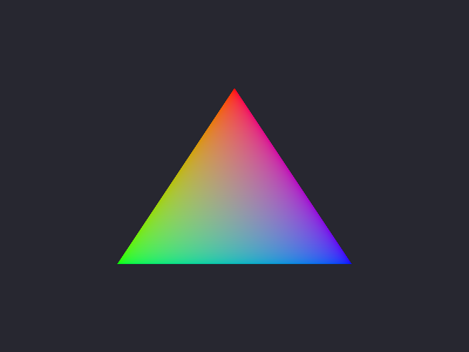</a><br />
<b>02</b> — First Triangle
</td>
<td align="center">
<a href="lessons/gpu/03-uniforms-and-motion/">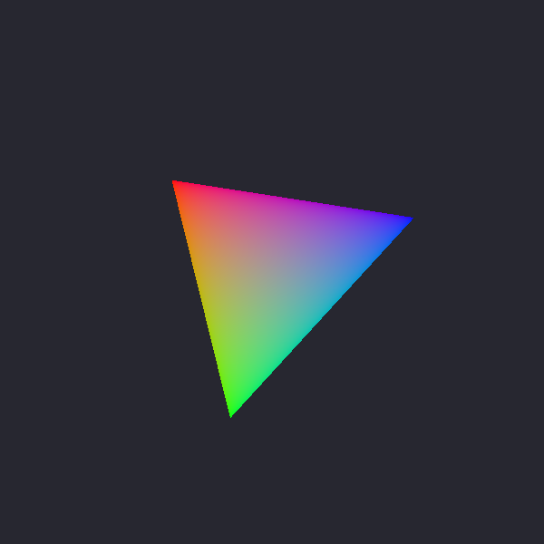</a><br />
<b>03</b> — Uniforms &amp; Motion
</td>
</tr>
<tr>
<td align="center">
<a href="lessons/gpu/04-textures-and-samplers/"></a><br />
<b>04</b> — Textures &amp; Samplers
</td>
<td align="center">
<a href="lessons/gpu/05-mipmaps/"></a><br />
<b>05</b> — Mipmaps
</td>
<td align="center">
<a href="lessons/gpu/06-depth-and-3d/">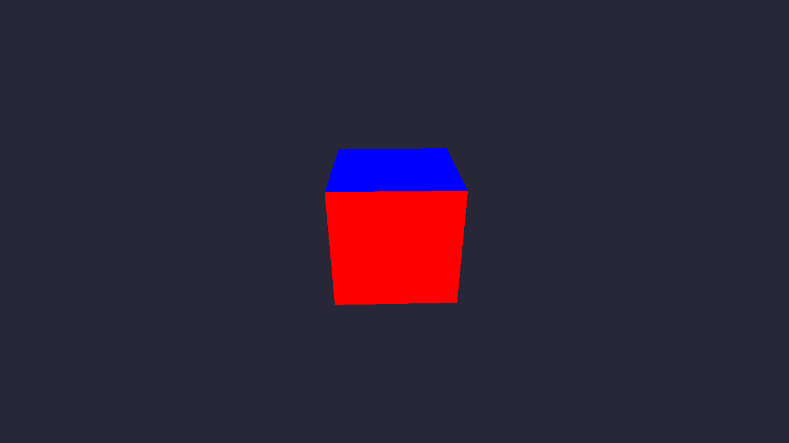</a><br />
<b>06</b> — Depth &amp; 3D
</td>
</tr>
<tr>
<td align="center">
<a href="lessons/gpu/07-camera-and-input/"></a><br />
<b>07</b> — Camera &amp; Input
</td>
<td align="center">
<a href="lessons/gpu/08-mesh-loading/"></a><br />
<b>08</b> — Mesh Loading
</td>
<td align="center">
<a href="lessons/gpu/09-scene-loading/">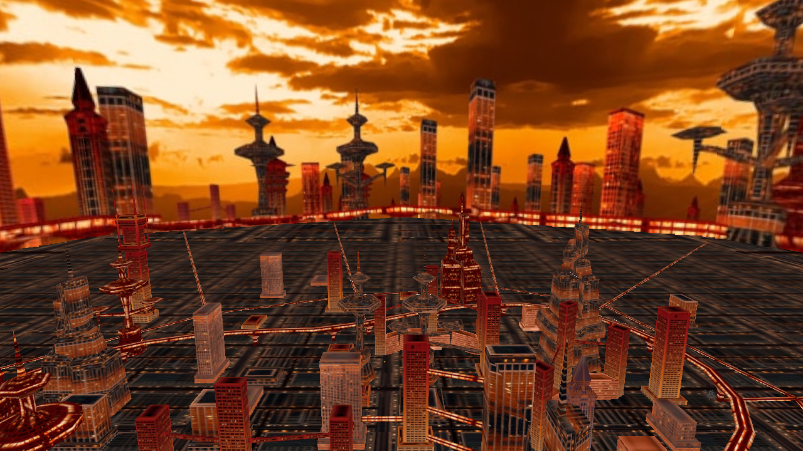</a><br />
<b>09</b> — Scene Loading
</td>
</tr>
<tr>
<td align="center">
<a href="lessons/gpu/10-basic-lighting/"></a><br />
<b>10</b> — Basic Lighting
</td>
<td align="center">
<a href="lessons/gpu/11-compute-shaders/"></a><br />
<b>11</b> — Compute Shaders
</td>
<td align="center">
<a href="lessons/gpu/12-shader-grid/">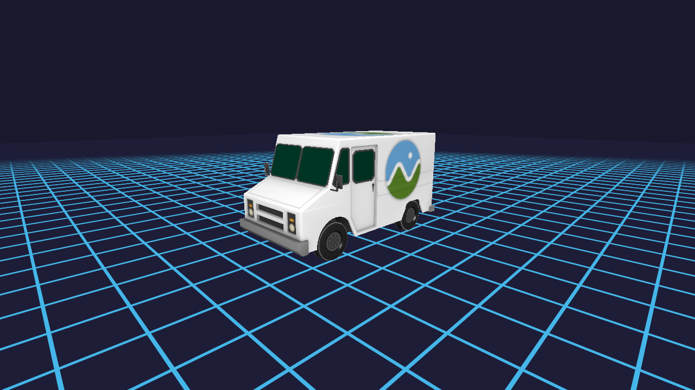</a><br />
<b>12</b> — Shader Grid
</td>
</tr>
<tr>
<td align="center">
<a href="lessons/gpu/13-instanced-rendering/"></a><br />
<b>13</b> — Instanced Rendering
</td>
<td align="center">
<a href="lessons/gpu/14-environment-mapping/">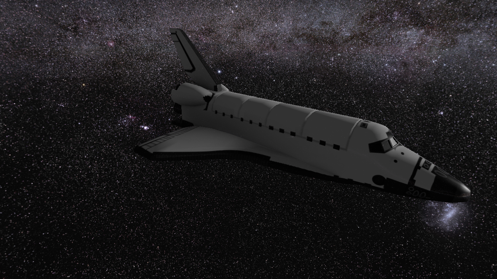</a><br />
<b>14</b> — Environment Mapping
</td>
<td align="center">
<a href="lessons/gpu/15-cascaded-shadow-maps/"></a><br />
<b>15</b> — Shadow Maps
</td>
</tr>
<tr>
<td align="center">
<a href="lessons/gpu/16-blending/"></a><br />
<b>16</b> — Blending
</td>
<td align="center">
<a href="lessons/gpu/17-normal-maps/">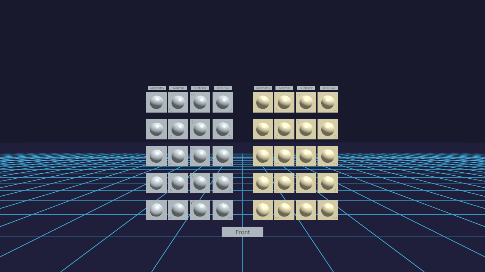</a><br />
<b>17</b> — Normal Maps
</td>
<td align="center">
<a href="lessons/gpu/18-blinn-phong-materials/"></a><br />
<b>18</b> — Materials
</td>
</tr>
<tr>
<td align="center">
<a href="lessons/gpu/19-debug-lines/">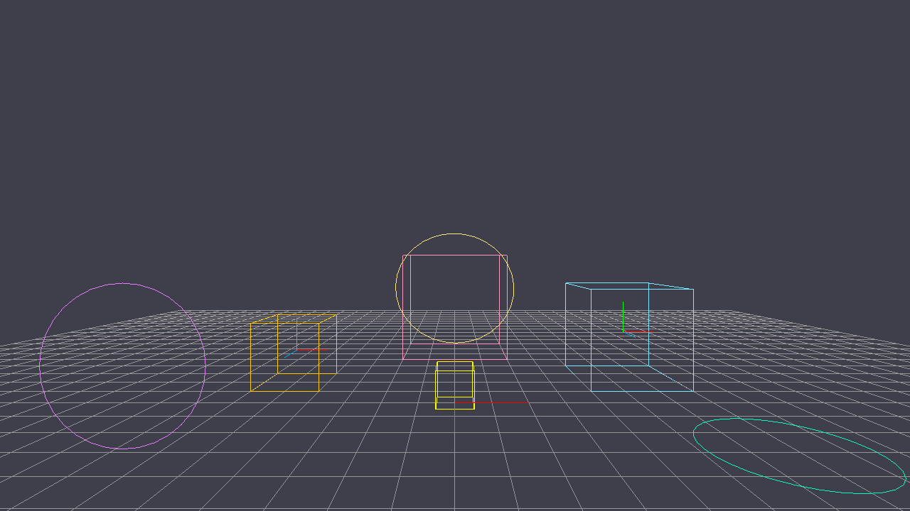</a><br />
<b>19</b> — Debug Lines
</td>
<td align="center">
<a href="lessons/gpu/20-linear-fog/">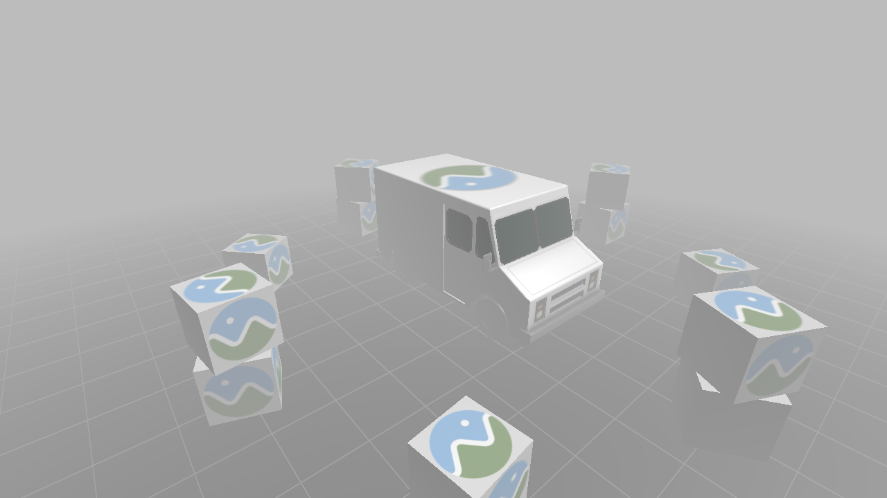</a><br />
<b>20</b> — Linear Fog
</td>
<td align="center">
<a href="lessons/gpu/21-hdr-tone-mapping/">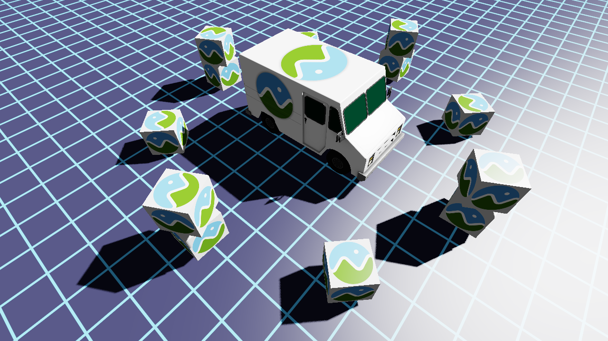</a><br />
<b>21</b> — HDR &amp; Tone Mapping
</td>
</tr>
<tr>
<td align="center">
<a href="lessons/gpu/22-bloom/">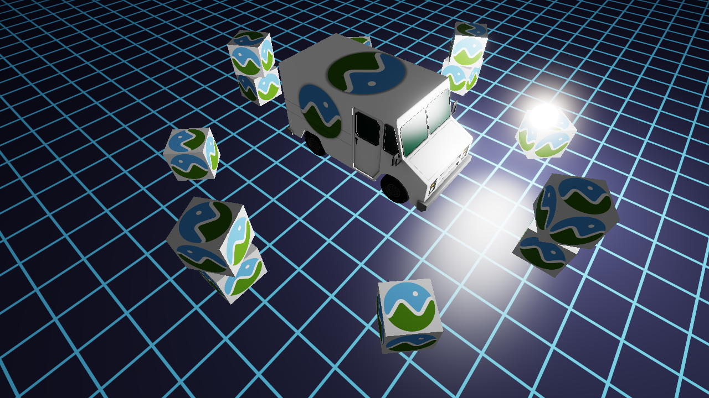</a><br />
<b>22</b> — Bloom
</td>
<td align="center">
<a href="lessons/gpu/23-point-light-shadows/"></a><br />
<b>23</b> — Point Light Shadows
</td>
<td align="center">
<a href="lessons/gpu/24-gobo-spotlight/"></a><br />
<b>24</b> — Gobo Spotlight
</td>
</tr>
<tr>
<td align="center">
<a href="lessons/gpu/25-shader-noise/">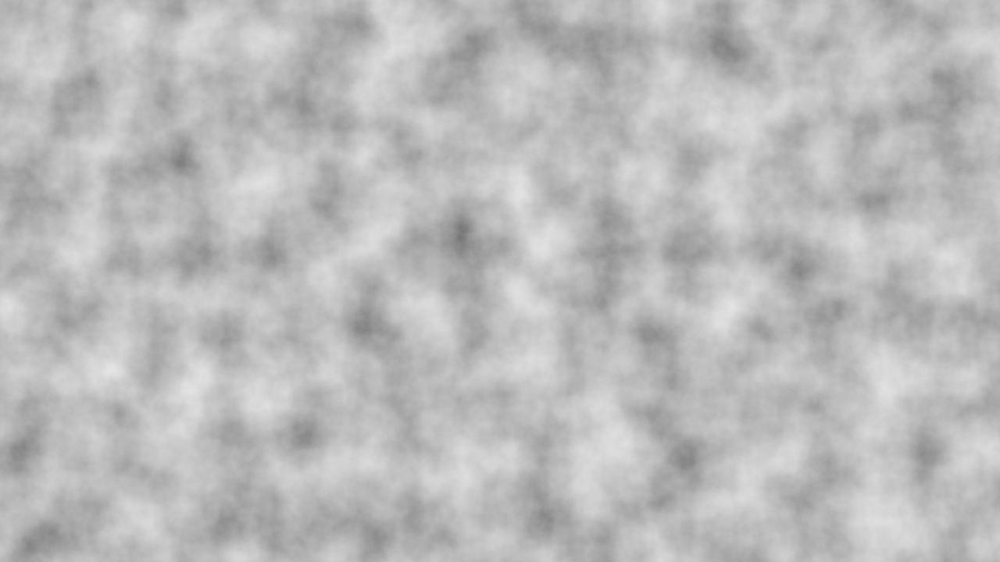</a><br />
<b>25</b> — Shader Noise
</td>
<td align="center">
<a href="lessons/gpu/26-procedural-sky/">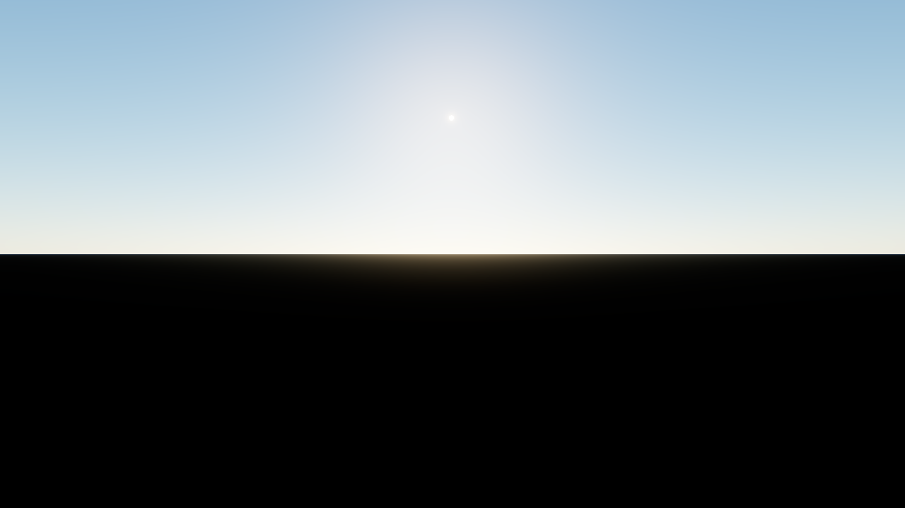</a><br />
<b>26</b> — Procedural Sky
</td>
<td align="center">
<a href="lessons/gpu/27-ssao/"></a><br />
<b>27</b> — SSAO
</td>
</tr>
<tr>
<td align="center">
<a href="lessons/gpu/28-ui-rendering/">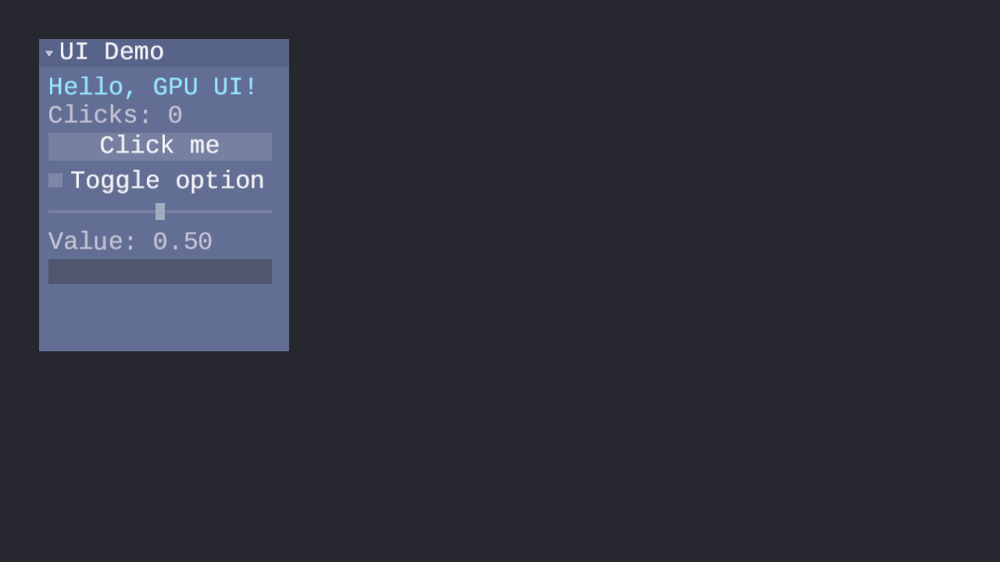</a><br />
<b>28</b> — UI Rendering
</td>
<td align="center">
<a href="lessons/gpu/29-screen-space-reflections/">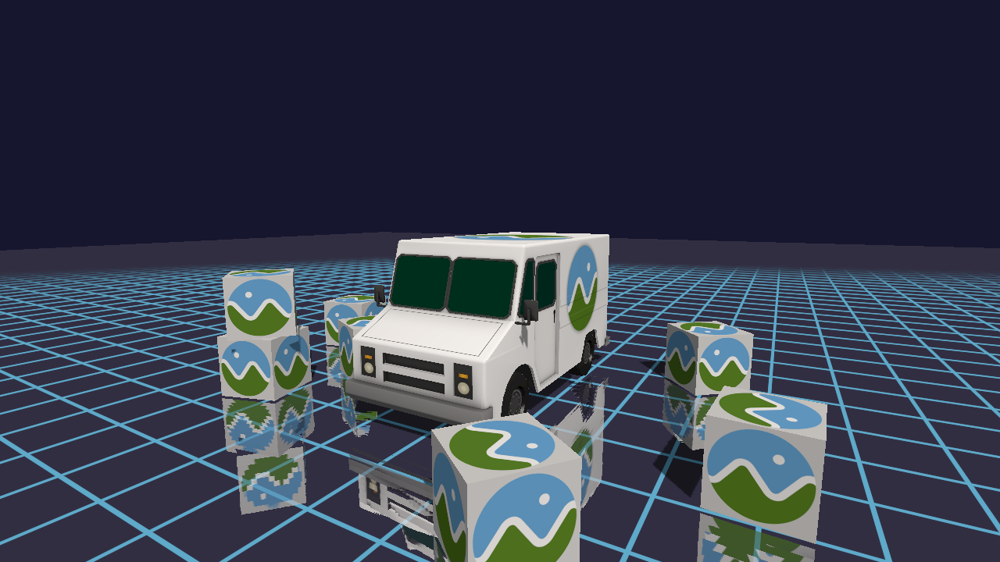</a><br />
<b>29</b> — Screen-Space Reflections
</td>
<td align="center">
<a href="lessons/gpu/30-planar-reflections/">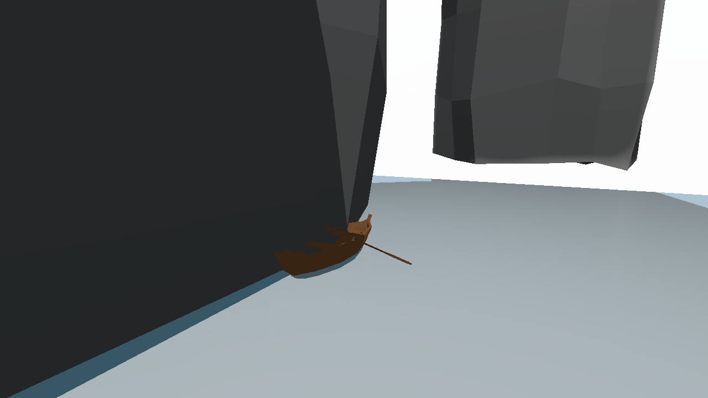</a><br />
<b>30</b> — Planar Reflections
</td>
</tr>
<tr>
<td align="center">
<a href="lessons/gpu/31-transform-animations/">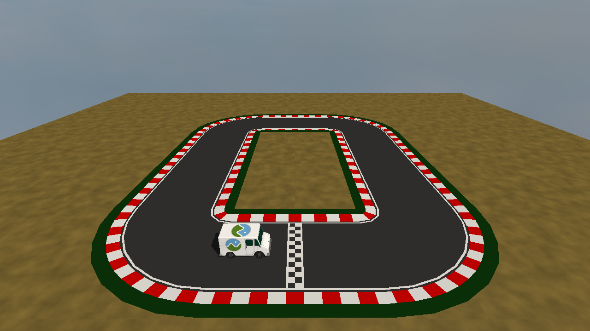</a><br />
<b>31</b> — Transform Animations
</td>
<td align="center">
<a href="lessons/gpu/32-skinning-animations/">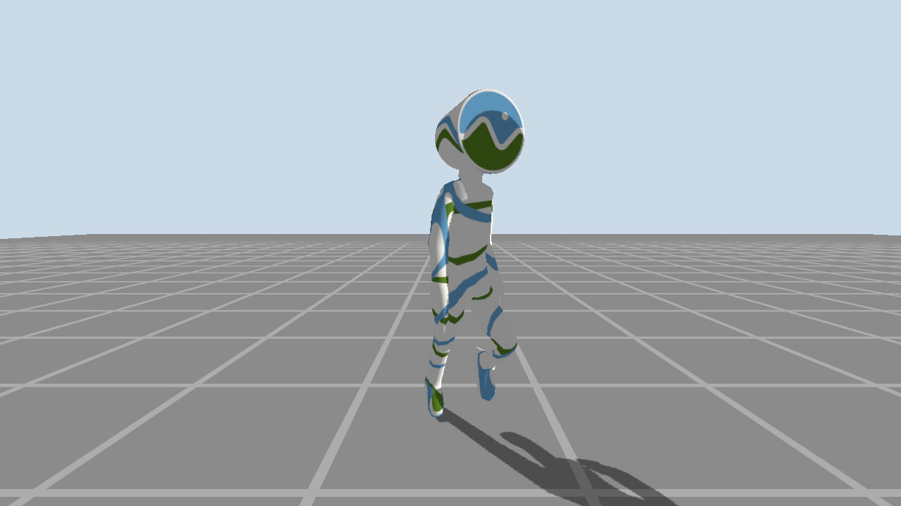</a><br />
<b>32</b> — Skinning Animations
</td>
<td align="center">
<a href="lessons/gpu/33-vertex-pulling/">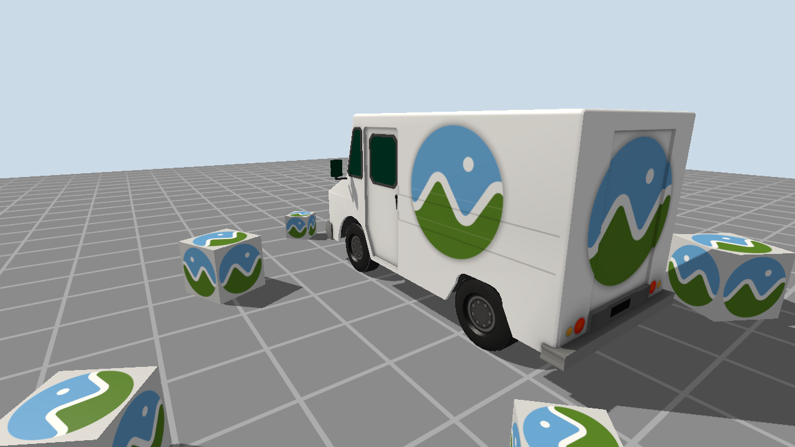</a><br />
<b>33</b> — Vertex Pulling
</td>
</tr>
</table>

### Math Lessons (lessons/math/)

The theory behind the pixels. Vectors, matrices, quaternions, projections,
color spaces, noise functions, and Bézier curves — each with a demo program
and a reusable implementation added to the shared math library.

| # | Topic | What you'll learn |
|---|-------|-------------------|
| 01 | [Vectors](lessons/math/01-vectors/) | Addition, dot/cross products, normalization, lerp |
| 02 | [Coordinate Spaces](lessons/math/02-coordinate-spaces/) | Model, world, view, clip, NDC, screen spaces |
| 03 | [Bilinear Interpolation](lessons/math/03-bilinear-interpolation/) | LINEAR texture filtering, nested lerps, nearest vs linear |
| 04 | [Mipmaps & LOD](lessons/math/04-mipmaps-and-lod/) | Mip chains, trilinear interpolation, LOD selection |
| 05 | [Matrices](lessons/math/05-matrices/) | Identity, translation, scaling, rotation, composition, MVP pipeline |
| 06 | [Projections](lessons/math/06-projections/) | Perspective, orthographic, frustums, clip space, NDC |
| 07 | [Floating Point](lessons/math/07-floating-point/) | IEEE 754, precision, epsilon comparison, z-fighting, float vs double |
| 08 | [Orientation](lessons/math/08-orientation/) | Quaternions, Euler angles, axis-angle, rotation matrices, gimbal lock, slerp |
| 09 | [View Matrix](lessons/math/09-view-matrix/) | View matrix, virtual camera, basis extraction, look-at vs quaternion |
| 10 | [Anisotropy vs Isotropy](lessons/math/10-anisotropy/) | Jacobian, singular values, anisotropic filtering, noise, friction |
| 11 | [Color Spaces](lessons/math/11-color-spaces/) | Gamma correction, linear vs sRGB, luminance, HSL/HSV, CIE XYZ/xyY, gamut, tone mapping |
| 12 | [Hash Functions & White Noise](lessons/math/12-hash-functions/) | Integer hash functions (Wang, PCG, xxHash32), avalanche effect, hash-to-float, seeding, white noise |
| 13 | [Gradient Noise (Perlin & Simplex)](lessons/math/13-gradient-noise/) | Gradient noise algorithm, Perlin improved noise, simplex noise, fBm, lacunarity, persistence, domain warping |
| 14 | [Blue Noise & Low-Discrepancy Sequences](lessons/math/14-blue-noise-sequences/) | Blue noise, Halton/Sobol/R2 sequences, dithering, sampling quality, discrepancy |
| 15 | [Bézier Curves](lessons/math/15-bezier-curves/) | Quadratic and cubic Bézier curves, De Casteljau's algorithm, tangent vectors, arc length, curve splitting, adaptive flattening |

### Engine Lessons (lessons/engine/)

The practical engineering. CMake, C fundamentals, pointers and memory,
header-only libraries, debuggers, RenderDoc, HLSL shared headers, CPU
rasterization, and git version control.

| # | Topic | What you'll learn |
|---|-------|-------------------|
| 01 | [Intro to C](lessons/engine/01-intro-to-c/) | Types, functions, control flow, arrays, strings, pointers, structs, dynamic memory |
| 02 | [CMake Fundamentals](lessons/engine/02-cmake-fundamentals/) | Targets, properties, `add_executable`, `target_link_libraries`, generator expressions, reading build errors |
| 03 | [FetchContent & Dependencies](lessons/engine/03-fetchcontent-dependencies/) | `FetchContent` lifecycle, version pinning with `GIT_TAG`, imported targets, adding dependencies, offline builds |
| 04 | [Pointers & Memory](lessons/engine/04-pointers-and-memory/) | Stack vs heap, `malloc`/`free`, pointer arithmetic, `sizeof`/`offsetof`, vertex buffer uploads |
| 05 | [Header-Only Libraries](lessons/engine/05-header-only-libraries/) | `static inline`, include guards vs `#pragma once`, one-definition rule, how `forge_math.h` works |
| 06 | [Reading Error Messages](lessons/engine/06-reading-error-messages/) | Build pipeline phases, compiler errors, linker errors, runtime crashes, warnings, systematic fixing strategy |
| 07 | [Using a Debugger](lessons/engine/07-using-a-debugger/) | Breakpoints, stepping, inspecting variables, call stack, conditional breakpoints, watchpoints |
| 08 | [Debugging Graphics with RenderDoc](lessons/engine/08-renderdoc/) | GPU frame capture, debug groups and labels, RenderDoc Event Browser, Pipeline State, Texture/Mesh Viewer, in-application API |
| 09 | [HLSL Shared Headers](lessons/engine/09-hlsl-shared-headers/) | `#include` in HLSL, `.hlsli` files, include guards, `-I` search paths, comparison to C headers |
| 10 | [CPU Rasterization](lessons/engine/10-cpu-rasterization/) | Edge function triangle rasterization, barycentric interpolation, texture sampling, alpha blending, indexed drawing, BMP output |
| 11 | [Git & Version Control](lessons/engine/11-git-version-control/) | Content hashing, staging area, branching, merging, `.gitignore`, submodules for dependencies, worktrees for parallel workflows |

See [lessons/engine/README.md](lessons/engine/README.md) for details and the
full topic list. See [PLAN.md](PLAN.md) for the roadmap.

### UI Lessons (lessons/ui/)

Build an immediate-mode UI system from scratch — font parsing, text rendering,
layout, and interactive controls. UI lessons produce CPU-side data (textures,
vertices, indices, UVs) with no GPU dependency.
[GPU Lesson 28](lessons/gpu/28-ui-rendering/) renders the output.

| # | Topic | What you'll learn |
|---|-------|-------------------|
| 01 | [TTF Parsing](lessons/ui/01-ttf-parsing/) | TrueType binary format, table directory, font metrics, cmap character mapping, glyph outlines |
| 02 | [Glyph Rasterization](lessons/ui/02-glyph-rasterization/) | Contour reconstruction, scanline rasterization, non-zero winding rule, quadratic Bézier crossings, supersampled anti-aliasing |
| 03 | [Font Atlas](lessons/ui/03-font-atlas/) | Rectangle packing, shelf algorithm, atlas sizing, UV coordinates, per-glyph metadata, padding for texture bleed, white pixel technique |
| 04 | [Text Layout](lessons/ui/04-text-layout/) | Pen/cursor model, advance widths, bearing offsets, baseline positioning, quad generation, index buffers, line breaking, text alignment, ForgeUiVertex format |
| 05 | [Immediate-Mode Basics](lessons/ui/05-immediate-mode-basics/) | Retained vs immediate mode, declare-then-draw loop, ForgeUiContext, hot/active state machine, hit testing, labels, buttons, white pixel technique |
| 06 | [Checkboxes and Sliders](lessons/ui/06-checkboxes-and-sliders/) | External mutable state, checkbox toggle, slider drag interaction, value mapping (pixel to normalized to user value), active persistence outside widget bounds |
| 07 | [Text Input](lessons/ui/07-text-input/) | Focused ID (keyboard focus), click-to-focus / click-outside-to-unfocus, ForgeUiTextInputState, character insertion and deletion, cursor movement, cursor bar positioning via text measurement |
| 08 | [Layout](lessons/ui/08-layout/) | ForgeUiLayout cursor model, vertical and horizontal directions, padding and spacing, layout stack with push/pop nesting, layout_next() for automatic widget positioning, layout-aware widget variants |
| 09 | [Panels and Scrolling](lessons/ui/09-panels-and-scrolling/) | ForgeUiPanel containers, axis-aligned rect clipping with UV remapping, scroll offset in layout, interactive scrollbar with proportional thumb, mouse wheel input |
| 10 | [Windows](lessons/ui/10-windows/) | ForgeUiWindowState (rect, scroll_y, collapsed, z_order), title bar dragging with grab offset, click-to-front z-ordering, collapse/expand toggle, deferred per-window draw lists, z-aware input routing |
| 11 | [Widget ID System](lessons/ui/11-widget-id-system/) | FNV-1a hashed string IDs, `##` separator for display vs identity, hierarchical scope stacking with push_id/pop_id, automatic scoping in panels and windows, collision-free widget identification |
| 12 | [Font Scaling and Spacing](lessons/ui/12-font-scaling-and-spacing/) | Global scale factor, ForgeUiSpacing struct, FORGE_UI_SCALED macro, atlas rebuild at different scales, themed spacing defaults |
| 13 | [Theming and Color System](lessons/ui/13-theming-and-color-system/) | ForgeUiColor and ForgeUiTheme structs, centralized color palette, WCAG 2.1 contrast ratio math (sRGB linearization, relative luminance), programmatic accessibility validation, theme slot-to-widget mapping |

See [lessons/ui/README.md](lessons/ui/README.md) for details and
[PLAN.md](PLAN.md) for the roadmap.

### Physics Lessons (lessons/physics/)

Real-time physics simulation rendered with SDL GPU. Particle dynamics, rigid
bodies, collision detection, and constraint solving — each lesson is an
interactive 3D program with Blinn-Phong lighting, shadow mapping, and camera
controls. The physics library (`common/physics/`) grows lesson by lesson.

| # | Topic | What you'll learn |
|---|-------|-------------------|
| | *Coming soon* | See [PLAN.md](PLAN.md) for the roadmap |

See [lessons/physics/README.md](lessons/physics/README.md) for details and
[PLAN.md](PLAN.md) for the roadmap.

## Shared Libraries (`common/`)

GPU lessons use shared, header-only libraries in `common/` instead of writing
bespoke code in each lesson. All libraries are documented, readable, and
reusable in your own projects.

### Math Library (`common/math/`)

Vectors, matrices, quaternions, and all the math needed for graphics programming.
See [`common/math/README.md`](common/math/README.md) for the full API reference.

```c
#include "math/forge_math.h"

vec3 position = vec3_create(0.0f, 1.0f, 0.0f);
mat4 rotation = mat4_rotate_z(FORGE_PI / 4.0f);
```

Every function has a corresponding math lesson explaining the concept. When you
need new math functionality, use the `/dev-math-lesson` skill.

### OBJ Parser (`common/obj/`)

Load Wavefront OBJ models into a flat vertex array ready for GPU upload.
See [`common/obj/README.md`](common/obj/README.md) for details.

```c
#include "obj/forge_obj.h"

ForgeObjMesh mesh;
if (forge_obj_load("model.obj", &mesh)) {
    // mesh.vertices ready for GPU upload — draw with SDL_DrawGPUPrimitives
    forge_obj_free(&mesh);
}
```

### glTF Parser (`common/gltf/`)

Load glTF 2.0 scenes with multi-material meshes, scene hierarchy, and indexed
drawing. See [`common/gltf/README.md`](common/gltf/README.md) for details.

```c
#include "gltf/forge_gltf.h"

ForgeGltfScene scene;
if (forge_gltf_load("scene.gltf", &scene)) {
    // scene.nodes[], scene.meshes[], scene.materials[] all populated
    // World transforms computed automatically from the node hierarchy
    forge_gltf_free(&scene);
}
```

### UI Library (`common/ui/`)

Parse TrueType font files, rasterize glyphs into bitmaps, pack them into a
single-channel texture atlas, lay out text, and build immediate-mode UI controls.
See [`common/ui/README.md`](common/ui/README.md) for details.

```c
#include "ui/forge_ui.h"

ForgeUiFont font;
if (forge_ui_ttf_load("font.ttf", &font)) {
    // Build atlas: rasterize + pack + compute UVs
    Uint32 codepoints[] = { 'A', 'B', 'C' };
    ForgeUiFontAtlas atlas;
    if (forge_ui_atlas_build(&font, 32.0f, codepoints, 3, 1, &atlas)) {
        // atlas.pixels — single-channel texture to upload to GPU
        // atlas.glyphs — per-glyph UV rects, bearings, advance widths
        forge_ui_atlas_free(&atlas);
    }
    forge_ui_ttf_free(&font);
}
```

The immediate-mode context (`forge_ui_ctx.h`) builds on the atlas and text
layout to provide labels, buttons, checkboxes, sliders, text input, automatic
layout, and hit testing — generating vertices and indices ready for a single
GPU draw call:

```c
#include "ui/forge_ui_ctx.h"

ForgeUiContext ctx;
forge_ui_ctx_init(&ctx, &atlas);
forge_ui_ctx_begin(&ctx, mouse_x, mouse_y, mouse_down);

if (forge_ui_ctx_button(&ctx, BTN_ID, "Save", save_rect)) {
    save_file();  // runs exactly once per click
}
forge_ui_ctx_checkbox(&ctx, CB_ID, "Audio", &audio_enabled, cb_rect);
forge_ui_ctx_slider(&ctx, SL_ID, &volume, 0.0f, 100.0f, sl_rect);
forge_ui_ctx_text_input(&ctx, TI_ID, &name_state, ti_rect, cursor_visible);

forge_ui_ctx_end(&ctx);
// Render ctx.vertices / ctx.indices with the atlas texture
forge_ui_ctx_free(&ctx);
```

### Physics Library (`common/physics/`)

Particle dynamics, rigid body simulation, collision detection, and contact
resolution. Built lesson by lesson alongside the physics track.
See [`common/physics/README.md`](common/physics/README.md) for details.

```c
#include "physics/forge_physics.h"

ForgePhysicsParticle ball;
forge_physics_particle_init(&ball, 1.0f, (vec3){0, 10, 0});
forge_physics_apply_gravity(&ball, (vec3){0, -9.81f, 0});
forge_physics_integrate(&ball, 1.0f / 60.0f);
```

### Raster Library (`common/raster/`)

Software triangle rasterizer using the edge function method. Supports vertex
color interpolation, grayscale texture sampling, alpha blending, and indexed
drawing — the CPU equivalent of the GPU rendering pipeline.
See [Engine Lesson 10](lessons/engine/10-cpu-rasterization/) for a walkthrough.

```c
#include "raster/forge_raster.h"

ForgeRasterBuffer buf = forge_raster_buffer_create(512, 512);
forge_raster_clear(&buf, 0.1f, 0.1f, 0.1f, 1.0f);

ForgeRasterVertex v0 = {256, 50,  0,0, 1,0,0,1};
ForgeRasterVertex v1 = {100, 400, 0,0, 0,1,0,1};
ForgeRasterVertex v2 = {412, 400, 0,0, 0,0,1,1};
forge_raster_triangle(&buf, &v0, &v1, &v2, NULL);

forge_raster_write_bmp(&buf, "triangle.bmp");
forge_raster_buffer_destroy(&buf);
```

All five libraries are header-only — just include and use. No build
configuration needed.

## Getting Started

### Prerequisites

- **CMake 3.24+**
- **A C compiler** (MSVC, GCC, or Clang)
- **A GPU** with Vulkan, Direct3D 12, or Metal support
- **Python 3** (for helper scripts)

SDL3 is fetched automatically — no manual installation required.

**Verify your environment** with the setup script:

```bash
python scripts/setup.py
```

This checks all required tools, detects the Vulkan SDK and shader compiler,
and reports anything missing. Use `--fix` to install missing Python packages
or `--build` to configure and build in one step:

```bash
python scripts/setup.py --build
```

### Building

```bash
cmake -B build
cmake --build build --config Debug
```

Optionally, initialise the SDL source submodule if you want to browse the
SDL headers and GPU backend code locally (this is for reference only — the
build uses FetchContent):

```bash
git submodule update --init
```

### Running lessons

The easiest way to run a lesson is with the **run script**:

```bash
python scripts/run.py 01                  # by number
python scripts/run.py first-triangle      # by name
python scripts/run.py math/01             # math lesson
python scripts/run.py                     # list all lessons
```

You can also run executables directly:

```bash
# Windows
build\lessons\gpu\01-hello-window\Debug\01-hello-window.exe

# Linux / macOS
./build/lessons/gpu/01-hello-window/01-hello-window
```

## Testing

The shared libraries have automated tests covering math operations, OBJ parsing,
glTF parsing, CPU rasterization, and UI systems.

**Run all tests:**

```bash
cd build
ctest -C Debug --output-on-failure
```

**Run a specific test suite:**

```bash
cmake --build build --config Debug --target test_math
cmake --build build --config Debug --target test_obj
cmake --build build --config Debug --target test_gltf
cmake --build build --config Debug --target test_raster
cmake --build build --config Debug --target test_ui
cmake --build build --config Debug --target test_ui_ctx
```

All tests use epsilon comparison for floating-point accuracy and return proper
exit codes for CI/CD integration.

See [tests/math/README.md](tests/math/README.md) for adding new tests.

## Shader compilation

Pre-compiled shader bytecodes are checked in, so you **don't need any extra
tools just to build and run the lessons**. If you want to modify the HLSL
shader source, you'll need:

- **[Vulkan SDK](https://vulkan.lunarg.com/)** — provides `dxc` with SPIR-V
  support (the Windows SDK `dxc` can only compile DXIL, not SPIR-V)

After installing, make sure the `VULKAN_SDK` environment variable is set
(the installer does this automatically). On Windows the default location is:

```text
C:\VulkanSDK\<version>\Bin\dxc.exe
```

> **Heads up:** If you just type `dxc` and get *"SPIR-V CodeGen not
> available"*, you're hitting the Windows SDK `dxc` instead of the Vulkan
> SDK one. Use the full path to the Vulkan SDK `dxc` or put its `Bin/`
> directory earlier on your PATH.

### Compiling shaders

The **shader compilation script** handles everything — finds `dxc`, compiles
each HLSL file to both SPIR-V and DXIL, and generates C byte-array headers:

```bash
python scripts/compile_shaders.py            # all lessons
python scripts/compile_shaders.py 02         # just lesson 02
python scripts/compile_shaders.py -v         # verbose (show dxc commands)
```

## Project Structure

```text
forge-gpu/
├── lessons/
│   ├── math/              Math lessons — standalone programs + theory
│   │   ├── README.md      Overview and navigation
│   │   └── NN-concept/    Each concept: program, README, updates math lib
│   ├── engine/            Engine lessons — build systems, C, debugging
│   │   ├── README.md      Overview and navigation
│   │   └── NN-topic/      Each topic: example project, README, common errors
│   ├── ui/                UI lessons — fonts, text, immediate-mode controls
│   │   ├── README.md      Overview and navigation
│   │   └── NN-topic/      Each topic: program, README, data output
│   ├── physics/           Physics lessons — simulation rendered with SDL GPU
│   └── gpu/               GPU lessons — SDL API and rendering
│       ├── 01-hello-window/
│       ├── ...
│       ├── 24-gobo-spotlight/
│       ├── 25-shader-noise/
│       ├── 26-procedural-sky/
│       ├── 27-ssao/
│       ├── 28-ui-rendering/
│       ├── 29-screen-space-reflections/
│       ├── 30-planar-reflections/
│       ├── 31-transform-animations/
│       └── 32-skinning-animations/
├── common/
│   ├── math/              Math library (vectors, matrices, quaternions)
│   │   ├── forge_math.h   All math operations (header-only)
│   │   ├── README.md      API reference and usage guide
│   │   └── DESIGN.md      Design decisions and conventions
│   ├── obj/               OBJ parser (Wavefront .obj files)
│   │   ├── forge_obj.h    Parser implementation (header-only)
│   │   └── README.md      Usage guide and supported features
│   ├── gltf/              glTF parser (glTF 2.0 scenes)
│   │   ├── forge_gltf.h   Parser implementation (header-only)
│   │   └── README.md      Usage guide, scene hierarchy, materials
│   ├── ui/                UI library (font parsing, atlas, immediate-mode controls)
│   │   ├── forge_ui.h     TTF parser, rasterizer, atlas packer (header-only)
│   │   ├── forge_ui_ctx.h Immediate-mode context: labels, buttons, checkboxes, sliders, text input, layout, panels
│   │   └── README.md      Usage guide and supported features
│   ├── physics/           Physics library (particles, rigid bodies, collisions)
│   │   ├── forge_physics.h Physics simulation (header-only)
│   │   └── README.md      API reference and design
│   ├── raster/            CPU triangle rasterizer (edge function method)
│   │   └── forge_raster.h Rasterizer implementation (header-only)
│   ├── capture/           Screenshot/GIF capture utility
│   │   └── forge_capture.h
│   └── forge.h            Shared utilities for lessons
├── tests/                 Test suite (CTest integration)
│   ├── math/              Math library tests
│   ├── obj/               OBJ parser tests
│   ├── gltf/              glTF parser tests
│   ├── raster/            CPU rasterizer tests
│   ├── ui/                UI library tests (TTF parser, immediate-mode context)
│   └── physics/           Physics library tests
├── .claude/skills/        Claude Code skills (AI-invokable patterns)
│   ├── dev-math-lesson/   Add math concept + lesson + update library
│   ├── dev-ui-lesson/     Add UI lesson (fonts, text, controls)
│   ├── dev-new-lesson/    Create new GPU lesson
│   ├── forge-sdl-gpu-setup/ Scaffold SDL3 GPU application
│   └── ...
├── scripts/               Helper scripts (run, setup, shader compilation)
├── third_party/SDL/       SDL3 source (submodule, for reference)
├── PLAN.md                Lesson roadmap and progress
├── CLAUDE.md              AI coding guidelines for this project
└── CMakeLists.txt         Root build configuration
```

**How it fits together:**

- **Math lessons** teach concepts and add to `common/math/`
- **Engine lessons** teach build systems, C fundamentals, debugging, and project structure
- **UI lessons** build an immediate-mode UI system (fonts, text, controls) as CPU-side data
- **Physics lessons** simulate dynamics and render with SDL GPU, building `common/physics/`
- **GPU lessons** use the shared libraries, render UI data, and link to math lessons for theory
- **Parsers** (`common/obj/`, `common/gltf/`) load 3D models for GPU lessons
- **Rasterizer** (`common/raster/`) software-renders triangles for testing and visualization
- **Skills** automate lesson creation and teach AI agents the patterns
- **Shared libraries** are reusable in lessons and your own projects

## Skills — Build with AI

Key lessons distill into **[Claude Code skills](https://code.claude.com/docs/en/skills)**
that teach AI agents the same patterns. Copy `.claude/skills/` into your own
project to enable Claude to build games and tools with you.

### Building skills (use these in your projects)

| Skill | Invoke with | What it does |
|-------|-------------|--------------|
| [forge-sdl-gpu-setup](.claude/skills/forge-sdl-gpu-setup/SKILL.md) | `/forge-sdl-gpu-setup` | Scaffold SDL3 GPU app with window, swapchain, render loop |
| [forge-first-triangle](.claude/skills/forge-first-triangle/SKILL.md) | `/forge-first-triangle` | Add vertex buffers, shaders, pipeline — draw colored geometry |
| [forge-uniforms-and-motion](.claude/skills/forge-uniforms-and-motion/SKILL.md) | `/forge-uniforms-and-motion` | Pass data to shaders with push uniforms, animate geometry |
| [forge-textures-and-samplers](.claude/skills/forge-textures-and-samplers/SKILL.md) | `/forge-textures-and-samplers` | Load images, create GPU textures/samplers, draw textured geometry |
| [forge-mipmaps](.claude/skills/forge-mipmaps/SKILL.md) | `/forge-mipmaps` | Create mipmapped textures, trilinear filtering, LOD control |
| [forge-depth-and-3d](.claude/skills/forge-depth-and-3d/SKILL.md) | `/forge-depth-and-3d` | Depth buffer, MVP pipeline, 3D rendering, back-face culling |
| [forge-camera-and-input](.claude/skills/forge-camera-and-input/SKILL.md) | `/forge-camera-and-input` | First-person camera, keyboard/mouse input, delta time |
| [forge-mesh-loading](.claude/skills/forge-mesh-loading/SKILL.md) | `/forge-mesh-loading` | Load OBJ models, textured mesh rendering, file-based textures |
| [forge-scene-loading](.claude/skills/forge-scene-loading/SKILL.md) | `/forge-scene-loading` | Load glTF scenes, multi-material meshes, scene hierarchy, indexed rendering |
| [forge-basic-lighting](.claude/skills/forge-basic-lighting/SKILL.md) | `/forge-basic-lighting` | Blinn-Phong lighting, ambient/diffuse/specular, normal transformation |
| [forge-compute-shaders](.claude/skills/forge-compute-shaders/SKILL.md) | `/forge-compute-shaders` | Compute pipelines, storage textures, dispatch, compute-then-render pattern |
| [forge-shader-grid](.claude/skills/forge-shader-grid/SKILL.md) | `/forge-shader-grid` | Procedural grid, anti-aliased lines with fwidth/smoothstep, multiple pipelines |
| [forge-instanced-rendering](.claude/skills/forge-instanced-rendering/SKILL.md) | `/forge-instanced-rendering` | Instance buffers, per-instance transforms, multi-model scenes, efficient draw calls |
| [forge-environment-mapping](.claude/skills/forge-environment-mapping/SKILL.md) | `/forge-environment-mapping` | Cube map textures, skybox rendering, environment reflections, multi-pipeline render pass |
| [forge-blending](.claude/skills/forge-blending/SKILL.md) | `/forge-blending` | Alpha blending, alpha testing, blend state configuration, transparency sorting |
| [forge-cascaded-shadow-maps](.claude/skills/forge-cascaded-shadow-maps/SKILL.md) | `/forge-cascaded-shadow-maps` | Shadow mapping, cascade frustum splitting, PCF soft shadows, depth-only passes |
| [forge-bloom](.claude/skills/forge-bloom/SKILL.md) | `/forge-bloom` | Jimenez dual-filter bloom, 13-tap downsample, Karis averaging, tent-filter upsample, additive blending |
| [forge-point-light-shadows](.claude/skills/forge-point-light-shadows/SKILL.md) | `/forge-point-light-shadows` | Omnidirectional shadow mapping, cube map depth textures, linear depth storage, per-light shadow sampling |
| [forge-gobo-spotlight](.claude/skills/forge-gobo-spotlight/SKILL.md) | `/forge-gobo-spotlight` | Projected-texture spotlight, cone falloff, gobo pattern projection, single 2D shadow map |
| [forge-shader-noise](.claude/skills/forge-shader-noise/SKILL.md) | `/forge-shader-noise` | GPU noise functions (hash, value, Perlin, fBm, domain warping), procedural textures, dithering |
| [forge-normal-maps](.claude/skills/forge-normal-maps/SKILL.md) | `/forge-normal-maps` | Tangent-space normal mapping, TBN matrix, per-texel surface detail |
| [forge-blinn-phong-materials](.claude/skills/forge-blinn-phong-materials/SKILL.md) | `/forge-blinn-phong-materials` | Per-material Blinn-Phong lighting, material property systems |
| [forge-debug-lines](.claude/skills/forge-debug-lines/SKILL.md) | `/forge-debug-lines` | Immediate-mode debug line drawing, grids, axes, wireframe boxes |
| [forge-linear-fog](.claude/skills/forge-linear-fog/SKILL.md) | `/forge-linear-fog` | Depth-based distance fog (linear, exponential, exponential-squared) |
| [forge-hdr-tone-mapping](.claude/skills/forge-hdr-tone-mapping/SKILL.md) | `/forge-hdr-tone-mapping` | HDR rendering with Reinhard/ACES tone mapping, exposure control |
| [forge-procedural-sky](.claude/skills/forge-procedural-sky/SKILL.md) | `/forge-procedural-sky` | Physically-based procedural sky, atmospheric scattering, LUT transmittance |
| [forge-ssao](.claude/skills/forge-ssao/SKILL.md) | `/forge-ssao` | Screen-space ambient occlusion, hemisphere kernel sampling, depth reconstruction, noise rotation, blur pass, AO compositing |
| [forge-ui-rendering](.claude/skills/forge-ui-rendering/SKILL.md) | `/forge-ui-rendering` | Immediate-mode UI on GPU, font atlas, alpha blending, dynamic buffers |
| [forge-screen-space-reflections](.claude/skills/forge-screen-space-reflections/SKILL.md) | `/forge-screen-space-reflections` | SSR ray marching, G-buffer, deferred shading |
| [forge-planar-reflections](.claude/skills/forge-planar-reflections/SKILL.md) | `/forge-planar-reflections` | Mirror camera, oblique clipping, Fresnel blending |
| [forge-transform-animations](.claude/skills/forge-transform-animations/SKILL.md) | `/forge-transform-animations` | Keyframe animation, glTF loading, quaternion slerp, path following |
| [forge-skinning-animations](.claude/skills/forge-skinning-animations/SKILL.md) | `/forge-skinning-animations` | Skeletal skinning, joint hierarchies, inverse bind matrices, blend weights |
| [forge-auto-widget-layout](.claude/skills/forge-auto-widget-layout/SKILL.md) | `/forge-auto-widget-layout` | Automatic widget layout with vertical/horizontal stacking, padding, spacing, and nested layouts |
| [forge-draggable-windows](.claude/skills/forge-draggable-windows/SKILL.md) | `/forge-draggable-windows` | Draggable, z-ordered, collapsible windows for immediate-mode UI |

### Development skills (used within this repo)

| Skill | Invoke with | What it does |
|-------|-------------|--------------|
| [dev-math-lesson](.claude/skills/dev-math-lesson/SKILL.md) | `/dev-math-lesson` | Add math concept: lesson + program + update library |
| [dev-engine-lesson](.claude/skills/dev-engine-lesson/SKILL.md) | `/dev-engine-lesson` | Add engine lesson: build systems, C, debugging, project structure |
| [dev-new-lesson](.claude/skills/dev-new-lesson/SKILL.md) | `/dev-new-lesson` | Scaffold a new GPU lesson with all required files |
| [dev-ui-lesson](.claude/skills/dev-ui-lesson/SKILL.md) | `/dev-ui-lesson` | Add UI lesson: fonts, text, immediate-mode controls |
| [dev-physics-lesson](.claude/skills/dev-physics-lesson/SKILL.md) | `/dev-physics-lesson` | Add physics lesson: simulation rendered with SDL GPU |
| [dev-publish-lesson](.claude/skills/dev-publish-lesson/SKILL.md) | `/dev-publish-lesson` | Validate, commit, and PR a completed lesson |
| [dev-create-pr](.claude/skills/dev-create-pr/SKILL.md) | `/dev-create-pr` | Stage changes, create branch, commit, and open a pull request |
| [dev-review-pr](.claude/skills/dev-review-pr/SKILL.md) | `/dev-review-pr` | Handle PR review feedback and merge when ready |
| [dev-final-pass](.claude/skills/dev-final-pass/SKILL.md) | `/dev-final-pass` | Quality review pass before publishing a lesson |
| [dev-ui-review](.claude/skills/dev-ui-review/SKILL.md) | `/dev-ui-review` | Code quality and documentation review for UI lessons |
| [dev-create-diagram](.claude/skills/dev-create-diagram/SKILL.md) | `/dev-create-diagram` | Create matplotlib diagrams with the project's dark theme |
| [dev-add-screenshot](.claude/skills/dev-add-screenshot/SKILL.md) | `/dev-add-screenshot` | Capture a screenshot for a lesson and update its README |
| [dev-markdown-lint](.claude/skills/dev-markdown-lint/SKILL.md) | `/dev-markdown-lint` | Check and fix Markdown formatting issues |
| [dev-reset-workspace](.claude/skills/dev-reset-workspace/SKILL.md) | `/dev-reset-workspace` | Clean workspace for fresh work from main branch |

**How to use:**

1. Copy `.claude/skills/` into your project root
2. Tell Claude: *"use the forge-sdl-gpu-setup skill to create an SDL GPU application"*
3. Or just type `/forge-sdl-gpu-setup` in the chat
4. Claude can also invoke skills automatically when relevant

**Philosophy:** Skills teach AI agents the same patterns you learned from
lessons. When Claude knows the fundamentals (from skills), and you understand
them too (from lessons), you can build together confidently.

## Learning with Claude

This project is designed for exploration with an AI assistant. Using
[Claude Code](https://claude.ai/code) or [Claude](https://claude.ai), you can:

**While learning:**

- *"What does SDL_ClaimWindowForGPUDevice actually do?"*
- *"Why do we need a transfer buffer to upload vertex data?"*
- *"Explain the dot product and show me the math lesson"*

**While building:**

- *"Use the forge-sdl-gpu-setup skill to create an SDL GPU application"*
- *"Add a rotating quad using the math library"*
- *"Help me add textures to my renderer"*

Claude has access to the lessons, skills, math library, and SDL reference code.
When you understand the fundamentals AND Claude knows the patterns (via skills),
you can build together productively. If you hit a problem, dive into the
relevant lesson to understand it better.

## License

[zlib](LICENSE) — the same license as SDL itself.
