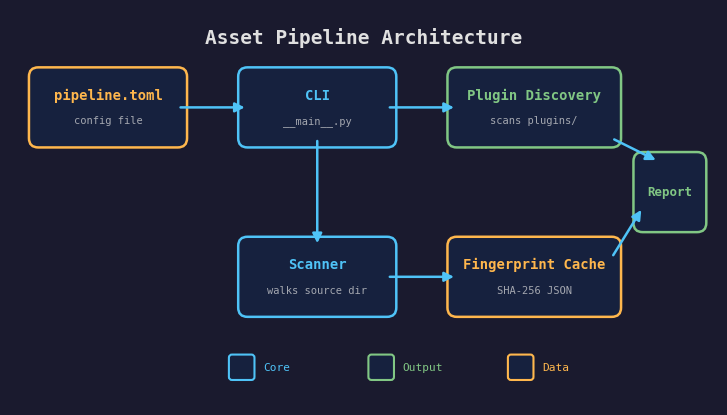

# Lesson 01 — Pipeline Scaffold

Build the foundation for an asset processing pipeline: a Python CLI that
discovers plugins, scans source files, fingerprints them by content hash, and
reports what needs processing.

## What you'll learn

- Structure a Python CLI project with `pyproject.toml` and `argparse`
- Design a plugin system where each asset type registers a handler class
- Scan directories recursively and match files to plugins by extension
- Fingerprint files with SHA-256 content hashes for incremental builds
- Load project configuration from TOML files
- Classify assets as new, changed, or unchanged against a persistent cache

## Result

```text
$ python -m pipeline -v
pipeline: Loaded config from pipeline.toml
pipeline: Discovered 2 plugin(s) from plugins
pipeline: Loaded 2 plugin(s)
pipeline:   texture       .png, .jpg, .jpeg, .tga, .bmp
pipeline:   mesh          .obj, .gltf, .glb
pipeline: Scanned 3 file(s) in assets/raw — 3 new, 0 changed, 0 unchanged

Scanned 3 file(s) in assets/raw:
  3 new
  0 changed
  0 unchanged

  [NEW]      models/cube.obj  (mesh)
  [NEW]      textures/detail.tga  (texture)
  [NEW]      textures/hero.png  (texture)

3 file(s) would be processed.
```

Running a second time with no file changes:

```text
$ python -m pipeline
pipeline: Loaded config from pipeline.toml
...
Scanned 3 file(s) in assets/raw:
  0 new
  0 changed
  3 unchanged

All files up to date — nothing to process.
```

## Architecture



The pipeline has four components that this lesson builds one at a time:

1. **Configuration** (`config.py`) — Reads `pipeline.toml` and produces a
   typed `PipelineConfig` dataclass.
2. **Plugin registry** (`plugin.py`) — Discovers plugin `.py` files, imports
   them, and registers `AssetPlugin` subclasses by name and extension.
3. **Scanner** (`scanner.py`) — Walks the source directory, fingerprints each
   file with SHA-256, and compares against a persistent JSON cache.
4. **CLI** (`__main__.py`) — Ties everything together with `argparse`.

## Project structure

```text
01-pipeline-scaffold/
  pipeline.toml              # Project configuration
  pyproject.toml             # Python package definition
  pipeline/
    __init__.py              # Package marker
    __main__.py              # CLI entry point
    config.py                # TOML config loader
    plugin.py                # Plugin base class, registry, discovery
    scanner.py               # File scanning and fingerprinting
  plugins/
    texture.py               # Example texture plugin (no-op)
    mesh.py                  # Example mesh plugin (no-op)
  assets/
    raw/                     # Sample source assets for testing
      textures/
        hero.png
        detail.tga
      models/
        cube.obj
  tests/
    test_config.py           # Config loading and validation tests
    test_plugin.py           # Plugin registration and discovery tests
    test_scanner.py          # Fingerprinting and scanning tests
```

## Configuration — `pipeline.toml`

The pipeline reads settings from a TOML file. TOML maps naturally to the
nested key-value structure of pipeline settings and is human-readable,
diff-friendly, and supported natively in Python 3.11+ via `tomllib`.

```toml
[pipeline]
source_dir = "assets/raw"       # Where raw source assets live
output_dir = "assets/processed" # Where processed assets go
cache_dir  = ".forge-cache"     # Fingerprint cache for incremental builds

[texture]
max_size = 2048
generate_mipmaps = true

[mesh]
deduplicate = true
generate_tangents = true
```

The `[pipeline]` section holds core settings. Every other section is a
per-plugin configuration block — the config loader collects them into a
`plugin_settings` dictionary without interpreting them. Each plugin reads
its own section when it processes files.

```python
@dataclass
class PipelineConfig:
    source_dir: Path
    output_dir: Path
    cache_dir: Path
    plugin_settings: dict[str, dict]  # e.g. {"texture": {"max_size": 2048}}
    raw: dict                         # full parsed TOML for forward-compat
```

The `raw` field preserves the entire TOML tree so plugins can read keys
the core doesn't know about. This keeps the config loader decoupled from
plugin internals.

## Plugin system — `plugin.py`

### Base class

Every plugin inherits from `AssetPlugin` and declares a `name` and list of
`extensions`:

```python
class AssetPlugin:
    name: str = ""
    extensions: list[str] = []

    def process(self, source: Path, output_dir: Path, settings: dict) -> AssetResult:
        raise NotImplementedError
```

The `process` method transforms a source file into a processed output. In this
lesson the example plugins are no-ops — real processing is added in Lessons 02
(textures) and 03 (meshes).

### Registry

The `PluginRegistry` stores plugins by name and maps file extensions to their
handlers:

```python
registry = PluginRegistry()
registry.register(TexturePlugin())

plugin = registry.get_by_extension(".png")   # -> TexturePlugin
plugin = registry.get_by_name("texture")     # -> TexturePlugin
```

Registration validates that:

- The plugin has a non-empty `name`
- No other plugin has the same name
- No other plugin has already claimed any of the same extensions

This prevents silent conflicts when two plugins try to handle the same file
type.

### Discovery

Instead of hardcoding which plugins to load, the registry scans a directory
for `.py` files and imports them:

```python
count = registry.discover(Path("plugins/"))
```

Discovery works by:

1. Listing all `.py` files in the plugins directory (skipping `_`-prefixed files)
2. Importing each file as a module using `importlib`
3. Inspecting the module for `AssetPlugin` subclasses
4. Instantiating and registering each one

This means adding support for a new asset type is as simple as dropping a new
`.py` file into the `plugins/` directory. No core code changes required.

### Writing a plugin

Create a file in `plugins/` with a class inheriting from `AssetPlugin`:

```python
# plugins/audio.py
from pipeline.plugin import AssetPlugin, AssetResult

class AudioPlugin(AssetPlugin):
    name = "audio"
    extensions = [".wav", ".ogg", ".mp3"]

    def process(self, source, output_dir, settings):
        output = output_dir / source.name
        return AssetResult(source=source, output=output)
```

The plugin is automatically discovered on the next pipeline run.

## Scanning and fingerprinting — `scanner.py`

### Why content hashes, not timestamps?

Many build systems use file modification timestamps to detect changes.
Timestamps are fast to check but unreliable:

| Problem | Content hash | Timestamp |
|---|---|---|
| `git clone` resets all timestamps | Correct | False positive (rebuilds everything) |
| `touch` a file without changing it | Correct (skips it) | False positive (rebuilds it) |
| Copy files between machines | Correct | False positive |
| CI environment | Correct | Unpredictable |

Content hashing with SHA-256 is deterministic and portable. The same bytes
always produce the same hash, regardless of when or where the file was created.

### How the scanner works

```python
files = scan(source_dir, supported_extensions, cache)
```

1. **Walk** the source directory recursively with `Path.rglob("*")`
2. **Filter** by extension — only process files that match a registered plugin
3. **Hash** each file's contents with SHA-256 (reading in 64 KiB chunks)
4. **Compare** against the fingerprint cache to classify each file:
   - **NEW** — not in the cache (first time seeing this file)
   - **CHANGED** — hash differs from the cached value
   - **UNCHANGED** — hash matches (skip processing)

### Fingerprint cache

The cache is a JSON file mapping relative paths to SHA-256 hex digests:

```json
{
  "models/cube.obj": "a1b2c3...",
  "textures/hero.png": "d4e5f6..."
}
```

Paths use POSIX-style forward slashes so the cache is cross-platform. The
cache file lives in the `cache_dir` specified in `pipeline.toml` (default:
`.forge-cache/fingerprints.json`).

## CLI — `__main__.py`

The CLI ties the three subsystems together:

```text
$ python -m pipeline --help
usage: forge-pipeline [-h] [-c CONFIG] [--plugins-dir PLUGINS_DIR]
                      [--source-dir SOURCE_DIR] [--dry-run] [-v]

Asset processing pipeline for forge-gpu.

options:
  -h, --help            show this help message and exit
  -c, --config CONFIG   Path to the TOML configuration file
  --plugins-dir DIR     Directory containing plugin .py files
  --source-dir DIR      Override the source directory
  --dry-run             Scan and report without processing
  -v, --verbose         Enable debug logging
```

The execution flow:

1. Parse CLI arguments
2. Load `pipeline.toml` (or use defaults)
3. Discover and register plugins from the plugins directory
4. Scan the source directory and fingerprint files
5. Compare against the cache and report status
6. Update the cache (so unchanged files are skipped on the next run)

## Running

### Setup

```bash
cd lessons/assets/01-pipeline-scaffold
pip install -e ".[dev]"
```

### Run the pipeline

```bash
python -m pipeline              # scan with default settings
python -m pipeline -v           # verbose output with debug logging
python -m pipeline -c my.toml   # use a different config file
```

### Run the tests

```bash
pytest -v
```

29 tests covering all three modules: config loading, plugin registration and
discovery, fingerprinting, caching, and file scanning.

## Key concepts

### Plugin architecture

The pipeline separates *what* to process (decided by plugins) from *when* to
process (decided by the scanner). Plugins declare their capabilities
(extensions, name), and the pipeline orchestrates discovery, scanning, and
execution. This separation means:

- Adding a new asset type requires zero core code changes
- Plugins can be developed and tested independently
- The core pipeline logic is simple and stable

### Incremental builds

Content-hash fingerprinting ensures the pipeline only reprocesses files that
actually changed. This matters because asset processing is expensive — texture
compression, mesh optimization, and mipmap generation can take seconds per
file. On a project with thousands of assets, skipping unchanged files saves
minutes per build.

### Configuration layering

Settings flow from three sources with increasing priority:

1. **Defaults** in the code (`DEFAULT_SOURCE_DIR`, etc.)
2. **TOML file** (`pipeline.toml`)
3. **CLI flags** (`--source-dir`, etc.)

This layering lets teams share a checked-in `pipeline.toml` while individual
developers override paths on the command line.

## AI skill

The patterns from this lesson are available as a Claude Code skill:
[`/forge-asset-pipeline`](../../../.claude/skills/forge-asset-pipeline/SKILL.md)
— scaffold a plugin-based pipeline with CLI, fingerprinting, and TOML config
in your own project.

## Where it connects

| Track | Connection |
|---|---|
| [GPU Lessons](../../gpu/) | The pipeline will produce optimized textures and meshes consumed by GPU lessons |
| [Engine Lesson 02 — CMake](../../engine/02-cmake-fundamentals/) | Build system concepts (targets, dependencies) apply to C tool lessons later in this track |
| [Engine Lesson 11 — Git](../../engine/11-git-version-control/) | Content hashing in the scanner uses the same principle as git's object store |

## Exercises

1. **Add an audio plugin** — Create `plugins/audio.py` that handles `.wav`,
   `.ogg`, and `.mp3` files. Drop a test file into `assets/raw/audio/` and
   verify the scanner finds it.

2. **Implement `--clean`** — Add a CLI flag that deletes the fingerprint cache
   and forces a full rescan on the next run.

3. **Add `--format` output** — Support `--format json` that outputs the scan
   results as machine-readable JSON instead of human-readable text. This is
   useful for CI integration.

4. **Track deleted files** — The current scanner only detects new and changed
   files. Modify it to also report files that are in the cache but no longer
   exist on disk (status: `DELETED`).

5. **Parallel fingerprinting** — For large asset directories, fingerprinting
   is I/O-bound. Use `concurrent.futures.ThreadPoolExecutor` to hash multiple
   files in parallel and measure the speedup.

## Further reading

- [TOML specification](https://toml.io/) — The configuration format used by
  the pipeline
- [hashlib documentation](https://docs.python.org/3/library/hashlib.html) —
  Python's cryptographic hash functions
- [importlib documentation](https://docs.python.org/3/library/importlib.html) —
  The module import system used for plugin discovery
- [Bazel's content-based caching](https://bazel.build/remote/caching) — How
  a production build system uses content hashes for incremental builds
