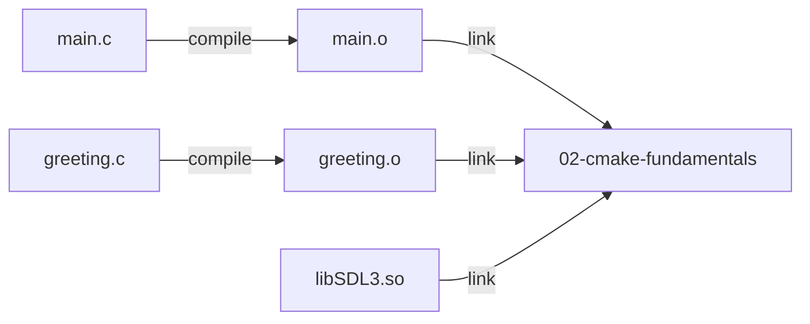
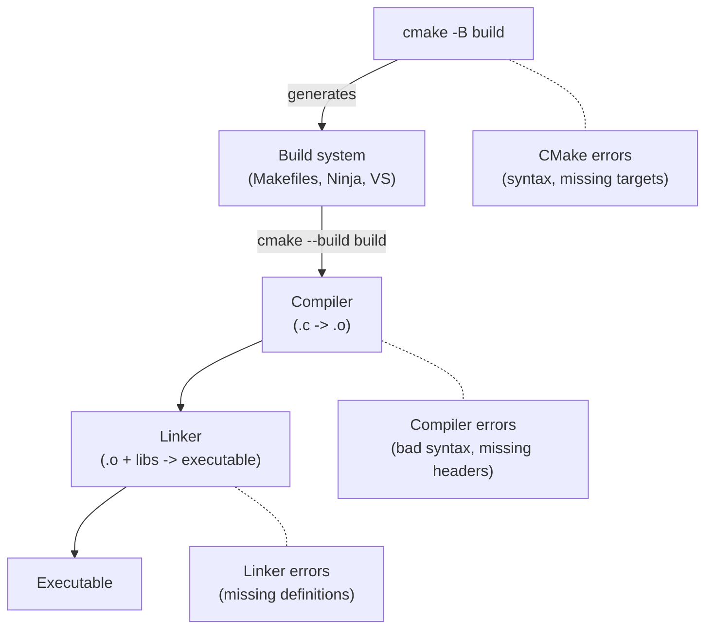

# Engine Lesson 02 — CMake Fundamentals

How CMake turns source files into a running program — and what to do when it
doesn't.

## What you'll learn

- What a CMake **target** is and why it is the central concept in modern CMake
- How **`add_executable`** creates a target from source files
- How **`target_link_libraries`** connects your code to external libraries
- How **`target_include_directories`** tells the compiler where to find headers
- What **properties** are and how `PRIVATE`, `PUBLIC`, and `INTERFACE` control
  property propagation
- How **generator expressions** (`$<...>`) replace platform-specific `if()`
  blocks
- How to **read CMake and linker error messages** and fix common build failures

## Why this matters

Every forge-gpu lesson ships with a `CMakeLists.txt` that configures the build.
When it works, you never think about it. When it doesn't, you face error
messages like `undefined reference to 'SDL_CreateWindow'` or
`fatal error: 'math/forge_math.h' file not found` and have no idea where to
start.

Understanding CMake's target model turns those errors from walls into signposts.
Each error maps directly to a missing or misconfigured CMake command, and once
you see the pattern, the fix is usually one line.

This lesson explains the model behind every `CMakeLists.txt` in the project —
the same model you will use in your own graphics applications.

## Result

The example program compiles two source files, links SDL3, uses the forge math
library, and prints a diagnostic walkthrough of each CMake concept. If the
build succeeds, every concept in this lesson is working correctly.

**Example output:**

```text
INFO: === Engine Lesson 02: CMake Fundamentals ===
INFO:
INFO: --- 1. SDL is linked ---
INFO:   SDL version: 3.2.8
INFO:   Video drivers available: 5
INFO:     [0] x11
INFO:     [1] wayland
INFO:     [2] KMSDRM
INFO:     [3] offscreen
INFO:     [4] evdev
INFO:   -> target_link_libraries(... SDL3::SDL3) is working
INFO:
INFO: --- 2. Multiple source files compiled and linked ---
INFO:   Greeting: Hello from a linked module! (SDL 3.2.8)
INFO:   Topic:    CMake Fundamentals: Targets, Properties, and Linking
INFO:   -> add_executable(... main.c greeting.c) is working
INFO:
INFO: --- 3. Include directories are configured ---
INFO:   vec3 a = (1.0, 0.0, 0.0)
INFO:   vec3 b = (0.0, 1.0, 0.0)
INFO:   a + b  = (1.0, 1.0, 0.0)
INFO:   a . b  = 0.0 (dot product)
INFO:   mat4 identity diagonal: (1, 1, 1, 1)
INFO:   -> target_include_directories(... ${FORGE_COMMON_DIR}) is working
INFO:
INFO: --- 4. The CMake target model ---
INFO: ...
INFO: --- 5. Generator expressions ---
INFO: ...
INFO: --- 6. Common CMake errors and what they mean ---
INFO: ...
INFO: === Build configuration verified ===
```

## Key concepts

- **Target** — Anything CMake knows how to build (executable, library, or
  imported dependency). Every build command operates on a target.
- **Property** — A setting attached to a target (include paths, link
  libraries, compile flags). Properties are the configuration mechanism.
- **PRIVATE / PUBLIC / INTERFACE** — Keywords controlling whether a property
  applies to the target itself, its dependents, or both.
- **Translation unit** — A single `.c` file after preprocessing. The compiler
  processes each translation unit independently; the linker combines them.
- **Generator expression** — A `$<...>` expression evaluated at build time.
  Used for conditional logic that depends on the compiler, platform, or build
  configuration.
- **Imported target** — A target representing an external library (like
  `SDL3::SDL3`). Created by `find_package` or `FetchContent`. Carries its own
  properties automatically.

## The Details

### Targets: the core of modern CMake

A **target** is any artifact that CMake can build or reference. There are three
kinds:

| Kind | Created by | Example |
|------|-----------|---------|
| Executable | `add_executable()` | `02-cmake-fundamentals` |
| Library | `add_library()` | A static or shared `.a`/`.so`/`.dll` |
| Imported | `find_package()` or `FetchContent` | `SDL3::SDL3` |

When you write `add_executable(02-cmake-fundamentals main.c greeting.c)`, CMake
registers a new target named `02-cmake-fundamentals`. This target knows:

- Which source files to compile
- Which include paths to use (from `target_include_directories`)
- Which libraries to link (from `target_link_libraries`)
- Which compile flags to apply (from `target_compile_options`)

All of these are **properties** of the target.

### Properties and propagation keywords

Every `target_*` command takes a **propagation keyword** that controls who
inherits the property:

```text
target_link_libraries(myapp PRIVATE SDL3::SDL3)
                             ^^^^^^^ keyword
```

| Keyword | Applies to this target | Inherited by dependents |
|---------|:-----:|:-----:|
| `PRIVATE` | Yes | No |
| `PUBLIC` | Yes | Yes |
| `INTERFACE` | No | Yes |

For executables, **`PRIVATE` is almost always correct**. Nothing links against
an executable, so there are no dependents to inherit from.

The keywords matter more for libraries. If you build a library that uses SDL
internally but does not expose SDL types in its public headers, you would link
SDL as `PRIVATE`. If your library's headers `#include <SDL3/SDL.h>`, you would
link SDL as `PUBLIC` so that anyone who uses your library automatically gets
SDL's include paths.

### add_executable: creating a target

```cmake
add_executable(02-cmake-fundamentals main.c greeting.c)
```

This tells CMake:

1. Create a target named `02-cmake-fundamentals`
2. Compile `main.c` into `main.o` (or `main.obj` on MSVC)
3. Compile `greeting.c` into `greeting.o`
4. Link both object files into the final executable

Each `.c` file is a **translation unit** — the compiler processes it
independently. The compiler sees `#include "greeting.h"` in `main.c` and trusts
the header's promise that `get_greeting()` exists. It does not verify that a
matching definition exists; that is the linker's job.



If `greeting.c` is missing from the `add_executable` list, `greeting.o` is
never created. The linker searches for the definition of `get_greeting`,
cannot find it, and reports an error.

### target_include_directories: finding headers

```cmake
target_include_directories(02-cmake-fundamentals PRIVATE ${FORGE_COMMON_DIR})
```

The compiler resolves `#include` directives by searching a list of directories.
By default, it checks:

1. The directory containing the source file being compiled
2. System include paths (standard library headers, etc.)

If a header is not in either location, you must tell the compiler where to look.
`target_include_directories` adds a directory to the search list for a specific
target.

In this lesson, `${FORGE_COMMON_DIR}` is a variable defined in the root
`CMakeLists.txt`:

```cmake
set(FORGE_COMMON_DIR ${CMAKE_CURRENT_SOURCE_DIR}/common)
```

This lets `main.c` write `#include "math/forge_math.h"`, and the compiler
resolves it to `common/math/forge_math.h`.

### target_link_libraries: connecting dependencies

```cmake
target_link_libraries(02-cmake-fundamentals PRIVATE
    SDL3::SDL3
    $<$<NOT:$<C_COMPILER_ID:MSVC>>:m>
)
```

`target_link_libraries` does more than just link. When you link an **imported
target** like `SDL3::SDL3`, CMake also inherits that target's properties:

- **Include directories** — SDL3's headers become available without a separate
  `target_include_directories` call
- **Compile definitions** — Any `#define`s SDL3 requires
- **Transitive dependencies** — Libraries that SDL3 itself depends on

This is the power of CMake's target model: dependencies carry their own
configuration. You link the target, and everything it needs comes along
automatically.

The `$<$<NOT:$<C_COMPILER_ID:MSVC>>:m>` part is a **generator expression**
(explained in the next section). It links the C math library (`-lm`) on
GCC and Clang, which require it for functions like `sinf()` and `cosf()`. MSVC
includes math functions in its C runtime, so the expression evaluates to
nothing on that compiler.

### Generator expressions

Generator expressions use the `$<...>` syntax. They are evaluated at
**generate time** (when CMake produces the build system), not when you run
the `cmake` command.

They serve two purposes:

1. **Conditional logic** — Do something only for certain compilers,
   configurations, or platforms
2. **Target queries** — Get paths or properties from other targets

#### Conditional generator expressions

```cmake
# Link -lm only on non-MSVC compilers
$<$<NOT:$<C_COMPILER_ID:MSVC>>:m>
```

Read this from the inside out:

| Expression | Meaning |
|-----------|---------|
| `$<C_COMPILER_ID:MSVC>` | Evaluates to `1` if the compiler is MSVC, `0` otherwise |
| `$<NOT:...>` | Inverts: `1` becomes `0`, `0` becomes `1` |
| `$<...:m>` | If the condition is `1`, produce the string `m`; otherwise produce nothing |

The result: on GCC/Clang the linker sees `-lm`; on MSVC it sees nothing.

Other conditional expressions you will encounter in forge-gpu:

```cmake
# Add a compile definition only in Debug builds
$<$<CONFIG:Debug>:SLOW_CHECKS>

# Set a different warning level per compiler
$<$<C_COMPILER_ID:GNU>:-Wall>
```

#### Target query expressions

```cmake
# Full path to the SDL3 shared library
$<TARGET_FILE:SDL3::SDL3-shared>

# Directory containing our executable
$<TARGET_FILE_DIR:02-cmake-fundamentals>
```

These are used in the POST_BUILD command to copy `SDL3.dll` (on Windows) next
to the executable:

```cmake
add_custom_command(TARGET 02-cmake-fundamentals POST_BUILD
    COMMAND ${CMAKE_COMMAND} -E copy_if_different
        $<TARGET_FILE:SDL3::SDL3-shared>
        $<TARGET_FILE_DIR:02-cmake-fundamentals>
)
```

Without this step, the executable would build successfully but crash on
startup because the operating system cannot find the shared library.

### The build pipeline

Understanding how CMake, the compiler, and the linker interact helps you
diagnose errors:



Each stage produces different error messages:

| Stage | Error looks like | Cause |
|-------|-----------------|-------|
| CMake | `CMake Error at CMakeLists.txt:5` | Syntax error, missing target, bad variable |
| Compiler | `error: unknown type name 'vec3'` | Missing `#include`, typo in type/function name |
| Linker | `undefined reference to 'get_greeting'` | Source file not compiled, library not linked |

## Common errors

### Forgetting `target_link_libraries`

**What you see (GCC/Clang):**

```text
/usr/bin/ld: main.c:(.text+0x1a): undefined reference to 'SDL_Init'
/usr/bin/ld: main.c:(.text+0x2f): undefined reference to 'SDL_GetError'
/usr/bin/ld: main.c:(.text+0x3e): undefined reference to 'SDL_Log'
collect2: error: ld returned 1 exit status
```

**What you see (MSVC):**

```text
main.obj : error LNK2019: unresolved external symbol SDL_Init referenced
    in function main
main.obj : error LNK2019: unresolved external symbol SDL_GetError referenced
    in function main
```

**Why it happens:** The compiler found `SDL_Init` in the `<SDL3/SDL.h>` header
and trusted that the definition exists somewhere. The linker searched all
provided libraries and could not find it. No library was provided because
`target_link_libraries` is missing.

**How to fix it:** Add the library to your `target_link_libraries`:

```cmake
target_link_libraries(02-cmake-fundamentals PRIVATE SDL3::SDL3)
```

### Forgetting a source file in `add_executable`

**What you see:**

```text
/usr/bin/ld: main.o: undefined reference to 'get_greeting'
/usr/bin/ld: main.o: undefined reference to 'get_lesson_topic'
collect2: error: ld returned 1 exit status
```

**Why it happens:** `greeting.c` was not listed in `add_executable`, so the
compiler never compiled it into an object file. The linker cannot find the
definitions of `get_greeting` and `get_lesson_topic`.

**How to fix it:** Add the missing source file:

```cmake
add_executable(02-cmake-fundamentals main.c greeting.c)
```

**How to tell this apart from a missing library:** Look at the symbol names.
If they are your own functions (like `get_greeting`), you probably forgot a
source file. If they belong to a library (like `SDL_Init`), you probably forgot
`target_link_libraries`.

### Missing `target_include_directories`

**What you see (GCC/Clang):**

```text
main.c:44:10: fatal error: 'math/forge_math.h' file not found
   44 | #include "math/forge_math.h"
      |          ^~~~~~~~~~~~~~~~~~~
```

**What you see (MSVC):**

```text
main.c(44): fatal error C1083: Cannot open include file: 'math/forge_math.h':
    No such file or directory
```

**Why it happens:** The compiler searched every directory on its include path
and could not find `math/forge_math.h`. The `common/` directory is not on the
include path by default — you must add it explicitly.

**How to fix it:**

```cmake
target_include_directories(02-cmake-fundamentals PRIVATE ${FORGE_COMMON_DIR})
```

### Typo in a target name

**What you see:**

```text
CMake Error at lessons/engine/02-cmake-fundamentals/CMakeLists.txt:5:
  Cannot specify link libraries for target "02-cmake-fundamental" which is
  not built by this project.
```

**Why it happens:** The target name in `target_link_libraries` does not match
the name in `add_executable`. In this example, the plural "s" is missing.

**How to fix it:** Make sure the target name is identical in every command.
CMake target names are case-sensitive and must match exactly.

### Shared library not found at runtime

**What you see (Windows):**

```text
The program can't start because SDL3.dll was not found.
```

**What you see (Linux):**

```text
error while loading shared libraries: libSDL3.so.0: cannot open shared
    object file: No such file or directory
```

**Why it happens:** The executable built successfully, but the operating system
cannot find the shared library at runtime. The build directory is not on the
system library path.

**How to fix it:** Add a POST_BUILD command to copy the shared library next to
the executable:

```cmake
if(TARGET SDL3::SDL3-shared)
    add_custom_command(TARGET 02-cmake-fundamentals POST_BUILD
        COMMAND ${CMAKE_COMMAND} -E copy_if_different
            $<TARGET_FILE:SDL3::SDL3-shared>
            $<TARGET_FILE_DIR:02-cmake-fundamentals>
    )
endif()
```

The `if(TARGET SDL3::SDL3-shared)` guard handles the case where SDL is built
as a static library (there is no `.dll` or `.so` to copy).

## Where it's used

Every lesson in forge-gpu uses the CMake patterns taught here:

- **Every GPU lesson** (`lessons/gpu/01-hello-window/` through
  `lessons/gpu/19-debug-lines/`) has a `CMakeLists.txt` using `add_executable`,
  `target_include_directories`, and `target_link_libraries`
- **GPU lessons 05+** use the generator expression
  `$<$<NOT:$<C_COMPILER_ID:MSVC>>:m>` to link the math library
- **GPU lessons 08+** use `POST_BUILD` commands with generator expressions to
  copy assets alongside the executable
- **GPU lessons 09 and 15** demonstrate multi-source `add_executable` with
  third-party libraries (cJSON)
- The **root CMakeLists.txt** ties everything together with `add_subdirectory`,
  `FetchContent`, and project-wide variables

## Building

```bash
cmake -B build
cmake --build build --config Debug

# Easy way -- use the run script
python scripts/run.py engine/02              # by number
python scripts/run.py cmake-fundamentals     # by name

# Or run the executable directly
# Windows
build\lessons\engine\02-cmake-fundamentals\Debug\02-cmake-fundamentals.exe

# Linux / macOS
./build/lessons/engine/02-cmake-fundamentals/02-cmake-fundamentals
```

## Exercises

1. **Remove a source file** — Delete `greeting.c` from the `add_executable`
   call in `CMakeLists.txt`. Rebuild and read the linker error. Can you
   identify the missing symbols and which file defines them? Add it back and
   verify the build succeeds.

2. **Remove `target_link_libraries`** — Comment out the
   `target_link_libraries` line. Rebuild and read the error. How many
   `undefined reference` errors do you see? Note that they all refer to `SDL_*`
   functions.

3. **Remove `target_include_directories`** — Comment out the
   `target_include_directories` line. Rebuild. The error is a compiler error
   (not a linker error) — the compiler cannot find `math/forge_math.h`. Notice
   that SDL headers still work because `SDL3::SDL3` carries its own include
   path through `target_link_libraries`.

4. **Write a generator expression** — Add a `target_compile_definitions` line
   that defines `LESSON_NUMBER=2` only in Debug builds using a generator
   expression. Print it from `main.c` with `#ifdef`:

   ```cmake
   target_compile_definitions(02-cmake-fundamentals PRIVATE
       $<$<CONFIG:Debug>:LESSON_NUMBER=2>
   )
   ```

5. **Inspect target properties** — Run `cmake -B build` and then use
   `cmake --build build --target help` (Makefiles) or open the build system
   to see all available targets. Find `02-cmake-fundamentals` in the list.

## Further reading

- [Engine Lesson 01 — Intro to C](../01-intro-to-c/) covers the C language
  features used in this lesson's example program
- [Engine Lesson 03 — FetchContent & Dependencies](../03-fetchcontent-dependencies/)
  explains where `SDL3::SDL3` comes from and how to add your own dependencies
- [CMake Tutorial](https://cmake.org/cmake/help/latest/guide/tutorial/index.html)
  — Official step-by-step introduction to CMake
- [CMake `add_executable` reference](https://cmake.org/cmake/help/latest/command/add_executable.html)
- [CMake `target_link_libraries` reference](https://cmake.org/cmake/help/latest/command/target_link_libraries.html)
- [CMake generator expressions reference](https://cmake.org/cmake/help/latest/manual/cmake-generator-expressions.7.html)
- [Daniel Pfeifer — "Effective CMake" (C++Now 2017)](https://www.youtube.com/watch?v=bsXLMQ6WgIk)
  — Widely referenced talk on modern target-based CMake
