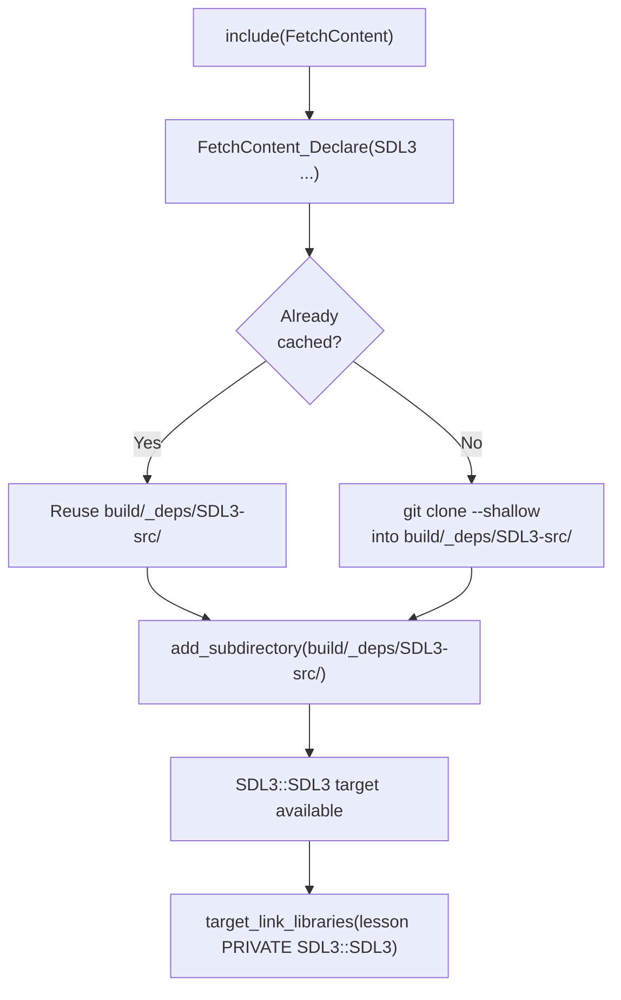
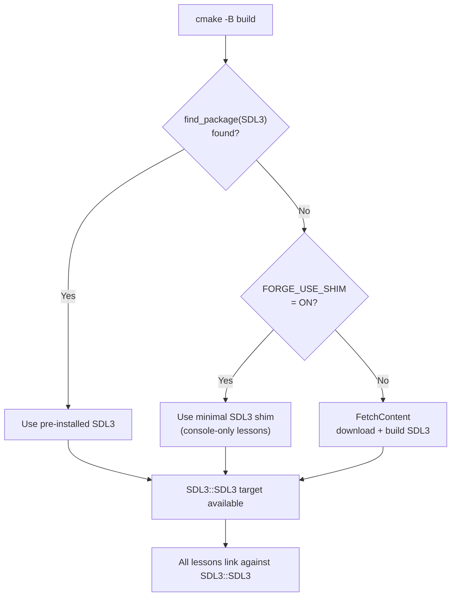
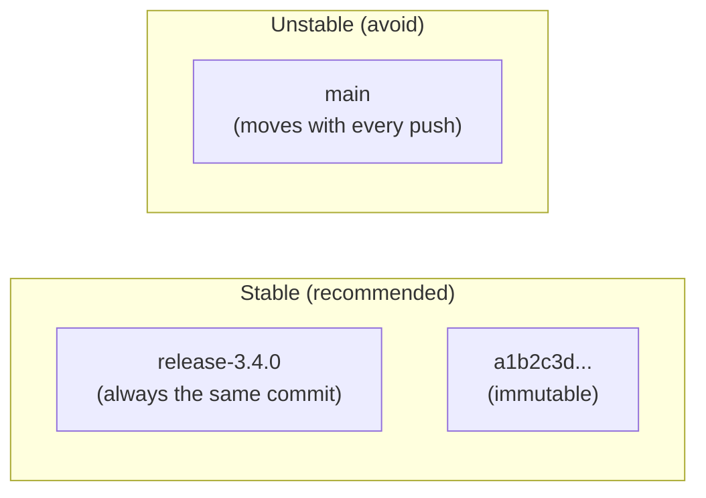
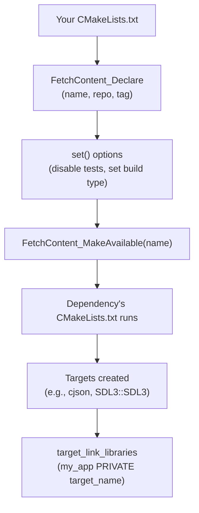
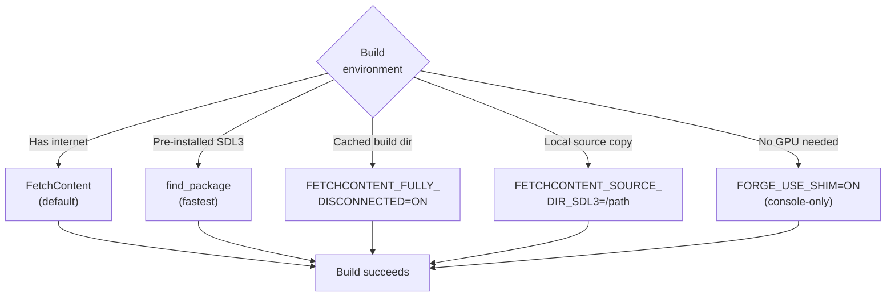

# Engine Lesson 03 — FetchContent & Dependencies

How CMake automatically downloads, builds, and links external libraries — and
how forge-gpu uses this to provide SDL3 without any manual installation.

## What you'll learn

- What `FetchContent` is and why it exists
- The two-stage lifecycle: `FetchContent_Declare` and `FetchContent_MakeAvailable`
- How forge-gpu's layered dependency strategy works (`find_package` → shim → `FetchContent`)
- Version pinning with `GIT_TAG` and why it matters for reproducibility
- How imported targets (`SDL3::SDL3`) carry include paths, definitions, and libraries automatically
- How to add your own dependencies to a CMake project
- Configuring dependency build options with `set()` before `FetchContent_MakeAvailable`
- Strategies for offline and restricted-network builds

## Why this matters

When you cloned forge-gpu and ran `cmake -B build`, SDL3 appeared
automatically — no manual download, no system package to install, no PATH to
configure. That is `FetchContent` at work.

Every non-trivial C or C++ project depends on external libraries. Before
modern CMake, managing those dependencies was painful: download the source,
build it separately, set include paths, set library paths, hope the versions
match. `FetchContent` solves this by making dependencies a first-class part of
your build — declared in your `CMakeLists.txt`, downloaded on demand, and
built alongside your own code.

Understanding dependency management matters because:

- **Every GPU lesson depends on SDL3** — if the dependency system breaks, nothing builds
- **Real projects have many dependencies** — physics engines, audio libraries, UI frameworks
- **Reproducibility requires version pinning** — without it, builds break silently when upstream changes
- **CI/CD and offline environments** need strategies beyond "just download it"

## Result

The example program prints a walkthrough of CMake's dependency management,
proving that SDL3 was obtained and linked successfully regardless of which
path was taken (pre-installed, FetchContent, or shim).

**Example output:**

```text
INFO: === Engine Lesson 03: FetchContent & Dependencies ===
INFO:
INFO: --- 1. How SDL3 arrived in this build ---
INFO:
INFO:   SDL version: 3.4.0
INFO:
INFO:   The root CMakeLists.txt tries three paths in order:
INFO:     1. find_package(SDL3) -- use a pre-installed SDL3
INFO:     2. FORGE_USE_SHIM=ON  -- use minimal SDL3 shim
INFO:     3. FetchContent       -- download and build from source
INFO:
INFO:   All three create the same target: SDL3::SDL3
INFO:   Your lesson code never needs to know which path was taken.
INFO:
INFO: --- 2. FetchContent lifecycle ---
INFO:
INFO:   FetchContent has two stages:
INFO:
INFO:   Stage 1: FetchContent_Declare(name ...)
INFO:     - Registers a dependency by name
INFO:     - Specifies WHERE to get it (git repo, URL, etc.)
INFO:     - Specifies WHICH version (git tag, commit hash)
INFO:     - No download happens at this point
INFO:
INFO:   Stage 2: FetchContent_MakeAvailable(name)
INFO:     - Downloads the source if not already cached
INFO:     - Runs add_subdirectory() on the fetched source
INFO:     - Builds it as part of your project
INFO:
INFO:   Downloaded sources live in the build directory:
INFO:     build/_deps/<name>-src/       (source code)
INFO:     build/_deps/<name>-build/     (build artifacts)
INFO:     build/_deps/<name>-subbuild/  (download machinery)
INFO:
INFO: --- 3. Version pinning ---
INFO:
INFO:   forge-gpu pins SDL3 with GIT_TAG:
INFO:     GIT_TAG  release-3.4.0
INFO:
INFO:   GIT_TAG options (from safest to riskiest):
INFO:     Commit hash  :  a1b2c3d...   (exact, never changes)
INFO:     Release tag  :  release-3.4.0 (stable, rarely changes)
INFO:     Branch name  :  main          (AVOID -- changes constantly)
INFO:
INFO:   Why pin versions?
INFO:     - Reproducibility: same version for every developer
INFO:     - Stability: upstream changes cannot break your build
INFO:     - Debugging: you know exactly which code is running
INFO:
INFO:   GIT_SHALLOW TRUE skips full history (saves time + space)
INFO:
INFO: --- 4. Imported targets carry everything ---
INFO:
INFO:   Imported target SDL3::SDL3 provides:
INFO:     - Include directories (SDL3/SDL.h found by compiler)
INFO:     - Compile definitions (platform-specific)
INFO:     - The library itself  (linked by the linker)
INFO:
INFO:   Proof: vec3_cross(right, up) = (0.0, 0.0, 1.0)
INFO:   Both SDL3 and forge_math are linked and working.
INFO:
INFO:   This is the key benefit of target-based CMake:
INFO:   link one target and get everything it needs.
INFO:
INFO: --- 5. Adding your own dependency ---
INFO:
INFO:   Adding a dependency via FetchContent:
INFO:
INFO:   include(FetchContent)
INFO:
INFO:   FetchContent_Declare(
INFO:       cJSON
INFO:       GIT_REPOSITORY https://github.com/DaveGamble/cJSON.git
INFO:       GIT_TAG        v1.7.18
INFO:       GIT_SHALLOW    TRUE
INFO:   )
INFO:   FetchContent_MakeAvailable(cJSON)
INFO:
INFO:   target_link_libraries(my_app PRIVATE cjson)
INFO:
INFO:   Set options BEFORE MakeAvailable to configure the dependency:
INFO:     set(CJSON_BUILD_SHARED_LIBS OFF CACHE BOOL "" FORCE)
INFO:
INFO: --- 6. Strategies for offline builds ---
INFO:
INFO:   FetchContent needs network access on first configure.
INFO:   Strategies for offline or restricted environments:
INFO:
INFO:   1. Pre-install the dependency:
INFO:      cmake -B build -DCMAKE_PREFIX_PATH=/path/to/sdl3
INFO:      -> find_package() finds it before FetchContent runs
INFO:
INFO:   2. Use FETCHCONTENT_FULLY_DISCONNECTED:
INFO:      cmake -B build -DFETCHCONTENT_FULLY_DISCONNECTED=ON
INFO:      -> Reuses previously downloaded sources from build/_deps/
INFO:
INFO:   3. Use FETCHCONTENT_SOURCE_DIR_<NAME>:
INFO:      cmake -B build -DFETCHCONTENT_SOURCE_DIR_SDL3=/local/SDL
INFO:      -> Uses a local source directory instead of downloading
INFO:
INFO:   4. Use a shim (forge-gpu specific):
INFO:      cmake -B build -DFORGE_USE_SHIM=ON
INFO:      -> Minimal stand-in for console-only lessons
INFO:
INFO: === Dependency management verified ===
INFO: SDL3 was obtained, configured, and linked automatically.
INFO:
INFO: Read the README.md in this lesson's directory for the full
INFO: explanation with diagrams and exercises.
```

## Key concepts

- **FetchContent** — A CMake module that downloads and builds external
  dependencies as part of your project's configure step
- **FetchContent_Declare** — Registers a dependency with a name, source
  location (git repo or URL), and version identifier; no download occurs yet
- **FetchContent_MakeAvailable** — Downloads (if needed) and integrates the
  declared dependency into your build via `add_subdirectory`
- **GIT_TAG** — The version pin in a FetchContent declaration; can be a
  release tag, commit hash, or branch name (tags and hashes are preferred for
  reproducibility)
- **GIT_SHALLOW** — Tells git to clone only the pinned commit without full
  history, saving bandwidth and disk space
- **Imported target** — A CMake target (like `SDL3::SDL3`) that represents an
  external library and carries its own include paths, compile definitions, and
  link libraries
- **find_package** — CMake's mechanism for locating pre-installed libraries;
  forge-gpu tries this first before falling back to FetchContent
- **FETCHCONTENT_FULLY_DISCONNECTED** — A CMake variable that prevents all
  network access during configure, using only previously cached sources
- **FETCHCONTENT_SOURCE_DIR_\<NAME\>** — A CMake variable that redirects a
  FetchContent dependency to a local source directory instead of downloading

## The details

### What problem does FetchContent solve?

Before `FetchContent`, adding an external library to a C/C++ project required
manual steps:

1. Download the library source or pre-built binaries
2. Build it separately (if from source)
3. Tell your compiler where to find the headers (`-I` flags)
4. Tell your linker where to find the library (`-L` flags)
5. Specify which library to link (`-l` flags)
6. Hope the version matches what your code expects

Every developer on the team had to repeat these steps. Different operating
systems required different procedures. CI machines needed special setup.
Version mismatches caused subtle bugs.

`FetchContent` eliminates all of this by making dependency management
declarative: you write *what* you need and *which version* in your
`CMakeLists.txt`, and CMake handles the rest.

### The FetchContent lifecycle

`FetchContent` works in two stages. Understanding the separation is important
because it affects when downloads happen and how you configure dependencies.



**Stage 1: `FetchContent_Declare`** registers the dependency:

```cmake
include(FetchContent)

FetchContent_Declare(
    SDL3                                             # Name (used as identifier)
    GIT_REPOSITORY https://github.com/libsdl-org/SDL.git  # Where to get it
    GIT_TAG        release-3.4.0                     # Which version
    GIT_SHALLOW    TRUE                              # Skip full history
)
```

At this point, nothing is downloaded. The declaration is stored internally,
waiting for the second stage.

**Stage 2: `FetchContent_MakeAvailable`** triggers the download and
integration:

```cmake
FetchContent_MakeAvailable(SDL3)
```

This command does three things:

1. **Downloads** the source into `build/_deps/SDL3-src/` (if not already
   cached from a previous configure)
2. **Configures** the dependency by running its own `CMakeLists.txt`
   (equivalent to `add_subdirectory`)
3. **Exposes** the dependency's targets (like `SDL3::SDL3`) for your project
   to link against

### Where downloaded sources live

FetchContent stores everything inside your build directory:

```text
build/
  _deps/
    SDL3-src/        # The downloaded source code
    SDL3-build/      # Build artifacts (object files, libraries)
    SDL3-subbuild/   # CMake's download machinery
```

This keeps your source tree clean. Different build directories
(`build-debug/`, `build-release/`) maintain independent copies. Deleting the
build directory removes everything, and the next `cmake -B build` re-downloads
the dependency.

### forge-gpu's layered dependency strategy

forge-gpu does not use FetchContent blindly. The root `CMakeLists.txt`
implements a three-tier strategy that adapts to the build environment:



Here is the actual code from the root `CMakeLists.txt`:

```cmake
find_package(SDL3 QUIET)
if(SDL3_FOUND)
    message(STATUS "Using pre-installed SDL3: ${SDL3_DIR}")
elseif(FORGE_USE_SHIM)
    message(STATUS "SDL3 shim enabled — building console-only lessons")
    add_library(sdl3_shim INTERFACE)
    target_include_directories(sdl3_shim INTERFACE
        ${CMAKE_CURRENT_SOURCE_DIR}/third_party/sdl3_shim)
    add_library(SDL3::SDL3 ALIAS sdl3_shim)
else()
    message(STATUS "SDL3 not found — fetching from source")
    include(FetchContent)
    FetchContent_Declare(
        SDL3
        GIT_REPOSITORY https://github.com/libsdl-org/SDL.git
        GIT_TAG        release-3.4.0
        GIT_SHALLOW    TRUE
    )
    FetchContent_MakeAvailable(SDL3)
endif()
```

**Path 1 — Pre-installed SDL3.** `find_package(SDL3 QUIET)` searches standard
system locations and any directories listed in `CMAKE_PREFIX_PATH`. If SDL3 is
found, it creates the `SDL3::SDL3` imported target automatically. The `QUIET`
flag suppresses the "not found" message — we have a fallback, so a missing
package is not an error.

**Path 2 — SDL3 shim.** When `FORGE_USE_SHIM=ON`, CMake creates an `INTERFACE`
library (a target with no compiled code — only properties). The shim provides a
minimal `SDL3/SDL.h` header with `SDL_Log`, `SDL_Init`, memory functions, and
math helpers. Engine and math lessons build and run with the shim, but GPU
lessons are skipped because they need the real SDL3 GPU API.

**Path 3 — FetchContent.** If neither of the above applies, CMake downloads
SDL3 from GitHub and builds it from source. This is the default path for most
users — clone forge-gpu, run cmake, and SDL3 appears automatically.

The critical design decision: **all three paths produce the same target name**
(`SDL3::SDL3`). Every lesson's `CMakeLists.txt` writes
`target_link_libraries(... PRIVATE SDL3::SDL3)` and never needs to know which
path was taken. This is the power of target-based CMake — the target name is
the contract, and the implementation behind it can vary.

### Version pinning

The `GIT_TAG` parameter in `FetchContent_Declare` determines which version of
the dependency is downloaded. Choosing the right value is important for build
stability.

**Release tags** (recommended):

```cmake
GIT_TAG release-3.4.0
```

Release tags point to a specific commit that was explicitly published as a
release. They are human-readable, stable, and unlikely to be modified after
publication. This is what forge-gpu uses.

**Commit hashes** (most precise):

```cmake
GIT_TAG a1b2c3d4e5f67890abcdef1234567890abcdef12
```

A commit hash is immutable — it refers to exactly one version of the code,
forever. Use this when you need absolute precision or when a project does not
publish release tags.

**Branch names** (avoid):

```cmake
GIT_TAG main   # DO NOT DO THIS
```

A branch name points to whatever the latest commit happens to be. Your build
will download a different version every time the upstream repository changes.
This breaks reproducibility and can introduce unexpected failures.



**`GIT_SHALLOW TRUE`** is an optimization. Without it, `git clone` downloads
the entire commit history — for SDL, that is hundreds of megabytes and
thousands of commits. With `GIT_SHALLOW TRUE`, CMake clones only the single
commit pointed to by `GIT_TAG`, saving bandwidth and disk space.

### Imported targets

When `find_package(SDL3)` or `FetchContent_MakeAvailable(SDL3)` runs
successfully, it creates an **imported target** named `SDL3::SDL3`. An
imported target is a CMake target that carries all the configuration needed to
use the library:

| Property | What it provides | Without it, you would need |
|---|---|---|
| Include directories | `SDL3/SDL.h` findable by the compiler | `-I/path/to/SDL3/include` |
| Compile definitions | Platform-specific `#defines` | Manual `#define` for each platform |
| Link libraries | The actual `.so` / `.dll` / `.dylib` | `-L/path/to/lib -lSDL3` |

When you write:

```cmake
target_link_libraries(my_app PRIVATE SDL3::SDL3)
```

CMake propagates all of these properties to your target. You do not need to
call `target_include_directories` for SDL headers or specify library paths.
This is the same mechanism explained in
[Engine Lesson 02](../02-cmake-fundamentals/) — imported targets follow the
same target-and-property model as your own executables and libraries.

### Adding your own dependency

Adding a new dependency follows the same pattern as SDL3. Here is a complete
example using cJSON, a lightweight JSON parser that forge-gpu's
[glTF loader](../../gpu/09-scene-loading/) uses:

```cmake
include(FetchContent)

# Step 1: Declare the dependency
FetchContent_Declare(
    cJSON
    GIT_REPOSITORY https://github.com/DaveGamble/cJSON.git
    GIT_TAG        v1.7.18
    GIT_SHALLOW    TRUE
)

# Step 2: Configure options BEFORE making it available
# These set() calls modify CMake cache variables that cJSON's CMakeLists.txt
# reads.  We want a static library with no extras.
set(CJSON_BUILD_SHARED_LIBS OFF CACHE BOOL "" FORCE)
set(ENABLE_CJSON_TEST OFF CACHE BOOL "" FORCE)

# Step 3: Download and build
FetchContent_MakeAvailable(cJSON)
```

Then in your lesson or application:

```cmake
target_link_libraries(my_app PRIVATE cjson)
```

**Configuring dependency options.** Most CMake-based libraries expose
`option()` variables that control their build (enable tests, choose shared vs
static, etc.). You can set these *before* calling `FetchContent_MakeAvailable`
to override the defaults:

```cmake
# Disable the dependency's tests and examples (we don't need them)
set(BUILD_TESTING OFF CACHE BOOL "" FORCE)
set(BUILD_EXAMPLES OFF CACHE BOOL "" FORCE)
```

The `CACHE BOOL "" FORCE` syntax ensures the value takes effect even if the
dependency's `CMakeLists.txt` has an `option()` with a different default.

**Finding the right target name.** After `FetchContent_MakeAvailable`, you
need to know the target name to link against. Check the dependency's
documentation or its `CMakeLists.txt`. Common conventions:

- `SDL3::SDL3` — namespaced (used by `find_package`-compatible projects)
- `cjson` — lowercase (used by many smaller projects)
- `glm::glm` — namespaced (header-only math library)



### FetchContent vs other dependency methods

FetchContent is one of several approaches to dependency management in CMake.
Each has trade-offs:

| Method | How it works | Best for |
|---|---|---|
| `FetchContent` | Downloads and builds source alongside your project | Projects that want zero-setup builds |
| `find_package` | Finds a pre-installed library on the system | Libraries installed via package manager |
| `add_subdirectory` | Builds source from a directory you provide | Vendored dependencies or git submodules |
| Git submodules | Embeds another repo in yours at a pinned commit | When you want the source in your tree (see [Engine Lesson 11](../11-git-version-control/)) |
| Package managers (vcpkg, Conan) | External tool installs pre-built binaries | Large projects with many dependencies |

forge-gpu uses a hybrid approach: try `find_package` first (fast, uses
pre-built libraries), fall back to `FetchContent` (automatic, works
everywhere). This gives users the best of both methods — experienced
developers can pre-install SDL3 for faster builds, while newcomers get a
zero-setup experience.

### Offline and restricted-network builds

FetchContent requires network access on the first `cmake -B build` configure.
Subsequent configures reuse the cached sources in `build/_deps/` without
network access. But some environments never have network access — CI runners,
air-gapped machines, or environments with restricted firewalls.

**Strategy 1 — Pre-install the dependency:**

```bash
cmake -B build -DCMAKE_PREFIX_PATH=/path/to/sdl3
```

`find_package(SDL3)` finds the pre-installed copy before `FetchContent` runs.
No download is attempted.

**Strategy 2 — `FETCHCONTENT_FULLY_DISCONNECTED`:**

```bash
cmake -B build -DFETCHCONTENT_FULLY_DISCONNECTED=ON
```

This tells CMake to skip all FetchContent downloads. It only works if
`build/_deps/` is already populated from a previous configure. Useful for
CI pipelines that cache the build directory between runs.

**Strategy 3 — `FETCHCONTENT_SOURCE_DIR_<NAME>`:**

```bash
cmake -B build -DFETCHCONTENT_SOURCE_DIR_SDL3=/path/to/local/SDL
```

This redirects FetchContent to use a local source directory instead of
downloading. The name after `FETCHCONTENT_SOURCE_DIR_` must match the name
used in `FetchContent_Declare` (converted to uppercase). Useful when you have
a local clone of the dependency.

**Strategy 4 — SDL3 shim (forge-gpu specific):**

```bash
cmake -B build -DFORGE_USE_SHIM=ON
```

The shim replaces SDL3 with a minimal header-only stand-in. Engine and math
lessons build normally because they only use `SDL_Log`, `SDL_Init`, and memory
functions. GPU lessons are skipped because they need the real SDL3 GPU API.



## Common errors

### FetchContent download fails

**What you see:**

```text
CMake Error at build/_deps/sdl3-subbuild/CMakeLists.txt:18 (message):
  Could not download SDL3 from https://github.com/libsdl-org/SDL.git
  ...
  Failed to connect to github.com port 443
```

**Why it happens:** FetchContent needs network access to download the
dependency. This fails behind corporate firewalls, on air-gapped machines, or
when GitHub is unreachable.

**How to fix it:** Use one of the offline strategies above — pre-install the
dependency, point to a local source, or use the shim.

### Wrong GIT_TAG

**What you see:**

```text
fatal: Remote branch 'release-3.99.0' not found in upstream origin
```

**Why it happens:** The `GIT_TAG` value does not exist in the upstream
repository. Either the tag was mistyped, or it refers to a version that has
not been released yet.

**How to fix it:** Check the repository's tags page on GitHub. For SDL, visit
`https://github.com/libsdl-org/SDL/tags` and use an exact tag name.

### Target name mismatch

**What you see:**

```text
CMake Error at CMakeLists.txt:15 (target_link_libraries):
  Target "my_app" links to target "SDL3" which is not built by this project.
  Perhaps a find_package() call is missing...
```

**Why it happens:** You linked against `SDL3` instead of `SDL3::SDL3`. The
namespaced form (`SDL3::SDL3`) is the correct target name that both
`find_package` and `FetchContent` create. The non-namespaced `SDL3` is not a
valid target.

**How to fix it:** Use the namespaced target name:

```cmake
target_link_libraries(my_app PRIVATE SDL3::SDL3)  # correct
# NOT: target_link_libraries(my_app PRIVATE SDL3)  # wrong
```

### Dependency option not taking effect

**What you see:** You set an option like `CJSON_BUILD_SHARED_LIBS OFF`, but
CMake's output still shows the dependency building as a shared library:

```text
-- Build cJSON shared lib: ON
```

Or at link time you see unexpected shared library references when you expected
static linking.

**Why it happens:** The `set()` call came *after* `FetchContent_MakeAvailable`.
By that point, the dependency's `CMakeLists.txt` has already read the variable.

**How to fix it:** Move the `set()` call *before* `FetchContent_MakeAvailable`:

```cmake
# BEFORE MakeAvailable — takes effect
set(CJSON_BUILD_SHARED_LIBS OFF CACHE BOOL "" FORCE)
FetchContent_MakeAvailable(cJSON)

# AFTER MakeAvailable — too late!
# set(CJSON_BUILD_SHARED_LIBS OFF CACHE BOOL "" FORCE)
```

### Stale cache after changing GIT_TAG

**What you see:** You changed the `GIT_TAG` in your `CMakeLists.txt` (e.g.,
from `release-3.2.0` to `release-3.4.0`), but the program still reports the
old version:

```text
INFO:   SDL version: 3.2.0
```

Or CMake's configure output shows the old tag:

```text
-- Found SDL3: /path/to/build/_deps/sdl3-src (found version "3.2.0")
```

**Why it happens:** FetchContent caches downloaded sources in `build/_deps/`.
CMake may not detect the tag change and re-download.

**How to fix it:** Delete the build directory and re-configure:

```bash
rm -rf build
cmake -B build
```

Or delete just the dependency cache:

```bash
rm -rf build/_deps/SDL3-*
cmake -B build
```

## Where it's used

In forge-gpu:

- **Root `CMakeLists.txt`** — The layered strategy
  (`find_package` → shim → `FetchContent`) is the first thing cmake processes
- **Every lesson** — Links against `SDL3::SDL3`, which FetchContent provides
- [Engine Lesson 02 — CMake Fundamentals](../02-cmake-fundamentals/) — Introduces
  `target_link_libraries` and imported targets; this lesson explains where
  `SDL3::SDL3` comes from
- [GPU Lesson 09 — Scene Loading](../../gpu/09-scene-loading/) — Uses
  `FetchContent` to add cJSON alongside SDL3
- [Math Lesson 01 — Vectors](../../math/01-vectors/) — Links against
  `SDL3::SDL3` via the same dependency chain in a math-only context

## Building

```bash
cmake -B build
cmake --build build --config Debug

# Windows
build\lessons\engine\03-fetchcontent-dependencies\Debug\03-fetchcontent-dependencies.exe

# Linux / macOS
./build/lessons/engine/03-fetchcontent-dependencies/03-fetchcontent-dependencies
```

For offline environments:

```bash
# Using the shim (no network needed, no SDL3 download)
cmake -B build -DFORGE_USE_SHIM=ON
cmake --build build --config Debug
```

## Exercises

1. **Inspect the cache.** After building, look inside `build/_deps/`. What
   directories exist? What do the `-src`, `-build`, and `-subbuild`
   subdirectories contain? (If using the shim, `_deps/` will be empty — try
   without the shim on a networked machine.)

2. **Change the version pin.** Modify `GIT_TAG` in the root `CMakeLists.txt`
   to a different SDL3 release tag (check `https://github.com/libsdl-org/SDL/tags`
   for valid tags). Delete `build/` and re-configure. Does the version reported
   by the program change?

3. **Add a dependency.** Try adding [stb_image](https://github.com/nothings/stb)
   via FetchContent. stb is header-only, so after fetching you only need
   `target_include_directories` — no `target_link_libraries`. Can you
   `#include "stb_image.h"` in a test program?

4. **Break it on purpose.** Change `GIT_TAG` to a tag that does not exist
   (e.g., `release-99.0.0`). What error does CMake produce? Does it fail at
   configure time or build time?

5. **Try the shim.** Build with `-DFORGE_USE_SHIM=ON`. Which lessons build?
   Which are skipped? Look at the root `CMakeLists.txt` to understand why GPU
   lessons are excluded.

## Further reading

- [Engine Lesson 02 — CMake Fundamentals](../02-cmake-fundamentals/) — The
  target model that FetchContent depends on
- [Engine Lesson 05 — Header-Only Libraries](../05-header-only-libraries/) —
  How `forge_math.h` works without linking, and when FetchContent is (or is
  not) needed for header-only dependencies
- [CMake FetchContent documentation](https://cmake.org/cmake/help/latest/module/FetchContent.html) —
  Official reference with all options and advanced features
- [CMake find_package documentation](https://cmake.org/cmake/help/latest/command/find_package.html) —
  How `find_package` searches for pre-installed libraries
- [Professional CMake (Craig Scott)](https://crascit.com/professional-cmake/) —
  In-depth book covering FetchContent, dependency management, and modern CMake
  patterns
