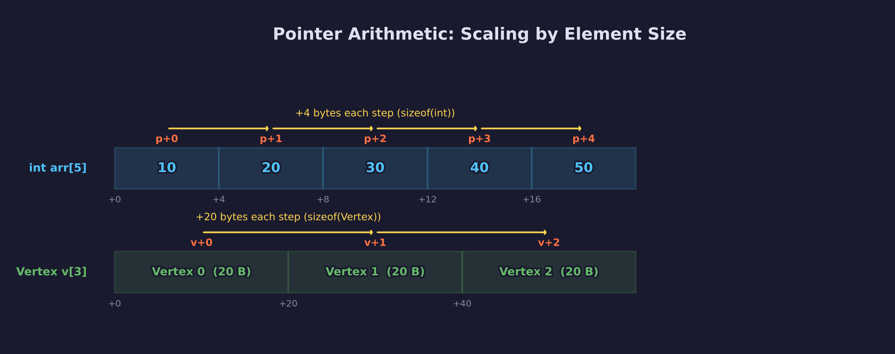
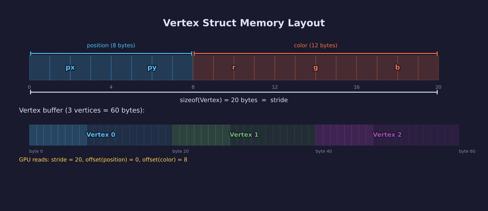
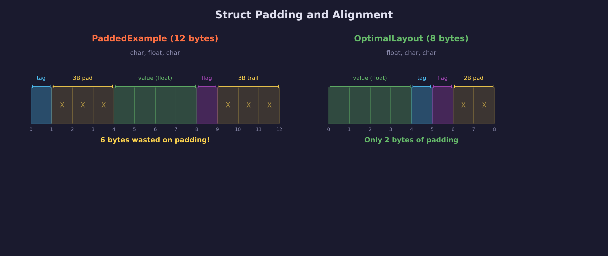
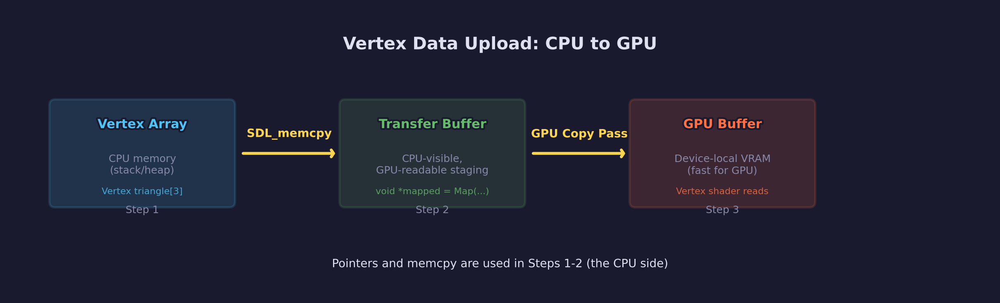

# Engine Lesson 04 — Pointers & Memory

How C manages memory — and why it matters every time you upload data to
the GPU.

## What you'll learn

- What a pointer is: address-of (`&`), dereference (`*`), and `NULL`
- Stack vs heap — where variables live, who frees them, and how big each
  region is
- Dynamic allocation with `malloc` / `free` (and SDL's `SDL_malloc` /
  `SDL_free`)
- Pointer arithmetic — why `p + 1` moves by `sizeof(element)` bytes,
  not one byte
- `sizeof` — measuring types and objects at compile time
- `offsetof` — finding where each struct member sits in memory
- Struct padding and alignment — why `sizeof` can be larger than the sum
  of members
- How vertex buffer uploads work: the CPU-side pointer and memory
  operations behind `SDL_MapGPUTransferBuffer` and `SDL_memcpy`
- The six most common pointer and memory bugs, and how to prevent each one

## Why this matters

Every GPU lesson in forge-gpu follows the same pattern to get data onto
the GPU:

1. Define a vertex struct with position, color, normals, etc.
2. Fill an array of those structs (the mesh data)
3. Allocate a transfer buffer, map it to get a `void *`
4. `SDL_memcpy` the vertex data into that pointer
5. Unmap and submit

Steps 3-4 are pure pointer and memory operations. If you don't understand
`sizeof`, `offsetof`, pointer casting, and `memcpy`, those lines remain
opaque. After this lesson, they will be straightforward.

Understanding memory also helps you avoid the bugs that waste the most
debugging time: use-after-free, memory leaks, buffer overflows, and wrong
`sizeof` in allocations. These are the errors that crash silently or
corrupt data hours later.

## Result

The example program walks through eight demonstrations, printing
explanations and values to the console. There is no window — this is a
pure memory-and-pointers lesson.

**Example output:**

```text
INFO: === Engine Lesson 04: Pointers & Memory ===
INFO:
INFO: ------------------------------------------------------------
INFO:   1. Pointer Basics
INFO: ------------------------------------------------------------
INFO: x  = 42
INFO: &x = 0x7ffd1a2b3c44  (address of x in memory)
INFO: p  = 0x7ffd1a2b3c44  (pointer p stores the same address)
INFO: *p = 42  (dereferencing p gives us x's value)
INFO:
INFO: After *p = 99:
INFO:   x  = 99  (x changed because p points to x)
INFO:   *p = 99  (same value, same memory)
INFO:
INFO: null_ptr = 0x0  (NULL — does not point to valid memory)
INFO: Dereferencing NULL would crash the program (undefined behavior).
INFO:
INFO: ------------------------------------------------------------
INFO:   2. Stack vs Heap
INFO: ------------------------------------------------------------
INFO: Stack variable:  &stack_var   = 0x7ffd1a2b3c40  (value = 10)
INFO: Stack array:     &stack_array = 0x7ffd1a2b3c20  (4 floats, 16 bytes)
INFO: Heap array:      heap_array   = 0x5632a1b00010  (4 floats, 16 bytes)
INFO:
INFO: Stack addresses are typically high (near top of address space).
INFO: Heap addresses are typically lower.
INFO: The exact values vary by platform and run, but the pattern
INFO: is consistent: stack and heap occupy different regions.
INFO:
INFO: SDL_free(heap_array) released the heap memory.
INFO: stack_var and stack_array will be freed automatically
INFO: when this function returns.
```

*(Output continues through all eight sections — addresses will differ on
your machine.)*

## Key concepts

- **Pointer** — A variable that stores a memory address. Use `&` to get
  an address, `*` to read or write through it.
- **Stack** — Fast, automatic memory for local variables. Limited size
  (1-8 MB). Freed when the function returns.
- **Heap** — Large, manual memory. Allocated with `malloc`, freed with
  `free`. Survives beyond the allocating function.
- **`sizeof`** — Compile-time operator that returns the size in bytes of
  a type or expression.
- **`offsetof`** — Macro that returns the byte offset of a struct member.
  Essential for GPU vertex input layouts.
- **Pointer arithmetic** — Adding *n* to a pointer moves it by
  *n* × `sizeof(element)` bytes, not *n* bytes.
- **`void *`** — A generic pointer with no type information. Must be cast
  before use. Returned by `SDL_MapGPUTransferBuffer` and `malloc`.
- **Alignment** — The compiler inserts padding bytes so each struct
  member sits at an address divisible by its alignment requirement.
- **Transfer buffer** — CPU-visible staging memory that the GPU can read.
  You fill it with `memcpy` through a mapped `void *` pointer.

## The Details

### Pointers: address-of and dereference

Every variable occupies memory at some address. A **pointer** stores
that address so you can refer to the variable indirectly:

```c
int x = 42;
int *p = &x;   /* p holds the address of x            */
int y = *p;    /* y gets the value at that address (42) */
*p = 99;       /* changes x through the pointer         */
```

Two operators do all the work:

| Operator | Name | What it does |
|----------|------|--------------|
| `&` | address-of | Returns the memory address of a variable |
| `*` | dereference | Reads or writes the value at a pointer's address |

A pointer that does not point to valid memory should be set to `NULL`.
Dereferencing `NULL` is undefined behavior — on most systems it causes an
immediate crash (segmentation fault), which is actually helpful because it
makes the bug easy to find.

### Stack vs heap

C programs have two main memory regions:


**Stack:**

- Holds local variables and function call frames
- Allocated automatically when a function is called
- Freed automatically when the function returns
- Typical size: 1-8 MB (platform-dependent)
- Very fast — allocation is just a pointer adjustment

**Heap:**

- Holds dynamically allocated memory (`malloc` / `SDL_malloc`)
- You control the lifetime: it persists until you call `free`
- Can grow to gigabytes (limited by system memory)
- Slower than stack — the allocator must search for a free block

**Rule of thumb:** use the stack for small, short-lived data (local
variables, small arrays). Use the heap for large or long-lived data
(mesh buffers, texture data, anything whose size is not known at compile
time).

```c
/* Stack — automatic lifetime, limited size */
float local_array[4] = { 1.0f, 2.0f, 3.0f, 4.0f };

/* Heap — manual lifetime, large capacity */
float *big_array = SDL_malloc(100000 * sizeof(float));
/* ... use big_array ... */
SDL_free(big_array);  /* YOU must free it */
```

### malloc and free

`malloc(size)` allocates `size` bytes on the heap and returns a `void *`
pointer to the block. `free(ptr)` releases that memory back to the
allocator.

SDL provides `SDL_malloc` and `SDL_free` as wrappers. They work
identically but allow SDL to track allocations in debug builds.
forge-gpu uses `SDL_malloc` / `SDL_free` throughout.

```c
/* Allocate 10 floats */
float *data = (float *)SDL_malloc(10 * sizeof(float));
if (!data) {
    SDL_Log("Allocation failed!");
    return;
}

/* Use the memory */
for (int i = 0; i < 10; i++) {
    data[i] = (float)i;
}

/* Free when done */
SDL_free(data);
data = NULL;  /* prevent accidental use-after-free */
```

**`SDL_calloc(count, size)`** allocates `count * size` bytes and zeros
them. Useful when you need guaranteed zero-initialization.

**Always check the return value.** `malloc` returns `NULL` if the system
is out of memory. Dereferencing `NULL` crashes the program.

### Pointer arithmetic

When you add an integer to a pointer, C scales the addition by the size
of the pointed-to type:

```c
int arr[5] = { 10, 20, 30, 40, 50 };
int *p = arr;           /* p points to arr[0] */

*(p + 0)  /* 10 — arr[0], offset +0 bytes  */
*(p + 1)  /* 20 — arr[1], offset +4 bytes  */
*(p + 2)  /* 30 — arr[2], offset +8 bytes  */
```

Each `p + 1` step moves forward by `sizeof(int)` = 4 bytes, not 1 byte.
The compiler handles the scaling — you think in *elements*, the hardware
works in *bytes*.



This is why array indexing works: `arr[i]` is defined as `*(arr + i)`.

For vertex data, this means:

```c
Vertex *verts = ...;
verts + 3   /* points to the 4th vertex           */
            /* = base address + 3 * sizeof(Vertex) */
```

**`void *`** is the exception: no arithmetic is allowed because the
compiler does not know the element size. `void *` is the type returned by
`SDL_MapGPUTransferBuffer` and `malloc` — you must cast it to a typed
pointer before indexing.

### sizeof

`sizeof` returns the size in bytes of a type or expression. It is
evaluated at compile time — no runtime cost.

```c
sizeof(float)      /* 4 bytes                          */
sizeof(int)        /* 4 bytes (on most platforms)       */
sizeof(void *)     /* 8 bytes on 64-bit, 4 on 32-bit   */
```

**On arrays vs pointers:**

```c
float arr[10];
sizeof(arr)        /* 40 — total array size (10 * 4)    */
sizeof(arr[0])     /* 4 — size of one element           */

float *ptr = arr;
sizeof(ptr)        /* 8 — pointer size, NOT array size! */
```

When an array is passed to a function, it **decays** to a pointer and
`sizeof` information is lost. Always pass the element count alongside
the pointer:

```c
void process(float *data, int count);  /* count is needed */
```

**Critical GPU uses:**

- Allocating buffers: `SDL_malloc(count * sizeof(Vertex))`
- Transfer buffer size: `.size = sizeof(vertices)`
- Vertex stride: `.pitch = sizeof(Vertex)`

### offsetof

`offsetof(type, member)` returns the byte offset of a member within a
struct. Defined in `<stddef.h>`.

This is essential for GPU programming because the vertex input layout
must tell the GPU exactly where each attribute sits inside the vertex
struct:

```c
typedef struct Vertex {
    float px, py;        /* position: 8 bytes  */
    float r, g, b;       /* color:    12 bytes */
} Vertex;                /* total:    20 bytes */

offsetof(Vertex, px)   /* 0  */
offsetof(Vertex, r)    /* 8  */
```

In GPU Lesson 02, this is how the vertex input layout is configured:

```c
SDL_GPUVertexAttribute attrs[] = {
    { .offset = offsetof(Vertex, position), ... },
    { .offset = offsetof(Vertex, color),    ... },
};
```



Without `offsetof`, you would have to manually count bytes — error-prone
and fragile if the struct changes. With `offsetof`, the compiler
computes the correct offset even when padding is involved.

### Struct padding and alignment

The compiler may insert **padding bytes** between struct members to
satisfy alignment requirements. Most CPUs require (or strongly prefer)
that a 4-byte value like `float` sits at an address divisible by 4.

```c
typedef struct PaddedExample {
    char  tag;      /* 1 byte  at offset 0 */
    /* 3 bytes of padding (to align float)  */
    float value;    /* 4 bytes at offset 4 */
    char  flag;     /* 1 byte  at offset 8 */
    /* 3 bytes of trailing padding          */
} PaddedExample;    /* sizeof = 12, not 6! */
```



**Why trailing padding?** If you have an array of structs, each element
must start at an aligned address. Trailing padding ensures
`sizeof(PaddedExample)` is a multiple of the largest member's alignment.

**Ordering members by decreasing size** minimizes padding:

```c
typedef struct OptimalLayout {
    float value;    /* 4 bytes at offset 0 */
    char  tag;      /* 1 byte  at offset 4 */
    char  flag;     /* 1 byte  at offset 5 */
    /* 2 bytes of trailing padding         */
} OptimalLayout;    /* sizeof = 8 (vs 12!) */
```

For GPU vertex structs, padding is rarely a problem because the members
are all `float`-based (`vec2`, `vec3`, `vec4`), which naturally align.
But when mixing types (e.g., adding a `uint8_t` bone index), awareness
of padding prevents subtle bugs.

### How vertex buffer uploads work

Every GPU lesson follows this pipeline to get vertex data from CPU
memory to the GPU:



Here is the sequence from GPU Lesson 02, annotated with the pointer
and memory concepts from this lesson:

```c
/* 1. Define vertex data on the stack (or heap for large meshes) */
Vertex triangle[3] = { ... };
/* sizeof(triangle) = 3 * sizeof(Vertex) = 60 bytes */

/* 2. Create a transfer buffer — CPU-visible staging memory */
SDL_GPUTransferBufferCreateInfo tbci = {
    .usage = SDL_GPU_TRANSFERBUFFERUSAGE_UPLOAD,
    .size  = sizeof(triangle),         /* <-- sizeof */
};
SDL_GPUTransferBuffer *transfer = SDL_CreateGPUTransferBuffer(
    device, &tbci);

/* 3. Map the transfer buffer to get a void* pointer */
void *mapped = SDL_MapGPUTransferBuffer(device, transfer, false);
/* mapped is now a raw pointer into driver-managed memory */

/* 4. Copy vertex data into the mapped pointer */
SDL_memcpy(mapped, triangle, sizeof(triangle));
/* memcpy copies raw bytes — pointer types don't matter here */

/* 5. Unmap so the GPU can read it */
SDL_UnmapGPUTransferBuffer(device, transfer);
```

Every line involves a concept from this lesson:

| Line | Concept |
|------|---------|
| `Vertex triangle[3]` | Stack-allocated array of structs |
| `sizeof(triangle)` | `sizeof` on an array = total byte count |
| `&tbci` | Address-of: passing a struct by pointer |
| `void *mapped` | Generic pointer returned by the driver |
| `SDL_memcpy(mapped, ...)` | Raw byte copy through a `void *` |
| `sizeof(triangle)` (in memcpy) | Number of bytes to copy |

The GPU then reads this data using the vertex input layout, which
specifies `offsetof`-based offsets for each attribute.

## Common errors

### Memory leak

**What you see:**

Your program's memory usage grows over time. On some systems, the OS
reports increasing RSS (resident set size). In long-running applications,
eventually the system runs out of memory.

**Why it happens:** You called `SDL_malloc` but never called `SDL_free`
on the returned pointer. The memory remains allocated but unreachable.

**How to fix it:** Pair every `SDL_malloc` with an `SDL_free`. In
functions with multiple exit paths (error handling), ensure every path
frees allocated memory. A common pattern is `goto cleanup`:

```c
float *data = SDL_malloc(size);
if (!data) return -1;

int *indices = SDL_malloc(idx_size);
if (!indices) { SDL_free(data); return -1; }

/* ... use data and indices ... */

SDL_free(indices);
SDL_free(data);
```

### Use-after-free

**What you see:**

Unpredictable behavior — sometimes correct values, sometimes garbage,
sometimes a crash. The bug may not appear consistently.

**Why it happens:** You freed a pointer but continued to use it. The
memory may have been reused by a subsequent allocation, so reading it
returns unrelated data.

**How to fix it:** Set pointers to `NULL` immediately after freeing:

```c
SDL_free(data);
data = NULL;   /* now any access through data will crash */
               /* (crash = easy to debug, corruption = hard) */
```

### Wrong sizeof in allocation

**What you see:**

Buffer overflow, corrupted data, or a crash when accessing later
elements of an allocated array.

**Why it happens:** `SDL_malloc(10)` allocates 10 *bytes*, not 10
elements. For `int` (4 bytes each), you need `SDL_malloc(10 * sizeof(int))`.

**How to fix it:** Always multiply count by `sizeof`:

```c
/* Safest pattern — sizeof(*ptr) stays correct even if the type changes */
int *arr = SDL_malloc(count * sizeof(*arr));
```

### Dangling pointer from returning a stack address

**What you see:**

```text
warning: function returns address of local variable [-Wreturn-local-addr]
```

(With warnings disabled or ignored, the program may crash or return
garbage.)

**Why it happens:** A function returns a pointer to a local variable.
That variable is destroyed when the function returns, so the pointer
is dangling — it points to freed stack memory.

**How to fix it:** Return a heap-allocated value instead:

```c
/* Wrong — local is destroyed on return */
int *bad(void) {
    int local = 42;
    return &local;
}

/* Right — caller must SDL_free the result */
int *good(void) {
    int *result = SDL_malloc(sizeof(int));
    *result = 42;
    return result;
}
```

### Double free

**What you see:**

A crash or heap corruption, often with a message like
`free(): double free detected` (glibc) or `heap-use-after-free`
(AddressSanitizer).

**Why it happens:** You called `SDL_free` on the same pointer twice.
The allocator's internal bookkeeping is corrupted.

**How to fix it:** Set the pointer to `NULL` after freeing.
`SDL_free(NULL)` is a safe no-op:

```c
SDL_free(data);
data = NULL;       /* prevents double free */
SDL_free(data);    /* safe — free(NULL) does nothing */
```

### Buffer overflow

**What you see:**

Corrupted data, crashes in unrelated code, or (with AddressSanitizer)
`heap-buffer-overflow` errors.

**Why it happens:** You wrote past the end of an allocated buffer.
`arr[5]` on a 5-element array writes into adjacent memory.

**How to fix it:** Always track the allocation size and check bounds
before writing. When the size is computed dynamically, store it alongside
the pointer:

```c
typedef struct Buffer {
    float *data;
    int    count;
} Buffer;
```

## Where it's used

In forge-gpu lessons:

- [GPU Lesson 02 — First Triangle](../../gpu/02-first-triangle/) uses
  `offsetof` for the vertex input layout, `sizeof` for buffer creation,
  and `SDL_memcpy` into a mapped transfer buffer
- [GPU Lesson 03 — Uniforms & Motion](../../gpu/03-uniforms-and-motion/)
  uses `sizeof` to push uniform data to the GPU
- [GPU Lesson 08 — Mesh Loading](../../gpu/08-mesh-loading/) allocates
  vertex and index buffers on the heap, demonstrating `malloc`/`free` for
  large mesh data
- [GPU Lesson 09 — Scene Loading](../../gpu/09-scene-loading/) manages
  multiple heap allocations for nodes, meshes, and materials
- [Engine Lesson 01 — Intro to C](../01-intro-to-c/) introduces
  pointers, structs, and `sizeof` briefly — this lesson goes deeper

## Building

```bash
cmake -B build
cmake --build build --config Debug

# Easy way — use the run script
python scripts/run.py engine/04

# Or run directly
# Windows
build\lessons\engine\04-pointers-and-memory\Debug\04-pointers-and-memory.exe

# Linux / macOS
./build/lessons/engine/04-pointers-and-memory/04-pointers-and-memory
```

## Exercises

1. **Reorder the PaddedExample struct** to minimize padding. Verify with
   `offsetof` and `sizeof` that your reordered version is smaller. Can
   you get it down to 8 bytes?

2. **Create your own vertex format** with position (vec3), normal (vec3),
   UV (vec2), and a bone index (uint8_t). Use `offsetof` to print each
   member's offset. Where does padding appear? Reorder to minimize it.

3. **Write a mini memory tracker.** Wrap `SDL_malloc` and `SDL_free` in
   functions that count active allocations. At program exit, report any
   unfreed allocations. (Hint: increment a counter in your `my_malloc`,
   decrement in your `my_free`.)

4. **Deliberately introduce a use-after-free.** Allocate an int, free it,
   then read from it. Compile with AddressSanitizer
   (`-fsanitize=address`) and observe the error report. This is a safe
   way to learn what these bugs look like in practice.

## Further reading

- [GPU Lesson 02 — First Triangle](../../gpu/02-first-triangle/) — see
  the vertex buffer upload code that this lesson explains
- [Engine Lesson 01 — Intro to C](../01-intro-to-c/) — the broader C
  introduction (types, control flow, structs)
- [C Reference: malloc](https://en.cppreference.com/w/c/memory/malloc) —
  formal specification of `malloc` and `free`
- [C Reference: offsetof](https://en.cppreference.com/w/c/types/offsetof) —
  formal specification of `offsetof`
