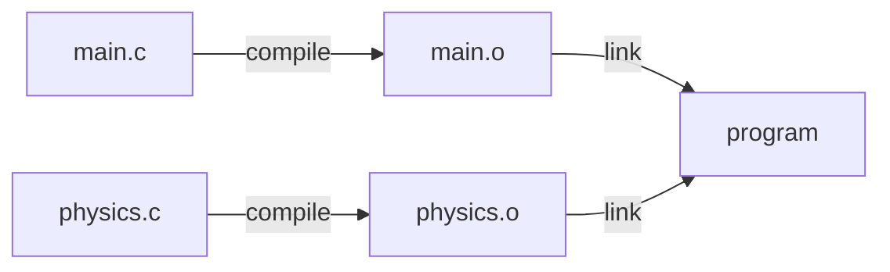

# Engine Lesson 05 — Header-Only Libraries

How `forge_math.h` delivers 2 000 lines of math without a single `.c` file —
and why every function is `static inline`.

## What you'll learn

- What a header-only library is and why forge-gpu uses them
- How include guards (`#ifndef` / `#define` / `#endif`) prevent double inclusion
- What `#pragma once` is, how it compares to include guards, and when to
  prefer one over the other
- What the one-definition rule (ODR) is and how it causes linker errors
- Why `static inline` is the standard pattern for functions in header-only C
  libraries
- What is safe to put in a header (types, macros, `static inline` functions)
  and what is not (plain functions, global variables)

## Why this matters

Every GPU lesson in forge-gpu includes `forge_math.h`. Scene-loading lessons
include `forge_gltf.h`. Mesh-loading lessons include `forge_obj.h`. All three
are header-only libraries — no separate `.c` file to compile, no library to
link. You just `#include` the header and every function is available.

This works because of three C language features working together: include
guards, the `static` storage class, and the `inline` hint. If any one of them
is missing, the build breaks with errors that are confusing if you have not
seen them before. This lesson explains what each feature does, why it is
needed, and what error you get without it.

## Result

The example program uses a tiny header-only 2D vector library (`my_vec.h`)
from two separate `.c` files to demonstrate that include guards and
`static inline` work together to avoid compile and link errors.

**Example output:**

```text
INFO: === Engine Lesson 05: Header-Only Libraries ===
INFO:
INFO: ------------------------------------------------------------
INFO:   1. Using a Header-Only Library
INFO: ------------------------------------------------------------
INFO: Starting position: (0.0, 10.0)
INFO: Starting velocity: (3.0, 0.0)
INFO:
INFO: These functions come from my_vec.h -- a header-only library.
INFO: No .c file for the library, no separate compilation step.
INFO: Just #include "my_vec.h" and every function is available.
INFO:
INFO: ------------------------------------------------------------
INFO:   2. Include Guards in Action
INFO: ------------------------------------------------------------
INFO: This file includes my_vec.h THREE times:
INFO:   1. #include "my_vec.h"      (directly)
INFO:   2. #include "my_vec.h"      (directly, on purpose)
INFO:   3. #include "physics.h"     (which includes my_vec.h internally)
INFO:
INFO: All three compiles down to just ONE copy of the declarations.
INFO: The include guard (#ifndef MY_VEC_H / #define MY_VEC_H / #endif)
INFO: ensures that only the first #include is processed.  The second
INFO: and third see that MY_VEC_H is already defined and skip the file.
INFO:
INFO: Without include guards, the compiler would see the Vec2 typedef
INFO: three times and report: "error: redefinition of 'Vec2'"
INFO:
INFO: ------------------------------------------------------------
INFO:   3. Multiple Translation Units
INFO: ------------------------------------------------------------
INFO: This program is built from two .c files:
INFO:   main.c    -- includes my_vec.h, calls Vec2_create, Vec2_length
INFO:   physics.c -- includes my_vec.h, calls Vec2_add, Vec2_scale
INFO:
INFO: Both files include my_vec.h, so both contain Vec2_create,
INFO: Vec2_add, Vec2_scale, etc.  This works because the functions
INFO: are declared 'static inline':
INFO:
INFO:   static  -> each .c file gets a PRIVATE copy (not exported)
INFO:   inline  -> compiler substitutes body at call site (no call)
INFO:
INFO: Without 'static', the linker would see two PUBLIC definitions
INFO: of Vec2_create (one from main.o, one from physics.o) and
INFO: report: "multiple definition of 'Vec2_create'"
INFO: That error is the one-definition rule (ODR) being enforced.
INFO:
INFO: Calling physics functions (compiled separately in physics.c):
INFO:   Time step: 0.016 seconds
INFO:   After gravity:  velocity = (3.000, -0.157)
INFO:   After movement: position = (0.048, 9.997)
INFO:
INFO: Both main.c and physics.c use the same header-only library,
INFO: compiled independently, linked together without conflict.
INFO:
INFO: ------------------------------------------------------------
INFO:   4. How forge_math.h Uses These Patterns
INFO: ------------------------------------------------------------
INFO: forge_math.h is a real header-only library with ~2000 lines.
INFO: It uses the same three patterns:
INFO:
INFO:   1. Include guard:  #ifndef FORGE_MATH_H / #define FORGE_MATH_H
INFO:   2. Type defs:      typedef struct vec3 { float x, y, z; } vec3;
INFO:   3. static inline:  static inline vec3 vec3_add(vec3 a, vec3 b)
INFO:
INFO: Using forge_math.h right now:
INFO:   vec3_add((1, 2, 3), (4, 5, 6)) = (5, 7, 9)
INFO:
INFO: forge_math.h and my_vec.h coexist in the same file because
INFO: their include guards use different names (FORGE_MATH_H vs
INFO: MY_VEC_H) and their types have different names (vec3 vs Vec2).
INFO:
INFO: ------------------------------------------------------------
INFO:   5. What Goes Wrong Without These Patterns
INFO: ------------------------------------------------------------
INFO: Error 1: Missing include guard
INFO:   ...
INFO: Error 2: Missing 'static' on functions
INFO:   ...
INFO: Error 3: Plain global variable in a header
INFO:   ...
INFO:
INFO: ------------------------------------------------------------
INFO:   Summary
INFO: ------------------------------------------------------------
INFO: Header-only library checklist:
INFO:   [1] Include guard:  #ifndef NAME_H / #define NAME_H / #endif
INFO:   [2] All functions:  static inline return_type name(...)
INFO:   [3] Types:          typedef struct (safe, no storage)
INFO:   [4] Constants:      #define (preprocessor, no symbols)
INFO:
INFO: === All sections complete ===
```

## Key concepts

- **Header-only library** — A library distributed entirely as a `.h` file.
  No `.c` file to compile, no `.a` or `.so` to link. You `#include` it and
  every function is available in your translation unit.
- **Include guard** — The `#ifndef` / `#define` / `#endif` pattern that
  prevents a header from being processed more than once per translation unit.
- **`#pragma once`** — A compiler extension that does the same job as an
  include guard in a single line. Supported by all major compilers but not
  part of the C standard.
- **Translation unit** — One `.c` file after the preprocessor has expanded
  all its `#include` directives. The compiler processes each translation unit
  independently, producing one `.o` (object) file per `.c` file.
- **One-definition rule (ODR)** — The rule that every external (non-`static`)
  function or variable can have exactly one definition across all object files
  in a program. Violating it produces "multiple definition" linker errors.
- **`static inline`** — The standard way to define functions in a header-only
  C library. `static` makes each translation unit's copy private (avoiding ODR
  violations), and `inline` hints that the compiler should substitute the
  function body at the call site.

## The Details

### What is a header-only library?

A normal C library is split into two parts:

- A **header** (`.h`) declares the API — types, function signatures, constants
- A **source file** (`.c`) defines the function bodies

You compile the `.c` file into an object file (`.o`), then link it into your
program. The header tells the compiler what functions exist; the object file
provides the actual machine code.

A **header-only** library puts everything — declarations *and* definitions —
in the `.h` file. There is no `.c` file. You `#include` the header, and the
compiler sees the full function bodies right there.

**Advantages:**

- **No build step** — Nothing to compile separately, no library to link
- **Easy integration** — Copy one file into your project and `#include` it
- **Inlining** — The compiler sees every function body, so it can inline
  small functions (eliminating function-call overhead)

**Tradeoff:**

- **Compile time** — Every `.c` file that includes the header compiles all
  the functions. For large header-only libraries, this adds to build time.
  For the function sizes typical in `forge_math.h`, this is negligible.

### Include guards

When the preprocessor encounters `#include "my_vec.h"`, it copies the entire
contents of `my_vec.h` into the current file. If two different headers both
include `my_vec.h`, or if you include it directly and also via another header,
the preprocessor would insert it multiple times — causing "redefinition"
errors.

Include guards prevent this:

```c
#ifndef MY_VEC_H       /* If MY_VEC_H is not yet defined... */
#define MY_VEC_H       /* ...define it now (so the next #ifndef fails)... */

/* All declarations and definitions go here */

typedef struct Vec2 {
    float x, y;
} Vec2;

static inline Vec2 Vec2_create(float x, float y)
{
    Vec2 v;
    v.x = x;
    v.y = y;
    return v;
}

#endif /* MY_VEC_H */  /* ...end of the guarded block */
```

How it works step by step:

1. **First `#include "my_vec.h"`**: `MY_VEC_H` is not defined, so `#ifndef`
   passes. `#define MY_VEC_H` sets it. The file contents are processed.
2. **Second `#include "my_vec.h"`** (direct or via another header):
   `MY_VEC_H` is now defined, so `#ifndef` fails. Everything down to `#endif`
   is skipped.

The guard name conventionally matches the filename in `UPPER_SNAKE_CASE`:

| File | Guard |
|------|-------|
| `forge_math.h` | `FORGE_MATH_H` |
| `forge_obj.h` | `FORGE_OBJ_H` |
| `my_vec.h` | `MY_VEC_H` |

### `#pragma once` — the alternative

`#pragma once` is a compiler-specific directive that does the same thing as
an include guard in a single line:

```c
#pragma once

typedef struct Vec2 {
    float x, y;
} Vec2;

/* ... */
```

**Advantages over include guards:**

- Shorter — one line instead of three
- No risk of typos in the guard name (a common source of bugs)
- Some compilers can optimize it (skip re-opening the file entirely)

**Why forge-gpu uses include guards instead:**

- `#pragma once` is not part of the C standard (C99, C11, C23). It is a
  compiler extension. Every major compiler supports it (GCC, Clang, MSVC),
  but it is technically non-portable.
- Include guards are guaranteed by the standard to work everywhere.
- In shared libraries used by many projects, standards compliance matters more
  than saving two lines.

**In practice:** Both approaches work. Use `#pragma once` in your own projects
if you prefer brevity. Use include guards in shared libraries where portability
is the priority.

### The one-definition rule (ODR)

The C compiler processes each `.c` file independently, producing one object
file (`.o`) per source file. The linker then combines all object files into
the final executable.



The **one-definition rule** states: each function or global variable with
*external linkage* (visible outside its translation unit) can be defined in
exactly one object file. If the linker finds two object files that both define
the same external symbol, it reports an error.

This is where header-only libraries face a challenge. If `my_vec.h` contains
a plain (non-`static`) function:

```c
/* BAD: plain function in a header */
Vec2 Vec2_create(float x, float y)   /* no 'static', no 'inline' */
{
    Vec2 v;
    v.x = x;
    v.y = y;
    return v;
}
```

Then `main.c` includes `my_vec.h` → `main.o` contains a public `Vec2_create`.
And `physics.c` includes `my_vec.h` → `physics.o` also contains a public
`Vec2_create`. The linker sees two definitions and reports:

```text
multiple definition of 'Vec2_create'
  first defined in main.o
```

### `static inline` — the solution

```c
static inline Vec2 Vec2_create(float x, float y)
{
    Vec2 v;
    v.x = x;
    v.y = y;
    return v;
}
```

The two keywords work together:

**`static`** changes the function's *linkage* from external to internal. A
`static` function is private to the translation unit that contains it. When
both `main.c` and `physics.c` include `my_vec.h`, each gets its own private
copy of `Vec2_create`. The linker never sees a conflict because neither copy
is exported.

**`inline`** tells the compiler that this function is a good candidate for
*inlining* — substituting the function body directly at the call site instead
of generating a function call. For small functions like vector addition, this
eliminates call overhead (pushing arguments, jumping, returning).

`static` alone is sufficient for correctness — the program would compile and
link without `inline`. But `inline` is important for performance in math
libraries, where functions like `vec3_add` may be called thousands of times
per frame.

### What is safe in a header

| Construct | Safe in a header? | Why |
|-----------|-------------------|-----|
| `#define` constants | Yes | Preprocessor replacement — no symbols |
| `typedef struct` | Yes | Type description only — no storage |
| `enum` | Yes | Compile-time constants — no storage |
| `static inline` functions | Yes | Private to each TU — no ODR conflict |
| `static const` variables | Yes | Private to each TU — no ODR conflict |
| Plain functions | **No** | Exported symbol — ODR violation if multiply included |
| Global variables | **No** | Exported symbol — ODR violation if multiply included |
| `extern` declarations | Yes | Declaration only (definition must be in exactly one `.c` file) |

### How forge_math.h uses these patterns

Open `common/math/forge_math.h` and you will see all of these patterns in
a real library:

**Include guard** (top of file):

```c
#ifndef FORGE_MATH_H
#define FORGE_MATH_H
```

**Constants** (preprocessor — no symbols):

```c
#define FORGE_PI      3.14159265358979323846f
#define FORGE_TAU     6.28318530717958647692f
#define FORGE_EPSILON 1.1920928955078125e-7f
```

**Type definitions** (types — no storage):

```c
typedef struct vec3 {
    float x, y, z;
} vec3;
```

**Functions** (`static inline` — private to each TU):

```c
static inline float forge_lerpf(float a, float b, float t)
{
    return a + t * (b - a);
}
```

**Closing guard** (bottom of file):

```c
#endif /* FORGE_MATH_H */
```

Every one of the ~100 functions in `forge_math.h` follows this pattern. So do
`forge_obj.h` and `forge_gltf.h`. The same rules apply regardless of library
size.

## Common errors

### "redefinition of 'Vec2'" (missing include guard)

**What you see:**

```text
my_vec.h:5:16: error: redefinition of 'Vec2'
    5 | typedef struct Vec2 {
      |                ^~~~
my_vec.h:5:16: note: previous definition of 'Vec2' was here
```

**Why it happens:** The header has no include guard, and it is included more
than once in the same translation unit — either directly (`#include` twice)
or indirectly (via another header that also includes it).

**How to fix it:** Add the standard three-line include guard:

```c
#ifndef MY_VEC_H
#define MY_VEC_H
/* ... all content ... */
#endif
```

### "multiple definition of 'Vec2_create'" (missing `static`)

**What you see:**

```text
/usr/bin/ld: physics.o: in function 'Vec2_create':
physics.c:(.text+0x0): multiple definition of 'Vec2_create';
  main.o:main.c:(.text+0x0): first defined here
collect2: error: ld returned 1 exit status
```

**Why it happens:** The function is declared without `static`, so both
`main.o` and `physics.o` export a public symbol named `Vec2_create`. The
linker enforces the one-definition rule: only one definition of an external
symbol is allowed.

**How to fix it:** Add `static inline` to the function declaration:

```c
static inline Vec2 Vec2_create(float x, float y)  /* was: Vec2 Vec2_create(...) */
```

### Include guard name collision

**What you see:** One header's contents silently disappear. You get cascading
errors from code that uses the missing types:

```text
main.c:12:5: error: unknown type name 'Color'
   12 |     Color bg = Color_create(0.1f, 0.1f, 0.1f, 1.0f);
      |     ^~~~~
```

**Why it happens:** Two different headers use the same guard name (e.g., both
use `#ifndef UTILS_H`). The first header sets the guard; the second header's
`#ifndef` fails and its entire content is skipped.

**How to fix it:** Use the full filename in the guard name. Prefer
`MY_PROJECT_UTILS_H` over just `UTILS_H` to reduce the chance of collision.

## Where it's used

In forge-gpu lessons:

- Every GPU lesson includes `math/forge_math.h` — a header-only library
  following the exact patterns taught here
- [GPU Lesson 08 — Mesh Loading](../../gpu/08-mesh-loading/) includes
  `obj/forge_obj.h` — a header-only OBJ parser
- [GPU Lesson 09 — Scene Loading](../../gpu/09-scene-loading/) includes
  `gltf/forge_gltf.h` — a header-only glTF parser
- [Engine Lesson 02 — CMake Fundamentals](../02-cmake-fundamentals/) explains
  how `target_include_directories` makes headers findable by the compiler
- [Engine Lesson 04 — Pointers & Memory](../04-pointers-and-memory/) covers
  `sizeof` and `offsetof`, which are used alongside header-only math types in
  vertex buffer setup

## Building

```bash
cmake -B build
cmake --build build --config Debug

# Windows
build\lessons\engine\05-header-only-libraries\Debug\05-header-only-libraries.exe

# Linux / macOS
./build/lessons/engine/05-header-only-libraries/05-header-only-libraries
```

## Exercises

1. **Remove the include guard from `my_vec.h`** — Comment out the `#ifndef`,
   `#define`, and `#endif` lines. Try to build. Read the compiler error.
   Then restore the guard.

2. **Remove `static` from a function** — Change one function from
   `static inline Vec2 Vec2_add(...)` to just `inline Vec2 Vec2_add(...)`.
   Build the project. Read the linker error. Notice that it is a *linker*
   error (from `ld`), not a *compiler* error — both `.c` files compile fine
   individually, but the linker cannot combine them.

3. **Write your own header-only library** — Create `my_color.h` with a
   `Color` struct (r, g, b, a floats) and functions like `Color_create`,
   `Color_lerp`, and `Color_scale`. Include it from both `main.c` and
   `physics.c` to verify it links correctly.

4. **Try `#pragma once`** — Replace the include guard in `my_vec.h` with
   `#pragma once`. Verify that the program still builds and runs identically.

## Further reading

- [Engine Lesson 02 — CMake Fundamentals](../02-cmake-fundamentals/) — How
  `target_include_directories` makes headers findable
- [Engine Lesson 04 — Pointers & Memory](../04-pointers-and-memory/) — Memory
  layout and `sizeof`, used alongside header-only math types
- [`common/math/forge_math.h`](../../../common/math/forge_math.h) — The real
  header-only math library these patterns come from
- [`common/math/DESIGN.md`](../../../common/math/DESIGN.md) — Design
  decisions behind forge_math.h (coordinate system, matrix layout, etc.)
- [C99 Standard §6.2.2](https://www.open-std.org/jtc1/sc22/wg14/www/docs/n1256.pdf)
  — Linkage of identifiers (where the ODR is formally specified)
