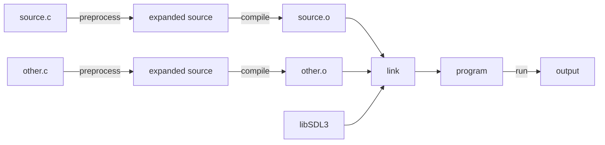

# Engine Lesson 06 — Reading Error Messages

How to read compiler errors, linker errors, and runtime crashes — and fix them
systematically.

## What you'll learn

- The **build pipeline** phases (preprocess, compile, link, run) and the type of
  error each phase produces
- How to **read a compiler error**: file, line number, column, error description,
  and the caret/underline indicator
- How to **read a linker error**: the difference between "undefined reference"
  (GCC/Clang) and "unresolved external symbol" (MSVC), and what causes each
- How to **diagnose runtime crashes**: segmentation faults, SDL function failures,
  assertion failures, and the "black screen" problem
- The difference between **warnings and errors**, and which compiler flags to
  enable
- A **systematic strategy** for working through a wall of error messages

## Why this matters

Error messages are how the toolchain communicates with you. Every forge-gpu
lesson produces errors when something is misconfigured — a missing
`target_link_libraries`, a typo in a variable name, a shader that fails to
compile. The difference between a frustrating hour and a quick fix is whether
you can read what the error message is telling you.

Most beginners see an error and feel stuck. They read the word "error" and stop.
But every error message contains a diagnosis: the file, the line, the exact
problem, and often a suggestion. Learning to parse that structure is one of the
highest-leverage skills in programming.

This lesson teaches you to read errors from three different phases of the build
pipeline — and to distinguish which phase produced the error, because the fix
is completely different for each.

## Result

The example program walks through annotated examples of compiler errors, linker
errors, and runtime crashes, explaining the structure and meaning of each. It
also demonstrates live SDL error handling by triggering a safe runtime failure.

**Example output:**

```text
INFO: === Engine Lesson 06: Reading Error Messages ===
INFO:
INFO: ============================================================
INFO:   1. The Build Pipeline
INFO: ============================================================
INFO: Building a C program happens in phases:
INFO:
INFO:   source.c -> [preprocess] -> [compile] -> source.o -+
INFO:                                                      |
INFO:   other.c  -> [preprocess] -> [compile] -> other.o  -+-> [link] -> program
INFO:                                                      |
INFO:   libSDL3  -----------------------------------------+
INFO:
INFO: Each phase catches different kinds of mistakes:
INFO:
INFO:   Phase        | What it checks        | Error type
INFO:   -------------+-----------------------+-----------------------
INFO:   Preprocess   | #include, #define     | 'file not found'
INFO:   Compile      | Syntax, types         | 'expected', 'undeclared'
INFO:   Link         | Symbol references     | 'undefined reference'
INFO:   Run          | Logic, resources       | Crash, wrong output
INFO:
INFO: The error message tells you WHICH phase failed.
INFO: That immediately narrows down where to look.
INFO:
INFO: ============================================================
INFO:   2. Compiler Errors
INFO: ============================================================
INFO: ...
INFO:
INFO: ============================================================
INFO:   3. Linker Errors
INFO: ============================================================
INFO: ...
INFO:
INFO: ============================================================
INFO:   4. Runtime Errors
INFO: ============================================================
INFO: ...
INFO:   Live demonstration — calling SDL_LoadFile on a missing file:
INFO:
INFO:     SDL_LoadFile returned NULL
INFO:     SDL_GetError(): Parameter 'src' is invalid
INFO: ...
INFO:
INFO: ============================================================
INFO:   5. Warnings
INFO: ============================================================
INFO: ...
INFO:
INFO: ============================================================
INFO:   6. Strategy for Fixing Errors
INFO: ============================================================
INFO: ...
INFO:
INFO: === All sections complete ===
```

## Key concepts

- **Build pipeline** — The sequence of phases (preprocess → compile → link →
  run) that turns source code into a running program. Each phase catches
  different kinds of mistakes.
- **Compiler error** — A syntax or type mistake caught during compilation. The
  compiler reports the file, line, column, and a description of the problem.
- **Linker error** — A missing symbol discovered when combining object files
  into an executable. The code compiled, but a function or variable is defined
  nowhere.
- **Runtime error** — A crash or failure that happens while the program runs.
  The build succeeded, but the program does something wrong at execution time.
- **Warning** — A message from the compiler about code that is technically
  legal but likely a mistake. Programs compile despite warnings, but warnings
  often indicate real bugs.
- **Cascading errors** — One mistake (like a missing semicolon) can trigger
  many follow-on errors. Fixing the first error often eliminates the rest.

## The Details

### The build pipeline

Building a C program is not one step — it is a pipeline of distinct phases. Each
phase transforms the code and checks for different kinds of problems:



**Phase 1 — Preprocess:** The preprocessor expands `#include` directives
(replacing them with the contents of the header file), evaluates `#define`
macros, and processes `#ifdef` conditional blocks. Errors at this phase are
about missing files or malformed macros.

**Phase 2 — Compile:** The compiler reads the preprocessed source code, checks
that it follows C syntax rules and type rules, and produces an object file
(`.o` on Linux/macOS, `.obj` on Windows). Each `.c` file is compiled
independently — the compiler does not know about other `.c` files. Errors at
this phase are about syntax, types, and undeclared identifiers.

**Phase 3 — Link:** The linker takes all the object files and libraries and
combines them into one executable. It resolves every function call — if `main.o`
calls `render()`, the linker must find a definition of `render` in some other
object file or library. Errors at this phase are about missing or duplicate
symbol definitions.

**Phase 4 — Run:** The operating system loads and executes the program. Crashes,
wrong output, and resource failures happen here. There is no compiler to help
you — you need a debugger, `SDL_Log` calls, or careful reading of the program's
output.

The error message itself tells you which phase failed. Learning to identify the
phase is the first step to fixing the problem.

### How to read a compiler error

Every compiler error follows a consistent structure. Here is a GCC error
message, broken down piece by piece:

```text
main.c:42:30: error: use of undeclared identifier 'coutn'
    SDL_Log("count = %d", coutn);
                          ^~~~~
```

| Part | Meaning |
|------|---------|
| `main.c` | The source file containing the error |
| `42` | The line number (open the file, go to line 42) |
| `30` | The column number (character 30 on that line) |
| `error` | Severity — this prevents compilation |
| `use of undeclared identifier 'coutn'` | What went wrong |
| `^~~~~` | Caret pointing to the exact location in the source line |

MSVC uses a slightly different format:

```text
main.c(42): error C2065: 'coutn': undeclared identifier
```

The information is the same — file, line, error code, description — just
arranged differently. MSVC error codes (like `C2065`) are searchable in
Microsoft's documentation.

#### Common compiler errors

**Missing semicolon:**

```text
main.c:5:15: error: expected ';' before 'int'
    int y = 10;
              ^
```

The error points to line 5, but the missing semicolon is on line 4. The
compiler cannot tell that line 4's statement is incomplete until it sees the
next token on line 5. When an error does not make sense on the reported line,
check the line above.

**Undeclared identifier (typo or missing `#include`):**

```text
main.c:12:5: error: call to undeclared function 'SDL_Createwindow'
```

Check the spelling. SDL function names use exact casing:
`SDL_CreateWindow`, not `SDL_Createwindow`.

**Missing header file:**

```text
main.c:1:10: fatal error: 'math/forge_math.h' file not found
```

The word "fatal" means the compiler stops immediately — it cannot continue
without this file. Check the file path, check that it exists, and check that
`target_include_directories` in CMake includes the directory containing it.

**Implicit function declaration:**

```text
main.c:20:5: error: implicit declaration of function 'my_helper'
```

The compiler sees a call to `my_helper()` but has never seen a declaration for
it. Either add `#include` for the header that declares it, add a forward
declaration (`void my_helper(void);`) before the call, or check the spelling.

### How to read a linker error

Linker errors look different from compiler errors. They mention object files
(`.o` / `.obj`) and symbol names instead of source lines:

```text
/usr/bin/ld: main.o: in function 'main':
main.c:(.text+0x9): undefined reference to 'render'
collect2: error: ld returned 1 exit status
```

| Part | Meaning |
|------|---------|
| `/usr/bin/ld` | The linker program (not the compiler) |
| `main.o` | The object file that contains the reference |
| `in function 'main'` | Which function makes the call |
| `undefined reference to 'render'` | The symbol the linker cannot find |
| `collect2` | GCC's linker driver, reporting the failure |

The MSVC equivalent:

```text
main.obj : error LNK2019: unresolved external symbol render referenced in function main
main.exe : fatal error LNK1120: 1 unresolved externals
```

#### How to distinguish compiler errors from linker errors

| Compiler error | Linker error |
|----------------|--------------|
| Shows `file:line:col` | Shows `.o` or `.obj` file names |
| Says `error:` or `fatal error:` | Says `undefined reference` or `unresolved external symbol` |
| Points to source code | Points to symbol names |
| Produced by `gcc` / `clang` / `cl` | Produced by `ld` / `link.exe` / `collect2` |

If the message includes a source file with a line number, it is a compiler
error. If it mentions `.o` / `.obj` files and symbol names, it is a linker
error.

#### Common linker errors

**Undefined reference — missing source file:**

You declared a function in a header and called it from `main.c`, but the `.c`
file containing the definition is not listed in `add_executable()`:

```cmake
# Wrong — render.c is not compiled
add_executable(my_app main.c)

# Fixed — render.c is included
add_executable(my_app main.c render.c)
```

**Undefined reference — missing library:**

You included SDL headers and called SDL functions, but forgot to link the
library:

```cmake
# Wrong — SDL3 is not linked
add_executable(my_app main.c)

# Fixed — SDL3 is linked
add_executable(my_app main.c)
target_link_libraries(my_app PRIVATE SDL3::SDL3)
```

When you see many `undefined reference` errors all pointing to functions from
the same library, the library is not linked.

**Multiple definition — one-definition rule (ODR) violation:**

Two `.c` files both define a function with the same name, and neither marks it
`static`:

```text
/usr/bin/ld: b.o: in function 'helper':
b.c:(.text+0x0): multiple definition of 'helper';
a.o:a.c:(.text+0x0): first defined here
```

Fix: mark the function `static` if it is file-private, or keep one definition
and declare it in a shared header. See
[Engine Lesson 05 — Header-Only Libraries](../05-header-only-libraries/) for the
`static inline` pattern.

### Runtime errors

Runtime errors happen after the build succeeds. The code is syntactically
correct and all symbols resolve, but the program does something wrong during
execution.

#### Segmentation fault

A segmentation fault (segfault) means the program accessed memory it does not
own. The operating system kills the program immediately.

```text
Linux:   Segmentation fault (core dumped)
macOS:   Segmentation fault: 11
Windows: Exception: Access violation writing location 0x00000000
```

Common causes:

- **Dereferencing a NULL pointer** — `int *p = NULL; *p = 42;`
- **Use-after-free** — Using a pointer after calling `SDL_free()` on it
  (see [Engine Lesson 04](../04-pointers-and-memory/))
- **Array index out of bounds** — `int arr[5]; arr[10] = 99;`
- **Stack overflow** — Infinite recursion or a very large local array

A segfault does not produce a helpful message on its own. Use a debugger (see
Engine Lesson 07) to find the exact line, or add `SDL_Log` calls before the
crash to narrow down the location.

#### SDL function failures

Many SDL functions return `false` (or `NULL`) on failure and set an internal
error string. Call `SDL_GetError()` to retrieve the description:

```c
if (!SDL_CreateWindow("App", 800, 600, SDL_WINDOW_VULKAN)) {
    SDL_Log("CreateWindow failed: %s", SDL_GetError());
    return 1;
}
```

Every SDL function that can fail should be checked. The forge-gpu code
conventions require this — see
[GPU Lesson 01 — Hello Window](../../gpu/01-hello-window/) for the pattern used
throughout the project.

#### GPU-specific runtime problems

GPU programs have additional failure modes beyond regular C crashes:

- **Shader compilation failure** — The HLSL source has a syntax error. Check
  `shaders/*.hlsl` and recompile with
  `python scripts/compile_shaders.py`
- **Pipeline creation failure** — The vertex layout does not match the shader
  inputs. Check attribute formats, offsets (`offsetof`), and binding numbers
- **Missing assets** — `SDL_LoadFile` returns NULL because an asset file is
  missing or the working directory is wrong
- **Black screen** — The build succeeds and the program runs, but nothing is
  visible. Common causes: vertices outside the clip volume (normalized device
  coordinates, or NDC, range -1 to +1),
  back-face culling discarding triangles, depth test failing, or the clear color
  matching the geometry color

#### Assertion failures

An assertion checks that a condition must be true. When it fails, the program
prints the file, line, and the violated condition:

```text
Assertion failure at main.c:85 'texture != NULL'
```

Assertions are one of the most helpful debugging tools because they tell you
exactly which assumption was wrong. Use `SDL_assert()` to guard critical
assumptions in your own code.

### Warnings vs errors

**Errors** prevent the build from completing. You must fix them.

**Warnings** allow the build to succeed, but they frequently indicate real bugs.
The compiler is telling you: "This code is technically legal, but it looks like
a mistake."

Common warnings:

| Warning | What it means |
|---------|---------------|
| `unused variable 'x'` | You declared `x` but never used it |
| `implicit conversion from 'float' to 'int'` | Precision loss — use an explicit cast |
| `format '%d' expects 'int' but argument is 'double'` | Wrong format specifier in `SDL_Log` / `printf` |
| `'x' is used uninitialized` | You read a variable before assigning it a value |

**Recommended compiler flags:**

| Compiler | Flags | Purpose |
|----------|-------|---------|
| GCC/Clang | `-Wall -Wextra -Wpedantic` | Enable most useful warnings |
| MSVC | `/W4` | Warning level 4 (most warnings) |
| GCC/Clang | `-Werror` | Treat warnings as errors |
| MSVC | `/WX` | Treat warnings as errors |

In CMake:

```cmake
target_compile_options(my_target PRIVATE
    $<$<NOT:$<C_COMPILER_ID:MSVC>>:-Wall -Wextra>
)
```

### Strategy for fixing errors

When faced with a wall of error messages, follow these rules:

**Rule 1 — Fix the first error first.** One mistake can cause a cascade of
follow-on errors. A missing semicolon on line 10 can produce 20 errors on lines
11–50. Fix line 10, recompile, and most of those 20 errors disappear.

**Rule 2 — Read the full error message.** Do not stop at the word "error." Read
the file name, line number, error description, the source line with the caret
(`^`), and any `note:` lines that follow (they add context).

**Rule 3 — Check one line above.** Many errors (missing semicolons, unclosed
braces, missing commas) are reported on the line *after* the actual mistake. The
compiler does not realize the statement is incomplete until it sees the next
token.

**Rule 4 — Identify the error phase.** Compiler error? Look at the source code.
Linker error? Check `CMakeLists.txt` for missing source files or libraries.
Runtime crash? Use a debugger or add `SDL_Log` calls.

**Rule 5 — Search the error message.** Copy the key phrase (e.g., "undefined
reference to") into a search engine. Thousands of developers have encountered
the same error, and the top results usually explain the cause and the fix.

## Common errors

### "expected ';' before ..."

**What you see:**

```text
main.c:5:15: error: expected ';' before 'int'
```

**Why it happens:** A semicolon is missing on the previous line. The compiler
does not realize the statement is incomplete until it encounters the next token.

**How to fix it:** Look at line 4 (one line above the reported error) and add
the missing semicolon.

### "undeclared identifier" / "use of undeclared identifier"

**What you see:**

```text
main.c:12:30: error: use of undeclared identifier 'coutn'
```

**Why it happens:** Either a variable name is misspelled, or the header that
declares it has not been included.

**How to fix it:** Check the spelling. If the name is correct, add the
appropriate `#include` directive.

### "undefined reference to" / "unresolved external symbol"

**What you see:**

```text
/usr/bin/ld: main.o: undefined reference to 'render'
```

**Why it happens:** The function is declared (the compiler saw a prototype) but
never defined (no `.c` file contains the function body), or the library
containing the definition is not linked.

**How to fix it:** Check that the `.c` file with the definition is listed in
`add_executable()` in CMake, and that external libraries are linked with
`target_link_libraries()`.

### "multiple definition of"

**What you see:**

```text
b.o: multiple definition of 'helper'; a.o: first defined here
```

**Why it happens:** Two `.c` files both define a function with the same name,
violating the one-definition rule.

**How to fix it:** Mark the function `static` (file-private), or keep one
definition in a `.c` file and declare it in a shared header. See
[Engine Lesson 05](../05-header-only-libraries/) for details.

### "Segmentation fault"

**What you see:**

```text
Segmentation fault (core dumped)
```

**Why it happens:** The program accessed memory it does not own — usually a NULL
pointer dereference, use-after-free, or array out-of-bounds.

**How to fix it:** Use a debugger to find the line that crashed (see Engine
Lesson 07). Or add `SDL_Log` calls before the suspected area to narrow down the
location. Check all pointers for NULL before dereferencing.

### "file not found" (fatal error)

**What you see:**

```text
main.c:1:10: fatal error: 'math/forge_math.h' file not found
```

**Why it happens:** The include path does not contain the specified file. Either
the file does not exist, the path is misspelled, or
`target_include_directories` is missing from CMake.

**How to fix it:** Verify the file exists, check the spelling, and ensure
CMake's `target_include_directories` includes the correct parent directory.

## Where it's used

Understanding error messages is relevant to every lesson in forge-gpu:

- [Engine Lesson 02 — CMake Fundamentals](../02-cmake-fundamentals/) shows
  specific CMake-related linker errors and how to fix them
- [Engine Lesson 04 — Pointers & Memory](../04-pointers-and-memory/) covers the
  memory bugs (use-after-free, double free, buffer overflow) that cause runtime
  crashes
- [Engine Lesson 05 — Header-Only Libraries](../05-header-only-libraries/)
  explains the one-definition rule violations that cause "multiple definition"
  linker errors
- [Math Lesson 01 — Vectors](../../math/01-vectors/) is the first lesson that
  uses the math library — a missing `#include "math/forge_math.h"` or a
  misspelled function name like `vec3_normlize` produces the compiler errors
  described in this lesson
- [GPU Lesson 01 — Hello Window](../../gpu/01-hello-window/) establishes the
  SDL error checking pattern used in every GPU lesson
- Every GPU lesson uses `SDL_GetError()` to report runtime failures — this
  lesson explains how to read those reports

## Building

```bash
cmake -B build
cmake --build build --config Debug

# Easy way — use the run script
python scripts/run.py engine/06

# Windows
build\lessons\engine\06-reading-error-messages\Debug\06-reading-error-messages.exe

# Linux / macOS
./build/lessons/engine/06-reading-error-messages/06-reading-error-messages
```

## Exercises

1. **Trigger a compiler error on purpose.** Remove a semicolon from the end of
   a line in `main.c`. Rebuild and read the error message. Does the error point
   to the line with the missing semicolon, or the line after?

2. **Trigger a linker error on purpose.** Add a call to an undeclared function
   (e.g., `void my_function(void); ... my_function();`) without defining it.
   Rebuild and compare the error message to the examples in this lesson.

3. **Enable extra warnings.** Add `-Wall -Wextra` to the compile options in
   `CMakeLists.txt` (using `target_compile_options`). Do any new warnings
   appear? What do they mean?

4. **Cause a deliberate runtime crash.** In a separate test file, dereference a
   NULL pointer and run the program. Observe the operating system's error
   message. Then use a debugger to find the exact line (preview of Engine
   Lesson 07).

5. **Read an unfamiliar error.** Find a forge-gpu GPU lesson, temporarily break
   something (remove a `target_link_libraries` call or rename a variable), and
   practice reading the resulting error. Can you identify the phase (compile,
   link, runtime) and the fix?

## Further reading

- [Engine Lesson 02 — CMake Fundamentals](../02-cmake-fundamentals/) — Build
  system errors and how CMake targets work
- [Engine Lesson 04 — Pointers & Memory](../04-pointers-and-memory/) — Memory
  bugs that cause runtime crashes
- [Engine Lesson 05 — Header-Only Libraries](../05-header-only-libraries/) —
  ODR violations and how `static inline` prevents them
- [GCC Diagnostics Documentation](https://gcc.gnu.org/onlinedocs/gcc/Warning-Options.html)
  — Complete reference for GCC warning flags
- [Clang Diagnostics Reference](https://clang.llvm.org/docs/DiagnosticsReference.html)
  — Searchable index of all Clang error and warning messages
- [MSVC Compiler Errors](https://learn.microsoft.com/en-us/cpp/error-messages/compiler-errors-1/compiler-errors-c2001-through-c2099)
  — Microsoft's reference for MSVC error codes
