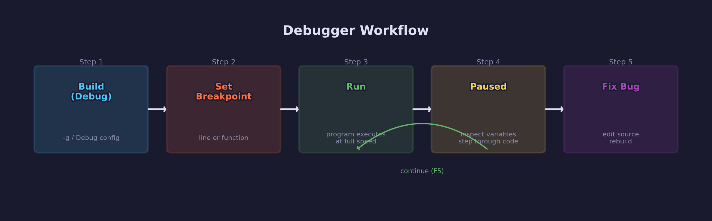
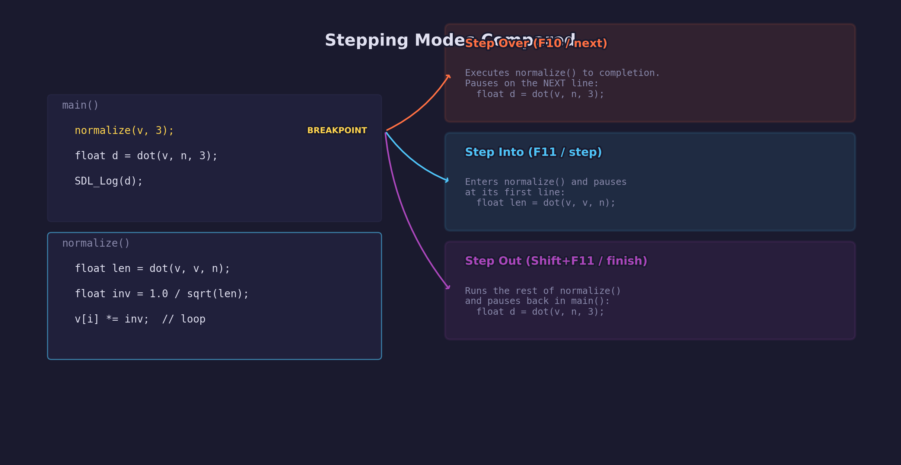
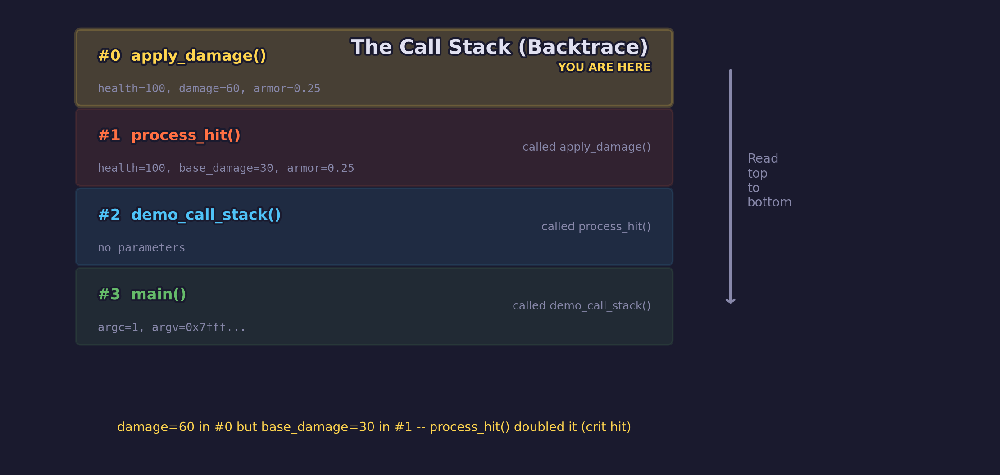

# Engine Lesson 07 — Using a Debugger

Breakpoints, stepping, inspecting variables — finding crashes and logic errors
that error messages cannot explain.

## What you'll learn

- Why error messages are not enough for crashes and logic errors
- How to start a program under a debugger (GDB, LLDB, Visual Studio)
- Setting breakpoints to pause the program at a specific line
- Stepping through code line by line (step over, step into, step out)
- Inspecting variables, structs, arrays, and pointers while paused
- Reading the call stack to understand how execution reached a point
- Using conditional breakpoints to pause only when a condition is true
- Using watchpoints (data breakpoints) to find who modifies a variable

## Why this matters

[Engine Lesson 06](../06-reading-error-messages/) taught you to read error
messages from the compiler, linker, and runtime. Those messages cover most
bugs — but two kinds of problems produce messages that do not point to a source
line:

1. **Crashes** — The operating system says "Segmentation fault" or "Access
   violation" and kills the program. No file name, no line number, no variable
   name. You know _something_ went wrong but not _where_.

2. **Logic errors** — The program runs to completion without any error, but
   the output is wrong. A vertex appears at the wrong position, a color is
   too dark, or a score does not add up. There is no error message at all.

A debugger fills this gap. It lets you pause a running program, inspect every
variable, and step through execution one line at a time. In graphics
programming, you will encounter both crashes (NULL pointers, out-of-bounds
access) and logic errors (wrong matrix transforms, incorrect vertex data)
regularly. The debugger is the tool that makes these problems solvable in
minutes instead of hours.

## Result

The example program walks through each debugger concept with annotated
examples and simulated debugger sessions. It includes a crash scenario
(NULL pointer dereference) and a logic error scenario (integer division,
box blur verification) that you can practice debugging yourself.

**Example output:**

```text
INFO: === Engine Lesson 07: Using a Debugger ===

INFO: ============================================================
INFO:   1. Why You Need a Debugger
INFO: ============================================================
INFO: Engine Lesson 06 taught you to read error messages.
INFO: But two kinds of bugs do not give you a source line:
INFO:
INFO:   1. Crashes (segfault / access violation)
INFO:      You see: 'Segmentation fault (core dumped)'
INFO:      Missing: which file, which line, which variable
INFO:
INFO:   2. Logic errors
INFO:      You see: wrong output (e.g. total = 0 instead of 150)
INFO:      Missing: any error message at all
INFO:
INFO: A debugger fills this gap with four core capabilities:
INFO:
INFO:   Breakpoints  -> Pause the program at a specific line
INFO:   Stepping     -> Execute one line at a time
INFO:   Inspecting   -> Read the value of any variable while paused
INFO:   Call stack   -> See which function called which
```

**Important:** Copy output directly from running the program — the full output
covers all nine sections.

## Key concepts

- **Breakpoint** — An instruction to the debugger: "pause when execution
  reaches this line." Does not change the program. You can set breakpoints by
  line number or by function name.
- **Step Over** — Execute the current line (including any function calls on
  it) and pause on the next line. Stay at the same level of the call stack.
- **Step Into** — Enter the function call on the current line. Pause at its
  first line. Go deeper in the call stack.
- **Step Out** — Run until the current function returns. Pause at the caller.
  Go back up the call stack.
- **Continue** — Resume full-speed execution until the next breakpoint or
  program exit.
- **Call stack (backtrace)** — The chain of function calls that led to the
  current line. Frame #0 is where you are; higher frames are the callers.
- **Conditional breakpoint** — A breakpoint that only pauses when a condition
  is true (e.g., `i == 999`). Essential for loops that run thousands of times.
- **Watchpoint (data breakpoint)** — Pauses the program whenever a variable's
  value changes, regardless of which line modifies it.

## The Details

### Building for debugging

Before using a debugger, you must build with **debug information** — the
compiler embeds a table mapping machine instructions back to source lines and
variable names. Without it, the debugger cannot show you source code.

```bash
# CMake: Debug configuration includes debug info and disables optimizations
cmake -B build -DCMAKE_BUILD_TYPE=Debug
cmake --build build --config Debug
```

The `-DCMAKE_BUILD_TYPE=Debug` flag tells CMake to pass `-g` (GCC/Clang) or
`/Zi` (MSVC) to the compiler. These flags:

- **`-g`** (GCC/Clang) — Generate debug information in DWARF format
- **`/Zi`** (MSVC) — Generate a `.pdb` file with debug information

**Why Debug and not Release?** Release builds enable optimizations (`-O2` or
`/O2`) that reorder, inline, and eliminate code. The debugger shows you the
_optimized_ code, which no longer matches your source line by line. Variables
may be "optimized out" and unavailable for inspection. Always debug with a
Debug build.

### Starting a program under a debugger

#### GDB (Linux, Windows via MinGW/MSYS2)

```bash
gdb ./build/lessons/engine/07-using-a-debugger/07-using-a-debugger
```

```text
(gdb) break main
(gdb) run
```

GDB pauses at `main()`. From here you can set more breakpoints, step through
code, and inspect variables.

#### LLDB (macOS, Linux)

```bash
lldb ./build/lessons/engine/07-using-a-debugger/07-using-a-debugger
```

```text
(lldb) breakpoint set --name main
(lldb) run
```

LLDB works very similarly to GDB. Most GDB commands have LLDB equivalents.

#### Visual Studio (Windows)

1. Open the solution generated by CMake
2. Set `07-using-a-debugger` as the startup project
3. Press **F5** to start debugging (or **F9** to toggle a breakpoint first)

Visual Studio's graphical debugger shows source code, variables, call stack,
and breakpoints all at once. It is the most beginner-friendly option.

### Breakpoints

A breakpoint tells the debugger: "pause the program when execution reaches
this line." The program runs at full speed until it hits the breakpoint, then
stops and waits for your commands.



**By line number:**

| Debugger | Command |
|----------|---------|
| GDB | `break main.c:42` |
| LLDB | `breakpoint set --file main.c --line 42` |
| VS | Click the left margin on line 42 (red dot appears) |

**By function name:**

| Debugger | Command |
|----------|---------|
| GDB | `break calculate_total` |
| LLDB | `breakpoint set --name calculate_total` |
| VS | Right-click the function name, select "Run to Cursor" |

**Managing breakpoints:**

| Action | GDB | LLDB |
|--------|-----|------|
| List all | `info breakpoints` | `breakpoint list` |
| Remove #1 | `delete 1` | `breakpoint delete 1` |
| Disable #2 | `disable 2` | `breakpoint disable 2` |
| Enable #2 | `enable 2` | `breakpoint enable 2` |

### Stepping through code

Once paused at a breakpoint, you control execution one line at a time. The
three stepping commands correspond to three common questions:



| Command | GDB | LLDB | VS | What it does |
|---------|-----|------|----|--------------|
| Step Over | `next` | `next` | F10 | Execute the line, pause on the next |
| Step Into | `step` | `step` | F11 | Enter the function call on this line |
| Step Out | `finish` | `finish` | Shift+F11 | Run until this function returns |
| Continue | `continue` | `continue` | F5 | Resume until the next breakpoint |

**When to use each:**

- **Step Over** — You trust the function works. You want to see its return
  value without entering its implementation. Use this for library calls,
  SDL functions, and math functions you have already verified.
- **Step Into** — You suspect the bug is _inside_ this function. You want to
  watch it execute line by line. Use this for your own functions that might
  contain the bug.
- **Step Out** — You stepped into a function by mistake, or you have seen
  enough of its internals. This runs the rest of the function and returns
  to the caller.

### Inspecting variables

While the program is paused, you can read the value of any variable that is
in scope at the current line. This is the most frequently used debugger
feature.

**Printing values:**

| What | GDB | LLDB |
|------|-----|------|
| Variable | `print total` | `p total` |
| Array element | `print arr[2]` | `p arr[2]` |
| Struct | `print player` | `p player` |
| Struct member | `print player.x` | `p player.x` |
| Dereference pointer | `print *ptr` | `p *ptr` |
| Heap array (N elems) | `print *arr@10` | `memory read -t float -c 10 arr` |
| All locals | `info locals` | `frame variable` |

In Visual Studio, hover over any variable in the source editor to see its
value. The **Locals** window shows all variables in the current scope, and the
**Watch** window lets you track specific expressions across steps.

**Modifying variables while paused:**

| Debugger | Command |
|----------|---------|
| GDB | `set variable player.x = 50` |
| LLDB | `expression player.x = 50` |
| VS | Double-click the value in the Watch window |

This lets you test a fix hypothesis without recompiling.

### Finding crashes with a debugger

When a program crashes (segmentation fault, access violation), the debugger
catches the crash signal and pauses at the exact line. This is the single
most valuable thing a debugger does.

**Without a debugger:**

```text
Segmentation fault (core dumped)
```

That is the entire message. No file, no line, no variable.

**With a debugger:**

```text
Program received signal SIGSEGV, Segmentation fault.
update_particle (p=0x7fff..., dt=0.016) at main.c:267
267    float rate = p->emitter->spawn_rate;

(gdb) print p->emitter
$1 = (Emitter *) 0x0
```

Now you know: `p->emitter` is NULL on line 267. The fix is to check for NULL
before dereferencing.

The example program demonstrates this with a particle system where the third
particle has a NULL emitter pointer. Run it under a debugger with the NULL
check removed to see the crash caught in real time.

### Finding logic errors with a debugger

Logic errors are harder than crashes because the program does not fail — it
produces wrong results silently. The debugger helps by letting you step
through the code and compare actual values against expected values at each
step.

**Technique:**

1. Set a breakpoint inside the loop or calculation
2. Run the program — it pauses on the first iteration
3. Print the key variables (`print sum`, `print i`)
4. Press Continue to advance to the next iteration
5. Compare actual values against what you computed by hand

The example program demonstrates this with an average-brightness calculation
and a box blur, where you can verify each step of the accumulation.

### The call stack

The call stack (also called **backtrace** or **stack trace**) shows the chain
of function calls that led to the current line. This answers the question:
"How did execution get here?"



```text
(gdb) backtrace
#0  apply_damage (health=100, damage=60, armor=0.25) at main.c:310
#1  process_hit (health=100, base_damage=30, armor=0.25) at main.c:317
#2  demo_call_stack () at main.c:330
#3  main (argc=1, argv=0x7fff...) at main.c:75
```

Reading the call stack:

- **Frame #0** — Where you are _now_ (inside `apply_damage`)
- **Frame #1** — Who called `apply_damage` (it was `process_hit`)
- **Frame #2** — Who called `process_hit` (it was `demo_call_stack`)
- **Frame #3** — Who called `demo_call_stack` (it was `main`)

Notice that `damage=60` in frame #0 but `base_damage=30` in frame #1. The
`process_hit` function doubled the damage for a critical hit. The call stack
shows you where and how the value was transformed.

**Switching between frames:**

| Debugger | Command | What it does |
|----------|---------|--------------|
| GDB | `frame 1` | Switch to frame #1 (process_hit) |
| GDB | `print crit_damage` | Print a variable from that frame |
| LLDB | `frame select 1` | Switch to frame #1 |
| LLDB | `frame variable` | List all locals in the selected frame |

### Conditional breakpoints

When a loop runs thousands of times, you do not want to stop on every
iteration. A conditional breakpoint only pauses when a specified condition
evaluates to true.

| Debugger | Command |
|----------|---------|
| GDB | `break main.c:42 if i == 999` |
| LLDB | `breakpoint set -f main.c -l 42 -c 'i == 999'` |
| VS | Right-click breakpoint, select Conditions, enter `i == 999` |

This is common in graphics code:

```text
break vertex_shader if vertex_id == 1024
break render_mesh if mesh->material == NULL
break update_particle if particle->lifetime < 0
```

### Watchpoints (data breakpoints)

A watchpoint pauses the program whenever a specific variable changes value.
Unlike a breakpoint (which fires at a specific line), a watchpoint fires
_wherever_ the variable is modified — even if you do not know which function
modifies it.

| Debugger | Command |
|----------|---------|
| GDB | `watch score` |
| LLDB | `watchpoint set variable score` |
| VS | Debug > New Breakpoint > Data Breakpoint |

When the variable changes, the debugger shows you:

```text
Hardware watchpoint 1: score
Old value = 10
New value = 60
process_quest_reward (quest=0x...) at game.c:42
```

Watchpoints use hardware debug registers, so most CPUs support only 4
watchpoints at a time. Use them for the specific variable you are
investigating.

## Common errors

### "No debugging symbols found" / "not compiled with -g"

**What you see:**

```text
(gdb) break main
No symbol table is loaded. Use the "file" command.
```

Or:

```text
Reading symbols from ./my_program...
(No debugging symbols found in ./my_program)
```

**Why it happens:** The program was built in Release mode (or without `-g`).
The compiler did not embed the mapping from machine code to source lines.

**How to fix it:**

```bash
cmake -B build -DCMAKE_BUILD_TYPE=Debug
cmake --build build --config Debug
```

### "Optimized out" variables

**What you see:**

```text
(gdb) print total
$1 = <optimized out>
```

**Why it happens:** The program was built with optimizations (`-O2` or
Release mode). The compiler decided this variable does not need its own
memory location — its value is only in a CPU register temporarily, or the
variable was eliminated entirely.

**How to fix it:** Rebuild in Debug mode. Debug builds disable optimizations
(`-O0`), so every variable is stored in memory and visible to the debugger.

### Program runs to completion without hitting breakpoint

**What you see:** You set a breakpoint on line 42, run the program, and it
finishes without ever pausing.

**Why it happens:**

1. The breakpoint is in a function that is never called
2. The line number is wrong (off by one, or the source file changed since
   the last build)
3. The breakpoint is in a conditional branch that is not taken

**How to fix it:**

1. Use `info breakpoints` (GDB) or `breakpoint list` (LLDB) to verify the
   breakpoint is set where you expect
2. Rebuild the program after editing source files
3. Set the breakpoint on the function name instead of a line number:
   `break my_function`

### "Cannot access memory at address 0x0"

**What you see:**

```text
(gdb) print *ptr
Cannot access memory at address 0x0
```

**Why it happens:** The pointer `ptr` is NULL (address 0). Dereferencing a
NULL pointer is the cause of the crash you are investigating.

**How to fix it:** This _is_ the bug. Trace backward through the call stack
to find where `ptr` should have been assigned a valid address.

## Where it's used

In forge-gpu lessons:

- [Engine Lesson 06 — Reading Error Messages](../06-reading-error-messages/)
  covers compiler, linker, and runtime errors. This lesson picks up where
  Lesson 06's "runtime crashes" section ends — showing how to find the exact
  line with a debugger
- [Engine Lesson 04 — Pointers and Memory](../04-pointers-and-memory/) teaches
  pointer fundamentals. When pointer bugs cause crashes, a debugger is the
  primary tool for diagnosis
- Every GPU lesson can benefit from debugging — breakpoints in `SDL_AppIterate`
  let you pause the render loop and inspect uniforms, vertex data, and pipeline
  state

## Building

```bash
cmake -B build -DCMAKE_BUILD_TYPE=Debug
cmake --build build --config Debug

# Windows
build\lessons\engine\07-using-a-debugger\Debug\07-using-a-debugger.exe

# Linux / macOS
./build/lessons/engine/07-using-a-debugger/07-using-a-debugger
```

To run under a debugger:

```bash
# GDB (Linux)
gdb ./build/lessons/engine/07-using-a-debugger/07-using-a-debugger

# LLDB (macOS)
lldb ./build/lessons/engine/07-using-a-debugger/07-using-a-debugger
```

## Exercises

1. **Find the crash:** Comment out the NULL check in `demo_finding_a_crash()`
   (the `if (particles[i].emitter)` guard) and run the program under a
   debugger. When it crashes, use `backtrace` to find the exact line and
   `print p->emitter` to confirm the NULL pointer.

2. **Step through a calculation:** Set a breakpoint inside
   `calculate_average_brightness()` on the `sum += pixels[i]` line. Step
   through each iteration and verify that `sum` accumulates correctly. Change
   the divisor to `count + 1` and watch the wrong result appear.

3. **Use a conditional breakpoint:** The `demo_conditional_breakpoints()`
   section processes 10 data values. Set a conditional breakpoint that
   pauses only when `data[i] < 0`. Verify the debugger skips the positive
   values and pauses on the negative ones.

4. **Navigate the call stack:** Set a breakpoint inside `apply_damage()`.
   When it pauses, use `backtrace` to see the call chain. Switch to frame
   #1 (`process_hit`) and print `crit_damage` to see where the damage was
   doubled.

5. **Set a watchpoint:** Declare a variable `int score = 0;` in a small
   test program. Set a watchpoint on it (`watch score` in GDB). Modify the
   variable from several different functions and observe the debugger
   pausing each time with the old and new values.

## Quick reference card

| Action | GDB | LLDB | Visual Studio |
|--------|-----|------|---------------|
| Start debugging | `gdb ./program` | `lldb ./program` | F5 |
| Set breakpoint (line) | `break file:line` | `b -f file -l line` | Click left margin |
| Set breakpoint (func) | `break func` | `b -n func` | Right-click > Breakpoint |
| Conditional break | `break file:N if expr` | `b -f file -l N -c 'expr'` | Right-click BP > Conditions |
| Run | `run` | `run` | F5 |
| Step Over | `next` | `next` | F10 |
| Step Into | `step` | `step` | F11 |
| Step Out | `finish` | `finish` | Shift+F11 |
| Continue | `continue` | `continue` | F5 |
| Print variable | `print var` | `p var` | Hover / Watch window |
| Print struct | `print *struct_ptr` | `p *struct_ptr` | Expand in Locals |
| All locals | `info locals` | `frame variable` | Locals window |
| Call stack | `backtrace` | `bt` | Call Stack window |
| Switch frame | `frame N` | `frame select N` | Click in Call Stack |
| Watchpoint | `watch var` | `watchpoint set variable var` | Data Breakpoint |
| List breakpoints | `info breakpoints` | `breakpoint list` | Breakpoints window |
| Quit | `quit` | `quit` | Shift+F5 (Stop) |

## Further reading

- [Engine Lesson 06 — Reading Error Messages](../06-reading-error-messages/)
  — Read error messages first; reach for the debugger when they are not enough
- [Engine Lesson 04 — Pointers and Memory](../04-pointers-and-memory/) —
  Understanding pointers helps you interpret what the debugger shows you
- [GDB documentation](https://sourceware.org/gdb/current/onlinedocs/gdb/)
  — Complete reference for the GNU Debugger
- [LLDB tutorial](https://lldb.llvm.org/use/tutorial.html) — Getting started
  with LLDB on macOS and Linux
- [GDB to LLDB command map](https://lldb.llvm.org/use/map.html) — Side-by-side
  translation of GDB commands to LLDB equivalents
- [Engine Lesson 08 — Debugging Graphics with RenderDoc](../08-renderdoc/) —
  GPU-side debugging with frame capture and draw call inspection (the GPU
  equivalent of the CPU debugger techniques taught here)
