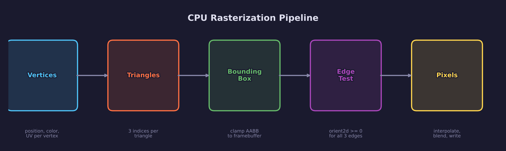
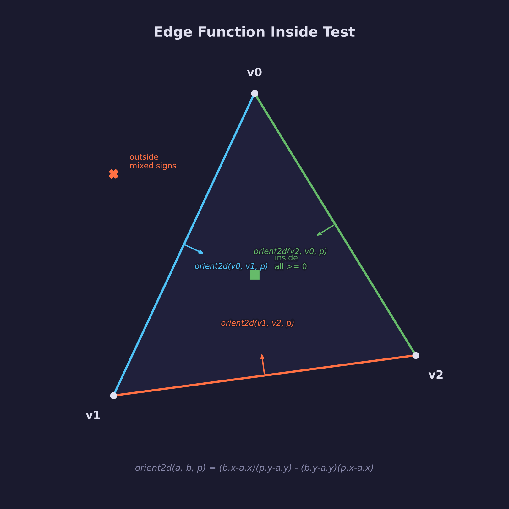
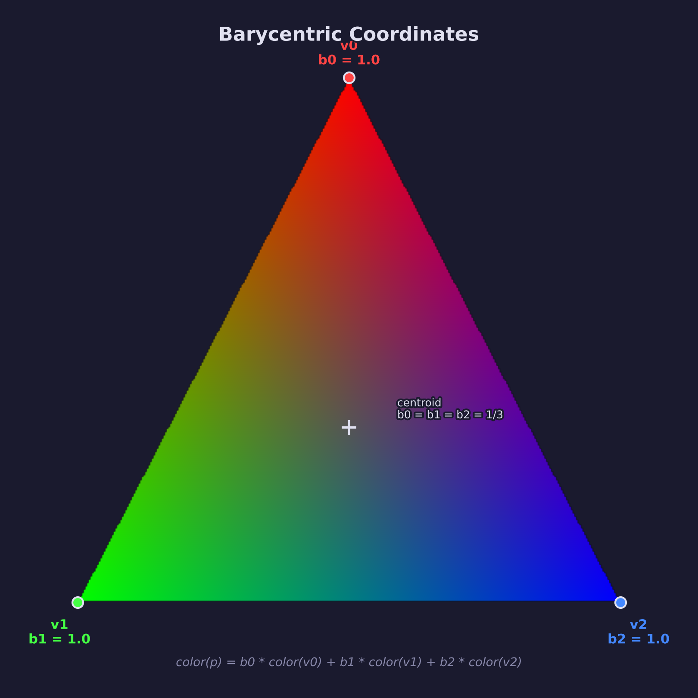
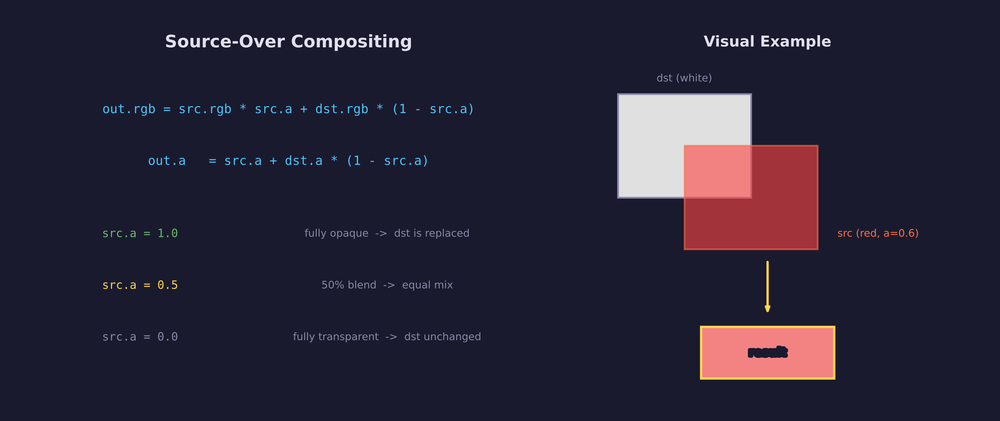
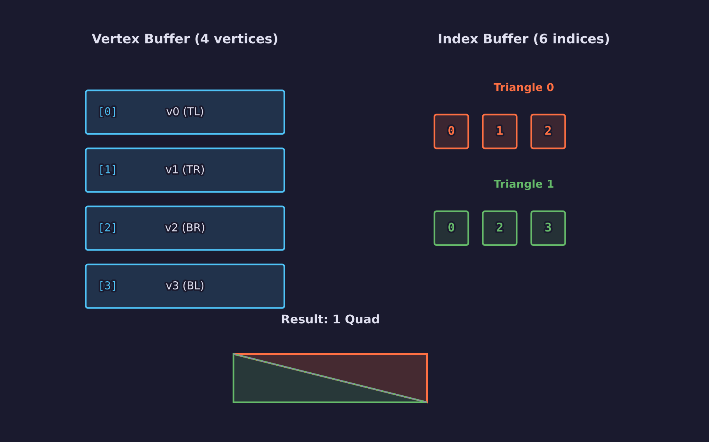

# Engine Lesson 10 — CPU Rasterization

How your GPU turns triangles into pixels — implemented in software so you
can see every step.

## What you'll learn

- What a **framebuffer** is (a 2D pixel array with width, height, stride,
  and pixel format)
- The **rasterization pipeline**: vertices → triangles → fragments → pixels
- **Triangle rasterization** using the edge function method
  (`orient2d` / signed area)
- **Bounding box optimization**: only test pixels inside the triangle's AABB
- **Barycentric coordinates**: what they are, how they arise naturally from
  the three edge functions, and why they are the key to attribute
  interpolation
- **Attribute interpolation**: using barycentric weights to blend vertex
  colors and UV coordinates smoothly across a triangle's surface
- **Texture sampling**: using interpolated UVs to look up texels from a
  grayscale texture (nearest-neighbor)
- **Alpha blending**: the source-over formula — why anti-aliased text and
  translucent UI panels require blending rather than simple overwrite
- **Indexed drawing**: how an index buffer reuses vertices (4 vertices + 6
  indices = 1 quad, the fundamental UI primitive)
- **Winding order and backface determination**: how the sign of the edge
  function tells you front vs back, and why CCW is the convention

## Why this matters

Every GPU lesson uses hardware rasterization, but never explains what that
means. This lesson builds a CPU software rasterizer that does the same thing
the GPU does — convert triangles into pixels. The GPU runs this algorithm on
thousands of cores in parallel; here we run it one pixel at a time so you
can inspect every step.

The library (`forge_raster.h`) uses the same vertex format as the UI system
(`ForgeUiVertex`), so future UI lessons can rasterize their vertex/index
output to BMP images instead of requiring a GPU window.

## Result

The program produces six BMP images, each demonstrating a progressively
more advanced concept:


**Example output:**

```text
INFO: Engine Lesson 10 -- CPU Rasterization
INFO: Generating BMP images...
INFO:
INFO: Wrote solid_triangle.bmp
INFO: Wrote color_triangle.bmp
INFO: Wrote indexed_quad.bmp
INFO: Wrote textured_quad.bmp
INFO: Wrote alpha_blend.bmp
INFO: Wrote scene.bmp
INFO:
INFO: Done. Open the BMP files to see the results.
```

## Key concepts

- **Edge function** — A 2D cross product that tells you which side of a
  line a point is on. Three edge functions define a triangle.
- **Barycentric coordinates** — Three weights (b0, b1, b2) that sum to 1.0,
  describing how much each vertex influences a point inside the triangle.
- **Source-over compositing** — The standard formula for layering
  semi-transparent colors: `out = src * src_a + dst * (1 - src_a)`.
- **Indexed drawing** — Reusing vertices by referencing them with an index
  buffer: 4 vertices + 6 indices = 1 quad (2 triangles).

## The Details

### The rasterization pipeline



The CPU rasterizer follows the same pipeline as the GPU. For each triangle:

1. **Read vertices** — Position, color, and UV coordinates per vertex
2. **Assemble triangle** — Every three indices form one triangle
3. **Compute bounding box** — Find the axis-aligned bounding box (AABB) and
   clamp it to the framebuffer
4. **Edge test** — For each pixel center in the AABB, evaluate three edge
   functions. If all have the same sign, the pixel is inside.
5. **Write pixel** — Interpolate attributes, sample texture (if any), and
   alpha-blend onto the framebuffer

### What is a framebuffer?

A framebuffer is a 2D array of pixels that represents the image being
rendered. Each pixel stores four bytes — red, green, blue, and alpha — in
RGBA order. The buffer has a **width** (pixels per row), **height** (number
of rows), and **stride** (bytes per row, which may include padding for
alignment).

```c
typedef struct {
    uint8_t *pixels;   /* RGBA8888, row-major, top-left origin */
    int      width;
    int      height;
    int      stride;   /* bytes per row (width * 4) */
} ForgeRasterBuffer;
```

The top-left pixel is at `pixels[0]`, and pixel (x, y) is at offset
`y * stride + x * 4`.

### Edge functions and orient2d

The edge function is the foundation of the rasterizer. It answers a simple
question: *which side of a line is this point on?*



Given an edge from point **a** to point **b**, the orient2d function
computes:

```text
orient2d(a, b, p) = (b.x - a.x) * (p.y - a.y) - (b.y - a.y) * (p.x - a.x)
```

This is the **2D cross product** of vectors (a→b) and (a→p), which equals
twice the signed area of the triangle (a, b, p):

- **Positive**: p is to the left of edge a→b (the CCW side)
- **Zero**: p is exactly on the edge
- **Negative**: p is to the right of edge a→b (the CW side)

A triangle has three edges, so three calls to orient2d produce three values
(w0, w1, w2). If all three have the same sign, the point is inside the
triangle. For a triangle wound counter-clockwise (CCW), all three are ≥ 0
for interior points.

### Bounding box optimization

Testing every pixel in the framebuffer against every triangle would be
extremely slow. The bounding box optimization limits the search to only
those pixels that could possibly be inside the triangle.


The AABB (axis-aligned bounding box) is the smallest rectangle that
contains all three vertices. We clamp it to the framebuffer bounds so we
never read or write out-of-bounds memory. Only pixels whose centers fall
inside both the AABB and the triangle become fragments.

### Barycentric coordinates

The three edge function values (w0, w1, w2) are not just an inside/outside
test — they are the key to **attribute interpolation**.



Dividing each weight by the total area gives **barycentric coordinates**:

```text
b0 = w0 / area
b1 = w1 / area
b2 = w2 / area
```

These three values always sum to 1.0. Each one tells you how much influence
the corresponding vertex has at this pixel:

- At vertex v0: b0 = 1.0, b1 = 0.0, b2 = 0.0
- At vertex v1: b0 = 0.0, b1 = 1.0, b2 = 0.0
- At the centroid: b0 = b1 = b2 = 1/3

### Attribute interpolation

With barycentric coordinates, you can smoothly blend any vertex attribute
across the triangle surface:

```text
attr(p) = b0 * attr(v0) + b1 * attr(v1) + b2 * attr(v2)
```

This works for colors, UV coordinates, normals, or any per-vertex data.
The demo program uses this to create the classic RGB triangle — red, green,
and blue vertices blend smoothly into every color in between.

### Texture sampling

When a texture is provided, the rasterizer interpolates UV coordinates
using barycentric weights, then looks up the corresponding texel.

The texture is a single-channel (grayscale) image. The texel value
multiplies all four channels of the interpolated vertex color:

```text
final = vertex_color * texel
```

This is the same rendering model Dear ImGui uses: the font atlas provides
alpha coverage (grayscale glyph shapes), and the vertex color provides the
RGB tint. Solid-color shapes use a white texel region (value = 255) so the
vertex color passes through unchanged.

### Alpha blending (source-over compositing)



When a fragment has an alpha value less than 1.0, it should not completely
replace the destination pixel. Instead, the **source-over** formula blends
the source and destination:

```text
out.rgb = src.rgb * src.a + dst.rgb * (1 - src.a)
out.a   = src.a + dst.a * (1 - src.a)
```

- When `src.a = 1.0` (fully opaque): the source completely replaces the
  destination
- When `src.a = 0.5` (half transparent): equal parts source and destination
- When `src.a = 0.0` (fully transparent): the destination is unchanged

This is essential for anti-aliased text (glyph edges have fractional alpha)
and translucent UI panels.

### Indexed drawing



A quad (rectangle) is the fundamental UI primitive, but GPUs can only draw
triangles. The solution is **indexed drawing**: define 4 vertices (the quad
corners) and 6 indices that reference them as two triangles.

```c
/* 4 vertices define the quad corners */
ForgeRasterVertex verts[4] = {
    { x0, y0, ... },  /* [0] top-left */
    { x1, y0, ... },  /* [1] top-right */
    { x1, y1, ... },  /* [2] bottom-right */
    { x0, y1, ... },  /* [3] bottom-left */
};

/* 6 indices form 2 CCW triangles */
uint32_t indices[6] = {
    0, 1, 2,   /* triangle 0: TL -> TR -> BR */
    0, 2, 3,   /* triangle 1: TL -> BR -> BL */
};
```

Without indexing, a quad would need 6 vertices (3 per triangle), wasting
memory by duplicating the two shared corner vertices. With indexing, the
two shared vertices (0 and 2) are stored once and referenced twice.

### Winding order

The sign of the triangle's area (from orient2d) tells you whether the
vertices are wound counter-clockwise (CCW) or clockwise (CW):

- **Positive area** → CCW winding (front face by convention)
- **Negative area** → CW winding (back face)
- **Zero area** → degenerate (collinear vertices — skipped)

The rasterizer accepts both winding orders: it checks if all three edge
function values have the same sign, regardless of whether that sign is
positive or negative. In a production renderer, you would typically cull
back-facing triangles, but for a 2D rasterizer all triangles are
front-facing.

## Common errors

### BMP files appear upside-down

**What you see:** The image content is vertically flipped compared to what
you expected.

**Why it happens:** BMP files store rows bottom-up (row 0 in the file is
the bottom of the image), but most framebuffers use top-down order (row 0
is the top). If you write the rows without flipping, the image appears
inverted.

**How to fix it:** The BMP writer must reverse the row order during output:

```c
for (int y = 0; y < height; y++) {
    int bmp_row = height - 1 - y;  /* flip vertical */
    /* copy row y to bmp_row position */
}
```

### Pixels appear shifted or missing at triangle edges

**What you see:** Some edge pixels are missed, or there are gaps between
adjacent triangles.

**Why it happens:** Sampling at pixel corners instead of pixel centers
causes off-by-half-pixel errors. The rasterizer should evaluate the edge
function at the pixel center (x + 0.5, y + 0.5), not at the integer
coordinates (x, y).

**How to fix it:** Always add 0.5 to the integer pixel coordinates before
evaluating the edge functions:

```c
float px = (float)x + 0.5f;
float py = (float)y + 0.5f;
```

### Shared edge between two triangles renders double-blended

**What you see:** The diagonal seam of a quad is visibly darker or
lighter than the rest when using semi-transparent colors.

**Why it happens:** Without a top-left fill rule (which production
rasterizers use), pixels exactly on the shared edge satisfy the inside
test for both triangles and get blended twice.

**How to fix it:** For opaque geometry this is invisible. For transparent
geometry, use `>` instead of `>=` for one of the edge tests, or implement
the standard top-left fill rule. This library deliberately omits fill rules
for clarity — real GPUs handle this in hardware.

## Where it's used

In forge-gpu lessons:

- [GPU Lesson 02 — First Triangle](../../gpu/02-first-triangle/) performs
  this same algorithm in hardware — the vertex shader transforms vertices,
  the rasterizer evaluates edge functions, and the fragment shader
  interpolates colors
- Future **UI lessons** will use `forge_raster_triangles_indexed()` to
  render vertex/index output to BMP images, replacing text-only output
- **Barycentric coordinates** may become a dedicated math lesson — the
  concept extends to 3D (tetrahedral interpolation) and is fundamental to
  GPU texture mapping

## Building

```bash
cmake -B build
cmake --build build --config Debug

# Windows
build\lessons\engine\10-cpu-rasterization\Debug\10-cpu-rasterization.exe

# Linux / macOS
./build/lessons/engine/10-cpu-rasterization/10-cpu-rasterization
```

The program writes BMP files to the current working directory. Open them
with any image viewer to see the results.

## Exercises

1. **Add a depth buffer.** Create a parallel float array the same size as
   the framebuffer. Assign each vertex a z-value, interpolate it with
   barycentric coordinates, and only write the pixel if the new z is closer
   than the stored value. This is exactly how
   [GPU Lesson 06 — Depth & 3D](../../gpu/06-depth-and-3d/) works.

2. **Implement bilinear texture filtering.** The current sampler uses
   nearest-neighbor lookup (snap to the closest texel). Instead, sample the
   four nearest texels and blend them based on the fractional UV position.
   Compare the visual quality of a checkerboard texture at both settings.

3. **Add a top-left fill rule.** Modify the edge function test so that
   pixels exactly on a shared edge are claimed by only one triangle. The
   rule: an edge is a "top" edge if it is exactly horizontal and the
   triangle extends below it, or a "left" edge if it goes upward. Only
   include pixels on top or left edges. Verify that the diagonal seam of a
   semi-transparent quad disappears.

4. **Render a circle.** Define a quad that bounds the circle, then in the
   fragment stage (after the edge test passes) compute the distance from
   the pixel center to the circle center. Discard pixels beyond the radius.
   Apply `smoothstep` at the edge for anti-aliasing — this is a miniature
   version of the signed distance field technique used in
   [GPU Lesson 12 — Shader Grid](../../gpu/12-shader-grid/).

## Further reading

- [GPU Lesson 02 — First Triangle](../../gpu/02-first-triangle/) — the
  hardware version of this algorithm
- [Engine Lesson 04 — Pointers & Memory](../04-pointers-and-memory/) —
  how the pixel buffer and vertex arrays are laid out in memory
- [Engine Lesson 05 — Header-Only Libraries](../05-header-only-libraries/) —
  how `forge_raster.h` works as a header-only library
- Juan Pineda, "A Parallel Algorithm for Polygon Rasterization" (1988) —
  the original paper describing the edge function method
- Scratchapixel, "Rasterization: a Practical Implementation" — a detailed
  tutorial covering the same algorithm with additional optimizations
