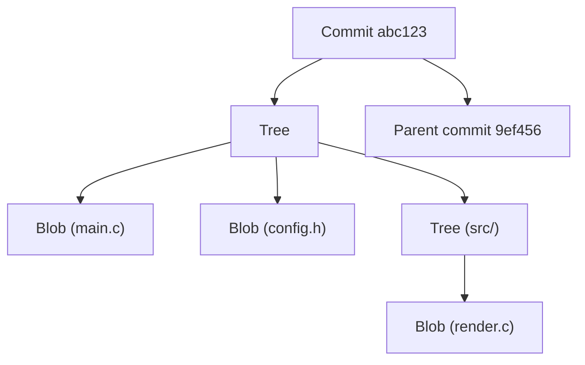
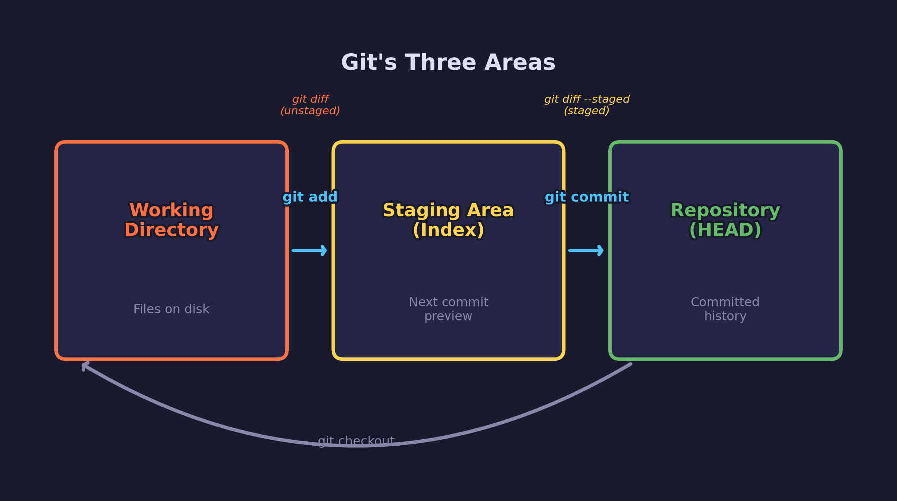
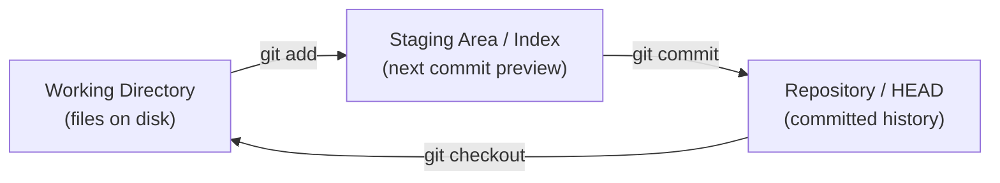
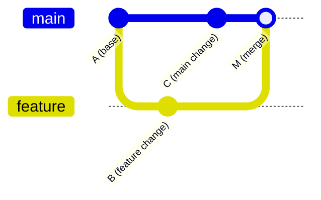
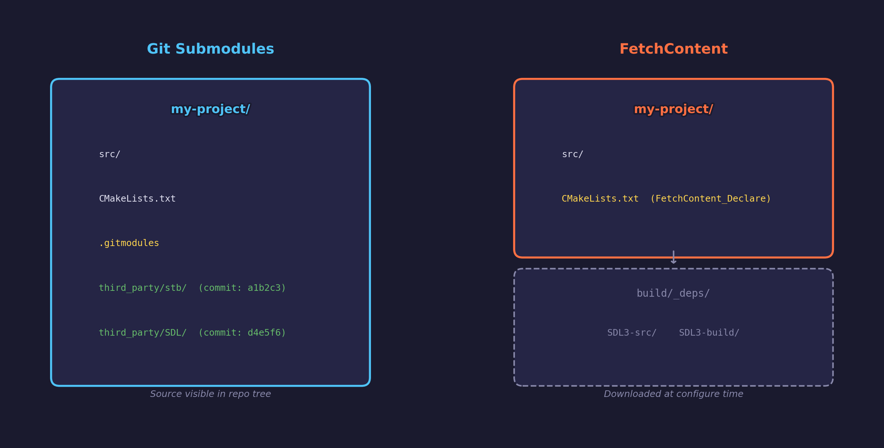
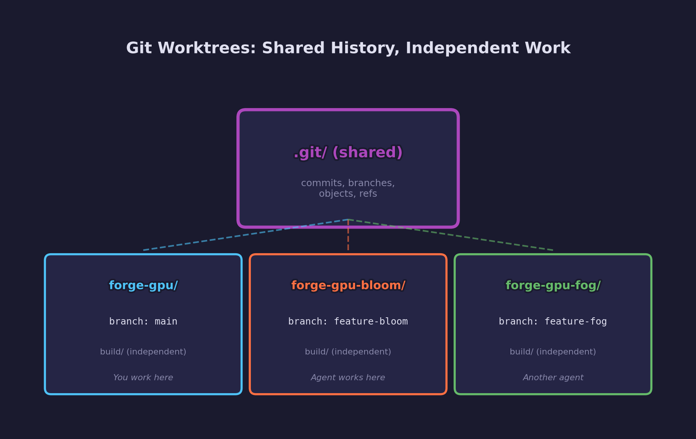
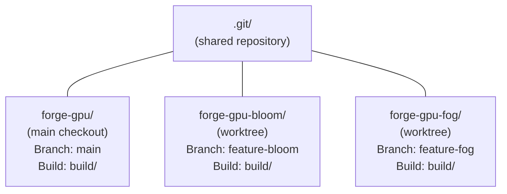

# Engine Lesson 11 — Git & Version Control

Track every change, manage dependencies with submodules, and run parallel
workflows with worktrees — the version control foundation for graphics projects.

## What you'll learn

- How git tracks content using hashes, and what a commit really stores
- The staging area model: working directory, index, and HEAD
- Branching, merging, and resolving conflicts
- Reading `git log`, `git diff`, and `git status`
- Writing `.gitignore` patterns for C/CMake projects
- Git submodules for pinning third-party dependencies at exact commits
- How submodules compare to FetchContent for dependency management
- Git worktrees for running parallel workflows (e.g. AI agents on feature
  branches) without disrupting your main checkout

## Why this matters

Every line of code in forge-gpu — and every project you will ever work on
professionally — lives inside a git repository. Version control is not optional
infrastructure; it is the foundation that makes collaboration, experimentation,
and recovery possible.

For graphics projects specifically, version control has extra importance:

- **Shader changes can break rendering silently.** A diff shows exactly what
  changed between a working frame and a broken one.
- **Build directories are large.** Switching branches with `git checkout`
  forces a CMake reconfigure and rebuild. Worktrees avoid this entirely.
- **Third-party dependencies need pinning.** A GPU API like SDL3 evolves
  rapidly. Submodules lock your project to a tested version.
- **AI-assisted workflows are branch-heavy.** When an AI agent works on a
  feature branch while you work on `main`, worktrees give each workflow its
  own build directory.

## Result

The example program demonstrates git's core concepts through C code:
content hashing, the three-area model, three-way merge logic, and `.gitignore`
pattern matching.

**Example output:**

```text
INFO: === Engine Lesson 11: Git & Version Control ===
INFO:
INFO: --- 1. Content hashing (how git identifies files) ---
INFO:
INFO:   Git identifies every file by the hash of its contents.
INFO:   If the contents change, the hash changes.
INFO:   If two files have identical contents, they share a hash.
INFO:
INFO:   main.c        "int main() { return 0; }"  -> 8B5B11C5
INFO:   main.c        "int main() { return 1; }"  -> 5EA2C810
INFO:   copy.c        "int main() { return 0; }"  -> 8B5B11C5
INFO:
INFO:   main.c v1 vs v2: DIFFERENT (contents differ)
INFO:   main.c v1 vs copy.c: SAME (identical contents)
INFO:
INFO: --- 2. Git's three areas (working dir / staging / HEAD) ---
INFO:
INFO:   Working directory  ->  Staging area  ->  Repository (HEAD)
INFO:   (files on disk)       (git add)          (git commit)
INFO:
INFO:   After initial commit (all areas match):
INFO:   [HEAD]
INFO:     config.h      checksum: 4B7B2B9E  contents: "#define VERSION 1"
INFO:
INFO:   After editing config.h in working directory:
INFO:   [working dir]
INFO:     config.h      checksum: 4A7B2A0B  contents: "#define VERSION 2"
INFO:   [staging]
INFO:     config.h      checksum: 4B7B2B9E  contents: "#define VERSION 1"
INFO:
INFO:   'git status' compares the areas:
INFO:   Changes: working dir -> staging
INFO:     ~ config.h (modified)
INFO:   Changes: staging -> HEAD
INFO:     (no changes)
INFO:
INFO:   After 'git add config.h' (staged for commit):
INFO:   Changes: working dir -> staging
INFO:     (no changes)
INFO:   Changes: staging -> HEAD
INFO:     ~ config.h (modified)
INFO:
INFO:   After 'git commit' (all areas match again):
INFO:   Changes: working dir -> staging
INFO:     (no changes)
INFO:   Changes: staging -> HEAD
INFO:     (no changes)
INFO:
INFO: --- 3. Three-way merge (how git resolves branches) ---
INFO:
INFO:   Git merges by comparing two branches against their
INFO:   common ancestor (the base).  For each file:
INFO:     - Neither changed  -> keep base
INFO:     - One changed      -> take that version
INFO:     - Both changed     -> CONFLICT (manual resolution)
INFO:
INFO:   Merge scenario:
INFO:     File: README.md
INFO:       base:   "# My Project"  [C2343B0D]
INFO:       ours:   "# My Project v2"  [4495AC53]
INFO:       theirs: "# My Project"  [C2343B0D]
INFO:       -> Only we changed: take ours
INFO:
INFO:     File: config.h
INFO:       base:   "#define MAX 100"  [072D0034]
INFO:       ours:   "#define MAX 200"  [44300275]
INFO:       theirs: "#define MAX 500"  [CBE18028]
INFO:       -> CONFLICT: both changed differently!
INFO:          You must resolve this manually.
INFO:
INFO: --- 4. .gitignore (what NOT to track) ---
INFO:
INFO:   C/CMake projects generate many files that should not
INFO:   be committed.  A .gitignore file tells git to skip them.
INFO:
INFO:   main.c                       [TRACK]
INFO:   CMakeLists.txt               [TRACK]
INFO:   main.o                       [IGNORE]
INFO:   main.obj                     [IGNORE]
INFO:   app.exe                      [IGNORE]
INFO:   build/main.o                 [IGNORE]
INFO:   .vs/settings.json            [IGNORE]
INFO:   compile_commands.json        [IGNORE]
INFO:   README.md                    [TRACK]
INFO:   app.pdb                      [IGNORE]
INFO:   .DS_Store                    [IGNORE]
INFO:
INFO:   A typical .gitignore for C/CMake projects:
INFO:     build/
INFO:     *.o
INFO:     *.obj
INFO:     *.exe
INFO:     *.pdb
INFO:     *.dll
INFO:     *.so
INFO:     *.dylib
INFO:     .vs/
INFO:     .vscode/settings.json
INFO:     compile_commands.json
INFO:     CMakeCache.txt
INFO:     CMakeFiles/
INFO:     .DS_Store
INFO:
INFO: === Summary ===
INFO:
INFO:   Git tracks content by hashing file contents.
INFO:   Files move through three areas:
INFO:     working dir -> staging (git add) -> HEAD (git commit)
INFO:   Merging uses a three-way comparison against the common
INFO:   ancestor to detect conflicts.
INFO:   .gitignore prevents build artifacts from being tracked.
INFO:
INFO:   Read the README for full coverage of branching, submodules,
INFO:   worktrees, and hands-on exercises.
```

## Key concepts

- **Content-addressable storage** — Git identifies every object (file, commit,
  tree) by the hash of its contents, not by filename or timestamp
- **The three areas** — Working directory (files on disk), staging area / index
  (`git add`), and repository / HEAD (`git commit`) — understanding this model
  is essential for using git effectively
- **Branching** — Creating a divergent line of development that shares history
  with the original; branches are lightweight pointers to commits
- **Three-way merge** — Git compares two branch tips against their common
  ancestor to decide which changes to keep and where conflicts exist
- **`.gitignore`** — A file listing patterns of files that git should not track
  (build artifacts, IDE settings, platform metadata)
- **Submodules** — Embedding another git repository inside yours at a pinned
  commit, giving you reproducible dependency versions stored in your own history
- **Worktrees** — Multiple working directories sharing the same `.git`
  repository, allowing parallel work on different branches without switching

## The details

### How git tracks content

Git is fundamentally a content-addressable filesystem. Every piece of data — a
file's contents (called a **blob**), a directory listing (called a **tree**),
or a snapshot of the project (called a **commit**) — is identified by the
SHA-1 hash of its contents.



This design has important consequences:

- **Identical content is stored once.** If ten files have the same contents,
  git stores one blob and points to it ten times.
- **Any change produces a new hash.** Modifying a single byte in a file
  creates a new blob with a different hash, which creates a new tree, which
  creates a new commit. The chain of hashes makes the history tamper-evident.
- **Commits point to their parent(s).** This forms a directed acyclic graph
  (DAG) — the commit history.

The example program demonstrates this with FNV-1a hashes (git uses SHA-1, but
the principle is the same): changing `return 0` to `return 1` produces a
completely different hash, while two files with identical contents share the
same hash.

### The staging area (index)



Git's staging area is the concept that trips up most beginners. Files pass
through three distinct areas on their way into the repository:



**Working directory** — The actual files on your filesystem. When you edit
`main.c` in your text editor, you are changing the working directory.

**Staging area (index)** — A snapshot of what your *next commit* will contain.
Running `git add main.c` copies the current contents of `main.c` from the
working directory into the staging area. You can stage individual files,
specific hunks, or everything at once.

**Repository (HEAD)** — The last committed snapshot. Running `git commit` takes
everything in the staging area and creates a new commit object pointing to it.

This three-area model exists so you can **select exactly which changes go into
a commit**. If you changed five files but only two changes are related to the
current task, you stage those two and commit them. The other three remain as
unstaged modifications in your working directory.

The `git status` command compares these areas:

```bash
# Show what has changed
git status

# Output:
# Changes not staged for commit:        <- working dir vs staging
#   modified:   main.c
#
# Changes to be committed:              <- staging vs HEAD
#   modified:   config.h
```

### Essential commands

#### Creating and cloning repositories

```bash
# Create a new repository in the current directory
git init

# Clone an existing repository (downloads full history)
git clone https://github.com/RosyGameStudio/forge-gpu.git

# Clone with submodules initialized (avoids the empty-directory surprise)
git clone --recurse-submodules https://github.com/RosyGameStudio/forge-gpu.git
```

#### Staging and committing

```bash
# Stage specific files
git add main.c config.h

# Stage all changes in the current directory
git add .

# See what is staged vs unstaged
git status

# Commit the staged changes with a message
git commit -m "Add configuration header"

# Stage and commit all tracked, modified files in one step
git commit -a -m "Update version number"
```

#### Viewing history and changes

```bash
# Show commit history (most recent first)
git log

# Compact one-line-per-commit view
git log --oneline

# Show what changed in the working directory (unstaged)
git diff

# Show what is staged for the next commit
git diff --staged

# Show changes in a specific commit
git show abc1234
```

#### Branching and merging

A **branch** is a lightweight movable pointer to a commit. Creating a branch
is nearly instantaneous — git just writes a 41-byte file containing a commit
hash.

```bash
# Create a new branch
git branch feature-bloom

# Switch to it
git switch feature-bloom

# Create and switch in one step
git switch -c feature-bloom

# Older syntax (still works)
git checkout -b feature-bloom
```

When work on a branch is complete, **merge** it back:

```bash
# Switch to the target branch
git switch main

# Merge the feature branch into main
git merge feature-bloom

# Delete the branch after merging (optional cleanup)
git branch -d feature-bloom
```

#### How merging works

Git uses a **three-way merge** algorithm. It finds the common ancestor of the
two branches (the **merge base**), then compares each branch's changes against
that base:



For each file:

| main changed? | feature changed? | Result |
|---|---|---|
| No | No | Keep base version |
| Yes | No | Take main's version |
| No | Yes | Take feature's version |
| Yes | Yes (same) | Take either (identical) |
| Yes | Yes (different) | **Conflict** — manual resolution required |

#### Resolving merge conflicts

When git cannot automatically merge a file, it marks the conflicting sections:

```text
<<<<<<< HEAD
#define MAX_PARTICLES 1000
=======
#define MAX_PARTICLES 2000
>>>>>>> feature-particles
```

To resolve:

1. Open the file in your editor
2. Choose which version to keep (or combine them)
3. Remove the conflict markers (`<<<<<<<`, `=======`, `>>>>>>>`)
4. Stage the resolved file: `git add config.h`
5. Complete the merge: `git commit`

### `.gitignore` for C/CMake projects

Build artifacts, IDE settings, and platform metadata should never be committed.
They are machine-specific, large, and change constantly. A `.gitignore` file in
the repository root tells git which files to skip.

Here is a `.gitignore` suitable for C/CMake projects like forge-gpu:

```text
# Build directories
build/
out/
cmake-build-*/

# Compiled objects
*.o
*.obj

# Executables and libraries
*.exe
*.dll
*.so
*.dylib
*.a
*.lib

# Debug files
*.pdb
*.dSYM/

# IDE and editor settings
.vs/
.vscode/settings.json
.idea/
*.swp
*~

# CMake generated files
CMakeCache.txt
CMakeFiles/
cmake_install.cmake
compile_commands.json

# Platform metadata
.DS_Store
Thumbs.db
```

**Pattern syntax:**

| Pattern | Matches |
|---|---|
| `build/` | The `build` directory and everything inside it |
| `*.o` | Any file ending in `.o`, in any directory |
| `*.exe` | Any file ending in `.exe` |
| `.vs/` | Visual Studio's hidden settings directory |
| `!important.o` | Exception — track this file even though `*.o` says ignore |
| `**/logs` | A directory named `logs` anywhere in the tree |

### Git submodules for third-party dependencies

A **submodule** is another git repository embedded inside yours at a specific
commit. It gives you:

- **Exact version pinning** — Your project records which commit of the
  dependency to use, not just a branch name
- **Source in your tree** — The dependency's code lives in a subdirectory,
  visible and browsable
- **Independent history** — The dependency maintains its own commit log; your
  project just records which commit it points to

#### Adding a submodule

```bash
# Add stb (a popular single-header library) as a submodule
git submodule add https://github.com/nothings/stb.git third_party/stb

# This creates two things:
#   1. third_party/stb/     — the cloned repository
#   2. .gitmodules           — a config file mapping name -> URL + path
```

The `.gitmodules` file looks like this:

```text
[submodule "third_party/stb"]
    path = third_party/stb
    url = https://github.com/nothings/stb.git
```

Git also records the exact commit hash that `third_party/stb` points to in the
parent repository's tree. This is the **submodule commit pointer** — it is what
pins the dependency to a specific version.

#### Cloning a project with submodules

When someone clones your repository, submodule directories exist but are
**empty** by default. This is the single most common submodule surprise:

```bash
# Clone the repo — submodule directories are empty
git clone https://github.com/example/my-project.git
ls third_party/stb/    # empty!

# Initialize and fetch submodule contents
git submodule update --init --recursive
ls third_party/stb/    # now populated
```

The `--recursive` flag handles nested submodules (submodules inside
submodules). Always use it.

Alternatively, clone with submodules in one step:

```bash
git clone --recurse-submodules https://github.com/example/my-project.git
```

#### Updating a submodule to a newer version

```bash
# Enter the submodule directory
cd third_party/stb

# Fetch the latest changes and check out a specific tag or commit
git fetch
git checkout v2.30

# Return to the parent project
cd ../..

# The parent now sees a changed submodule pointer
git status
#   modified:   third_party/stb (new commits)

# Stage and commit the updated pointer
git add third_party/stb
git commit -m "Update stb to v2.30"
```

#### Linking a submodule via CMake

Once the submodule is in your tree, integrate it with your build system:

```cmake
# If the submodule has a CMakeLists.txt:
add_subdirectory(third_party/stb)
target_link_libraries(my_app PRIVATE stb)

# If it is header-only (like stb):
target_include_directories(my_app PRIVATE third_party/stb)
```

For a header-only library like stb, you only need the include path. For
libraries with source files, `add_subdirectory` builds them as part of your
project — exactly like FetchContent would, but without the download step.

#### Submodules vs FetchContent



Both submodules and FetchContent solve the same problem — managing
third-party dependencies — but they make different trade-offs:

| | Submodules | FetchContent |
|---|---|---|
| **Source location** | In your tree (`third_party/`) | In the build directory (`build/_deps/`) |
| **Version pinning** | Commit pointer in parent repo | `GIT_TAG` in `CMakeLists.txt` |
| **Requires network** | Only on `submodule update` | On first `cmake -B build` |
| **Visible in repo** | Yes — browsable on GitHub | No — downloaded at build time |
| **Works offline** | Yes (after initial clone) | Requires cache or `FETCHCONTENT_SOURCE_DIR` |
| **IDE integration** | Full — source is on disk | Partial — source is buried in `build/_deps/` |
| **Setup for new clones** | `git submodule update --init --recursive` | Automatic (cmake downloads) |

**When to use submodules:**

- You want the dependency source visible and browsable in your repository
- You need to work offline after the initial clone
- You want to make local modifications to the dependency
- Your CI system caches git checkouts but not build directories

**When to use FetchContent:**

- You want zero-setup builds (clone + cmake, nothing else)
- You do not need to browse or modify the dependency source
- You prefer keeping your repository lightweight (no vendored code)

[Engine Lesson 03 — FetchContent & Dependencies](../03-fetchcontent-dependencies/)
covers FetchContent in detail. forge-gpu itself uses FetchContent for SDL3
(for zero-setup builds) and has an optional SDL source submodule for local
browsing.

### Git worktrees for parallel workflows



A **worktree** is an additional working directory that shares the same `.git`
repository as your main checkout. Each worktree can have a different branch
checked out, with its own set of files on disk and its own build directory.

#### The problem worktrees solve

Consider a common scenario: you are working on `main`, and an AI agent (Claude
Code, Copilot, etc.) needs to work on a `feature-bloom` branch. Without
worktrees, your options are:

1. **Stash and switch** — `git stash`, `git switch feature-bloom`, let the
   agent work, `git switch main`, `git stash pop`. This disrupts your flow
   and forces a CMake reconfigure.
2. **Clone the repo again** — A second clone duplicates the entire `.git`
   history and requires separate `git fetch` to stay in sync.
3. **Use a worktree** — Create a lightweight second working directory that
   shares the same history. No stashing, no duplication, no reconfigure.

For graphics projects, option 3 is especially valuable because CMake build
directories are large. A full rebuild of forge-gpu with SDL3 takes significant
time. Worktrees let each branch have an independent build directory that
persists between switches.

#### Creating a worktree

```bash
# Create a worktree for an existing branch
git worktree add ../forge-gpu-bloom feature-bloom

# Create a worktree with a new branch
git worktree add -b feature-fog ../forge-gpu-fog

# The worktree gets its own directory:
# ../forge-gpu-bloom/
#   ├── main.c
#   ├── CMakeLists.txt
#   ├── build/          <- independent build directory
#   └── ...             <- all project files, on the feature-bloom branch
```

The worktree is a real directory with real files. You can `cd` into it,
configure CMake, build, and run — completely independent of your main checkout.

#### How worktrees share history

All worktrees share the same `.git` directory (stored in the original clone).
This means:

- **Commits are shared.** A commit made in any worktree is visible to all
  others (after they fetch/pull).
- **Branches are shared.** Creating a branch in one worktree makes it
  available in all others.
- **Object storage is shared.** There is only one copy of the git database,
  regardless of how many worktrees exist.



The only restriction: **two worktrees cannot have the same branch checked
out.** This prevents conflicting changes to the same branch from different
directories.

#### Managing worktrees

```bash
# List all worktrees
git worktree list
# /home/user/forge-gpu             abc1234 [main]
# /home/user/forge-gpu-bloom       def5678 [feature-bloom]

# Remove a worktree (deletes the directory)
git worktree remove ../forge-gpu-bloom

# Prune stale worktree references (if you deleted the directory manually)
git worktree prune
```

#### Practical workflow: agent on a worktree

Here is a concrete workflow for using an AI agent with worktrees:

```bash
# 1. Create a worktree for the agent
git worktree add -b feature-lighting ../forge-gpu-agent

# 2. Point the agent at the worktree directory
#    (In Claude Code: open ../forge-gpu-agent as the project)

# 3. The agent works on feature-lighting while you work on main
#    Both directories have independent builds

# 4. When the agent is done, review its changes
cd ../forge-gpu-agent
git log --oneline main..feature-lighting
git diff main..feature-lighting

# 5. Merge the agent's work
cd ../forge-gpu
git merge feature-lighting

# 6. Clean up the worktree
git worktree remove ../forge-gpu-agent
git branch -d feature-lighting
```

#### Why worktrees matter for graphics projects

Graphics projects have specific characteristics that make worktrees especially
valuable:

- **Large build directories.** A full build of forge-gpu plus SDL3 produces
  hundreds of megabytes of object files, libraries, and executables. Switching
  branches with `git checkout` forces CMake to reconfigure and incrementally
  rebuild. With worktrees, each branch keeps its build directory intact.

- **Shader compilation state.** Compiled shader headers (`.spv`, `.dxil`,
  C headers) must match the shader source. Branch switching can leave stale
  compiled shaders that cause runtime errors. Separate worktrees avoid this.

- **Asset processing.** Some projects process assets (texture compression,
  model conversion) into a format the engine can load. Worktrees keep each
  branch's processed assets separate.

## Common errors

### Empty submodule directories after cloning

**What you see:**

```text
git clone https://github.com/example/my-project.git
ls third_party/stb/
# empty — no files
```

Or a build error like:

```text
fatal error: 'stb_image.h' file not found
```

**Why it happens:** `git clone` does not automatically initialize submodules.
The submodule directories exist (they are in the tree), but their contents are
not fetched.

**How to fix it:**

```bash
git submodule update --init --recursive
```

Or avoid the problem by cloning with `--recurse-submodules`:

```bash
git clone --recurse-submodules https://github.com/example/my-project.git
```

### Detached HEAD inside a submodule

**What you see:**

```text
$ cd third_party/stb
$ git status
HEAD detached at a1b2c3d
```

**Why it happens:** Submodules are always checked out at a specific commit, not
a branch. This is by design — the parent repository pins the submodule to an
exact commit for reproducibility. The "detached HEAD" state means you are
looking at that specific commit, not following a branch.

**What to do:** This is normal. If you need to make changes inside the
submodule, create a branch first:

```bash
cd third_party/stb
git switch -c my-fix
# make changes, commit
cd ../..
git add third_party/stb
git commit -m "Update stb with my fix"
```

### Trying to check out the same branch in two worktrees

**What you see:**

```text
$ git worktree add ../forge-gpu-second main
fatal: 'main' is already checked out at '/home/user/forge-gpu'
```

**Why it happens:** Git prevents two worktrees from checking out the same
branch to avoid conflicting modifications.

**How to fix it:** Create a new branch for the second worktree:

```bash
git worktree add -b feature-work ../forge-gpu-second
```

### Forgetting to remove stale worktrees

**What you see:**

```text
$ git worktree list
/home/user/forge-gpu           abc1234 [main]
/home/user/forge-gpu-old       (error: missing)
```

Or when trying to check out a branch:

```text
fatal: 'feature-x' is already checked out at '/home/user/forge-gpu-old'
```

But `/home/user/forge-gpu-old` no longer exists on disk.

**Why it happens:** You deleted the worktree directory manually (e.g. `rm -rf`)
instead of using `git worktree remove`. Git still has a reference to it.

**How to fix it:**

```bash
git worktree prune
```

This removes references to worktrees whose directories no longer exist.

### Merge conflict with no obvious changes

**What you see:**

```text
$ git merge feature-branch
Auto-merging config.h
CONFLICT (content): Merge conflict in config.h
```

But when you open the file, the "conflict" is between identical-looking lines
that differ only in whitespace or line endings.

**Why it happens:** Different platforms use different line endings (Windows:
CRLF, Unix: LF). If one branch was edited on Windows and another on Linux, git
sees different bytes even though the text looks the same.

**How to fix it:** Configure git to handle line endings consistently:

```bash
# On the repository (add a .gitattributes file):
* text=auto
*.c text eol=lf
*.h text eol=lf

# Per-user setting:
git config --global core.autocrlf input   # Linux/macOS
git config --global core.autocrlf true    # Windows
```

forge-gpu uses a `.gitattributes` file to enforce LF line endings for all text
files.

### Forgetting `--recursive` with submodules

**What you see:** Top-level submodules are populated, but submodules *inside*
those submodules are empty.

**Why it happens:** `git submodule update --init` only initializes one level
of submodules. If a submodule has its own submodules, they are not touched.

**How to fix it:** Always use `--recursive`:

```bash
git submodule update --init --recursive
```

## Where it's used

In forge-gpu:

- **The repository itself** — forge-gpu is a git repository. Every lesson,
  library, and configuration file is tracked with git.
- **`.gitignore`** — The root `.gitignore` excludes `build/`, compiled objects,
  IDE settings, and platform metadata.
- **`.gitattributes`** — Enforces LF line endings for all text files, preventing
  the cross-platform line ending conflicts described above.
- **SDL3 source submodule** — forge-gpu includes SDL3 as an optional submodule
  (`third_party/SDL`) for local source browsing, alongside FetchContent for
  automatic builds.
- [Engine Lesson 03 — FetchContent & Dependencies](../03-fetchcontent-dependencies/) —
  Covers the FetchContent approach to dependency management; this lesson covers
  the submodule approach and compares the two.

## Building

```bash
cmake -B build
cmake --build build --config Debug

# Windows
build\lessons\engine\11-git-version-control\Debug\11-git-version-control.exe

# Linux / macOS
./build/lessons/engine/11-git-version-control/11-git-version-control
```

## Exercises

### 1. Create a branch and make a change

Fork the forge-gpu repository on GitHub, then:

```bash
git clone --recurse-submodules https://github.com/YOUR_USERNAME/forge-gpu.git
cd forge-gpu
git switch -c my-first-branch
```

Open any lesson's `README.md`, add a note at the bottom, then:

```bash
git add lessons/engine/11-git-version-control/README.md
git commit -m "Add a note to Engine Lesson 11"
git log --oneline -3
```

Observe how `git log` shows your new commit on `my-first-branch` while `main`
still points to the previous commit.

### 2. Add a submodule and link it via CMake

Create a small test project and add
[stb](https://github.com/nothings/stb) as a submodule:

```bash
mkdir submodule-test && cd submodule-test
git init
git submodule add https://github.com/nothings/stb.git third_party/stb
```

Create a `main.c` that includes `stb_image.h` and a `CMakeLists.txt` that
adds the include path:

```cmake
cmake_minimum_required(VERSION 3.24)
project(submodule-test LANGUAGES C)
add_executable(submodule-test main.c)
target_include_directories(submodule-test PRIVATE third_party/stb)
target_compile_definitions(submodule-test PRIVATE STB_IMAGE_IMPLEMENTATION)
```

Build and verify it compiles. Then check what `git status` and
`cat .gitmodules` show.

### 3. Set up a worktree for parallel development

From your forge-gpu clone:

```bash
# Create a worktree with a new branch
git worktree add -b experiment ../forge-gpu-experiment

# Verify both worktrees exist
git worktree list

# Make a change in the worktree
cd ../forge-gpu-experiment
echo "// experiment" >> lessons/engine/11-git-version-control/main.c
git add -A && git commit -m "Experimental change"

# Switch back and merge
cd ../forge-gpu
git merge experiment

# Clean up
git worktree remove ../forge-gpu-experiment
git branch -d experiment
```

### 4. Deliberately create and resolve a merge conflict

```bash
git switch -c branch-a
# Edit main.c: change a #define value
git commit -a -m "Change in branch A"

git switch main
git switch -c branch-b
# Edit the same line in main.c with a different value
git commit -a -m "Change in branch B"

git switch main
git merge branch-a       # succeeds (fast-forward — no divergence, pointer moves)
git merge branch-b       # CONFLICT
```

Open the conflicted file, resolve it, and complete the merge. This exercise
builds the muscle memory for the most stressful git operation.

### 5. Explore forge-gpu's git structure

```bash
# View the commit graph
git log --oneline --graph --all | head -30

# Check the .gitignore patterns
cat .gitignore

# Look at the submodule configuration
cat .gitmodules

# See what git tracks and what it ignores
git status --ignored
```

## Further reading

- [Engine Lesson 03 — FetchContent & Dependencies](../03-fetchcontent-dependencies/) —
  The alternative approach to dependency management that forge-gpu uses for SDL3
- [Pro Git (Scott Chacon & Ben Straub)](https://git-scm.com/book/en/v2) — The
  definitive free book on git, covering every topic in this lesson in depth
- [git-scm.com reference](https://git-scm.com/docs) — Official documentation
  for every git command
- [Git submodules documentation](https://git-scm.com/book/en/v2/Git-Tools-Submodules) —
  The Pro Git chapter dedicated to submodules
- [Git worktree documentation](https://git-scm.com/docs/git-worktree) —
  Official reference for the `git worktree` command
