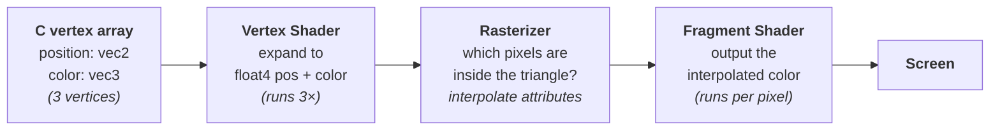

# Lesson 02 — First Triangle

## What you'll learn

- What a **vertex** is and how to define vertex data (position + color) in C
- What **shaders** are — small programs that run on the GPU instead of the CPU
- How to read **HLSL** shader code: inputs, outputs, semantics, and data types
- How data flows through the GPU: **vertex shader → rasterizer → fragment shader**
- What a **graphics pipeline** is and why it bundles so many settings into one object
- The **vertex input layout** — the bridge between your C struct and your shader inputs
- The GPU upload pattern: **transfer buffer → GPU buffer** (staging)
- How to **bind** a pipeline and vertex buffer and issue a **draw call**

## Prerequisites

Complete [Lesson 01 — Hello Window](../01-hello-window/) first. That lesson
covers the GPU device, window, swapchain, command buffers, and render passes
that this lesson builds on.

If you are new to C, work through
[Engine 01 — Intro to C](../../engine/01-intro-to-c/) — you will need structs,
arrays, and `offsetof` for this lesson.

## Result

A colored triangle on a dark background. Each vertex has a different color
(red, green, blue) and the GPU smoothly interpolates between them — this is
called *smooth shading* or *Gouraud shading*.


## Background

### What is a vertex?

A **vertex** (plural: *vertices*) is a point that defines the corner of a
shape. A triangle has three vertices. A cube has eight. Every piece of 3D
geometry you have ever seen in a game is built from vertices connected into
triangles.

Each vertex can carry data beyond just its position — color, texture
coordinates, a surface normal (direction the surface faces), or anything else
your shader needs. In this lesson, each vertex carries a **2D position** and
an **RGB color**:

```c
typedef struct Vertex {
    vec2 position;   /* where this corner is on screen      */
    vec3 color;      /* what color this corner contributes   */
} Vertex;
```

### What is a shader?

A **shader** is a small program that runs on the GPU, not the CPU. You write
it in a special language (we use HLSL), compile it ahead of time, and hand the
compiled bytecode to the GPU. The GPU then runs your shader program thousands
of times in parallel — once per vertex, or once per pixel.

There are two shader stages in this lesson:

| Stage        | Runs once per... | Job                                          |
|--------------|------------------|----------------------------------------------|
| **Vertex**   | vertex           | Position each vertex on screen               |
| **Fragment** | pixel            | Decide the final color of each covered pixel |

The vertex shader runs first. The GPU then figures out which pixels the
triangle covers (this step is called **rasterization**). Finally, the fragment
shader runs on every covered pixel.

### What is HLSL?

**HLSL** (High-Level Shading Language) is Microsoft's shader language,
originally designed for Direct3D. We use it because SDL's shader toolchain can
compile HLSL to multiple formats:

- **SPIRV** — bytecode for Vulkan (Linux, Windows, Android)
- **DXIL** — bytecode for Direct3D 12 (Windows)

You write your shader once in HLSL, and the compiler produces the right
bytecode for each platform. The compiled bytecodes are stored as C arrays in
header files (`shaders/compiled/*_spirv.h` and `shaders/compiled/*_dxil.h`), which the C code
`#include`s directly.

HLSL looks similar to C but has built-in types for GPU work (`float2`,
`float3`, `float4`) and a concept called **semantics** that we will explain
in detail below.

### What is a graphics pipeline?

A **graphics pipeline** is a single object that bundles together *everything*
the GPU needs to know before it can draw:

- Which **vertex shader** and **fragment shader** to run
- The **vertex input layout** — how to read fields from your vertex buffer
- The **primitive type** — how to assemble vertices (triangle list, line list, etc.)
- **Rasterizer settings** — fill mode, back-face culling, winding order
- The **color target format** — the pixel format of the render target

Pipelines are **immutable**: once created, you cannot change any setting. To
draw with different settings, you create a different pipeline. This immutability
is deliberate — it lets the GPU driver optimize aggressively because it knows
the full configuration up front.

## The shaders — line by line

This is the core of the lesson. If you understand these two small files, you
understand the foundation that every GPU program builds on.

### Vertex shader (`shaders/triangle.vert.hlsl`)

```hlsl
struct VSInput
{
    float2 position : TEXCOORD0;   /* vertex attribute location 0 */
    float3 color    : TEXCOORD1;   /* vertex attribute location 1 */
};

struct VSOutput
{
    float4 position : SV_Position; /* clip-space position for rasterizer */
    float4 color    : TEXCOORD0;   /* interpolated to fragment shader   */
};

VSOutput main(VSInput input)
{
    VSOutput output;
    output.position = float4(input.position, 0.0, 1.0);
    output.color    = float4(input.color, 1.0);
    return output;
}
```

Let's break this down piece by piece.

#### Shader inputs (`VSInput`)

```hlsl
struct VSInput
{
    float2 position : TEXCOORD0;
    float3 color    : TEXCOORD1;
};
```

This struct describes what data the vertex shader receives for each vertex.
It matches the C `Vertex` struct field for field:

| C struct field    | C type  | HLSL field          | HLSL type | Semantic     |
|-------------------|---------|---------------------|-----------|--------------|
| `Vertex.position` | `vec2`  | `VSInput.position`  | `float2`  | `TEXCOORD0`  |
| `Vertex.color`    | `vec3`  | `VSInput.color`     | `float3`  | `TEXCOORD1`  |

The `: TEXCOORD0` and `: TEXCOORD1` after each field are **semantics** — labels
that tell the GPU which vertex attribute slot to read from. In SDL's GPU API,
vertex attribute locations map to `TEXCOORD{N}` semantics, so:

- **location 0** in the C vertex layout → `TEXCOORD0` in HLSL
- **location 1** in the C vertex layout → `TEXCOORD1` in HLSL

The name "TEXCOORD" is historical — it originally meant "texture coordinate" in
older APIs, but in SDL GPU it is simply the label for vertex attribute slots.
Position, color, normal — any data at all can use `TEXCOORD{N}`.

#### Shader outputs (`VSOutput`)

```hlsl
struct VSOutput
{
    float4 position : SV_Position;
    float4 color    : TEXCOORD0;
};
```

This struct describes what the vertex shader sends forward. Two new concepts
appear here:

**`SV_Position`** is a **system-value semantic**. The `SV_` prefix means
"this value has a special meaning to the GPU hardware." `SV_Position` tells the
rasterizer: "this is the final position of this vertex — use it to determine
which pixels the triangle covers." Every vertex shader must output exactly one
field with `SV_Position`.

**`TEXCOORD0` on the output** is a user-defined semantic for data you want
passed to the fragment shader. The rasterizer will **interpolate** this value
across the triangle face before handing it to the fragment shader. That is how
the smooth color gradient in the screenshot works — each vertex has a different
color, and the rasterizer blends between them for every pixel.

#### Why `float4` instead of `float2` / `float3`?

The input position is `float2` (just x and y), but the output position is
`float4`. The GPU's rasterizer requires positions in **clip space**, which
has four components: `(x, y, z, w)`.

```hlsl
output.position = float4(input.position, 0.0, 1.0);
```

This line expands the 2D position into a 4D clip-space position:

| Component | Value              | Meaning                                    |
|-----------|--------------------|--------------------------------------------|
| `x`       | from input         | Horizontal position (−1 = left, +1 = right)|
| `y`       | from input         | Vertical position (−1 = bottom, +1 = top)  |
| `z`       | `0.0`              | Depth (0 = at the near plane)              |
| `w`       | `1.0`              | Homogeneous coordinate (1 = no perspective)|

Setting `w = 1.0` means "these coordinates are ready to use as-is." When we add
perspective projection in later lessons, the `w` component will do the work of
making distant objects appear smaller. For now, `w = 1` keeps things simple.

The color is similarly expanded: `float4(input.color, 1.0)` adds an alpha
(opacity) channel of `1.0` (fully opaque).

See [Math 02 — Coordinate Spaces](../../math/02-coordinate-spaces/) for a full
explanation of clip space and the transformation pipeline.

#### The main function

```hlsl
VSOutput main(VSInput input)
{
    VSOutput output;
    output.position = float4(input.position, 0.0, 1.0);
    output.color    = float4(input.color, 1.0);
    return output;
}
```

The GPU calls `main` once for every vertex. For our triangle, that means three
times — once for each corner. Each call receives the data for one vertex and
returns the transformed result. In this lesson, we are not transforming
anything: the positions are already in the coordinate range the GPU expects
(−1 to +1), so we just pass them through. Later lessons will multiply by
matrices here to rotate, scale, and project 3D geometry.

### Fragment shader (`shaders/triangle.frag.hlsl`)

```hlsl
struct PSInput
{
    float4 position : SV_Position;
    float4 color    : TEXCOORD0;
};

float4 main(PSInput input) : SV_Target
{
    return input.color;
}
```

The fragment shader is simpler. It receives **interpolated** data from the
rasterizer and outputs a color.

#### Fragment inputs (`PSInput`)

```hlsl
struct PSInput
{
    float4 position : SV_Position;
    float4 color    : TEXCOORD0;
};
```

This struct should contain fields whose semantics match the vertex shader's
output — but it can be a subset (only the fields you actually need). The GPU
connects them by semantic name, not by struct layout:

- `SV_Position` — the pixel's screen position. This semantic is required on the
  vertex shader's output (the rasterizer needs it), but it is optional in
  `PSInput` — you only need to declare it if your fragment shader reads
  `input.position`. Our shader never does, so it could be omitted here. We
  include it to show the full correspondence with `VSOutput`.
- `TEXCOORD0` — the interpolated color from the vertex shader

The key insight: the color value arriving here is **not** one of the three
vertex colors. It is a blend of all three, weighted by how close this pixel is
to each vertex. A pixel near the red vertex gets mostly red. A pixel at the
exact center of the triangle gets an equal mix of red, green, and blue.

#### The output semantic `SV_Target`

```hlsl
float4 main(PSInput input) : SV_Target
```

The `: SV_Target` after the function signature is another system-value
semantic. It tells the GPU: "the `float4` this function returns is the final
pixel color — write it to the render target." The render target is the
swapchain texture that eventually appears in your window.

#### All semantics in this lesson

| Semantic       | Type          | Meaning                                        |
|----------------|---------------|------------------------------------------------|
| `TEXCOORD{N}`  | User-defined  | Vertex attribute slot N (input) or interpolated data (output) |
| `SV_Position`  | System-value  | Clip-space position (vertex output) or screen position (fragment input) |
| `SV_Target`    | System-value  | Final pixel color written to the render target  |

## How data flows through the GPU

Understanding the full journey from your C array to a pixel on screen ties
everything together:



1. **CPU side:** You define three vertices in a C array and upload them to GPU
   memory via a transfer buffer.

2. **Vertex shader:** The GPU runs `main` once per vertex (3 times total).
   Each call reads one vertex's `position` and `color`, expands them to
   `float4`, and outputs them.

3. **Rasterizer:** The GPU takes the three output positions, figures out which
   pixels on screen fall inside the triangle, and **interpolates** the color
   across the surface. This step is automatic — you do not write code for it.

4. **Fragment shader:** For every pixel inside the triangle, the GPU calls
   `main` with the interpolated color. Our shader returns it unchanged —
   producing the smooth red-green-blue gradient in the result image.

5. **Display:** The final colors are written to the swapchain texture, which
   the operating system presents in your window.

## Key concepts

### Vertex data and vertex buffers

A **vertex buffer** is GPU memory holding your vertex data. The C code defines
three vertices in normalized device coordinates (NDC):

```c
static const Vertex triangle_vertices[VERTEX_COUNT] = {
    { .position = {  0.0f,  0.5f }, .color = { 1.0f, 0.0f, 0.0f } },  /* red   */
    { .position = { -0.5f, -0.5f }, .color = { 0.0f, 1.0f, 0.0f } },  /* green */
    { .position = {  0.5f, -0.5f }, .color = { 0.0f, 0.0f, 1.0f } },  /* blue  */
};
```

**NDC** (Normalized Device Coordinates) is the coordinate space the GPU uses
after all transformations. In SDL GPU, NDC ranges from −1 to +1 on both axes,
with `(0, 0)` at the center, +x pointing right, and +y pointing up. Because
our vertex shader does not apply any transformation, we provide positions
directly in this range.

### The upload pattern: transfer buffer → GPU buffer

GPU memory is not directly writable by the CPU. The upload follows a five-step
staging pattern:

1. **Create** a GPU buffer (fast memory, not CPU-accessible)
2. **Create** a transfer buffer (CPU-visible staging area)
3. **Map** the transfer buffer, copy your data in, unmap
4. **Record** a GPU copy command (transfer → GPU buffer)
5. **Submit** and release the transfer buffer

After this, the vertex data lives in fast GPU memory and is ready for drawing.

### Vertex input layout — the bridge

The pipeline needs to know how to read your vertex buffer. You describe this
with a **vertex buffer description** (stride between vertices) and **vertex
attributes** (individual fields):

```c
/* Each vertex is 20 bytes apart (sizeof(Vertex)) */
vertex_buffer_desc.pitch = sizeof(Vertex);

/* Location 0 → position: 2 floats starting at byte 0 */
vertex_attributes[0].location = 0;
vertex_attributes[0].format   = SDL_GPU_VERTEXELEMENTFORMAT_FLOAT2;
vertex_attributes[0].offset   = offsetof(Vertex, position);

/* Location 1 → color: 3 floats starting at byte 8 */
vertex_attributes[1].location = 1;
vertex_attributes[1].format   = SDL_GPU_VERTEXELEMENTFORMAT_FLOAT3;
vertex_attributes[1].offset   = offsetof(Vertex, color);
```

This is where the C code connects to the shader code. `location = 0` maps to
`TEXCOORD0` in HLSL. `location = 1` maps to `TEXCOORD1`. The format
(`FLOAT2`, `FLOAT3`) must match the HLSL types (`float2`, `float3`). If any
of these are mismatched, you will get garbled output or a driver error.

### The draw call

Inside the render pass, drawing is a three-step sequence:

1. **`SDL_BindGPUGraphicsPipeline`** — select which pipeline (shaders + layout +
   settings) to use
2. **`SDL_BindGPUVertexBuffers`** — point the GPU at the vertex data
3. **`SDL_DrawGPUPrimitives`** — tell the GPU how many vertices to process

The GPU then runs the entire pipeline: vertex shader → rasterize → fragment
shader → write pixels.

## Shader compilation

Shaders are written in HLSL and compiled to bytecode *before* building the C
program. The compiled bytecodes live in `shaders/compiled/` as both binary
files (`.spv`, `.dxil`) and C header arrays (`*_spirv.h`, `*_dxil.h`).

If you modify a shader, recompile with the project script:

```bash
python scripts/compile_shaders.py 02
```

Or manually with `dxc`:

```bash
# SPIRV (Vulkan) — requires Vulkan SDK
dxc -spirv -T vs_6_0 -E main shaders/triangle.vert.hlsl -Fo shaders/compiled/triangle.vert.spv
dxc -spirv -T ps_6_0 -E main shaders/triangle.frag.hlsl -Fo shaders/compiled/triangle.frag.spv

# DXIL (Direct3D 12)
dxc -T vs_6_0 -E main shaders/triangle.vert.hlsl -Fo shaders/compiled/triangle.vert.dxil
dxc -T ps_6_0 -E main shaders/triangle.frag.hlsl -Fo shaders/compiled/triangle.frag.dxil
```

The flags mean:

| Flag       | Meaning                                             |
|------------|-----------------------------------------------------|
| `-spirv`   | Output SPIRV bytecode (omit for DXIL)               |
| `-T vs_6_0`| Target profile: vertex shader, shader model 6.0     |
| `-T ps_6_0`| Target profile: pixel (fragment) shader, model 6.0  |
| `-E main`  | Entry point function name                           |
| `-Fo`      | Output file path                                    |

Then regenerate the C headers so the bytecodes can be `#include`d:

```bash
# SPIRV headers
python scripts/spirv_to_header.py shaders/compiled/triangle.vert.spv \
    triangle_vert_spirv shaders/compiled/triangle_vert_spirv.h
python scripts/spirv_to_header.py shaders/compiled/triangle.frag.spv \
    triangle_frag_spirv shaders/compiled/triangle_frag_spirv.h

# DXIL headers
python scripts/spirv_to_header.py shaders/compiled/triangle.vert.dxil \
    triangle_vert_dxil shaders/compiled/triangle_vert_dxil.h
python scripts/spirv_to_header.py shaders/compiled/triangle.frag.dxil \
    triangle_frag_dxil shaders/compiled/triangle_frag_dxil.h
```

## Math connections

This lesson uses the math library's `vec2` and `vec3` types for vertex data.
No transformations are applied yet — we provide positions directly in NDC.
Starting with the next lesson, you will use matrices to transform vertices:

- [Math 01 — Vectors](../../math/01-vectors/) — the `vec2` and `vec3` types
  used in the `Vertex` struct, and what vectors represent
- [Math 02 — Coordinate Spaces](../../math/02-coordinate-spaces/) — how
  vertices move from model space → world space → view space → clip space, and
  why `w = 1.0` matters

## Engine connections

- [Engine 01 — Intro to C](../../engine/01-intro-to-c/) — structs, `typedef`,
  `offsetof`, arrays, and designated initializers used in the vertex definition
- [Engine 02 — CMake Fundamentals](../../engine/02-cmake-fundamentals/) —
  `add_executable`, `target_link_libraries`, and how the build system finds SDL3
- [Engine 06 — Reading Error Messages](../../engine/06-reading-error-messages/) —
  how to diagnose shader compilation errors, pipeline creation failures, and
  runtime GPU validation messages
- [Engine 10 — CPU Rasterization](../../engine/10-cpu-rasterization/) — the
  algorithm behind what the GPU does in hardware when it draws your triangle.
  Implements edge-function rasterization, barycentric interpolation, and alpha
  blending in software — the same operations the rasterizer stage performs
  automatically in step 3 of the pipeline above

## Building

From the repository root:

```bash
cmake -B build
cmake --build build --config Debug
```

Run:

```bash
python scripts/run.py 02

# Or directly:
# Windows
build\lessons\gpu\02-first-triangle\Debug\02-first-triangle.exe
# Linux / macOS
./build/lessons/gpu/02-first-triangle/02-first-triangle
```

You should see a triangle with smoothly blended red, green, and blue corners.
Check your terminal — the program logs which graphics backend SDL chose
(Vulkan, D3D12, or Metal).

## AI skill

This lesson has a matching Claude Code skill:
[`first-triangle`](../../../.claude/skills/first-triangle/SKILL.md) — invoke it
with `/first-triangle` or copy it into your own project's `.claude/skills/`
directory. It distils the vertex buffer, shader, and pipeline patterns from
this lesson into a reusable reference that AI assistants can follow.

## Exercises

1. **Change the colors** — Make the triangle yellow-cyan-magenta instead of
   red-green-blue. What happens with white-white-white?

2. **Move the triangle** — Shift all vertices so the triangle sits in the
   top-right corner. What range of x/y values keeps it on screen?

3. **Add a second triangle** — Add three more vertices to `triangle_vertices`
   and increase `VERTEX_COUNT` to 6. Draw two triangles side by side.

4. **Wireframe mode** — Change `SDL_GPU_FILLMODE_FILL` to
   `SDL_GPU_FILLMODE_LINE` in the pipeline to see the triangle edges.

5. **Read the shader bytecode headers** — Open
   `shaders/compiled/triangle_vert_spirv.h` and look at the raw bytes. This is
   what the GPU actually executes. Compare the file size to the HLSL source —
   the compiler does a lot of work.
