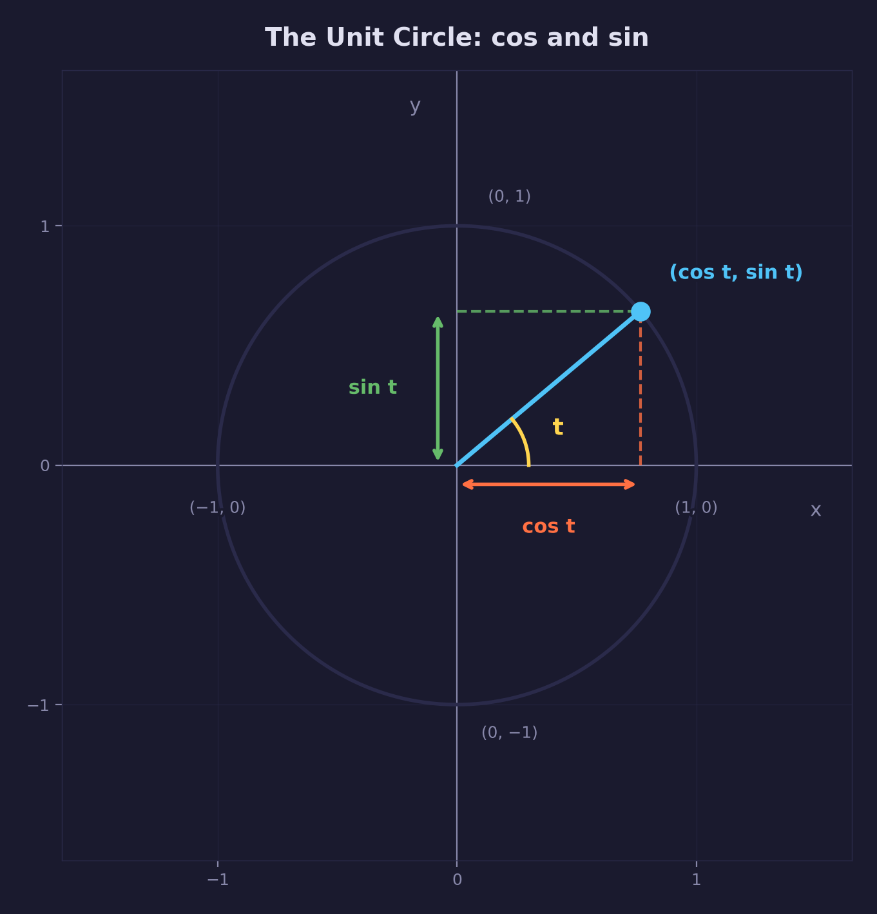
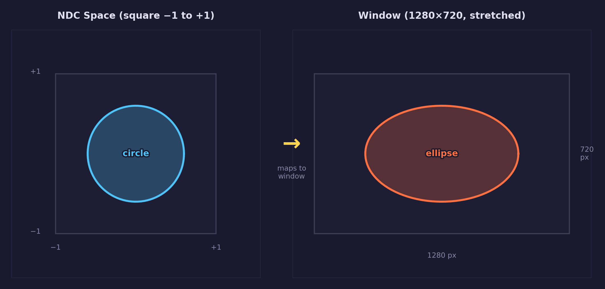

# Lesson 03 — Uniforms & Motion

## What you'll learn

- What **uniforms** are — how the CPU sends data to GPU shaders every frame
- What **push uniforms** are — SDL GPU's lightweight way to set small uniform
  data without creating a GPU buffer object
- How to **declare a uniform buffer in HLSL** using `cbuffer` and `register`
- How to **track elapsed time** and pass it into a shader for animation
- What **radians** are and why GPU math uses them instead of degrees
- How **2D rotation** works — the sin/cos formula and why it produces circular
  motion
- How to **correct for aspect ratio** so shapes don't stretch on non-square
  windows
- Why you should **center geometry at the origin** before rotating it

## Prerequisites

Complete [Lesson 02 — First Triangle](../02-first-triangle/) first. That lesson
covers vertices, shaders, HLSL, the graphics pipeline, and the GPU upload
pattern that this lesson builds on.

You should be comfortable with these concepts from earlier lessons:

- **From Lesson 01:** GPU device, window, swapchain, callback architecture,
  the frame loop (command buffer → render pass → submit), color targets
- **From Lesson 02:** vertices, vertex buffers, shaders (vertex + fragment),
  HLSL structs and semantics (`TEXCOORD{N}`, `SV_Position`, `SV_Target`),
  graphics pipeline creation, the draw call sequence

If any of those feel unfamiliar, review the relevant lesson before continuing.

## Result

The same colored triangle from Lesson 02, but now it spins continuously
around its center. The rotation happens entirely in the vertex shader —
the vertex buffer data never changes after the initial upload.


## Background

### What are uniforms?

In Lesson 02, the vertex shader received only vertex data — a position and a
color for each vertex. That data was uploaded once and never changed. But real
rendering needs data that changes over time: elapsed time for animation, the
camera position, the direction of a light, transformation matrices.

A **uniform** is a value that the CPU sends to the GPU each frame (or whenever
it changes). It is called "uniform" because the value is the **same for every
vertex and every fragment** within a single draw call. This distinguishes it
from vertex attributes, which are different for each vertex.

Think of it this way:

| Data type            | Changes per... | Example                            |
|----------------------|----------------|------------------------------------|
| **Vertex attribute** | vertex         | Position, color, UV coordinate     |
| **Uniform**          | draw call      | Time, camera position, aspect ratio |

Vertex attributes answer "what is this specific vertex?" Uniforms answer
"what is true about the entire scene right now?"

### Why animate on the GPU?

You could animate the triangle by changing its vertex positions on the CPU
every frame and re-uploading the data to the GPU. This would work, but it has
two problems:

1. **Speed** — uploading data from CPU to GPU memory is slow compared to
   computation within the GPU itself. For three vertices it would not matter,
   but for a mesh with thousands of vertices, the upload cost adds up.

2. **Parallelism** — the GPU runs the vertex shader on every vertex in
   parallel. If you move the math into the shader, all vertices are transformed
   simultaneously. If you do it on the CPU, vertices are processed one at a
   time.

The better approach: upload the vertex data once, and every frame send only the
small amount of data that changes (the elapsed time). The vertex shader uses
that time value to compute new positions on the fly. This pattern — **static
geometry + per-frame uniforms** — is how virtually all real-time rendering
works.

### What is rotation?

Rotation means moving a point around a center without changing its distance
from that center. If you put a pin through a piece of paper and spin it, every
point on the paper traces a circle around the pin. That is rotation.

To rotate a 2D point mathematically, you need to know:

- **The center of rotation** — the point that stays fixed (the pin). For this
  lesson, we use the origin `(0, 0)`.
- **The angle** — how far to rotate, measured from the starting position.

The functions `sin` (sine) and `cos` (cosine) are the mathematical tools that
make rotation work. Given an angle, they return the coordinates of a point on a
**unit circle** (a circle with radius 1 centered at the origin):



When `t = 0`, `cos(0) = 1` and `sin(0) = 0` — the point is at `(1, 0)`, the
rightmost position. As `t` increases, the point moves counter-clockwise around
the circle. This is the foundation of all rotation in computer graphics.

#### Radians

Angles in GPU programming are measured in **radians**, not degrees. One full
rotation (360 degrees) equals **2 pi radians** (approximately 6.283). The
conversion is:

```text
radians = degrees * (pi / 180)
```

Why radians? Because `sin` and `cos` are defined in terms of radians, and the
math is cleaner — a half rotation is simply pi, a quarter rotation is pi/2.
The GPU's built-in `sin()` and `cos()` functions expect radians.

In this lesson, `ROTATION_SPEED` is `1.0` — that means 1 radian per second, or
about 57 degrees per second. A full rotation takes about 6.28 seconds.

#### The 2D rotation formula

To rotate any point `(x, y)` by angle `t` around the origin:

```text
new_x = x * cos(t) - y * sin(t)
new_y = x * sin(t) + y * cos(t)
```

This can be written as a matrix multiplication:

```text
| cos(t)  -sin(t) |   | x |   | x*cos(t) - y*sin(t) |
| sin(t)   cos(t) | * | y | = | x*sin(t) + y*cos(t) |
```

You do not need to understand matrices yet (that comes in
[Math 05 — Matrices](../../math/05-matrices/)). What matters is the result: by
plugging the angle into `cos` and `sin`, you get two numbers that, combined
with the original coordinates, produce the rotated position. The formula
preserves the distance from the origin — points move in circles, not spirals.

### What is aspect ratio?

The **aspect ratio** is the ratio of a rectangle's width to its height. A
1280x720 window has an aspect ratio of 1280 / 720 = 1.78 (approximately),
meaning it is about 1.78 times wider than it is tall.

This matters because of how the GPU maps coordinates to pixels. The GPU's
**normalized device coordinates** (NDC) range from -1 to +1 on both the x-axis
and y-axis. The GPU maps this square coordinate range onto your rectangular
window, which stretches the x-axis:



A shape that is perfectly round in NDC appears stretched horizontally on a
widescreen window. To fix this, you divide the x coordinate by the aspect
ratio. This compresses the x-axis back to equal proportions so shapes appear
correct.

## Key concepts

### Declaring uniforms in HLSL — the cbuffer block

In Lesson 02, the vertex shader received data only through `VSInput` — the
per-vertex attributes. This lesson adds a second source of data: a **constant
buffer** (uniform buffer).

In HLSL, you declare a constant buffer with the `cbuffer` keyword:

```hlsl
cbuffer Uniforms : register(b0, space1)
{
    float time;
    float aspect;
};
```

This declares a block of data that is available to every invocation of the
shader. Let's break down the syntax:

| Part | Meaning |
|------|---------|
| `cbuffer` | "constant buffer" — a block of uniform data |
| `Uniforms` | The name you choose for this block (any valid identifier) |
| `register(b0, space1)` | Where SDL GPU places this data (explained below) |
| `float time;` | First field — 4 bytes |
| `float aspect;` | Second field — 4 bytes |

#### Register and space

The `register(b0, space1)` part tells the GPU *where* to find this data. It
has two components:

- **`b0`** — the buffer slot index. `b` stands for "buffer" and `0` is the
  slot number. This matches the slot parameter you pass to
  `SDL_PushGPUVertexUniformData(cmd, 0, ...)` on the C side. If you had a
  second uniform buffer, it would use `b1` and slot `1`.

- **`space1`** — the register space. SDL GPU assigns fixed spaces to each
  shader stage:

| Space | Shader stage | Used for |
|-------|-------------|----------|
| `space1` | Vertex shader | Uniform buffers |
| `space2` | Fragment shader | Textures and samplers |
| `space3` | Fragment shader | Uniform buffers |

You must use the correct space for your shader stage — `space1` for vertex
shader uniforms, `space3` for fragment shader uniforms. Using the wrong space
causes the data to not arrive.

#### Matching C and HLSL layouts

The `cbuffer` fields must match the C struct you push from the CPU, both in
order and in size:

```text
C (CPU side)                         HLSL (GPU side)
--------------------                 --------------------
typedef struct Uniforms {            cbuffer Uniforms : register(b0, space1)
    float time;                      {
    float aspect;                        float time;
} Uniforms;                              float aspect;
                                     };
```

The GPU reads raw bytes, so the memory layout must be identical. Two adjacent
`float` fields work naturally — each is 4 bytes, and they sit one after the
other. If you later add larger types like `float3` or `float4`, you need to be
aware of **alignment rules**: in HLSL `cbuffer` packing, variables align to
4-byte boundaries inside 16-byte (four-`float`) slots. A `float3` occupies
12 bytes within a 16-byte slot, and a field cannot straddle a 16-byte boundary
— so a `float4` that would cross a slot boundary starts at the next 16-byte
slot instead. For now, our two-`float` struct has no alignment concerns.

### The uniform data flow

Here is the complete path that uniform data takes from your C code to the
shader:

```text
CPU (each frame)                       GPU (vertex shader)
--------------------                   --------------------
1. Compute values:                     cbuffer Uniforms : register(b0, space1)
   uniforms.time   = elapsed;          {
   uniforms.aspect = w / h;                float time;    <- receives 'elapsed'
                                           float aspect;  <- receives 'w / h'
2. Push to command buffer:             };
   SDL_PushGPUVertexUniformData(
       cmd, 0, &uniforms,             // Both fields are now available
       sizeof(uniforms));             // to every vertex shader invocation
```

The `0` in the push call is the **slot index**, matching `b0` in the HLSL
register. SDL copies the data internally when you call push, so your C
variable can be a local (stack) variable — it does not need to stay alive after
the push.

**Timing matters:** you must push uniform data *before* calling
`SDL_BeginGPURenderPass`. SDL latches (captures) the uniform values when the
render pass begins. If you push after beginning the pass, the shader receives
stale or undefined data.

### Push uniforms vs. GPU buffers

SDL GPU offers two ways to provide uniform data:

| Method | How it works | When to use |
|--------|-------------|-------------|
| **Push uniforms** | Call `SDL_PushGPUVertexUniformData` with a pointer to a C struct. SDL copies the data internally. | Small data that changes every frame — time, matrices, colors |
| **GPU uniform buffer** | Create a GPU buffer, upload data via transfer buffer (same pattern as vertex buffers in Lesson 02). | Large or rarely-changing data |

Push uniforms are simpler: no buffer creation, no transfer buffers, no copy
passes. You prepare a C struct, push it, and the shader receives it. For our
small `Uniforms` struct (8 bytes — two floats), push uniforms are the right
choice.

### Shader resource counts

When creating a shader in Lesson 02, all the resource counts were zero — the
shaders had no external inputs besides vertex data. In this lesson, the vertex
shader uses one uniform buffer, so we declare that when creating the shader:

```c
#define VERT_NUM_UNIFORM_BUFFERS  1   /* vertex shader has 1 uniform buffer */
#define FRAG_NUM_UNIFORM_BUFFERS  0   /* fragment shader has none */
```

These counts are passed to `SDL_CreateGPUShader` through the
`SDL_GPUShaderCreateInfo` struct. They tell SDL how many resources of each type
the shader expects. If the count does not match what the shader actually
declares, you get a runtime error or undefined behavior.

The count `1` corresponds to the single
`cbuffer Uniforms : register(b0, space1)` in the vertex shader. If you added a
second `cbuffer` at `register(b1, space1)`, you would set this count to `2`.

### Tracking elapsed time

Animation needs a value that changes every frame. We use elapsed time —
the number of seconds since the program started:

```c
/* In SDL_AppInit -- record the starting time */
state->start_ticks = SDL_GetTicks();   /* returns milliseconds */

/* In SDL_AppIterate -- compute elapsed seconds */
Uint64 now_ms = SDL_GetTicks();
float elapsed = (float)(now_ms - state->start_ticks) / 1000.0f;
```

`SDL_GetTicks()` returns the number of milliseconds since `SDL_Init` was
called. By subtracting the start time and dividing by 1000, we get a
floating-point number that starts at 0.0 when the program launches and
increases steadily — 1.0 after one second, 2.0 after two seconds, and so on.

We multiply by `ROTATION_SPEED` to control how fast the triangle spins:

```c
uniforms.time = elapsed * ROTATION_SPEED + INITIAL_ROTATION;
```

`ROTATION_SPEED` is 1.0 (one radian per second). `INITIAL_ROTATION` is 0.8
radians, which offsets the starting angle so the triangle is visibly rotated
in a static screenshot. Without it, the triangle would start in the same
orientation as Lesson 02.

### Centering geometry for rotation

Rotation happens around the **origin** `(0, 0)`. If the geometry is not
centered at the origin, it orbits around it instead of spinning in place — like
the difference between a figure skater spinning on the spot versus skating in
a circle around the rink.

Lesson 02's triangle had its centroid (the average of all three vertex
positions) at `(0, -0.167)` — slightly below center, because the bottom edge
was further from the origin than the top vertex. Rotating that triangle would
produce a visible wobble.

This lesson adjusts the y-coordinates so the centroid sits exactly at `(0, 0)`:

```c
static const Vertex triangle_vertices[VERTEX_COUNT] = {
    { .position = {  0.0f,  0.5f  }, .color = { 1.0f, 0.0f, 0.0f } },  /* top */
    { .position = { -0.5f, -0.25f }, .color = { 0.0f, 1.0f, 0.0f } },  /* bottom-left */
    { .position = {  0.5f, -0.25f }, .color = { 0.0f, 0.0f, 1.0f } },  /* bottom-right */
};
```

The centroid is the average: `(0 + (-0.5) + 0.5) / 3 = 0` for x, and
`(0.5 + (-0.25) + (-0.25)) / 3 = 0` for y. With the centroid at the origin,
rotation spins the triangle smoothly in place.

### Aspect ratio correction in practice

The aspect ratio is computed each frame by querying the window size:

```c
int w = 0, h = 0;
SDL_GetWindowSizeInPixels(state->window, &w, &h);
float aspect = (h > 0) ? (float)w / (float)h : 1.0f;
```

The `(h > 0)` check prevents division by zero if the window has no height
(which can happen briefly during certain window state changes). We query the
size every frame so the correction stays accurate even if the window were
resized.

This value is passed to the shader as `uniforms.aspect`, where the vertex
shader divides the x coordinate by it:

```hlsl
output.position = float4(rotated.x / aspect, rotated.y, 0.0, 1.0);
```

On a 1280x720 window, `aspect` is approximately 1.78. Dividing x by 1.78
compresses the horizontal axis so that equal distances in x and y appear as
equal distances on screen. Without this, the spinning triangle would look
squashed — wider than it is tall.

### The order of operations matters

The vertex shader performs two transformations: rotation and aspect correction.
The order is important:

1. **Rotate first** — in the original coordinate space where x and y have
   equal scale. The rotation formula assumes equal axes. If the axes were
   unequal (already aspect-corrected), the rotation would distort the shape —
   circles would become ellipses.

2. **Correct aspect second** — map the rotated coordinates into the window's
   proportions. This is a display adjustment, not a geometric transformation.

This two-step pattern — "do geometric math in a space with equal axes, then
adjust for display" — recurs throughout graphics programming. In later lessons,
proper transformation matrices handle this systematically, but the principle
is the same.

## The shaders — line by line

### Vertex shader (triangle.vert.hlsl)

```hlsl
cbuffer Uniforms : register(b0, space1)
{
    float time;
    float aspect;
};

struct VSInput
{
    float2 position : TEXCOORD0;
    float3 color    : TEXCOORD1;
};

struct VSOutput
{
    float4 position : SV_Position;
    float4 color    : TEXCOORD0;
};

VSOutput main(VSInput input)
{
    VSOutput output;

    float c = cos(time);
    float s = sin(time);

    float2 rotated;
    rotated.x = input.position.x * c - input.position.y * s;
    rotated.y = input.position.x * s + input.position.y * c;

    output.position = float4(rotated.x / aspect, rotated.y, 0.0, 1.0);
    output.color    = float4(input.color, 1.0);
    return output;
}
```

Walking through each part:

**The `cbuffer` block** (new in this lesson) — declares two uniform values
that arrive from the CPU. `time` drives the rotation angle. `aspect` corrects
for the window's proportions. See
[Declaring uniforms in HLSL](#declaring-uniforms-in-hlsl--the-cbuffer-block)
above for the full explanation.

**`VSInput` and `VSOutput`** — identical to Lesson 02. The vertex shader still
receives position and color per-vertex, and outputs a clip-space position and
color for interpolation.

**`cos(time)` and `sin(time)`** — HLSL provides `cos` and `sin` as built-in
functions. They take an angle in radians and return a value between -1 and +1.
The results are stored in `c` and `s` to avoid computing them twice per vertex.

**The rotation** — applies the 2D rotation formula to `input.position`. Each
vertex's position is rotated by `time` radians around the origin. Because
`time` increases every frame, the triangle spins continuously.

**`rotated.x / aspect`** — compresses the x-axis to compensate for the
non-square window. This is the last operation before output, ensuring the
rotation math happens in an undistorted coordinate space.

**`float4(rotated.x / aspect, rotated.y, 0.0, 1.0)`** — the same expansion
from 2D to clip space that Lesson 02 used: z = 0 (no depth) and w = 1 (no
perspective). The only difference is that the x and y values are now
transformed instead of passed through unchanged.

### Fragment shader (triangle.frag.hlsl)

```hlsl
struct PSInput
{
    float4 position : SV_Position;
    float4 color    : TEXCOORD0;
};

float4 main(PSInput input) : SV_Target
{
    return input.color;
}
```

The fragment shader is **unchanged from Lesson 02**. It receives the
interpolated color from the rasterizer and outputs it as the pixel color. All
of the animation logic lives in the vertex shader — the fragment shader does
not need to know about time or rotation.

This is a common pattern: the vertex shader handles positioning and
transformation, while the fragment shader handles appearance (color, textures,
lighting). In this lesson, appearance is just the interpolated vertex color,
so the fragment shader remains a pass-through.

## Shader compilation

The HLSL source files in `shaders/` are pre-compiled to SPIRV (Vulkan) and
DXIL (D3D12). If you modify a shader, recompile with the project script:

```bash
python scripts/compile_shaders.py 03
```

Or manually with `dxc`:

```bash
# From lessons/gpu/03-uniforms-and-motion/

# SPIRV (requires Vulkan SDK)
dxc -spirv -T vs_6_0 -E main shaders/triangle.vert.hlsl -Fo shaders/compiled/triangle.vert.spv
dxc -spirv -T ps_6_0 -E main shaders/triangle.frag.hlsl -Fo shaders/compiled/triangle.frag.spv

# DXIL (requires Windows SDK or Vulkan SDK)
dxc -T vs_6_0 -E main shaders/triangle.vert.hlsl -Fo shaders/compiled/triangle.vert.dxil
dxc -T ps_6_0 -E main shaders/triangle.frag.hlsl -Fo shaders/compiled/triangle.frag.dxil
```

Then regenerate the C headers:

```bash
python ../../scripts/bin_to_header.py shaders/compiled/triangle.vert.spv \
    triangle_vert_spirv shaders/compiled/triangle_vert_spirv.h
python ../../scripts/bin_to_header.py shaders/compiled/triangle.frag.spv \
    triangle_frag_spirv shaders/compiled/triangle_frag_spirv.h
python ../../scripts/bin_to_header.py shaders/compiled/triangle.vert.dxil \
    triangle_vert_dxil shaders/compiled/triangle_vert_dxil.h
python ../../scripts/bin_to_header.py shaders/compiled/triangle.frag.dxil \
    triangle_frag_dxil shaders/compiled/triangle_frag_dxil.h
```

See [Lesson 02](../02-first-triangle/) for a full explanation of the dxc flags
and what each compilation step does.

## Shaders

| File | Purpose |
|------|---------|
| `triangle.vert.hlsl` | Reads elapsed time and aspect ratio from a uniform buffer, applies a 2D rotation to spin the triangle, and corrects for aspect ratio |
| `triangle.frag.hlsl` | Outputs the interpolated vertex color (unchanged from Lesson 02 — animation is handled entirely in the vertex shader) |

## Math connections

This lesson introduces rotation, which is the first geometric transformation
in the series. These math lessons provide deeper coverage:

- [Math 01 — Vectors](../../math/01-vectors/) — the `vec2` and `vec3` types
  used in the vertex struct, and what vectors represent geometrically
- [Math 02 — Coordinate Spaces](../../math/02-coordinate-spaces/) — how
  vertices move from model space to screen space, and why the aspect ratio
  correction is a coordinate-space transformation
- [Math 05 — Matrices](../../math/05-matrices/) — the 2D rotation formula used
  here is actually a matrix multiplication; this lesson formalizes the concept

## Engine connections

- [Engine 01 — Intro to C](../../engine/01-intro-to-c/) — structs, `typedef`,
  and `offsetof` used in the vertex and uniform definitions
- [Engine 02 — CMake Fundamentals](../../engine/02-cmake-fundamentals/) —
  how the build system compiles and links this lesson
- [Engine 06 — Reading Error Messages](../../engine/06-reading-error-messages/) —
  how to diagnose shader compilation errors and runtime GPU validation messages

## Building

```bash
# From the repository root
cmake -B build
cmake --build build --config Debug
```

Run:

```bash
python scripts/run.py 03

# Or directly:
# Windows
build\lessons\gpu\03-uniforms-and-motion\Debug\03-uniforms-and-motion.exe
# Linux / macOS
./build/lessons/gpu/03-uniforms-and-motion/03-uniforms-and-motion
```

## AI skill

This lesson has a matching Claude Code skill:
[`uniforms-and-motion`](../../../.claude/skills/uniforms-and-motion/SKILL.md) —
invoke it with `/uniforms-and-motion` or copy it into your own project's
`.claude/skills/` directory. It distils the uniform buffer pattern from this
lesson into a reusable reference that AI assistants can follow.

## Exercises

1. **Change the speed** — Modify `ROTATION_SPEED` to make the triangle spin
   faster or slower. Try `3.0` for fast, `0.2` for slow. What happens with a
   negative value? (Hint: negative angles reverse the direction of `sin` and
   `cos`.)

2. **Pulse the size** — Add a `scale` field to the `Uniforms` struct (both in
   C and in the HLSL `cbuffer`). On the CPU, compute
   `sin(elapsed) * 0.3 + 0.7` and pass it as `uniforms.scale`. In the vertex
   shader, multiply `input.position` by `scale` before rotating. The triangle
   should breathe in and out while spinning. (Remember to keep the C and HLSL
   struct layouts matching.)

3. **Orbit instead of spin** — Instead of rotating the triangle's vertices
   around the origin, add an offset that moves the entire triangle in a
   circle: `rotated.x += cos(time) * 0.5; rotated.y += sin(time) * 0.5;`
   (after the rotation). The triangle moves in a circle while maintaining its
   orientation. What happens if you apply both the rotation and the orbit?

4. **Color cycling** — Pass `time` to the fragment shader via a second
   uniform buffer. In the HLSL fragment shader, add
   `cbuffer FragUniforms : register(b0, space3)` (note: `space3` for fragment
   stage). On the C side, use `SDL_PushGPUFragmentUniformData(cmd, 0, ...)`.
   Set `FRAG_NUM_UNIFORM_BUFFERS` to `1`. Use the time value to shift the
   interpolated colors.
