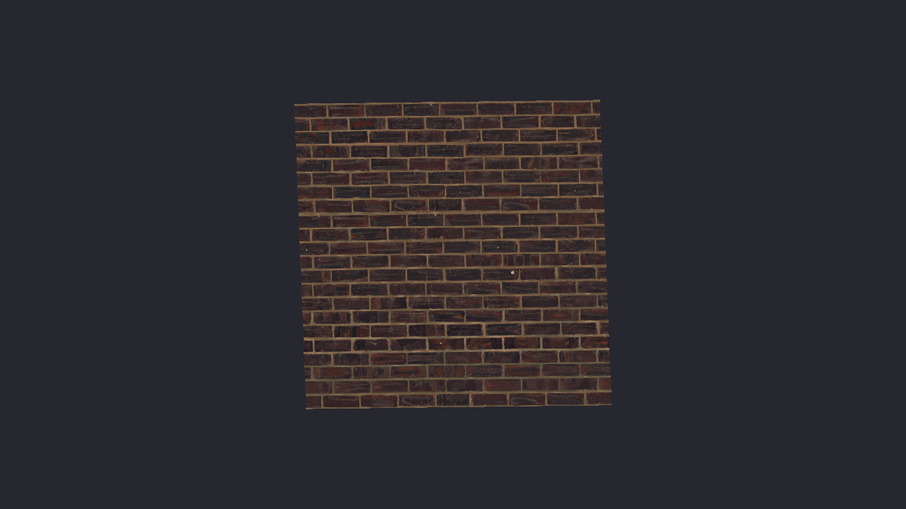

# Lesson 04 — Textures & Samplers

## What you'll learn

- How to **load an image** from disk using `SDL_LoadSurface`
- How to **create a GPU texture** and upload pixel data with a transfer buffer
- How **samplers** control texture filtering (linear vs. nearest) and address
  modes (repeat, clamp, mirror)
- How **UV coordinates** map texture pixels to geometry
- How to use an **index buffer** to draw a quad with 4 vertices instead of 6
- How the **sRGB texture format** gives you correct colors end-to-end
- How to **sample a texture** in an HLSL fragment shader

## Result

A spinning quad textured with a brick wall image. The texture is loaded from
a PNG file at runtime, uploaded to the GPU, and sampled in the fragment shader
using linear filtering.



## Key concepts

### Textures and samplers

A **texture** is an image stored in GPU memory. A **sampler** tells the GPU
*how* to read from that image:

| Sampler setting | What it controls | Options |
|-----------------|-----------------|---------|
| **Filter** (min/mag) | What to do when a texel doesn't map 1:1 to a pixel | `LINEAR` (smooth blend) / `NEAREST` (pixelated) |
| **Address mode** (U/V/W) | What to do when UVs go outside 0–1 | `REPEAT` (tile) / `CLAMP_TO_EDGE` / `MIRRORED_REPEAT` |

Textures and samplers are separate objects in SDL GPU — you can mix and match.
One texture with two samplers (one linear, one nearest) gives you both smooth
and pixelated looks without duplicating the image data.

### UV coordinates

**UV coordinates** are per-vertex attributes that tell the shader where on the
texture to look. The rasterizer interpolates them across the surface, so each
fragment gets a unique UV:

```text
Position space:              UV space (texture):
(-0.6, +0.6)----(+0.6, +0.6)    (0,0)-------(1,0)
     |  \            |               |             |
     |   \           |               |             |
     |    \          |               |             |
(-0.6, -0.6)----(+0.6, -0.6)    (0,1)-------(1,1)
```

UV origin is at the **top-left** of the image. U goes right, V goes down.
This matches how images are stored in memory (top row first).

### Math

This lesson uses concepts from earlier math lessons:

- **Vectors** — [Math Lesson 01](../../math/01-vectors/) explains `vec2` for
  positions and UV coordinates
- **Coordinate spaces** — [Math Lesson 02](../../math/02-coordinate-spaces/)
  covers how positions map from model space to screen space. UV coordinates
  are a similar mapping — from geometry space to texture space
- **2D rotation** — The vertex shader uses the same `sin`/`cos` rotation from
  Lesson 03, applied to the quad's positions before output
- **Bilinear interpolation** — [Math Lesson 03](../../math/03-bilinear-interpolation/)
  explains the math behind LINEAR texture filtering: three nested lerps that
  blend the 4 nearest texels into a smooth result

UV coordinates are essentially a coordinate transform: they map each point on
the quad's surface to a point on the texture image. Understanding coordinate
spaces (Math Lesson 02) helps you reason about how UVs work and why they're
interpolated across the surface.

### Index buffers

A quad needs two triangles, which means 6 vertices — but two of those
vertices are shared. An **index buffer** lets us define 4 unique vertices
and reference them by index:

```text
Vertices: v0, v1, v2, v3  (4 unique)
Indices:  [0, 1, 2,  2, 3, 0]  (6 indices → 2 triangles)

v0------v1
| \      |     Triangle 1: v0, v1, v2
|  \     |     Triangle 2: v2, v3, v0
|   \    |
v3------v2
```

For a quad, this saves 2 vertices. For a mesh with thousands of triangles
sharing edges, the savings are enormous — both in memory and in vertex shader
invocations (the GPU caches and reuses vertex shader output for shared vertices).

### Texture upload

Uploading a texture to the GPU follows the same transfer buffer pattern as
vertex buffers from Lesson 02:

```text
CPU side:                          GPU side:
────────────                       ─────────
SDL_LoadSurface("brick.png")       SDL_CreateGPUTexture(...)
  → SDL_Surface (CPU pixels)         → GPU texture (empty)

SDL_CreateGPUTransferBuffer(...)
  → staging area in shared memory

Map → memcpy pixels → Unmap

Begin copy pass
  SDL_UploadToGPUTexture(...)      → pixel data now on GPU
End copy pass, Submit

Release transfer buffer + surface
```

The key difference from vertex upload: textures use `SDL_UploadToGPUTexture`
instead of `SDL_UploadToGPUBuffer`, and the source/destination structs carry
extra information about pixel layout (rows per layer, pixels per row).

### sRGB color pipeline

This lesson uses the **correct sRGB pipeline** end-to-end:

1. **Texture format:** `R8G8B8A8_UNORM_SRGB` — the GPU auto-converts
   sRGB → linear when sampling
2. **Shader math:** all operations happen in linear space (physically correct)
3. **Swapchain format:** `B8G8R8A8_UNORM_SRGB` — the GPU auto-converts
   linear → sRGB when writing

Without sRGB-aware formats, colors look washed out because the GPU treats
sRGB color values as if they were linear (applying gamma twice on output).
Exercise 2 lets you see this for yourself.

### Pixel format mapping

A common source of confusion: SDL and the GPU name pixel formats differently.

| SDL name | GPU name | Memory layout |
|----------|----------|---------------|
| `SDL_PIXELFORMAT_ABGR8888` | `R8G8B8A8_UNORM` | R, G, B, A (byte order) |
| `SDL_PIXELFORMAT_ARGB8888` | `B8G8R8A8_UNORM` | B, G, R, A (byte order) |

SDL names bits from MSB to LSB in a 32-bit integer. GPU names bytes in memory
order. On little-endian systems (x86), these end up being "reversed" names for
the same layout.

### HLSL texture binding convention

SDL GPU maps fragment-stage textures and samplers to specific HLSL registers:

| Resource | Register | Description |
|----------|----------|-------------|
| Texture slot 0 | `register(t0, space2)` | Fragment texture |
| Sampler slot 0 | `register(s0, space2)` | Fragment sampler |
| Texture slot 1 | `register(t1, space2)` | Second texture |
| Sampler slot 1 | `register(s1, space2)` | Second sampler |

The slot index matches the array position in `SDL_BindGPUFragmentSamplers`.
`space2` is mandatory for fragment-stage resources.

```hlsl
Texture2D    tex : register(t0, space2);
SamplerState smp : register(s0, space2);

float4 main(PSInput input) : SV_Target
{
    return tex.Sample(smp, input.uv);
}
```

## Shader compilation

The HLSL source files in `shaders/` are pre-compiled to SPIRV (Vulkan) and
DXIL (D3D12). If you modify a shader, recompile with:

```bash
python scripts/compile_shaders.py 04 -v
```

Or manually:

```bash
# SPIRV (requires Vulkan SDK)
dxc -spirv -T vs_6_0 -E main shaders/quad.vert.hlsl -Fo shaders/quad.vert.spv
dxc -spirv -T ps_6_0 -E main shaders/quad.frag.hlsl -Fo shaders/quad.frag.spv

# DXIL (requires Windows SDK or Vulkan SDK)
dxc -T vs_6_0 -E main shaders/quad.vert.hlsl -Fo shaders/quad.vert.dxil
dxc -T ps_6_0 -E main shaders/quad.frag.hlsl -Fo shaders/quad.frag.dxil
```

## Building

```bash
# From the repository root
cmake -B build
cmake --build build --config Debug --target 04-textures-and-samplers
```

Run:

```bash
python scripts/run.py 04

# Or directly:
# Windows
build\lessons\gpu\04-textures-and-samplers\Debug\04-textures-and-samplers.exe
# Linux / macOS
./build/lessons/gpu/04-textures-and-samplers/04-textures-and-samplers
```

## AI skill

This lesson has a matching Claude Code skill:
[`textures-and-samplers`](../../../.claude/skills/textures-and-samplers/SKILL.md) —
invoke it with `/textures-and-samplers` or copy it into your own project's
`.claude/skills/` directory. It distils the texture loading, sampler creation,
and UV mapping patterns from this lesson into a reusable reference.

## Texture credit

The brick wall texture is from [Poly Haven](https://polyhaven.com/a/brick_wall_10)
by **Dimitrios Savva**, released under [CC0](https://creativecommons.org/publicdomain/zero/1.0/)
(public domain).

## Exercises

1. **Nearest filtering** — Change the sampler's `min_filter` and `mag_filter`
   to `SDL_GPU_FILTER_NEAREST`. The texture becomes pixelated up close. This
   is the look you want for pixel art or retro-style games.

2. **See the sRGB difference** — Change the texture format from
   `R8G8B8A8_UNORM_SRGB` to `R8G8B8A8_UNORM` (remove the `_SRGB` suffix).
   The brick wall will look noticeably washed out because the GPU no longer
   converts sRGB→linear on read, so gamma correction is applied twice.

3. **Tiled texture** — Change the UV coordinates to go from 0 to 3 instead
   of 0 to 1. Because the sampler uses `REPEAT` address mode, the texture
   tiles three times across the quad. Try `CLAMP_TO_EDGE` to see the
   difference.

4. **Second texture** — Add a second texture (any PNG) and a second sampler
   slot. Blend between them in the fragment shader:
   `lerp(tex1.Sample(...), tex2.Sample(...), 0.5)`. You'll need
   `register(t1, space2)` and `register(s1, space2)` for the second pair,
   and `num_samplers = 2` on the fragment shader.
