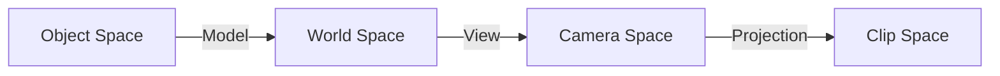

# Lesson 06 — Depth Buffer & 3D Transforms

## What you'll learn

- The Model-View-Projection (MVP) pipeline for 3D rendering
- Depth buffers — how the GPU determines which surfaces are in front
- Back-face culling — skipping invisible faces for efficiency
- Perspective projection — distant objects appear smaller
- Window resize handling for the depth texture
- 3D vertex positions (float3) and per-vertex colors

## Result


A colored cube spinning around two axes against a dark background. Each face
is a different color (complementary pairs on opposite faces):

- **Front / Back**: Red / Cyan
- **Right / Left**: Green / Magenta
- **Top / Bottom**: Blue / Yellow

## Key concepts

### From 2D to 3D

Previous lessons used 2D positions (float2) in NDC space with simple rotation
in the shader. This lesson makes the jump to true 3D:

| Concept | Lessons 01–05 | Lesson 06 |
|---------|---------------|-----------|
| Vertex positions | `float2` (2D, NDC) | `float3` (3D, model space) |
| Transform | 2D rotation in shader | Full MVP matrix on CPU |
| Uniform data | `time` + `aspect` | `mat4 mvp` (64 bytes) |
| Depth testing | None (flat geometry) | D16_UNORM depth buffer |
| Face culling | None | `CULLMODE_BACK` |

### The MVP pipeline

Every vertex goes through three transforms, composed into one matrix:

$\text{MVP} = \text{Projection} \times \text{View} \times \text{Model}$



```c
/* Compose on the CPU each frame */
mat4 model = mat4_multiply(rotate_y, rotate_x);  /* spin the cube  */
mat4 view  = mat4_look_at(eye, target, up);       /* position camera */
mat4 proj  = mat4_perspective(fov, aspect, 0.1f, 100.0f);

mat4 vp  = mat4_multiply(proj, view);
mat4 mvp = mat4_multiply(vp, model);
```

In the vertex shader:

```hlsl
output.position = mul(mvp, float4(input.position, 1.0));
```

See [Math Lesson 05 — Matrices](../../math/05-matrices/) for a detailed walkthrough
of each transform with numerical examples.

### Depth buffer

Without depth testing, triangles draw in submission order — later triangles
always cover earlier ones regardless of distance. The cube would look broken.

A **depth buffer** (also called Z-buffer) stores the depth of each rendered
pixel. For each new fragment, the GPU compares its depth against the stored
value:

- If the new fragment is **closer** → draw it, update the depth
- If it's **farther** → discard it (something closer is already there)

```c
/* Pipeline: enable depth testing */
pipeline_info.depth_stencil_state.enable_depth_test  = true;
pipeline_info.depth_stencil_state.enable_depth_write = true;
pipeline_info.depth_stencil_state.compare_op         = SDL_GPU_COMPAREOP_LESS_OR_EQUAL;

/* Pipeline: declare the depth target format */
pipeline_info.target_info.has_depth_stencil_target = true;
pipeline_info.target_info.depth_stencil_format     = SDL_GPU_TEXTUREFORMAT_D16_UNORM;
```

The depth texture is created as a GPU texture with `DEPTH_STENCIL_TARGET` usage:

```c
SDL_GPUTextureCreateInfo info = { 0 };
info.type   = SDL_GPU_TEXTURETYPE_2D;
info.format = SDL_GPU_TEXTUREFORMAT_D16_UNORM;
info.usage  = SDL_GPU_TEXTUREUSAGE_DEPTH_STENCIL_TARGET;
info.width  = window_width;
info.height = window_height;
```

### Render pass with depth target

Previous lessons passed `NULL` for the depth target. Now we pass a depth target
that's cleared to 1.0 (far plane) each frame:

```c
SDL_GPUDepthStencilTargetInfo depth_target = { 0 };
depth_target.texture     = depth_texture;
depth_target.load_op     = SDL_GPU_LOADOP_CLEAR;
depth_target.store_op    = SDL_GPU_STOREOP_DONT_CARE;
depth_target.clear_depth = 1.0f;

SDL_BeginGPURenderPass(cmd, &color_target, 1, &depth_target);
```

### Back-face culling

A cube has 6 faces, but you can only see 3 at most from any angle. The GPU
can skip "back faces" (facing away from the camera) automatically:

```c
pipeline_info.rasterizer_state.cull_mode  = SDL_GPU_CULLMODE_BACK;
pipeline_info.rasterizer_state.front_face = SDL_GPU_FRONTFACE_COUNTER_CLOCKWISE;
```

This halves the fragment shader work for closed meshes. It requires consistent
winding order — all our faces use counter-clockwise winding as viewed from
outside.

### Window resize handling

The depth texture must match the swapchain dimensions. Each frame, we check if
the window size has changed and recreate the depth texture if needed:

```c
if (cur_w != state->depth_width || cur_h != state->depth_height) {
    SDL_ReleaseGPUTexture(state->device, state->depth_texture);
    state->depth_texture = create_depth_texture(state->device, cur_w, cur_h);
    state->depth_width  = cur_w;
    state->depth_height = cur_h;
}
```

### HLSL column-major compatibility

forge_math.h stores matrices in column-major order, which matches HLSL's
default `column_major float4x4` — no transpose needed:

```hlsl
cbuffer Uniforms : register(b0, space1)
{
    column_major float4x4 mvp;
};

output.position = mul(mvp, float4(input.position, 1.0));
```

## What changed from Lesson 05

| Concept | Lesson 05 | Lesson 06 |
|---------|-----------|-----------|
| Vertex positions | `float2` (2D) | `float3` (3D) |
| Transform | 2D scale in shader | Full MVP matrix on CPU |
| Uniform data | time, aspect, uv_scale, pad | `mat4 mvp` (64 bytes) |
| Depth testing | None | `D16_UNORM`, `LESS_OR_EQUAL` |
| Face culling | `CULLMODE_NONE` | `CULLMODE_BACK` |
| Render pass depth | `NULL` | `SDL_GPUDepthStencilTargetInfo` |
| Pipeline depth | `has_depth_stencil_target = false` | `= true` |
| Geometry | Flat quad | 3D cube (24 vertices, 36 indices) |
| Textures | Procedural checkerboard | None (per-vertex color) |
| Interaction | SPACE to cycle samplers | None (auto-rotation) |
| Window | Fixed size | Resizable (depth texture recreated) |

## Shaders

| File | Purpose |
|------|---------|
| `cube.vert.hlsl` | Transforms 3D vertices from object space to clip space using the Model-View-Projection matrix |
| `cube.frag.hlsl` | Outputs the interpolated per-vertex color with no texturing or lighting |

## Building and running

```bash
cmake -B build
cmake --build build --config Debug
python scripts/run.py 06
```

The cube spins continuously. Resize the window to verify the depth buffer
handles size changes correctly.

## AI skill

This lesson has a matching Claude Code skill:
[`depth-and-3d`](../../../.claude/skills/depth-and-3d/SKILL.md) — invoke it with
`/depth-and-3d` or copy it into your own project's `.claude/skills/` directory.
It distils the depth buffer, MVP pipeline, and 3D rendering patterns from this
lesson into a reusable reference.

## See also

- [Math Lesson 05 — Matrices](../../math/05-matrices/) — numerical walkthrough of each transform
- [Math Lesson 02 — Coordinate Spaces](../../math/02-coordinate-spaces/) — transform theory
- [Math Lesson 06 — Projections](../../math/06-projections/) — perspective and orthographic projection
- [Lesson 04 — Textures & Samplers](../04-textures-and-samplers/) — index buffers (used here too)
- [Math library](../../../common/math/README.md) — `mat4_perspective`, `mat4_look_at`, etc.

## Exercises

1. **Camera position**: Move the camera to `(3, 0, 0)` looking at the origin.
   Now you're viewing the cube from the side — which faces are visible?

2. **Disable depth testing**: Set `enable_depth_test = false` in the pipeline.
   Watch the cube — faces render in submission order, creating an "inside out"
   effect. This is why depth testing exists.

3. **Disable culling**: Set `cull_mode = CULLMODE_NONE`. You won't see a
   visual difference (depth testing still works), but the GPU is doing twice
   the fragment shader work.

4. **Wireframe mode**: Change `fill_mode` to `SDL_GPU_FILLMODE_LINE`. Now you
   can see all the triangles that make up the cube.

5. **Multiple cubes**: Draw the cube twice with different model matrices (e.g.,
   one at the origin and one translated by (2, 0, 0)). Push different MVP
   uniforms for each draw call.

6. **Orthographic projection**: Replace `mat4_perspective` with
   `mat4_orthographic`. The cube still renders correctly, but without
   perspective foreshortening — it looks "flat" like an isometric game.
