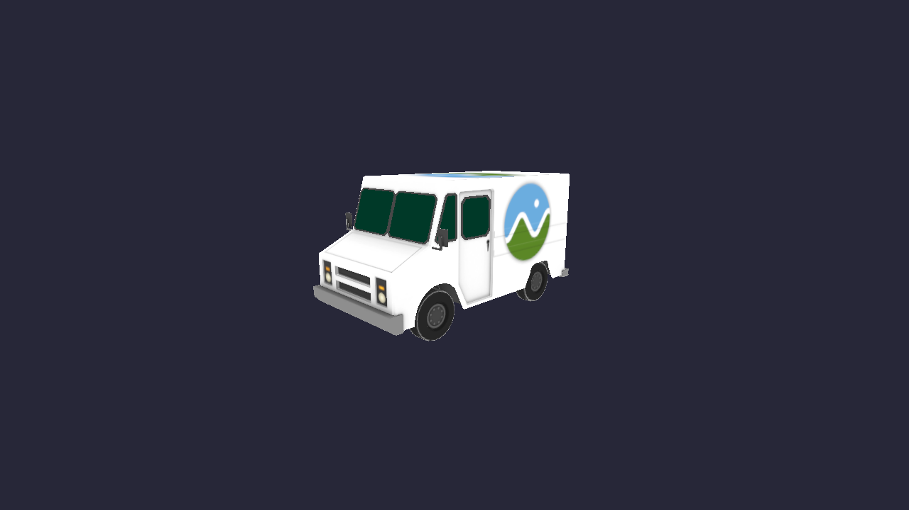
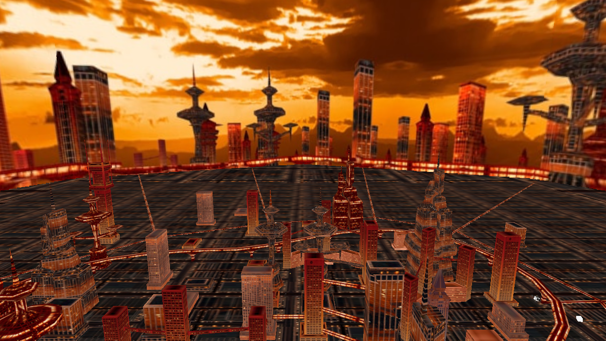

# Lesson 09 — Loading a Scene (glTF)

## What you'll learn

- The **glTF 2.0** file format — the "JPEG of 3D"
- **Scene hierarchy** — nodes with parent-child transforms (translation, rotation, scale)
- **Accessor pipeline** — how glTF chains accessor → bufferView → buffer to describe data
- **Multi-material rendering** — switching base color and texture per primitive via push uniforms
- **Indexed drawing** — `SDL_DrawGPUIndexedPrimitives` with index buffers
- **Quaternion transforms** — loading glTF's `[x,y,z,w]` quaternions into rotation matrices
- Using a **reusable glTF parser library** (`common/gltf/forge_gltf.h`)
- **cJSON** — a lightweight C library for parsing JSON

In this lesson you'll load a complete 3D scene from a glTF file — multiple
meshes with different materials, arranged in a node hierarchy with nested
transforms. This is a significant step up from Lesson 08 (OBJ), which loaded a
single mesh with one material.

## Result





The default model (CesiumMilkTruck) shows a textured truck with glass windshield,
metal trim, and wheels — all loaded from a single glTF file. Pass a different
model on the command line to load any glTF scene, like the VirtualCity above
(234 nodes, 167 materials, 20 textures).

## Prerequisites

Before starting this lesson, you should be comfortable with:

- **Lesson 04** — Textures & Samplers (loading images, UV coordinates)
- **Lesson 05** — Mipmaps (mipmap generation, trilinear filtering)
- **Lesson 06** — Depth Buffer & 3D Transforms (MVP pipeline, depth testing)
- **Lesson 07** — Camera & Input (first-person camera, delta time)
- **Lesson 08** — Loading a Mesh (OBJ parsing, file-based textures)
- **Math Lesson 08** — Orientation (quaternions, rotation matrices)

## The glTF format

glTF (Graphics Language Transmission Format) is an open standard by Khronos
Group for transmitting 3D scenes. Unlike OBJ, which is plain text with limited
material support, glTF uses JSON for the scene description and binary files for
the heavy data (vertices, indices, images).

### Two files: .gltf + .bin

```text
CesiumMilkTruck.gltf   ← JSON: scene structure, materials, relationships
CesiumMilkTruck_data.bin  ← Binary: vertex positions, normals, UVs, indices
CesiumMilkTruck.jpg     ← Texture: diffuse map for the truck body
```

The JSON file describes *what* the scene contains and *how* it's organized. The
binary file holds the raw vertex/index data. Textures are separate image files
referenced by URI.

### The accessor pipeline

glTF uses a three-level chain to describe binary data:

```text
accessor → bufferView → buffer

"accessors": [
  { "bufferView": 0, "componentType": 5126, "count": 3, "type": "VEC3" }
]
"bufferViews": [
  { "buffer": 0, "byteOffset": 0, "byteLength": 36 }
]
"buffers": [
  { "uri": "data.bin", "byteLength": 42 }
]
```

- **Buffer** — the raw .bin file loaded into memory
- **BufferView** — a slice of a buffer (byte offset + length)
- **Accessor** — typed interpretation of a buffer view (e.g., "3 VEC3 floats")

This design is efficient: multiple accessors can share one buffer, and the
binary data maps directly to GPU vertex/index buffers.

### Scene hierarchy

A glTF scene is a tree of **nodes**. Each node can have:

- A **transform** (translation + rotation + scale, or a raw 4x4 matrix)
- A **mesh** reference (the geometry to draw at this node)
- **Children** (other nodes that inherit this node's transform)

```text
Scene
├── Node 0 "Cesium_Milk_Truck" (mesh: truck body)
│   ├── Node 1 "Wheels"          (mesh: wheel, transform: left position)
│   └── Node 2 "Wheels"          (mesh: wheel, transform: right position)
├── Node 3 (transform-only — group node)
│   └── ...
```

To render, we walk the tree, accumulating transforms:

```text
world_transform = parent_world × local_transform
```

Each node's world transform is the product of all ancestor transforms. This is
how the same wheel mesh appears at two different positions — the parent node
positions it, and we pass the accumulated MVP to the shader.

### Materials

glTF uses a PBR (Physically Based Rendering) material model. For this lesson,
we use two properties:

- **baseColorFactor** — an RGBA color multiplier (e.g., `[0.8, 0.0, 0.0, 1.0]` for red)
- **baseColorTexture** — a reference to an image file (the diffuse map)

Materials without a texture get a solid color. Materials with a texture multiply
the sampled texel by the base color factor (usually white, so the texture shows
through unmodified).

## Indexed drawing vs de-indexed (Lesson 08)

In Lesson 08 (OBJ), we "de-indexed" the mesh — expanding every face corner into
its own vertex. This works but wastes memory when vertices are shared across
triangles.

glTF natively supports indexed drawing. The index buffer tells the GPU which
vertices to use for each triangle, so shared vertices are stored only once:

```text
Lesson 08 (OBJ, de-indexed):     Lesson 09 (glTF, indexed):
  vertex_count = 6708              vertex_count = 2024
  index_count  = (none)            index_count  = 5640
  DrawPrimitives(6708)             DrawIndexedPrimitives(5640)
```

The GPU uses the index buffer to look up vertices, so the same vertex data can
be referenced by multiple triangles. This is more memory-efficient and better
reflects how models are authored.

## The glTF parser library

The parser lives in `common/gltf/forge_gltf.h` — a header-only library
following the same pattern as `common/obj/forge_obj.h`.

### CPU-side parsing, GPU-side upload

The parser only handles CPU work: reading JSON, loading binary buffers,
interleaving vertex attributes, and building the node hierarchy. It produces
arrays of `ForgeGltfVertex` (same layout as `ForgeObjVertex`) and raw index
data.

The lesson's `main.c` then uploads these arrays to GPU buffers and loads
textures. This separation makes the parser testable without a GPU.

### Usage

```c
#include "gltf/forge_gltf.h"

ForgeGltfScene scene;
if (forge_gltf_load("model.gltf", &scene)) {
    /* scene.nodes[], scene.meshes[], scene.primitives[], scene.materials[] */
    /* Upload to GPU, render, etc. */
    forge_gltf_free(&scene);
}
```

### Vertex layout

```c
typedef struct ForgeGltfVertex {
    vec3 position;  /* 12 bytes */
    vec3 normal;    /* 12 bytes */
    vec2 uv;        /*  8 bytes */
} ForgeGltfVertex;  /* 32 bytes total */
```

This is identical to `ForgeObjVertex`, so the same pipeline vertex attributes
work for both formats.

## The fragment shader: multi-material

A single shader handles both textured and solid-color materials:

```hlsl
cbuffer FragUniforms : register(b0, space3)
{
    float4 base_color;
    uint   has_texture;
    uint3  _pad;
};

float4 main(PSInput input) : SV_Target
{
    if (has_texture)
        return diffuse_tex.Sample(smp, input.uv) * base_color;
    else
        return base_color;
}
```

For each primitive, we push the material's base color and a flag indicating
whether it has a texture. A 1x1 white placeholder texture is always bound so
the sampler never reads undefined memory.

## Building and running

```bash
# Build
cmake -B build
cmake --build build --config Debug

# Run (default model: CesiumMilkTruck)
python scripts/run.py 09

# Run with a different model
python scripts/run.py 09 -- assets/VirtualCity/VirtualCity.gltf
```

**Controls:**

- WASD / Arrow keys — move forward/back/left/right
- Space / Left Shift — fly up / fly down
- Mouse — look around
- Escape — release mouse / quit

## Model attribution

**CesiumMilkTruck** from the [glTF Sample Assets](https://github.com/KhronosGroup/glTF-Sample-Assets)
repository by Cesium, licensed under
[CC BY 4.0](https://creativecommons.org/licenses/by/4.0/).

**VirtualCity** from the [glTF Sample Assets](https://github.com/KhronosGroup/glTF-Sample-Assets)
repository, licensed under
[CC BY 4.0](https://creativecommons.org/licenses/by/4.0/).

## AI skill

The patterns from this lesson are distilled into a reusable Claude Code skill:
[`.claude/skills/scene-loading/SKILL.md`](../../../.claude/skills/scene-loading/SKILL.md)

## What's next

In **Lesson 10 — Basic Lighting**, we'll use the normal vectors we're already
loading to add diffuse and specular shading with the Phong model.

## Exercises

1. **Load VirtualCity** — Run with `assets/VirtualCity/VirtualCity.gltf` on the
   command line. How many nodes, meshes, and materials does it have? Adjust the
   camera start position for a better view of the city.

2. **Wireframe mode** — Change `SDL_GPU_FILLMODE_FILL` to
   `SDL_GPU_FILLMODE_LINE` in the pipeline creation to see the mesh triangles.
   Notice how the truck body and wheels are separate primitives with different
   triangle density.

3. **Normal visualization** — Modify the fragment shader to output the normal as
   a color (`return float4(abs(input.normal), 1.0)`). This is a common debugging
   technique — the color shows which direction each surface faces.

4. **Print scene stats** — After loading, print each node's name, mesh index,
   parent, and world position (column 3 of the world transform matrix). This
   helps understand how the hierarchy is structured.
