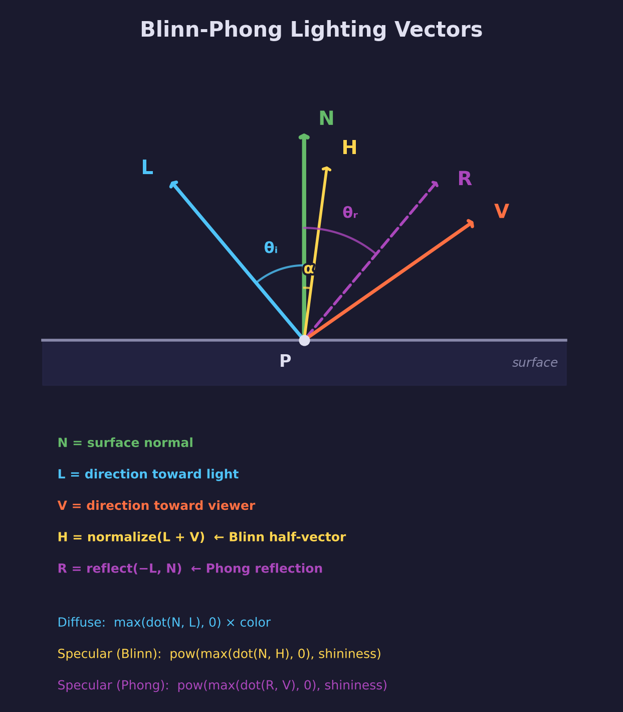
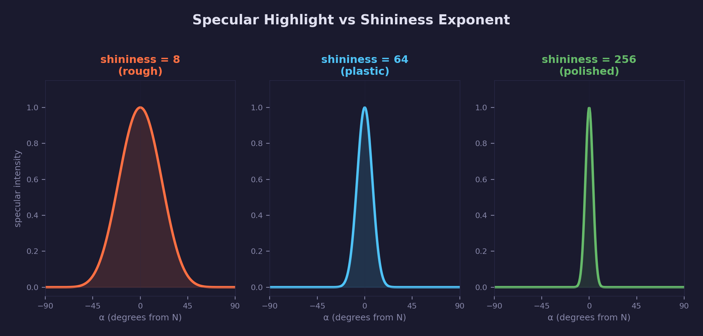
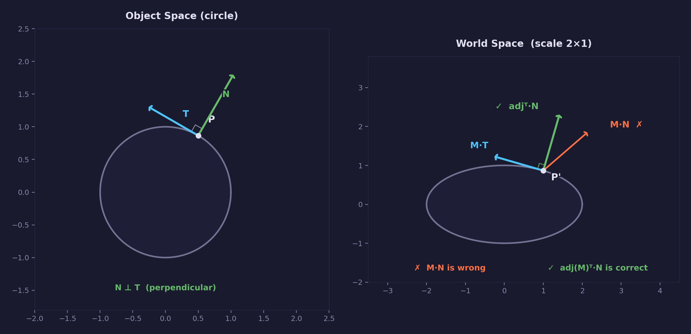

# Lesson 10 — Basic Lighting (Blinn-Phong)

## What you'll learn

- The **Blinn-Phong** lighting model — the most fundamental real-time shading technique
- The three components: **ambient**, **diffuse** (Lambert), and **specular** (Blinn)
- How to **transform normals** from object space to world space
- Why you must **normalize interpolated normals** in the fragment shader
- The **half-vector** insight and why Blinn replaced Phong in real-time graphics
- How to pass **lighting parameters** (light direction, camera position) as uniforms

## Result


Suzanne (the Blender monkey head) rendered with Blinn-Phong lighting. Notice:

- **Specular highlights** on the forehead and eye sockets (where the surface
  normal points toward the half-vector between light and camera)
- **Diffuse shading** that smoothly transitions from bright (facing the light)
  to dark (facing away)
- **Ambient light** preventing surfaces in shadow from being pure black

## The math of lighting

### The five vectors

Every lighting calculation comes down to five vectors at a point on a surface.
This diagram is the one you'll find in every graphics textbook — understand it
and the rest of this lesson follows naturally:



All five vectors are **unit length** (normalized) and originate from the
shading point **P** on the surface:

| Vector | Definition | Role |
|--------|-----------|------|
| **N** | Surface normal | Which direction the surface faces |
| **L** | Direction toward the light | Where light comes from |
| **V** | Direction toward the viewer | Where the camera is |
| $\mathbf{H}$ | $\hat{L} + \hat{V}$, normalized | Blinn's half-vector (bisects L and V) |
| $\mathbf{R}$ | $\text{reflect}(-L, N)$ | Phong's reflection vector (mirror of L about N) |

The dot product measures the **alignment** between two unit vectors
(see [Math Lesson 01 — Vectors](../../math/01-vectors/)). For unit vectors,
$\mathbf{A} \cdot \mathbf{B} = \cos \theta$ where $\theta$ is the angle
between them. Same direction: $\cos 0° = 1$. Perpendicular: $\cos 90° = 0$.
Opposing: $\cos 180° = -1$. This is exactly what we need — "how much does
this surface face the light?" is a dot product.

### The Blinn-Phong equation

The final color at each pixel is the sum of three independent terms:

$$
C_{\text{final}} = C_{\text{ambient}} + C_{\text{diffuse}} + C_{\text{specular}}
$$

Each term models a different aspect of how light interacts with a surface.

### 1. Ambient

$$
C_{\text{ambient}} = k_a \cdot C_{\text{surface}}
$$

where $k_a$ is the ambient intensity (we use 0.15 — a dim fill light).

A flat, constant brightness applied everywhere. This fakes **global
illumination** — the effect of light bouncing off every object in the
scene. Without ambient, any surface facing away from the light would be
pure black, which looks wrong because in reality light reaches everywhere
through indirect bounces. Ambient is a crude hack, but it's cheap and
effective enough that it's been used since the 1970s.

In our shader:

```hlsl
float3 ambient_term = ambient * surface_color.rgb;
```

### 2. Diffuse — Lambert's cosine law

$$
C_{\text{diffuse}} = \max(\mathbf{N} \cdot \mathbf{L}, 0) \cdot C_{\text{surface}}
$$

This is the core of shading and the oldest lighting model in computer
graphics. Johann Lambert described this law in 1760: the brightness of a
surface is proportional to the **cosine of the angle** between the surface
normal and the light direction.

The dot product of two unit vectors gives exactly this cosine:

- $\theta = 0°$ (surface faces the light directly): $\cos 0° = 1.0$ — full brightness
- $\theta = 60°$ (angled away): $\cos 60° = 0.5$ — half brightness
- $\theta = 90°$ (edge-on): $\cos 90° = 0.0$ — no light received
- $\theta > 90°$ (facing away): $\cos \theta < 0$ — we clamp to 0 with $\max(\ldots, 0)$

The `max` clamp is essential — without it, surfaces facing away from the
light would subtract light (negative contribution), which makes no physical
sense. This is called **clamped Lambert** or **half-Lambert** in some engines.

Why does this work physically? Imagine a beam of light hitting a surface.
When the surface is perpendicular to the beam, all the light energy lands on
a small area — bright. When the surface is tilted, the same beam spreads over
a larger area — dimmer. The cosine captures this spreading exactly.

In our shader:

```hlsl
float NdotL = max(dot(N, L), 0.0);
float3 diffuse_term = NdotL * surface_color.rgb;
```

### 3. Specular — the Blinn half-vector

$$
\mathbf{H} = \frac{\mathbf{L} + \mathbf{V}}{|\mathbf{L} + \mathbf{V}|}
$$

$$
C_{\text{specular}} = k_s \cdot \max(\mathbf{N} \cdot \mathbf{H}, 0)^{\text{shininess}}
$$

Where $k_s$ is the specular intensity (we use 0.5).

This produces the shiny highlights you see on glossy objects. The key
insight is the **half-vector** `H` — the direction exactly halfway between
the light direction `L` and the view direction `V`. When the surface normal
`N` aligns with `H`, light bounces off the surface directly into the camera,
creating a bright spot.

The `pow(...)` with `shininess` controls how tight the highlight is:



| Shininess | Appearance | Real-world analogy |
|-----------|------------|-------------------|
| 8–16 | Broad, soft highlight | Rough wood, matte paint |
| 32–64 | Medium highlight | Plastic, painted metal |
| 128–256 | Tight, sharp highlight | Polished metal, wet surface |

The `pow` function acts as a **sharpness filter** on the cosine. As the
exponent increases, only angles very close to zero (perfect alignment)
survive — everything else drops to near-zero. This is why high shininess
gives a small, intense highlight while low shininess gives a wide, dim one.

In our shader:

```hlsl
float3 H = normalize(L + V);
float NdotH = max(dot(N, H), 0.0);
float3 specular_term = specular_str * pow(NdotH, shininess) * float3(1, 1, 1);
```

Note the specular highlight is white (`float3(1,1,1)`) regardless of surface
color — specular reflections on dielectric (non-metal) surfaces are the color
of the light, not the surface. This is a simplification; metals reflect light
with their own color. PBR models (discussed below) handle this distinction.

### Blinn vs Phong — why the half-vector?

The original Phong model (Bui Tuong Phong, 1975) computed specular differently:

$$
\mathbf{R} = \text{reflect}(-\mathbf{L}, \mathbf{N}) \qquad \text{(mirror L about N)}
$$

$$
C_{\text{specular}}^{\text{Phong}} = \max(\mathbf{R} \cdot \mathbf{V}, 0)^{\text{shininess}}
$$

Blinn's modification (James Blinn, 1977) replaced this with:

$$
\mathbf{H} = \frac{\mathbf{L} + \mathbf{V}}{|\mathbf{L} + \mathbf{V}|} \qquad \text{(halfway between L and V)}
$$

$$
C_{\text{specular}}^{\text{Blinn}} = \max(\mathbf{N} \cdot \mathbf{H}, 0)^{\text{shininess}}
$$

Why did Blinn's version become the industry standard?

1. **Cheaper** — Computing `normalize(L + V)` is one addition and one
   normalize. Computing `reflect(-L, N)` requires a dot product, scale,
   and subtraction. For directional lights, H is constant across all pixels
   (both L and V's direction are fixed), so it can be computed once on the CPU.

2. **Better at grazing angles** — Phong's `dot(R, V)` can produce artifacts
   at steep viewing angles where the reflection vector R passes behind the
   surface. Blinn's formulation handles these cases more smoothly.

3. **Closer to reality** — The half-vector formulation is actually a better
   approximation of the **microfacet BRDF** that describes real surface
   reflection. The half-vector `H` corresponds to the orientation of the
   micro-facets that reflect light from `L` toward `V`.

4. **Industry default** — OpenGL's fixed-function pipeline (used from 1992
   until ~2008) implemented Blinn-Phong, not original Phong. It became the
   de facto standard for real-time rendering.

### Gouraud vs Phong shading — per-vertex vs per-pixel

There are two ways to evaluate a lighting equation across a triangle:

**Gouraud shading** (Henri Gouraud, 1971) computes the lighting equation
at each **vertex** and then interpolates the resulting *colors* across the
triangle. This was the standard approach in the fixed-function pipeline era
because it's cheap — lighting runs once per vertex, not once per pixel.

**Phong shading** (not to be confused with the Phong *lighting model*)
interpolates the **normals** across the triangle and evaluates the lighting
equation at each **pixel**. This is what we implement in this lesson — the
vertex shader outputs world-space normals, the rasterizer interpolates them,
and the fragment shader computes lighting per-pixel.

The difference is most visible in specular highlights. With Gouraud shading,
a specular highlight can only appear *at* a vertex — if the highlight falls
between vertices, it disappears entirely. On a low-poly mesh like Suzanne,
this produces visible artifacts. Per-pixel shading (what we do) evaluates
lighting at every pixel, so specular highlights are smooth and correctly
positioned regardless of mesh density.

Today, per-pixel shading is universal. GPUs are fast enough that the cost
difference is negligible, and the visual quality improvement is dramatic.
But Gouraud shading is worth knowing about — you'll encounter it in older
engines, retro-style renderers, and any context where understanding the
history of real-time graphics matters.

### Normal transformation — the adjugate transpose

Normals live in **object space** (attached to the mesh). To do lighting in
world space (where the light direction and camera position are defined), we
need to transform them. But normals **don't transform the same way as
positions** — and getting this wrong is a subtle, common bug.

#### Why normals are special

A position transforms by the model matrix: $\mathbf{p}_{\text{world}} = M \cdot \mathbf{p}_{\text{object}}$.
A tangent vector (a direction along the surface) also transforms by $M$.
But a **normal** must remain **perpendicular to the surface** after
transformation, and multiplying by $M$ doesn't guarantee this.



Consider a circle with a normal pointing straight up. If we scale by
$(2, 1)$ — stretching horizontally — the circle becomes an ellipse. The
tangent at the top tilts, so the normal must tilt too to stay perpendicular.
But if we apply the same scale matrix to the normal, it stretches
horizontally and stays pointing straight up — which is **wrong**. The
transformed normal is no longer perpendicular to the surface.

For **rigid transforms** (rotation only, or rotation + uniform scale),
the model matrix preserves angles, so `(float3x3)model` works fine. The
problem only appears with **non-uniform scale** or shear. But we should
use the correct transform anyway — it costs almost nothing extra and means
the code works for any model matrix, not just well-behaved ones.

#### The correct matrix: adjugate transpose

Many textbooks teach the **inverse-transpose** $(M^{-1})^T$ for normal
transformation. This works, but it has a problem: the matrix must be
invertible (non-singular). If your model matrix has a zero scale on any
axis — which happens with 2D projections, degenerate animations, or
artist mistakes — the inverse doesn't exist and you get garbage.

The real answer is the **adjugate transpose**. The adjugate of $M$ is
defined as the transpose of the cofactor matrix:

$$
\text{adj}(M) = \text{cof}(M)^T
$$

For invertible matrices, the adjugate relates to the inverse by:

$$
M^{-1} = \frac{\text{adj}(M)}{\det(M)}
$$

So the inverse-transpose is:

$$
(M^{-1})^T = \frac{\text{adj}(M)^T}{\det(M)}
$$

Since we **normalize the result** in the fragment shader anyway, the scalar
$\frac{1}{\det(M)}$ cancels out. That means we can use $\text{adj}(M)^T$
directly — no division, no determinant check, no singularity problem:

$$
\mathbf{N}_{\text{world}} = \text{adj}(M_{3 \times 3})^T \cdot \mathbf{N}_{\text{object}}
$$

This is the **adjugate transpose** — it gives the correct normal direction
for *any* model matrix, invertible or not.

#### The cross-product method

The adjugate transpose of a $3 \times 3$ matrix equals its **cofactor
matrix**, and the cofactor matrix has an elegant formulation using cross
products. If $\mathbf{r}_0, \mathbf{r}_1, \mathbf{r}_2$ are the rows of
$M_{3 \times 3}$:

$$
\text{adj}(M)^T = \begin{bmatrix} \mathbf{r}_1 \times \mathbf{r}_2 \\ \mathbf{r}_2 \times \mathbf{r}_0 \\ \mathbf{r}_0 \times \mathbf{r}_1 \end{bmatrix}
$$

Each row of the result is a cross product of two rows of the model matrix.
The cross product of two rows gives a vector perpendicular to the plane
they span — which is exactly what we need for correct normal transformation.

In our vertex shader, this becomes three cross products:

```hlsl
float3x3 m = (float3x3)model;
float3x3 adj_t;
adj_t[0] = cross(m[1], m[2]);
adj_t[1] = cross(m[2], m[0]);
adj_t[2] = cross(m[0], m[1]);
output.world_norm = mul(adj_t, input.normal);
```

This is cheap (three cross products), correct for all matrices, and avoids
the pitfalls of the inverse-transpose. The fragment shader still normalizes
per-pixel after interpolation — the adjugate transpose gives the right
*direction*, and normalize gives unit length.

#### Why not just use the inverse-transpose?

| | Adjugate transpose | Inverse-transpose |
|---|---|---|
| **Singular matrices** | Works correctly | Undefined (division by zero) |
| **Cost** | 3 cross products | Full matrix inverse + transpose |
| **Determinant** | Not needed (normalize cancels it) | Must be non-zero |
| **Result direction** | Always correct | Correct when it exists |

The adjugate transpose is strictly better — same result for invertible
matrices, correct behavior for singular ones, and cheaper to compute.
Textbooks teach the inverse-transpose because it follows naturally from the
perpendicularity proof, but the adjugate transpose is what you should
actually use.

(For the full mathematical background, see
[Math Lesson 05 — Matrices](../../math/05-matrices/) for matrix operations
and [Math Lesson 02 — Coordinate Spaces](../../math/02-coordinate-spaces/)
for the object-to-world transform pipeline.)

### Normalize after interpolation

The rasterizer linearly interpolates vertex shader outputs across each
triangle. Even if every vertex normal is unit length, the interpolated
result is **not** unit length.

Imagine two normals at 45° from vertical. Their midpoint (the linear
interpolation at $t = 0.5$) points straight up — correct direction, but its
length is $\cos 45° \approx 0.71$, not 1.0. The dot products in our lighting
equations assume unit vectors; a shorter-than-1 normal would make `dot(N, L)`
too small, dimming the surface incorrectly.

The fragment shader **must** re-normalize per-pixel:

```hlsl
float3 N = normalize(input.world_norm);
```

Forgetting this is the **single most common lighting bug**. The model will
look subtly wrong — slightly too dark on curved surfaces — and the error is
hard to spot because the normals are *almost* unit length. On a curved
surface like Suzanne, the difference is clearly visible once you know to
look for it.

### World-space lighting

We chose **world space** for all lighting calculations because it's the
simplest to understand:

- The **model matrix** transforms vertices and normals from object to world space
- The **light direction** is defined in world space (constant for directional lights)
- The **camera position** is in world space (changes every frame as you move)
- The fragment shader computes `V = normalize(eye_pos - world_pos)` per-pixel

An alternative is **view-space lighting**, where the camera is always at the
origin. View space avoids passing `eye_pos` to the shader (it's always `(0,0,0)`),
but requires transforming the light direction into view space each frame.
World space is more intuitive for learning, which is why we use it here.

### Uniform layout — why float4 for vec3?

You might wonder why we pass `light_dir` and `eye_pos` as `float4` in the
cbuffer instead of `float3`:

```hlsl
float4 light_dir;     /* xyz = direction, w = unused */
float4 eye_pos;       /* xyz = position, w = unused  */
```

HLSL cbuffer packing rules align `float3` to a 16-byte boundary and pad it
with 4 bytes anyway. If you write `float3` followed by `float` in a cbuffer,
the `float` packs into the padding of the `float3` — which doesn't match
the C struct layout. Using `float4` explicitly makes the layout match on
both sides and avoids subtle alignment bugs.

(The alternative is `packoffset` annotations, but explicit `float4` is
simpler and less error-prone.)

## Beyond Blinn-Phong — what comes next

Blinn-Phong is a great starting point, but modern rendering has moved
beyond it. Here's where the field has gone:

### BRDFs — the general framework

Blinn-Phong is an example of a **BRDF** (Bidirectional Reflectance
Distribution Function) — a function that describes how light reflects off
a surface given an incoming direction (L) and outgoing direction (V). Any
lighting model can be expressed as a BRDF:

$$
f(\mathbf{L}, \mathbf{V}) = \text{how much light from direction } \mathbf{L} \text{ reflects toward direction } \mathbf{V}
$$

Blinn-Phong's BRDF is the sum of a constant (ambient), a cosine (diffuse),
and a cosine-power lobe (specular). It's simple and fast, but it violates
**energy conservation** — the surface can reflect more light than it receives,
especially at high ambient + specular values. It also can't distinguish
metals from plastics, or rough surfaces from smooth ones beyond the single
shininess parameter.

### PBR — Physically Based Rendering

Modern engines (Unreal, Unity, Godot) use **PBR** (Physically Based
Rendering) models that replace Blinn-Phong's ad hoc terms with physically
motivated ones:

- **Microfacet theory** — models the surface as a collection of tiny
  mirrors. The half-vector `H` from Blinn is actually the microfacet
  normal — this is why Blinn's approximation worked so well
- **Energy conservation** — specular + diffuse never exceed the incoming
  light
- **Fresnel effect** — surfaces reflect more at grazing angles (think of
  how a lake is a mirror at shallow angles but transparent looking straight
  down)
- **Roughness/metallic** — replaces the single "shininess" with physically
  meaningful parameters. glTF's `metallicRoughness` model uses exactly these

The standard PBR BRDF in real-time graphics is **Cook-Torrance**:

$$
f(\mathbf{L}, \mathbf{V}) = \frac{D(\mathbf{H}) \cdot F(\mathbf{V}, \mathbf{H}) \cdot G(\mathbf{L}, \mathbf{V}, \mathbf{H})}{4 \, (\mathbf{N} \cdot \mathbf{L}) \, (\mathbf{N} \cdot \mathbf{V})}
$$

Where $D$ is the microfacet distribution (like a better
$\max(\mathbf{N} \cdot \mathbf{H}, 0)^{\text{shininess}}$), $F$ is the
Fresnel term, and $G$ is the geometry/shadowing term. This looks
complex, but each piece has clear physical meaning — and the Blinn half-vector
you learned in this lesson is at the heart of it.

Understanding Blinn-Phong first makes PBR much easier to learn. The
concepts — dot products, half-vectors, surface normals, energy from light —
are all the same; PBR just does them more carefully.

## Math references

This lesson uses concepts from several math lessons:

- [Math Lesson 01 — Vectors](../../math/01-vectors/): dot product,
  normalization, the cosine interpretation of dot
- [Math Lesson 02 — Coordinate Spaces](../../math/02-coordinate-spaces/):
  object space, world space, view space, the transform pipeline
- [Math Lesson 05 — Matrices](../../math/05-matrices/): model matrix,
  matrix-vector multiplication, 3x3 extraction for direction transforms

## Exercises

Try these modifications to deepen your understanding:

1. **Change the light direction** — Edit `LIGHT_DIR_X/Y/Z` to move the light.
   Try `(-1, 1, 0)` for side lighting, or `(0, -1, 0)` for bottom lighting.
   How does the specular highlight move?

2. **Vary shininess** — Change `SHININESS` from 8 to 256 and observe how the
   specular highlight changes. Low values give a broad, matte look; high
   values give a tight, glossy highlight. Compare with the graph above.

3. **Implement original Phong** — Replace the Blinn half-vector with the
   original Phong reflection:

   ```hlsl
   float3 R = reflect(-L, N);
   float spec = pow(max(dot(R, V), 0), shininess);
   ```

   Compare the result — the highlights are slightly different at grazing angles.

4. **Add a point light** — Instead of a directional light (constant direction),
   compute `L = normalize(light_position - world_pos)` per-pixel. Add
   attenuation: `1.0 / (1.0 + distance * distance)`.

5. **Colored light** — Add a `light_color` uniform and multiply it into the
   diffuse and specular terms. Try warm orange `(1.0, 0.8, 0.6)` or cool
   blue `(0.6, 0.8, 1.0)`.

6. **Try Gouraud shading** — Move the entire lighting calculation to the
   vertex shader. Compute the final color per-vertex and interpolate colors
   instead of normals. Notice how specular highlights disappear between
   vertices on Suzanne's low-poly surface.

## Controls

| Key | Action |
|-----|--------|
| WASD / Arrow keys | Move forward/back/left/right |
| Space / Left Shift | Fly up / down |
| Mouse | Look around |
| Escape | Release mouse / quit |

## AI skill

This lesson's patterns are distilled into a reusable Claude Code skill:
[`.claude/skills/basic-lighting/SKILL.md`](../../../.claude/skills/basic-lighting/SKILL.md)

Use `/basic-lighting` in Claude Code to apply Blinn-Phong lighting to any
SDL3 GPU project — the skill includes uniform layouts, shader templates,
and common mistakes to avoid. You can copy the skill file into your own
project's `.claude/skills/` directory.

## Building

```bash
cmake --build build --config Debug --target 10-basic-lighting
```

To recompile shaders after modifying the HLSL:

```bash
python scripts/compile_shaders.py 10
```

To regenerate the diagrams:

```bash
python scripts/forge_diagrams.py --lesson gpu/10
```
