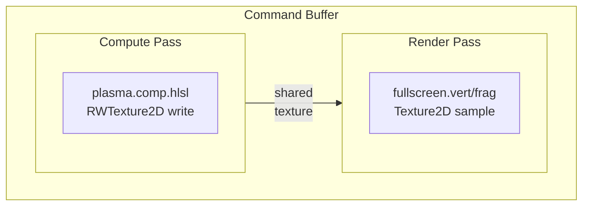
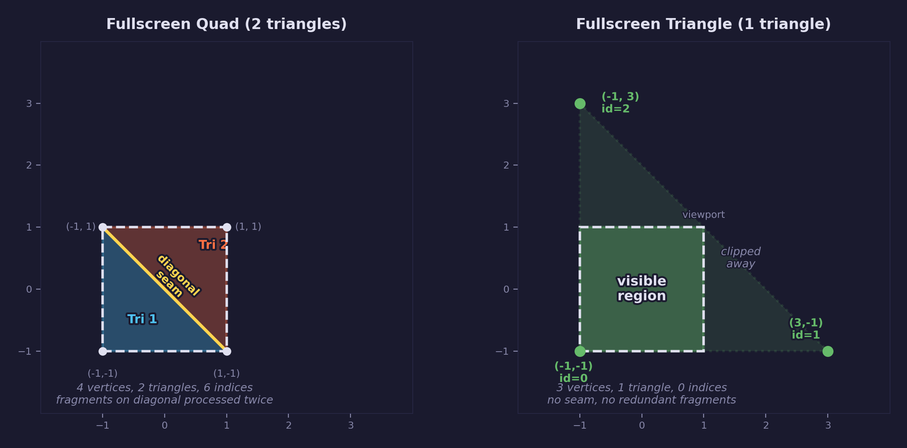

# Lesson 11 — Compute Shaders

## What you'll learn

- What compute shaders are and how they differ from graphics shaders
- How to create and dispatch a compute pipeline with SDL3 GPU
- Storage textures (`RWTexture2D`) for random-access write from compute
- Thread groups, dispatch dimensions, and `SV_DispatchThreadID`
- The **compute-then-render** pattern: compute writes, render samples
- The fullscreen triangle technique (no vertex buffer needed)
- Register layout differences between compute and graphics shaders

## Result


An animated procedural plasma texture generated entirely on the GPU using a
compute shader. The colors use the forge diagram palette (cyan, orange, green,
purple) on a dark background.

## Key concepts

### What is a compute shader?

Every shader we have written so far — vertex and fragment — runs as part of the
**graphics pipeline**. The GPU feeds vertices in, the vertex shader transforms
them, the rasterizer fills triangles, and the fragment shader colors each pixel.
The programmer does not choose which vertex or pixel to process; the pipeline
decides.

A **compute shader** breaks free of that pipeline. It is a general-purpose GPU
program: you define a grid of threads, dispatch them, and each thread can read
and write arbitrary data. There is no rasterizer, no vertices, no triangles —
just parallel computation.

Common uses for compute shaders:

- **Image processing** — blur, tone mapping, histogram, post-processing
- **Particle simulation** — update thousands of particles every frame
- **Physics** — collision detection, cloth simulation, fluid dynamics
- **Procedural generation** — noise, terrain, textures (like our plasma)
- **Culling and sorting** — GPU-driven rendering, visibility tests

### Thread groups and dispatch

A compute shader declares a **workgroup size** (also called thread group size):

```hlsl
[numthreads(8, 8, 1)]
void main(uint3 id : SV_DispatchThreadID)
```

This means each workgroup is an 8×8×1 block of 64 threads. When you dispatch
the compute shader, you specify how many workgroups to launch:

```c
Uint32 groups_x = (width  + 7) / 8;   /* ceiling division */
Uint32 groups_y = (height + 7) / 8;
SDL_DispatchGPUCompute(compute_pass, groups_x, groups_y, 1);
```

The total number of threads is `groups × numthreads`. For a 512×512 texture
with 8×8 workgroups, that is 64×64 groups = 4096 groups × 64 threads = 262,144
threads — one per pixel.

`SV_DispatchThreadID` gives each thread its global (x, y, z) position in the
full dispatch grid. The shader uses this to know which pixel to write.

Because the dispatch dimensions must be integers, the total thread count may
overshoot the texture size. The shader includes a bounds check:

```hlsl
if (id.x >= (uint)width || id.y >= (uint)height)
    return;
```

### Storage textures

In previous lessons, textures were always **sampled** — the fragment shader
read them through a sampler with filtering. Compute shaders can instead use
**storage textures** (`RWTexture2D<float4>`), which allow random-access writes
to any pixel:

```hlsl
RWTexture2D<float4> output_tex : register(u0, space1);
// ...
output_tex[id.xy] = float4(color, 1.0);
```

The texture needs the `COMPUTE_STORAGE_WRITE` usage flag, and it is bound to
the compute pass (not the render pass):

```c
/* Create with both COMPUTE_STORAGE_WRITE and SAMPLER usage */
tex_info.usage = SDL_GPU_TEXTUREUSAGE_COMPUTE_STORAGE_WRITE |
                 SDL_GPU_TEXTUREUSAGE_SAMPLER;

/* Bind as RW storage in the compute pass */
SDL_GPUStorageTextureReadWriteBinding binding;
binding.texture = plasma_texture;
binding.cycle   = true;    /* enable frame pipelining */
```

### The compute-then-render pattern

This lesson uses a two-pass approach on each frame:

1. **Compute pass** — the compute shader writes the plasma animation into
   a storage texture
2. **Render pass** — a graphics pipeline samples that texture and draws it
   fullscreen

Both passes happen on the same command buffer. SDL3 automatically synchronizes
between them — the compute pass finishes writing before the render pass starts
reading. No manual barriers or fences needed.



### Compute pipeline creation

Creating a compute pipeline in SDL3 is simpler than a graphics pipeline — there
is no vertex input, rasterizer, or depth state. The shader code is embedded
directly in the create info (no separate shader object step):

```c
SDL_GPUComputePipelineCreateInfo info;
SDL_zero(info);
info.entrypoint                     = "main";
info.code                           = spirv_code;
info.code_size                      = spirv_size;
info.format                         = SDL_GPU_SHADERFORMAT_SPIRV;
info.num_readwrite_storage_textures = 1;  /* our RWTexture2D */
info.num_uniform_buffers            = 1;  /* time + resolution */
info.threadcount_x                  = 8;  /* must match HLSL */
info.threadcount_y                  = 8;
info.threadcount_z                  = 1;

SDL_GPUComputePipeline *pipeline =
    SDL_CreateGPUComputePipeline(device, &info);
```

The `threadcount` values must match `[numthreads()]` in the HLSL exactly, or
the behaviour is undefined.

### Register layout for compute shaders

Compute shaders use a different register layout than vertex and fragment
shaders. For DXIL/DXBC (from `SDL_gpu.h`):

| Resource | Register | Space |
|----------|----------|-------|
| Sampled textures, then read-only storage textures/buffers | `t[n]` | `space0` |
| Read-write storage textures, then read-write storage buffers | `u[n]` | `space1` |
| Uniform buffers | `b[n]` | `space2` |

Compare with fragment shaders where sampled textures use `space2` and uniforms
use `space3`. The compute layout is its own convention.

### Fullscreen triangle

To display the compute result, we need to draw something that covers every pixel
on screen. The obvious approach is a **fullscreen quad** — two triangles forming
a rectangle. But there is a better method: a single **oversized triangle** that
the rasterizer clips to the viewport.



**Why a single triangle is better than a quad:**

- **No diagonal seam.** A quad is two triangles joined along a diagonal. At that
  seam the rasterizer must process edge pixels for *both* triangles, doing
  redundant work. A single triangle has no interior edges — every pixel is
  rasterized exactly once.
- **Fewer vertices.** 3 vertices instead of 4 (or 6 without an index buffer).
  No vertex buffer is needed at all — the positions come from `SV_VertexID`.
- **One draw call.** The GPU sets up one triangle instead of two, reducing
  fixed-function overhead.

The vertex shader generates three vertices that extend beyond the clip-space
bounds [-1, 1]:

```hlsl
float2 pos;
pos.x = (float)((id & 1u) << 1) - 1.0;
pos.y = (float)((id & 2u))       - 1.0;
output.position = float4(pos.x * 2.0 + 1.0,   /* -1, 3, -1 */
                          pos.y * 2.0 + 1.0,   /* -1, -1, 3 */
                          0.0, 1.0);
```

This produces vertices at (-1, -1), (3, -1), and (-1, 3). The triangle covers
the entire viewport and extends well beyond it. The rasterizer clips it to the
screen bounds automatically — the fragment shader only runs for visible pixels.

On the C side, the graphics pipeline needs zero vertex attributes:

```c
gfx_info.vertex_input_state.num_vertex_buffers    = 0;
gfx_info.vertex_input_state.num_vertex_attributes = 0;
```

And the draw call just asks for 3 vertices:

```c
SDL_DrawGPUPrimitives(render_pass, 3, 1, 0, 0);
```

## Shaders

| File | Purpose |
|------|---------|
| `plasma.comp.hlsl` | Compute shader generating an animated procedural plasma texture by summing sine waves with a palette lookup |
| `fullscreen.vert.hlsl` | Generates a fullscreen triangle from `SV_VertexID` with no vertex buffer |
| `fullscreen.frag.hlsl` | Samples the compute-generated plasma texture and outputs it to the screen |

## Building

```bash
cmake -B build
cmake --build build --config Debug --target 11-compute-shaders
```

Run the lesson:

```bash
python scripts/run.py 11
```

## AI skill

This lesson has a corresponding Claude Code skill:
[compute-shaders](../../../.claude/skills/compute-shaders/SKILL.md)

Use `/compute-shaders` to set up a compute pipeline in your own project.

## Exercises

1. **Modify the plasma formula** — Change the sine wave frequencies, add more
   waves, or replace the sum-of-sines with a different function (Perlin noise,
   Voronoi cells). How does each change affect the visual result?

2. **Change the palette** — Replace the four colors with your own. Try a
   monochrome gradient (black → white), a fire palette (black → red → yellow →
   white), or sample from a 1D gradient texture instead of computing in the
   shader.

3. **Dynamic resize** — Currently the plasma texture is a fixed 512×512.
   Recreate the texture when the window resizes so the plasma always matches
   the window resolution. You will need to release the old texture and create
   a new one with updated dimensions, and update the dispatch group count.

4. **Mandelbrot set** — Replace the plasma with a Mandelbrot set renderer.
   The compute shader iterates `z = z² + c` for each pixel, and the iteration
   count maps to a color via the palette. Add uniforms for zoom and centre
   position, and animate a zoom sequence.

5. **Multi-pass compute (blur)** — Add a second compute pass that reads the
   plasma texture and writes a blurred version to a second texture. Display
   the blurred result. This requires a second storage texture and demonstrates
   multi-pass compute with read-only storage (`Texture2D` in the second pass)
   or ping-pong between two RW textures.
