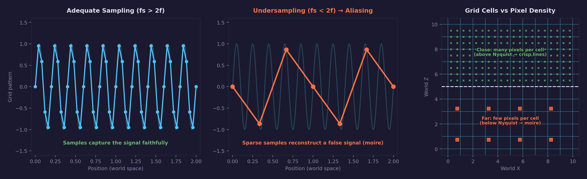

# Lesson 12 — Shader Grid

## What you'll learn

- How to render a procedural grid entirely in a fragment shader (no texture)
- Screen-space derivatives (`fwidth`) and `smoothstep` for anti-aliased lines
- Distance fade to prevent moiré artifacts at the horizon
- Using **two graphics pipelines** in a single render pass
- Combining procedural geometry (grid) with 3D models (CesiumMilkTruck)
- Simplified Blinn-Phong lighting on a flat surface (constant normal)

## Result


A cyan procedural grid stretches across the ground plane. The CesiumMilkTruck
sits on the grid with Blinn-Phong lighting. Grid lines are anti-aliased and
fade smoothly at distance.

## Key concepts

### Procedural rendering

Every lesson so far has used textures for visual detail — loaded from files
(Lessons 04, 08, 09, 10) or generated on the GPU (Lesson 11). This lesson
takes a different approach: the grid pattern is computed **entirely in the
fragment shader** from the world-space position. No texture is sampled, no
image is loaded. The shader computes, for every pixel, whether it sits on a
grid line or between them.

This is **procedural rendering** — generating visual detail from math instead
of stored data. Procedural patterns are resolution-independent (they look
sharp at any zoom level) and take zero texture memory.

### The grid algorithm step by step

The core of the shader is five lines that transform a world-space position
into an anti-aliased grid pattern:

```hlsl
float2 grid_uv = world_pos.xz / grid_spacing;          /* Step 1 */
float2 dist    = abs(frac(grid_uv - 0.5) - 0.5);       /* Step 2 */
float2 fw      = fwidth(grid_uv);                       /* Step 3 */
float2 aa_line = 1.0 - smoothstep(line_width,
                                   line_width + fw,
                                   dist);               /* Step 4 */
float  grid    = max(aa_line.x, aa_line.y);             /* Step 5 */
```

**Step 1 — Scale to grid space.** Dividing world XZ coordinates by the grid
spacing maps the coordinate system so that integer values fall exactly on grid
lines. With `grid_spacing = 1.0`, the grid lines are at X = 0, 1, 2, etc.

**Step 2 — Distance to nearest grid line.** `frac(v - 0.5) - 0.5` maps each
grid cell to the range [-0.5, 0.5], centered on the grid line. `abs()` gives
the distance from the nearest line: 0 means "on a line", 0.5 means "midway
between lines".

**Step 3 — Screen-space derivative.** `fwidth(grid_uv)` returns the approximate
size of one pixel in grid-space units. This is the same derivative hardware the
GPU uses for mip level selection (Lesson 05 — `ddx`/`ddy`). When the camera is
far away and grid cells are sub-pixel, `fw` is large; when the camera is close,
`fw` is small.

**Step 4 — Anti-aliased edge.** `smoothstep` creates a smooth transition from
1.0 (on the line) to 0.0 (off the line). The transition width is exactly `fw` —
one pixel — so the edge is always smooth regardless of distance. Without this,
you would see hard aliased stair-step edges.

**Step 5 — Combine axes.** `max()` combines the X-aligned and Z-aligned lines.
If the pixel is on either line, it gets the line color.

### Screen-space derivatives and anti-aliasing

The key insight is `fwidth()`. Lesson 05 explained how the GPU computes
fragment derivatives (`ddx`, `ddy`) using 2x2 quads of fragments. These
derivatives tell the GPU how a value changes across neighboring pixels. For
mipmaps, this determines which mip level to sample. For procedural patterns,
it determines how wide to make the anti-aliasing transition.

`fwidth(v) = abs(ddx(v)) + abs(ddy(v))` — the total rate of change of `v`
across the pixel. When a grid line covers many pixels (close up), `fwidth` is
small relative to the grid spacing, so the anti-aliased band is narrow and the
line looks crisp. When the grid is far away and many lines crowd into a few
pixels, `fwidth` is large, and the anti-aliased transition covers most of the
line — effectively blurring it into the background. This is precisely what
prevents moiré patterns.

### Why grids alias: the Nyquist-Shannon sampling theorem

Moire patterns on a grid are not a rendering bug — they are a fundamental
consequence of **sampling theory**. The grid is a periodic signal with a fixed
spatial frequency (one cycle per `grid_spacing` world units). The screen is a
discrete grid of pixels, each one a sample of the scene. The relationship
between these two frequencies determines whether the grid looks correct.

The **Nyquist-Shannon sampling theorem** states:

> To faithfully reconstruct a signal of frequency *f*, you must sample at a
> rate of at least **2*f*** (the **Nyquist rate**). Below this rate, the signal
> aliases — it appears as a different, lower-frequency signal that was never
> in the original data.

For a procedural grid, the "signal frequency" is the number of grid lines
per world unit, and the "sampling rate" is the number of pixels covering that
same world unit. When the camera is close, each grid cell spans many pixels —
the sampling rate is well above Nyquist, and the lines resolve cleanly. As the
camera moves away, grid cells shrink until multiple lines fall within a single
pixel. The sampling rate drops below Nyquist, and the grid aliases into moiré.



The left panel shows a periodic signal (like grid lines) sampled at a rate
above Nyquist — the samples faithfully capture the pattern. The centre panel
shows the same signal sampled too sparsely: the reconstructed signal is a
completely different wave. This is aliasing — the undersampled signal
masquerades as a lower frequency. The right panel maps this to the grid:
close pixels (top) resolve individual cells, while distant pixels (bottom) are
too sparse to distinguish lines from gaps.

**What `fwidth()` does in Nyquist terms:** it measures the pixel's footprint
in grid space — effectively computing the local sampling rate. When `fwidth`
exceeds `grid_spacing`, the pixel covers more than one full grid cycle: the
signal frequency exceeds the Nyquist limit and aliasing is inevitable.
`smoothstep` uses this measurement to blend the line into the background
before aliasing occurs, and the distance fade ensures even the residual
high-frequency content is suppressed at the horizon.

This is the same principle behind mipmaps (Lesson 05 / Math Lesson 04): the
GPU selects a lower-resolution mip level when a texture's frequency exceeds
the pixel sampling rate. Procedural patterns cannot use mipmaps (there is no
texture to downsample), so `fwidth` + `smoothstep` serves the same purpose
analytically.

### Distance fade

Even with perfect per-pixel anti-aliasing, extremely distant grid cells can
still produce visual noise when the grid spacing approaches sub-pixel size.
The shader applies a distance fade using `smoothstep`:

```hlsl
float cam_dist = length(world_pos - eye_pos);
float fade = 1.0 - smoothstep(fade_distance * 0.5, fade_distance, cam_dist);
grid *= fade;
```

The grid fades to the background color starting at half the fade distance,
reaching full transparency at the fade distance. This gives a clean horizon
instead of a noisy shimmer.

### Two pipelines in one render pass

This lesson uses two separate `SDL_GPUGraphicsPipeline` objects within a
**single render pass**:

1. **Grid pipeline** — position-only vertices, no texture sampler, `CULL_NONE`
2. **Model pipeline** — position/normal/UV vertices, texture sampler, `CULL_BACK`

Switching pipelines mid-pass is straightforward:

```c
SDL_BindGPUGraphicsPipeline(pass, grid_pipeline);
/* push grid uniforms, bind grid buffers, draw */

SDL_BindGPUGraphicsPipeline(pass, model_pipeline);
/* push model uniforms, bind model buffers, draw */
```

Both pipelines share the same color target (swapchain) and depth target. The
depth buffer ensures correct occlusion — the truck correctly appears in front
of the grid wherever they overlap.

Why two pipelines instead of one? The grid and the truck have fundamentally
different vertex formats, different shader resource requirements, and different
rasterizer states. A pipeline encodes all of this, so separate pipelines are
the clean way to handle it. This is a common pattern in real renderers:
terrain pipeline, model pipeline, skybox pipeline, particle pipeline — all
bound within the same render pass.

### Simplified Blinn-Phong on the grid

The grid surface is a flat plane at Y = 0. Its normal is always `(0, 1, 0)` —
straight up. This simplifies the Blinn-Phong calculation because:

- No normal transformation needed (no adjugate transpose)
- No per-vertex normal interpolation
- `dot(N, L)` reduces to `L.y`

The grid still gets ambient, diffuse, and specular lighting, giving it a subtle
3D appearance. The Blinn-Phong model is the same as Lesson 10, just applied to
a surface with a constant normal instead of per-vertex normals.

### Note on shadows

The truck does not cast a shadow on the grid. Shadow mapping (rendering the
scene from the light's perspective into a depth texture, then sampling that
texture during the main pass) is a separate technique that will be covered in
a future lesson.

## Math connections

- **Vectors** (Math Lesson 01) — dot product for Blinn-Phong lighting
- **Matrices** (Math Lesson 05) — view-projection matrix for camera
- **Mipmaps & LOD** (Math Lesson 04) — fragment derivatives (`ddx`/`ddy`)
  power both mip selection and procedural anti-aliasing

## Controls

| Key | Action |
|-----|--------|
| WASD / Arrow keys | Move forward/back/left/right |
| Space | Fly up |
| Left Shift | Fly down |
| Mouse | Look around |
| Click | Recapture mouse |
| Escape | Release mouse (press again to quit) |

## Shaders

| File | Purpose |
|------|---------|
| `grid.vert.hlsl` | Transforms a world-space grid quad to clip space and passes world position for procedural grid generation |
| `grid.frag.hlsl` | Generates an anti-aliased procedural grid using `fwidth()` and `smoothstep()` with distance fade |
| `lighting.vert.hlsl` | Transforms vertices to clip and world space for Blinn-Phong lighting |
| `lighting.frag.hlsl` | Blinn-Phong lighting with ambient, diffuse, and specular components |

## Building

```bash
cmake -B build
cmake --build build --config Debug --target 12-shader-grid
```

Run:

```bash
python scripts/run.py 12
```

## AI skill

This lesson distills into the [`/shader-grid`](../../../.claude/skills/shader-grid/SKILL.md)
skill. Use it when you need a procedural ground grid, debug visualization
plane, or anti-aliased procedural patterns in your SDL3 GPU project.

## Exercises

1. **Change grid spacing and line width.** Try `GRID_SPACING = 2.0` and
   `GRID_LINE_WIDTH = 0.05`. How does the visual density change? What happens
   to the anti-aliasing at different distances?

2. **Add major and minor grid lines.** Compute a second grid at 10x spacing
   with thicker lines. Combine both grids with `max()`. This is how most 3D
   editors display their ground grids.

3. **Radial grid.** Replace the Cartesian grid with concentric circles and
   radial lines. Use `length(world_pos.xz)` for distance and `atan2()` for
   angle. Apply the same `fwidth`/`smoothstep` anti-aliasing.

4. **Animated grid color.** Pass time as a uniform and modulate the line color
   with a sine wave. Try a color gradient based on distance from the origin.

5. **Grid-only project.** Remove the truck pipeline entirely and experiment
   with the grid as a standalone procedural surface. Add height displacement
   using `sin(world_pos.x) * cos(world_pos.z)` in the vertex shader.
