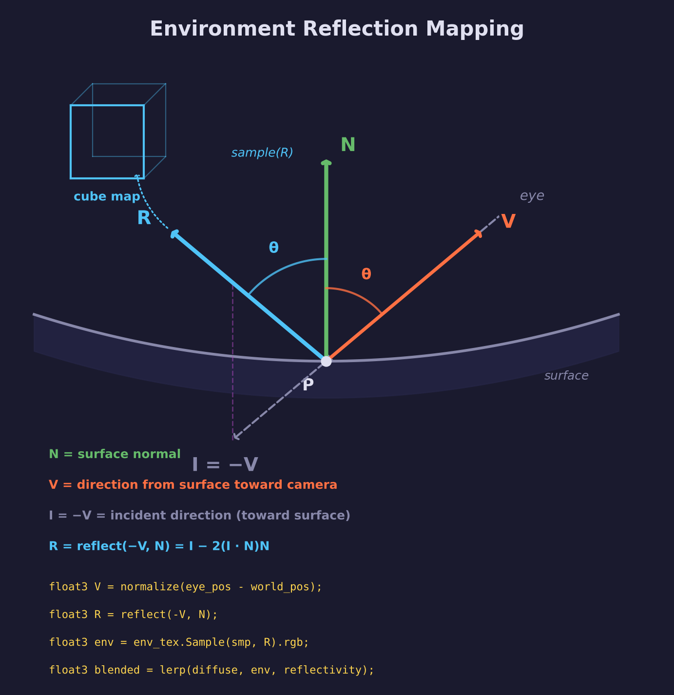

# Lesson 14 — Environment Mapping

## What you'll learn

- **Cube map textures** — six faces forming a seamless 360-degree environment
- **Skybox rendering** — a background that surrounds the camera using the `z=w` depth technique
- **Environment reflections** — sampling the cube map along the reflection vector
- **Multi-pipeline rendering** — two graphics pipelines in one render pass (different depth/cull settings)
- **Equirectangular-to-cubemap conversion** — transforming panoramic images into cube map faces

## Result


A space shuttle floating in space, with its surface blending its diffuse texture
(40%) with reflections of the surrounding Milky Way (60%).  The skybox wraps the
entire scene in stars.  A directional "sun" from the rear illuminates one side
while the camera-facing side shows prominent star reflections from the
environment map.

## Key concepts

### Cube map textures

A cube map is a texture with six square faces arranged like the sides of a cube.
Each face covers one direction (+X, -X, +Y, -Y, +Z, -Z).  To sample a cube map,
you provide a 3D direction vector and the GPU automatically selects the correct
face and UV coordinates.

In SDL GPU, create a cube map with:

```c
SDL_GPUTextureCreateInfo info;
SDL_zero(info);
info.type                 = SDL_GPU_TEXTURETYPE_CUBE;
info.format               = SDL_GPU_TEXTUREFORMAT_R8G8B8A8_UNORM_SRGB;
info.usage                = SDL_GPU_TEXTUREUSAGE_SAMPLER;
info.width                = face_size;
info.height               = face_size;
info.layer_count_or_depth = 6;  /* Always 6 for cube maps */
info.num_levels           = 1;
```

Upload each face as a separate layer:

```c
SDL_GPUTextureRegion dst;
SDL_zero(dst);
dst.texture = cubemap;
dst.layer   = face_index;  /* 0=+X, 1=-X, 2=+Y, 3=-Y, 4=+Z, 5=-Z */
dst.w       = face_size;
dst.h       = face_size;
dst.d       = 1;

SDL_UploadToGPUTexture(copy_pass, &src, &dst, false);
```

In HLSL, declare and sample:

```hlsl
TextureCube env_tex : register(t0, space2);
SamplerState smp    : register(s0, space2);

float3 color = env_tex.Sample(smp, direction).rgb;
```

### Skybox rendering

The skybox is a unit cube rendered from the inside.  Two key techniques make it work:

**1. Rotation-only view matrix** — Strip the translation from the view matrix so
the skybox always surrounds the camera.  No matter where the camera moves, the stars
stay infinitely far away:

```c
mat4 view_rot = view;
view_rot.m[12] = 0.0f;  /* Clear translation */
view_rot.m[13] = 0.0f;
view_rot.m[14] = 0.0f;
mat4 vp_sky = mat4_multiply(proj, view_rot);
```

**2. Depth = 1.0 (far plane)** — The vertex shader outputs `pos.xyww` instead of
`pos.xyzw`.  After perspective divide, `z/w = w/w = 1.0`, placing the skybox at
the maximum depth.  Combined with LESS_OR_EQUAL depth testing and depth write
disabled, every other object draws in front:

```hlsl
output.clip_pos = pos.xyww;  /* z = w → depth = 1.0 after divide */
```

Pipeline settings for the skybox:

| Setting | Value | Reason |
|---------|-------|--------|
| Cull mode | FRONT | We're inside the cube — cull the outside faces |
| Depth test | LESS_OR_EQUAL | Let the skybox pass at depth=1.0 |
| Depth write | Disabled | Don't write to depth buffer — everything else is closer |

### Reflection mapping

Environment reflection computes what the surface would "see" if it were a mirror:



1. Compute the view direction `V` (from surface toward camera)
2. Reflect `V` about the surface normal: `R = reflect(-V, N)`
3. Sample the cube map along `R` to get the reflected color
4. Blend with the diffuse color: `lerp(diffuse, env_color, reflectivity)`

```hlsl
float3 V = normalize(eye_pos.xyz - world_pos);
float3 R = reflect(-V, N);
float3 env_color = env_tex.Sample(env_smp, R).rgb;
float3 blended = lerp(surface_color.rgb, env_color, reflectivity);
```

The reflection formula $R = I - 2(I \cdot N)N$ mirrors the incident vector
about the normal.  The angle between `R` and `N` equals the angle between `V`
and `N` — just on the opposite side.  See
[Math Lesson 01 — Vectors](../../math/01-vectors/) for the dot product
foundation.

### Avoiding cube map seams

Cube maps join six square images at their edges.  Without care, visible lines
appear where faces meet.  This lesson avoids seams with three techniques:

**1. CLAMP_TO_EDGE sampler** — A `REPEAT` sampler wraps UV coordinates at face
boundaries, sampling the wrong edge of the face.  `CLAMP_TO_EDGE` clamps to
the last valid texel instead:

```c
SDL_GPUSamplerCreateInfo cube_smp;
SDL_zero(cube_smp);
cube_smp.address_mode_u = SDL_GPU_SAMPLERADDRESSMODE_CLAMP_TO_EDGE;
cube_smp.address_mode_v = SDL_GPU_SAMPLERADDRESSMODE_CLAMP_TO_EDGE;
cube_smp.address_mode_w = SDL_GPU_SAMPLERADDRESSMODE_CLAMP_TO_EDGE;
```

This lesson uses a separate sampler for the cube map (CLAMP_TO_EDGE) and the
diffuse texture (REPEAT).

**2. Matching edge pixels in the conversion** — When generating cube map faces
from an equirectangular panorama, edge pixels on adjacent faces must compute
the *exact same* 3D direction.  The conversion script uses a full `[-1, 1]`
range (inclusive) so that, for example, the +Z right-edge pixel and the +X
left-edge pixel both resolve to direction `(1, v, 1)`.  A half-pixel inset
would produce slightly different directions, creating a colour mismatch at
face boundaries.

**3. Seamless cube map filtering** — When the GPU samples near a face edge, it
needs texels from the adjacent face.  Vulkan and D3D12 enable *seamless cube
map filtering* by default, blending across faces automatically.

### Multi-pipeline render pass

This lesson uses two pipelines in one render pass — a pattern that avoids
redundant render pass setup:

1. **Skybox pipeline** — front-face cull, depth test (LESS_OR_EQUAL), no depth write
2. **Shuttle pipeline** — back-face cull, depth test (LESS_OR_EQUAL), depth write enabled

Render order matters: draw the skybox first (writes no depth), then the shuttle
(writes depth, always passes since its depth < 1.0).

## Shaders

| File | Purpose |
|------|---------|
| `shuttle.vert.hlsl` | Transforms shuttle vertices to clip and world space, computing world normals for environment reflection |
| `shuttle.frag.hlsl` | Blinn-Phong lighting with cube map reflection blended by a reflectivity parameter |
| `skybox.vert.hlsl` | Renders a skybox cube using rotation-only view matrix with depth forced to 1.0 |
| `skybox.frag.hlsl` | Samples the cube map texture using interpolated 3D direction vectors |

## Building

```bash
cmake --build build --config Debug --target 14-environment-mapping
```

Run directly:

```bash
# Windows
build\lessons\gpu\14-environment-mapping\Debug\14-environment-mapping.exe

# Or use the run script
python scripts/run.py 14
```

## Controls

| Input | Action |
|-------|--------|
| WASD / Arrow keys | Move forward/back/left/right |
| Space / Left Shift | Fly up / fly down |
| Mouse | Look around |
| Click | Recapture mouse |
| Escape | Release mouse, then quit |

## Preparing the skybox

The cube map faces were generated from an equirectangular panorama using the
included conversion script:

```bash
python scripts/equirect_to_cubemap.py <panorama.jpg> assets/skyboxes/milkyway/ --size 1024
```

This produces six 1024x1024 PNG files (px, nx, py, ny, pz, nz) matching the
`SDL_GPUCubeMapFace` enum order.

## AI skill

See [.claude/skills/environment-mapping/SKILL.md](/.claude/skills/environment-mapping/SKILL.md)
for a reusable pattern distilled from this lesson.  Invoke with `/environment-mapping`.

## Exercises

1. **Fresnel effect** — Make reflectivity depend on the viewing angle.  Surfaces
   viewed at grazing angles should be more reflective than surfaces viewed head-on.
   Use `reflectivity * pow(1.0 - max(dot(N, V), 0.0), 5.0)` (Schlick's
   approximation).

2. **Blurry reflections** — Generate mipmaps for the cube map texture and bias
   the sample with a higher mip level to simulate a rougher surface.  Use
   `env_tex.SampleLevel(smp, R, mip_level)` in HLSL.

3. **Different skybox** — Find another equirectangular panorama (e.g. from
   [Poly Haven](https://polyhaven.com/hdris)) and convert it with the script.
   Observe how the reflections on the shuttle change.

4. **Second model** — Add a second object (e.g. a sphere or another OBJ model)
   with a different reflectivity value.  Compare a highly reflective chrome sphere
   (reflectivity=0.9) with the shuttle (reflectivity=0.6).

## Credits

- **Skybox panorama:** ESO / S. Brunier — *The Milky Way panorama*
  ([CC BY 4.0](https://creativecommons.org/licenses/by/4.0/))
- **Space Shuttle model:** Microsoft
  ([CC Attribution](https://sketchfab.com/3d-models/space-shuttle-0b4ef1a8fdd54b7286a2a374ac5e90d7))

## Further reading

- [Math Lesson 01 — Vectors](../../math/01-vectors/) — dot product and the
  mathematics behind the reflection formula
- [Lesson 10 — Basic Lighting](../10-basic-lighting/) — Blinn-Phong shading
  (the lighting model used here)
- [Lesson 08 — Loading a Mesh](../08-mesh-loading/) — OBJ loading (the shuttle model)
- [LearnOpenGL: Cubemaps](https://learnopengl.com/Advanced-OpenGL/Cubemaps) —
  detailed tutorial on cube maps and environment mapping
