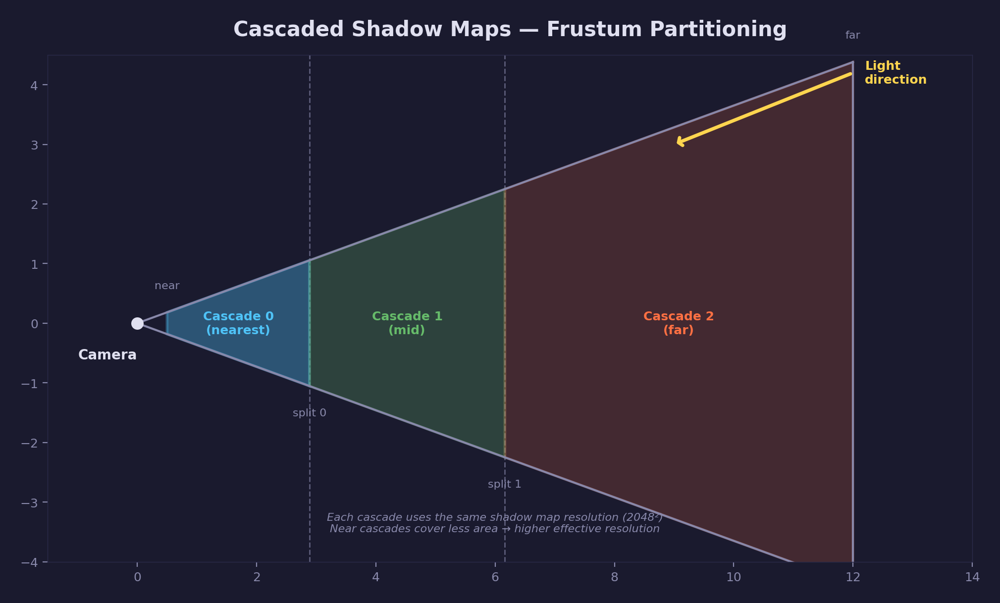
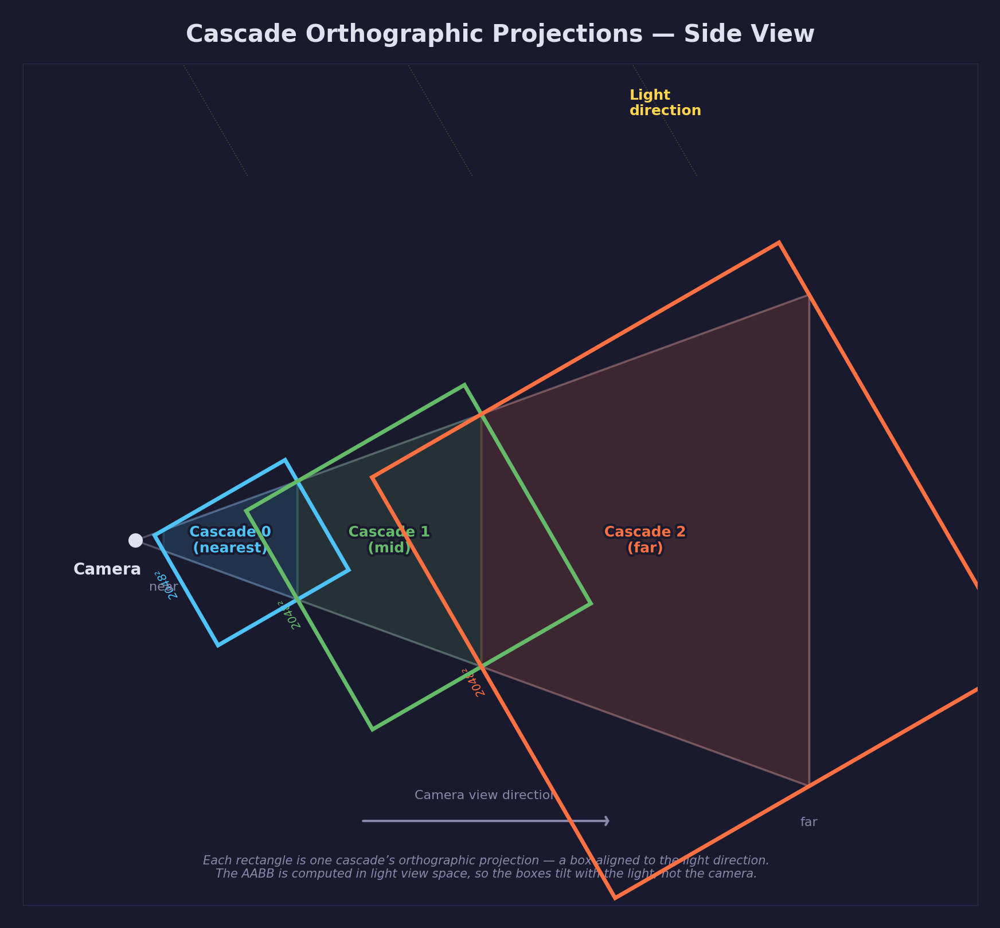
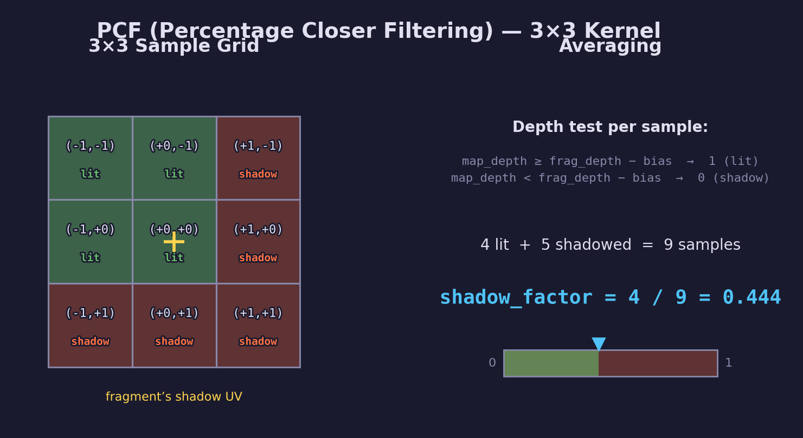
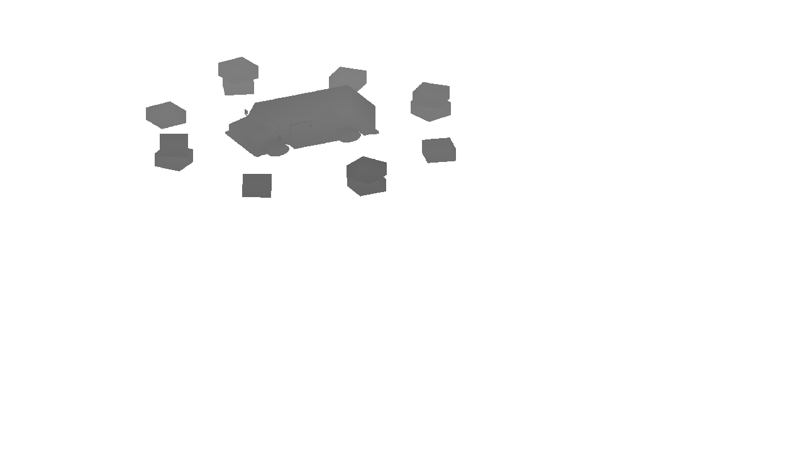
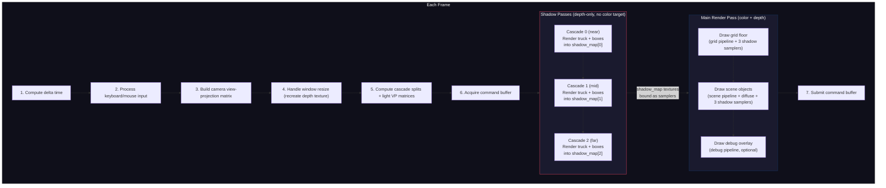

# Lesson 15 — Cascaded Shadow Maps

## What you'll learn

- How shadow maps work: rendering depth from the light's perspective
- Cascaded shadow maps (CSM): splitting the view frustum into depth ranges
- Logarithmic-linear cascade splitting (Lengyel's method)
- Building tight orthographic projections from frustum corners
- 3x3 PCF (Percentage Closer Filtering) for soft shadow edges
- Depth-only render passes (no color target)
- Front-face culling and depth bias to reduce shadow artifacts
- Shadow map debug visualization

## Result


A scene with the CesiumMilkTruck model, textured boxes, and a procedural grid
floor — all receiving soft shadows from a directional light.  Shadows are
sharpest near the camera and gradually soften at distance as lower-resolution
cascades take over.

## Key concepts

### Shadow mapping

Shadow mapping is a two-pass technique for rendering shadows from a light
source:

1. **Shadow pass**: Render the scene from the light's perspective into a
   depth-only texture (the shadow map).  Each texel stores the depth of the
   closest surface to the light.

2. **Main pass**: For each fragment, transform its position into the light's
   clip space and compare its depth against the stored shadow map depth.  If
   the fragment is farther from the light than the shadow map value, it is in
   shadow.

### Cascaded shadow maps

A single shadow map covering the entire view frustum wastes resolution — most
texels cover distant geometry that occupies few screen pixels, while nearby
objects (which need the most detail) get too few shadow map texels.

Cascaded shadow maps solve this by splitting the view frustum into multiple
depth ranges (cascades), each with its own shadow map at the same resolution.
Near cascades cover a small volume at high effective resolution; far cascades
cover a larger volume at lower effective resolution.



This lesson uses 3 cascades at 2048x2048 each — a good balance between
quality and performance for most scenes.

### Cascade split computation

The split distances use Lengyel's logarithmic-linear blend:

$$
d_i = \lambda \cdot n \left(\frac{f}{n}\right)^{i/N} + (1 - \lambda) \cdot \left(n + \frac{i}{N}(f - n)\right)
$$

Where $n$ = near plane, $f$ = far plane, $N$ = number of cascades, and
$\lambda$ controls the blend (0.5 is a good default).  Pure logarithmic
spacing distributes resolution more evenly in log-depth, while linear spacing
is more uniform.  The blend gives practical results across a range of scenes.

### Light-space projection

For each cascade, the algorithm:

1. Unprojects the 8 NDC frustum corners to world space using the inverse
   camera VP matrix
2. Interpolates between near and far corners to get this cascade's slice
3. Transforms the 8 slice corners into light view space
4. Computes a tight axis-aligned bounding box (AABB)
5. Builds an orthographic projection from the AABB bounds

This gives each cascade the tightest possible orthographic projection,
maximizing shadow map utilization.



The diagram above shows the result viewed from the side.  The camera looks to
the right and the light shines from the upper-right at an angle.  Each cascade
slice of the view frustum (the shaded trapezoids) gets its own orthographic
projection — the solid-bordered rectangle surrounding it.  Because an
orthographic projection defines a box (no perspective convergence), its side
profile is a rectangle.

The rectangles are tilted to match the light direction, not the camera.  This
is because the bounding box is computed in light view space — the code
transforms the frustum corners into the light's coordinate frame and finds the
axis-aligned bounding box there.  When viewed from the camera's side, that
light-aligned box appears rotated.

The key observation is that all three rectangles use the same shadow map
resolution (2048x2048), but they cover very different amounts of world space.
Cascade 0's small rectangle maps 2048 texels across a narrow region near the
camera, giving high texel density where you notice shadow detail most.
Cascade 2's large rectangle spreads the same 2048 texels across a much wider
area, but that area is far from the camera where lower resolution is acceptable.

In the code, `compute_cascade_light_vp` builds each rectangle by transforming
the cascade's frustum slice corners into light view space and computing the
axis-aligned bounding box — the tightest rectangle that contains the slice.
The AABB's min/max X and Y become the orthographic projection's left/right and
bottom/top bounds (see [Math Lesson 06 — Projections](../../math/06-projections/)
for how `mat4_orthographic` maps a box to clip space).

### PCF (Percentage Closer Filtering)

A single depth comparison produces hard, aliased shadow edges — each
fragment is either fully lit (1.0) or fully shadowed (0.0) with no
in-between.  PCF softens this by sampling multiple points in the shadow
map around the fragment's projected position and averaging the results.

This lesson uses a 3x3 kernel: 9 sample points arranged in a grid, each
offset by one texel from its neighbor.  The offsets range from (-1, -1)
to (+1, +1), centered on the fragment's shadow UV coordinate.  At each
sample position, the shader reads the shadow map depth and compares it
against the fragment's depth (minus a small bias to prevent shadow acne).
If the stored depth is greater than or equal to the fragment's depth, that
sample counts as lit (1.0); otherwise it counts as shadowed (0.0).



The diagram shows a fragment at a shadow boundary.  Four of the nine
samples pass the depth test (lit) and five fail (shadowed), giving a
shadow factor of 4/9 = 0.444.  This intermediate value produces a smooth
penumbra rather than a hard edge.

#### The `[unroll]` attribute

The nested loop in `sample_shadow_pcf` uses HLSL's `[unroll]` attribute:

```hlsl
[unroll]
for (int y = -1; y <= 1; y++)
{
    [unroll]
    for (int x = -1; x <= 1; x++)
    {
        float2 offset = float2((float)x, (float)y) * shadow_texel_size;
        float map_depth = shadow_map.Sample(smp, shadow_uv + offset).r;
        shadow += (map_depth >= current_depth - shadow_bias) ? 1.0 : 0.0;
    }
}
return shadow / 9.0;
```

`[unroll]` instructs the shader compiler to replace the loop with 9
straight-line texture samples at compile time.  This matters for two
reasons:

1. **GPU architecture** — GPUs execute fragments in lockstep warps/waves.
   Dynamic loops with varying iteration counts can cause divergence,
   where some threads wait idle while others finish extra iterations.
   Unrolling eliminates the loop control flow entirely, so every thread
   in the warp executes the same instruction sequence.

2. **Texture sampling** — Some GPU architectures require texture
   coordinates to be deterministic at compile time for optimal
   scheduling.  Unrolled samples give the compiler full visibility into
   the access pattern, enabling better instruction ordering and hiding
   memory latency through interleaving.

Because the loop bounds are compile-time constants (-1 to +1), the
compiler could infer the unroll automatically in most cases.  The
explicit `[unroll]` makes the intent clear and guarantees consistent
behavior across different shader compilers and backends (SPIR-V via
`dxc -spirv` and DXIL).

### Shadow sampling in the fragment shader

The fragment shader in `scene.frag.hlsl` ties together cascade selection and
PCF into a single shadow lookup.  For each fragment, the process is:

1. **Measure distance** — Compute the world-space distance from the fragment
   to the camera (`length(world_pos - eye_pos)`).

2. **Select cascade** — Compare the distance against the cascade split
   thresholds.  The fragment uses the tightest cascade that contains it:
   cascade 0 for the nearest range, cascade 1 for mid-range, cascade 2 for
   the farthest.  Fragments beyond all cascades receive no shadow (fully lit).

3. **Project to shadow map UV** — The vertex shader outputs the fragment's
   position in each cascade's light clip space (`light_vp[i] * world_pos`).
   The fragment shader performs the perspective divide and maps the result
   from NDC ([-1, 1]) to UV coordinates ([0, 1]):

   ```hlsl
   float3 proj = light_pos.xyz / light_pos.w;  /* perspective divide        */
   float2 shadow_uv = proj.xy * 0.5 + 0.5;     /* NDC [-1,1] -> UV [0,1]   */
   shadow_uv.y = 1.0 - shadow_uv.y;             /* flip Y: NDC to texture   */
   ```

4. **Sample with PCF** — The `sample_shadow_pcf` function takes the shadow
   map texture, the computed UV, and the fragment's depth (`proj.z`).  It
   runs the 3x3 kernel described above, comparing each sample's stored depth
   against the fragment's depth minus a small bias.  The averaged result is
   the shadow factor.

5. **Modulate lighting** — The shadow factor (0.0 to 1.0) multiplies both the
   diffuse and specular terms of the Blinn-Phong model.  Ambient light is
   not affected by shadows — this prevents shadowed areas from going
   completely black.

The `--show-shadow-map` flag renders cascade 0's depth buffer as a fullscreen
grayscale overlay, showing what the light "sees":



Bright areas are far from the light (depth close to 1.0) and dark silhouettes
are the surfaces closest to the light.  This is the raw data that the fragment
shader samples during the depth comparison — each texel stores a single
32-bit float representing the nearest depth at that position from the light's
perspective.

### Shadow artifacts and mitigation

Two common shadow artifacts and how this lesson handles them:

**Shadow acne** — Self-shadowing caused by limited depth precision.  The
surface falsely shadows itself in a moire pattern.  Mitigated by a depth
bias in the shadow comparison and rasterizer depth bias settings.

**Peter panning** — Shadows that appear detached from objects, as if they
are floating above the ground (named after the boy who lost his shadow).
This is a direct consequence of adding too much depth bias to fix shadow
acne — the bias shifts the effective depth surface away from the light,
which moves the shadow boundary away from the object's base.


The left panel shows a correct shadow that meets the object at its base.
The right panel shows what happens when depth bias is too large: the shadow
map records depths at a biased surface (dashed line) instead of the actual
geometry.  Fragments between the object base and the biased surface pass the
depth test even though they should be in shadow, creating a visible gap.

Shadow acne and peter panning are opposing forces — reducing one tends to
increase the other.  This lesson uses two complementary techniques to manage
both:

1. **Depth bias** — A small constant and slope-scaled bias in the
   rasterizer state pushes shadow map depths just enough to prevent acne
   without creating a large gap.

2. **Front-face culling in the shadow pass** — Instead of the usual
   back-face culling, the shadow pass culls front faces and renders only
   back faces into the shadow map.  This means the stored depth comes from
   the far side of each object rather than the near side.  The depth
   difference between front and back faces (the object's thickness) acts as
   a natural bias that prevents acne on front-facing surfaces without
   requiring a large explicit bias — which in turn avoids peter panning.

### Rendering pipeline

This lesson uses four graphics pipelines coordinated across multiple render
passes within a single command buffer.  The shadow pass runs once per cascade
(3 times), then a single main pass draws the lit scene using the shadow maps
as inputs.



**Four pipelines, two pass types:**

| Pipeline | Pass type | Culling | Color target | Depth target | Purpose |
|---|---|---|---|---|---|
| Shadow | Depth-only | Front-face | None | `shadow_map[i]` (D32_FLOAT) | Write closest depth from light's view |
| Scene | Color + depth | Back-face | Swapchain (sRGB) | Scene depth buffer | Blinn-Phong lit objects with shadow sampling |
| Grid | Color + depth | None | Swapchain (sRGB) | Scene depth buffer | Procedural grid floor with shadow sampling |
| Debug | Color + depth | None | Swapchain (sRGB) | Scene depth buffer | Visualize cascade 0 shadow map |

**Data flow between passes:** The shadow pass writes depth into each
`shadow_map[i]` texture (created with `DEPTH_STENCIL_TARGET | SAMPLER` usage).
The main pass then binds all three shadow maps as fragment samplers alongside
the cascade split distances and light VP matrices — everything the fragment
shader needs to determine which cascade covers each fragment and whether it
is in shadow.

## Building

```bash
cmake -B build
cmake --build build --config Debug --target 15-cascaded-shadow-maps
```

Run with shadow map debug overlay:

```bash
./build/lessons/gpu/15-cascaded-shadow-maps/Debug/15-cascaded-shadow-maps --show-shadow-map
```

## Math

This lesson uses:

- **Matrices** — [Math Lesson 05](../../math/05-matrices/) for model, view,
  projection, and inverse matrices
- **Projections** — [Math Lesson 06](../../math/06-projections/) for
  perspective and orthographic projection
- **View matrix** — [Math Lesson 09](../../math/09-view-matrix/) for
  camera and light view construction

## AI skill

This lesson has a matching Claude Code skill at
[`.claude/skills/cascaded-shadow-maps/SKILL.md`](../../../.claude/skills/cascaded-shadow-maps/SKILL.md).
Invoke it with `/cascaded-shadow-maps` to add shadow mapping to your own
project.  You can copy the skill file into your project's `.claude/skills/`
directory.

## Exercises

1. **Cascade visualization**: Color-code each cascade (red/green/blue tint)
   in the fragment shader to see which cascade covers which part of the scene.
   This helps understand the frustum splitting.

2. **Shadow map resolution**: Try changing `SHADOW_MAP_SIZE` to 512, 1024,
   and 4096.  Observe how resolution affects shadow quality and where
   artifacts become visible.

3. **More cascades**: Increase `NUM_CASCADES` to 4 and add a 4th shadow map,
   light VP matrix, and cascade split.  Update the shaders to sample from
   the additional cascade.

4. **Animated light**: Make the light direction rotate slowly over time to
   create moving shadows.  Update the light direction in `SDL_AppIterate`
   using `sinf`/`cosf` with the elapsed time.
