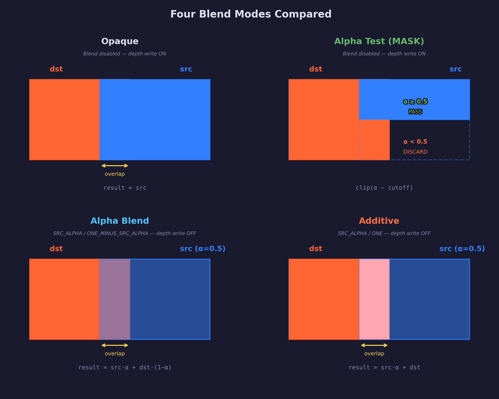
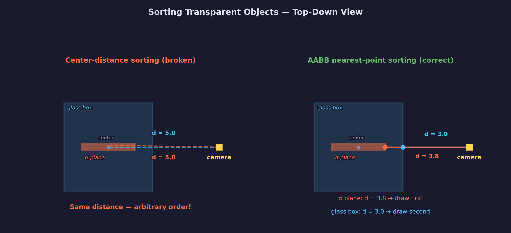

# Lesson 16 — Blending

## What you'll learn

- How **alpha blending** combines fragment colors with the framebuffer
- The **blend equation** and what each blend factor controls
- How to configure `SDL_GPUColorTargetBlendState` for different blend modes
- **Alpha testing** (clip/discard) vs **alpha blending** — when to use each
- Why transparent objects require **back-to-front sorting** and disabled depth writes
- Why **AABB nearest-point distance** produces correct sort order where center distance fails
- **Additive blending** for luminous effects (fire, lasers, particles)
- The three **glTF alpha modes**: OPAQUE, MASK, BLEND
- **Premultiplied alpha** and why it simplifies compositing

## Result


The Khronos
[TransmissionOrderTest](https://github.com/KhronosGroup/glTF-Sample-Assets/tree/main/Models/TransmissionOrderTest)
glTF model rendered with three blend pipelines. Each row uses a different
alpha mode — **BLEND** (top), **MASK** (middle), **OPAQUE** (bottom) — so
you can directly compare how the same α-symbol texture and blue glass boxes
appear under each mode. The checkerboard cloth backdrop shows through
transparent surfaces, making the blending effects visible.

## Key concepts

### The blend equation

When a fragment shader outputs a color, the GPU can either replace the
framebuffer value (opaque) or combine the new color with what's already there
(blending). The combination follows this equation:

$$
\text{result} = \text{src} \times \text{srcFactor} \;\mathbin{\mathrm{op}}\; \text{dst} \times \text{dstFactor}
$$

Where:

- **src** = the fragment shader's output (the new color)
- **dst** = the current framebuffer value (what's already been drawn)
- **srcFactor** and **dstFactor** = multipliers chosen from `SDL_GPUBlendFactor`
- **op** = how to combine the two terms (usually ADD)

The GPU evaluates this equation separately for RGB and alpha channels, so
you can set different factors for color and alpha.

### SDL blend state configuration

Blending is configured per-pipeline in `SDL_GPUColorTargetBlendState`:

```c
SDL_GPUColorTargetDescription color_target;
SDL_zero(color_target);
color_target.format = swapchain_format;
color_target.blend_state.enable_blend = true;

/* Color: src * srcAlpha + dst * (1 - srcAlpha) */
color_target.blend_state.src_color_blendfactor = SDL_GPU_BLENDFACTOR_SRC_ALPHA;
color_target.blend_state.dst_color_blendfactor = SDL_GPU_BLENDFACTOR_ONE_MINUS_SRC_ALPHA;
color_target.blend_state.color_blend_op = SDL_GPU_BLENDOP_ADD;

/* Alpha: src * 1 + dst * (1 - srcAlpha) */
color_target.blend_state.src_alpha_blendfactor = SDL_GPU_BLENDFACTOR_ONE;
color_target.blend_state.dst_alpha_blendfactor = SDL_GPU_BLENDFACTOR_ONE_MINUS_SRC_ALPHA;
color_target.blend_state.alpha_blend_op = SDL_GPU_BLENDOP_ADD;
```

The shader code is identical for opaque and blended rendering — the only
difference is the pipeline configuration.

### Four blend modes compared



| Mode | Blend state | Depth write | Sorting needed | Use case |
|------|-------------|-------------|----------------|----------|
| **Opaque** | Disabled | ON | No | Solid geometry (default) |
| **Alpha test** | Disabled | ON | No | Foliage, fences, decals |
| **Alpha blend** | SRC_ALPHA / ONE_MINUS_SRC_ALPHA | OFF | Yes (back-to-front) | Glass, UI, smooth transparency |
| **Additive** | SRC_ALPHA / ONE | OFF | No (commutative) | Fire, lasers, particles |

### Alpha testing (MASK)

Alpha testing discards fragments below a threshold — there is no partial
transparency. In HLSL, the `clip()` intrinsic discards a fragment when its
argument is negative:

```hlsl
clip(color.a - alpha_cutoff);  /* discard if alpha < cutoff */
```

Because discarded fragments never write to the framebuffer or depth buffer,
alpha testing works correctly with the depth buffer and does not require
sorting. This makes it efficient for foliage, chain-link fences, and any
geometry that needs a cutout shape.

In glTF, this is the `"alphaMode": "MASK"` mode with a default cutoff of 0.5.

### Alpha blending (BLEND)

Alpha blending produces smooth, partial transparency. A fragment with
alpha = 0.5 contributes half its color and lets half of the background
through. This requires two critical pipeline changes:

1. **Depth write OFF** — A semi-transparent surface must not prevent surfaces
   behind it from being drawn. Depth *testing* stays ON so transparent
   surfaces still appear behind opaque ones.

2. **Back-to-front draw order** — Because blending depends on what's already
   in the framebuffer, you must draw the farthest transparent surface first
   and the nearest last. This is the painter's algorithm.

In glTF, this is the `"alphaMode": "BLEND"` mode.

### Additive blending

Additive blending adds the fragment's color to the framebuffer. Overlapping
areas become brighter, never darker:

$$
\text{result} = \text{src} \times \text{srcAlpha} + \text{dst} \times 1
$$

Because addition is commutative ($A + B = B + A$), draw order does not
matter. This makes additive blending practical for particle systems where
sorting thousands of particles per frame would be expensive.

### Premultiplied alpha

Standard ("straight") alpha stores color and opacity separately:
`(R, G, B, A)`. The blend equation multiplies RGB by A at blend time.

**Premultiplied** alpha bakes the multiplication into storage:
`(R×A, G×A, B×A, A)`. The blend factors change:

| Mode | srcColor | dstColor |
|------|----------|----------|
| Straight alpha | `SRC_ALPHA` | `ONE_MINUS_SRC_ALPHA` |
| Premultiplied alpha | `ONE` | `ONE_MINUS_SRC_ALPHA` |

The advantage: with premultiplied alpha, standard transparency and additive
blending become the same equation. A particle with `alpha = 0` but
`RGB > 0` is purely additive (a glow), while `alpha = 0.5` with
pre-multiplied RGB is standard transparency. One pipeline handles both.

### Sorting by AABB nearest point

A common first approach is to sort transparent objects by the distance from
the camera to the object's center (its node translation). This works in
many cases, but fails when two transparent objects share the same center —
for example, a flat α-symbol plane sitting inside a 3D glass box. Both
nodes are at `(0, 2.5, 0)`, so center-distance sorting gives equal values
and `qsort` puts them in arbitrary order.

The solution: sort by the distance from the camera to the **nearest point
on each object's bounding box** instead of the center.

 The glass box's
front face is closer to the camera than the flat interior plane, so it
gets a smaller sort distance and draws later — which is correct, because
the glass should blend on top of the α, letting it show through.

To compute the nearest point on an axis-aligned bounding box (AABB):

```c
/* Clamp the camera position to the AABB — the clamped point is
 * the nearest point on the box surface to the camera. */
float nx = clamp(cam.x, wmin.x, wmax.x);
float ny = clamp(cam.y, wmin.y, wmax.y);
float nz = clamp(cam.z, wmin.z, wmax.z);
float dist = length(vec3(nx, ny, nz) - cam);
```

The mesh-local AABB is computed once during upload, then transformed to
world space each frame using [Arvo's method](https://doi.org/10.1016/B978-0-12-336156-1.50015-4)
— an efficient technique that transforms an AABB through a 4×4 matrix by
decomposing it into per-axis min/max contributions, avoiding the cost of
transforming all eight corners individually.

### KHR_materials_transmission approximation

The TransmissionOrderTest model uses `KHR_materials_transmission` for its
blue glass boxes. True transmission requires rendering the scene behind the
surface to a texture and then compositing — a screen-space technique beyond
this lesson's scope. Our glTF parser approximates transmission as standard
alpha blending with `alpha = 0.5`, which gives a reasonable transparent
appearance while keeping the rendering pipeline simple. The AABB-based
sorting ensures these glass boxes draw in the correct order relative to
interior objects.

### Correct draw order

The render loop iterates the glTF scene three times, once per alpha mode:

1. **OPAQUE primitives** — depth test ON, depth write ON, any draw order
2. **MASK primitives** — clip shader, depth write ON, any draw order
3. **BLEND primitives** — sorted back-to-front by AABB nearest-point
   distance, depth write OFF

This ensures opaque surfaces fill the depth buffer before any transparent
surfaces are drawn, so transparent objects correctly appear behind opaque ones.
The per-material `alpha_mode` field (parsed from the glTF) selects which
pipeline each primitive uses.

## Math

This lesson uses:

- **Vectors** — [Math Lesson 01](../../math/01-vectors/) for positions, normals,
  and distance calculations (AABB nearest-point, light direction, view direction)
- **Matrices** — [Math Lesson 05](../../math/05-matrices/) for model, view,
  and projection transforms
- **Projections** — [Math Lesson 06](../../math/06-projections/) for
  perspective projection
- **Orientation** — [Math Lesson 08](../../math/08-orientation/) for
  quaternion-based camera rotation
- **View matrix** — [Math Lesson 09](../../math/09-view-matrix/) for the
  first-person fly camera

## Building

```bash
cmake -B build
cmake --build build --config Debug --target 16-blending
```

Run:

```bash
python scripts/run.py 16
```

## AI skill

This lesson has a matching Claude Code skill at
[`.claude/skills/blending/SKILL.md`](../../../.claude/skills/blending/SKILL.md).
Invoke it with `/blending` to add alpha blending, alpha testing, or additive
blending to your SDL GPU project. Copy the skill into your own project's
`.claude/skills/` directory to use it with Claude.

## Exercises

1. **Reverse the sort order.** Change `compare_blend_draws` to sort
   front-to-back instead of back-to-front. Observe how the glass boxes in the
   BLEND row produce incorrect visuals — nearby surfaces block the background
   instead of blending with it.

2. **Switch to center-distance sorting.** Replace the AABB nearest-point
   distance with a simple `vec3_length(center - cam_position)` using the node
   translation. Observe how the center column of the BLEND row breaks — the
   α symbol appears in front of the glass box instead of inside it.

3. **Add an additive blend pipeline.** Create a fourth pipeline with
   `SDL_GPU_BLENDFACTOR_ONE` as the destination color factor. Apply it to the
   glass boxes and observe how they become luminous instead of transparent —
   overlapping glass areas brighten rather than darken.

4. **Animate the glass opacity.** Add a time uniform (like Lesson 03) and
   oscillate the blue glass `base_color[3]` between 0.1 and 0.9 using a
   sine wave. Watch how the glass transitions from nearly invisible to almost
   opaque while the α symbol remains visible through it.
