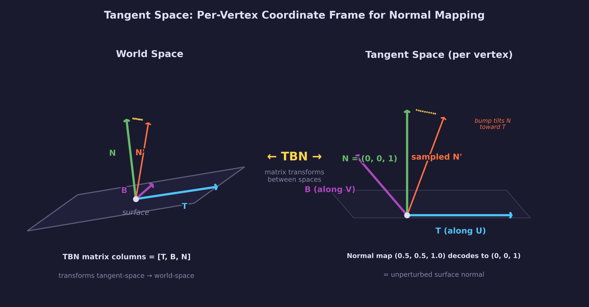
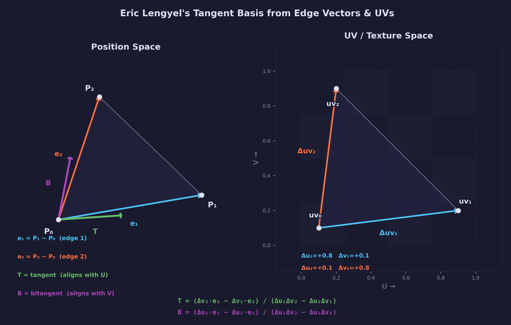

# Lesson 17 — Normal Maps

## What you'll learn

- Tangent-space normal mapping — adding surface detail without extra geometry
- The TBN matrix (tangent, bitangent, normal) and how it transforms
  normals from tangent space to world space
- Why TBN is a rotation matrix and what that means for lighting
- Eric Lengyel's method for computing tangent and bitangent vectors
  from triangle edges and UV coordinates
- Using supplied tangent vectors from glTF (VEC4 with handedness)
- MikkTSpace — why baker and renderer must agree on tangent space
- Gram-Schmidt re-orthogonalization for robust tangent-space bases
- Sampling and decoding normal maps in the fragment shader
- Comparing flat, per-vertex, and normal-mapped shading side by side

## Result


The Khronos **NormalTangentMirrorTest** model displayed with Blinn-Phong
lighting and tangent-space normal mapping. The model places real geometry
on the left and normal-mapped quads on the right — when normal mapping
is implemented correctly, both columns produce identical reflections.
Press **1/2/3** to switch between flat, smooth, and normal-mapped shading
to see the progression.

## Key concepts

### What is a normal map?

A normal map is a texture that stores per-texel surface directions instead
of colors. Each pixel encodes a 3D normal vector as RGB values in the range
[0, 1]. Decoding converts back to the [-1, 1] range:

```text
normal = texel * 2.0 - 1.0
```

A flat surface encodes as (0.5, 0.5, 1.0) which decodes to (0, 0, 1) —
pointing straight outward in tangent space. Bumps and grooves tilt this
direction, and the lighting reacts as if the surface had real geometry.

### Tangent space



Normal maps are authored in **tangent space** — a local coordinate system
aligned to each triangle's surface:

- **T** (tangent) — points along the U texture coordinate axis
- **B** (bitangent) — points along the V texture coordinate axis
- **N** (normal) — perpendicular to the surface

The **TBN matrix** transforms normals from tangent space to world space,
where lighting calculations happen.

### Why TBN is a rotation matrix

After Gram-Schmidt orthogonalization, the three vectors T, B, N are
**orthonormal** — mutually perpendicular and each unit length. A matrix
whose columns form an orthonormal set is an **orthogonal matrix**, and
when its determinant is +1, it is a rotation matrix (see
[Math Lesson 05, sections 4 and 10](../../math/05-matrices/#4-orthonormal-basis-vectors)
for the full treatment).

You can verify this with a concrete TBN basis:

```text
T = (1, 0, 0)    B = (0, 1, 0)    N = (0, 0, 1)    ← a flat surface

dot(T, B) = 0  ✓  perpendicular
dot(T, N) = 0  ✓  perpendicular
dot(B, N) = 0  ✓  perpendicular
|T| = |B| = |N| = 1  ✓  unit length

        | Tx  Bx  Nx |   | 1  0  0 |
TBN  =  | Ty  By  Ny | = | 0  1  0 |   det = 1  → rotation matrix
        | Tz  Bz  Nz |   | 0  0  1 |
```

For a tilted surface the columns are different, but the orthonormality
still holds — T, B, N are just the identity basis rotated to align with
the surface.

This has three practical consequences:

1. **Normals stay unit-length.** A rotation preserves lengths and angles
   (no scaling, no skewing). The tangent-space normal (0, 0, 1) —
   meaning "straight out from the surface" — gets rotated to align with
   the vertex normal N in world space, and its length stays exactly 1.
   Bumps and grooves in the normal map tilt this direction, and TBN
   rotates them into world space with the same guarantee.

2. **The inverse is the transpose.** For any orthogonal matrix,
   $M^{-1} = M^T$ (see [Math Lesson 05, section 7](../../math/05-matrices/#7-transpose)).
   If you ever need to go the other direction — transforming a world-space
   vector *into* tangent space — you just transpose the TBN matrix instead
   of computing a full inverse. Some engines do the lighting in tangent
   space (transforming the light direction with TBN-transpose) rather than
   transforming normals to world space, and this property is what makes
   that approach efficient.

3. **The determinant encodes handedness.** A proper rotation has
   det = +1. When UV coordinates are mirrored, the raw T and B
   form a left-handed basis with det = -1 (a rotation composed with a
   reflection). The handedness sign stored in `tangent.w` corrects this:
   `B = cross(N, T) * tangent.w` flips B so that the TBN matrix
   matches the UV layout of the normal map. Without this correction,
   normal-mapped lighting appears inverted on mirrored geometry.

### Eric Lengyel's method



Computing tangent vectors from mesh data uses the relationship between
triangle edges in 3D space and their UV coordinates. For a triangle with
positions P0, P1, P2 and UVs (u0,v0), (u1,v1), (u2,v2):

$$
\begin{bmatrix} T \\ B \end{bmatrix} = \frac{1}{\Delta u_1 \Delta v_2 - \Delta u_2 \Delta v_1} \begin{bmatrix} \Delta v_2 & -\Delta v_1 \\ -\Delta u_2 & \Delta u_1 \end{bmatrix} \begin{bmatrix} e_1 \\ e_2 \end{bmatrix}
$$

Where $e_1 = P_1 - P_0$ and $e_2 = P_2 - P_0$ are edge vectors, and
$\Delta u$, $\Delta v$ are UV coordinate deltas.

After computing per-triangle tangents, they are accumulated per-vertex
(averaged across sharing triangles), then orthogonalized against the
vertex normal using **Gram-Schmidt**:

```text
T' = normalize(T - N * dot(N, T))
```

The **handedness** (stored in tangent.w as +1 or -1) records whether
the UV space is mirrored — essential for models with mirrored texture
coordinates.

### glTF tangent vectors

The glTF 2.0 format can supply pre-computed tangent vectors as a VEC4
attribute. The first three components are the tangent direction; the fourth
is the handedness sign. The NormalTangentMirrorTest model specifically
tests whether an engine correctly uses these supplied tangents (including
the mirrored variants).

### MikkTSpace — why tangent-space agreement matters

Normal maps are not self-contained. A normal map stores directions
relative to a tangent space, so the tool that **bakes** the map and the
engine that **renders** it must construct the exact same tangent space
for every vertex. If they disagree — even slightly — normals decode to
wrong directions and the surface shows subtle lighting seams, inverted
bumps, or shading discontinuities along UV borders.

The problem is that tangent-space computation is not unique. Different
algorithms weight triangles differently, break ties differently at UV
seams, and handle degenerate triangles differently. Two implementations
that both "compute tangents from mesh data" can produce different bases,
and a normal map baked against one will look wrong when rendered with
the other.

**MikkTSpace**, created by Morten S. Mikkelsen, solves this by defining
a single, deterministic algorithm for tangent-space computation. It
specifies exactly how to:

- Accumulate per-triangle tangents into per-vertex tangents
- Weight contributions by triangle angle (not area)
- Handle UV seams and mirrored regions by splitting tangent space at
  discontinuities rather than averaging across them
- Orthogonalize the result against the vertex normal

Because the algorithm is fully specified (not just "compute tangents
somehow"), any two implementations that follow the specification produce
**identical** tangent bases for the same mesh. This makes normal maps
portable — bake in one tool, render in another, and the results match.

**Industry adoption.** MikkTSpace appears as a tangent-space option in
nearly every 3D content tool:

| Tool | MikkTSpace support |
|------|--------------------|
| Blender | Default tangent space for mesh export |
| Substance Painter / Designer | Default for baking and rendering |
| xNormal | Supported baking mode |
| Maya | Available via plugin / FBX export option |
| Unreal Engine | Default tangent-space computation |
| Unity | Default for normal map import |
| glTF 2.0 | Specification requires MikkTSpace when tangents are omitted |

When you see "MikkTSpace" as a checkbox or dropdown in these tools, it
means: "use Mikkelsen's algorithm so that baking and rendering agree."

**Practical guidance:**

- **Baking:** Always bake normal maps with MikkTSpace enabled in your
  baker (Substance, xNormal, Blender). This is usually the default.
- **Rendering:** Compute or supply MikkTSpace tangents at runtime. If
  your mesh format includes pre-computed tangents (like glTF VEC4
  tangents), they were likely generated with MikkTSpace.
- **Mismatches:** If normal-mapped lighting looks subtly wrong — seams
  along UV islands, inverted bumps on mirrored geometry — the first
  thing to check is whether the baker and renderer are using the same
  tangent space.

This lesson uses Lengyel's method for computing tangents from scratch
(when a model lacks pre-computed tangents), which produces similar
results for most geometry. For production use, integrating the
[MikkTSpace library](http://www.mikktspace.com/) directly ensures
exact agreement with content tools.

### Shading mode comparison

Press **1**, **2**, or **3** to switch between shading modes:

| Key | Mode | Description |
|-----|------|-------------|
| 1 | Flat | Face normal from `ddx`/`ddy` screen-space derivatives — reveals triangles |
| 2 | Per-vertex | Interpolated vertex normal — smooth but no surface detail |
| 3 | Normal-mapped | Per-texel normal from the normal map — full surface detail (default) |

## Math

This lesson uses:

- **Vectors** — [Math Lesson 01](../../math/01-vectors/) for dot and cross
  products in TBN construction
- **Matrices** — [Math Lesson 05](../../math/05-matrices/) for model and
  view-projection transforms
- **Coordinate Spaces** — [Math Lesson 02](../../math/02-coordinate-spaces/)
  for understanding tangent space as a local coordinate system

## Building

```bash
cmake --build build --config Debug --target 17-normal-maps
```

Then run the executable from the build directory (assets are copied automatically).

## Controls

| Input | Action |
|-------|--------|
| WASD / Arrows | Move forward/back/left/right |
| Space / Left Shift | Fly up / fly down |
| Mouse | Look around (captured in relative mode) |
| 1 / 2 / 3 | Switch shading: flat / per-vertex / normal-mapped |
| Escape | Release mouse / quit |

## AI skill

This lesson has a matching Claude Code skill at
[`.claude/skills/normal-maps/SKILL.md`](../../../.claude/skills/normal-maps/SKILL.md).
Invoke it with `/normal-maps` to add normal mapping to your own SDL GPU
project. You can copy the skill into your project's `.claude/skills/`
directory for use with Claude Code.

## Exercises

1. **Adjust normal map strength** — Add a `normal_strength` uniform that
   scales the normal map's X and Y components before normalization. A value
   of 0.5 gives subtler bumps; 2.0 exaggerates them. What happens at 0.0?

2. **Visualize the TBN basis** — Output the tangent (T), bitangent (B), or
   normal (N) as the fragment color (map from [-1,1] to [0,1] with
   `color = N * 0.5 + 0.5`). This helps debug tangent-space issues.

3. **Try a different model** — Load a model without supplied tangents (like
   CesiumMilkTruck or Suzanne) and verify that Lengyel's computed tangents
   produce correct normal mapping. Compare to a model with supplied tangents.

4. **Parallax mapping** — Extend normal mapping with parallax occlusion
   mapping (POM). Use the height encoded in the normal map's alpha channel
   (or a separate height map) to offset UV coordinates based on the view
   angle, creating the illusion of depth.
