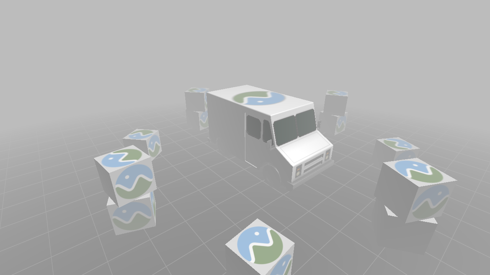
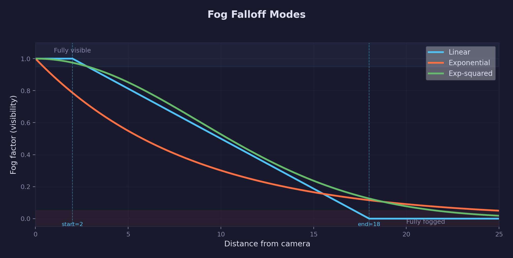
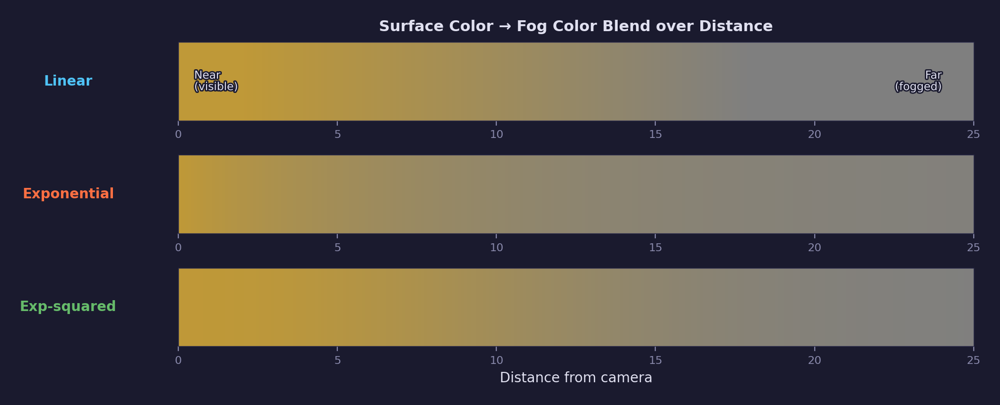
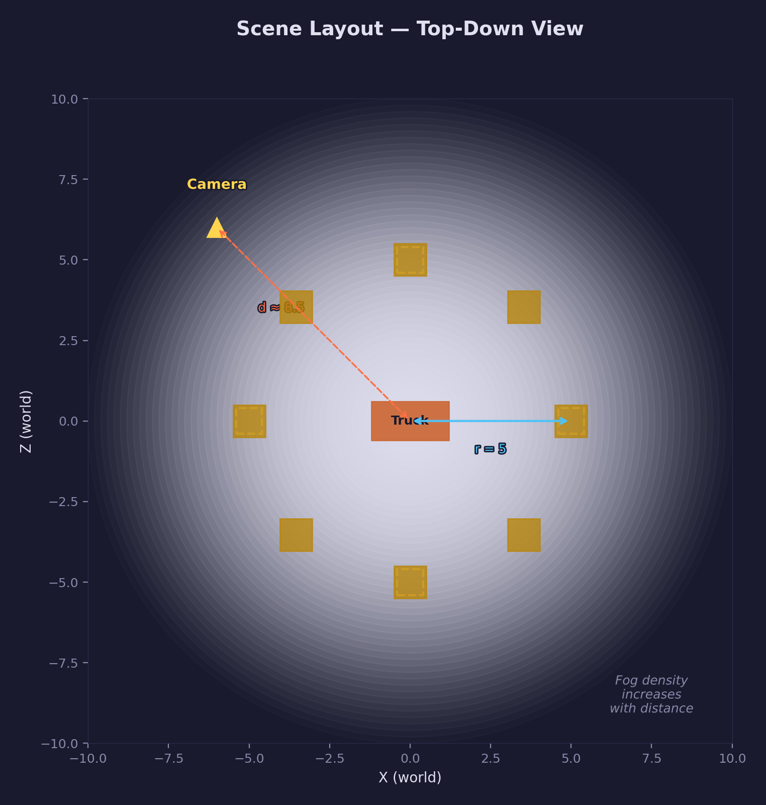

# Lesson 20 — Linear Fog

## What you'll learn

- How depth-based **distance fog** creates atmospheric perspective in a 3D scene
- Three fog falloff modes: **linear**, **exponential**, and **exponential-squared**
- Why the fog color must **match the clear color** for a seamless horizon
- How to apply fog **consistently** across multiple shaders (scene objects and
  grid floor)
- How the **fog factor** blends between lit surface color and fog color

## Result



A milk truck at the origin surrounded by 12 textured boxes arranged in a ring
(radius 5).  The nearest objects are fully visible; the farthest are heavily
obscured by medium gray fog.  The grid floor fades into the same fog color,
creating a seamless atmospheric effect.  Press 1/2/3 to switch between linear,
exponential, and exponential-squared fog modes.

## Key concepts

### Distance fog

Real atmospheres scatter light — objects farther from the viewer appear washed
out, losing contrast and blending toward a uniform background color.  Distance
fog approximates this effect by computing a **fog factor** for each fragment
based on its distance from the camera, then blending between the lit surface
color and a constant fog color.

The fog factor ranges from **1.0** (fully visible, close to camera) to **0.0**
(fully fogged, far away).  The final color is:

```text
final_color = lerp(fog_color, lit_color, fog_factor)
```

### Three fog modes



Each mode defines a different function mapping distance to fog factor:

**Linear fog** — the simplest and most controllable mode:

```text
fog_factor = clamp((end - distance) / (end - start), 0, 1)
```

The fog ramps linearly from full visibility at `start` to full fog at `end`.
This gives precise control over where fog begins and ends, but the transition
can appear mechanical.

**Exponential fog** — smoother and more natural:

```text
fog_factor = clamp(e^(-density * distance), 0, 1)
```

Fog accumulates smoothly with distance.  There is no sharp start or end — the
density parameter controls how quickly visibility drops.  Good for general haze.

**Exponential-squared fog** — clear near, thick far:

```text
fog_factor = clamp(e^(-(density * distance)^2), 0, 1)
```

Squaring the exponent produces a curve that holds clear near the camera then
drops sharply at medium range.  This is effective for thick ground fog or
dramatic atmospheric perspective.

### Fog blending



A warm surface color blends toward the medium gray fog color differently
depending on the fog mode.  Linear produces a uniform gradient; exponential
decays smoothly; exp-squared holds the surface color longer before a sharp
transition.

### Fog color = clear color

The fog color **must match the clear (background) color** for the effect to
work.  This lesson uses medium gray (0.5, 0.5, 0.5) for both.  When a
fragment is fully fogged, its output color equals the fog color, which equals
the clear color, so there is no visible boundary between "fogged geometry" and
the background.

### Multi-shader fog

Both the scene shader (`fog.frag.hlsl`) and the grid shader
(`grid_fog.frag.hlsl`) apply the same fog calculation with the same parameters.
If only the scene objects had fog while the grid floor stayed unfogged, the
floor would appear to float on top of the fog — breaking the atmospheric
illusion.

### Scene layout



The milk truck sits at the origin.  Eight textured boxes orbit at radius 5 on
the ground, with four more stacked on top of every other ground box (12 total).
The camera starts at (-6, 5, 6), roughly 8.5 units from the truck.  Boxes range
from about 5 to 15 units from the camera — well within the linear fog range of
start (2) to end (18), so objects at different distances show visibly different
amounts of fog.

## The math

### Linear fog

The linear fog factor is the simplest:

```text
f = (end - d) / (end - start)
```

Where `d` is the Euclidean distance from the fragment to the camera (not just
the Z depth — using true distance ensures fog looks correct when the camera
rotates).  The result is clamped to [0, 1].

With `start = 2` and `end = 18`:

- At `d = 0`: `f = (18 - 0) / 16 = 1.125` → clamped to **1.0** (fully visible)
- At `d = 5`: `f = (18 - 5) / 16 ≈` **0.813** (nearest boxes — light fog)
- At `d = 10`: `f = (18 - 10) / 16 =` **0.5** (half fogged)
- At `d = 15`: `f = (18 - 15) / 16 ≈` **0.188** (farthest boxes — heavy fog)

### Exponential fog

```text
f = e^(-density * d)
```

The exponential form models Beer's law — the probability of light making it
through a uniform medium decreases exponentially with path length.  With
`density = 0.12`:

- At `d = 0`: `f = e^0 =` **1.0**
- At `d = 5`: `f = e^(-0.6) ≈` **0.549**
- At `d = 10`: `f = e^(-1.2) ≈` **0.301**
- At `d = 18`: `f = e^(-2.16) ≈` **0.115**

### Exponential-squared fog

```text
f = e^(-(density * d)^2)
```

Squaring the exponent produces a Gaussian-like decay.  Near the camera, the
squared term is small and fog is negligible; beyond a threshold, it drops
rapidly.  With `density = 0.08`:

- At `d = 0`: `f = e^0 =` **1.0**
- At `d = 5`: `f = e^(-0.16) ≈` **0.852**
- At `d = 10`: `f = e^(-0.64) ≈` **0.527**
- At `d = 18`: `f = e^(-2.0736) ≈` **0.126**

### Euclidean distance vs Z depth

This lesson computes fog distance as:

```hlsl
float dist = length(eye_pos.xyz - input.world_pos);
```

This is the true Euclidean distance, not `abs(eye_z - frag_z)`.  Using Z
depth alone would cause fog to shift as the camera rotates (fragments at the
same world position would get different fog depending on the view angle).
Euclidean distance gives consistent fog regardless of camera orientation.

## Uniform layout

The fragment uniforms were expanded from 96 bytes (Lesson 18) to 128 bytes by
appending fog parameters:

```text
Offset  Size  Field
  0      16   mat_ambient    (float4)
 16      16   mat_diffuse    (float4)
 32      16   mat_specular   (float4) — shininess in .w
 48      16   light_dir      (float4)
 64      16   eye_pos        (float4)
 80       4   has_texture    (uint)
 84      12   _pad           (float3)
 96      16   fog_color      (float4)
112       4   fog_start      (float)
116       4   fog_end        (float)
120       4   fog_density    (float)
124       4   fog_mode       (uint)
         ───
Total:  128 bytes
```

The grid shader has an analogous 128-byte layout with grid-specific fields in
the first 96 bytes and the same fog fields in the last 32 bytes.

## Building

```bash
# Compile shaders (if modified)
python scripts/compile_shaders.py 20

# Build
cmake --build build --target 20-linear-fog

# Run
python scripts/run.py 20
```

## Controls

| Key | Action |
|-----|--------|
| WASD / Arrow keys | Move forward/back/left/right |
| Space / Left Shift | Fly up / fly down |
| Mouse | Look around |
| 1 | Switch to **Linear** fog |
| 2 | Switch to **Exponential** fog |
| 3 | Switch to **Exp-squared** fog |
| Escape | Release mouse / quit |

## AI skill

See [`.claude/skills/linear-fog/SKILL.md`](../../../.claude/skills/linear-fog/SKILL.md)
for a reusable Claude Code skill that adds distance fog to any SDL GPU project.

## What's next

**Lesson 21 — HDR & Tone Mapping** renders to a floating-point render target
and applies a tone mapping operator to preserve highlight detail.  Combined with
fog, HDR lets you push bright specular highlights and atmospheric scattering
further without clamping to white.

## Exercises

1. **Adjust fog parameters** — Change `FOG_START_DIST` and `FOG_END_DIST` in
   `main.c` and observe how the fog boundary moves.  Try making the range very
   narrow (e.g., 5 to 10) for a dramatic "wall of fog" effect.

2. **Colored fog** — Change the fog color to something other than the clear
   color (e.g., orange for a sunset, red for a horror atmosphere).  Notice how
   the mismatch between fog and clear color creates a visible horizon line.

3. **Height fog** — Modify the shader to use the fragment's world-space Y
   coordinate to add vertical fog variation.  Objects below a certain height get
   extra fog, simulating low-lying ground fog.

4. **Animated fog** — Pass a time uniform and use it to oscillate the fog
   density or start distance.  This creates a "rolling fog" effect.

5. **Per-axis fog** — Instead of using Euclidean distance, try using only the
   Z component of the view-space position.  Compare the visual result when
   rotating the camera — this demonstrates why Euclidean distance is preferred.
