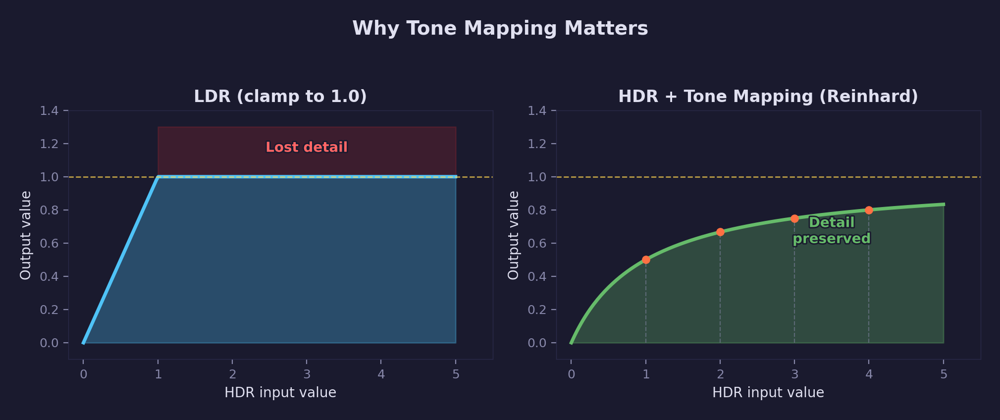
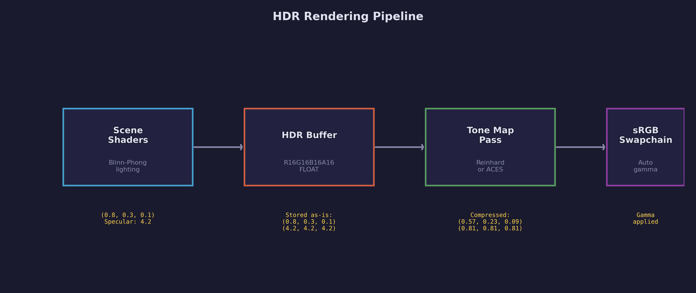
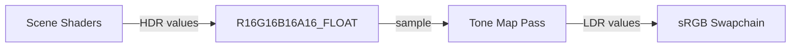
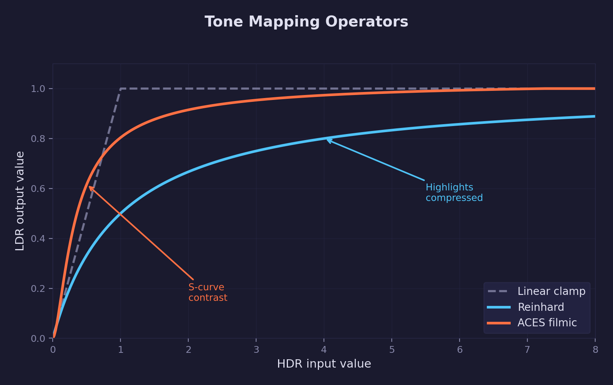
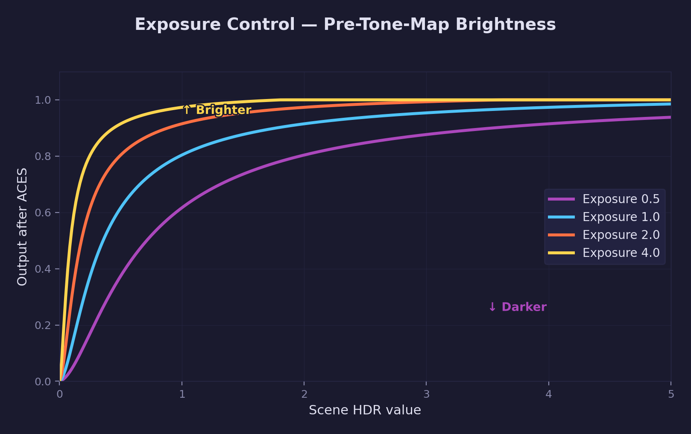

# Lesson 21 — HDR & Tone Mapping

## What you'll learn

- Why standard 8-bit (LDR) render targets clamp lighting above 1.0
- Creating a floating-point render target (`R16G16B16A16_FLOAT`)
- Two-pass rendering: scene to HDR buffer, then tone mapping to swapchain
- Tone mapping operators: Reinhard and ACES filmic
- Exposure control as a pre-tone-mapping brightness multiplier
- The fullscreen blit pass pattern (SV_VertexID, no vertex buffer)
- How sRGB swapchains handle gamma correction automatically

## Result


A lit scene (CesiumMilkTruck + BoxTextured models on a procedural grid floor)
rendered to a floating-point HDR buffer, then tone mapped to the display.
Specular highlights preserve detail instead of clamping to flat white.

**Controls:**

| Key | Action |
|-----|--------|
| WASD / Space / LShift | Move camera |
| Mouse | Look around |
| 1 | No tone mapping (clamp) |
| 2 | Reinhard tone mapping |
| 3 | ACES filmic tone mapping |
| =/+ | Increase exposure |
| - | Decrease exposure |

## Key concepts

### Why LDR fails

In every lesson before this one, the scene rendered directly to an 8-bit
swapchain format (`B8G8R8A8_UNORM`). That format stores each channel as an
integer from 0 to 255, mapped to the floating-point range [0, 1]. Any
lighting result above 1.0 is **clamped** — a specular highlight at 3.0 looks
identical to one at 1.5. All highlight detail is lost.



Real scenes have enormous dynamic range. Sunlight reflecting off metal can be
thousands of times brighter than a shadowed wall. Capturing even a fraction of
that range requires a format that can store values above 1.0.

### Floating-point render targets

`R16G16B16A16_FLOAT` stores each channel as a 16-bit half-precision float.
This gives a range of roughly 0 to 65504 with 10 bits of mantissa — more than
enough for real-time lighting. At 8 bytes per pixel (vs. 4 for UNORM), it
uses twice the bandwidth, which is why we only use it where needed.

Creating the HDR texture requires two usage flags:

```c
info.usage = SDL_GPU_TEXTUREUSAGE_COLOR_TARGET   /* render to it */
           | SDL_GPU_TEXTUREUSAGE_SAMPLER;        /* sample from it */
```

`COLOR_TARGET` lets the scene pass render into it. `SAMPLER` lets the tone
mapping pass read from it. Without both flags, one of the two passes would
fail.

### Two-pass rendering



The rendering pipeline has two passes:

1. **Scene pass** — Render lit geometry to the HDR buffer. The fragment
   shader computes Blinn-Phong lighting with a bright light
   (`light_intensity = 3.0`), producing specular values up to 3.0. The HDR
   format stores these faithfully.

2. **Tone map pass** — A fullscreen quad samples the HDR buffer and
   compresses its values into [0, 1] using a tone mapping operator. The
   result is written to the sRGB swapchain.



### Tone mapping operators

A tone mapping operator is a function that maps [0, &infin;) to [0, 1] while
preserving relative brightness. Dark values pass through nearly unchanged;
bright values are gradually compressed so highlights retain shape.



**Reinhard** — The simplest operator:

$$
L_{\text{out}} = \frac{L_{\text{in}}}{L_{\text{in}} + 1}
$$

Maps 0 &rarr; 0, 1 &rarr; 0.5, &infin; &rarr; 1. Preserves color ratios but
can look desaturated at extreme brightness because all channels converge
toward 1.0 simultaneously.

**ACES filmic** — A polynomial approximation of the Academy Color Encoding
System reference rendering transform, fit by Krzysztof Narkowicz:

$$
f(x) = \frac{x(2.51x + 0.03)}{x(2.43x + 0.59) + 0.14}
$$

Produces an S-shaped curve: shadows are slightly lifted, mid-tones have good
contrast, and highlights roll off smoothly. This is the most common tone
mapper in modern game engines because it produces rich, filmic results.

### Exposure control

Exposure is a multiplier applied to HDR values **before** tone mapping:

```hlsl
hdr *= exposure;
```



Increasing exposure brightens the scene (revealing detail in dark areas);
decreasing it darkens the scene (revealing detail in blown-out highlights).
This is analogous to a physical camera's exposure setting — it controls how
much light reaches the sensor before the response curve is applied.

### Gamma correction pipeline

This lesson uses `SDR_LINEAR` to request an sRGB swapchain:

```c
SDL_SetGPUSwapchainParameters(device, window,
    SDL_GPU_SWAPCHAINCOMPOSITION_SDR_LINEAR,
    SDL_GPU_PRESENTMODE_VSYNC);
```

`SDR_LINEAR` gives a `B8G8R8A8_UNORM_SRGB` swapchain format. When the GPU
writes linear values to this format, it automatically applies the sRGB gamma
curve (approximately `pow(x, 1/2.2)`). This means:

- The scene shader outputs **linear** HDR values
- The tone map shader outputs **linear** LDR values
- The GPU converts linear &rarr; sRGB when writing to the swapchain
- No manual `pow(color, 1.0/2.2)` is needed in the shader

Without `SDR_LINEAR`, the swapchain would be plain `UNORM` (no gamma), and
the tone map shader would need to apply gamma correction manually.

### The fullscreen blit pass

The tone mapping pass draws a fullscreen quad with **no vertex buffer**. The
vertex shader uses `SV_VertexID` to generate positions for 6 vertices (two
triangles) covering the entire screen:

```hlsl
uv.x = (vertex_id == 1 || vertex_id == 4 || vertex_id == 5) ? 1.0 : 0.0;
uv.y = (vertex_id == 2 || vertex_id == 3 || vertex_id == 5) ? 1.0 : 0.0;
output.clip_pos = float4(uv.x * 2.0 - 1.0, uv.y * 2.0 - 1.0, 0.0, 1.0);
```

This technique avoids creating a vertex buffer for a trivial quad and is
the standard approach for post-processing passes (bloom, blur, SSAO, etc.).

## Shaders

| File | Purpose |
|------|---------|
| `scene.vert.hlsl` | Transforms vertices to clip and world space, computes light-space positions for three cascaded shadow maps |
| `scene.frag.hlsl` | Blinn-Phong lighting with cascaded shadow mapping and 3x3 PCF, outputs to HDR floating-point target |
| `shadow.vert.hlsl` | Depth-only vertex shader for shadow map generation |
| `shadow.frag.hlsl` | Empty fragment shader for the shadow pass (depth written automatically) |
| `grid.vert.hlsl` | Grid vertex shader with light-space positions for cascaded shadow sampling |
| `grid.frag.hlsl` | Anti-aliased procedural grid with cascaded shadow mapping and HDR output |
| `tonemap.vert.hlsl` | Fullscreen quad via `SV_VertexID` for the tone mapping pass |
| `tonemap.frag.hlsl` | Reads the HDR render target and compresses to LDR using Reinhard or ACES tone mapping |

## Building

```bash
cmake -B build
cmake --build build --config Debug --target 21-hdr-tone-mapping
```

Run the lesson:

```bash
python scripts/run.py 21
```

## Math

This lesson uses:

- **Vectors** — [Math Lesson 01](../../math/01-vectors/) for positions, colors,
  and light directions
- **Matrices** — [Math Lesson 05](../../math/05-matrices/) for MVP transforms
- **Projections** — [Math Lesson 06](../../math/06-projections/) for perspective
  projection
- **Orientation** — [Math Lesson 08](../../math/08-orientation/) for quaternion
  camera
- **View Matrix** — [Math Lesson 09](../../math/09-view-matrix/) for camera view
- **Color Spaces** — [Math Lesson 11](../../math/11-color-spaces/) for gamma
  correction, sRGB, and tone mapping theory

## AI skill

This lesson has a matching Claude Code skill at
[`.claude/skills/hdr-tone-mapping/SKILL.md`](../../../.claude/skills/hdr-tone-mapping/SKILL.md).
Invoke it with `/hdr-tone-mapping` to add HDR rendering and tone mapping to
your own SDL GPU project.

## Exercises

1. **Add a third operator** — Implement the Uncharted 2 tone mapping operator
   (John Hable's filmic curve) and bind it to key `4`. Compare its look with
   Reinhard and ACES.

2. **Per-channel vs luminance Reinhard** — The current Reinhard applies
   `x / (x + 1)` independently to each RGB channel. Modify it to compute
   luminance first (`L = 0.2126*R + 0.7152*G + 0.0722*B`), tone map the
   luminance, then scale the original color by the ratio `L_mapped / L`.
   This preserves color saturation better.

3. **Auto-exposure** — Instead of manual +/- exposure, compute the average
   scene luminance using a compute shader that downsamples the HDR buffer.
   Use the average to set exposure automatically so the scene is always
   well-exposed regardless of where the camera looks.

4. **Split-screen comparison** — Modify the tone map shader to show the left
   half of the screen without tone mapping (clamped) and the right half with
   ACES. This makes the difference immediately visible without pressing keys.
