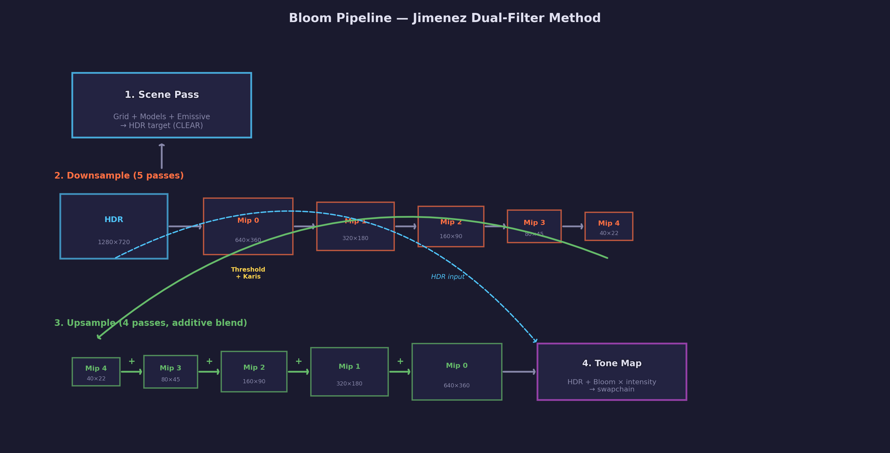
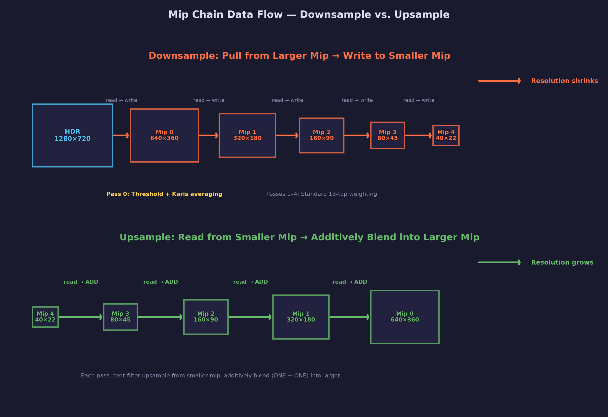
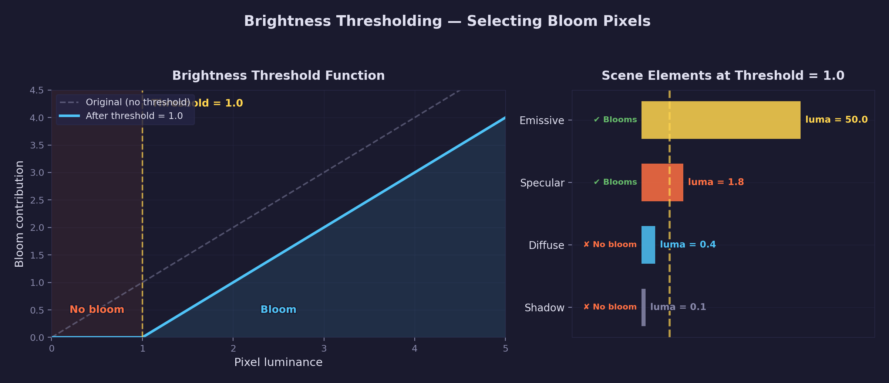
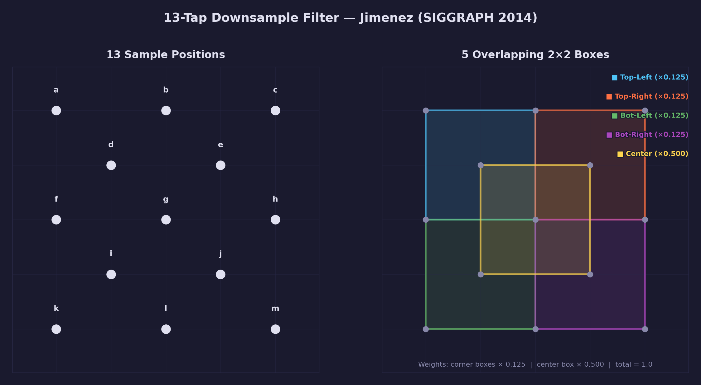
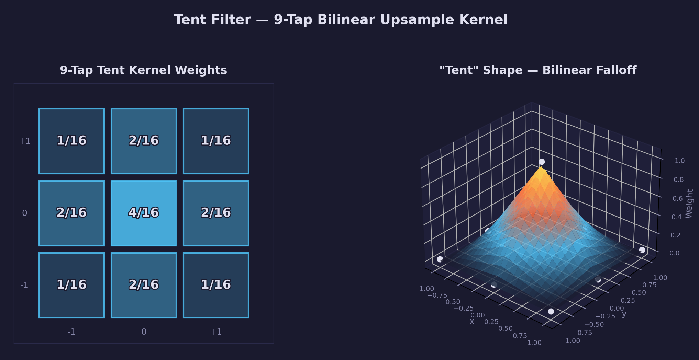

# Lesson 22 — Bloom (Jimenez Dual-Filter)

## What you'll learn

- The Jimenez dual-filter bloom method (SIGGRAPH 2014)
- 13-tap weighted downsample with Karis averaging for firefly suppression
- 9-tap tent-filter upsample with additive blending
- Multi-pass rendering with a mip chain of HDR textures
- Brightness thresholding to select bloom-contributing pixels
- Emissive objects as HDR light sources
- Point light attenuation (replacing Lesson 21's directional light)

## Result


An orbiting emissive sphere produces a soft, multi-scale glow — the
characteristic bloom effect. The CesiumMilkTruck and BoxTextured models
are lit by the sphere acting as a point light. The emissive sphere
outputs HDR values far above 1.0 (RGB of 50, 45, 40), which the bloom
pass detects and spreads into the surrounding area.

## Key concepts

### Why bloom?

HDR rendering (Lesson 21) preserves bright values above 1.0, but those
values are still just pixels. In reality, very bright objects cause light
to scatter in the eye's lens and in camera optics, creating a visible
glow around bright areas. Bloom simulates this scattering digitally.

### The Jimenez dual-filter method

Jorge Jimenez presented this method at SIGGRAPH 2014 ("Next Generation
Post Processing in Call of Duty: Advanced Warfare"). It is the
industry-standard bloom technique used in most modern game engines.

The method has two phases:

1. **Downsample chain** — Progressively halve the resolution, filtering
   the HDR image into 5 mip levels (640x360 → 320x180 → 160x90 →
   80x45 → 40x22 for a 1280x720 source)
2. **Upsample chain** — Progressively double back up, additively
   blending each level into the one above it

The result is a multi-scale glow: small bright spots produce tight halos,
while large bright areas produce wide, soft glows.

### Render pass structure

The full bloom pipeline runs four stages each frame:



1. **Scene pass** — Render the grid, lit models, and emissive sphere
   into an HDR render target (`R16G16B16A16_FLOAT`). The emissive sphere
   writes values far above 1.0 (e.g. RGB 50, 45, 40).
2. **Downsample chain** (5 passes) — Each pass reads from a larger
   texture and writes a filtered, half-resolution result to the next
   mip. Pass 0 also applies brightness thresholding and Karis averaging.
3. **Upsample chain** (4 passes) — Each pass reads from a smaller mip,
   applies a tent filter, and **additively blends** (ONE + ONE) the
   result into the next-larger mip. The existing downsample data is
   preserved — the upsample accumulates on top.
4. **Tone map pass** — Reads the original HDR target and the final
   bloom result (mip 0), combines them as
   `tonemap(hdr + bloom * intensity)`, and writes to the swapchain.

### Mip chain data flow

Understanding which mip reads from which is the key to the dual-filter
method. The downsample chain *pulls* data from larger mips into smaller
ones; the upsample chain *pushes* data from smaller mips back into
larger ones:



**Downsample direction:** Each pass binds the *previous* (larger) mip as
a texture input and renders into the *current* (smaller) mip as a color
target. Pass 0 reads from the full-resolution HDR target (1280x720) and
writes to mip 0 (640x360). Pass 1 reads mip 0 and writes to mip 1
(320x180), and so on.

**Upsample direction:** Each pass binds a *smaller* mip as the texture
input and renders into the *larger* mip as a color target — but with
`LOADOP_LOAD` to preserve the existing downsample data, and additive
blending so the tent-filtered result accumulates. Pass 0 reads mip 4
(40x22) and adds into mip 3 (80x45). The final pass adds into mip 0,
which then contains the combined multi-scale bloom.

### Brightness threshold

Not every pixel should bloom. A diffuse surface at luminance 0.4 should
remain un-bloomed, while an emissive surface at luminance 50.0 should
produce a strong glow. The brightness threshold controls this boundary.



For each sample, the shader computes:

```text
contribution = max(luminance - threshold, 0)
output       = pixel * (contribution / luminance)
```

This extracts only the portion of the pixel's brightness that exceeds
the threshold. At threshold 1.0, a pixel with luminance 1.8 contributes
only the excess 0.8 to bloom — its sub-threshold energy is discarded.
Shadow and diffuse pixels (luminance below 1.0) contribute nothing.

### 13-tap downsample filter

Each downsample pass uses 13 texture samples arranged in a specific
pattern across a 5x5 texel region. These samples are grouped into 5
overlapping 2x2 boxes:



The four corner boxes (top-left, top-right, bottom-left, bottom-right)
each receive a weight of 0.125 (1/8). The center box receives a weight
of 0.500 (1/2). The total weight sums to 1.0:

```text
result = 0.125 * (box_tl + box_tr + box_bl + box_br) + 0.5 * box_ct
```

**Why overlapping boxes?** A naive 2x2 box downsample takes 4 samples
at the corners of the destination texel. This creates visible banding
at mip boundaries because adjacent destination texels share no source
samples. The Jimenez filter overlaps its boxes so that neighboring
output texels draw from shared source regions, producing smooth
transitions across mip boundaries.

**Why weight the center box more?** The center box (d, e, i, j) samples
the area closest to the destination texel center. Giving it 4x the
weight of each corner box concentrates the filter's energy where it
matters most, producing a sharper result than uniform weighting.

### Karis averaging (firefly suppression)

On the first downsample pass only, each 2x2 box average is weighted by
`1 / (1 + luminance)` before combining. This is Karis averaging, named
after Brian Karis (Epic Games).


**The problem:** In HDR rendering, a single pixel can have a luminance
of 50 or higher (the emissive sphere in this lesson). When that pixel
lands in a 2x2 box with three dim neighbors (luminance ~0.5), a uniform
average produces a result dominated by the bright outlier. As the
bright object moves across pixel boundaries from frame to frame, which
box it falls into changes — causing the bloom to flicker.

**The solution:** The Karis weight `1 / (1 + luminance)` is a decreasing
function that approaches zero for very bright values. A dim pixel
(luma 0.5) gets weight 0.667, while a firefly pixel (luma 50) gets
weight 0.020. The bright pixel's contribution is dramatically reduced
relative to its neighbors, producing a stable average close to the
neighborhood's true brightness.

**When is it applied?** Only on pass 0 (HDR target → mip 0), where the
full dynamic range of the scene is present. Subsequent passes operate
on already-filtered data where extreme outliers have been suppressed.

### 9-tap tent-filter upsample

The upsample uses a 3x3 **tent filter** — a separable bilinear kernel
named for its tent-like cross-sectional shape:



A tent filter is the 2D extension of linear interpolation (a triangle
function). In one dimension, the weights form a triangle: low at the
edges, high at the center. In two dimensions, the weight at each sample
point is the product of the horizontal and vertical triangle weights:
`w(x,y) = (1 - |x|) * (1 - |y|)`. This produces the pyramid shape
visible in the 3D plot.

The 9 samples are taken at integer offsets (-1, 0, +1) in each axis,
with weights:

| Position | Weight |
|----------|--------|
| Corners (4 samples) | 1/16 each |
| Edges (4 samples) | 2/16 each |
| Center (1 sample) | 4/16 |

The total weight sums to 1.0. Because the tent filter falls off
smoothly from center to edges, it produces soft transitions without the
ringing artifacts that sharper kernels can introduce.

The upsample pipeline uses **additive blending** (`ONE + ONE`), so the
tent-filtered result from the smaller mip is added to the existing
content of the larger mip. This progressive accumulation across 4
upsample passes is what creates the multi-scale glow — each mip level
contributes a different spatial frequency.

### Point light

This lesson replaces Lesson 21's directional light with a point light:

$$
\text{attenuation} = \frac{1}{1 + 0.09d + 0.032d^2}
$$

where $d$ is the distance from the point light to the surface position in
world space.

The light orbits the scene as a visible emissive sphere, creating a
natural motivation for bloom — the bright sphere drives the glow effect.

## Math

This lesson uses:

- **Vectors** — [Math Lesson 01](../../math/01-vectors/) for positions
  and directions
- **Matrices** — [Math Lesson 05](../../math/05-matrices/) for MVP
  transforms
- **Projections** — [Math Lesson 06](../../math/06-projections/) for
  perspective projection
- **Color Spaces** — [Math Lesson 11](../../math/11-color-spaces/) for
  luminance (BT.709) and tone mapping operators

## Controls

| Key | Action |
|-----|--------|
| WASD + mouse | Camera movement |
| 1/2/3 | Tone map: none / Reinhard / ACES |
| +/- | Exposure up / down |
| B | Toggle bloom on / off |
| Up / Down | Bloom intensity +/- |
| Left / Right | Bloom threshold +/- |

## Building

```bash
cmake --build build --config Debug --target 22-bloom
```

If you modify the HLSL shaders, recompile before building:

```bash
python scripts/compile_shaders.py 22
```

## AI skill

This lesson has a matching Claude Code skill at
[`.claude/skills/bloom/SKILL.md`](../../../.claude/skills/bloom/SKILL.md).
Invoke it with `/bloom` or copy it into your own project to let Claude
add Jimenez dual-filter bloom to any SDL GPU application.

## Exercises

1. **Adjust bloom radius** — Change `BLOOM_MIP_COUNT` from 5 to 3 or 7.
   How does the number of mip levels affect the size and softness of
   the glow? Why does fewer levels produce a tighter bloom?

2. **Colored bloom** — Modify the emissive sphere's emission color to
   a saturated hue (e.g. pure red `(50, 0, 0)`). Notice how the bloom
   preserves the color of the bright source. Try placing multiple
   emissive spheres with different colors.

3. **Bloom on specular highlights** — Lower the bloom threshold to 0.5
   and increase light intensity. Now specular highlights on the truck
   and boxes also bloom. Compare the visual quality with threshold 0.0
   (everything blooms) vs 2.0 (only the sphere blooms).

4. **Compare with naive blur** — Replace the 13-tap downsample with a
   simple 2x2 box average (`(a+b+c+d)/4` at the 4 corners). Compare
   the bloom quality — you should see more visible banding at mip
   boundaries without the overlapping box pattern.
