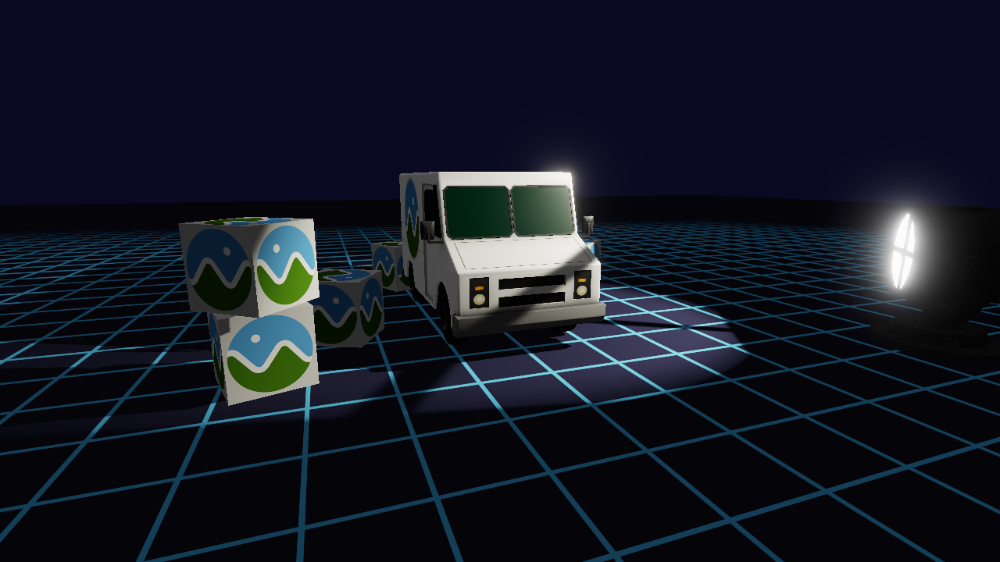

# Lesson 24 — Gobo Spotlight

Projected-texture spotlights — how theatrical lighting uses a gobo pattern,
cone falloff, and a single shadow map to create dramatic illumination.

## What you'll learn

- Spotlight cone with inner/outer angles and `smoothstep` falloff
- Gobo (cookie) texture projection through a spotlight using the light's
  view-projection matrix
- Single 2D shadow map from a spotlight's perspective frustum
- Why the same matrix serves triple duty: cone masking, gobo UV mapping,
  and shadow comparison
- Integrating a gobo spotlight with HDR rendering and bloom

## Result



A theatrical spotlight projects a window-frame gobo pattern onto a grid floor,
illuminating a CesiumMilkTruck and scattered crates. A low-poly searchlight
model marks the light source. The gobo pattern is clearly visible on the grid
surface, with soft cone edges and PCF-filtered shadows. Bloom makes the
searchlight lens glow.

## Key concepts

### Spotlight cone and falloff

A spotlight restricts illumination to a cone defined by two angles:

- **Inner angle** — full intensity within this half-angle (20 degrees here)
- **Outer angle** — intensity falls to zero at this half-angle (30 degrees)

The fragment shader computes the cosine of the angle between the spotlight
direction and the direction to each fragment, then uses `smoothstep` to
interpolate between the two boundaries:

```hlsl
float cos_angle = dot(L_frag, normalize(spot_dir));
float cone = smoothstep(cos_outer, cos_inner, cos_angle);
```

Because cosine is a decreasing function over 0 to 180 degrees, a larger angle
produces a smaller cosine. The `smoothstep` parameters are ordered
`(cos_outer, cos_inner)` so that fragments at the inner boundary get 1.0 and
fragments at the outer boundary get 0.0.

### Gobo texture projection

A **gobo** (short for "goes before optics") is a physical disc placed in a
theatrical light to project a pattern — windows, foliage, abstract shapes.
In real-time rendering, we simulate this by projecting a texture through the
spotlight cone.

The key insight is that a spotlight's frustum is identical to a perspective
camera frustum. The same view-projection matrix that defines the light cone
also maps world-space fragments into the gobo texture's UV space:

1. Transform the fragment into light clip space: `light_clip = light_vp * world_pos`
2. Perspective divide to get NDC: `light_ndc = light_clip.xyz / light_clip.w`
3. Remap NDC `[-1, 1]` to UV `[0, 1]`: `gobo_uv = light_ndc.xy * 0.5 + 0.5`
4. Flip Y for texture coordinates: `gobo_uv.y = 1.0 - gobo_uv.y`
5. Sample the gobo texture and multiply the result into the light contribution

Fragments outside the `[0, 1]` UV range fall outside the spotlight cone and
receive zero light — the `step()` functions in the shader enforce this boundary.

In `scene.frag.hlsl`, the gobo projection code sits inside the spotlight block:

```hlsl
/* Transform fragment into spotlight clip space. */
float4 light_clip = mul(light_vp, float4(world_pos, 1.0));
float3 light_ndc  = light_clip.xyz / light_clip.w;

/* Gobo texture projection — remap NDC to UV space. */
float2 gobo_uv = light_ndc.xy * 0.5 + 0.5;
gobo_uv.y = 1.0 - gobo_uv.y;

/* Sample gobo pattern (grayscale — use .r channel). */
float gobo = gobo_tex.Sample(gobo_smp, gobo_uv).r;
```

### One matrix, triple duty

The spotlight's view-projection matrix (`light_vp`) does three jobs in a
single transform:

1. **Shadow mapping** — maps fragments into light clip space for depth
   comparison against the shadow map
2. **Gobo projection** — the same clip-to-NDC-to-UV remapping samples the
   gobo pattern texture
3. **Cone masking** — fragments that project outside `[0, 1]` UV range are
   automatically excluded from illumination

This reuse is not a coincidence — it follows directly from the fact that a
spotlight is a perspective projection. The FOV of the light projection covers
the full outer cone angle: `FOV = 2 * outer_angle`.

### Shadow mapping from a spotlight

Unlike the omnidirectional cube maps from [Lesson 23](../23-point-light-shadows/),
a spotlight only needs a **single 2D depth texture**. The spotlight's
perspective frustum captures everything the light can see in one pass:

- Render the scene from the spotlight's view into a `D32_FLOAT` depth texture
- In the scene pass, transform fragments into light NDC and compare depth
- Apply PCF (2x2 percentage-closer filtering) for soft shadow edges

In `main.c`, the shadow pass renders all shadow casters (truck + crates) using
the `shadow_pipeline`, which has no color targets — only a depth-stencil
attachment. The shadow vertex shader transforms geometry by `light_vp * model`:

```hlsl
return mul(light_mvp, float4(input.pos, 1.0));
```

The fragment shader is empty — the GPU writes depth from `SV_Position.z`
automatically.

### Gobo texture format

The gobo texture uses `R8G8B8A8_UNORM` (not sRGB) because it represents a
linear light attenuation mask, not a color image. The shader samples only the
`.r` channel. Using sRGB would apply an unwanted gamma curve to the
attenuation values. The gobo sampler uses `LINEAR` filtering and
`CLAMP_TO_EDGE` addressing for smooth projected edges.

## Render pass order

The frame renders in five stages, matching the HDR pipeline from
[Lesson 22](../22-bloom/):

```text
1. Shadow pass     — depth-only, from spotlight's perspective
2. Scene pass      — HDR buffer (models + grid + gobo + shadows)
3. Bloom down      — 5 downsample passes (Jimenez 13-tap)
4. Bloom up        — 4 upsample passes (tent filter)
5. Tone map        — HDR + bloom → swapchain (ACES)
```

The shadow pass runs first so the depth texture is ready when the scene pass
samples it. The searchlight model is not a shadow caster (it sits at the light
source position and would incorrectly block its own light).

## Code walkthrough

### Spotlight setup (`SDL_AppInit`)

The spotlight is defined by position, target, cone angles, and color. In
`main.c`, these are constants at the top of the file. The light's
view-projection matrix is computed once at init (the light is static):

```c
mat4 light_view = mat4_look_at(spot_pos, spot_target, spot_up);
float outer_rad = SPOT_OUTER_DEG * FORGE_DEG2RAD;
mat4 light_proj = mat4_perspective(2.0f * outer_rad, 1.0f, SPOT_NEAR, SPOT_FAR);
state->light_vp = mat4_multiply(light_proj, light_view);
```

### Shadow resources

- **`shadow_depth_texture`** — 1024x1024 `D32_FLOAT` with `SAMPLER | DEPTH_STENCIL_TARGET` usage
- **`shadow_sampler`** — `NEAREST` filter, `CLAMP_TO_EDGE` (manual PCF in shader)
- **`shadow_pipeline`** — same vertex layout as scene, no color targets, depth-only

### Gobo resources

- **`gobo_texture`** — PNG loaded as `R8G8B8A8_UNORM` (linear, not sRGB)
- **`gobo_sampler`** — `LINEAR` filter, `CLAMP_TO_EDGE`

### Scene shader bindings

The scene fragment shader binds three texture-sampler pairs:

| Slot | Texture | Purpose |
|------|---------|---------|
| 0 | Diffuse texture | Model albedo (sRGB) |
| 1 | Shadow depth map | Spotlight shadow comparison |
| 2 | Gobo pattern | Projected texture attenuation |

The grid fragment shader binds two (slots 0-1: shadow + gobo, no diffuse).

## Math

This lesson uses:

- [Math Lesson 05 — Matrices](../../math/05-matrices/) for view and projection
  matrix construction
- [Math Lesson 06 — Projections](../../math/06-projections/) for the spotlight's
  perspective projection (FOV = 2 * outer angle)
- [Math Lesson 09 — View Matrix](../../math/09-view-matrix/) for
  `mat4_look_at()` constructing the spotlight's view matrix
- `mat4_perspective`, `mat4_look_at`, `mat4_multiply`, `vec3_normalize` from
  [`common/math/forge_math.h`](../../../common/math/README.md)

## Shaders

| File | Purpose |
|------|---------|
| `scene.vert.hlsl` | Transforms vertices with spotlight projection coordinates for gobo pattern sampling |
| `scene.frag.hlsl` | Blinn-Phong with spotlight cone falloff, gobo texture projection, and shadow mapping |
| `shadow.vert.hlsl` | Transforms vertices for spotlight shadow map generation |
| `shadow.frag.hlsl` | Empty fragment shader for depth-only shadow pass |
| `grid.vert.hlsl` | Grid vertex shader with spotlight projection coordinates |
| `grid.frag.hlsl` | Anti-aliased procedural grid with spotlight, gobo projection, and shadow receiving |
| `tonemap.vert.hlsl` | Fullscreen quad via `SV_VertexID` for the tone mapping pass |
| `tonemap.frag.hlsl` | Tone mapping with bloom compositing |
| `bloom_downsample.frag.hlsl` | 13-tap weighted downsample with Karis averaging |
| `bloom_upsample.frag.hlsl` | 9-tap tent filter upsample with additive blending |

## Building

```bash
cmake -B build
cmake --build build --config Debug

# Windows
build\lessons\gpu\24-gobo-spotlight\Debug\24-gobo-spotlight.exe

# Linux / macOS
./build/lessons/gpu/24-gobo-spotlight/24-gobo-spotlight
```

## Controls

| Key | Action |
|-----|--------|
| WASD / Space / LShift | Move camera |
| Mouse | Look around |
| Escape | Release mouse / quit |

## AI skill

This lesson's pattern is available as a reusable Claude Code skill:

- **Skill file**: [`.claude/skills/gobo-spotlight/SKILL.md`](../../../.claude/skills/gobo-spotlight/SKILL.md)
- **Invoke**: `/gobo-spotlight`

You can copy this skill into your own project's `.claude/skills/` directory
to use the same pattern with Claude Code.

## What's next

[Lesson 25 — Shader Noise](../25-shader-noise/) applies noise functions in
fragment shaders — GPU-friendly hash functions, Perlin/simplex noise, and
blue noise dithering for procedural textures and effects.

## Exercises

1. **Animate the spotlight** — Make the spotlight rotate slowly around the
   scene by updating `spot_pos` and the `light_vp` matrix each frame.
   Recalculate the shadow map every frame to match the moving light.

2. **Try different gobo patterns** — Replace `gobo_window.png` with your own
   grayscale image (a starburst, tree branches, venetian blinds). Any
   grayscale PNG works — white areas pass light, black areas block it.

3. **Add a second spotlight** — Add a second spotlight with a different color
   and gobo pattern. You will need a second shadow map, a second gobo texture,
   and additional sampler slots in the fragment shader. Compare how two
   overlapping gobo projections interact.
