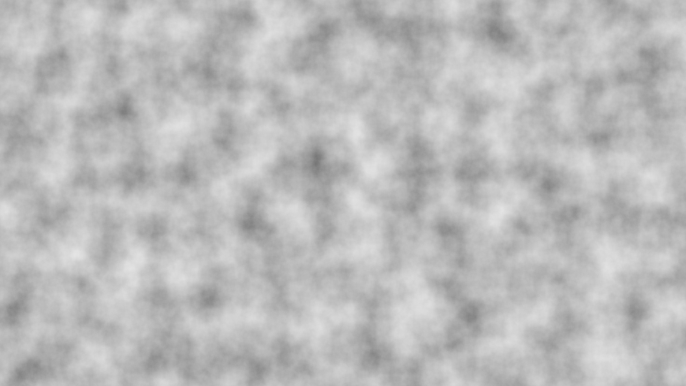

# Lesson 25 — Shader Noise

Procedural noise functions running entirely on the GPU, from hash-based
white noise to multi-octave fBm and domain warping.

## What you'll learn

- Porting integer hash functions (Wang hash) to HLSL for GPU-side randomness
- White noise — per-cell random values from deterministic hashing
- Value noise — bilinear interpolation of hashed lattice values
- Gradient noise — Perlin 2D with quintic fade curves
- fBm (fractal Brownian motion) — octave stacking for natural patterns
- Domain warping — composing fBm with itself for organic shapes
- Procedural terrain — mapping noise height to biome colors
- Interleaved Gradient Noise for dithering (banding reduction)
- The fullscreen quad pattern (SV_VertexID, no vertex buffer)

## Result



A fullscreen procedural noise visualization with six switchable modes.
Press 1–6 to cycle through white noise, value noise, Perlin gradient
noise, fBm, domain warping, and procedural terrain coloring. All noise
is generated per-pixel in the fragment shader — no texture assets needed.

## Key concepts

### Why GPU noise?

Math Lessons 12–14 teach noise algorithms in C on the CPU. But real-time
graphics evaluate noise per-pixel every frame — potentially millions of
evaluations. Fragment shaders run these evaluations in parallel across
thousands of GPU cores, making procedural noise practical at interactive
frame rates.

GPU shaders lack `rand()` or any persistent mutable state. Instead, we
use **deterministic integer hash functions** that map coordinates to
pseudo-random values. The same input always produces the same output,
which makes noise patterns stable and repeatable across frames.

### Hash functions on the GPU

This lesson ports Thomas Wang's 32-bit integer hash from the math
library (`forge_hash_wang`) to HLSL:

```hlsl
uint wang_hash(uint seed)
{
    seed = (seed ^ 61u) ^ (seed >> 16u);
    seed *= 9u;
    seed = seed ^ (seed >> 4u);
    seed *= 0x27d4eb2du;
    seed = seed ^ (seed >> 15u);
    return seed;
}
```

Each line applies a different mixing operation (XOR-shift, multiply)
to spread entropy across all 32 bits. The constants were chosen for
good **avalanche properties** — changing one input bit flips
approximately half the output bits.

For 2D coordinates, we cascade hashes using the Boost `hash_combine`
pattern:

```hlsl
uint hash2d_uint(int2 p)
{
    uint h = wang_hash(uint(p.x));
    h = hash_combine(h, uint(p.y));
    return wang_hash(h);
}
```

### From white noise to smooth noise

**White noise** hashes integer grid coordinates directly — each cell
gets an independent random value, producing TV-static patterns.

**Value noise** smooths the randomness by bilinearly interpolating
between the four surrounding lattice values, weighted by a Hermite
smoothstep curve:

$$
s(t) = 3t^2 - 2t^3
$$

This curve has zero first derivative at $t = 0$ and $t = 1$,
eliminating visible seams at cell boundaries.

### Gradient noise (Perlin)

Perlin noise assigns random **gradient vectors** at lattice points
instead of random values. At each point, the noise value is the smooth
interpolation of dot products between gradients and distance vectors.

The quintic fade curve (Perlin 2002) ensures C2 continuity — zero
first *and* second derivatives at boundaries:

$$
f(t) = 6t^5 - 15t^4 + 10t^3
$$

This eliminates the subtle creases visible with Hermite smoothstep.

### fBm (fractal Brownian motion)

fBm stacks multiple **octaves** of noise at increasing frequency and
decreasing amplitude:

```text
value = 0
for each octave:
    value += amplitude * perlin(p * frequency)
    frequency *= lacunarity   (default 2.0 — double frequency)
    amplitude *= persistence  (default 0.5 — halve amplitude)
```

Six octaves provide a good balance between visual detail and
computational cost. The result approximates natural fractal patterns —
clouds, terrain contours, organic textures.

### Domain warping

Domain warping uses noise output to distort the *input coordinates*
of another noise evaluation, creating organic, flowing patterns:

```text
q = (fBm(p + offset_a), fBm(p + offset_b))
r = (fBm(p + 4*q + offset_c), fBm(p + 4*q + offset_d))
result = fBm(p + 4*r)
```

The constant offsets prevent symmetry. The factor 4.0 controls warp
intensity. This technique (Inigo Quilez, 2002) produces marble, smoke,
and fluid-like patterns from a single noise function.

### Dithering with Interleaved Gradient Noise

8-bit color output creates visible **banding** in smooth gradients.
Interleaved Gradient Noise (Jimenez 2014) breaks up banding by adding
sub-pixel noise with blue-noise-like spectral properties:

```hlsl
float ign(float2 screen_pos)
{
    float3 ign_coeffs = float3(0.06711056, 0.00583715, 52.9829189);
    return frac(ign_coeffs.z * frac(dot(screen_pos, ign_coeffs.xy)));
}
```

The noise magnitude is 1/255 (one quantization step) — invisible in
smooth areas but eliminates the staircase pattern of quantization.

### The fullscreen quad pattern

This lesson uses the SV_VertexID fullscreen quad technique from
Lesson 21 (HDR & Tone Mapping). Six vertices (two triangles) are
generated entirely from the vertex ID — no vertex buffer needed:

```hlsl
VSOutput main(uint vertex_id : SV_VertexID)
{
    float2 uv;
    uv.x = (vertex_id == 1 || vertex_id == 4 || vertex_id == 5) ? 1.0 : 0.0;
    uv.y = (vertex_id == 2 || vertex_id == 3 || vertex_id == 5) ? 1.0 : 0.0;
    // ...
}
```

## Math

This lesson uses:

- **Hash functions** — [Math Lesson 12](../../math/12-hash-functions/)
  for Wang hash, hash_combine, and hash-to-float mapping
- **Gradient noise** — [Math Lesson 13](../../math/13-gradient-noise/)
  for Perlin noise, quintic interpolation, fBm, and domain warping
- **Blue noise & dithering** — [Math Lesson 14](../../math/14-blue-noise-sequences/)
  for Interleaved Gradient Noise and spectral properties of dithering
- **Bilinear interpolation** — [Math Lesson 03](../../math/03-bilinear-interpolation/)
  for understanding the smoothstep-weighted interpolation in value noise

## Controls

| Key | Action |
|-----|--------|
| 1 | White noise (hash-based) |
| 2 | Value noise (interpolated) |
| 3 | Gradient noise (Perlin 2D) |
| 4 | fBm (fractal Brownian motion) |
| 5 | Domain warping |
| 6 | Procedural terrain |
| D | Toggle dithering |
| +/- | Adjust noise scale |
| Space | Pause/resume animation |
| Escape | Quit |

## Shaders

| File | Purpose |
|------|---------|
| `noise.vert.hlsl` | Fullscreen quad via `SV_VertexID` for noise visualization |
| `noise.frag.hlsl` | GPU noise functions: white noise, value noise, gradient (Perlin) noise, fBm, domain warping, and procedural terrain coloring |

## Building

```bash
cmake -B build
cmake --build build --config Debug --target 25-shader-noise
```

Run:

```bash
python scripts/run.py 25
```

## AI skill

The matching skill
[`.claude/skills/shader-noise/SKILL.md`](../../../.claude/skills/shader-noise/SKILL.md)
teaches AI agents to add GPU noise to any SDL3 project. Invoke with
`/shader-noise` or copy it into your own project.

## What's next

Lesson 26 will apply noise to 3D surfaces — using fBm for vertex
displacement, normal perturbation, and animated procedural materials
on real meshes.

## Exercises

1. **Add simplex noise.** Implement 2D simplex noise in the fragment
   shader (see Math Lesson 13 for the algorithm). Simplex noise uses a
   triangular grid instead of a square grid, requiring fewer gradient
   evaluations (3 instead of 4 per sample). Add it as mode 7 and
   compare the visual quality and performance with Perlin noise.

2. **Dissolve effect.** Load a texture (from Lesson 04) and use noise
   as a threshold mask: pixels where noise > threshold are discarded
   (`clip()`). Animate the threshold from 0 to 1 to create a dissolve
   effect. Try different noise types — fBm produces organic dissolves
   while white noise produces sparkle patterns.

3. **Animated domain warping.** Add time-dependent offsets to the
   domain warp function so the patterns flow and swirl. Experiment
   with different time scales for the inner vs. outer warp layers.
   Try adding a color palette that shifts based on the warp magnitude.

4. **Noise-based height map with lighting.** Use the fBm terrain
   mode as a starting point. Compute surface normals by sampling the
   noise at neighboring positions and taking the cross product of the
   differences. Apply directional lighting to the terrain for a 3D
   appearance. This is the foundation of procedural terrain rendering.
