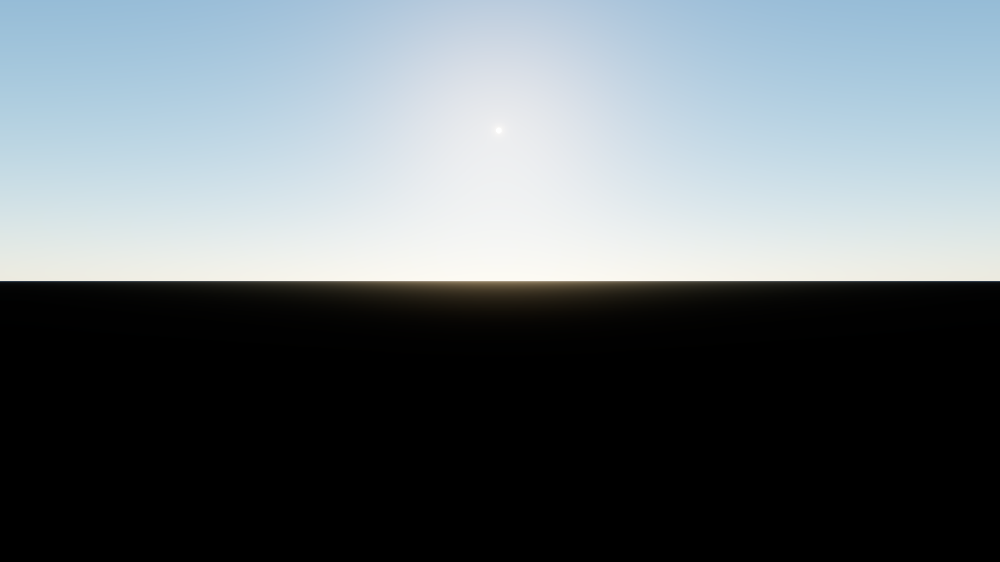
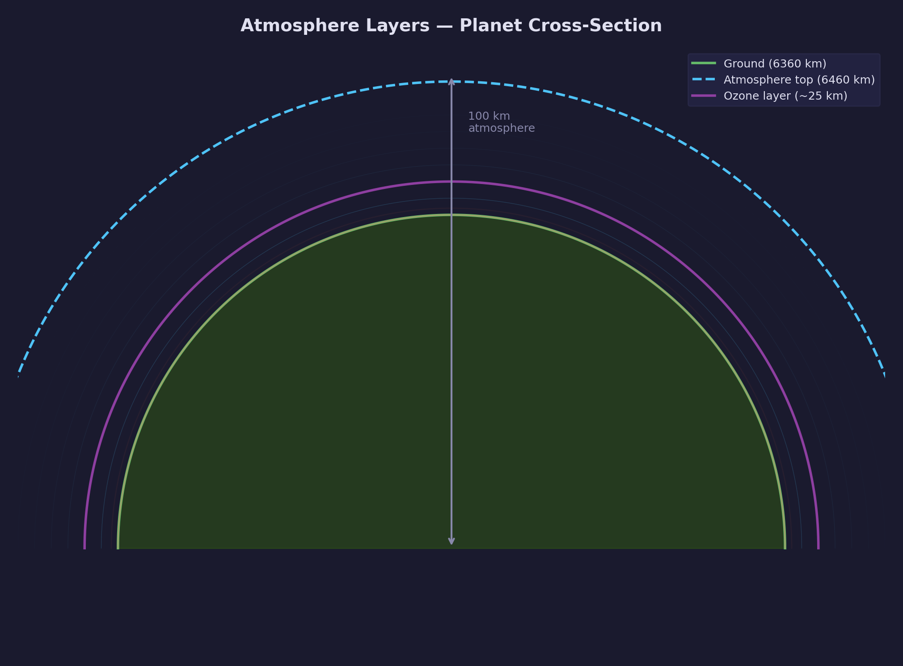
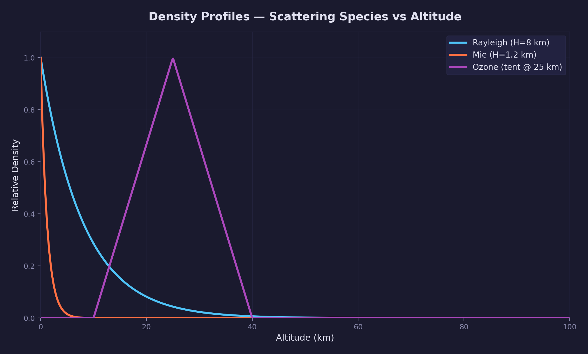
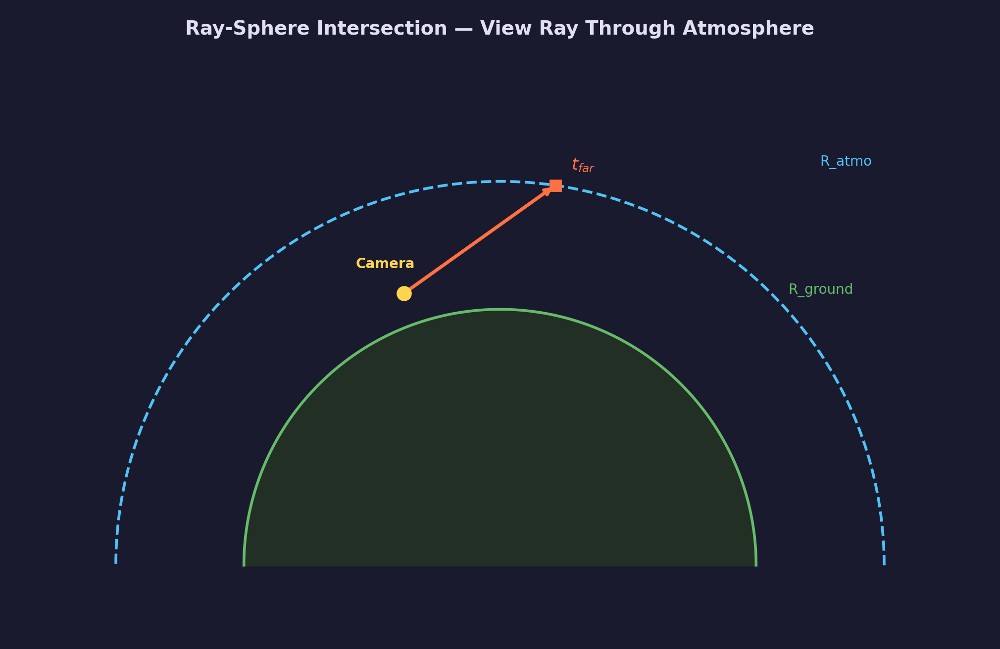
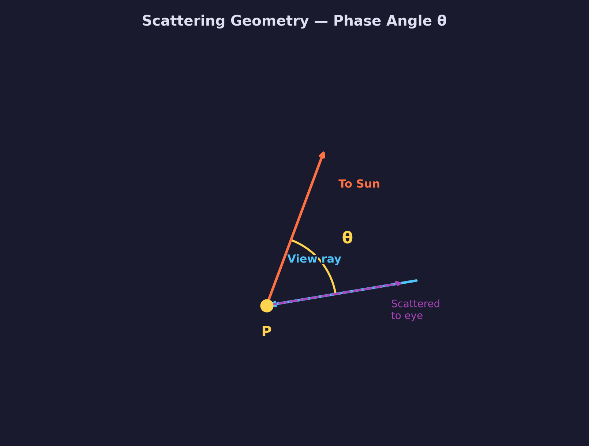
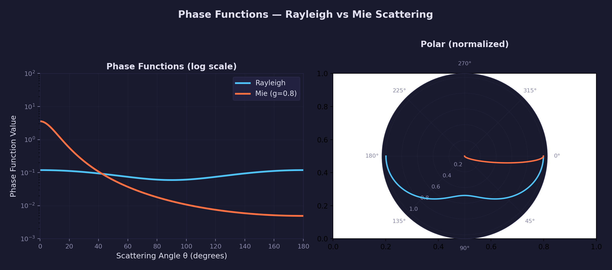
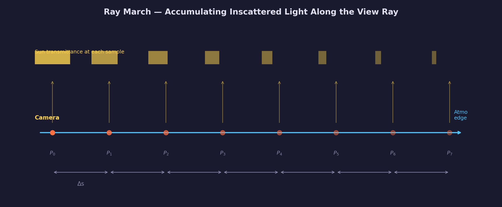
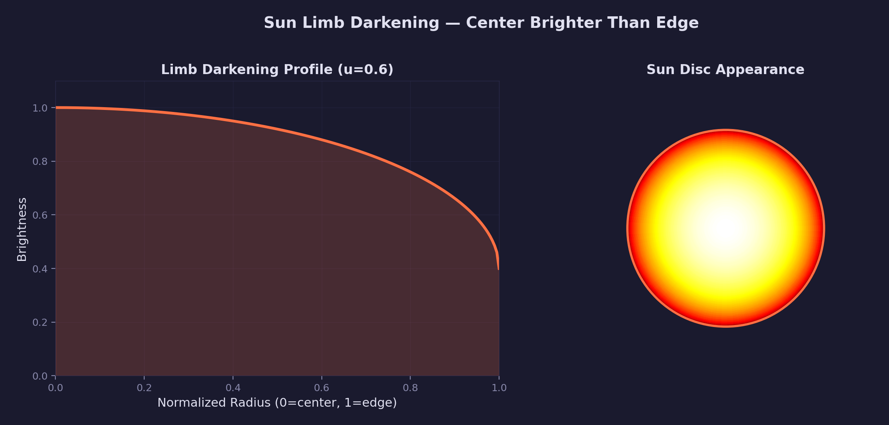
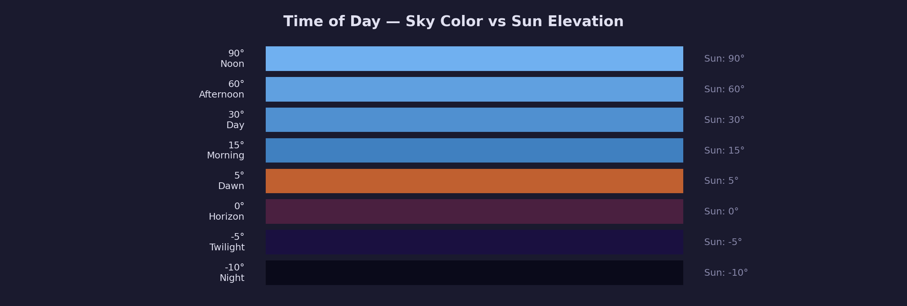
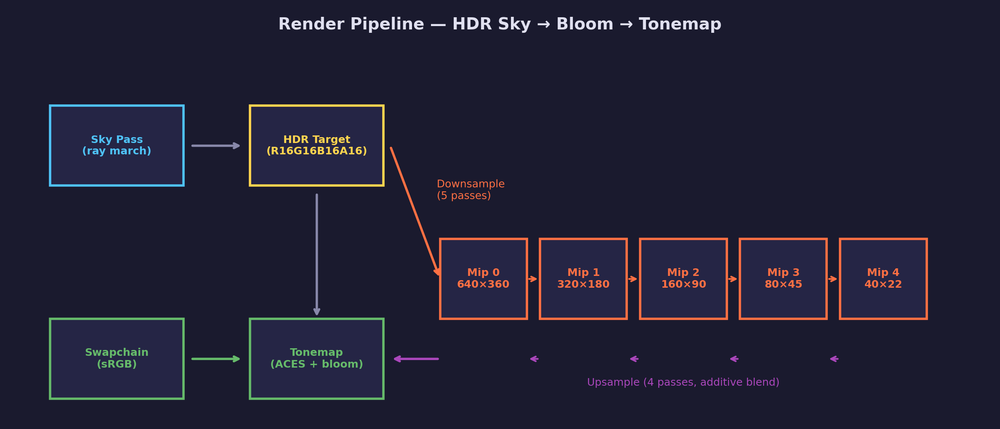

# Lesson 26 — Procedural Sky (Hillaire)

A physically-based atmospheric sky with LUT-accelerated transmittance
and multi-scattering, using per-pixel ray marching through Earth's
atmosphere with Rayleigh, Mie, and ozone scattering.

## What you'll learn

- Per-pixel ray marching through a planetary atmosphere
- Rayleigh scattering (wavelength-dependent — why the sky is blue)
- Mie scattering (forward-peaked — sun halo and hazy horizons)
- Ozone absorption (blue-purple tint during twilight)
- The Beer-Lambert law for light extinction along a path
- Phase functions (Rayleigh symmetric, Henyey-Greenstein forward)
- Earth shadow — testing whether the planet blocks sunlight at each sample
- Ray-sphere intersection for atmosphere entry/exit
- Compute-shader LUT precomputation (transmittance + multi-scattering)
- Bruneton non-linear UV parameterization for LUT precision
- Multi-scattering via geometric power series summation
- Ray matrix reconstruction for world-space view directions
- HDR rendering with Jimenez dual-filter bloom
- ACES filmic tone mapping with exposure control
- Sun disc rendering with limb darkening
- Quaternion fly camera in planet-centric (km) coordinates

## Result



A real-time procedural sky with physically correct colors at any time of
day. The sun creates natural bloom through HDR values exceeding 1.0.
Arrow keys change the sun angle — watch the sky transition from deep blue
noon to orange sunset to dark twilight. WASD + mouse lets you fly through
the atmosphere in kilometers.

## Controls

| Key | Action |
|-----|--------|
| WASD / Space / C | Fly camera (Space = up, C = down) |
| LShift | 10× speed boost |
| Mouse | Look around |
| Left/Right arrows | Sun azimuth |
| Up/Down arrows | Sun elevation |
| T | Toggle auto sun rotation |
| 1/2/3 | Tonemap: Clamp / Reinhard / ACES |
| =/+ | Increase exposure |
| - | Decrease exposure |
| B | Toggle bloom |
| Escape | Release mouse / quit |

## Key concepts

### Why per-pixel ray marching?

Pre-baked skybox textures are static — they capture one moment in time
and can't change with the sun angle. Full-resolution LUTs that
pre-compute the entire sky into textures are fast but hide the physics.

This lesson computes the sky per pixel, every frame. A ray from the
camera through each pixel marches through Earth's atmosphere, accumulating
scattered sunlight at each step. The result is a physically correct sky
that responds naturally to any sun angle, camera altitude, or atmosphere
configuration.

The approach follows Sebastien Hillaire's atmospheric model (EGSR 2020).
Two precomputed LUTs replace the expensive inner march and add
multi-scattering, reducing per-pixel cost while improving quality:

- **Transmittance LUT** — O(1) lookup replaces the inner ray march
  (previously 8 steps at each of 32 outer steps = 256 evaluations/pixel)
- **Multi-scattering LUT** — adds light from 2nd+ order bounces that
  were entirely missing from single-scatter-only rendering

### Atmosphere structure



Earth's atmosphere extends from the ground (radius 6360 km) to
approximately 100 km altitude (radius 6460 km). Three species contribute
to light scattering and absorption:

| Species | Scattering σ\_s (km⁻¹) | Absorption σ\_a (km⁻¹) | Scale height |
|---------|------------------------|------------------------|--------------|
| Rayleigh | (5.802, 13.558, 33.1)×10⁻³ | 0 | 8 km |
| Mie | 3.996×10⁻³ | 0.444×10⁻³ | 1.2 km |
| Ozone | 0 | (0.650, 1.881, 0.085)×10⁻³ | Tent @ 25 km |

These constants come from Hillaire's EGSR 2020 paper (Table 1) and are
encoded as `static const` values in the shader.

### Density profiles



Each species has a characteristic density profile that determines how
concentrated it is at different altitudes:

- **Rayleigh** — Exponential decay with 8 km scale height. At sea level
  the density is 1.0; at 8 km it drops to 1/e ≈ 0.37. This models
  molecular scattering by nitrogen and oxygen.

- **Mie** — Exponential decay with 1.2 km scale height. Aerosol particles
  (dust, water droplets) are concentrated near the surface, falling off
  rapidly with altitude.

- **Ozone** — A tent function centered at 25 km with 15 km half-width.
  This approximates the ozone layer, which absorbs red/green wavelengths
  and contributes to the blue zenith and purple twilight colors.

```hlsl
float rho_rayleigh = exp(-altitude / 8.0);  /* exponential decay */
float rho_mie      = exp(-altitude / 1.2);  /* concentrated near surface */
float rho_ozone    = max(0, 1 - abs(altitude - 25.0) / 15.0);  /* tent */
```

### Ray-sphere intersection



Every pixel starts by casting a ray from the camera and finding where it
enters and exits the atmosphere sphere. This is a standard quadratic
ray-sphere test:

Given a ray with origin **o** and direction **d**, and a sphere of
radius r centered at the origin:

```text
|o + t·d|² = r²
t²(d·d) + 2t(o·d) + (o·o - r²) = 0
```

The discriminant tells us whether the ray hits the sphere, and the two
roots give us `t_near` (entry) and `t_far` (exit). If the camera is
inside the atmosphere, we start marching from t=0 instead of the entry
point. If the ray hits the ground sphere, we stop the march there.

### Scattering geometry



At each sample point along the view ray, sunlight arrives from the sun
direction and scatters toward the camera. The **scattering angle θ** is
the angle between the sun direction and the view ray direction:

```hlsl
float cos_theta = dot(ray_dir, sun_dir);
```

This angle determines how much light is redirected toward the viewer,
as described by the phase functions.

### Phase functions



Phase functions describe the angular distribution of scattered light.
Two species, two very different behaviors:

**Rayleigh phase function** — symmetric scattering by molecules:

```hlsl
float rayleigh_phase(float cos_theta) {
    return (3.0 / (16.0 * PI)) * (1.0 + cos_theta * cos_theta);
}
```

The cos²θ term means forward and backward scattering are equally strong,
while 90° scattering is weakest. This is why the blue sky is relatively
uniform.

**Henyey-Greenstein phase function** — forward-peaked scattering by
aerosols:

```hlsl
float mie_phase_hg(float cos_theta, float g) {
    float g2 = g * g;
    float denom = 1.0 + g2 - 2.0 * g * cos_theta;
    return (1.0 / (4.0 * PI)) * (1.0 - g2) / (denom * sqrt(denom));
}
```

With g=0.8, light is strongly peaked in the forward direction. This
creates the bright halo (aureole) around the sun and the white glare
near the horizon.

### The ray march



The outer loop marches along the view ray from the camera to the
atmosphere boundary, sampling the medium at regular intervals:

```hlsl
for (int i = 0; i < num_steps; i++) {
    float t = t_near + (float(i) + 0.5) * step_size;
    float3 pos = ray_origin + ray_dir * t;

    MediumSample med = sample_medium(pos);
    float3 sun_trans = sample_transmittance(length(pos), cos_sun_zenith);
    float3 ms = sample_multiscatter(altitude, cos_sun_zenith);

    /* Earth shadow: is the sun visible from this sample point? */
    bool sun_blocked = ray_sphere_intersect(
        pos, sun_dir, R_GROUND, t_shadow_near, t_shadow_far);
    float earth_shadow = (sun_blocked && t_shadow_near >= 0.0) ? 0.0 : 1.0;
    earth_shadow *= saturate(cos_sun_zenith * 10.0 + 0.5);

    /* Single scatter (shadowed) + multi-scatter (not shadowed) */
    float3 S = (scatter_r + scatter_m) * sun_trans * earth_shadow * sun_intensity
             + ms * med.scatter * sun_intensity;

    /* Analytical integration for better accuracy */
    float3 step_ext = exp(-med.extinction * step_size);
    float3 integral = (1.0 - step_ext) / max(med.extinction, 1e-6);
    inscatter += S * integral * transmittance;

    transmittance *= step_ext;
}
```

At each step:

1. **Sample the medium** — get scattering and extinction coefficients
   from the density profiles
2. **Look up sun transmittance** — O(1) texture fetch from the
   precomputed LUT (replaces the 8-step inner march)
3. **Look up multi-scattering** — adds higher-order bounce contribution
4. **Earth shadow test** — check if the planet blocks sunlight at this
   point (see below)
5. **Accumulate inscattered light** — multiply by phase functions and
   the current view transmittance
6. **Update transmittance** — Beer-Lambert law reduces it exponentially

The analytical integration `(1 - exp(-ext*ds)) / ext` is more accurate
than the naive `ext * ds` approximation, especially for large step sizes.

### Earth shadow

At each sample point along the view ray, the sun may or may not be
visible. Points high in the atmosphere with the sun overhead receive
direct sunlight. But points on the far side of the planet — or at low
altitude when the sun is near the horizon — are in Earth's shadow.

The test is a ray-sphere intersection from the sample point toward the
sun. If the ray hits the ground sphere (`t_shadow_near >= 0`), the sun
is occluded:

```hlsl
bool sun_blocked = ray_sphere_intersect(
    pos, sun_dir, R_GROUND, t_shadow_near, t_shadow_far);
float earth_shadow = (sun_blocked && t_shadow_near >= 0.0) ? 0.0 : 1.0;
```

The **horizon fade** smooths the transition near the terminator (the
boundary between lit and shadowed atmosphere). Without it, the shadow
boundary creates a visible hard edge in the sky:

```hlsl
earth_shadow *= saturate(cos_sun_zenith * 10.0 + 0.5);
```

This fades the shadow over ~2.9° around the local horizon at each
sample point.

**Why earth shadow is critical for sunset colors:** At sunset, the sun
sits near the horizon. Sample points along a horizontal view ray span
a range of local sun zenith angles — some points see the sun above
their local horizon, others see it below. Without earth shadow, all
points contribute inscattered light, including points where the planet
blocks the sun. These incorrectly-lit points add cold blue light that
dilutes the warm Rayleigh colors. With earth shadow, only points with
a clear line of sight to the sun contribute single-scatter light.
Those points receive sunlight that has traveled a long atmospheric
path, losing blue wavelengths to Rayleigh scattering, producing the
characteristic orange and red sunset gradient.

**Single scatter vs multi-scatter:** Earth shadow applies only to the
single-scatter term. Multi-scattering light arrives from all directions
(not just the sun), so it is not blocked by the planet in the same way.
The multi-scattering LUT already accounts for earth shadow during its
own precomputation (see below).

### Transmittance LUT

Sun transmittance — the fraction of sunlight reaching a point — depends
only on two parameters: the **view height** (distance from planet center)
and the **cosine of the zenith angle** (angle between the up direction
and the ray). It does not depend on view direction or azimuth.

This makes transmittance a natural candidate for precomputation into a
2D lookup table. A compute shader (256×64 texels) evaluates the full
40-step ray march once per texel at startup. The fragment shader then
replaces the inner march with a single texture fetch — reducing per-pixel
cost from O(outer×inner) to O(outer).


The image above shows the transmittance LUT visualized directly. The
horizontal axis is the zenith angle cosine (left = looking up, right =
looking toward/below the horizon) and the vertical axis is altitude
(bottom = sea level, top = atmosphere edge). White means full
transmittance (short path, little extinction). The warm orange-to-red
gradient at the right edge shows long atmospheric paths where blue
wavelengths have been scattered away — this is the data that produces
sunset colors. The dark region at the bottom-right represents rays
pointing below the horizon at low altitude, where the path through
dense atmosphere extinguishes nearly all light.

**Bruneton non-linear UV parameterization:** The UV mapping is not linear
in (height, cos\_zenith). Instead, it uses the ray distance through the
atmosphere as an intermediate variable (from Bruneton & Neyret 2008).
This concentrates precision near the horizon where transmittance changes
fastest — a linear mapping would waste most of its resolution on the
slowly-varying zenith region.

```text
H = sqrt(R_ATMO² - R_GROUND²)     — max geometric horizon distance
rho = sqrt(r² - R_GROUND²)         — distance to ground tangent point
d_min = R_ATMO - r                  — shortest path (straight up)
d_max = rho + H                     — longest path (toward horizon)

x_mu = (d - d_min) / (d_max - d_min)  — UV.x (non-linear in cos_zenith)
x_r = rho / H                          — UV.y (non-linear in view_height)
```

**Forward and inverse mappings must match exactly.** The compute shader
uses an inverse mapping (UV → parameters) to decide which
(view\_height, cos\_zenith) pair each texel represents. The fragment
shader uses a forward mapping (parameters → UV) to look up values.
These must be exact mathematical inverses. If the forward mapping
computes the ray distance `d` differently from the inverse mapping —
for example, by clipping to the ground intersection instead of always
using the atmosphere sphere distance — the UV round-trip will look up
the wrong texel for below-horizon rays. Use the same formula in both
directions:

```hlsl
/* Forward mapping: always use atmosphere sphere distance (not ground) */
float discriminant = view_height * view_height
    * (cos_zenith * cos_zenith - 1.0) + R_ATMO * R_ATMO;
float d = max(0.0, -view_height * cos_zenith
    + sqrt(max(0.0, discriminant)));
```

### Multi-scattering LUT

Single scattering captures light that scatters exactly once toward the
camera. In reality, scattered light bounces between molecules many times.
These higher-order bounces fill in shadows and brighten the horizon,
creating a more natural-looking sky.

The multi-scattering LUT (32×32 texels) computes this contribution using
a geometric power series. For each (altitude, sun\_zenith) pair:

1. **Sample 64 directions** on the unit sphere (8×8 stratified grid)
2. For each direction, march 20 steps through the atmosphere
3. Accumulate **L\_2nd** (luminance from second-order scattering) and
   **f\_ms** (rescattering fraction — how much scattered light scatters
   again)
4. Sum infinite bounces via the geometric series:
   **Ψ = L\_2nd / (1 - f\_ms)**

Higher-order scattering is nearly isotropic (direction-independent), so
an isotropic phase function (1/4π) is used instead of the
direction-dependent Rayleigh and Mie phases. This is why the LUT only
needs 2 parameters, not 3.

**Earth shadow in the multi-scatter computation:** The inner march for
each of the 64 directions must also include the earth shadow test — the
same `ray_sphere_intersect` + `horizon_fade` used in the fragment shader.
Without it, the LUT stores non-zero scattered luminance for sun angles
where the planet actually blocks sunlight at most sample points. The
symptom is that warm sunset colors appear only *after* the sun drops
below the horizon and persist indefinitely — the multi-scatter term
reads these incorrect pre-baked values from the LUT even though the
single-scatter term has been correctly zeroed by the fragment shader's
earth shadow.

### Sun transmittance and sunset colors


The transmittance LUT encodes how much sunlight reaches each point in
the atmosphere. At noon, sunlight travels a short path straight down —
little extinction occurs, and the sky is bright blue (Rayleigh scattering
favors short wavelengths).

At sunset, sunlight must travel a long path through dense low-altitude
atmosphere. The path length is much greater, causing heavy extinction.
Blue and green wavelengths are scattered away first (they have the
highest Rayleigh coefficients), leaving predominantly red and orange
light — this is why sunsets are orange.

For these warm colors to actually appear in the rendered sky, earth
shadow (see above) must be present. Without it, sample points in the
planet's shadow still contribute cold blue inscattered light, washing
out the warm Rayleigh gradient. Earth shadow ensures that only points
with a clear line of sight to the sun contribute single-scatter light —
and at those points, the long atmospheric path has already filtered the
sunlight to orange and red.

### Sun disc with limb darkening



The sun disc is rendered on top of the atmosphere, using a smooth-edged
circle at the sun's angular radius (0.53°). **Limb darkening** makes the
disc brighter at the center and dimmer at the edges:

```hlsl
float cos_limb = sqrt(max(0, 1 - r * r));
float limb_darkening = 1 - 0.6 * (1 - cos_limb);
```

This is a physical effect — at the sun's edge, we view through more of
the sun's cooler outer layers, which emit less light. The coefficient
u=0.6 is an empirical value for the visible spectrum.

The sun's color is modulated by the view transmittance, so it naturally
reddens at sunset — the same extinction that colors the sky also colors
the sun.

### Time of day



The sun elevation angle controls the entire mood of the sky:

- **Night** (sun below -10°) — no direct illumination, dark sky
- **Twilight** (-10° to 0°) — ozone absorption creates purple tones
- **Sunrise/sunset** (0° to 5°) — long atmospheric paths produce orange
- **Daytime** (5° to 90°) — short paths, Rayleigh dominates, blue sky

All of these transitions happen naturally from the physics — no artistic
color grading needed.

### Render pipeline



The rendering has two phases: one-time LUT precomputation and per-frame
sky rendering.

**One-time compute passes** (at startup):

1. **Transmittance LUT** (256×64) — 40-step ray march per texel, stores
   exp(-optical\_depth) as R16G16B16A16\_FLOAT
2. **Multi-scattering LUT** (32×32) — 64 directions × 20 steps per texel,
   reads transmittance LUT, stores Ψ = L\_2nd / (1 - f\_ms)

These run as separate compute passes on the same command buffer (separate
passes are required because SDL GPU does not synchronize reads/writes
within a single compute pass).

**Per-frame render passes:**

1. **Sky pass** — Ray march the atmosphere into an R16G16B16A16\_FLOAT
   HDR render target. The sun disc can produce values far exceeding 1.0.
   LUT textures are bound as fragment samplers for O(1) transmittance
   and multi-scattering lookups.

2. **Bloom downsample** (5 passes) — Jimenez 13-tap filter progressively
   halves the resolution. The first pass applies a brightness threshold
   and Karis averaging to suppress firefly artifacts from the bright sun.

3. **Bloom upsample** (4 passes) — 9-tap tent filter with additive
   blending accumulates the glow back up the mip chain.

4. **Tone map** — Combines the HDR sky with bloom, applies exposure
   control, and maps to displayable range with ACES filmic tone mapping.

This is the same bloom pipeline from
[Lesson 22](../22-bloom/README.md), adapted for the procedural sky.

### Ray matrix reconstruction

The vertex shader places a fullscreen quad and maps each vertex's NDC
position to a world-space ray direction using a **ray matrix** built
from camera basis vectors and FOV:

```c
/* C side: build the ray matrix from camera orientation */
ray_dir = ndc.x * (aspect * tan(fov/2) * right)
        + ndc.y * (tan(fov/2) * up)
        + forward
```

```hlsl
/* Vertex shader: multiply NDC by the ray matrix */
float4 world_pos = mul(ray_matrix, float4(ndc.x, ndc.y, 1.0, 1.0));
output.view_ray = world_pos.xyz / world_pos.w;
```

The fragment shader simply normalizes the interpolated direction:

```hlsl
float3 ray_dir = normalize(input.view_ray);
```

Why not use the inverse view-projection matrix? With planet-centric
coordinates the camera is at `(0, 6360.001, 0)` km. The inverse VP
produces world positions near `(x, 6360, z)`, and subtracting the
camera position `6360.001 - 6360.0` loses all precision in 32-bit
float (only ~7 significant digits). The ray matrix avoids this by
mapping NDC directly to directions — no large-position subtraction
needed.

### Planet-centric coordinates

The camera works in kilometers with the planet center at the origin.
The initial position `(0, 6360.001, 0)` places the camera 1 meter
above sea level at the equator. Movement speed is 0.2 km/s (200 m/s)
with a 10× boost when holding Shift.

This coordinate system matches the atmosphere constants directly — the
ground sphere radius is 6360 km and the atmosphere top is 6460 km. No
unit conversion needed between the C code and the shader.

## Code structure

```text
26-procedural-sky/
├── main.c                              Application with 6 pipelines
├── CMakeLists.txt                      Build configuration
├── README.md                           This file
└── shaders/
    ├── transmittance_lut.comp.hlsl     Transmittance LUT compute shader
    ├── multiscatter_lut.comp.hlsl      Multi-scattering LUT compute shader
    ├── sky.vert.hlsl                   Fullscreen quad + ray matrix
    ├── sky.frag.hlsl                   Atmosphere ray march + LUT sampling
    ├── fullscreen.vert.hlsl            Standard SV_VertexID quad
    ├── bloom_downsample.frag.hlsl      13-tap Jimenez with Karis averaging
    ├── bloom_upsample.frag.hlsl        9-tap tent filter
    └── tonemap.frag.hlsl              ACES + bloom compositing
```

**6 pipelines:** transmittance compute, multiscatter compute, sky,
downsample, upsample, tonemap

**One-time compute sequence (at startup):**

1. Transmittance LUT compute pass (256×64, 40 steps/texel)
2. Multi-scattering LUT compute pass (32×32, 64 directions × 20 steps)

**Per-frame render sequence:**

1. Sky pass → HDR target (LOADOP\_DONT\_CARE, no depth, 2 LUT samplers)
2. 5× bloom downsample (HDR → bloom\_mips[0..4])
3. 4× bloom upsample (bloom\_mips[4] → bloom\_mips[0], additive ONE+ONE)
4. Tonemap pass (HDR + bloom\_mips[0] → swapchain)

## Build and run

```bash
cmake --build build --config Debug --target 26-procedural-sky
```

## AI skill

The [procedural-sky skill](../../../.claude/skills/procedural-sky/SKILL.md)
teaches Claude how to add atmospheric scattering to any SDL GPU project.
Invoke it with `/procedural-sky` in Claude Code.

## What's next

Combining this sky with 3D geometry requires **aerial perspective** — applying
the atmosphere integral between the camera and each surface point. This is
explored in Exercise 3 and is how production engines integrate atmospheric
scattering with scene rendering.

## Exercises

1. **Increase march steps** — Change `NUM_VIEW_STEPS` from 32 to 64.
   Compare the visual quality, especially near the horizon at sunset.
   What is the performance cost? At what step count does the sky look
   "good enough"?

2. **Add ground color** — When the view ray hits the ground sphere,
   return a ground albedo (e.g., brown earth) lit by the sun
   transmittance at the hit point instead of black. How does the
   ground color change at sunset?

3. **Aerial perspective** — Add 3D geometry (a terrain mesh) and apply
   the atmosphere between the camera and each surface point. Objects
   far away should fade into the sky color. This requires evaluating
   the atmosphere integral from camera to the object distance, not to
   the atmosphere boundary.

4. **Sky-view LUT** — Instead of ray marching per pixel every frame,
   add a third LUT (e.g., 192×108) that stores the final sky color for
   each view direction at the current camera altitude. Regenerate it
   each frame with a compute pass, then sample it in the fragment shader
   with a single texture fetch. This is how the Pixel Storm reference
   implementation (and most production engines) avoid the per-pixel
   march. You'll need a hemisphere parameterization that maps view
   direction to UV — compare the performance before and after.

5. **Higher-resolution multi-scattering** — The current multi-scattering
   LUT uses 32×32 texels with 64 direction samples. Increase to 64×64
   texels and 256 directions. Compare the visual quality — is there a
   visible difference? This illustrates why 32×32 is sufficient for
   the nearly-isotropic higher-order scattering.

6. **Dynamic atmosphere** — Make the Rayleigh scale height a uniform
   instead of a compile-time constant. Regenerate the LUTs each time
   the parameter changes by re-dispatching the compute shaders.
   Explore how the sky changes with different scale heights (e.g.,
   simulating a Mars-like atmosphere).

## Debugging notes

This lesson required several non-obvious fixes during development. Each
one teaches something about GPU programming and floating-point math that
goes beyond the atmosphere algorithm itself.

### 1. Inverse VP fails at planet-centric coordinates

**Symptom:** The sun disc was invisible and ray directions were wrong.
Debug output (`ray_dir * 0.5 + 0.5` as color) showed incorrect
directions. Enlarging the sun to 20x its real size still showed nothing.

**Cause:** Catastrophic floating-point precision loss. The camera sits
at `(0, 6360.001, 0)` km (1 meter above sea level). The inverse
view-projection matrix produces world-space positions near
`(x, 6360.0, z)`. The fragment shader then computes:

```hlsl
ray_dir = normalize(world_pos - cam_pos_km);
/*                   6360.0   - 6360.001 = garbage in float32 */
```

With only ~7 significant digits in 32-bit float, the subtraction
`6360.0 - 6360.001` loses all precision. The resulting ray directions
are essentially random noise.

**Fix:** Replace the inverse VP matrix with a **ray matrix** that maps
NDC directly to world-space directions using camera basis vectors:

```text
ray_dir = ndc.x * (aspect * tan(fov/2) * right)
        + ndc.y * (tan(fov/2) * up)
        + forward
```

No large-position subtraction involved — the directions are computed
purely from unit vectors and small scalars, all well within float32
range.

**Lesson:** Inverse VP works well for typical game scenes where the
camera is near the origin. But when using planet-centric coordinates
(thousands of km from the origin), the precision loss in the unproject
subtraction becomes catastrophic. The ray matrix approach avoids this
entirely and is also cheaper (no matrix inverse needed).

### 2. Sun disc visible below the horizon

**Symptom:** When the sun elevation went negative, the sun disc was
still visible floating below the ground line.

**Cause:** The `sun_disc()` function only checked the angular distance
between the view ray and sun direction. It did not test whether the
planet was blocking the sun — if the sun is below the horizon, a ray
from the camera toward the sun hits the ground sphere, but the disc
rendering ignored this occlusion.

**Fix:** Before calling `sun_disc()`, test if a ray from the camera
toward the sun intersects the ground sphere:

```hlsl
float t_gnd_near, t_gnd_far;
bool sun_hits_ground = ray_sphere_intersect(
    cam_pos_km, sun_dir, R_GROUND, t_gnd_near, t_gnd_far);
if (!sun_hits_ground || t_gnd_near < 0.0)
    color += sun_disc(ray_dir, sun_dir, transmittance);
```

If the ray hits the ground (`t_gnd_near > 0`), the planet occludes the
sun and the disc is suppressed. The atmospheric glow near the horizon
still renders from the ray march.

**Lesson:** The atmosphere ray march naturally handles the sun going
below the horizon (the inner march returns zero transmittance when it
hits the ground). But separately rendered elements like the sun disc
need their own occlusion test — they don't participate in the march.

### 3. NaN from ground-level boundary in multi-scattering LUT

**Symptom:** Completely black screen after adding LUT-based transmittance
and multi-scattering. The transmittance LUT visualized correctly (valid
color gradient), but the full atmosphere output was NaN for every pixel.

**Cause:** The multi-scattering compute shader integrates over 64
directions on the unit sphere at each (altitude, sun\_zenith) pair.
When altitude clamped to exactly 0 (`view_height == R_GROUND`),
downward-directed rays started exactly on the ground sphere. The
ground intersection returned `t_gnd_near == 0.0`, but the guard check
used strict inequality:

```hlsl
/* BUG: misses the t_gnd_near == 0.0 boundary case */
if (hits_ground && t_gnd_near > 0.0)
    march_dist = min(march_dist, t_gnd_near - march_start);
```

These rays marched through the planet interior. At negative altitudes,
the exponential density functions explode:

```text
altitude = -500 km (inside planet)
exp(-(-500) / 8.0) = exp(62.5) ≈ 1.6 × 10²⁷  (effectively infinity)
```

The scatter integral then computed `infinity × 0 = NaN`:

```text
scatter = infinity (from exp blowup)
step_extinction = exp(-infinity) = 0
integral = (1 - 0) / infinity = 0
contribution = scatter × integral = infinity × 0 = NaN  ← IEEE 754
```

NaN propagated from one texel row through bilinear filtering into
neighboring texels. In the fragment shader, `sample_multiscatter()`
returned NaN at low altitudes, contaminating the entire inscatter sum.

**Fix:** Two changes in `multiscatter_lut.comp.hlsl`:

```hlsl
/* 1. Minimum 10 m altitude prevents the exact-ground boundary case */
float view_height = R_GROUND + clamp(altitude, 0.01, R_ATMO - R_GROUND);

/* 2. Inclusive inequality catches rays starting on the ground */
if (hits_ground && t_gnd_near >= 0.0)
    march_dist = min(march_dist, t_gnd_near - march_start);
```

**Lesson:** Boundary conditions at sphere surfaces are a common source
of NaN in atmospheric rendering. When a point sits exactly on a sphere,
the ray-sphere intersection returns `t = 0`, which strict inequality
checks silently miss. The `infinity × 0 = NaN` pattern is particularly
insidious because both values seem individually reasonable (large
density, zero path length) but their product is undefined in IEEE 754.
Always test with the camera and sample points at boundary altitudes
(ground level, atmosphere top), not just well-behaved mid-atmosphere
positions.

### 4. Diagnosing black screens with color-coded fragment output

**Symptom:** Black screen with no error messages or validation warnings.
Could be any of: broken pipeline, empty LUTs, NaN in computations, or
zero inscattering.

**Approach:** Replace the fragment shader's `main()` with diagnostic
outputs that encode different failure modes as solid colors:

```hlsl
/* Step 1: Is the pipeline working at all? */
return float4(0.5, 0.0, 0.5, 1.0);  /* purple = pipeline OK */

/* Step 2: Does the LUT have data? */
float3 t = transmittance_lut.SampleLevel(trans_sampler, input.uv, 0).rgb;
return float4(t, 1.0);  /* gradient = LUT has data, black = empty */

/* Step 3: Where does NaN originate? */
float3 color = atmosphere(...);
if (any(isnan(color))) return float4(1, 0, 0, 1);  /* red = NaN */
if (all(color < 0.001)) return float4(0, 0, 1, 1); /* blue = zero */
return float4(0, 1, 1, 1);                          /* cyan = OK */
```

Each test takes one recompile-and-capture cycle. The progression quickly
narrows the search from "something is wrong" to "NaN originates in
`sample_multiscatter()`." From there, visualizing the multi-scattering
LUT directly revealed NaN in the bottom texel rows (ground level),
pinpointing the boundary condition bug.

**Lesson:** When GPU output is black, the cause could be anywhere in the
pipeline. Systematic binary-search diagnostics — testing one component
at a time with color-coded outputs — are far more effective than reading
code and guessing. Each solid-color result eliminates an entire category
of bugs in seconds.

### 5. Missing earth shadow produces washed-out sunsets

**Symptom:** At sunset (~4° elevation), the sky is mostly blue with only
a small warm glow at the horizon. The expected orange-to-blue gradient
is absent. After the sun drops below the horizon, deep red/crimson
colors suddenly appear across the entire horizon and persist
indefinitely.

**Cause (two parts):**

1. **Fragment shader missing earth shadow.** Without the
   `ray_sphere_intersect` test at each march step, every sample point
   contributes inscattered sunlight — even points where the planet blocks
   the sun. These incorrectly-lit high-altitude points add cold blue
   light that drowns out the warm Rayleigh colors from the correctly-lit
   low-altitude points.

2. **Multi-scatter LUT missing earth shadow.** The compute shader that
   precomputes the 32×32 multi-scattering LUT also marches rays for 64
   directions at each texel. Without earth shadow in this inner march,
   the LUT stores non-zero values for (altitude, sun\_zenith) pairs where
   the sun is actually below the horizon. The fragment shader reads these
   values through `sample_multiscatter()` and multiplies by
   `med.scatter * sun_intensity` — producing a persistent warm glow that
   never fades because the LUT is precomputed once at startup.

**Fix:** Earth shadow (ray-sphere test + `horizon_fade` smoothing) must
be present in both the fragment shader's `atmosphere()` loop AND the
multi-scatter compute shader's inner march loop. Single-scatter is
multiplied by `earth_shadow`; multi-scatter in the fragment shader is
not (it's already accounted for in the LUT computation).

**Lesson:** When a precomputed LUT feeds into a per-frame shader, the
LUT computation must include the same physical effects as the shader.
If the fragment shader adds earth shadow but the LUT was computed
without it, the LUT values are physically wrong and no amount of
per-frame correction can fix them.

### 6. Transmittance LUT forward/inverse mapping mismatch

**Symptom:** Subtle banding or incorrect colors near the horizon,
especially at sunset. The transmittance LUT visualization looks correct,
but sampling it from the fragment shader produces wrong values for
below-horizon sun angles.

**Cause:** The compute shader maps UV → (view\_height, cos\_zenith) using
the atmosphere sphere distance `d`. The fragment shader maps
(view\_height, cos\_zenith) → UV using a ground-clipped distance — it
finds the ground intersection and uses that shorter distance for
below-horizon rays. The two mappings are not inverses, so the fragment
shader looks up the wrong texel.

**Fix:** Always use the atmosphere sphere distance in both directions.
Compute `d` with the quadratic formula:

```hlsl
float discriminant = r * r * (mu * mu - 1.0) + R_ATMO * R_ATMO;
float d = max(0.0, -r * mu + sqrt(max(0.0, discriminant)));
```

Do not clip to the ground. Below-horizon sun angles are handled by earth
shadow (which zeroes the contribution), not by the transmittance LUT
mapping.

**Lesson:** When using the Bruneton UV parameterization, the forward
mapping (used for lookups) must be the exact mathematical inverse of the
reverse mapping (used to generate the LUT). Any divergence — even one
that seems harmless, like clipping to the ground — corrupts the lookup
for an entire region of parameter space.

## References

- Hillaire, S. (2020). *A Scalable and Production-Ready Sky and
  Atmosphere Rendering Technique.* EGSR 2020.
- Bruneton, E. & Neyret, F. (2008). *Precomputed Atmospheric
  Scattering.* EGSR 2008.
- Jimenez, J. (2014). *Next Generation Post Processing in Call of Duty:
  Advanced Warfare.* SIGGRAPH 2014.
- Narkowicz, K. (2015). *ACES Filmic Tone Mapping Curve.* Blog post.
- [Lesson 22 — Bloom](../22-bloom/README.md) — Jimenez bloom pipeline
- [Lesson 21 — HDR Tone Mapping](../21-hdr-tone-mapping/README.md) —
  HDR rendering and tone mapping fundamentals
- [Math Lesson 06 — Projections](../../math/06-projections/README.md) —
  Perspective matrix and inverse projection
- [Lesson 11 — Compute Shaders](../11-compute-shaders/README.md) —
  Compute pipeline and storage texture fundamentals
- [Engine Lesson 09 — HLSL Shared Headers](../../engine/09-hlsl-shared-headers/README.md) —
  How `atmosphere_params.hlsli` works: `#include` in HLSL, `.hlsli` files,
  include guards, and `-I` search paths
