# Lesson 27 — SSAO (Screen-Space Ambient Occlusion)

Screen-space ambient occlusion estimates how much ambient light reaches each
pixel by sampling the depth buffer in a hemisphere around the surface normal.
The result darkens crevices, corners, and contact areas where light is naturally
blocked by nearby geometry — adding depth and grounding to a scene without
expensive global illumination.

## What you will learn

- Why ambient occlusion matters for visual quality and how it approximates
  global illumination cheaply
- How the G-buffer works: multiple render targets (MRT) writing scene color,
  view-space normals, and depth from a single draw call
- Depth buffer reconstruction — converting a stored depth value back into a
  view-space 3D position using the inverse projection matrix
- Hemisphere kernel sampling — generating 64 random sample directions with
  quadratic density falloff concentrated near the surface
- Gram-Schmidt orthonormalization — building a per-pixel tangent-bitangent-normal
  (TBN) matrix from the surface normal and a random noise vector
- The per-sample occlusion test — projecting each sample to screen space,
  comparing against the depth buffer, and applying a range check to reject
  false occlusion from distant surfaces
- Interleaved Gradient Noise (Jimenez 2014) — breaking the repeating noise
  tile pattern with a per-pixel rotation jitter
- Box blur — why a 4x4 kernel matches the noise tile period and removes the
  tiling pattern exactly
- Compositing the AO factor with the lit scene, including dithering to
  prevent 8-bit banding

## Result

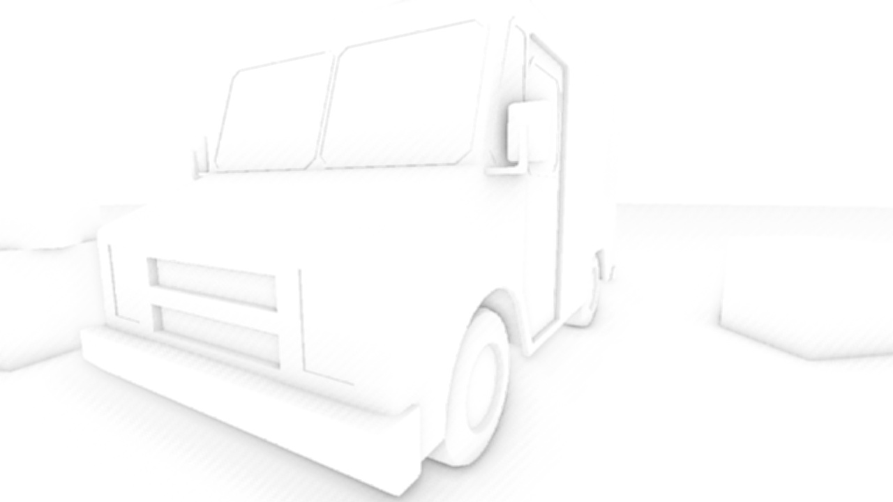

The screenshot shows the AO-only view: white means fully lit, dark regions
show where nearby geometry occludes ambient light. Notice the darkening in
crevices where box faces meet, along the base where objects contact the floor,
and in the interior spaces of the truck model.

## Key concepts

- **Hemisphere kernel SSAO** — test 64 random sample points in a hemisphere
  above each surface point to estimate how much ambient light is blocked
  ([Pass 3 — SSAO](#pass-3--ssao-hemisphere-kernel-sampling))
- **G-buffer with MRT** — a single geometry draw call writes lit scene color,
  view-space normals, and depth to separate textures
  ([Pass 2 — Geometry pass](#pass-2--geometry-pass-the-g-buffer))
- **Depth reconstruction** — recover a 3D view-space position from a depth
  buffer sample using `view_pos_from_depth` and the inverse projection matrix
  ([Step 3](#step-3-reconstruct-view-space-position-from-depth))
- **TBN construction** — build a per-pixel tangent-bitangent-normal matrix via
  Gram-Schmidt orthonormalization to orient kernel samples along the surface
  ([Step 4](#step-4-build-a-tbn-matrix-gram-schmidt-orthonormalization))
- **IGN jitter** — Interleaved Gradient Noise adds per-pixel rotation to break
  the repeating 4x4 noise tile pattern
  ([IGN jitter](#ign-jitter-jimenez-2014))
- **Box blur** — a 4x4 kernel averages exactly one noise tile period, canceling
  the tiling artifact ([Pass 4 — Box blur](#pass-4--box-blur))
- **Composite** — multiply the blurred AO factor with the lit scene color and
  apply dithering to prevent 8-bit banding
  ([Pass 5 — Composite](#pass-5--composite))

## Prerequisites

- [Lesson 06 — Depth & 3D](../06-depth-and-3d/) (depth buffers, perspective
  projection)
- [Lesson 10 — Basic Lighting](../10-basic-lighting/) (Blinn-Phong shading,
  normals)
- [Lesson 15 — Shadow Maps](../15-cascaded-shadow-maps/) (depth-only render
  passes)
- [Lesson 21 — HDR & Tone Mapping](../21-hdr-tone-mapping/)
  (render-to-texture, fullscreen quad passes)
- [Lesson 25 — Shader Noise](../25-shader-noise/) (IGN dithering)
- [Math Lesson 05 — Matrices](../../math/05-matrices/) (inverse matrices,
  projection)

## Why ambient occlusion?

In real-time rendering, the ambient term in Blinn-Phong lighting is a constant
value applied everywhere. This is physically wrong — a corner between two walls
receives far less ambient light than an open surface because the walls block
light from reaching the corner. Without occlusion, the scene looks flat and
objects appear to float above surfaces instead of being grounded on them.

Global illumination computes this correctly by tracing light bounces through
the entire scene, but that is too expensive for real-time rendering. Ambient
occlusion approximates the result by asking a simpler question at each pixel:
**how much of the hemisphere above this surface point is blocked by nearby
geometry?**

SSAO performs this test entirely in screen space — it reads only the depth
buffer and surface normals that the GPU has already computed, making it
independent of scene complexity. Whether the scene has 100 triangles or 10
million, the SSAO cost depends only on screen resolution and sample count.

## Architecture — 5 render passes per frame

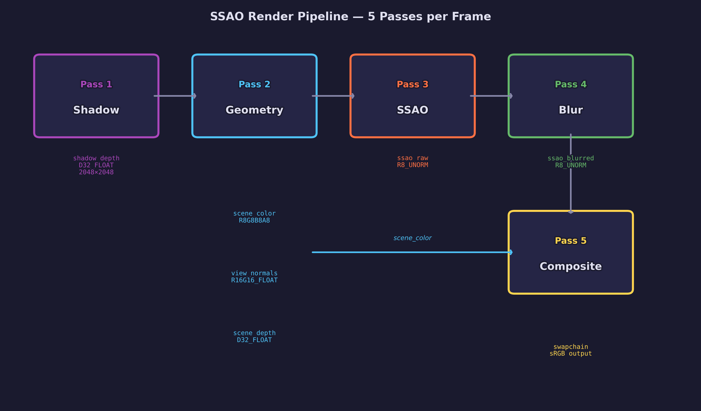

Each frame executes five GPU render passes in sequence. The output of each
pass feeds into later passes as input textures:

```text
Pass 1: Shadow       → shadow_depth    (D32_FLOAT, 2048×2048)
Pass 2: Geometry     → scene_color     (R8G8B8A8_UNORM, 1280×720)
                     → view_normals    (R16G16B16A16_FLOAT, 1280×720)
                     → scene_depth     (D32_FLOAT, 1280×720)
Pass 3: SSAO         → ssao_raw        (R8_UNORM, 1280×720)
Pass 4: Blur         → ssao_blurred    (R8_UNORM, 1280×720)
Pass 5: Composite    → swapchain       (sRGB output)
```

The first two passes are standard forward rendering — shadow map generation
and lit scene rendering. Passes 3–5 are the SSAO-specific post-processing
chain that reads the G-buffer, computes occlusion, smooths it, and applies it
to the final image.

## Pass 1 — Shadow map

The shadow pass renders the scene from the directional light's perspective into
a 2048x2048 depth-only texture. This is the same technique from
[Lesson 15](../15-cascaded-shadow-maps/). The shadow map is used during the
geometry pass to add directional shadows to the lit scene color.

## Pass 2 — Geometry pass (the G-buffer)

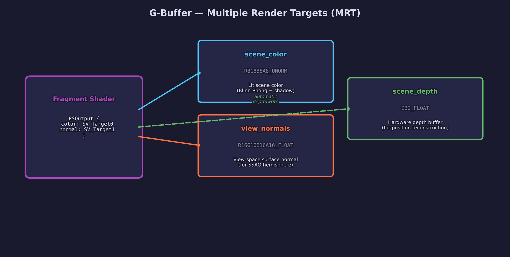

The geometry pass is where SSAO's data requirements diverge from a simple
forward renderer. A standard forward pass writes only color and depth. SSAO
additionally needs the **view-space surface normal** at each pixel, so we use
**multiple render targets (MRT)** — a single draw call that writes to two or
more color attachments simultaneously.

### What the G-buffer stores

| Texture | Format | Content | Used by |
|---------|--------|---------|---------|
| `scene_color` | R8G8B8A8_UNORM | Lit scene color (Blinn-Phong + shadow) | Composite pass |
| `view_normals` | R16G16B16A16_FLOAT | View-space surface normal (xyz) | SSAO pass |
| `scene_depth` | D32_FLOAT | Hardware depth buffer | SSAO pass |

### Why view-space normals?

SSAO samples in **view space** (camera-relative coordinates) because the depth
buffer stores view-space depth. If we used world-space normals, we would need
an extra matrix multiply per sample to transform between coordinate systems.
By storing view-space normals directly, the SSAO shader can use them without
any conversion.

The vertex shader transforms the world-space normal into view space:

```hlsl
output.view_nrm = normalize(mul((float3x3)view, world_normal));
```

### MRT output in HLSL

The fragment shader declares a struct with two `SV_Target` outputs:

```hlsl
struct PSOutput {
    float4 color       : SV_Target0;  /* lit scene color       */
    float4 view_normal : SV_Target1;  /* view-space normal xyz */
};
```

On the CPU side, the pipeline is created with `num_color_targets = 2`, and
both textures are attached when beginning the render pass:

```c
SDL_GPUColorTargetInfo color_targets[2];
color_targets[0].texture = state->scene_color;   /* SV_Target0 */
color_targets[1].texture = state->view_normals;   /* SV_Target1 */

SDL_BeginGPURenderPass(cmd, color_targets, 2, &depth_target);
```

### Why R16G16B16A16_FLOAT for normals?

Normal components range from -1.0 to +1.0. An 8-bit UNORM format can only
store values in [0, 1], so you would need to encode the normal as
`normal * 0.5 + 0.5` and decode it in the SSAO shader. A 16-bit float format
stores the signed values directly — no encoding, no precision loss from the
extra math, and the SSAO shader reads the normal as-is.

## Pass 3 — SSAO (hemisphere kernel sampling)

This is the core of the algorithm. For every pixel on screen, we ask: "How
much of the space above this surface point is blocked by nearby geometry?"

### The core idea

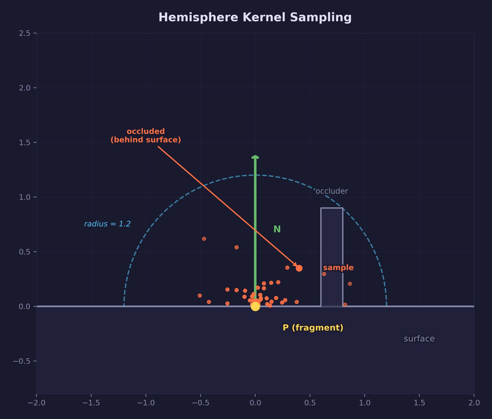

At each fragment position **P** with surface normal **N**, we place a
hemisphere of radius `SSAO_RADIUS` (0.5 world units in this lesson) oriented
along **N**. We then test 64 random sample points inside this hemisphere. For
each sample, we project it to screen coordinates, read the depth buffer at that
location, and check whether the stored surface is closer to the camera than
our sample point. If it is, the sample is **occluded** — something is blocking
light from that direction.

The final AO value is:

```text
ao = 1.0 - (occluded_count / 64)
```

A value of 1.0 means no occlusion (fully lit), and 0.0 means every sample
direction was blocked (fully occluded).

### Step 1: Generate the sampling kernel (CPU, once at init)

We generate 64 random sample vectors inside a unit hemisphere oriented along
+Z (tangent space). Each vector is a direction and distance from the origin.

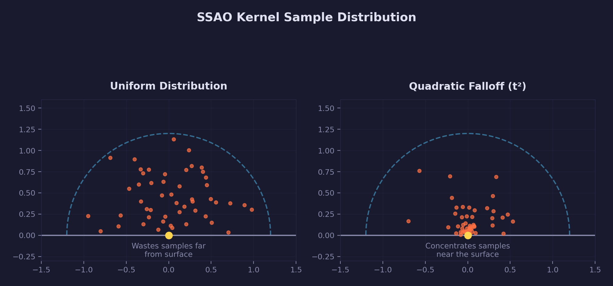

Two properties of the kernel distribution matter:

**Samples are distributed inside the volume, not just on the surface.** Each
sample gets a random length between 0 and 1, so they fill the interior of the
hemisphere. If all samples were on the surface, we would miss occlusion from
geometry between the surface and the hemisphere boundary.

**Quadratic falloff concentrates samples near the surface.** Close-range
occlusion (contact shadows between touching surfaces) produces the most
visible and important darkening. The kernel scales each sample by a quadratic
function:

```c
float t = (float)i / (float)SSAO_KERNEL_SIZE;
float scale = 0.1f + 0.9f * t * t;  /* lerp(0.1, 1.0, t²) */
```

The first samples (low `t`) get small scale values and cluster near the
surface. Later samples (high `t`) spread to the hemisphere boundary. This is
not an aesthetic choice — it allocates precision where occlusion varies most
rapidly.

The random numbers come from `forge_hash_pcg()`, a deterministic hash
function from the math library. Using a fixed seed means the kernel is
identical every run, which eliminates frame-to-frame flicker that would occur
with a different random kernel each frame.

### Step 2: Create the noise texture (CPU, once at init)

A 4x4 texture of random unit-length rotation vectors tiles across the screen.
Each texel contains a 2D direction in the XY plane:

```c
noise_data[i * 4 + 0] = x / len;  /* normalized X */
noise_data[i * 4 + 1] = y / len;  /* normalized Y */
noise_data[i * 4 + 2] = 0.0f;     /* Z = 0 (XY plane rotation) */
```

**Why tile a noise texture instead of computing random rotations per pixel?**
Texture reads are fast, and 4x4 = 16 unique rotations are enough to break
banding. Computing a unique random rotation per pixel would require either
a hash function in the shader (extra ALU cost) or a screen-sized noise
texture (extra memory). The 4x4 tile is the standard trade-off used in
production engines.

The texture uses `R32G32B32A32_FLOAT` format (full 32-bit precision for the
rotation vectors) with a **nearest-neighbor, repeat** sampler. The repeat
addressing mode causes the 4x4 texture to tile seamlessly across the screen
via `uv * noise_scale`, where `noise_scale = screen_size / 4`.

### Step 3: Reconstruct view-space position from depth

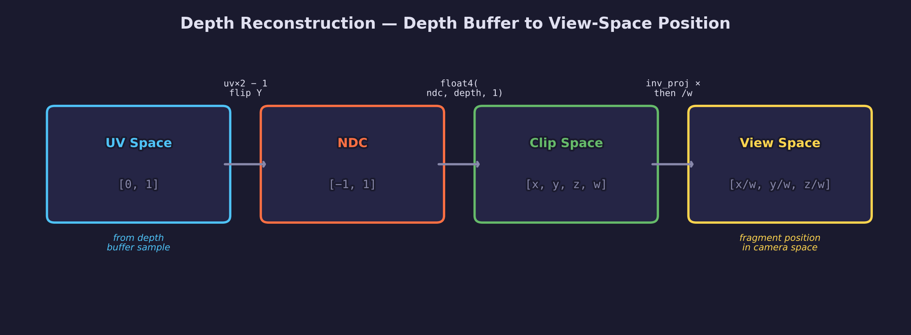

SSAO needs the 3D view-space position of each fragment, but the G-buffer only
stores a depth value. Storing full 3D positions would require an extra
R32G32B32A32_FLOAT texture (16 bytes per pixel), which is wasteful when the
depth buffer already contains enough information to recover the position.

The reconstruction reverses the projection pipeline:

```hlsl
float3 view_pos_from_depth(float2 uv, float depth)
{
    /* Map UV [0,1] to NDC [-1,1]. Flip Y because texture V=0 is top. */
    float2 ndc_xy = uv * 2.0 - 1.0;
    ndc_xy.y = -ndc_xy.y;

    /* Build clip-space position and unproject via inverse projection. */
    float4 clip = float4(ndc_xy, depth, 1.0);
    float4 view = mul(inv_projection, clip);
    return view.xyz / view.w;
}
```

Each step in the chain:

1. **UV to NDC** — Screen UVs range from [0, 1], but normalized device
   coordinates range from [-1, 1]. The Y axis is flipped because texture row
   0 is the top of the image, but NDC Y = -1 is the bottom of the screen.
2. **NDC to clip space** — Combine the 2D NDC position with the depth value
   to form a 4D clip-space coordinate with `w = 1.0`.
3. **Inverse projection** — Multiply by the inverse of the projection matrix.
   This reverses the perspective divide and field-of-view scaling. The result
   is a homogeneous view-space position.
4. **Perspective divide** — Divide by `w` to get the final 3D view-space
   position.

This function is called once per fragment (to get the fragment's own position)
and once per kernel sample (to get the stored surface position at the
sample's projected screen location). That is 65 matrix multiplies per pixel,
which is still cheaper than the memory bandwidth of a position G-buffer
texture.

### Step 4: Build a TBN matrix (Gram-Schmidt orthonormalization)

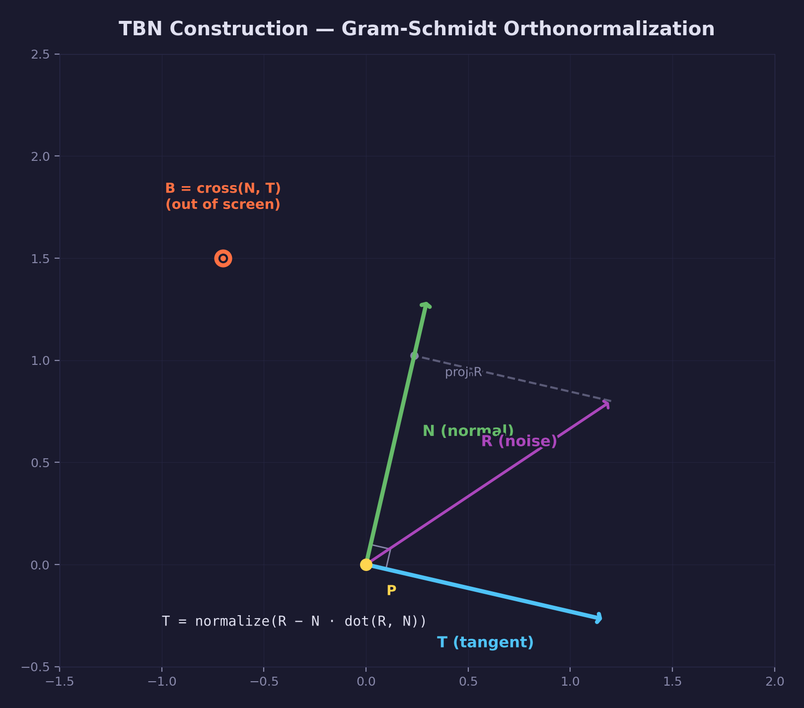

The 64 kernel samples are defined in **tangent space** — a local coordinate
system where +Z points along the surface normal. To use them in view space
(where the depth buffer and normals live), each sample must be transformed by
a **tangent-bitangent-normal (TBN) matrix**.

The TBN matrix is built per pixel using the surface normal **N** and a random
rotation vector **R** from the noise texture:

```hlsl
float3 tangent   = normalize(random_vec - normal * dot(random_vec, normal));
float3 bitangent = cross(normal, tangent);
float3x3 TBN     = float3x3(tangent, bitangent, normal);
```

This is **Gram-Schmidt orthonormalization**:

1. **Project R onto N** — `dot(R, N) * N` gives the component of R that
   points along the normal.
2. **Subtract the projection** — `R - N * dot(R, N)` removes the normal
   component, leaving only the part of R that is perpendicular to N. This
   becomes the tangent direction.
3. **Normalize** — Scale to unit length.
4. **Cross product** — `cross(N, T)` produces the bitangent, which is
   perpendicular to both N and T.

The resulting TBN matrix is an orthonormal basis (three perpendicular unit
vectors) aligned to the surface. Because the noise texture provides a
different random vector at each pixel, the TBN — and therefore the kernel
orientation — rotates differently per pixel. This is what breaks the banding
pattern that would appear if every pixel tested the same 64 directions.

### Step 5: The per-sample occlusion test

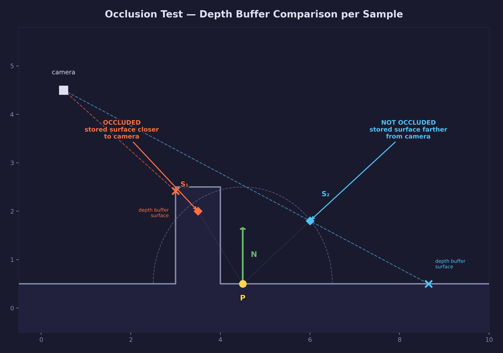

For each of the 64 kernel samples, the shader performs these operations:

```hlsl
/* 1. Transform sample from tangent space to view space */
float3 sample_dir = mul(samples[i].xyz, TBN);
float3 sample_pos = frag_pos + sample_dir * radius;

/* 2. Project sample to screen UV */
float4 offset = mul(projection, float4(sample_pos, 1.0));
offset.xy /= offset.w;
float2 sample_uv = offset.xy * 0.5 + 0.5;
sample_uv.y = 1.0 - sample_uv.y;

/* 3. Read depth buffer at projected UV */
float  sample_depth = depth_tex.Sample(depth_smp, sample_uv).r;
float3 stored_pos   = view_pos_from_depth(sample_uv, sample_depth);

/* 4. Occlusion test with range check */
float range_check = smoothstep(0.0, 1.0,
    radius / abs(frag_pos.z - stored_pos.z));
occlusion += (stored_pos.z >= sample_pos.z + bias ? 1.0 : 0.0)
             * range_check;
```

The key steps:

1. **Transform to view space** — The TBN matrix rotates the tangent-space
   sample direction into view space. Adding `frag_pos` offsets it to the
   actual world position we are testing.

2. **Project to screen** — The projection matrix converts the 3D view-space
   sample position back to 2D screen coordinates (UV). This tells us which
   pixel in the depth buffer corresponds to this sample direction.

3. **Read the depth buffer** — We sample the depth buffer at the projected UV
   and reconstruct the stored surface position. This is the actual geometry
   the camera sees at that screen location.

4. **Compare depths** — If the stored surface (`stored_pos.z`) is farther from
   the camera than our sample point (`sample_pos.z + bias`), the sample is in
   open space and not occluded. If the stored surface is closer, something is
   blocking light from that direction — the sample is occluded. The `bias`
   prevents self-occlusion where the surface would falsely occlude itself.

### The range check

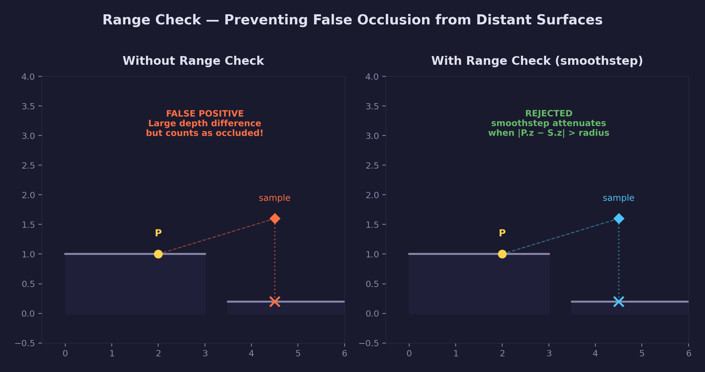

Without the range check, a sample that projects onto a distant surface (like
a far-away floor visible through a gap) would register as occluded even though
the depth difference is enormous and has nothing to do with local ambient
occlusion. This produces dark halos around object silhouettes.

The range check uses `smoothstep` to attenuate the occlusion contribution
when the depth difference between the fragment and the stored surface exceeds
the sampling radius:

```hlsl
float range_check = smoothstep(0.0, 1.0,
    radius / abs(frag_pos.z - stored_pos.z));
```

When `frag_pos.z` and `stored_pos.z` are close (within `radius`), the ratio
is large and smoothstep returns ~1.0 — full occlusion contribution. When the
depth difference is much larger than `radius`, the ratio approaches zero and
smoothstep returns ~0.0 — the sample is ignored. This limits occlusion to
local geometry only.

### IGN jitter (Jimenez 2014)

The 4x4 noise texture rotates the kernel orientation per pixel, but the
pattern repeats every 4 pixels in both axes. This tiling is visible as a
regular grid pattern in the raw SSAO output.

**Interleaved Gradient Noise** (from Jimenez et al., SIGGRAPH 2014) adds
a per-pixel rotation on top of the noise texture rotation:

```hlsl
float ign(float2 screen_pos)
{
    float3 coeffs = float3(0.06711056, 0.00583715, 52.9829189);
    return frac(coeffs.z * frac(dot(screen_pos, coeffs.xy)));
}
```

This function produces a value in [0, 1] that varies rapidly between
neighboring pixels but has low discrepancy — nearby pixels get well-spread
values rather than clumped ones. The SSAO shader converts this to an angle
and rotates the noise vector by that angle:

```hlsl
float angle = ign(clip_pos.xy) * TWO_PI;
float s, c;
sincos(angle, s, c);
float2 rotated = float2(
    random_vec.x * c - random_vec.y * s,
    random_vec.x * s + random_vec.y * c);
```

The combination of the 4x4 noise texture and IGN jitter gives each pixel a
nearly unique kernel orientation, which significantly reduces the visible
tiling. Toggle this with the **D** key to see the difference.

## Pass 4 — Box blur

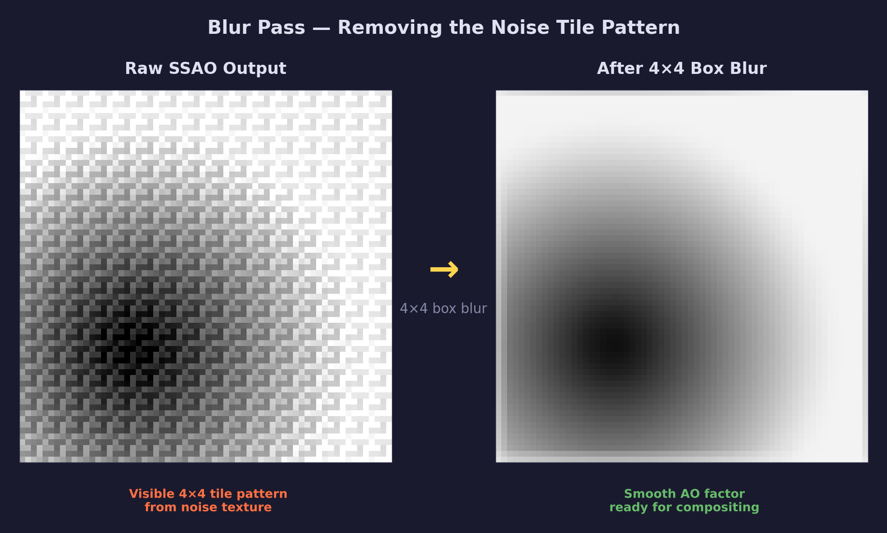

The raw SSAO output has a visible repeating pattern because the noise texture
is only 4x4 pixels. Every 4th pixel in each axis uses the same rotation, which
creates a regular grid of similar AO values.

A **4x4 box blur** averages exactly one noise tile period in each direction.
This is not a coincidence — it is the key insight that makes this approach
work. When you average values over one complete cycle of a repeating pattern,
the pattern cancels out and you are left with the underlying smooth signal.

The blur shader iterates over a 4x4 neighborhood centered on the current
texel:

```hlsl
for (int x = -2; x < 2; x++)
{
    for (int y = -2; y < 2; y++)
    {
        float2 offset = float2((float)x + 0.5, (float)y + 0.5) * texel_size;
        result += ssao_tex.Sample(ssao_smp, uv + offset).r;
    }
}
result /= 16.0;  /* 4×4 = 16 samples */
```

The offsets range from -1.5 to +1.5 texels (not -2 to +2), covering exactly
4 texels in each axis centered on the current pixel.

### Why box blur instead of Gaussian?

A Gaussian blur weights center samples more heavily than edge samples. For
removing a periodic tiling pattern, uniform weighting (box blur) is more
effective because it gives every sample in the tile equal influence. A
Gaussian would not fully cancel the tile pattern because it underweights
samples at the tile boundary.

A **bilateral blur** (which preserves edges by comparing depth/normal
similarity) would be better for final quality, but the box blur is simpler
to implement and demonstrates the core concept. Exercise 3 asks you to
implement the bilateral variant.

## Pass 5 — Composite

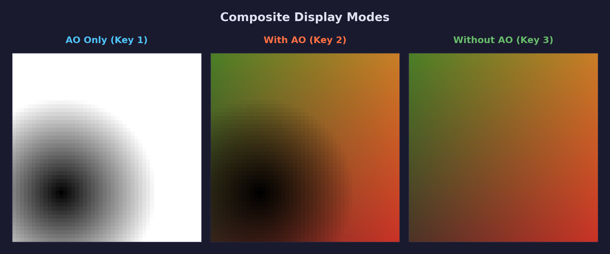

The composite pass is what actually puts pixels on screen. Unlike the earlier
passes that render into off-screen textures, this pass targets the **swapchain
texture** — the image that SDL presents to the window:

```c
comp_ct.texture  = swapchain_tex;   /* render directly to the screen */
comp_ct.store_op = SDL_GPU_STOREOP_STORE;
SDL_BeginGPURenderPass(cmd, &comp_ct, 1, NULL);
```

There is no special "final output" designation in SDL's GPU API. Whichever
render pass uses the swapchain texture as its color target is the one whose
output appears on screen. Here, the composite pass draws a fullscreen quad
that samples the scene color and blurred AO as input textures, and writes
the combined result to the swapchain:

```hlsl
final_color = scene_color * ao;
```

This multiplication darkens pixels in proportion to their occlusion. An AO
value of 1.0 leaves the color unchanged; a value of 0.5 halves the brightness.

The lesson provides three display modes for debugging and comparison:

| Key | Mode | Formula |
|-----|------|---------|
| **1** | AO only | `float3(ao, ao, ao)` — occlusion on white background |
| **2** | Full render + AO | `scene_color * ao` — the intended final result |
| **3** | Full render, no AO | `scene_color` — comparison without occlusion |

### Dithering to prevent banding

The blurred AO is stored in an R8_UNORM texture — 8 bits per pixel, which
means only 256 discrete brightness levels. In smooth gradients (like the
gentle falloff around a curved surface), the jumps between adjacent brightness
levels become visible as bands.

**Interleaved Gradient Noise dithering** adds a tiny random offset (±0.5/255)
to each pixel's output:

```hlsl
float dither = (ign(clip_pos.xy) - 0.5) / 255.0;
final_color += dither;
```

This breaks the quantization staircase into a smooth perceptual gradient. The
noise amplitude is less than one brightness step, so it is invisible at normal
viewing distance but eliminates the banding artifacts. Toggle with **D**.

## Controls

| Key | Action |
|-----|--------|
| **1** | AO only view (default) |
| **2** | Full render with AO |
| **3** | Full render without AO |
| **D** | Toggle IGN dithering and jitter |
| **WASD** | Move camera |
| **Space / LShift** | Move up / down |
| **Mouse** | Look around |
| **Escape** | Release mouse / quit |

## Code structure

```text
lessons/gpu/27-ssao/
├── main.c                         # 5-pass renderer with SSAO
├── shaders/
│   ├── shadow.vert.hlsl           # Light-space vertex transform
│   ├── shadow.frag.hlsl           # Empty (depth-only write)
│   ├── scene.vert.hlsl            # Clip/world/view-space transforms
│   ├── scene.frag.hlsl            # Blinn-Phong + shadow; MRT output
│   ├── grid.vert.hlsl             # Grid quad transform
│   ├── grid.frag.hlsl             # Procedural grid + shadow; MRT output
│   ├── fullscreen.vert.hlsl       # SV_VertexID fullscreen quad
│   ├── ssao.frag.hlsl             # Hemisphere kernel SSAO
│   ├── blur.frag.hlsl             # 4×4 box blur
│   └── composite.frag.hlsl        # Scene color × AO; mode switching
├── shaders/compiled/              # SPIRV + DXIL + C headers
└── assets/
    └── screenshot.png
```

### Key data flow

- `scene.vert.hlsl` outputs `view_nrm` (TEXCOORD3) — the view-space normal
  computed by `mul((float3x3)view, world_normal)`.
- `scene.frag.hlsl` writes a `PSOutput` struct to two render targets:
  `SV_Target0` (lit color) and `SV_Target1` (view-space normal).
- `ssao.frag.hlsl` reads three textures: `normal_tex` (view normals),
  `depth_tex` (scene depth), and `noise_tex` (4x4 rotation noise).
- `blur.frag.hlsl` reads `ssao_tex` (raw AO) and writes blurred AO.
- `composite.frag.hlsl` reads `color_tex` (scene color) and `ao_tex`
  (blurred AO) and writes to the swapchain.

## Building

```bash
python scripts/compile_shaders.py 27       # compile shaders
cmake -B build
cmake --build build --config Debug --target 27-ssao
```

## AI skill

The [`ssao` skill](../../../.claude/skills/ssao/SKILL.md) can add SSAO to any
SDL3 GPU project — invoke it with `/ssao` in Claude Code.

## What's next

With SSAO adding contact occlusion, you have a solid deferred-style
post-process pipeline. From here you could explore:

- **Bilateral blur** to preserve edges (Exercise 3 below)
- **Screen-space reflections (SSR)** using the same G-buffer
- **Temporal accumulation** to spread the SSAO cost over multiple frames
- **HBAO+** (Horizon-Based Ambient Occlusion) for improved quality

## Further reading

- [John Chapman — SSAO Tutorial](https://john-chapman-graphics.blogspot.com/2013/01/ssao-tutorial.html)
  — the hemisphere kernel approach used in this lesson
- [LearnOpenGL — SSAO](https://learnopengl.com/Advanced-Lighting/SSAO)
  — detailed walkthrough with OpenGL code
- Jimenez et al., "Next-Generation Post Processing in Call of Duty: Advanced
  Warfare" (SIGGRAPH 2014) — IGN dithering technique
- Crytek, "Finding Next Gen" (SIGGRAPH 2007) — original SSAO paper
- Bavoil & Sainz, "Screen-Space Ambient Occlusion" (NVIDIA, 2008) — HBAO
  approach with horizon-based sampling

## Exercises

1. **Adjust the radius** — Change `SSAO_RADIUS` from 0.5 to 1.0 or 2.0 and
   observe how the occlusion spreads. Larger radii catch more geometry but
   lose fine contact detail. Try to find a radius that balances both.

2. **Reduce the kernel size** — Try 16 or 32 samples instead of 64. Notice
   the increased noise and how the blur helps hide it. At what sample count
   does the noise become unacceptable even after blurring?

3. **Implement a bilateral blur** — Replace the box blur with a bilateral
   filter that preserves edges. For each blur sample, compare its depth and
   normal to the center pixel. Weight samples with similar depth/normal highly
   and attenuate samples across depth discontinuities. This prevents the AO
   from bleeding across object boundaries.

4. **Power the AO** — In the composite shader, try `pow(ao, 2.0)` to increase
   the contrast of the occlusion effect. Compare `pow(ao, 0.5)` (softer) vs
   `pow(ao, 3.0)` (harsher). This is a common artistic control in production
   engines.

5. **Half-resolution SSAO** — Render the SSAO pass at half resolution
   (640x360) and upsample for the composite pass. This roughly quarters the
   cost of the most expensive pass. Use a bilateral upsample to avoid blocky
   artifacts at object edges.
