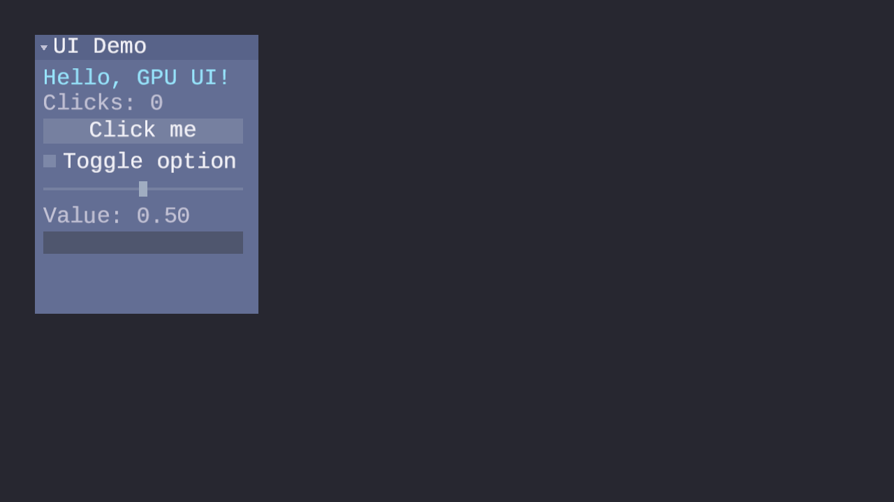

# Lesson 28 — UI Rendering

## What you will learn

- How to render an immediate-mode UI system on the GPU using a single
  draw call with alpha blending
- The **UI data contract** — how `ForgeUiVertex` arrays and `Uint32` index
  arrays flow from the CPU-side UI library to GPU buffers
- The **white-pixel technique** — how a single-channel font atlas serves both
  text glyphs and solid-colored rectangles through one shader
- How to build an **orthographic projection matrix** that maps screen-space
  pixel coordinates to clip space with a top-left origin
- How to upload a single-channel font atlas to the GPU as an `R8_UNORM`
  texture using transfer buffers
- How to configure **alpha blending** for anti-aliased text compositing
- **Dynamic buffer streaming** — re-uploading vertex and index data every
  frame with automatic power-of-two buffer growth
- The **immediate-mode render loop** — declaring widgets, generating geometry,
  uploading to the GPU, and drawing in a single frame

## Result



A draggable window containing labels, a click-counter button, a checkbox, a
slider, and a text input field — all rendered in one draw call. The dark
blue-gray background shows through semi-transparent panel edges, and text
glyphs are anti-aliased via alpha blending against the font atlas.

## Key concepts

- **ForgeUiVertex data contract** — the UI library produces flat arrays of
  32-byte vertices (position, UV, color) and `Uint32` indices each frame;
  the GPU lesson uploads and draws them without interpreting widget structure
  ([The UI data contract](#the-ui-data-contract))
- **White-pixel technique** — a reserved region in the font atlas with full
  coverage (value 255) lets solid rectangles reuse the same shader as text
  glyphs ([The white-pixel technique](#the-white-pixel-technique))
- **Orthographic projection** — a 4x4 matrix that maps pixel coordinates
  `[0..W, 0..H]` to clip space `[-1..+1]` with Y flipped for top-left origin
  ([Orthographic projection for 2D UI](#orthographic-projection-for-2d-ui))
- **R8\_UNORM atlas** — a single-channel texture format that stores glyph
  coverage in one byte per pixel, using 4x less memory than RGBA8
  ([Atlas upload to GPU](#atlas-upload-to-gpu))
- **Alpha blending** — standard `src * srcAlpha + dst * (1 - srcAlpha)`
  compositing for smooth anti-aliased text edges
  ([Alpha blending for text rendering](#alpha-blending-for-text-rendering))
- **Dynamic buffer streaming** — per-frame upload of vertex and index data
  through a single combined transfer buffer, with power-of-two growth when
  the UI exceeds current capacity
  ([Dynamic buffer streaming](#dynamic-buffer-streaming))
- **Single draw call** — the entire UI (all windows, widgets, and text) is
  drawn with one `DrawIndexedPrimitives` call because the UI context sorts
  and flattens all widget geometry into a single vertex/index stream
  ([The immediate-mode render loop](#the-immediate-mode-render-loop))
- **Widget ID system** — string labels double as widget identifiers via
  FNV-1a hashing; the `##` separator lets widgets share display text while
  keeping unique IDs, and hierarchical scoping prevents collisions across
  windows ([Widget IDs and the `##` separator](#widget-ids-and-the--separator))

## Prerequisites

- [Lesson 02 — First Triangle](../02-first-triangle/) (vertex buffers,
  pipelines, draw calls)
- [Lesson 04 — Textures & Samplers](../04-textures-and-samplers/) (texture
  upload, sampler creation, fragment shader sampling)
- [Lesson 16 — Blending](../16-blending/) (alpha blend state configuration,
  the blend equation, painter's algorithm)
- [UI Lesson 01 — TTF Parsing](../../ui/01-ttf-parsing/) through
  [UI Lesson 11 — Widget ID System](../../ui/11-widget-id-system/) (the full
  immediate-mode UI stack that this lesson renders)

## The UI data contract

The forge-gpu UI library (built across UI Lessons 01–11) is entirely
CPU-side. It parses fonts, rasterizes glyphs into an atlas, and generates
draw data every frame — but never touches the GPU. This lesson is where that
data reaches the screen.

Each frame, after declaring all widgets, the UI context exposes two flat
arrays:

```c
/* After forge_ui_ctx_end(): */
ForgeUiVertex *vertices = ui_ctx.vertices;   /* vertex_count entries  */
Uint32        *indices  = ui_ctx.indices;     /* index_count entries   */
```

Each `ForgeUiVertex` is 32 bytes:

| Offset | Field   | Type   | Description                     |
|--------|---------|--------|---------------------------------|
| 0      | pos\_x  | float  | Screen-space X in pixels        |
| 4      | pos\_y  | float  | Screen-space Y in pixels        |
| 8      | uv\_u   | float  | Atlas U coordinate [0..1]       |
| 12     | uv\_v   | float  | Atlas V coordinate [0..1]       |
| 16     | r       | float  | Vertex color red [0..1]         |
| 20     | g       | float  | Vertex color green [0..1]       |
| 24     | b       | float  | Vertex color blue [0..1]        |
| 28     | a       | float  | Vertex color alpha [0..1]       |

The GPU pipeline treats every vertex identically. It does not distinguish
buttons from labels or sliders from checkboxes. All widget differentiation
happens on the CPU side through position, UV, and color values — the GPU
simply transforms, samples, blends, and draws.

The indices are `Uint32` values forming triangle lists. Each quad (button
background, glyph, slider track) produces 4 vertices and 6 indices (two
triangles). The UI context emits widgets back-to-front — the window system
sorts by `z_order` before appending each window's draw list — so the
painter's algorithm produces correct layering without a depth buffer.

## The white-pixel technique

Every solid-colored rectangle (panel backgrounds, button fills, slider
tracks, checkbox outlines) and every text glyph passes through the same
fragment shader. The shader samples the font atlas and multiplies the
sampled coverage by the vertex color alpha:

```hlsl
float coverage = atlas_tex.Sample(atlas_smp, input.uv).r;
float4 result  = input.color;
result.a      *= coverage;
return result;
```

For **text glyphs**, the UV coordinates point to the rasterized glyph region
in the atlas. The coverage value ranges from 0.0 (outside the glyph) to 1.0
(inside the glyph), with intermediate values along anti-aliased edges. The
multiplication produces smooth, transparent edges.

For **solid rectangles**, the UV coordinates point to the **white-pixel
region** — a reserved area of the atlas where every texel has a coverage
value of 1.0. The multiplication becomes `vertex_alpha * 1.0 =
vertex_alpha`, so the rectangle's transparency is controlled entirely by
its vertex color. No special-case shader is needed.

This approach means the entire UI is drawn with a single pipeline and a
single texture binding. Adding new widget types to the UI library requires
no GPU-side changes — only the CPU vertex generation logic changes.

## Orthographic projection for 2D UI

UI widgets use screen-space pixel coordinates: `pos_x = 100` means 100
pixels from the left edge. The GPU expects clip-space coordinates in the
range [-1, +1]. An orthographic projection matrix bridges the two.

The matrix maps the window dimensions to clip space with the origin at the
top-left corner and Y increasing downward — matching the convention used by
`ForgeUiVertex` and most 2D UI systems:

```c
static mat4 ui_ortho_projection(float width, float height)
{
    mat4 m = mat4_identity();
    m.m[0]  =  2.0f / width;   /* col0 row0: scale x to [-1,+1]       */
    m.m[5]  = -2.0f / height;  /* col1 row1: scale y, flip for y-down  */
    m.m[12] = -1.0f;           /* col3 row0: translate x so 0 -> -1    */
    m.m[13] =  1.0f;           /* col3 row1: translate y so 0 -> +1    */
    return m;
}
```

The Y-axis negation (`-2.0f / height`) flips the vertical axis so that
`y = 0` maps to the top of the screen (clip Y = +1) and `y = H` maps to
the bottom (clip Y = -1). This is the standard approach for 2D rendering
where screen-space Y increases downward.

The projection is rebuilt every frame from `SDL_GetWindowSizeInPixels`,
which means window resizing works automatically — no explicit resize handler
is needed. The uniform is a single 64-byte push per frame.

For the underlying math, see
[Math Lesson 05 — Matrices](../../math/05-matrices/) and
[Math Lesson 06 — Projections](../../math/06-projections/).

## Atlas upload to GPU

The font atlas is built on the CPU by
[UI Lesson 03 — Font Atlas Packing](../../ui/03-font-atlas/). It produces
a `ForgeUiFontAtlas` with a single-channel pixel buffer (`Uint8` per texel)
representing glyph coverage. This lesson uploads that buffer to the GPU as
an `R8_UNORM` texture.

### Why R8\_UNORM?

The atlas data is inherently single-channel — each texel stores a coverage
value between 0 and 255. Using `SDL_GPU_TEXTUREFORMAT_R8_UNORM` matches
the data format exactly:

- **4x smaller** than RGBA8 for the same dimensions. A 512x512 atlas uses
  256 KB instead of 1 MB.
- **No CPU-side expansion** — the pixel data is uploaded as-is, with no
  need to pad each byte to four.
- **Fragment shader reads `.r`** — the GPU returns `(r, 0, 0, 1)` for
  R8\_UNORM textures, so the coverage value is in the red channel.

### Upload sequence

The upload uses SDL GPU's transfer buffer pattern — the same approach used
in [Lesson 04 — Textures & Samplers](../04-textures-and-samplers/) for
RGBA textures:

1. Create an `SDL_GPUTexture` with format `R8_UNORM`, usage `SAMPLER`.
2. Create an `SDL_GPUTransferBuffer` sized to `atlas.width * atlas.height`
   bytes.
3. Map the transfer buffer, `memcpy` the atlas pixels, unmap.
4. Begin a copy pass, call `SDL_UploadToGPUTexture`, end the copy pass.
5. Submit the command buffer and release the transfer buffer.

The sampler uses **linear filtering** and **clamp-to-edge** addressing.
Linear filtering smooths glyph edges at non-integer pixel positions.
Clamp-to-edge prevents atlas-edge texels from bleeding into neighboring
glyphs.

## Alpha blending for text rendering

Anti-aliased text requires alpha blending. Each glyph fragment has a
coverage value between 0.0 and 1.0, and the blend unit must combine it
with whatever is already in the framebuffer. The pipeline uses standard
alpha blending — the same configuration covered in
[Lesson 16 — Blending](../16-blending/):

```c
/* Color: result = src.rgb * src.a + dst.rgb * (1 - src.a) */
ctd.blend_state.src_color_blendfactor = SDL_GPU_BLENDFACTOR_SRC_ALPHA;
ctd.blend_state.dst_color_blendfactor = SDL_GPU_BLENDFACTOR_ONE_MINUS_SRC_ALPHA;
ctd.blend_state.color_blend_op        = SDL_GPU_BLENDOP_ADD;

/* Alpha: result = src.a * 1 + dst.a * (1 - src.a) */
ctd.blend_state.src_alpha_blendfactor = SDL_GPU_BLENDFACTOR_ONE;
ctd.blend_state.dst_alpha_blendfactor = SDL_GPU_BLENDFACTOR_ONE_MINUS_SRC_ALPHA;
ctd.blend_state.alpha_blend_op        = SDL_GPU_BLENDOP_ADD;
```

A text fragment with coverage 0.3 contributes 30% of its color and lets
70% of the background show through. Where coverage is 1.0 (fully inside
the glyph), the text color fully replaces the background. Where coverage
is 0.0 (outside the glyph), the fragment contributes nothing. The smooth
gradient along glyph edges is what produces anti-aliased text.

### No depth buffer

The pipeline has no depth-stencil target. Depth testing and depth writing
are both disabled. 2D UI uses the painter's algorithm — the UI context
emits geometry back-to-front, and the window system sorts windows by
`z_order` before flattening their draw lists. A depth buffer would
incorrectly discard semi-transparent fragments that should blend, and it
would add GPU memory cost for no benefit.

### No backface culling

Culling is set to `SDL_GPU_CULLMODE_NONE`. UI quads are generated
programmatically and may have either winding order depending on the
widget. Disabling culling avoids silent rendering failures from
inconsistent winding.

## Dynamic buffer streaming

The UI generates new geometry every frame — widget positions, text content,
and visibility can all change between frames. The vertex and index buffers
must be updated accordingly.

### Pre-allocation with power-of-two growth

At initialization, the lesson pre-allocates GPU buffers sized for a
reasonable UI complexity:

```c
#define INITIAL_VERTEX_CAPACITY  4096   /* 4096 * 32 bytes = 128 KB */
#define INITIAL_INDEX_CAPACITY   6144   /* 6144 *  4 bytes =  24 KB */
```

These sizes handle panels with roughly 1000 quads, which covers most
common UI layouts. If the UI grows beyond the current allocation (for
example, a window with many widgets or long text), the lesson releases the
old buffer and creates a new one at the next power-of-two size. This
ensures amortized O(1) resizing.

### Single combined transfer buffer

Each frame, the lesson creates one transfer buffer large enough for both
vertex and index data. The vertex data is written at offset 0, and the
index data follows immediately after:

```c
Uint32 total_upload = vertex_data_size + index_data_size;

/* Map, copy both regions, unmap */
void *mapped = SDL_MapGPUTransferBuffer(device, transfer, false);
SDL_memcpy(mapped, ui_ctx.vertices, vertex_data_size);
SDL_memcpy((Uint8 *)mapped + vertex_data_size, ui_ctx.indices, index_data_size);
SDL_UnmapGPUTransferBuffer(device, transfer);

/* Upload both in one copy pass */
SDL_UploadToGPUBuffer(copy, &vtx_src, &vtx_dst, false);
SDL_UploadToGPUBuffer(copy, &idx_src, &idx_dst, false);
```

Using a single transfer buffer instead of two reduces the number of create,
map, unmap, and release calls. UI geometry is small — a complex panel
produces around 2000 vertices and 3000 indices (roughly 90 KB total) — so
a single buffer fits comfortably.

The transfer buffer is released immediately after the copy pass ends. It is
not retained across frames.

## The immediate-mode render loop

Each frame follows a fixed sequence: declare the UI, generate geometry,
upload to GPU, and draw.

### 1. Declare widgets

The application calls into the UI context to describe what should appear on
screen. This mirrors the patterns from
[UI Lesson 05 — Immediate-Mode Basics](../../ui/05-immediate-mode-basics/)
through [UI Lesson 10 — Windows](../../ui/10-windows/):

```c
forge_ui_ctx_begin(&ui_ctx, mouse_x, mouse_y, mouse_down);
forge_ui_wctx_begin(&ui_wctx);

if (forge_ui_wctx_window_begin(&ui_wctx, "UI Demo", &demo_window)) {
    forge_ui_ctx_label_layout(&ui_ctx, "Hello, GPU UI!", 26, 0.88f, 0.88f, 0.94f, 1.0f);
    if (forge_ui_ctx_button_layout(&ui_ctx, "Click me", 36))
        click_count++;
    forge_ui_ctx_checkbox_layout(&ui_ctx, "Toggle option", &checkbox_value, 30);
    forge_ui_ctx_slider_layout(&ui_ctx, "##slider", &slider_value, 0.0f, 1.0f, 30);
    forge_ui_ctx_text_input(&ui_ctx, "##text_input", &text_input, layout_rect, cursor_visible);
    forge_ui_wctx_window_end(&ui_wctx);
}

forge_ui_wctx_end(&ui_wctx);
forge_ui_ctx_end(&ui_ctx);
```

After `forge_ui_ctx_end`, the context holds the finalized vertex and index
arrays. The window context has sorted windows by `z_order` and appended
each window's draw list to the main buffers.

#### Widget IDs and the `##` separator

Every interactive widget needs a unique identity so the UI context can track
which widget is hot (hovered) and which is active (being interacted with)
across frames. The library derives this identity by hashing the label string
with the FNV-1a algorithm — a fast, well-distributed hash that maps
arbitrary-length strings to 32-bit IDs.

Labels like `"Click me"` and `"Toggle option"` are unique enough to serve as
both display text and identifier. But sliders and text inputs often have no
visible label — repeating the same empty string would produce identical IDs,
breaking hot/active tracking. The `##` separator solves this: everything
after `##` is included in the hash but excluded from the rendered text.
`"##slider"` and `"##text_input"` display nothing, yet each hashes to a
distinct ID.

Windows add another layer of protection. When you call
`forge_ui_wctx_window_begin`, the window context pushes the window's own ID
onto a scope stack. All widget IDs declared inside that window are combined
with the window scope, so two windows can both contain a widget labeled
`"OK"` without colliding — their final IDs differ because their window
scopes differ.

For the full implementation — FNV-1a hashing, the `##` parse rule, and
hierarchical scope stacking — see
[UI Lesson 11 — Widget ID System](../../ui/11-widget-id-system/).

### 2. Upload geometry

A copy pass transfers the vertex and index data from the CPU to the
pre-allocated GPU buffers via a single transfer buffer
(see [Dynamic buffer streaming](#dynamic-buffer-streaming) above).

### 3. Draw

A single render pass binds the pipeline, vertex buffer, index buffer, and
atlas texture, pushes the orthographic projection uniform, and issues one
indexed draw call:

```c
SDL_BindGPUGraphicsPipeline(pass, pipeline);
SDL_BindGPUVertexBuffers(pass, 0, &vtx_binding, 1);
SDL_BindGPUIndexBuffer(pass, &idx_binding, SDL_GPU_INDEXELEMENTSIZE_32BIT);
SDL_BindGPUFragmentSamplers(pass, 0, &atlas_binding, 1);
SDL_PushGPUVertexUniformData(cmd, 0, &uniforms, sizeof(UiUniforms));
SDL_DrawIndexedPrimitives(pass, ui_ctx.index_count, 1, 0, 0, 0);
```

The entire UI — every window, widget, label, and glyph — is drawn in this
single call because the UI context has already flattened everything into
one continuous vertex/index stream.

## Shaders

### Vertex shader

The vertex shader transforms screen-space pixel positions into clip space
using the orthographic projection matrix. It passes UV coordinates and
vertex color through to the fragment stage:

```hlsl
cbuffer UiUniforms : register(b0, space1)
{
    float4x4 projection;
};

VSOutput main(VSInput input)
{
    VSOutput output;
    output.position = mul(projection, float4(input.position, 0.0, 1.0));
    output.uv       = input.uv;
    output.color    = float4(input.color_rg, input.color_ba);
    return output;
}
```

The vertex color is split across two `FLOAT2` attributes (`color_rg` and
`color_ba`) and reassembled in the shader. This matches the
`ForgeUiVertex` memory layout, which stores RGBA as four consecutive
floats.

### Fragment shader

The fragment shader samples the single-channel atlas and uses the red
channel as a coverage multiplier for the vertex color alpha:

```hlsl
float4 main(PSInput input) : SV_Target0
{
    float coverage = atlas_tex.Sample(atlas_smp, input.uv).r;
    float4 result  = input.color;
    result.a      *= coverage;
    return result;
}
```

For text glyphs, `coverage` provides the anti-aliased edge. For solid
rectangles, UVs point to the white-pixel region where `coverage = 1.0`, so
the vertex alpha passes through unchanged.

## Controls

| Key | Action |
|-----|--------|
| **Mouse move** | Interact with UI widgets (hover, drag sliders) |
| **Left click** | Press buttons, toggle checkboxes, focus text input |
| **Mouse wheel** | Scroll within the window panel |
| **Keyboard** | Type into the text input field when focused |
| **Backspace / Delete** | Delete characters in text input |
| **Left / Right arrows** | Move text cursor |
| **Home / End** | Jump to start / end of text input |
| **Escape** | Release text input focus / quit |

## Building and running

```bash
python scripts/compile_shaders.py 28       # compile HLSL to SPIRV + DXIL
cmake -B build
cmake --build build --config Debug --target 28-ui-rendering
```

Run:

```bash
python scripts/run.py 28
```

## Code structure

```text
lessons/gpu/28-ui-rendering/
├── main.c                         # SDL callback application
├── shaders/
│   ├── ui.vert.hlsl               # Orthographic transform
│   ├── ui.frag.hlsl               # Atlas sampling + coverage blend
│   └── compiled/                  # Generated .spv/.dxil/.h headers
├── assets/
│   └── screenshot.png             # Lesson result screenshot
├── CMakeLists.txt                 # Build config (copies shared font at build time)
└── README.md                      # This file
```

### GPU resource summary

| Resource | Count | Notes |
|----------|-------|-------|
| Graphics pipeline | 1 | Alpha blend, no depth |
| Texture | 1 | R8\_UNORM font atlas |
| Sampler | 1 | Linear filter, clamp-to-edge |
| GPU buffer | 2 | 1 vertex + 1 index (dynamic) |
| Shader programs | 2 | 1 vertex + 1 fragment |
| Uniform push per frame | 1 | 64 bytes (mat4 projection) |
| Draw calls per frame | 1 | Single `DrawIndexedPrimitives` |
| Transfer buffers per frame | 1 | Combined vertex + index, released after use |

## Related lessons

### UI lessons (CPU-side data generation)

This lesson renders the output of the full UI track. Each UI lesson builds
a piece of the system that produces the vertex and index data drawn here:

- [UI Lesson 01 — TTF Parsing](../../ui/01-ttf-parsing/) — parses the font
  file that provides glyph outlines
- [UI Lesson 02 — Glyph Rasterization](../../ui/02-glyph-rasterization/) —
  rasterizes outlines into the coverage bitmaps packed into the atlas
- [UI Lesson 03 — Font Atlas Packing](../../ui/03-font-atlas/) — builds the
  single-channel atlas texture and the white-pixel region
- [UI Lesson 04 — Text Layout](../../ui/04-text-layout/) — positions
  glyphs into textured quads with atlas UVs
- [UI Lesson 05 — Immediate-Mode Basics](../../ui/05-immediate-mode-basics/)
  — the declare-then-draw loop that generates vertices each frame
- [UI Lesson 06 — Checkboxes and Sliders](../../ui/06-checkboxes-and-sliders/)
  — interactive widgets with mutable state
- [UI Lesson 07 — Text Input](../../ui/07-text-input/) — keyboard-driven
  text editing with cursor
- [UI Lesson 08 — Layout](../../ui/08-layout/) — automatic widget
  positioning via layout cursors
- [UI Lesson 09 — Panels and Scrolling](../../ui/09-panels-and-scrolling/)
  — fixed containers with clipping and scroll
- [UI Lesson 10 — Windows](../../ui/10-windows/) — draggable windows with
  z-ordering, collapse, and the `ForgeUiWindowContext` used here
- [UI Lesson 11 — Widget ID System](../../ui/11-widget-id-system/) — FNV-1a
  hashed string IDs, the `##` separator, and hierarchical scope stacking

### GPU lessons

- [Lesson 02 — First Triangle](../02-first-triangle/) — vertex buffers,
  pipelines, and the first draw call
- [Lesson 04 — Textures & Samplers](../04-textures-and-samplers/) — texture
  upload via transfer buffers, sampler creation, fragment shader sampling
- [Lesson 16 — Blending](../16-blending/) — the blend equation, alpha blend
  state configuration, and the painter's algorithm

### Math lessons

- [Math Lesson 01 — Vectors](../../math/01-vectors/) — 2D screen-space
  coordinates used for vertex positions and UV mapping
- [Math Lesson 05 — Matrices](../../math/05-matrices/) — the 4x4
  orthographic projection matrix pushed as a vertex uniform
- [Math Lesson 06 — Projections](../../math/06-projections/) — orthographic
  vs perspective projection and how pixel coordinates map to clip space

## AI skill

The [`/ui-rendering`](../../../.claude/skills/ui-rendering/SKILL.md) skill
automates adding a GPU-rendered immediate-mode UI to an SDL application.
It covers atlas upload, pipeline creation, dynamic buffer streaming, and the
per-frame render loop.

## Exercises

1. **Add a second window.** Create a second `ForgeUiWindowState` and declare
   a second window with different widgets (for example, a color picker using
   three sliders for RGB values). Drag both windows around and observe how
   z-ordering ensures the focused window draws on top — all still in a single
   draw call.

2. **Tint the atlas texture.** In the fragment shader, multiply the vertex
   color RGB by a uniform `tint_color` before output. Add a `float4
   tint_color` to the uniform buffer and push it from C. Use the slider
   widget to control the tint's red channel in real time.

3. **Implement scissor clipping.** Instead of relying on the UI context's
   vertex-level clipping, use `SDL_SetGPUScissor` to set a scissor rectangle
   matching each panel's content area. This requires splitting the single
   draw call into one draw call per clipped region. Compare the visual result
   with the vertex-clipped approach and measure the draw call count increase.

4. **Render at high DPI.** Query the window's display scale with
   `SDL_GetWindowDisplayScale` and multiply the font size passed to
   `forge_ui_atlas_build` by that factor. Rebuild the atlas at the scaled
   size and adjust the orthographic projection to use pixel dimensions from
   `SDL_GetWindowSizeInPixels`. Observe how text sharpness improves on
   high-DPI displays.

5. **Add texture icons.** Extend the atlas to include small icon images
   alongside the font glyphs. Modify the atlas builder to pack a 16x16 icon
   into an unused region, record its UV rectangle, and emit icon quads from
   the UI context. The existing shader and pipeline handle icons without
   modification — only the atlas content and CPU-side vertex generation
   change.
