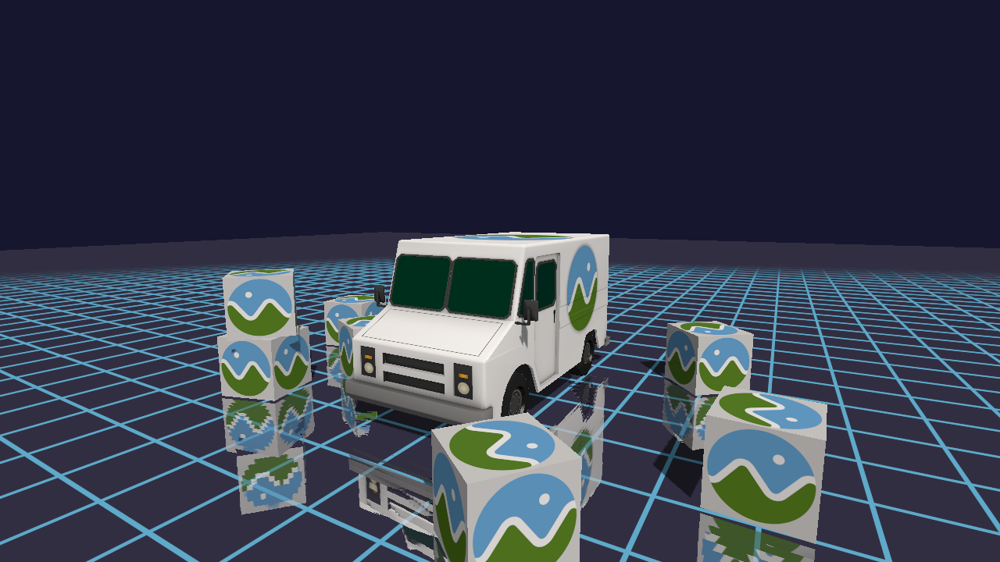
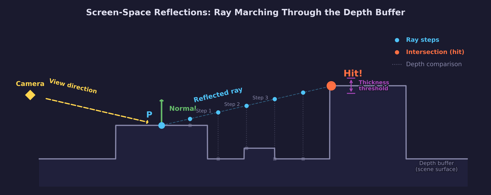
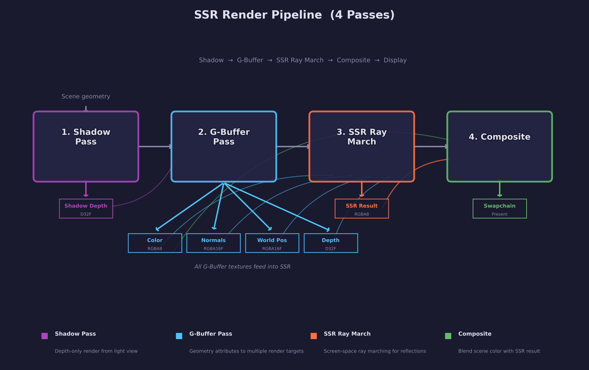
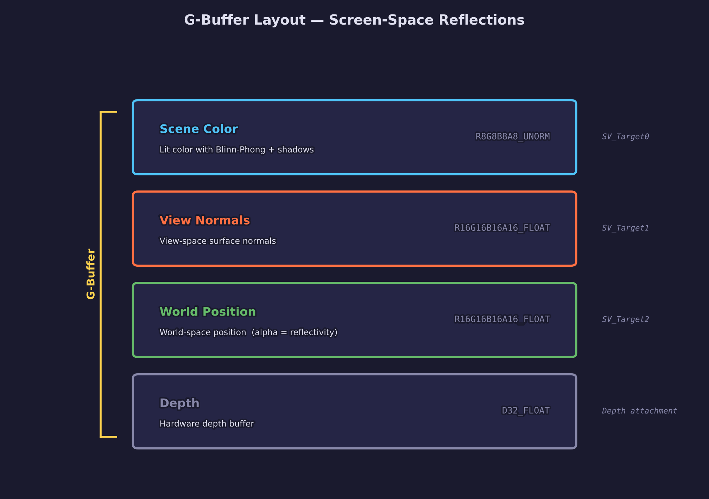

# Lesson 29 — Screen-Space Reflections

Screen-space reflections (SSR) trace reflected rays through the depth buffer to
produce dynamic mirror-like reflections from any surface in the scene. Unlike
environment maps, which reflect a static or pre-captured skybox, SSR reflects
the actual rendered scene — including other objects, animated geometry, and
lighting changes — at no extra draw calls beyond the screen-space passes
themselves.

## What you will learn

- What screen-space reflections are and when to prefer them over environment
  maps or planar reflections
- How to extend a G-buffer to store world-space position alongside color,
  normals, and depth
- View-space ray marching — reflecting the camera-to-surface direction across
  the surface normal and stepping through screen space
- Depth buffer intersection testing — comparing the marched ray's depth against
  the stored scene depth at each step to detect hits
- Screen-edge fadeout — attenuating reflections as the hit point approaches
  the screen boundary, where information is unavailable
- Compositing reflected color with the original scene using surface roughness
  or a reflectivity mask
- The inherent limitations of screen-space methods: missing off-screen
  geometry, backface information, and transparent surfaces

## Result



The screenshot shows the reflective floor surface displaying mirror-like
reflections of the CesiumMilkTruck and BoxTextured models. Notice how the
reflections match the scene exactly — moving the camera or the objects updates
the reflections in real time. Near the screen edges, reflections fade
gracefully to avoid hard cutoffs where ray marching runs out of data.

## Overview

Environment mapping (Lesson 14) approximates reflections by sampling a
pre-rendered cubemap. This works well for distant surroundings (sky, mountains)
but cannot reflect nearby objects — a shiny floor will never show the truck
parked on it because the cubemap was captured from a single point, not from
every surface in the scene.

**Screen-space reflections** solve this by reusing what the camera has already
rendered. The G-buffer contains the scene's color, normals, depth, and
world-space positions. For each pixel on a reflective surface, SSR computes
the reflected view direction, then marches that ray through screen space,
sampling the depth buffer at each step. When the ray's depth matches the
stored depth, a hit is detected and the corresponding scene color is used as
the reflection.

The key trade-off: SSR can only reflect geometry that is visible on screen.
Anything behind the camera, occluded by another object, or outside the
viewport cannot contribute to reflections. This makes SSR a complement to
environment mapping, not a replacement — production engines typically combine
both, using SSR for nearby detail and falling back to a cubemap for anything
SSR cannot resolve.

## How SSR works



The algorithm runs in four conceptual steps for each reflective pixel:

1. **Reconstruct the view-space position** from the depth buffer using the
   inverse projection matrix — the same technique from
   [Lesson 27 (SSAO)](../27-ssao/).

2. **Compute the reflected direction.** The view direction is the normalized
   vector from the camera to the surface point. Reflecting this across the
   surface normal gives the direction to march:

   ```hlsl
   float3 view_dir = normalize(frag_pos);
   float3 reflect_dir = reflect(view_dir, normal);
   ```

   The HLSL `reflect` intrinsic computes `I - 2 * dot(N, I) * N`, which is
   the standard reflection formula from optics.

3. **March the ray through screen space.** Starting from the fragment's screen
   position, step along the projected reflected direction. At each step,
   project the 3D ray position to screen UV and read the depth buffer:

   ```hlsl
   float3 ray_pos = frag_pos + reflect_dir * step_size * (float)i;
   float4 projected = mul(projection, float4(ray_pos, 1.0));
   float2 sample_uv = (projected.xy / projected.w) * 0.5 + 0.5;
   sample_uv.y = 1.0 - sample_uv.y;

   float scene_depth = depth_tex.Sample(depth_smp, sample_uv).r;
   float3 scene_pos = view_pos_from_depth(sample_uv, scene_depth);
   ```

4. **Test for intersection.** If the ray's Z coordinate passes behind the
   stored surface depth (the ray has crossed the geometry), a hit is
   detected. The scene color at the hit UV becomes the reflected color:

   ```hlsl
   float depth_diff = ray_pos.z - scene_pos.z;
   if (depth_diff > 0.0 && depth_diff < thickness)
   {
       hit_color = color_tex.Sample(color_smp, sample_uv).rgb;
       hit = true;
       break;
   }
   ```

   The `thickness` parameter prevents false hits from rays that have passed
   far behind the surface — only intersections within a thin slab around the
   stored depth are accepted.

## Render passes



Each frame executes four GPU render passes in sequence:

```text
Pass 1: Shadow       -> shadow_depth    (D32_FLOAT, 2048x2048)
Pass 2: G-buffer     -> scene_color     (R8G8B8A8_UNORM, 1280x720)
                     -> view_normals    (R16G16B16A16_FLOAT, 1280x720)
                     -> world_position  (R32G32B32A32_FLOAT, 1280x720)
                     -> scene_depth     (D32_FLOAT, 1280x720)
Pass 3: SSR          -> ssr_color       (R8G8B8A8_UNORM, 1280x720)
Pass 4: Composite    -> swapchain       (sRGB output)
```

### Pass 1 — Shadow map

The shadow pass renders the scene from the directional light's perspective into
a 2048x2048 depth-only texture. This is the same technique from
[Lesson 15 (Cascaded Shadow Maps)](../15-cascaded-shadow-maps/). The resulting
depth map is sampled during the G-buffer pass to determine which pixels are in
shadow.

### Pass 2 — G-buffer (3 color targets + depth)

The geometry pass renders the entire scene in a single draw call, writing to
three color render targets plus the depth buffer simultaneously using multiple
render targets (MRT). This is the same G-buffer architecture from
[Lesson 27 (SSAO)](../27-ssao/), extended with a third color target for
world-space position.

The vertex shader computes all coordinate spaces in one pass:

```hlsl
output.clip_pos   = mul(mvp, float4(input.pos, 1.0));
output.world_pos  = mul(model, float4(input.pos, 1.0)).xyz;
output.view_nrm   = normalize(mul((float3x3)view, world_normal));
```

The fragment shader writes to three `SV_Target` outputs:

```hlsl
struct PSOutput {
    float4 color      : SV_Target0;  /* lit scene color (Blinn-Phong + shadow) */
    float4 view_norm  : SV_Target1;  /* view-space surface normal              */
    float4 world_pos  : SV_Target2;  /* world-space position                   */
};
```

On the CPU side, the pipeline is created with `num_color_targets = 3`, and all
three textures are attached when beginning the render pass:

```c
SDL_GPUColorTargetInfo color_targets[3];
color_targets[0].texture = state->scene_color;     /* SV_Target0 */
color_targets[1].texture = state->view_normals;     /* SV_Target1 */
color_targets[2].texture = state->world_position;   /* SV_Target2 */

SDL_BeginGPURenderPass(cmd, color_targets, 3, &depth_target);
```

### Pass 3 — SSR ray march

A fullscreen quad pass reads the G-buffer textures (scene color, view normals,
depth) and performs the screen-space ray march for each pixel. The output is an
SSR color texture that contains the reflected color at pixels where a hit was
found, and black (or transparent) where no hit occurred.

The ray march shader is the core of this lesson and is described in detail in
[The SSR ray march shader](#the-ssr-ray-march-shader) below.

### Pass 4 — Composite

The composite pass combines the original scene color with the SSR result and
writes to the swapchain. It also supports multiple display modes for debugging
(see [Debug visualization](#debug-visualization)).

```hlsl
float3 final = lerp(scene_color, ssr_color, reflection_strength * fade);
```

The `reflection_strength` factor controls how reflective the surface is (0.0
for fully diffuse, 1.0 for a perfect mirror). The `fade` value handles
screen-edge attenuation.

## G-buffer layout



| Target | Texture | Format | Content | Used by |
|--------|---------|--------|---------|---------|
| SV_Target0 | `scene_color` | R8G8B8A8_UNORM | Lit scene color (Blinn-Phong + shadow) | Composite pass |
| SV_Target1 | `view_normals` | R16G16B16A16_FLOAT | View-space surface normal (xyz) | SSR pass |
| SV_Target2 | `world_position` | R32G32B32A32_FLOAT | World-space position (xyz) | SSR pass |
| Depth | `scene_depth` | D32_FLOAT | Hardware depth buffer | SSR pass |

### Why store world-space position?

Lesson 27 reconstructed view-space position from the depth buffer using the
inverse projection matrix — 65 matrix multiplies per pixel (once per fragment
plus once per kernel sample). For SSAO that approach made sense because the
reconstruction was amortized across the kernel loop.

SSR also uses `view_pos_from_depth` for the per-step depth comparison during
ray marching, but it additionally needs world-space positions for computing the
initial view direction and reflection vector. Storing world-space position in
the G-buffer avoids a second inverse transform (through both the inverse
projection and inverse view matrices) at every pixel. The cost is one extra
R32G32B32A32_FLOAT texture (16 bytes per pixel), which is worthwhile given the
simpler shader math.

### Why R16G16B16A16_FLOAT for normals?

Normal components range from -1.0 to +1.0. A 16-bit float format stores these
signed values directly without the encode/decode step that an 8-bit UNORM
format would require. This is the same reasoning as
[Lesson 27](../27-ssao/#why-r16g16b16a16_float-for-normals).

## The SSR ray march shader

The ray march shader is the core of the SSR algorithm. For each pixel, it
determines whether a reflected ray intersects any scene geometry visible on
screen.

### Step 1 — Reconstruct the view-space position

The same `view_pos_from_depth` function from Lesson 27 converts the stored
depth value into a 3D view-space position:

```hlsl
float3 view_pos_from_depth(float2 uv, float depth)
{
    float2 ndc_xy = uv * 2.0 - 1.0;
    ndc_xy.y = -ndc_xy.y;

    float4 clip = float4(ndc_xy, depth, 1.0);
    float4 view = mul(inv_projection, clip);
    return view.xyz / view.w;
}
```

### Step 2 — Compute the reflection direction

The view direction is the normalized vector from the camera origin (which is
at the origin in view space) to the fragment position. Reflecting this across
the surface normal gives the direction to march:

```hlsl
float3 view_dir = normalize(frag_pos);
float3 reflect_dir = reflect(view_dir, frag_normal);
```

The reflection formula `reflect(I, N)` computes `I - 2 * dot(N, I) * N`. This
is the law of reflection from geometric optics: the angle of incidence equals
the angle of reflection, mirrored about the surface normal.

### Step 3 — Project the reflection into screen space

Before marching, the shader transforms both the start position and a point
along the reflected ray into screen UV coordinates. The march then interpolates
between these two screen-space endpoints:

```hlsl
float3 ray_end = frag_pos + reflect_dir * max_distance;

/* Project start and end to screen UV. */
float4 start_proj = mul(projection, float4(frag_pos, 1.0));
float4 end_proj   = mul(projection, float4(ray_end, 1.0));

float2 start_uv = (start_proj.xy / start_proj.w) * 0.5 + 0.5;
float2 end_uv   = (end_proj.xy / end_proj.w) * 0.5 + 0.5;
```

### Step 4 — March and test for intersection

The shader steps along the ray in uniform increments, projecting each 3D
position to screen UV and comparing against the depth buffer:

```hlsl
for (int i = 1; i <= max_steps; i++)
{
    float t = (float)i / (float)max_steps;
    float3 ray_pos = frag_pos + reflect_dir * max_distance * t;

    /* Project to screen UV. */
    float4 proj = mul(projection, float4(ray_pos, 1.0));
    float2 uv = (proj.xy / proj.w) * 0.5 + 0.5;
    uv.y = 1.0 - uv.y;

    /* Read scene depth and compare. */
    float stored_depth = depth_tex.Sample(depth_smp, uv).r;
    float3 stored_pos = view_pos_from_depth(uv, stored_depth);

    float depth_diff = ray_pos.z - stored_pos.z;
    if (depth_diff > 0.0 && depth_diff < thickness)
    {
        hit_uv = uv;
        hit = true;
        break;
    }
}
```

The intersection test has two conditions:

- **`depth_diff > 0.0`** — The ray has passed behind the stored surface. In
  view space, Z increases with distance from the camera, so `ray_pos.z >
  stored_pos.z` means the ray is farther from the camera than the geometry at
  that screen position.

- **`depth_diff < thickness`** — The ray has not passed too far behind the
  surface. Without this check, a ray could pass through a thin wall and
  falsely "hit" a distant surface on the other side. The thickness parameter
  defines the maximum acceptable depth difference for a valid hit.

### Tuning parameters

| Parameter | Typical value | Effect |
|-----------|---------------|--------|
| `max_steps` | 64 | Number of ray march steps. More steps = higher quality but slower. |
| `max_distance` | 50.0 | Maximum world-space distance the ray can travel. |
| `thickness` | 0.5 | Depth slab thickness for hit acceptance. |
| `step_size` | max_distance / max_steps | Distance between consecutive samples. |

## Edge fadeout

SSR can only find reflections within the screen boundaries. When a reflected
ray hits geometry near the edge of the viewport, the result is valid but
unreliable — a slight camera movement could push the hit off-screen entirely.
Without fadeout, reflections would pop in and out abruptly at screen edges,
which is visually distracting.

The solution is to attenuate the reflection strength based on how close the hit
UV is to any screen edge:

```hlsl
float2 edge_factor = smoothstep(0.0, fade_distance, hit_uv)
                   * smoothstep(0.0, fade_distance, 1.0 - hit_uv);
float fade = edge_factor.x * edge_factor.y;
```

When the hit UV is near 0.0 or 1.0 in either axis, `smoothstep` produces a
value approaching zero, which fades the reflection to nothing. The
`fade_distance` parameter (typically 0.1 to 0.2, representing 10-20% of the
screen dimension) controls how wide the fade band is. A wider band produces
smoother transitions but reduces the area where full-strength reflections are
visible.

This per-axis approach fades independently in X and Y. Corner regions, where
two edges meet, receive double attenuation — which is correct, since corner
hits are the least reliable.

## Limitations

Screen-space reflections are powerful but have fundamental constraints imposed
by working with only what the camera sees:

- **Off-screen geometry is invisible.** Objects behind the camera, above the
  viewport, or to the sides cannot be reflected. A floor reflection of a tall
  building will be cut off where the building extends above the top of the
  screen.

- **Occluded surfaces produce no reflections.** If object A is in front of
  object B from the camera's perspective, the depth buffer stores only A's
  depth. A reflected ray that should hit B will either miss entirely or
  incorrectly hit A.

- **Backfaces are not in the G-buffer.** The G-buffer stores only front-facing
  surface information. A reflected ray looking at the back of an object will
  find no valid data — the depth buffer records the front face, not the
  interior.

- **Transparent surfaces are problematic.** The G-buffer stores a single layer
  of depth and color. Transparent objects either write to the G-buffer
  (blocking what is behind them) or do not write at all (becoming invisible to
  reflections).

- **Rays marching toward the camera produce stretched artifacts.** When the
  reflected direction points back toward the camera, small steps in 3D space
  map to large jumps in screen space, causing the ray to skip over potential
  intersections.

These limitations are why production engines use SSR as one component in a
layered reflection system, with cubemap fallback for anything SSR cannot
resolve.

## Debug visualization

The lesson provides five display modes to inspect each stage of the pipeline.
Press the corresponding number key to switch views:

| Key | Mode | Description |
|-----|------|-------------|
| **1** | Final composite | Scene color blended with SSR reflections (default) |
| **2** | Scene only | Lit scene without reflections — comparison baseline |
| **3** | SSR only | Reflected colors on black background — shows where hits occur |
| **4** | View normals | View-space normals visualized as RGB — verifies G-buffer |
| **5** | Depth buffer | Linearized depth as grayscale — verifies depth reconstruction |

The SSR-only view (key 3) is particularly useful for tuning parameters. Black
pixels are misses (no intersection found), while colored pixels show the
reflected scene color. Gaps or noise in the reflection indicate that
`max_steps` or `thickness` need adjustment.

## Controls

| Key | Action |
|-----|--------|
| **WASD** | Move camera |
| **Space / LShift** | Move up / down |
| **Mouse** | Look around |
| **1** | Final composite (default) |
| **2** | Scene only |
| **3** | SSR only |
| **4** | View normals |
| **5** | Depth buffer |
| **Escape** | Release mouse / quit |

## Code structure

```text
lessons/gpu/29-screen-space-reflections/
├── main.c                         # 4-pass renderer with SSR
├── shaders/
│   ├── shadow.vert.hlsl           # Light-space vertex transform
│   ├── shadow.frag.hlsl           # Empty (depth-only write)
│   ├── scene.vert.hlsl            # Clip/world/view-space transforms; 3 MRT outputs
│   ├── scene.frag.hlsl            # Blinn-Phong + shadow; writes color, normals, position
│   ├── grid.vert.hlsl             # Grid quad transform with view-space normal
│   ├── grid.frag.hlsl             # Procedural grid + shadow; MRT output with reflectivity
│   ├── fullscreen.vert.hlsl       # SV_VertexID fullscreen quad
│   ├── ssr.frag.hlsl              # Screen-space ray march
│   └── composite.frag.hlsl        # Scene color + SSR blend; debug mode switching
├── shaders/compiled/              # SPIRV + DXIL + C headers
└── assets/
    └── screenshot.png
```

### Key data flow

- `scene.vert.hlsl` outputs `world_pos` (TEXCOORD0) and `view_nrm`
  (TEXCOORD3) for the G-buffer MRT targets.
- `scene.frag.hlsl` writes a `PSOutput` struct to three render targets:
  `SV_Target0` (lit color), `SV_Target1` (view-space normal), and
  `SV_Target2` (world-space position).
- `ssr.frag.hlsl` reads three textures: `color_tex` (scene color),
  `normal_tex` (view normals), and `depth_tex` (scene depth). It outputs
  the reflected color at hit pixels.
- `composite.frag.hlsl` reads `color_tex` (scene color) and `ssr_tex` (SSR
  result) and writes the blended output to the swapchain.

## Shaders

| File | Purpose |
|------|---------|
| `scene.vert.hlsl` | Transforms vertices to clip, world, and view space with outputs for 3 MRT targets |
| `scene.frag.hlsl` | Blinn-Phong with shadow mapping, writes lit color, view normals, and world position |
| `shadow.vert.hlsl` | Depth-only vertex shader for shadow map generation |
| `shadow.frag.hlsl` | Empty fragment shader for the shadow pass (depth written automatically) |
| `grid.vert.hlsl` | Grid vertex shader with view-space normal output for SSR |
| `grid.frag.hlsl` | Anti-aliased procedural grid with shadow receiving and MRT output |
| `fullscreen.vert.hlsl` | Fullscreen triangle via `SV_VertexID` for screen-space passes |
| `ssr.frag.hlsl` | Screen-space ray march with depth intersection testing and edge fadeout |
| `composite.frag.hlsl` | Combines scene color with SSR result, supports debug display modes |

## Building

```bash
python scripts/compile_shaders.py 29       # compile shaders
cmake -B build
cmake --build build --config Debug --target 29-screen-space-reflections
```

## Cross-references

- [Lesson 27 — SSAO](../27-ssao/) — same G-buffer architecture, same
  `view_pos_from_depth` reconstruction technique, same MRT pipeline
- [Lesson 15 — Cascaded Shadow Maps](../15-cascaded-shadow-maps/) — shadow
  mapping used in the G-buffer pass
- [Lesson 14 — Environment Mapping](../14-environment-mapping/) — cubemap-based
  reflections, the alternative technique that SSR complements
- [Lesson 12 — Shader Grid](../12-shader-grid/) — the procedural grid floor
  that serves as the primary reflective surface
- [Lesson 10 — Basic Lighting](../10-basic-lighting/) — Blinn-Phong shading
  model used in the scene pass

## AI skill

The [`/screen-space-reflections`](../../../.claude/skills/screen-space-reflections/)
skill automates adding SSR to an SDL GPU project. It sets up the G-buffer
extension (world-space position target), the SSR ray march pass, and the
composite blending — following the same patterns established in this lesson.

## What's next

This lesson completes the core deferred screen-space effects track (SSAO in
Lesson 27, SSR here). From here you can combine both effects in a single
pipeline, add temporal accumulation to reduce SSR noise across frames, or
implement screen-space global illumination (SSGI) using a similar ray marching
approach with diffuse bounces instead of specular reflections.

## Further reading

- [Morgan McGuire & Michael Mara — "Efficient GPU Screen-Space Ray Tracing"
  (Journal of Computer Graphics Techniques, 2014)](http://jcgt.org/published/0003/04/04/)
  — the DDA-based hierarchical tracing method that improves on uniform stepping
- [Tomasz Stachowiak — "Stochastic Screen-Space Reflections" (SIGGRAPH 2015
  Advances in Real-Time Rendering)](https://www.ea.com/frostbite/news/stochastic-screen-space-reflections)
  — the stochastic approach used in Frostbite for rough surface reflections
- [LearnOpenGL — SSR](https://learnopengl.com/Advanced-Lighting/SSR) —
  step-by-step walkthrough with OpenGL code
- [GPU Gems 3, Chapter 10 — "Real-Time Computation of Dynamic Irradiance
  Environment Maps"](https://developer.nvidia.com/gpugems/gpugems3/part-ii-light-and-shadows)
  — context on reflection techniques in real-time rendering

## Exercises

1. **Binary search refinement.** After the linear ray march finds an
   approximate hit, add a binary search phase: bisect the interval between the
   last non-intersecting step and the first intersecting step 4-8 times to
   pinpoint the exact intersection. Compare the reflection quality before and
   after — binary refinement reduces stair-step artifacts on angled surfaces.

2. **Hierarchical ray marching.** Instead of uniform step sizes, start with
   large steps and halve the step size when the ray gets close to a surface
   (when `depth_diff` approaches zero). This covers more distance with fewer
   samples. Measure the performance improvement at 32 steps vs. 64 uniform
   steps with comparable quality.

3. **Roughness-based blurring.** Add a roughness value to the G-buffer (store
   it in the alpha channel of `view_normals`). In the SSR pass, use the
   roughness to jitter the reflection direction with random noise — rougher
   surfaces should produce blurrier, more scattered reflections. This requires
   multiple samples per pixel or a post-blur weighted by roughness.

4. **Cubemap fallback.** When the ray march finds no hit (the ray exits the
   screen), sample an environment cubemap as a fallback. Blend between SSR and
   the cubemap based on the edge fade factor — this eliminates the black voids
   where SSR has no data and produces reflections that are always complete.
