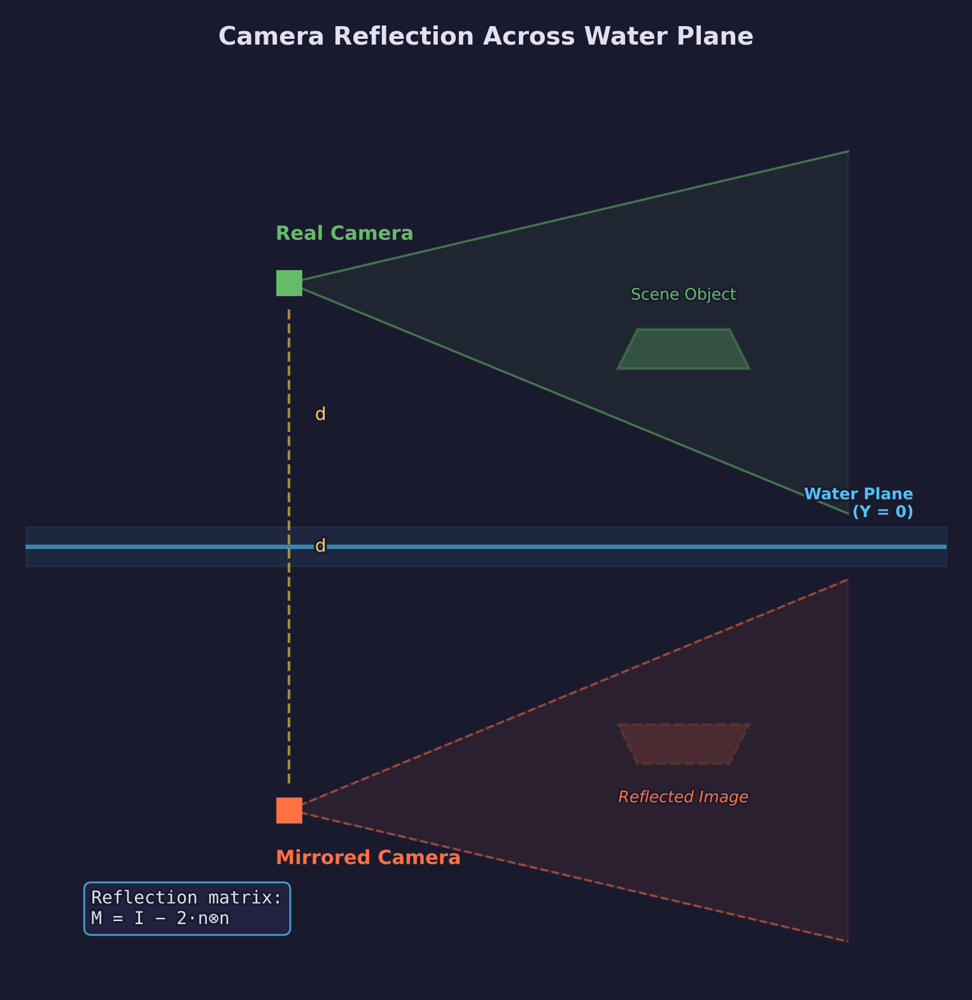
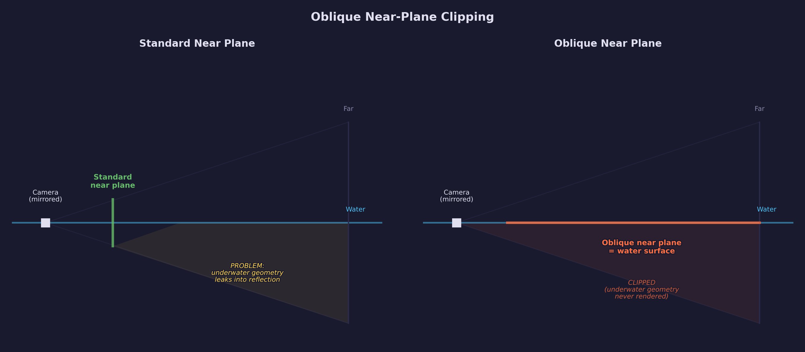
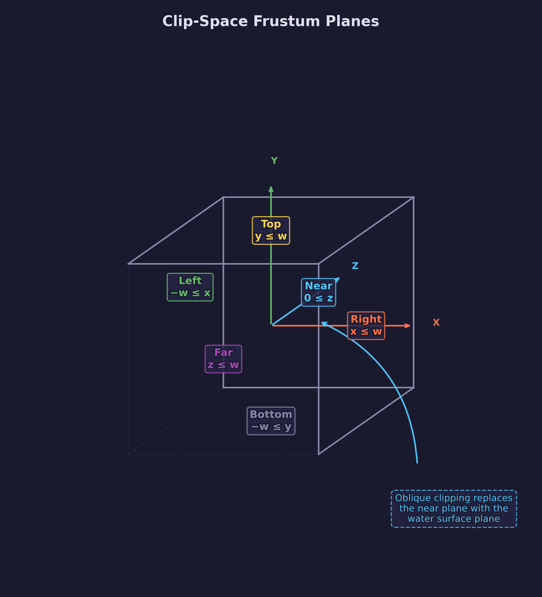
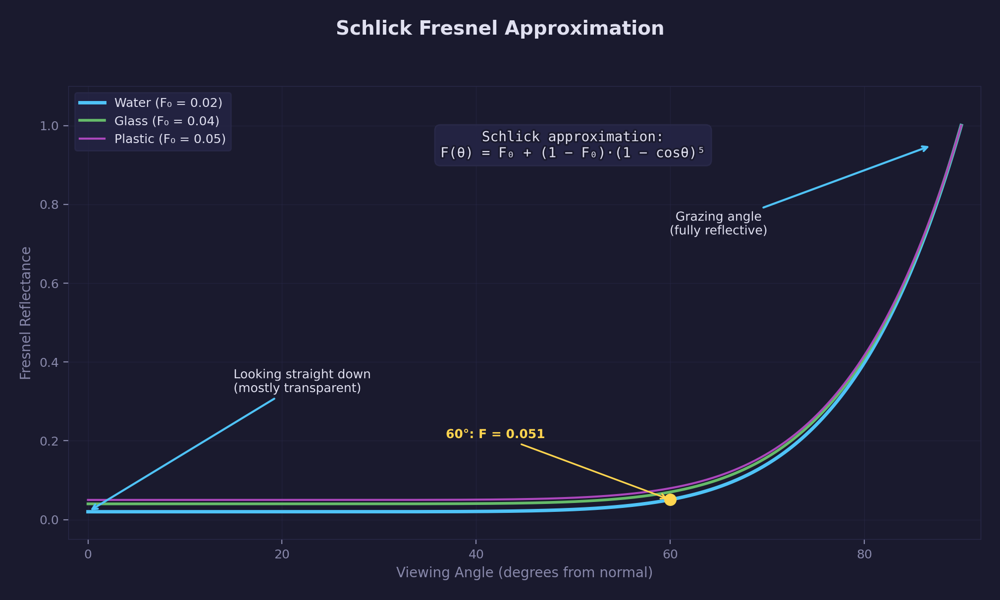
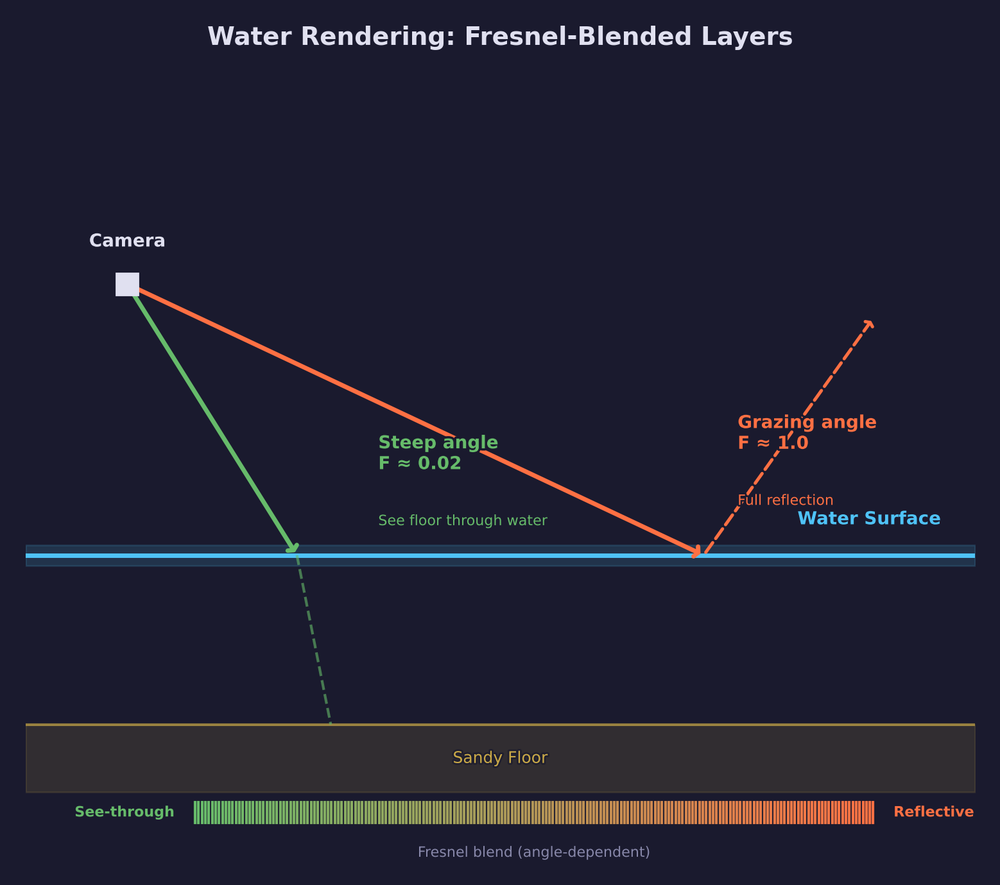
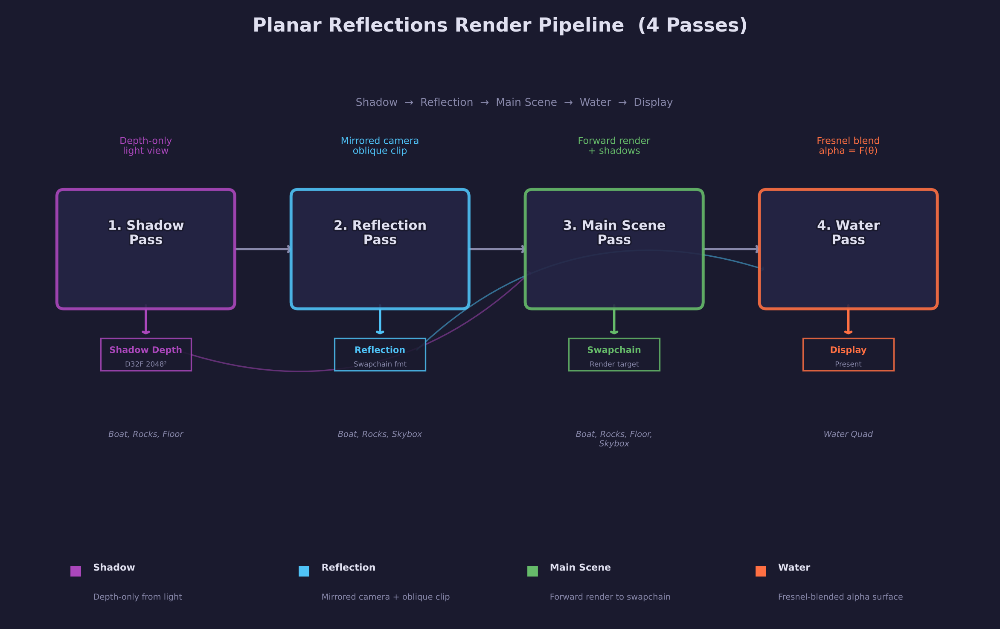
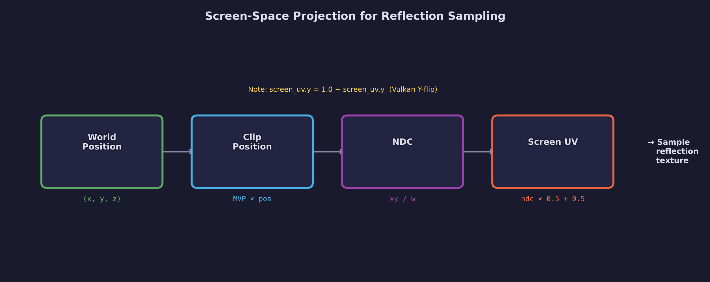
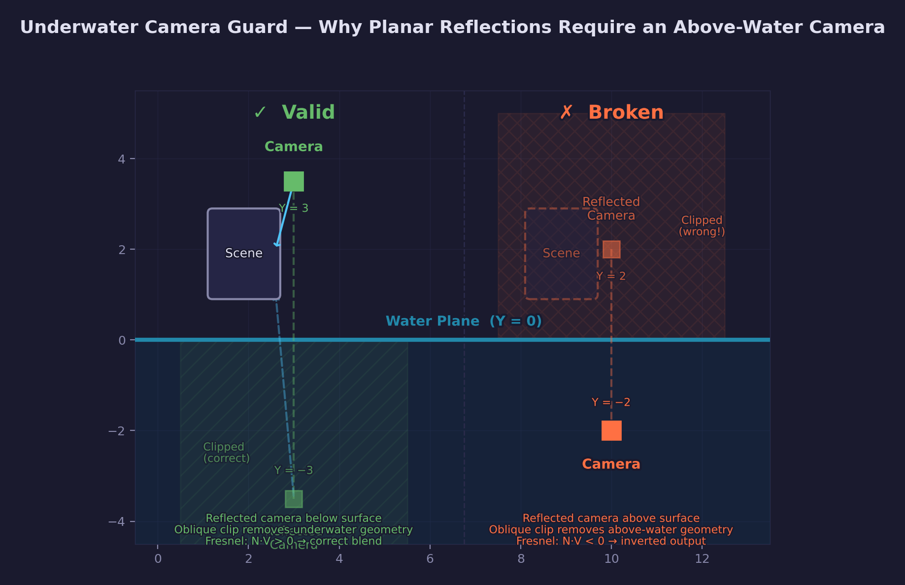

# Lesson 30 — Planar Reflections

Planar reflections render a pixel-perfect mirror image of the scene for flat
reflective surfaces like water, polished floors, or mirrors. The technique
mirrors the camera across the reflection plane, renders the scene from that
mirrored viewpoint into an offscreen texture, and composites the reflection
onto the surface using Fresnel blending.

This complements screen-space reflections (Lesson 29): SSR works for any
surface orientation but can only reflect what is visible on screen. Planar
reflections are limited to flat surfaces but produce artifact-free results
at any distance — no missing data, no screen-edge fadeout, no thickness
threshold issues.

## What you will learn

- How to construct a reflection matrix that mirrors the camera across an
  arbitrary plane
- Eric Lengyel's oblique near-plane clipping method — replacing the
  projection matrix's near plane with the water surface to prevent
  underwater geometry from appearing in reflections
- Rendering a complete scene from a mirrored camera into an offscreen
  texture for use as a reflection source
- Schlick's Fresnel approximation — how viewing angle controls the blend
  between reflection and transparency on water surfaces
- Screen-space UV projection — transforming fragment positions to sample
  the reflection texture at the correct location
- Combining shadow mapping, environment cube maps, and planar reflections
  in a single multi-pass renderer

## Result


A low-poly boat sits on reflective water surrounded by rock cliffs under an
HDR skybox. The water surface reflects the boat, rocks, and sky using
planar reflections. At steep angles (looking down) the sandy floor is
visible through the semi-transparent water. At grazing angles the water
becomes fully reflective due to the Fresnel effect.

## Key concepts

### Reflection matrix



To render the scene as it would appear reflected in a flat surface, mirror the
camera across that surface. For a plane defined by normal $\mathbf{n}$ and
distance $d$ (the equation $\mathbf{n} \cdot \mathbf{x} + d = 0$), the 4x4
reflection matrix is:

$$
M = I - 2\,\mathbf{n} \otimes \mathbf{n}
$$

For a horizontal water surface at Y = 0, the plane is (0, 1, 0, 0) and the
reflection matrix simply negates the Y component:

```c
static mat4 mat4_reflect(vec4 plane)
{
    float a = plane.x, b = plane.y, c = plane.z, d = plane.w;
    mat4 m;
    m.m[0]  = 1 - 2*a*a;  m.m[1]  =    -2*a*b;  m.m[2]  =    -2*a*c;  m.m[3]  = 0;
    m.m[4]  =    -2*a*b;  m.m[5]  = 1 - 2*b*b;  m.m[6]  =    -2*b*c;  m.m[7]  = 0;
    m.m[8]  =    -2*a*c;  m.m[9]  =    -2*b*c;  m.m[10] = 1 - 2*c*c;  m.m[11] = 0;
    m.m[12] =    -2*a*d;  m.m[13] =    -2*b*d;  m.m[14] =    -2*c*d;  m.m[15] = 1;
    return m;
}
```

Multiplying the camera position and view direction by this matrix produces the
mirrored camera. Rendering the scene from this mirrored viewpoint gives the
reflected image.

See [Math Lesson 05 — Matrices](../../math/05-matrices/) for a detailed treatment
of matrix transformations and composition.

### Oblique near-plane clipping



The mirrored camera sees geometry both above and below the water surface. Without
additional clipping, objects below the water leak into the reflection texture —
the sandy floor and submerged parts of the boat would appear where they should
not.

The solution is Eric Lengyel's oblique near-plane clipping method: modify the
mirrored camera's projection matrix so its near plane coincides with the water
surface. Geometry below the water is automatically clipped by the hardware depth
test.

The method transforms the water plane from view space to clip space, then
replaces row 2 of the projection matrix:

```c
static mat4 mat4_oblique_near_plane(mat4 proj, vec4 clip_plane_view)
{
    vec4 q;
    q.x = (signf_of(clip_plane_view.x) + proj.m[8])  / proj.m[0];
    q.y = (signf_of(clip_plane_view.y) + proj.m[9])  / proj.m[5];
    q.z = -1.0f;
    q.w = (1.0f + proj.m[10]) / proj.m[14];

    float scale = 1.0f / dot(clip_plane_view, q);
    proj.m[2]  = clip_plane_view.x * scale;
    proj.m[6]  = clip_plane_view.y * scale;
    proj.m[10] = clip_plane_view.z * scale;
    proj.m[14] = clip_plane_view.w * scale;
    return proj;
}
```

### Frustum planes



In clip space, the six frustum planes correspond to simple inequalities on
the clip-space coordinates. The near plane ($0 \le z$) is the one replaced
by the oblique clipping method. Understanding these relationships is essential
for any frustum-based technique including culling, shadow map partitioning,
and clip plane replacement.

### Fresnel blending



Real water surfaces are not uniformly reflective — reflectance depends on the
viewing angle. Schlick's approximation models this efficiently:

$$
F(\theta) = F_0 + (1 - F_0)(1 - \cos\theta)^5
$$

For water, $F_0 \approx 0.02$, meaning only 2% of light is reflected when looking
straight down (steep angle), but nearly 100% is reflected at grazing angles.
This matches everyday observation: you can see the bottom of a lake when
looking straight down, but the surface becomes a mirror when you look across
it at a low angle.

See [Math Lesson 01 — Vectors](../../math/01-vectors/) to learn about the dot
product ($\cos\theta$ term in the Fresnel formula).

The water fragment shader uses Fresnel to blend between the reflection texture
and a tint color representing the water itself:

```hlsl
float fresnel = fresnel_f0 + (1.0 - fresnel_f0) * pow(1.0 - NdotV, 5.0);
float3 color = lerp(water_tint.rgb, reflection, fresnel);
float  alpha = lerp(0.6, 1.0, fresnel);
```

The alpha channel also varies with Fresnel — steep angles are semi-transparent
(showing the floor below), while grazing angles are fully opaque.

### Water rendering layers



The water surface combines three visual elements:

1. **Reflection** — the mirrored scene, sampled from the reflection texture
   using screen-space UV projection
2. **Water tint** — a solid color representing the water material itself
3. **See-through** — the sandy floor visible through the semi-transparent
   water at steep viewing angles

The Fresnel factor controls the blend ratio between reflection and tint, while
the alpha output controls how much of the scene below (the floor rendered in
the main pass) shows through.

## Render passes



Each frame executes four GPU render passes:

```text
Pass 1: Shadow       -> shadow_depth     (D32_FLOAT, 2048x2048)
Pass 2: Reflection   -> reflection_color (R8G8B8A8_UNORM_SRGB, window size)
Pass 3: Main Scene   -> swapchain        (sRGB output)
Pass 4: Water        -> swapchain        (alpha-blended over main scene)
```

### Pass 1 — Shadow map

The shadow pass renders the scene (boat, rocks, floor) from the directional
light's perspective into a 2048x2048 depth-only texture. This is the same
technique from [Lesson 15 (Cascaded Shadow Maps)](../15-cascaded-shadow-maps/)
with front-face culling to reduce shadow acne.

### Winding reversal in reflections

A reflection matrix has a determinant of $-1$, which means it reverses the
handedness of the coordinate system. This flips the winding order of every
triangle: what was counter-clockwise becomes clockwise, and vice versa.

If the main scene pipeline uses `CULLMODE_BACK` with
`FRONTFACE_COUNTER_CLOCKWISE`, every reflected triangle appears back-facing
and gets culled — the reflection texture ends up empty. The fix is to create
a separate pipeline variant for the reflection pass with `FRONTFACE_CLOCKWISE`:

```c
/* Main scene pipeline — standard CCW front face. */
pi.rasterizer_state.front_face = SDL_GPU_FRONTFACE_COUNTER_CLOCKWISE;
pi.rasterizer_state.cull_mode  = SDL_GPU_CULLMODE_BACK;
scene_pipeline = SDL_CreateGPUGraphicsPipeline(device, &pi);

/* Reflected variant — CW front face compensates for the winding flip. */
pi.rasterizer_state.front_face = SDL_GPU_FRONTFACE_CLOCKWISE;
scene_pipeline_refl = SDL_CreateGPUGraphicsPipeline(device, &pi);
```

The same applies to the skybox pipeline (which uses `CULLMODE_FRONT` to
render from inside the cube). Every pipeline bound during the reflection
pass must use the reversed front-face convention.

### Pass 2 — Reflection

The reflection pass renders the scene from the mirrored camera into an
offscreen color texture. Key details:

- The camera position is reflected across the water plane
- The view matrix uses the reflected position and inverted pitch
- The projection matrix uses oblique near-plane clipping
- Front-face winding is reversed (the mirror flip changes triangle winding),
  so reflected pipelines use `FRONTFACE_CLOCKWISE` to compensate
- Rendered objects: boat, rocks, skybox — NOT the water surface or floor
- The shadow map from Pass 1 is available for shadow testing in the
  reflection

### Pass 3 — Main scene

Standard forward rendering to the swapchain with Blinn-Phong lighting and
shadow sampling. Renders the boat, rocks, sandy floor, and skybox.

### Pass 4 — Water surface

A large quad at Y = `WATER_LEVEL` rendered with alpha blending over the main
scene. The pass uses `LOAD` instead of `CLEAR` to preserve the scene already
rendered to the swapchain.

The water fragment shader:

1. Projects the fragment position to screen-space UV
2. Samples the reflection texture from Pass 2
3. Computes the Schlick Fresnel factor from the view angle
4. Blends the reflection with the water tint color
5. Outputs alpha based on the Fresnel factor

### Screen-space UV projection



The reflection texture contains the mirrored scene rendered from the
reflected camera. To sample it correctly, the water fragment shader
projects each fragment's clip-space position to screen-space UV:

```hlsl
float2 screen_uv = proj_pos.xy / proj_pos.w;
screen_uv = screen_uv * 0.5 + 0.5;
screen_uv.y = 1.0 - screen_uv.y;
```

The Y-flip accounts for the difference between clip-space coordinates
(Y-up) and texture coordinates (V-down in Vulkan/Metal).

### Underwater camera guard



Planar reflections assume the camera is on the reflecting side of the
plane — above the water surface. When the camera dips below the water
level, three things break simultaneously:

1. **Mirrored camera flips to the wrong side.** The reflection matrix
   mirrors the camera across the water plane. An above-water camera at
   Y = 3 produces a reflected camera at Y = −3 (below the surface,
   looking up). But an underwater camera at Y = −1 mirrors to Y = 1
   (above the surface, looking down) — the reflection shows the scene
   from *above* the water, which is the opposite of what you want.

2. **Oblique near-plane clips the wrong half-space.** The oblique
   clipping method replaces the near plane with the water surface to
   prevent geometry below the water from leaking into the reflection.
   When the reflected camera is above the water, this clips everything
   below Y = 0 — which is now the *visible* geometry, not the leaked
   geometry. The reflection texture ends up nearly empty.

3. **Fresnel produces inverted results.** The water surface normal
   points up `(0, 1, 0)`. When the camera is below the surface, the
   view direction points upward, making `N · V` negative. The Fresnel
   formula produces values outside `[0, 1]`, causing incorrect blending.

The standard solution is to **skip the reflection and water passes
entirely** when the camera is below the water level:

```c
bool camera_above_water = cam_position.y > WATER_LEVEL;

/* Pass 2: Reflection — only when above water. */
if (camera_above_water) {
    /* ... render reflected scene ... */
}

/* Pass 3: Main scene — always renders. */
/* ... render boat, rocks, floor, skybox ... */

/* Pass 4: Water overlay — only when above water. */
if (camera_above_water) {
    /* ... render water quad with Fresnel blending ... */
}
```

When the camera is underwater, the main scene pass still renders the
floor, boat, rocks, and skybox normally — the viewer simply sees the
scene without the water surface overlay. A production engine would
enhance this with underwater-specific effects: depth-based fog,
caustic light patterns projected onto the floor, color absorption
tinting, and a refracted view of the surface from below.

## Scene setup

The scene contains five visual elements:

| Element | Source | Notes |
|---------|--------|-------|
| Boat | glTF (`assets/boat/`) | 6 meshes, 3 materials, no textures |
| Rock cliffs | glTF (`assets/rocks/`) | 6 meshes, 1 textured material |
| Sandy floor | Procedural quad | Large plane at Y = −2.0 |
| Skybox | Cube map (6 PNG faces) | Converted from HDR equirectangular |
| Water | Procedural quad | At Y = 0.0, alpha-blended |

The HDR skybox was converted from an equirectangular `.hdr` image using
`scripts/equirect_to_cubemap.py` with Reinhard tone mapping:

```bash
python scripts/equirect_to_cubemap.py assets/citrus_orchard_puresky_2k.hdr assets/skybox/ --size 512
```

### Asset credits

| Asset | Author | License |
|-------|--------|---------|
| [Boat 3D Low-Poly](https://sketchfab.com/3d-models/boat-3d-low-poly-cc4e4619d8994b71b1f9230033cd1947) | shevchenkomr29 | [CC BY 4.0](https://creativecommons.org/licenses/by/4.0/) |
| [Low Poly Rock Cliffs](https://skfb.ly/oQVzB) | navebackwards | [CC BY 4.0](https://creativecommons.org/licenses/by/4.0/) |
| [Citrus Orchard Pure Sky](https://polyhaven.com/a/citrus_orchard_puresky) | Jarod Guest (photography), Poly Haven (processing) | [CC0 1.0](https://creativecommons.org/publicdomain/zero/1.0/) |

## Shaders

| File | Stage | Purpose |
|------|-------|---------|
| `shadow.vert.hlsl` | Vertex | Transform vertices by the light's MVP for depth rendering |
| `shadow.frag.hlsl` | Fragment | Empty — the shadow pass writes only depth |
| `scene.vert.hlsl` | Vertex | Transform vertices, pass world position, normal, UV, and shadow coords |
| `scene.frag.hlsl` | Fragment | Blinn-Phong lighting with shadow sampling and optional texture |
| `skybox.vert.hlsl` | Vertex | Rotation-only VP transform with `pos.xyww` depth technique |
| `skybox.frag.hlsl` | Fragment | Sample the cube map texture for the sky |
| `water.vert.hlsl` | Vertex | Transform water quad, pass position for screen-space UV |
| `water.frag.hlsl` | Fragment | Fresnel blend between reflection texture and water tint |

Compile all shaders with:

```bash
python scripts/compile_shaders.py 30
```

## Building

```bash
cmake -B build
cmake --build build --target 30-planar-reflections
```

Run the lesson:

```bash
./build/lessons/gpu/30-planar-reflections/30-planar-reflections
```

## Planar reflections vs screen-space reflections

| Property | Planar Reflections | SSR (Lesson 29) |
|----------|-------------------|-----------------|
| Surface shape | Flat only | Any orientation |
| Reflection quality | Pixel-perfect | Limited by screen data |
| Offscreen objects | Fully visible | Missing |
| Cost | Extra scene render | Fullscreen ray march |
| Setup complexity | Moderate | Complex (G-buffer + ray march) |
| Multiple reflectors | One pass per plane | Single pass for all |

Production engines often combine both: planar reflections for water and
mirrors, SSR for arbitrary surfaces, and environment maps as a fallback for
anything neither technique can resolve.

## AI skill

The [Planar Reflections skill](../../../.claude/skills/forge-planar-reflections/SKILL.md)
provides a ready-to-use template for adding planar reflections to any
SDL GPU project.

## What's next

This lesson covers the simplest form of planar reflections — a flat,
horizontal water surface. Extensions to explore:

- Normal-mapped water with animated ripples that perturb the reflection UV
- Multiple reflection planes (floor mirrors, windows) with stencil masking
- Depth-aware edge blending to soften reflection edges near the waterline
- Combining planar reflections with SSR — use the planar reflection as the
  fallback when SSR rays exit the screen

## Further reading

### In-repo math lessons

- [Math Lesson 02 — Coordinate Spaces](../../math/02-coordinate-spaces/)
  — transformations between spaces, essential for understanding mirrored cameras
- [Math Lesson 05 — Matrices](../../math/05-matrices/)
  — reflection matrices and view transformations
- [Math Lesson 01 — Vectors](../../math/01-vectors/)
  — dot products and the Fresnel formula

### External references

- [Eric Lengyel — "Oblique View Frustum Depth Projection and Clipping"
  (Journal of Game Development, 2005)](http://www.terathon.com/lengyel/Lengyel-Oblique.pdf)
  — the original paper on the oblique near-plane clipping method
- [Christophe Schlick — "An Inexpensive BRDF Model for Physically-based
  Rendering" (1994)](https://citeseerx.ist.psu.edu/document?repid=rep1&type=pdf&doi=b26c2e21fdf3098f9a3c651e6cd5ef4f16cc5f3e)
  — the Fresnel approximation used in the water shader
- [GPU Gems, Chapter 2 — "Rendering Water Caustics"](https://developer.nvidia.com/gpugems/gpugems/part-i-natural-effects/chapter-2-rendering-water-caustics)
  — broader context on water rendering techniques
- [LearnOpenGL — Cubemaps](https://learnopengl.com/Advanced-OpenGL/Cubemaps)
  — skybox rendering with cube map textures

## Exercises

1. **Animated water normals.** Add a time-varying normal perturbation to the
   water surface. Instead of the flat normal `(0, 1, 0)`, compute a normal
   from two scrolling sine waves. Use this perturbed normal to offset the
   screen-space UV when sampling the reflection texture, creating ripple
   distortion.

2. **Refraction texture.** Render the floor and underwater objects into a
   second offscreen texture (the refraction pass) from the regular camera.
   Sample both the reflection and refraction textures in the water shader,
   blending based on Fresnel. This replaces the simple "see through to
   the main scene" approach with proper refractive effects.

3. **Stencil-masked reflection.** Instead of rendering the reflection for
   the entire screen, use a stencil buffer to mark only the water pixels
   during a pre-pass. Then render the reflection pass with a stencil test
   so the mirrored scene is only drawn where water will appear. Measure the
   performance improvement compared to rendering the full-screen reflection.

4. **Multiple reflection planes.** Add a second reflective surface (a floor
   mirror or a vertical wall). Each plane needs its own reflection texture
   and mirrored camera. Implement this by rendering one reflection pass per
   plane, using stencil masking to limit each pass to the relevant surface
   pixels.
