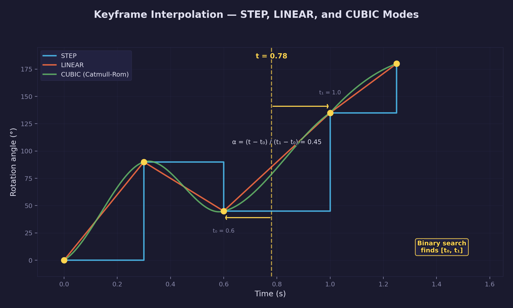
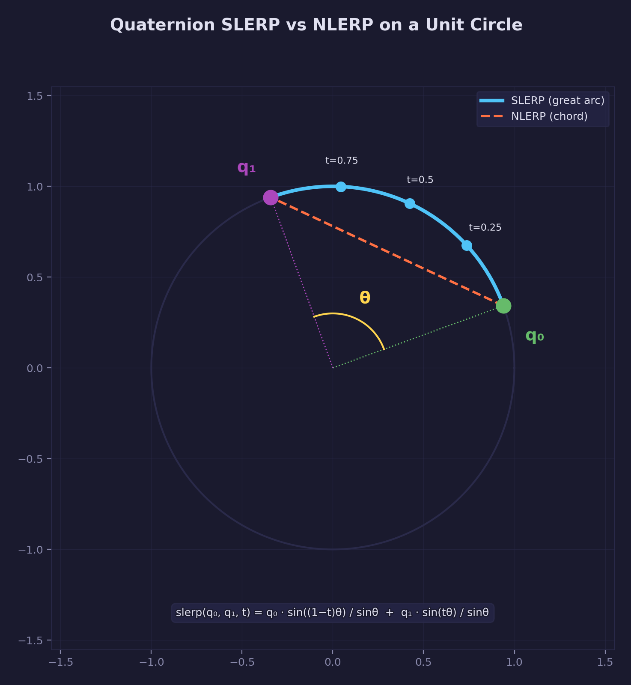
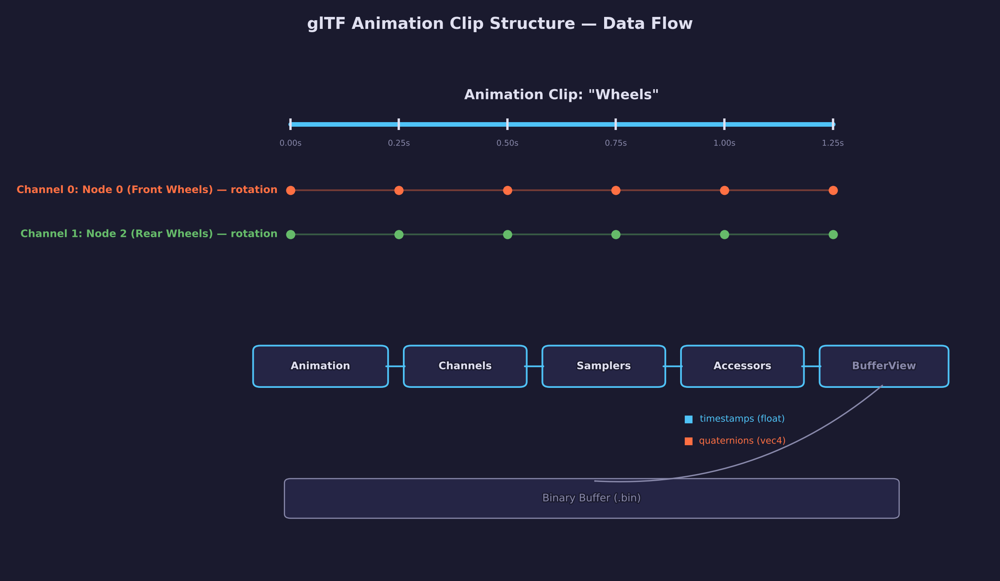
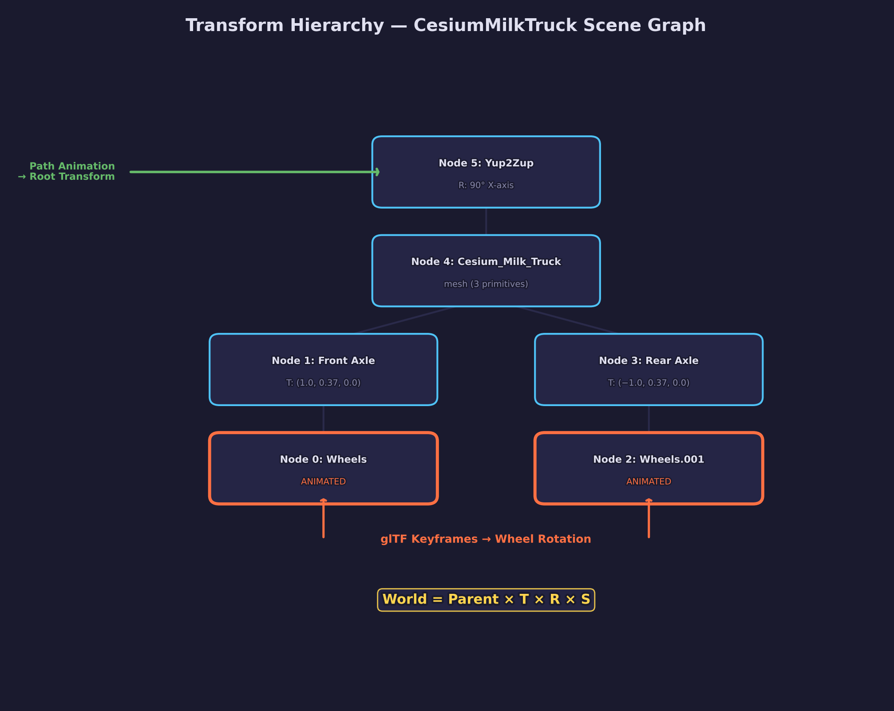
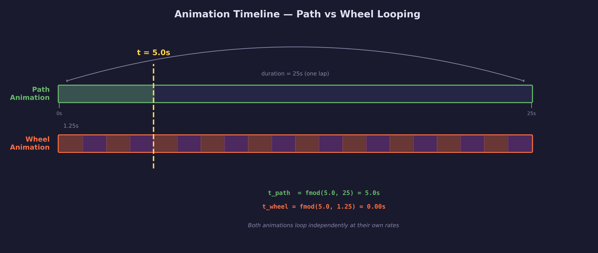
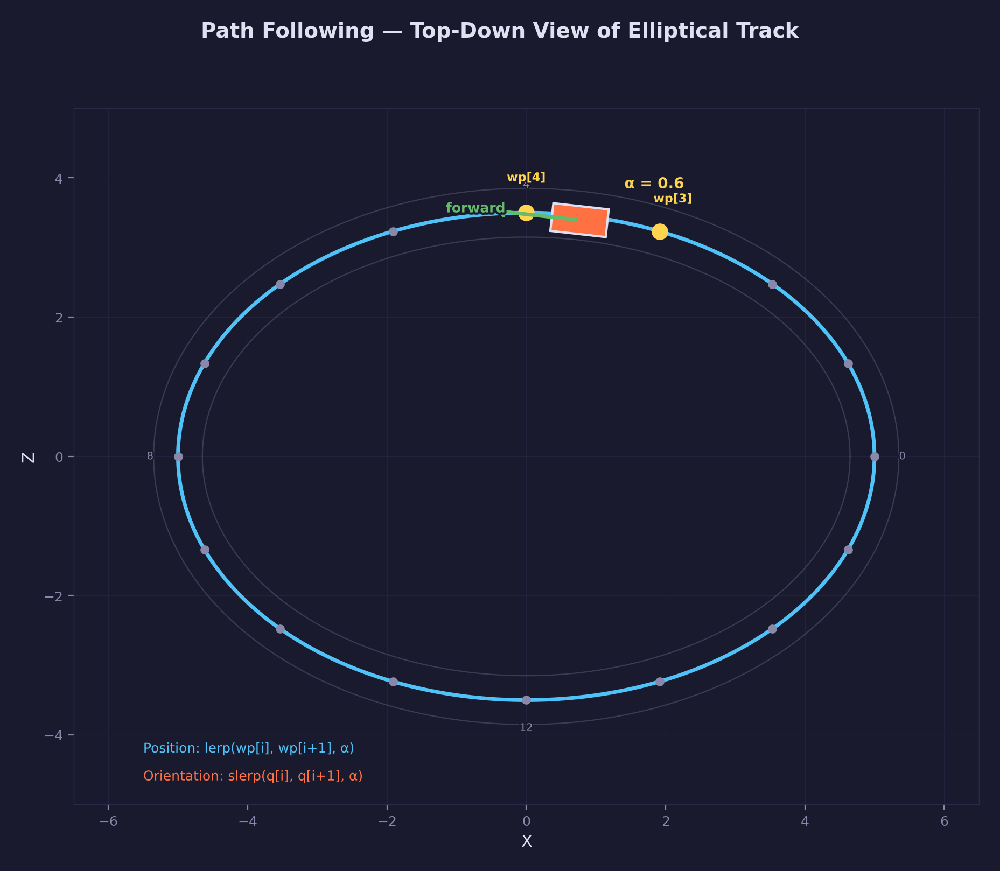
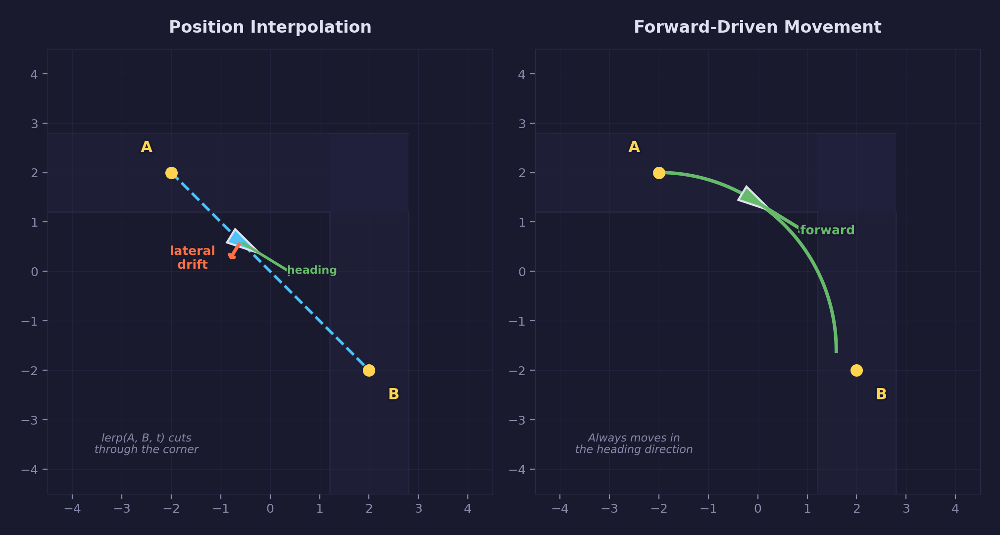
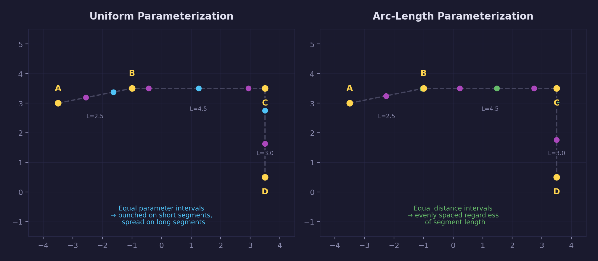

# Lesson 31 — Transform Animations

Keyframe animation drives the moving parts of a 3D scene: spinning wheels,
orbiting cameras, walking characters, vehicles following paths. The core
mechanism is simple — store a sequence of timestamped values, find the two
keyframes bracketing the current time, and interpolate between them. What
makes it interesting is the mathematics of interpolation (quaternion slerp
for rotations), the data pipeline from glTF binary buffers into runtime
structures, and the way a transform hierarchy composes independent
animation sources into a single coherent result.

This lesson loads the CesiumMilkTruck glTF model — which ships with a wheel
rotation animation — and drives it around a rectangular track with rounded corners using
path-following animation. The two animation layers (path placement and
wheel rotation) compose automatically through the node hierarchy.

## What you will learn

- How keyframe animation works: timestamps, values, and interpolation
- Binary search for efficient keyframe lookup in sorted timestamp arrays
- Ken Shoemake's quaternion slerp (spherical linear interpolation) for
  smooth, constant-angular-velocity rotations
- Loading animation data from glTF files — clips, channels, samplers,
  and accessor indirection into binary buffers
- Composing multiple animation layers through a transform hierarchy
  where each node carries a local TRS (translation, rotation, scale)
- Path-following animation with position lerp and orientation slerp

## Result


A CesiumMilkTruck model drives around a modular racetrack. The wheels
rotate via glTF keyframe animation while the truck follows an elliptical
path. A dirt ground plane extends beyond the track, lit by directional
sunlight with shadow mapping. A skybox provides the environmental backdrop.

## Key concepts

### 1. Keyframe animation



Animation stores a sequence of (timestamp, value) pairs called **keyframes**.
At runtime, the system finds the two keyframes that bracket the current time
and interpolates between them. The interpolation parameter $t$ describes
how far we are between the two timestamps:

$$
t = \frac{\text{current time} - \text{key}_{i}}{\text{key}_{i+1} - \text{key}_{i}}
$$

For translation and scale, standard linear interpolation (lerp) produces
correct results. For rotation, lerp produces non-uniform angular velocity
and incorrect intermediate orientations — quaternion slerp is required
instead.

**Finding the right keyframe pair** is an O(log n) operation via binary
search on the sorted timestamp array. The alternative — linear scan from
the beginning — is O(n) per evaluation and becomes measurable when clips
contain hundreds of keyframes across multiple channels.

### 2. Quaternion slerp



Rotation keyframes store **quaternions** — 4D unit vectors that represent
3D rotations. Quaternions avoid gimbal lock and compose efficiently, but
interpolating between them requires care.

**Linear interpolation (lerp)** of two quaternions followed by
renormalization (sometimes called nlerp) does produce a valid rotation, but
the angular velocity is non-uniform — the rotation accelerates through the
middle and decelerates at the endpoints. For short arcs this is acceptable;
for wide rotations the distortion is visible.

**Spherical linear interpolation (slerp)**, formalized by Ken Shoemake
(SIGGRAPH 1985), traces the great arc on the unit 4-sphere between the
two quaternions. The result has constant angular velocity — the rotation
progresses at a steady rate throughout the interpolation. The formula is:

$$
\text{slerp}(q_a, q_b, t) = \frac{\sin((1-t)\,\theta)}{\sin\theta}\,q_a + \frac{\sin(t\,\theta)}{\sin\theta}\,q_b
$$

where $\theta = \arccos(q_a \cdot q_b)$ is the angle between the two
quaternions.

**Shortest-path correction:** quaternions have double cover — both $q$ and
$-q$ represent the same rotation. If the dot product $q_a \cdot q_b < 0$,
the two quaternions are on opposite hemispheres of the 4-sphere and slerp
would take the long arc (more than 180 degrees). Negating one quaternion
before interpolation ensures the shortest path:

```c
float d = quat_dot(a, b);
if (d < 0.0f) {
    b = quat_create(-b.w, -b.x, -b.y, -b.z);
    d = -d;
}
```

**Small-angle fallback:** when $\theta$ is near zero, $\sin\theta$
approaches zero and the division becomes numerically unstable. The standard
approach is to fall back to normalized lerp (nlerp) when the quaternions are
nearly identical, since the arc is so short that the angular velocity
non-uniformity is imperceptible.

The math library provides `quat_slerp` with both of these corrections built
in. See [Math Lesson 08 — Orientation](../../math/08-orientation/) for the
full derivation of quaternion algebra, slerp, and nlerp.

### 3. glTF animation data



The glTF 2.0 format stores animation data in a structured hierarchy:

| Level | glTF term | Contains |
|-------|-----------|----------|
| Clip | `animation` | A named collection of channels and samplers |
| Channel | `channel` | Links a sampler to a target node + property (translation, rotation, or scale) |
| Sampler | `sampler` | Points to an input accessor (timestamps) and output accessor (values), plus an interpolation mode |
| Accessor | `accessor` | Describes the data type, count, and byte layout within a buffer view |
| Buffer view | `bufferView` | A byte range within the binary buffer |

The CesiumMilkTruck model contains one animation clip named "Wheels" with
two channels — both targeting the `rotation` property of the two wheel
nodes. The sampler references accessor 16 (31 scalar timestamps spanning
0.0 to 1.25 seconds) and accessors 17/18 (31 quaternion values each).

**Loading animation data** requires chasing the accessor indirection chain:
channel -> sampler -> accessor -> bufferView -> binary buffer. The accessor
tells us the component type (float), the element type (SCALAR for
timestamps, VEC4 for quaternions), and the count. The buffer view tells us
the byte offset and length within the `.bin` file.

### 4. Transform hierarchy



glTF nodes form a tree. Each node stores a local transform, either as a
raw 4x4 matrix or as decomposed translation (T), rotation (R), and scale
(S) components. The local transform is computed as:

$$
M_{\text{local}} = T \times R \times S
$$

The **world transform** of any node is the product of all local transforms
from the root down to that node:

$$
M_{\text{world}} = M_{\text{parent}} \times M_{\text{local}}
$$

This is computed with a top-down traversal — visit each node, multiply its
local transform by its parent's world transform, and store the result. The
CesiumMilkTruck hierarchy looks like:

- **Yup2Zup** (root)
  - **Cesium_Milk_Truck** (body mesh)
    - **Node** (front axle position)
      - **Wheels** (front wheel mesh, animated rotation)
    - **Node.001** (rear axle position)
      - **Wheels.001** (rear wheel mesh, animated rotation)

When the animation system updates a wheel node's rotation quaternion, the
hierarchy rebuild propagates that change into the wheel's world transform
automatically. The body node's transform is not affected — each node's
local transform is independent.

### 5. Composing animation layers



This lesson combines two independent animation sources:

| Layer | Source | Target | Property |
|-------|--------|--------|----------|
| Path animation | Procedural (code) | Root placement node | Position + orientation |
| Wheel animation | glTF keyframes | Wheel nodes | Rotation |

These layers operate at different levels of the hierarchy. The path
animation sets the truck body's position and orientation in the world.
The glTF keyframes set the wheel nodes' local rotations. When the
hierarchy is rebuilt, the matrix multiplication automatically composes
both layers:

```text
wheel_world = path_placement × body_local × axle_translation × wheel_rotation
```

No explicit layer blending or priority system is needed — the hierarchy
does the composition. This is the fundamental insight behind skeletal
animation systems: independent animation sources drive different joints,
and the parent-child multiplication produces the correct final pose.

### 6. Path following



The truck follows a closed rectangular track defined by waypoints. Each
waypoint stores a position and a yaw angle (the direction the truck should
face at that point). The 90-degree corners include arc midpoints at 45
degrees so the truck traces smooth curves rather than sharp right angles.

#### Forward-driven movement



A straightforward approach would interpolate both position and orientation
between waypoints — `vec3_lerp` for position, `quat_slerp` for
orientation. This produces visible lateral drift: the truck's position
follows a straight line between waypoints while its heading rotates
through the turn, so the truck appears to slide sideways.

Forward-driven movement eliminates this by decoupling position from the
waypoint data entirely. Each frame, the truck moves a fixed distance in
the direction it currently faces:

```c
float fwd_x = sinf(truck_yaw);
float fwd_z = cosf(truck_yaw);
truck_pos.x += fwd_x * step;
truck_pos.z += fwd_z * step;
```

Because the truck always moves in the direction it points, there is
no lateral component and no visible sliding — even through tight corners.

#### Arc-length parameterization



Forward-driven movement solves the drift problem, but introduces a new
one: when should the truck turn? The yaw schedule must advance in sync
with the truck's actual position along the path, not with elapsed time.

With **uniform parameterization**, each segment gets an equal fraction of
the parameter range regardless of its physical length. A short corner arc
and a long straight both receive the same parameter budget. The result is
that the truck turns too early or too late relative to where it actually
is on the path.

**Arc-length parameterization** solves this by precomputing the cumulative
distance to each waypoint. The yaw schedule then advances proportionally
to distance traveled rather than time elapsed. A long straight gets a
proportionally larger share of the parameter range, so the truck
completes the straight before beginning to turn — exactly matching its
physical position on the track.

## Animation data structures

The lesson defines three structures for runtime animation:

```c
/* One channel targets one property of one node. */
typedef struct ForgeAnimChannel {
    int   node_index;    /* which node in the glTF scene      */
    int   path;          /* 0=translation, 1=rotation, 2=scale */
    int   key_count;     /* number of keyframes                */
    float *timestamps;   /* sorted array of key_count floats   */
    float *values;       /* key_count * stride floats (3 or 4) */
} ForgeAnimChannel;

/* A clip is a collection of channels with a shared duration. */
typedef struct ForgeAnimClip {
    ForgeAnimChannel *channels;
    int               channel_count;
    float             duration;  /* max timestamp across all channels */
} ForgeAnimClip;

/* Per-instance playback state — multiple objects can share one clip. */
typedef struct ForgeAnimState {
    ForgeAnimClip *clip;
    float          time;      /* current playback position     */
    float          speed;     /* playback rate (1.0 = normal)  */
    bool           looping;   /* wrap time at duration?         */
} ForgeAnimState;
```

The separation between `ForgeAnimClip` (shared data) and `ForgeAnimState`
(per-instance playback) is important. Two trucks can share the same wheel
animation clip while each maintains its own playback time — one truck's
wheels can spin at a different phase than the other's.

## Loading animation from glTF

The animation loading function follows the glTF accessor indirection
chain to extract timestamp and value arrays from the binary buffer:

```c
static void load_animation_clip(ForgeAnimClip *clip,
                                const ForgeGltfScene *scene,
                                const Uint8 *bin_data,
                                const cJSON *anim_json)
{
    /* Parse channels array from the animation JSON object. */
    const cJSON *channels_json = cJSON_GetObjectItem(anim_json, "channels");
    const cJSON *samplers_json = cJSON_GetObjectItem(anim_json, "samplers");
    clip->channel_count = cJSON_GetArraySize(channels_json);

    for (int i = 0; i < clip->channel_count; i++) {
        /* channel -> sampler -> input/output accessors -> bufferView -> bin */
        ForgeAnimChannel *ch = &clip->channels[i];

        /* ... resolve accessor to get timestamps and values ... */
        /* Timestamps: accessor component_type=FLOAT, type=SCALAR */
        /* Values: accessor component_type=FLOAT, type=VEC4 (rotation) */

        ch->timestamps = (float *)(bin_data + input_byte_offset);
        ch->values     = (float *)(bin_data + output_byte_offset);
    }

    /* Duration is the maximum timestamp across all channels. */
    clip->duration = 0.0f;
    for (int i = 0; i < clip->channel_count; i++) {
        float last = clip->channels[i].timestamps[clip->channels[i].key_count - 1];
        if (last > clip->duration) clip->duration = last;
    }
}
```

The timestamps and values point directly into the loaded binary buffer —
no allocation or copying is needed. The binary buffer must remain valid
for the lifetime of the clip.

## Binary search keyframe evaluation

Given a sorted timestamp array and the current time, binary search finds
the two bracketing keyframes in O(log n):

```c
static int find_keyframe(const float *timestamps, int count, float time)
{
    int lo = 0, hi = count - 1;
    while (lo + 1 < hi) {
        int mid = (lo + hi) / 2;
        if (timestamps[mid] <= time)
            lo = mid;
        else
            hi = mid;
    }
    return lo;  /* timestamps[lo] <= time < timestamps[lo+1] */
}
```

The interpolation factor between keyframe `lo` and `lo + 1` is:

```c
float t0 = timestamps[lo];
float t1 = timestamps[lo + 1];
float t  = (time - t0) / (t1 - t0);  /* 0.0 to 1.0 */
```

For rotation channels, the value at this `t` is computed with `quat_slerp`.
For translation and scale channels, standard `vec3_lerp` suffices.

## Hierarchy rebuild

After animation updates each node's local T/R/S, the hierarchy must be
rebuilt to produce correct world transforms:

```c
static void rebuild_hierarchy(ForgeGltfNode *nodes, int node_count,
                              const int *root_children, int root_child_count)
{
    /* Root nodes have identity parent transform. */
    for (int i = 0; i < root_child_count; i++) {
        rebuild_node(nodes, root_children[i], mat4_identity());
    }
}

static void rebuild_node(ForgeGltfNode *nodes, int index, mat4 parent_world)
{
    ForgeGltfNode *n = &nodes[index];

    /* Recompute local from current T/R/S. */
    if (n->has_trs) {
        mat4 T = mat4_translate(n->translation);
        mat4 R = quat_to_mat4(n->rotation);
        mat4 S = mat4_scale(n->scale_xyz);
        n->local_transform = mat4_multiply(mat4_multiply(T, R), S);
    }

    /* World = parent * local. */
    n->world_transform = mat4_multiply(parent_world, n->local_transform);

    /* Recurse into children. */
    for (int i = 0; i < n->child_count; i++) {
        rebuild_node(nodes, n->children[i], n->world_transform);
    }
}
```

This top-down traversal visits each node exactly once — O(n) in the number
of nodes. The traversal order guarantees that a parent's world transform is
always computed before its children's.

## Path evaluation

The path evaluator takes a distance traveled and returns the interpolated
yaw angle at that point along the path. It uses precomputed cumulative
segment lengths for arc-length parameterization:

```c
typedef struct PathWaypoint {
    vec3  position;   /* waypoint world position         */
    float yaw;        /* facing direction (radians)      */
} PathWaypoint;

static float evaluate_path_yaw(float distance,
                               const float *seg_cumulative)
{
    /* Find which segment contains this distance. */
    int seg = 0;
    while (seg < WAYPOINT_COUNT - 1 &&
           distance >= seg_cumulative[seg])
        seg++;

    /* Compute local interpolation factor within the segment. */
    float seg_start = (seg > 0) ? seg_cumulative[seg - 1] : 0.0f;
    float seg_len   = seg_cumulative[seg] - seg_start;
    float frac      = (seg_len > 1e-6f)
                    ? (distance - seg_start) / seg_len : 0.0f;

    /* Slerp between the two endpoint yaw angles via quaternions
     * to handle the 0/2π wrap-around correctly. */
    int i0 = seg;
    int i1 = (seg + 1) % WAYPOINT_COUNT;
    quat q0 = quat_from_euler(0, waypoints[i0].yaw, 0);
    quat q1 = quat_from_euler(0, waypoints[i1].yaw, 0);
    quat qr = quat_slerp(q0, q1, frac);
    return 2.0f * atan2f(qr.y, qr.w);
}
```

The cumulative segment lengths are precomputed once at initialization by
summing the distances between consecutive waypoints. This array maps
distance traveled to the correct segment, giving arc-length
parameterization without per-frame recomputation.

## Per-frame animation update

Each frame in `SDL_AppIterate` follows this sequence:

```c
/* 1. Advance animation time. */
anim_state.time += delta_time * anim_state.speed;
if (anim_state.looping)
    anim_state.time = fmodf(anim_state.time, anim_state.clip->duration);

/* 2. Evaluate glTF keyframes — update node T/R/S. */
for (int c = 0; c < clip->channel_count; c++) {
    ForgeAnimChannel *ch = &clip->channels[c];
    int key = find_keyframe(ch->timestamps, ch->key_count, anim_state.time);
    float t = compute_interpolation_factor(ch, key, anim_state.time);

    if (ch->path == 1)  /* rotation */
        nodes[ch->node_index].rotation = quat_slerp(
            quat_from_floats(&ch->values[key * 4]),
            quat_from_floats(&ch->values[(key + 1) * 4]), t);
}

/* 3. Forward-driven path following. */
float step = TRUCK_DRIVE_SPEED * delta_time;
path_distance += step;
if (path_distance >= total_path_len)
    path_distance -= total_path_len;

truck_yaw = evaluate_path_yaw(path_distance, seg_cumulative);
truck_pos.x += sinf(truck_yaw) * step;
truck_pos.z += cosf(truck_yaw) * step;

/* 4. Rebuild hierarchy — propagate all changes. */
rebuild_hierarchy(scene.nodes, scene.node_count,
                  scene.root_children, scene.root_child_count);

/* 5. Render each mesh using its node's world_transform as the model matrix. */
```

Steps 2 and 3 operate independently — the glTF keyframes modify wheel
node rotations while the path animation modifies the truck body's
placement. In step 3, `path_distance` tracks how far the truck has
traveled along the loop (in world units). The yaw is looked up via
arc-length parameterization, and the truck advances in its heading
direction. Step 4 composes all transforms through the hierarchy
multiplication. Step 5 uses the resulting world transforms directly as
model matrices for rendering.

## Math

This lesson relies on quaternion algebra for rotation representation and
interpolation. The foundational theory is covered in:

- **[Math Lesson 08 — Orientation](../../math/08-orientation/)** —
  quaternion identity, conjugate, multiplication, the sandwich product for
  vector rotation, conversion between quaternions and matrices, slerp
  derivation, and nlerp as a fast approximation

The math library (`common/math/forge_math.h`) provides all required
functions: `quat_slerp`, `quat_to_mat4`, `quat_from_euler`, `quat_dot`,
`vec3_lerp`, `mat4_translate`, `mat4_multiply`, and `mat4_scale`.

## Render passes

Each frame executes three GPU render passes:

```text
Pass 1: Shadow     -> shadow_depth     (D32_FLOAT, 2048x2048)
Pass 2: Scene      -> swapchain        (sRGB output)
Pass 3: Skybox     -> swapchain        (depth ≤ test, drawn after scene)
```

### Pass 1 — Shadow map

The shadow pass renders all scene geometry (truck, track, ground) from the
directional light's perspective into a depth-only texture. This is the
same technique from [Lesson 15 — Cascaded Shadow Maps](../15-cascaded-shadow-maps/)
with front-face culling to reduce shadow acne.

### Pass 2 — Main scene

Forward rendering with Blinn-Phong lighting and shadow sampling. Each
glTF mesh is drawn with its node's `world_transform` as the model matrix.
The animated wheel nodes produce spinning wheel geometry; the
path-animated body node positions and orients the entire truck.

### Pass 3 — Skybox

The cube map skybox is drawn after the scene with depth testing set to
less-or-equal, using the `pos.xyww` technique to place the skybox at the
far plane.

## Shaders

| File | Stage | Purpose |
|------|-------|---------|
| `shadow.vert.hlsl` | Vertex | Transform vertices by the light's MVP for depth rendering |
| `shadow.frag.hlsl` | Fragment | Empty — the shadow pass writes only depth |
| `scene.vert.hlsl` | Vertex | Transform vertices, pass world position, normal, UV, and shadow coords |
| `scene.frag.hlsl` | Fragment | Blinn-Phong lighting with shadow sampling and optional texture |
| `skybox.vert.hlsl` | Vertex | Rotation-only VP transform with `pos.xyww` depth technique |
| `skybox.frag.hlsl` | Fragment | Sample the cube map texture for the sky |

Compile all shaders with:

```bash
python scripts/compile_shaders.py 31
```

## Scene setup

| Element | Source | Notes |
|---------|--------|-------|
| Milk truck | glTF (`assets/CesiumMilkTruck/`) | 2 meshes, 4 materials, 1 texture, 1 animation clip |
| Racetrack | glTF (`assets/track/`) | Modular track pieces forming a loop |
| Ground | Procedural quad | Large dirt-colored plane beneath the track |
| Skybox | Cube map (6 PNG faces) | `assets/skybox/` |

### Asset credits

| Asset | Author | License |
|-------|--------|---------|
| [CesiumMilkTruck](https://github.com/KhronosGroup/glTF-Sample-Assets/tree/main/Models/CesiumMilkTruck) | Cesium / Khronos Group | [CC BY 4.0](https://creativecommons.org/licenses/by/4.0/) |
| [Modular Track Roads Free](https://skfb.ly/orLos) | Bedrill | [CC BY 4.0](https://creativecommons.org/licenses/by/4.0/) |
| [Citrus Orchard Pure Sky](https://polyhaven.com/a/citrus_orchard_puresky) | Jarod Guest (photography), Poly Haven (processing) | [CC0 1.0](https://creativecommons.org/publicdomain/zero/1.0/) |

## Building

```bash
python scripts/compile_shaders.py 31       # compile HLSL to SPIRV + DXIL
cmake -B build
cmake --build build --target 31-transform-animations
```

Run the lesson:

```bash
./build/lessons/gpu/31-transform-animations/31-transform-animations
```

## Controls

| Key | Action |
|-----|--------|
| **WASD** | Move camera |
| **Space / LShift** | Move up / down |
| **Mouse** | Look around |
| **Escape** | Release mouse / quit |

## Code structure

```text
lessons/gpu/31-transform-animations/
├── main.c                         # Animation system + SDL callback application
├── shaders/
│   ├── shadow.vert.hlsl           # Light-space vertex transform
│   ├── shadow.frag.hlsl           # Empty (depth-only write)
│   ├── scene.vert.hlsl            # World-space transform with shadow coords
│   ├── scene.frag.hlsl            # Blinn-Phong + shadow + optional texture
│   ├── skybox.vert.hlsl           # Rotation-only VP with pos.xyww
│   ├── skybox.frag.hlsl           # Cube map sampling
│   └── compiled/                  # Generated .spv/.dxil/.h headers
├── assets/
│   ├── CesiumMilkTruck/           # glTF model with wheel animation
│   ├── track/                     # Modular racetrack glTF
│   ├── skybox/                    # 6-face cube map PNGs
│   ├── keyframe_interpolation.png # Keyframe diagram
│   ├── quaternion_slerp.png       # Slerp vs lerp diagram
│   ├── animation_clip_structure.png # glTF animation data flow
│   ├── transform_hierarchy.png    # Node tree diagram
│   ├── animation_timeline.png     # Multi-layer composition diagram
│   ├── path_following.png         # Path waypoints and interpolation
│   └── screenshot.png             # Lesson result screenshot
├── CMakeLists.txt                 # Build config
└── README.md                      # This file
```

## AI skill

The [Transform Animations skill](../../../.claude/skills/forge-transform-animations/SKILL.md)
provides a ready-to-use template for adding keyframe animation and path
following to any SDL GPU project. Invoke it with `/forge-transform-animations`
in Claude Code.

## What's next

This lesson covers rigid-body transform animation — each node moves as
a single unit. Extensions to explore:

- Skeletal animation with joint weights and a bone hierarchy
- Animation blending — cross-fading between walk and run clips
- Additive animation layers — breathing motion on top of locomotion
- Animation curves with cubic (Hermite) interpolation for smoother
  transitions between keyframes
- **Anti-aliasing** — the track stripes show visible geometric aliasing
  at oblique angles. SDL_GPU supports MSAA (`SDL_GPUSampleCount`) via
  multisample render targets, and post-process techniques like FXAA or
  TAA can reduce aliasing further

## Further reading

### In-repo math lessons

- [Math Lesson 08 — Orientation](../../math/08-orientation/)
  — quaternions, slerp, nlerp, gimbal lock, axis-angle
- [Math Lesson 05 — Matrices](../../math/05-matrices/)
  — matrix composition, the transform hierarchy chain
- [Math Lesson 01 — Vectors](../../math/01-vectors/)
  — dot product (used in slerp), cross product, linear interpolation

### External references

- [Ken Shoemake — "Animating Rotation with Quaternion Curves"
  (SIGGRAPH 1985)](https://dl.acm.org/doi/10.1145/325165.325242)
  — the original slerp paper defining spherical linear interpolation
- [glTF 2.0 Specification — Animation](https://registry.khronos.org/glTF/specs/2.0/glTF-2.0.html#animations)
  — the authoritative reference for glTF animation channels, samplers,
  and interpolation modes
- [CesiumMilkTruck Sample Asset](https://github.com/KhronosGroup/glTF-Sample-Assets/tree/main/Models/CesiumMilkTruck)
  — the model used in this lesson, with its wheel rotation animation
- [Real-Time Rendering, 4th edition, Chapter 4.4](https://www.realtimerendering.com/)
  — quaternion rotation and interpolation methods

## Exercises

1. **Speed control.** Add keyboard controls (Up/Down arrows) to speed up
   or slow down both the path animation and wheel animation. Scale the
   `ForgeAnimState.speed` field and the path advancement rate by the same
   factor. Notice how wheel rotation speed should be proportional to truck
   speed — if the truck moves twice as fast, the wheels should spin twice
   as fast to avoid the appearance of sliding.

2. **Reverse gear.** Press R to reverse the truck's path direction. Negate
   the path advancement delta so the path parameter decreases over time
   (wrapping from 0 back to `duration`). The wheel animation speed should
   also negate so the wheels spin backwards. Handle the wraparound
   correctly — when time goes below 0, add `duration` to keep it in range.

3. **Camera follow mode.** Press F to toggle a third-person camera that
   follows behind the truck, looking at it. Compute the camera position
   as `truck_position - truck_forward * follow_distance + up * height`.
   Use `vec3_lerp` with a small factor (0.05) each frame to smooth the
   camera position transition, preventing jarring jumps when toggling the
   mode or when the truck turns sharply.

4. **Second truck.** Add a second CesiumMilkTruck that drives the track
   in the opposite direction, offset by half the path duration. Both trucks
   share the same `ForgeAnimClip` but each has its own `ForgeAnimState`
   with a different initial time. This demonstrates the clip/state
   separation — the shared animation data is read-only, and each instance
   maintains independent playback.

5. **Bounce animation.** Add a procedural vertical bounce (sine wave) to
   the truck placement, simulating suspension movement over uneven ground.
   After evaluating the path position, add
   `sin(time * bounce_frequency) * bounce_amplitude` to the Y component.
   This composes with the existing path and wheel animations — the
   hierarchy multiplication propagates the vertical offset to all child
   nodes automatically.
