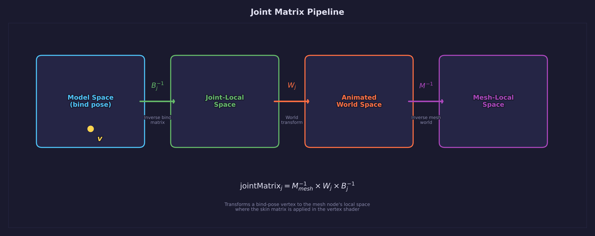

# Lesson 32 — Skinning Animations

## What you'll learn

- Vertex skinning — deforming a mesh on the GPU with weighted joint transforms
- The skinning equation: `v' = (w0*M0 + w1*M1 + w2*M2 + w3*M3) * v`
- Joint matrix derivation: `jointMatrix = worldTransform * inverseBindMatrix`
- Why inverse bind matrices are needed (model space to joint-local space)
- Parsing JOINTS_0 and WEIGHTS_0 vertex attributes from glTF
- Loading skin data (joint list, inverse bind matrices) from glTF
- Dynamic animation channel parsing (57 channels, not hardcoded)
- Animated shadow maps that deform with the character

## Result


CesiumMan walks in a loop on a grid floor. The mesh deforms smoothly as
the 19-joint skeleton drives the walk cycle. The shadow on the ground
deforms in sync with the character, because the shadow pass applies the
same skin matrix in its vertex shader.

## Key concepts

### From rigid transforms to vertex skinning

Lesson 31 animated rigid objects — each mesh moved as a whole unit
(wheels spin, truck drives). But characters, creatures, and any organic
motion require **vertex skinning**: deforming a single mesh by blending
multiple joint transforms per vertex.

Every vertex stores:

- **4 joint indices** — which bones influence this vertex
- **4 blend weights** — how much each bone contributes (weights sum to 1.0)

The vertex shader computes a **skin matrix** by blending the joint
matrices according to these weights, then transforms the vertex position
and normal through that matrix.

## The skinning equation

Each frame, the CPU computes a **joint matrix** for every joint in the
skeleton. The simplified form is:

$$
M_j = W_j \times B_j^{-1}
$$

Where:

- $W_j$ is the joint's current **world transform** (from the animated hierarchy)
- $B_j^{-1}$ is the joint's **inverse bind matrix** (stored in the glTF skin)

The inverse bind matrix transforms a vertex from model space into the
joint's local coordinate system at the bind pose. Multiplying by the
current world transform then moves it to the animated position.

### The full glTF formula

The simplified form above works when the mesh node sits at the scene
root with an identity transform. But in practice, the mesh node may be
nested under parent nodes that apply rotations — CesiumMan has a `Z_UP`
node and an `Armature` node above the mesh. The full glTF spec formula
accounts for this:

$$
M_j = M_{mesh}^{-1} \times W_j \times B_j^{-1}
$$

Where $M_{mesh}$ is the mesh node's world transform. The inverse
cancels out the mesh node's position in the hierarchy, so the
resulting skinned vertices land in the mesh node's **local space**.
The mesh node's world transform is then used as the model matrix
when drawing.



```c
/* jointMatrix = inverse(meshWorld) * jointWorld * inverseBindMatrix */
state->joint_uniforms.joints[i] = mat4_multiply(
    inv_mesh_world,
    mat4_multiply(
        scene->nodes[joint_node].world_transform,
        skin->inverse_bind_matrices[i]));
```

The vertex shader blends up to 4 joint matrices per vertex:

$$
v' = \left(\sum_{i=0}^{3} w_i \cdot M_{j_i}\right) \times v
$$

```hlsl
float4x4 skin_mat = input.weights.x * joint_mats[input.joints.x]
                   + input.weights.y * joint_mats[input.joints.y]
                   + input.weights.z * joint_mats[input.joints.z]
                   + input.weights.w * joint_mats[input.joints.w];

float4 world = mul(skin_mat, float4(input.pos, 1.0));
```

## CesiumMan coordinate system

CesiumMan's mesh data is stored in a Z-up coordinate system (common
for models exported from Blender). The glTF node hierarchy converts
this to the Y-up world space used by the renderer:

| Mesh-local axis | Direction | World-space mapping |
|-----------------|-----------|---------------------|
| +X | Forward (face direction) | World +Z |
| +Y | Left | World +X |
| +Z | Up | World +Y |

This mapping comes from two parent nodes in the glTF hierarchy:

1. **Z_UP** — swaps Y and Z axes (Z-up to Y-up conversion)
2. **Armature** — rotates ~90° to align the mesh forward direction

After these transforms, the character faces **world +Z** in its rest
pose. This is important for the [walk path](#circular-walk-path) code,
which needs to know the forward direction to orient the character
along its direction of travel.

## Vertex layout

The skinned vertex extends the standard position/normal/UV layout with
joint indices and weights:

```c
typedef struct SkinVertex {
    vec3   position;    /* 12 bytes — FLOAT3   */
    vec3   normal;      /* 12 bytes — FLOAT3   */
    vec2   uv;          /*  8 bytes — FLOAT2   */
    Uint16 joints[4];   /*  8 bytes — USHORT4  */
    float  weights[4];  /* 16 bytes — FLOAT4   */
} SkinVertex;           /* 56 bytes total      */
```

The joint indices are `UNSIGNED_SHORT` (16-bit), not bytes — CesiumMan's
glTF uses componentType 5123. The GPU auto-expands `USHORT4` to `uint4`
in the shader.

## Vertex data interleaving

glTF stores vertex attributes in separate buffer views — positions in
one region, normals in another, UVs in another, and so on. But the GPU
pipeline expects a single interleaved vertex buffer matching the
`SkinVertex` struct.

The upload step reads each attribute from its glTF accessor and
assembles them into the interleaved layout:

```c
for (Uint32 v = 0; v < src->vertex_count; v++) {
    skin_verts[v].position = positions[v];
    skin_verts[v].normal   = normals ? normals[v] : (vec3){0,1,0};
    skin_verts[v].uv       = uvs ? uvs[v] : (vec2){0,0};
    /* Copy joint indices and weights from glTF accessors */
    memcpy(skin_verts[v].joints,  &joint_data[v*4],  8);
    memcpy(skin_verts[v].weights, &weight_data[v*4], 16);
}
```

This pattern — separate glTF accessors assembled into an interleaved
vertex buffer — is common when loading glTF models for real-time
rendering.

## Dynamic animation parsing

Unlike Lesson 31 which hardcoded 2 animation channels, this lesson
parses all 57 channels from the glTF JSON dynamically:

1. Re-read the glTF JSON after `forge_gltf_load()` to access the
   `"animations"` array
2. For each channel: resolve `target.node`, `target.path`, and the
   sampler's input/output accessors
3. Store `const float *` pointers into the loaded binary buffer
4. Three evaluation functions handle the different target paths:
   - `evaluate_vec3_channel()` — translation and scale (linear lerp)
   - `evaluate_quat_channel()` — rotation (quaternion slerp)
5. Binary search finds the keyframe interval, same as Lesson 31

### glTF quaternion component order

glTF stores quaternions as `[x, y, z, w]`, but the forge math library
uses `quat_create(w, x, y, z)` with `w` first. The conversion is easy
to get wrong — swapping the order silently produces incorrect rotations
that can be hard to debug:

```c
/* glTF: [x, y, z, w] → forge: quat_create(w, x, y, z) */
quat q = quat_create(v[3], v[0], v[1], v[2]);
```

## Animated shadows

The shadow pass uses a separate `shadow_skin.vert.hlsl` shader that
applies the same skin matrix computation before projecting into light
clip space. This means the shadow deforms in sync with the character —
essential for visual consistency.

Both the scene and shadow vertex shaders receive the same joint matrix
uniform array (slot 1), so there is no extra CPU work for shadow skinning.

## Circular walk path

The character walks counterclockwise around a circle on the XZ plane.
The position at angle `a` is:

```text
px = R * sin(a)
pz = R * cos(a)
```

To face the character along its direction of travel, we need the
**tangent** to the circle — the derivative of the position:

```text
tx = cos(a)
tz = -sin(a)
```

CesiumMan's rest-pose forward direction is **+Z** in world space (the
glTF node hierarchy transforms mesh-local +X into world +Z). To rotate
+Z to align with the tangent vector `(tx, tz)`, we compute a Y-axis
rotation angle with `atan2(tx, tz)`. This is the standard formula: for
a Y-rotation, `atan2(sin_component, cos_component)` gives the angle
from +Z toward +X.

The final path transform is translation followed by rotation:

```c
mat4 path_transform = mat4_multiply(path_translate, path_rotate);
```

This is then composed with the mesh node's world transform so the
skinned vertices end up in the correct world-space position and
orientation.

## Math

This lesson uses:

- **Quaternions** — [Math Lesson 04](../../math/04-quaternions/) for
  rotation representation and slerp interpolation
- **Matrices** — [Math Lesson 02](../../math/02-matrices/) for joint
  matrix composition and MVP transforms

Key math library functions:

| Function | Purpose |
|----------|---------|
| `quat_slerp(a, b, t)` | Interpolate between keyframe rotations |
| `quat_to_mat4(q)` | Convert animated rotation to matrix |
| `mat4_multiply(a, b)` | Compose joint matrices and MVP |
| `vec3_lerp(a, b, t)` | Interpolate translation and scale |

## Shaders

| File | Purpose |
|------|---------|
| `skin.vert.hlsl` | Skinned vertex shader — blends 4 joint matrices per vertex, outputs world position and shadow UVs |
| `skin.frag.hlsl` | Blinn-Phong fragment shader with diffuse texture and shadow map sampling |
| `shadow_skin.vert.hlsl` | Skinned shadow vertex shader — same skin matrix computation, projects into light clip space |
| `shadow.frag.hlsl` | Depth-only fragment shader for the shadow pass |
| `grid.vert.hlsl` | Grid floor vertex shader with shadow UV output |
| `grid.frag.hlsl` | Procedural grid with anti-aliased lines, distance fade, and shadow sampling |

## Building

```bash
cmake -B build -S .
cmake --build build --target 32-skinning-animations
```

## AI skill

The matching skill at
[`.claude/skills/forge-skinning-animations/SKILL.md`](../../../.claude/skills/forge-skinning-animations/SKILL.md)
distills this lesson into a reusable pattern. Invoke with
`/forge-skinning-animations` or copy it into your own project's
`.claude/skills/` directory.

## What's next

With skinning in place, you can animate any character or creature from a
glTF file. Future lessons could explore animation blending (crossfading
between clips), root motion extraction, or inverse kinematics for
procedural animation.

## Exercises

1. **Animation speed control** — Add keyboard controls to speed up,
   slow down, and pause the animation. Display the current playback
   rate.

2. **Multiple characters** — Load and render two CesiumMan instances
   at different positions, each with independent animation timing
   (offset the start time).

3. **Animation blending** — Blend between two animation clips (or
   the same clip at different speeds) by interpolating the final
   joint matrices before pushing to the GPU.

4. **Dual-quaternion skinning** — Replace the linear blend skinning
   with dual-quaternion skinning to eliminate the "candy wrapper"
   artifact that linear blending produces at extreme joint rotations.
