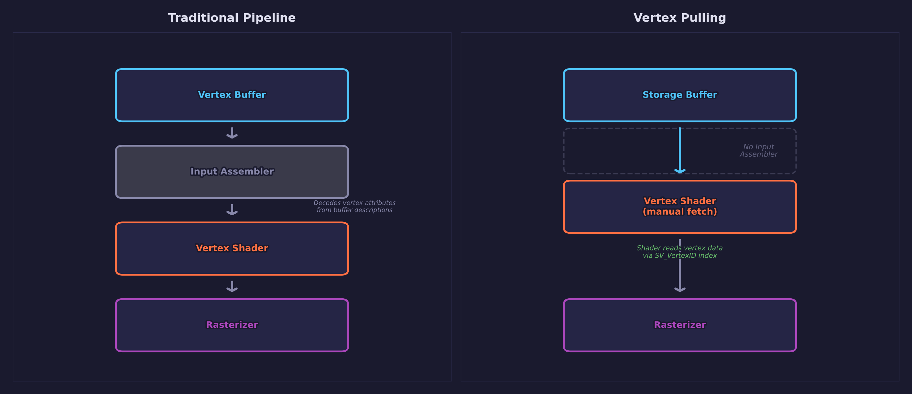
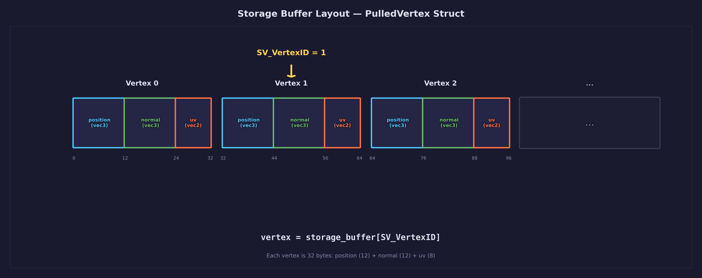
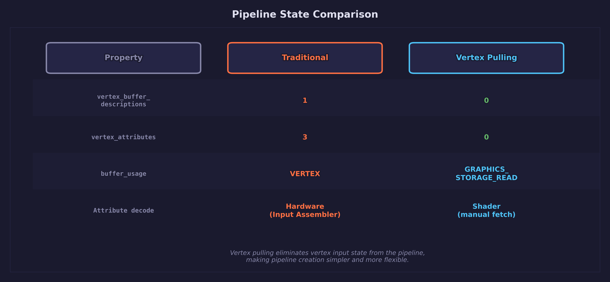
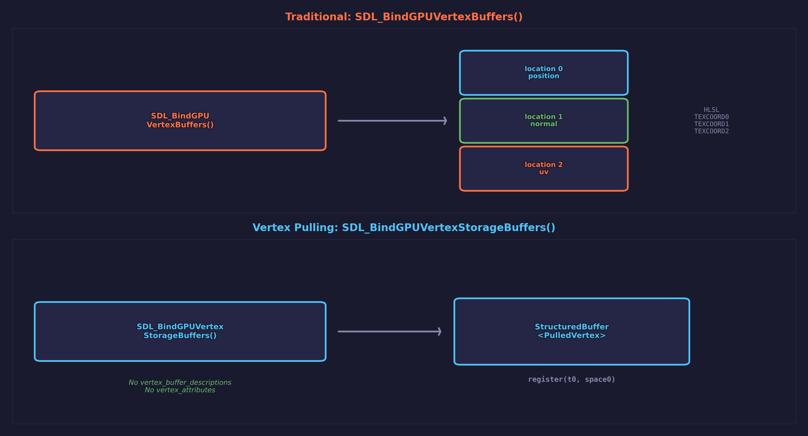
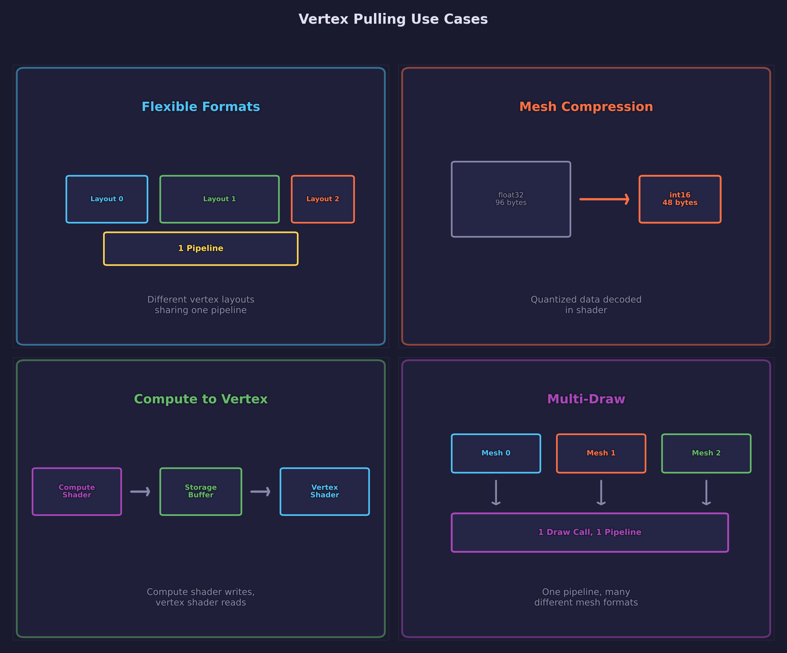

# Lesson 33 — Vertex Pulling

## What you'll learn

- Replace the fixed-function vertex input assembler with manual storage buffer reads
- Create pipelines with **zero vertex attributes** and **zero vertex buffer descriptions**
- Upload vertex data as `GRAPHICS_STORAGE_READ` storage buffers instead of `VERTEX` buffers
- Bind storage buffers with `SDL_BindGPUVertexStorageBuffers` and fetch in HLSL via `StructuredBuffer`
- Use `SV_VertexID` in the vertex shader to index into the storage buffer
- Understand the SDL GPU register mapping for vertex storage buffers (`t[n], space0`)
- See vertex pulling and traditional vertex input coexist in the same frame

## Result


A milk truck and eight textured boxes on a procedural grid floor, all lit with
Blinn-Phong lighting and directional shadows. The truck and boxes are rendered
with vertex pulling — the vertex shader reads position, normal, and UV from a
`StructuredBuffer` instead of receiving them through vertex attributes. The
grid floor intentionally uses traditional vertex input for comparison.

## Key concepts

### What is vertex pulling?

In traditional GPU rendering, the pipeline declares a **vertex input state**
that tells the input assembler how to read vertex data:

```c
/* Traditional: 3 attributes, 1 buffer description */
vis.num_vertex_buffers    = 1;
vis.num_vertex_attributes = 3;  /* position, normal, UV */
```

Vertex pulling removes this entirely:

```c
/* Vertex pulling: empty vertex input state */
vis.num_vertex_buffers    = 0;
vis.num_vertex_attributes = 0;
```

The vertex shader reads data manually from a storage buffer using
`SV_VertexID`:

```hlsl
StructuredBuffer<PulledVertex> vertex_buffer : register(t0, space0);

VSOutput main(uint vertex_id : SV_VertexID)
{
    PulledVertex v = vertex_buffer[vertex_id];
    /* Use v.position, v.normal, v.uv as usual */
}
```

### Traditional pipeline vs vertex pulling



The traditional pipeline feeds vertex data through the **input assembler**,
a fixed-function hardware stage that reads interleaved attributes from vertex
buffers. Vertex pulling bypasses this stage — the vertex shader fetches data
directly from a storage buffer. The result is identical, but the pipeline
state is simpler and more flexible.

### Storage buffer layout



The `PulledVertex` struct (32 bytes) is stored as a `StructuredBuffer` in GPU
memory. Each vertex shader invocation receives `SV_VertexID` and uses it to
index into this buffer. The struct layout must match between C and HLSL:

```c
/* C side */
typedef struct PulledVertex {
    vec3 position;   /* 12 bytes */
    vec3 normal;     /* 12 bytes */
    vec2 uv;         /*  8 bytes */
} PulledVertex;      /* 32 bytes total */
```

```hlsl
/* HLSL side */
struct PulledVertex
{
    float3 position;
    float3 normal;
    float2 uv;
};
```

### Pipeline state comparison



The CPU-side changes are minimal. Three things change:

1. **Buffer usage flag** — Create the buffer with
   `SDL_GPU_BUFFERUSAGE_GRAPHICS_STORAGE_READ` instead of
   `SDL_GPU_BUFFERUSAGE_VERTEX`. This tells SDL GPU the buffer will be
   read as a storage resource in the shader, not fed through the input
   assembler.

2. **Bind call** — Replace `SDL_BindGPUVertexBuffers` with
   `SDL_BindGPUVertexStorageBuffers`. This binds the buffer to a storage
   slot that the vertex shader can access via `StructuredBuffer`.

3. **Shader resource count** — Set `num_storage_buffers = 1` in
   `SDL_GPUShaderCreateInfo` so SDL GPU allocates a descriptor for the
   storage buffer.

The table below summarizes the differences:

| Aspect | Traditional | Vertex Pulling |
|---|---|---|
| Buffer usage | `SDL_GPU_BUFFERUSAGE_VERTEX` | `SDL_GPU_BUFFERUSAGE_GRAPHICS_STORAGE_READ` |
| Vertex attributes | Declared in pipeline | None |
| Bind call | `SDL_BindGPUVertexBuffers` | `SDL_BindGPUVertexStorageBuffers` |
| Shader resource | `num_storage_buffers = 0` | `num_storage_buffers = 1` |
| Draw call | Identical | Identical |

### SDL GPU register mapping



For DXIL vertex shaders, storage buffers use `register(t[n], space0)` —
the same space as sampled textures and storage textures, but after them.
With zero sampled textures, the first storage buffer lands at `t0, space0`.

For SPIR-V, storage buffers go in descriptor set 0, after sampled and storage
textures. The `num_storage_buffers` field in `SDL_GPUShaderCreateInfo` tells
SDL GPU how many to expect.

### Use cases for vertex pulling



Vertex pulling becomes valuable in several scenarios:

- **Flexible vertex formats** — Different meshes can have different vertex
  layouts (with or without normals, tangents, bone weights) while sharing a
  single pipeline. The shader decodes whatever format it finds.

- **Mesh compression** — Quantized positions (16-bit), octahedral normals
  (2 bytes), and half-float UVs can be decoded in the shader. The pipeline
  doesn't need to know about these packed formats.

- **Compute-to-vertex pipelines** — A compute shader can write vertex data
  into a storage buffer, and the vertex shader reads it directly. No
  intermediate copy to a vertex buffer is needed.

- **Multi-draw and bindless** — Combined with indirect drawing (Lesson 34),
  vertex pulling enables fully GPU-driven rendering where the CPU doesn't
  set per-draw vertex state at all.

## Math

This lesson uses:

- **Vectors** — [Math Lesson 01](../../math/01-vectors/) for positions,
  normals, and directions
- **Matrices** — [Math Lesson 05](../../math/05-matrices/) for model,
  view, and projection transforms
- **View matrix** — [Math Lesson 09](../../math/09-view-matrix/) for
  the fly camera
- **Projections** — [Math Lesson 06](../../math/06-projections/) for
  perspective projection

## Shaders

| File | Stage | Purpose |
|---|---|---|
| `pulled.vert.hlsl` | Vertex | Reads position, normal, UV from a `StructuredBuffer` using `SV_VertexID` — the core vertex pulling shader |
| `pulled.frag.hlsl` | Fragment | Blinn-Phong lighting with PCF shadow sampling for pulled meshes |
| `shadow_pulled.vert.hlsl` | Vertex | Shadow pass — pulls only position for depth-only rendering |
| `shadow.frag.hlsl` | Fragment | Depth-only output for shadow map generation |
| `grid.vert.hlsl` | Vertex | Traditional vertex input for the procedural grid floor (contrast with pulled meshes) |
| `grid.frag.hlsl` | Fragment | Procedural anti-aliased grid with shadow sampling |

## Building

```bash
cmake -B build -DCMAKE_BUILD_TYPE=Debug
cmake --build build --target 33-vertex-pulling
```

Run from the build directory so the executable can find its asset files:

```bash
./build/lessons/gpu/33-vertex-pulling/Debug/33-vertex-pulling
```

## AI skill

This lesson has a matching Claude Code skill at
[`.claude/skills/forge-vertex-pulling/SKILL.md`](../../../.claude/skills/forge-vertex-pulling/SKILL.md).
Invoke it with `/forge-vertex-pulling` or let Claude apply it automatically
when vertex pulling is needed. Copy the skill into your own project to
enable AI-assisted vertex pulling setup.

## What's next

Lesson 34 combines vertex pulling with indirect drawing for fully
GPU-driven rendering — the CPU issues a single draw call and the GPU
decides what to render.

## Exercises

1. **Add tangent vectors** — Extend the `PulledVertex` struct to include a
   `vec4 tangent` field (making it 48 bytes). Update the HLSL
   `StructuredBuffer` struct to match and use the tangent for normal mapping.
   Notice that no pipeline changes are needed — only the struct and shader
   change.

2. **Quantized normals** — Replace the `float3 normal` (12 bytes) with a
   `uint` octahedral encoding (4 bytes). Decode in the shader using the
   octahedral mapping. This reduces vertex size from 32 to 24 bytes without
   changing the pipeline.

3. **Compute-driven vertices** — Write a compute shader that modifies vertex
   positions in the storage buffer (e.g., wave deformation). The vertex
   shader reads the modified data automatically since they share the same
   buffer. Use `SDL_GPU_BUFFERUSAGE_GRAPHICS_STORAGE_READ |
   SDL_GPU_BUFFERUSAGE_COMPUTE_STORAGE_WRITE` for the buffer.

4. **Benchmark comparison** — Add a toggle key that switches between vertex
   pulling and traditional vertex input for the same meshes. Measure the frame
   time difference. On modern GPUs the performance should be nearly identical,
   confirming that vertex pulling is a flexibility improvement with minimal
   cost.
