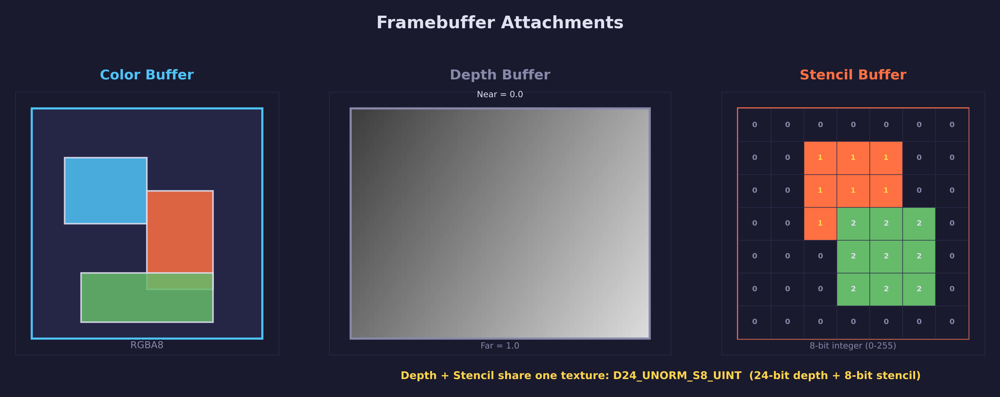
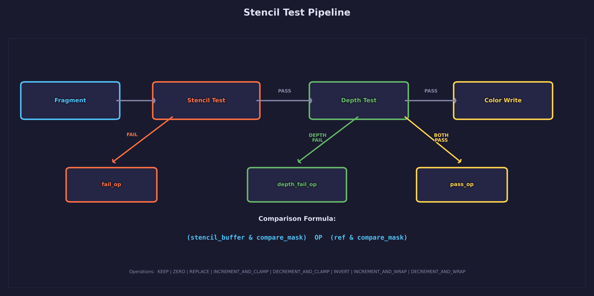
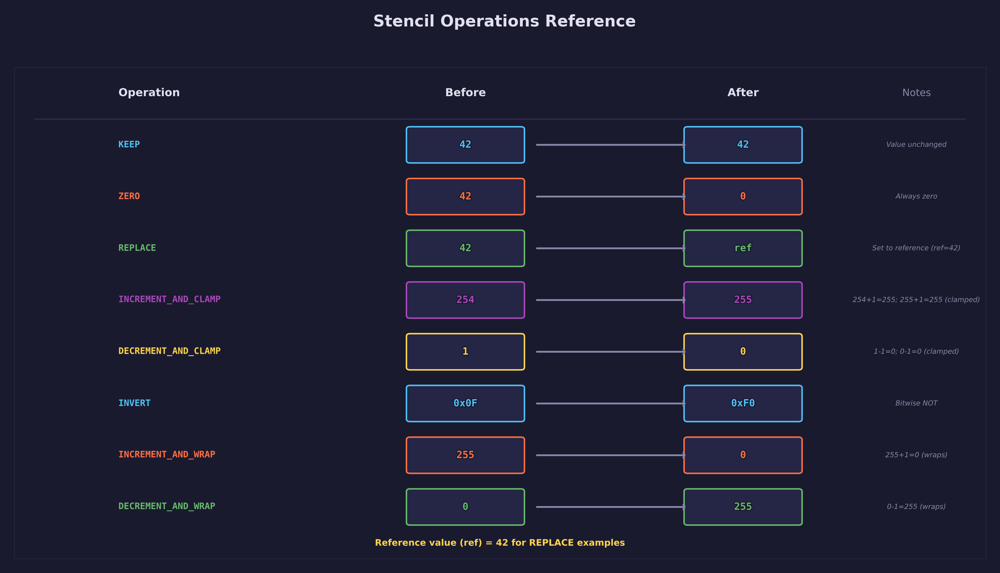
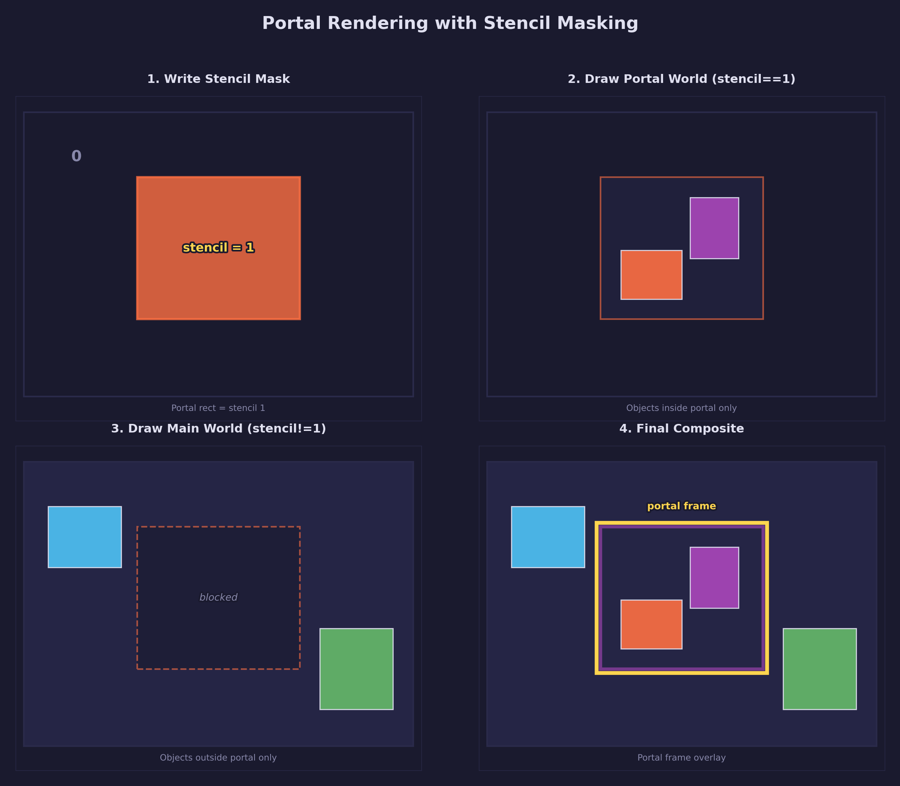
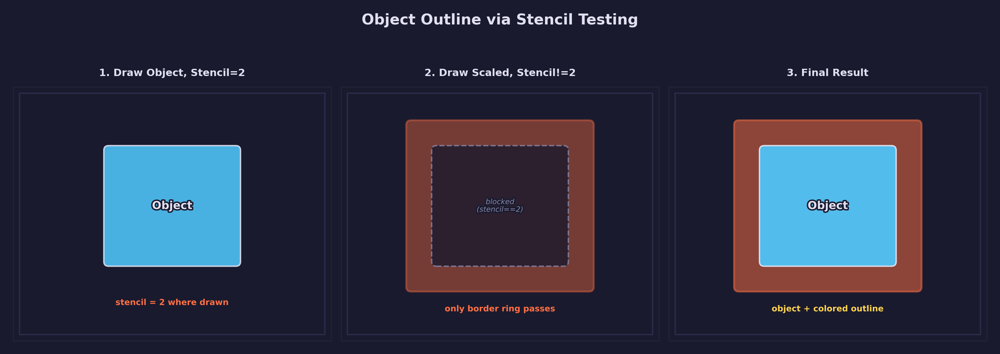
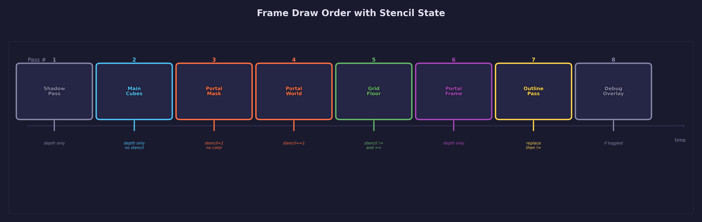
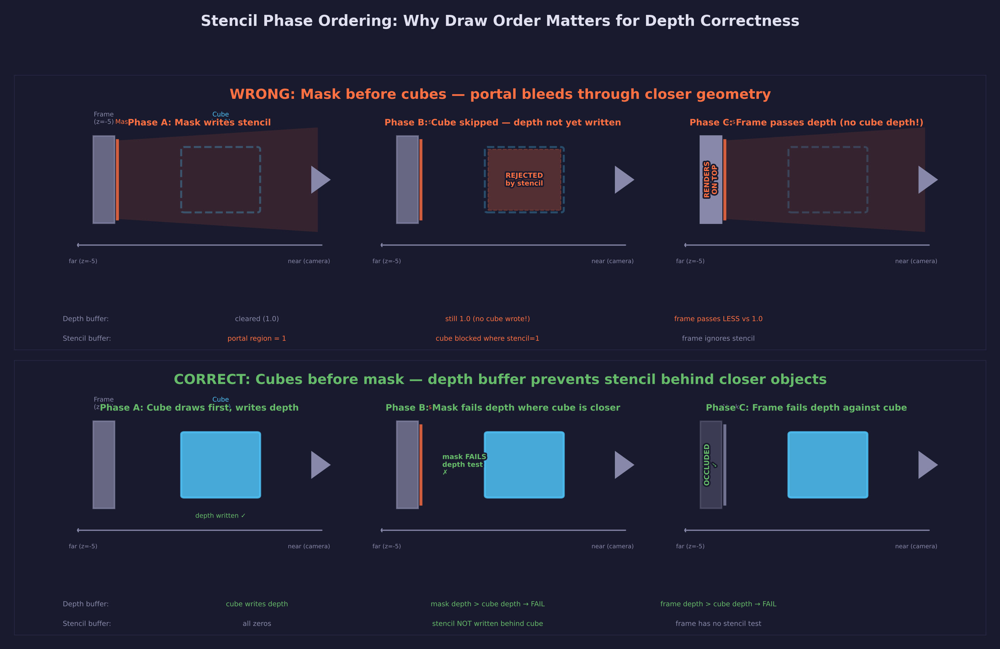

# Lesson 34 — Portals & Outlines

> **Core concept: stencil testing.** This lesson teaches the stencil buffer
> through two real-world applications — portal rendering and object outlines.
> Both techniques are built entirely on stencil state configuration; the
> shaders have no stencil-related code at all.

## What you will learn

- What the stencil buffer is: an 8-bit per-pixel integer alongside the depth buffer
- How to configure the `D24_UNORM_S8_UINT` depth-stencil format (and why the `_S8_UINT` suffix matters)
- The logical stencil/depth flow used to reason about stencil behavior
- All 8 stencil operations and 8 comparison functions available in SDL GPU
- The portal masking technique: render a different world through a stencil-masked opening
- The object outline technique: stencil silhouette expansion for colored borders
- Draw order management across multiple stencil state configurations in a single render pass
- Pipeline state explosion: why stencil effects require many separate graphics pipelines
- Stencil reference values, compare masks, and write masks

## Result


A portal doorway sits on a procedural grid floor. Through the portal opening,
a different world is visible: golden and colored spheres lit with warm-tinted
lighting. The main world contains colored cubes, two of which have bright
colored outlines rendered via stencil silhouette expansion. The grid floor
shows different tints inside and outside the portal boundary. A shadow map
provides directional shadows across both worlds.

## Key concepts

The **stencil buffer** is a general-purpose per-pixel integer buffer that lets
you control which fragments pass or fail a programmable test. Unlike the depth
buffer (which answers "is this fragment closer?"), the stencil buffer answers
whatever question you program it to answer: "is this pixel inside the portal?",
"has this pixel already been drawn?", or "should this pixel show an outline?".

Stencil behavior is configured entirely on the **pipeline state**. Shaders
have no knowledge of stencil at all. This makes it a powerful fixed-function
feature that works with any shader combination.

## The stencil buffer



Every pixel in the framebuffer can have three values: color (RGBA), depth
(float), and stencil (8-bit unsigned integer). The stencil and depth values
share a single texture using a combined format.

The preferred format is `SDL_GPU_TEXTUREFORMAT_D24_UNORM_S8_UINT`: 24 bits
for depth and 8 bits for stencil, packed into a 32-bit value per pixel. Not
all devices support it (some Metal GPUs lack `Depth24Unorm_Stencil8`), so
apps must probe at runtime and fall back to `D32_FLOAT_S8_UINT` when needed.
The code below shows the correct probe-first, fallback-second pattern.

```c
/* Probe for D24_UNORM_S8_UINT first; fall back to D32_FLOAT_S8_UINT */
SDL_GPUTextureFormat ds_fmt;
if (SDL_GPUTextureSupportsFormat(device,
        SDL_GPU_TEXTUREFORMAT_D24_UNORM_S8_UINT,
        SDL_GPU_TEXTURETYPE_2D,
        SDL_GPU_TEXTUREUSAGE_DEPTH_STENCIL_TARGET)) {
    ds_fmt = SDL_GPU_TEXTUREFORMAT_D24_UNORM_S8_UINT;
} else {
    ds_fmt = SDL_GPU_TEXTUREFORMAT_D32_FLOAT_S8_UINT;
}

SDL_GPUTextureCreateInfo ds_info = {0};
ds_info.type   = SDL_GPU_TEXTURETYPE_2D;
ds_info.format = ds_fmt;
ds_info.width  = WINDOW_WIDTH;
ds_info.height = WINDOW_HEIGHT;
ds_info.usage  = SDL_GPU_TEXTUREUSAGE_DEPTH_STENCIL_TARGET;
```

A critical detail: if you use `D24_UNORM` or `D32_FLOAT` without the `_S8_UINT`
suffix, the texture has **no stencil bits**. All stencil operations will
silently do nothing.

The stencil buffer is not automatically visible on screen. To see its contents,
you must read it back from the GPU and render it as a colored overlay, which
this lesson does with the V key toggle.

## Stencil test pipeline



For reasoning about stencil behavior, we use this logical order:

**Fragment Shader** -> **Stencil Test** -> **Depth Test** -> **Color Write**

Modern GPUs may optimize by running stencil and depth tests before the fragment
shader when legal (for example, when the shader does not write custom depth
values). Treat this sequence as the conceptual model for understanding how
`fail_op`, `depth_fail_op`, and `pass_op` apply — not the guaranteed hardware
execution order.

The comparison evaluates:

$$
(\mathrm{buffer\\_value} \mathbin{\\&} \mathrm{compare\\_mask}) \enspace \mathrm{COMPARE\\_OP} \enspace (\mathrm{reference} \mathbin{\\&} \mathrm{compare\\_mask})
$$

where `buffer_value` is the current stencil value at this pixel, `reference`
is set per draw call, and `COMPARE_OP` is one of the eight comparison
functions (NEVER, LESS, EQUAL, LESS_OR_EQUAL, GREATER, NOT_EQUAL,
GREATER_OR_EQUAL, ALWAYS).

Three outcomes determine what happens to the stencil buffer:

| Outcome | Condition | Operation field |
|---------|-----------|-----------------|
| Stencil fail | Stencil test fails | `fail_op` |
| Depth fail | Stencil passes, depth fails | `depth_fail_op` |
| Both pass | Both stencil and depth pass | `pass_op` |

Each outcome can apply a different stencil operation to the buffer value.

Two important properties of the stencil configuration:

1. **Reference value is per draw call**, not per pipeline. You set it with
   `SDL_SetGPUStencilReference()` before each draw, allowing a single pipeline
   to test against different values.

2. **Stencil state lives on the pipeline**, not in shaders. The vertex and
   fragment shaders are identical for portal objects and main-world objects.
   Only the pipeline's stencil configuration changes.

```c
/* Set the stencil reference value before drawing */
SDL_SetGPUStencilReference(render_pass, STENCIL_PORTAL); /* ref = 1 */
```

## Stencil operations



The eight stencil operations control how the buffer value is modified:

| Operation | SDL enum | Effect |
|-----------|----------|--------|
| Keep | `SDL_GPU_STENCILOP_KEEP` | Leave the buffer value unchanged |
| Zero | `SDL_GPU_STENCILOP_ZERO` | Set the buffer value to 0 |
| Replace | `SDL_GPU_STENCILOP_REPLACE` | Set the buffer value to the reference value |
| Increment (clamp) | `SDL_GPU_STENCILOP_INCREMENT_AND_CLAMP` | Increment, clamping at 255 |
| Decrement (clamp) | `SDL_GPU_STENCILOP_DECREMENT_AND_CLAMP` | Decrement, clamping at 0 |
| Invert | `SDL_GPU_STENCILOP_INVERT` | Bitwise invert the buffer value |
| Increment (wrap) | `SDL_GPU_STENCILOP_INCREMENT_AND_WRAP` | Increment, wrapping 255 to 0 |
| Decrement (wrap) | `SDL_GPU_STENCILOP_DECREMENT_AND_WRAP` | Decrement, wrapping 0 to 255 |

This lesson uses three of these: **KEEP** (leave stencil alone during normal
rendering), **REPLACE** (stamp a reference value into the buffer), and the
comparison functions **EQUAL**, **NOT_EQUAL**, and **ALWAYS**.

## Portal effect



The portal effect renders a different world visible only through a rectangular
opening. It works in four phases within a single render pass, each using a
different pipeline with different stencil settings.

**The phase ordering is critical.** Main-world cubes must draw *before* the
portal mask so the depth buffer prevents stencil from being written behind
closer objects. See [Phase ordering pitfall](#phase-ordering-pitfall) below.

### Phase 1: Draw main-world cubes

Draw the main-world cubes first with a standard depth-test pipeline (depth
LESS, depth write enabled, **no stencil**). These cubes write their depth
values into the depth buffer. This ensures that any cube in front of the
portal correctly blocks the stencil mask in the next phase.

### Phase 2: Write the stencil mask

Draw the portal opening quad with stencil comparison set to ALWAYS and pass
operation set to REPLACE. The reference value is `STENCIL_PORTAL` (1). This
stamps a 1 into every pixel covered by the portal opening.

Color writes and depth writes are both **disabled** for this phase, but
**depth testing is enabled** with `LESS_OR_EQUAL`. Because the cubes already
wrote depth in Phase 1, the mask's depth test fails wherever a closer cube
exists — preventing stencil from being written there. The mask only writes
stencil in the unoccluded portal region.

```c
/* Mask pipeline: stencil write with depth test but no depth/color write */
SDL_GPUStencilOpState mask_stencil = {
    .fail_op       = SDL_GPU_STENCILOP_KEEP,
    .pass_op       = SDL_GPU_STENCILOP_REPLACE,  /* stamp ref value */
    .depth_fail_op = SDL_GPU_STENCILOP_KEEP,
    .compare_op    = SDL_GPU_COMPAREOP_ALWAYS     /* always write stencil */
};

pipeline_info.depth_stencil_state.enable_depth_test    = true;
pipeline_info.depth_stencil_state.compare_op           = SDL_GPU_COMPAREOP_LESS_OR_EQUAL;
pipeline_info.depth_stencil_state.enable_depth_write   = false;  /* don't pollute depth */
color_target.blend_state.color_write_mask              = 0;      /* no color output */
pipeline_info.depth_stencil_state.enable_stencil_test  = true;
pipeline_info.depth_stencil_state.front_stencil_state  = mask_stencil;
pipeline_info.depth_stencil_state.back_stencil_state   = mask_stencil;
```

### Phase 3: Draw the portal world

Bind the portal pipeline, which tests `EQUAL` against reference 1. Only
fragments where the stencil buffer contains 1 (the portal opening) will pass.
Draw the portal world objects: golden and colored spheres with warm-tinted
lighting. These objects appear only inside the portal.

### Phase 4: Draw the portal frame

Bind the frame pipeline with no stencil test. Draw the portal frame
geometry (four box sections: top, left, right, and threshold) as a normal
opaque object with depth LESS. The frame correctly fails depth wherever a
closer cube already wrote, so it never renders on top of objects in front
of the portal.

## Object outlines



Object outlines use a two-pass stencil technique that produces a colored
border around selected objects.

### Pass 1: Draw the object and mark stencil

Draw the object normally using the outline-write pipeline. This pipeline has
stencil set to ALWAYS with pass operation REPLACE and reference value
`STENCIL_OUTLINE` (2). Every pixel the object covers gets a stencil value
of 2.

The depth compare must be `LESS_OR_EQUAL` (not `LESS`) because the cube was
already drawn in the main cube phase. At equal depth, `LESS` would fail and
the stencil write would be silently skipped — breaking the outline effect.

### Pass 2: Draw the expanded silhouette

Draw the same object again, scaled uniformly by 4% using `mat4_scale_uniform`:

```c
#define OUTLINE_SCALE 1.04f

/* Scale the model matrix to expand the silhouette */
mat4 scale = mat4_scale_uniform(OUTLINE_SCALE);
mat4 outline_model = mat4_multiply(object_model, scale);
```

This pass uses the outline-draw pipeline with stencil test `NOT_EQUAL` against
reference 2. The expanded geometry only produces fragments in the ring of
pixels between the original silhouette and the scaled silhouette, because the
original object's pixels already have stencil value 2 and fail the NOT_EQUAL
test. Depth writes are disabled so the outline does not occlude other objects.

The result is a solid-colored border exactly where the scaled object extends
beyond the original.

## Draw order



The complete frame renders in this order. All phases after the shadow pass
share a single render pass but bind different pipelines:

| Phase | Pipeline | Stencil ref | Purpose |
|-------|----------|-------------|---------|
| 1 | Shadow | disabled | Depth-only shadow map (2048x2048, D32_FLOAT) |
| 2 | Main | disabled | Draw main world cubes (writes depth first) |
| 3 | Mask | ref = 1, ALWAYS/REPLACE | Stamp portal opening into stencil |
| 4 | Portal | ref = 1, EQUAL | Draw portal world spheres |
| 5 | Grid | ref = 1, NOT_EQUAL | Draw main world grid |
| 6 | Grid (portal) | ref = 1, EQUAL | Draw grid with portal tint |
| 7 | Frame | disabled | Draw portal frame geometry |
| 8 | Outline write | ref = 2, ALWAYS/REPLACE | Draw outlined cubes, mark stencil |
| 9 | Outline draw | ref = 2, NOT_EQUAL | Draw expanded silhouettes |

Order matters. Main cubes must draw **before** the portal mask so the depth
buffer prevents stencil writes behind closer geometry. The mask must be written
before anything that tests against it. Outline writes must happen after main
world rendering so that the stencil value 2 does not interfere with the portal
test (which uses value 1).

This lesson creates **9 graphics pipelines** for scene rendering (including
shadows) plus **1 for the debug overlay** (10 total). This pipeline state
explosion is inherent to stencil-based effects: each combination of stencil
test, stencil operation, color write enable, and depth write enable requires
a separate pipeline object.

## Phase ordering pitfall



A common mistake with portal rendering is writing the stencil mask **before**
drawing opaque geometry. This creates a subtle depth-stencil interaction bug:

1. The mask writes `STENCIL_PORTAL` across the portal quad's screen projection
2. Main cubes use `NOT_EQUAL` to avoid drawing in the portal region — but this
   also prevents them from writing **depth** there
3. The portal frame (drawn later with no stencil test) passes `depth < 1.0`
   against the cleared depth buffer and renders **on top** of cubes that should
   occlude it

The fix is to draw opaque main-world geometry **first**, before writing the
stencil mask. The cubes write their depth values. Then the mask's depth test
(`LESS_OR_EQUAL`) naturally fails wherever a closer cube already exists,
preventing stencil from being written behind closer objects. The portal frame's
depth test then correctly fails against the cube's depth.

This is the key insight: **the depth buffer and stencil buffer interact through
draw order**. Stencil masking can prevent depth writes, which can cause later
geometry to pass depth tests it should fail. By letting the depth buffer
establish the scene's occlusion first, the stencil mask is confined to only
the visible (unoccluded) portal region.

## Controls

| Key | Action |
|-----|--------|
| W / A / S / D | Move camera forward / left / back / right |
| Mouse | Look around |
| Space / Left Shift | Move up / down |
| V | Toggle stencil debug overlay |
| Escape | Release mouse cursor |

## Shaders

Stencil behavior is entirely in the pipeline state. None of the shaders below
contain any stencil-related code.

| File | Stage | Purpose |
|------|-------|---------|
| `scene.vert.hlsl` | Vertex | MVP transform, world position, normal, and light-space coordinates |
| `scene.frag.hlsl` | Fragment | Blinn-Phong lighting with shadow sampling, base color, and additive tint |
| `shadow.vert.hlsl` | Vertex | Light-space MVP transform for depth-only rendering |
| `shadow.frag.hlsl` | Fragment | Empty output (depth-only pass, required by SDL GPU) |
| `grid.vert.hlsl` | Vertex | Grid floor vertex transform with light-space coordinates |
| `grid.frag.hlsl` | Fragment | Procedural grid pattern with shadow sampling and tint color |
| `outline.frag.hlsl` | Fragment | Solid outline color output |
| `debug_overlay.vert.hlsl` | Vertex | Fullscreen quad generated from `SV_VertexID` |
| `debug_overlay.frag.hlsl` | Fragment | Samples debug texture with transparency for stencil visualization |

## Building

```bash
cmake -B build
cmake --build build --target 34-stencil-testing
./build/lessons/gpu/34-stencil-testing/34-stencil-testing
```

## Math

This lesson uses the following from `common/math/forge_math.h`:

- **Vectors** — [Math Lesson 01](../../math/01-vectors/) for positions,
  normals, and light directions
- **Matrices** — [Math Lesson 05](../../math/05-matrices/) for model, view,
  and projection transforms (`mat4_multiply`, `mat4_translate`,
  `mat4_scale_uniform`)
- **Projections** — [Math Lesson 06](../../math/06-projections/) for
  perspective and orthographic projection matrices

## AI skill

This lesson has a matching Claude Code skill at
[`.claude/skills/forge-stencil-testing/SKILL.md`](../../../.claude/skills/forge-stencil-testing/SKILL.md).
Invoke it with `/forge-stencil-testing` or let Claude apply it automatically
when stencil buffer techniques are needed in your project.

## What's next

[Lesson 35 — Decals](../35-decals/) projects flat detail (bullet holes, dirt,
signs) onto existing geometry using deferred decal boxes and stencil
increment for layering. It builds directly on the stencil masking and phase
ordering techniques from this lesson.

[Lesson 36 — Edge Detection & X-Ray](../36-edge-detection/) explores
alternative outline methods: post-process edge detection on depth and normal
buffers, and X-ray vision using `depth_fail_op` to reveal occluded objects.
It compares these approaches with the stencil outline technique taught here.

## Exercises

1. **Mirror effect** — Combine the stencil mask technique with the planar
   reflection method from [Lesson 30](../30-planar-reflections/). Use the
   stencil buffer to confine the reflected image to the mirror surface, then
   render the mirror frame on top. The stencil prevents reflected geometry
   from appearing outside the mirror boundary.

2. **Multiple portals** — Add a second portal with a different stencil
   reference value (e.g., `STENCIL_PORTAL_2 = 3`). Each portal leads to a
   different world with different objects and lighting. You will need
   additional pipelines that test EQUAL against each reference value.

3. **X-ray vision** — Use `depth_fail_op` with `SDL_GPU_COMPAREOP_GREATER`
   to reveal objects behind walls. When a fragment fails the depth test,
   increment the stencil buffer. Then draw a second pass that renders an
   X-ray silhouette wherever the stencil was incremented. This shows occluded
   geometry as a ghostly overlay.

4. **Stencil shadow volumes** — Implement Carmack's Reverse (zfail) shadow
   volume technique. Extrude shadow volume geometry from each shadow caster,
   and use stencil increment/decrement operations to count front-face and
   back-face crossings. Pixels with a non-zero stencil count are in shadow.
   This is an advanced technique that produces pixel-perfect hard shadows.

5. **Animated portal mask** — Replace the static rectangular portal opening
   with a procedurally animated shape. Generate the mask geometry each frame
   using a time-varying function (e.g., a circle that pulses, or a star shape
   that rotates). The stencil stamp approach works with any shape, not just
   rectangles.

## Cross-references

- [GPU Lesson 06 — Depth & 3D](../06-depth/): Depth buffer fundamentals and
  the depth-stencil texture format
- [GPU Lesson 12 — Shader Grid](../12-shader-grid/): Procedural grid floor
  pattern used in this lesson
- [GPU Lesson 15 — Shadow Maps](../15-shadow-mapping/): Depth-only render
  passes and shadow sampling
- [GPU Lesson 30 — Planar Reflections](../30-planar-reflections/): Mirror
  camera technique that pairs well with stencil masking
