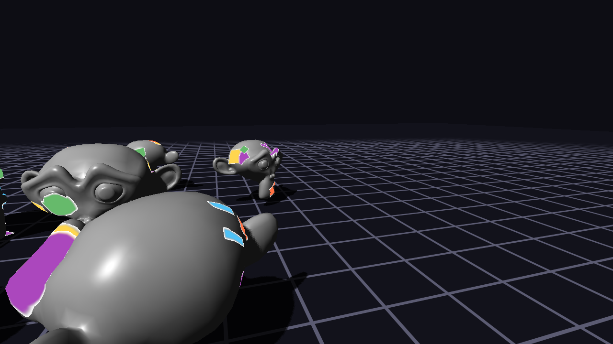
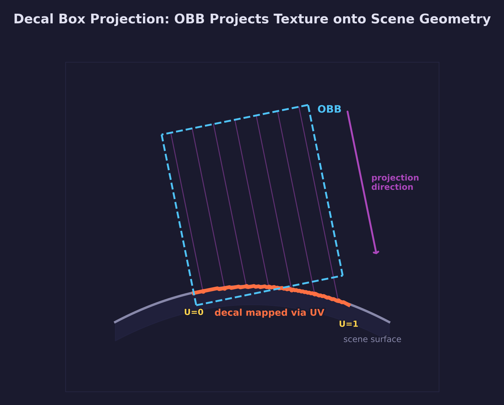
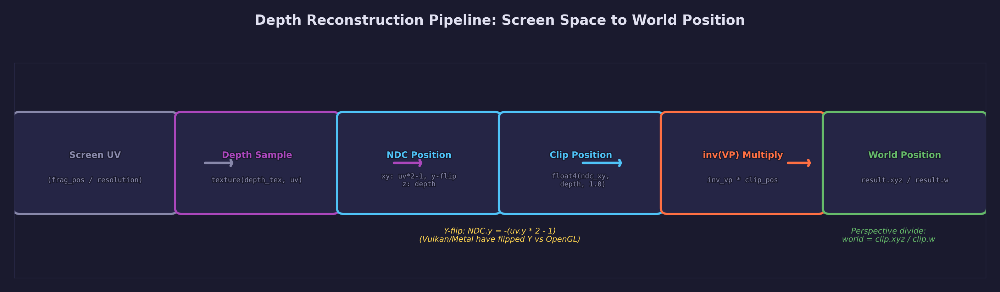
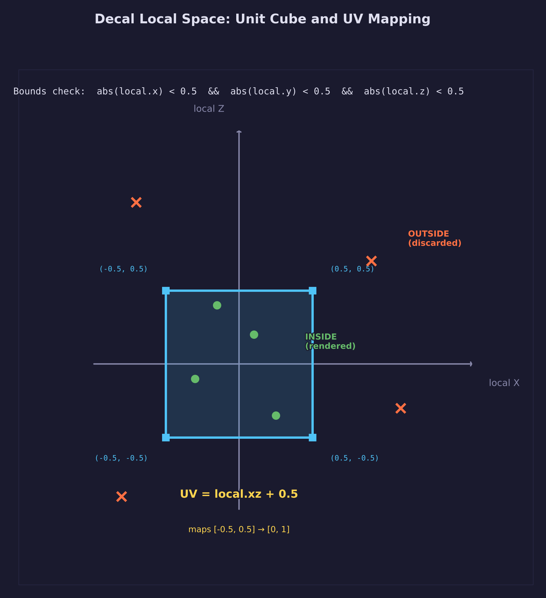
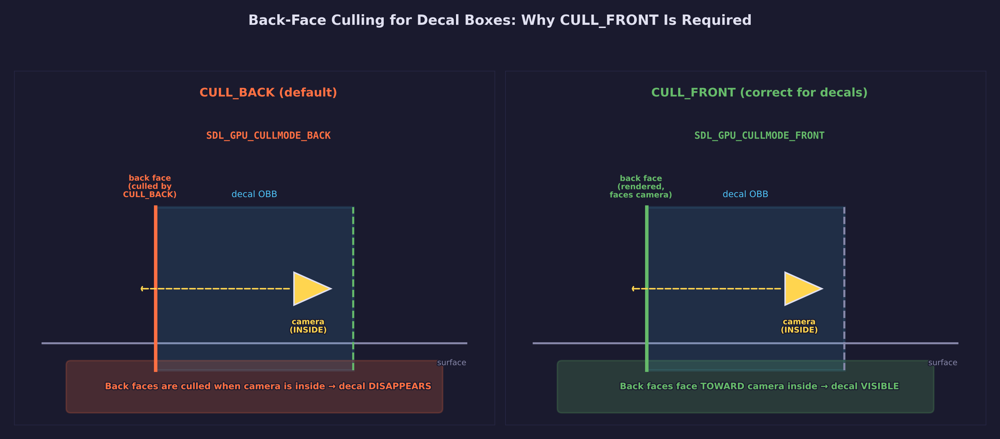
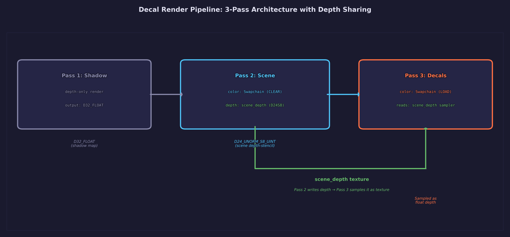
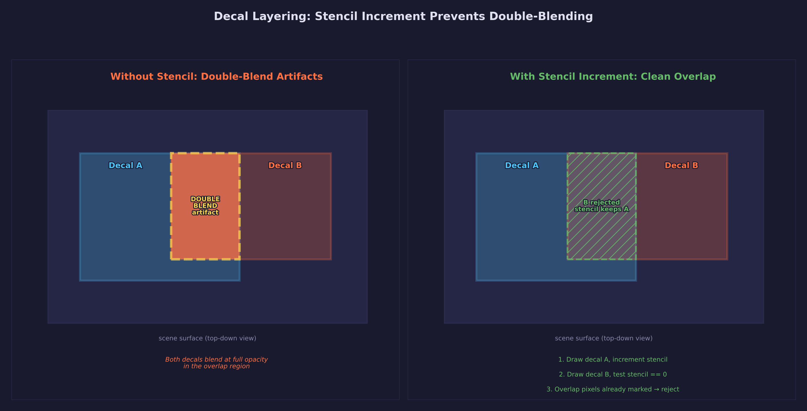

# Lesson 35 — Decals

> **Core concept: deferred decal projection.** This lesson teaches how to
> project flat detail — bullet holes, dirt splashes, warning signs — onto
> existing geometry without modifying its mesh or UV layout. Decals are rendered
> as oriented bounding boxes that reconstruct world positions from the depth
> buffer and map them into decal-local texture coordinates.

## What you will learn

- Deferred decal projection using oriented bounding boxes (OBBs)
- Inverse depth reconstruction to obtain world positions from the depth buffer
- Three-pass rendering: shadow, scene, decals
- Front-face culling (`CULL_FRONT`) for robust decal visibility inside volumes
- Procedural texture generation for decal shapes (circle, heart, star, and more)

## Result



A procedural grid floor and Suzanne meshes sit under directional lighting with
shadow mapping. Projected onto the scene surfaces are decals of various shapes
— circles, hearts, stars, checkerboards, rings, diamonds, crosses, and
triangles — each generated procedurally as a texture. The decals conform to
whatever geometry they overlap, bending across Suzanne's curved surfaces and
the floor without any UV seams or mesh modifications.

## Key concepts

### Deferred decal projection



Traditional texturing bakes detail into a mesh's UV map. Adding a bullet hole
means modifying the mesh's texture atlas, recalculating UVs, or subdividing
geometry — all tightly coupled to mesh topology. Deferred decals solve this by
projecting texture data from an oriented bounding box onto whatever geometry
the box overlaps.

The approach works in screen space: for each pixel covered by the decal box,
the shader samples the scene depth buffer, reconstructs the world position of
that pixel, and checks whether that position falls inside the decal's local
volume. If it does, the position's local XZ coordinates become texture UVs.
The decal is completely decoupled from the underlying mesh — it works on any
geometry without modification.

This is the same deferred decal technique used in production engines (Unreal
Engine's DBuffer decals, Unity's projector decals). The key insight is that
the depth buffer already encodes the scene's surface geometry, so the decal
shader can recover surface positions without any knowledge of the original
meshes.

### Depth buffer as input



The scene pass renders color and depth into separate targets. The depth texture
uses `D24_UNORM_S8_UINT` format (with `D32_FLOAT_S8_UINT` as fallback),
created with **two** usage flags:

```c
ds_info.usage = SDL_GPU_TEXTUREUSAGE_DEPTH_STENCIL_TARGET
              | SDL_GPU_TEXTUREUSAGE_SAMPLER;
```

The first flag allows the texture to serve as a depth-stencil attachment during
the scene pass. The second flag allows the decal pass to bind it as a fragment
shader sampler. Without `SAMPLER` usage, the depth texture cannot be read in a
shader.

During the decal pass, the depth-stencil texture is **not** bound as a render
target — it is bound only as a fragment sampler. The decal pass has no
depth-stencil attachment at all, which means depth testing and depth writing
are both disabled. The decal shader reads depth values manually through
texture sampling.

### Inverse projection pipeline



Reconstructing world position from a depth sample requires reversing the
projection pipeline. The decal fragment shader performs these steps:

1. **Screen UV** — Compute the fragment's UV from its screen position:
   `uv = fragment_position.xy / screen_size`

2. **Depth sample** — Sample the scene depth texture at that UV to get the
   stored depth value (range 0 to 1 in Vulkan/Metal conventions)

3. **NDC reconstruction** — Build a normalized device coordinate:
   `ndc = vec4(uv.x * 2 - 1, (1 - uv.y) * 2 - 1, depth, 1)`. The Y
   coordinate is flipped because Vulkan's NDC Y axis points downward, opposite
   to the screen UV convention

4. **Inverse VP multiply** — Multiply by the inverse view-projection matrix:
   `world_h = inv_vp * ndc`. This reverses both the projection and view
   transforms

5. **Perspective divide** — Divide by the W component to get the final world
   position: `world = world_h.xyz / world_h.w`

This pipeline is the standard inverse projection method used across deferred
rendering techniques. The same approach applies to deferred lighting, screen-
space reflections, and any effect that needs world positions from a depth
buffer.

### Decal local space projection

Once the world position is reconstructed, the shader transforms it into the
decal's local coordinate system by multiplying with the inverse of the decal's
model matrix:

```hlsl
float3 local = mul(inv_decal_model, float4(world_pos, 1.0)).xyz;
```

The decal volume is a unit cube centered at the origin (coordinates from -0.5
to +0.5 on each axis). If the local position falls outside this range on any
axis, the fragment is outside the decal and is discarded. If it falls inside,
the local X and Z coordinates are remapped from [-0.5, +0.5] to [0, 1] to
produce texture UVs:

```hlsl
float2 decal_uv = local.xz + 0.5;
```

This XZ-to-UV mapping means the decal projects along its local Y axis — like a
projector pointing downward (or in whatever direction the OBB is oriented).

### Back-face culling for decals



Standard rendering uses back-face culling (`CULL_BACK`) to skip triangles
facing away from the camera. Decal boxes require the opposite: `CULL_FRONT`,
which draws only back faces.

The reason is practical: when the camera enters the decal's bounding box, the
front faces of the box move behind the camera's near plane and are clipped. If
the pipeline culls back faces, no triangles remain visible and the decal
disappears entirely. By culling front faces instead, the back faces of the box
are always visible — they face toward the camera whether it is inside or
outside the box.

This is a standard technique for deferred volume rendering (also used in
deferred light volumes). The back faces act as a screen-space proxy: any pixel
covered by a back face is potentially inside the volume and needs evaluation.

### Soft edge fade

Hard cutoffs at the OBB boundaries produce visible seams where the decal
abruptly starts or stops. A smoothstep fade at the boundaries produces a
gradual falloff:

```hlsl
float fade = smoothstep(0.0, FADE_EDGE, 0.5 - abs(local.x))
           * smoothstep(0.0, FADE_EDGE, 0.5 - abs(local.y))
           * smoothstep(0.0, FADE_EDGE, 0.5 - abs(local.z));
```

Each axis contributes a fade factor based on distance from the boundary. The
product of all three axes gives a smooth falloff that tapers to zero at every
edge and corner of the OBB. `FADE_EDGE` controls the width of the transition
region.

### Procedural shape textures

Decal textures are generated on the CPU using signed distance field math. Each
shape is defined by a distance function evaluated at every texel:

| Shape | Distance function |
|-------|-------------------|
| Circle | Distance from center |
| Heart | Parametric heart curve |
| Star | Angle-based radius modulation |
| Checkerboard | Grid cell parity |
| Ring | Absolute distance from radius |
| Diamond | Manhattan distance from center |
| Cross | Minimum of horizontal and vertical distance |
| Triangle | Half-plane intersection |

The distance value is passed through a smoothstep to produce antialiased edges.
The result is stored in the alpha channel of an RGBA texture uploaded to the
GPU. The decal fragment shader samples the texture's alpha channel and
multiplies it by the decal's tint color to produce the final blended output.

## Render pass architecture



The frame renders in three GPU passes:

### Pass 1: Shadow (depth-only)

A 2048x2048 `D32_FLOAT` texture captures the scene from the light's point of
view. Only depth is written — no color target. The shadow map is sampled during
the scene pass for shadow testing.

- Color target: none
- Depth-stencil: `D32_FLOAT`, CLEAR + STORE
- Cull mode: BACK

### Pass 2: Scene

The main scene renders to the swapchain color texture and a separate
`D24_UNORM_S8_UINT` depth texture. Both are cleared at the start. Suzanne meshes
and the grid floor are drawn with Blinn-Phong lighting and shadow sampling. The
depth texture is stored (not discarded) because the decal pass needs it.

- Color target: swapchain texture, CLEAR + STORE
- Depth-stencil: scene depth `D24_UNORM_S8_UINT`, CLEAR + STORE
- Cull mode: BACK (Suzannes), NONE (grid)

### Pass 3: Decals

The decal pass loads the existing swapchain color (preserving the scene image)
and has **no depth-stencil attachment**. Instead, the scene depth texture is
bound as a fragment shader sampler. Each decal box is drawn as a cube with
alpha blending enabled — the decal color blends on top of the existing scene.

- Color target: swapchain texture, LOAD + STORE
- Depth-stencil: none (scene depth bound as sampler)
- Cull mode: FRONT (draw back faces only)
- Blend: `SRC_ALPHA` / `ONE_MINUS_SRC_ALPHA`

The critical detail in this architecture is that the scene depth texture
transitions from a render target (Pass 2) to a shader resource (Pass 3). SDL
GPU handles this transition automatically between render passes, but the
texture must be created with both `DEPTH_STENCIL_TARGET` and `SAMPLER` usage
flags.

## Decal fragment shader

The decal fragment shader implements the full projection algorithm in six
steps:

```hlsl
float4 frag_main(VSOutput input) : SV_Target0
{
    /* 1. Compute screen UV from fragment position */
    float2 screen_uv = input.position.xy / screen_size;

    /* 2. Sample scene depth at this pixel */
    float depth = depth_texture.Sample(depth_sampler, screen_uv).r;

    /* 3. Reconstruct NDC (Vulkan Y-flip) */
    float4 ndc;
    ndc.x = screen_uv.x * 2.0 - 1.0;
    ndc.y = (1.0 - screen_uv.y) * 2.0 - 1.0;
    ndc.z = depth;
    ndc.w = 1.0;

    /* 4. Inverse view-projection to get world position */
    float4 world_h = mul(inv_view_proj, ndc);
    float3 world_pos = world_h.xyz / world_h.w;

    /* 5. Transform into decal local space; discard if outside unit cube */
    float3 local = mul(inv_decal_model, float4(world_pos, 1.0)).xyz;
    if (any(abs(local) > 0.5))
        discard;

    /* 6. Map local XZ to decal UV; sample shape texture; apply fade */
    float2 decal_uv = local.xz + 0.5;
    float shape = shape_texture.Sample(shape_sampler, decal_uv).a;
    float fade = smoothstep(0.0, FADE_EDGE, 0.5 - abs(local.x))
               * smoothstep(0.0, FADE_EDGE, 0.5 - abs(local.y))
               * smoothstep(0.0, FADE_EDGE, 0.5 - abs(local.z));

    return float4(decal_color.rgb, shape * fade * decal_color.a);
}
```

Step 1-2 read from the scene's depth buffer. Steps 3-4 perform the inverse
projection to recover the world position that was originally rendered at this
pixel. Step 5 tests whether that world position is inside the decal's OBB.
Step 6 generates the final color with soft edges and shape masking.

## Pipeline configuration

| Pipeline | Cull | Depth Test | Depth Write | Blend | DS Format | Color |
|----------|------|------------|-------------|-------|-----------|-------|
| shadow | BACK | LESS | yes | none | D32_FLOAT | none |
| scene | BACK | LESS | yes | none | scene DS | swapchain |
| grid | NONE | LESS_OR_EQUAL | yes | none | scene DS | swapchain |
| decal | FRONT | disabled | no | SRC_ALPHA blend | none | swapchain |

The decal pipeline is notable for three properties:

1. **CULL_FRONT** — Draws back faces so the decal remains visible when the
   camera enters the box
2. **No depth test or write** — The decal pass has no depth-stencil attachment;
   depth is read manually from the sampler
3. **Alpha blend** — `SRC_ALPHA` / `ONE_MINUS_SRC_ALPHA` composites the decal
   on top of the scene

## Decal layering



When multiple decals overlap the same surface, each one blends on top of
whatever color is currently in the framebuffer — including previously rendered
decals. This produces correct visual layering (later decals appear on top), but
repeated blending can cause color saturation and brightness buildup in the
overlap region.

The exercises below describe a stencil-based approach to prevent this
double-blending artifact.

## Controls

| Key | Action |
|-----|--------|
| W / A / S / D | Move camera forward / left / back / right |
| Mouse | Look around |
| Space / Left Shift | Move up / down |
| Escape | Release mouse cursor |

## Shaders

| File | Stage | Purpose |
|------|-------|---------|
| `scene.vert.hlsl` | Vertex | MVP transform, world position, normal, and light-space coordinates |
| `scene.frag.hlsl` | Fragment | Blinn-Phong lighting with shadow sampling and base color |
| `shadow.vert.hlsl` | Vertex | Light-space MVP transform for depth-only rendering |
| `shadow.frag.hlsl` | Fragment | Empty output (depth-only pass, required by SDL GPU) |
| `grid.vert.hlsl` | Vertex | Grid floor vertex transform with light-space coordinates |
| `grid.frag.hlsl` | Fragment | Procedural grid pattern with shadow sampling |
| `decal.vert.hlsl` | Vertex | MVP transform for decal box geometry |
| `decal.frag.hlsl` | Fragment | Depth reconstruction, OBB bounds test, shape sampling, soft fade |

## Building

```bash
cmake -B build
cmake --build build --target 35-decals
./build/lessons/gpu/35-decals/35-decals
```

## Math

This lesson uses the following from `common/math/forge_math.h`:

- **Vectors** — [Math Lesson 01](../../math/01-vectors/) for positions,
  normals, and light directions
- **Matrices** — [Math Lesson 05](../../math/05-matrices/) for model, view,
  projection, and inverse transforms (`mat4_multiply`, `mat4_translate`,
  `mat4_rotate_*`, `mat4_inverse`)
- **Projections** — [Math Lesson 06](../../math/06-projections/) for
  perspective and orthographic projection matrices

## AI skill

This lesson has a matching Claude Code skill at
[`.claude/skills/forge-decals/SKILL.md`](../../../.claude/skills/forge-decals/SKILL.md).
Invoke it with `/forge-decals` or let Claude apply it automatically when decal
projection techniques are needed in your project.

## What's next

Lesson 36 — Edge Detection & X-Ray (coming soon) will explore post-process
techniques that read from depth and normal buffers to detect edges and reveal
occluded geometry, building on the same depth-buffer-as-input pattern used here
for decal projection.

## Exercises

1. **Stencil-based decal layering** — Prevent double-blending when decals
   overlap. Add a stencil attachment to the decal pass and increment the stencil
   value for each decal drawn. Set the stencil comparison to EQUAL against the
   current layer count so each pixel is only blended once per decal layer. This
   builds directly on the stencil increment technique from
   [Lesson 34](../34-stencil-testing/).

2. **Lit decals** — Instead of blending a flat color, render decals into a
   G-buffer (albedo, normal, roughness) and apply deferred lighting afterward.
   The decal modifies the surface's material properties, so it responds to
   light direction and shadow just like the underlying geometry.

3. **Normal-mapped decals** — Generate per-texel normal maps for each decal
   shape (e.g., embossed edges on the circle, raised ridges on the star).
   Blend the decal normals with the surface normals in the decal fragment
   shader using a technique such as Reoriented Normal Mapping (RNM) to produce
   correct lighting on the decal surface.

4. **Interactive placement** — Click to place a new decal at the mouse
   position. Read back the depth buffer at the click coordinates, reconstruct
   the world position, and orient the decal's OBB to align with the surface
   normal (derived from neighboring depth samples). This turns the static decal
   array into a runtime painting system.

5. **Angle-based fade** — Fade decals at grazing angles to prevent stretching
   on surfaces nearly parallel to the projection direction. Derive the surface
   normal from depth buffer gradients (using finite differences on neighboring
   depth samples), compute the dot product with the decal's projection axis,
   and multiply the alpha by a smoothstep on that dot product.

6. **Animated decals** — Add time-based animation to the decal shader. Rotate
   the decal UV coordinates over time, pulse the alpha with a sine wave, or
   scroll the texture coordinates to create flowing patterns. Pass a time
   uniform to the decal fragment shader and use it to modulate the UV
   transform or alpha output.

## Cross-references

- [GPU Lesson 06 — Depth & 3D](../06-depth-and-3d/): Depth buffer fundamentals
  and the depth-stencil texture format
- [GPU Lesson 15 — Shadow Maps](../15-cascaded-shadow-maps/): Depth-only render
  passes and shadow sampling technique
- [GPU Lesson 34 — Stencil Testing](../34-stencil-testing/): Stencil buffer
  operations used for decal layering (Exercise 1)
- [GPU Lesson 12 — Shader Grid](../12-shader-grid/): Procedural grid floor
  pattern used as a decal target surface
