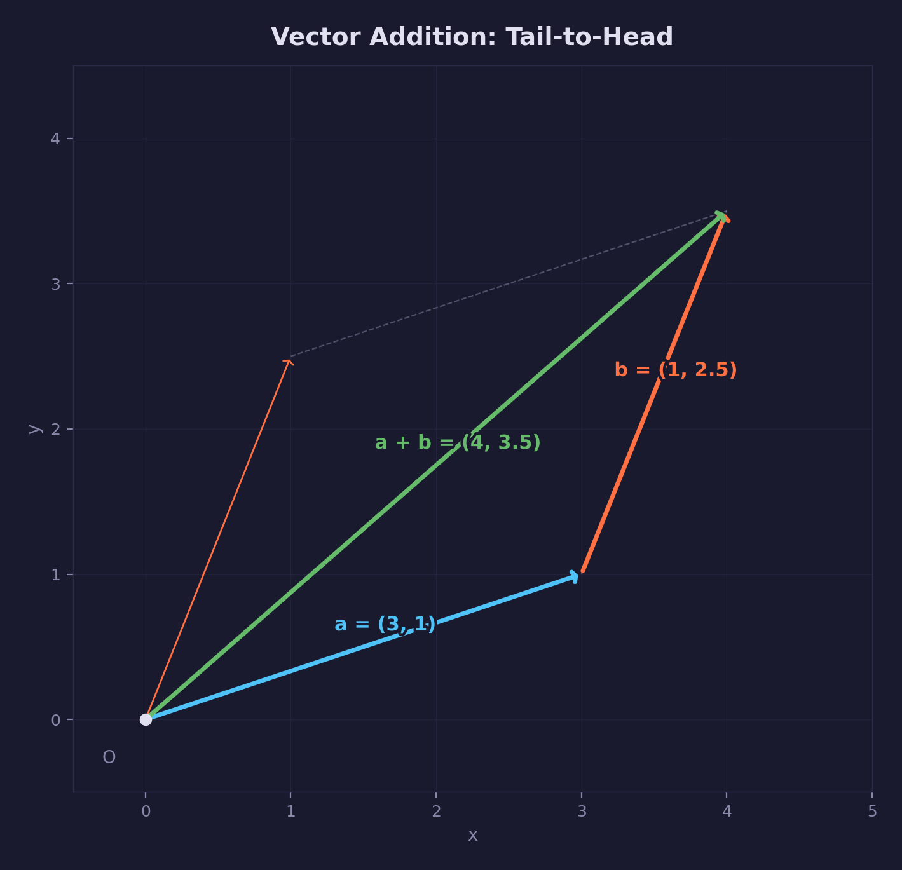
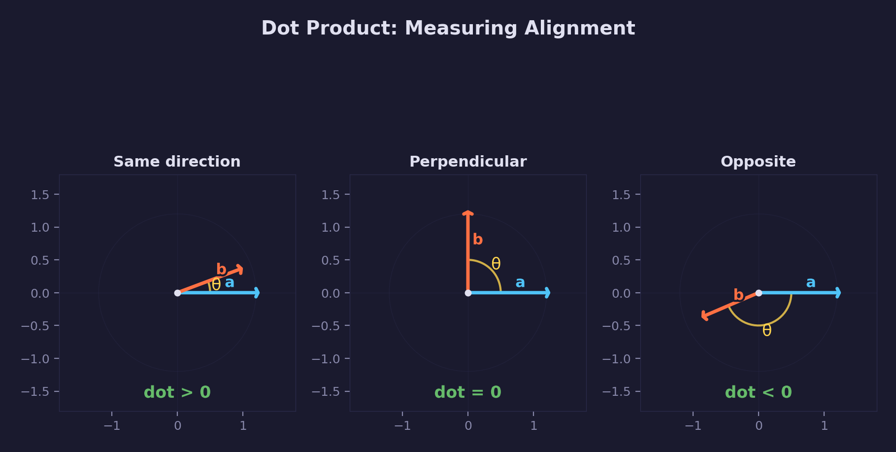

# Math Lesson 01 — Vectors

Learn the fundamentals of vector math for graphics and game programming.

## What you'll learn

- What vectors are and how they represent position, direction, and displacement
- Vector addition and subtraction (combining movements)
- Scalar multiplication (scaling)
- Dot product (measuring alignment and angles)
- Cross product (finding perpendicular directions)
- Normalization (creating unit vectors)
- Linear interpolation (smooth blending)

## Key concepts

- **Vector types** — `vec2`, `vec3`, `vec4` map to HLSL `float2/3/4`
- **Addition/subtraction** — Combine displacements or find direction between points
- **Dot product** — Measures alignment: positive (same direction), zero (perpendicular), negative (opposite)
- **Cross product** — Finds perpendicular vector, useful for normals and coordinate frames
- **Normalization** — Creates unit-length direction vectors
- **Linear interpolation (lerp)** — Smoothly blends between two vectors

## The Math

### What is a vector?

A **vector** is a quantity with both magnitude (length) and direction. In graphics:

- **Position**: Where something is (vec3 position = (5, 10, 2))
- **Direction**: Which way it's facing (vec3 forward = (0, 0, 1))
- **Displacement**: How far it moved (vec3 velocity = (1, 0, 0))

Vectors are written as (x, y) in 2D or (x, y, z) in 3D.

**forge-gpu types:**

- `vec2` — 2D vectors (x, y) — maps to HLSL `float2`
- `vec3` — 3D vectors (x, y, z) — maps to HLSL `float3`
- `vec4` — 4D vectors (x, y, z, w) — maps to HLSL `float4`

### Vector Addition



**Formula:** $(a_x + b_x, a_y + b_y, a_z + b_z)$

**Geometric meaning:** Place the tail of `b` at the head of `a`. The result points from the origin to the combined displacement.

```c
vec3 a = vec3_create(1.0f, 0.0f, 0.0f);  // Move 1 unit right
vec3 b = vec3_create(0.0f, 2.0f, 0.0f);  // Move 2 units up
vec3 sum = vec3_add(a, b);  // (1, 2, 0) — combined movement
```

**Use case:** Combining forces, velocities, or positions.

### Vector Subtraction

**Formula:** $(a_x - b_x, a_y - b_y, a_z - b_z)$

**Geometric meaning:** The vector pointing from `b` to `a`.

```c
vec3 player = vec3_create(5.0f, 3.0f, 0.0f);
vec3 enemy = vec3_create(2.0f, 1.0f, 0.0f);
vec3 direction_to_enemy = vec3_sub(enemy, player);  // (-3, -2, 0)
```

**Use case:** Finding the direction from one object to another.

### Scalar Multiplication (Scaling)

**Formula:** $(v_x \cdot s, v_y \cdot s, v_z \cdot s)$

**Geometric meaning:** Scale the vector's length by `s`. Direction stays the same.

```c
vec3 velocity = vec3_create(1.0f, 0.0f, 0.0f);
vec3 fast = vec3_scale(velocity, 5.0f);  // (5, 0, 0) — 5× faster
```

**Use case:** Changing speed, scaling offsets, adjusting forces.

### Dot Product



**Formula:** $\vec{a} \cdot \vec{b} = a_x b_x + a_y b_y + a_z b_z$

**Result:** A single number (scalar), not a vector.

**Geometric meaning:** Measures how much two vectors point in the same direction.

- Result = $|\vec{a}||\vec{b}|\cos\theta$ where $\theta$ is the angle between them
- **Positive**: vectors point in similar directions
- **Zero**: vectors are perpendicular (90° angle)
- **Negative**: vectors point in opposite directions

```c
vec3 forward = vec3_create(0.0f, 0.0f, 1.0f);
vec3 right = vec3_create(1.0f, 0.0f, 0.0f);
float d = vec3_dot(forward, right);  // 0.0 — perpendicular
```

**Use cases:**

- Checking if two vectors are perpendicular
- Finding the angle between vectors: $\theta = \arccos\!\left(\frac{\vec{a} \cdot \vec{b}}{|\vec{a}||\vec{b}|}\right)$
- Lighting calculations: `brightness = dot(surface_normal, light_direction)`

### Length (Magnitude)

**Formula:** $|\vec{v}| = \sqrt{x^2 + y^2 + z^2}$

**Geometric meaning:** The distance from the origin to the point (x, y, z).

```c
vec3 v = vec3_create(3.0f, 4.0f, 0.0f);
float len = vec3_length(v);  // 5.0 (3-4-5 triangle)
```

**Fast version:** `vec3_length_squared` avoids the square root — use for comparisons:

```c
// Is enemy closer than 10 units?
vec3 to_enemy = vec3_sub(enemy_pos, player_pos);
if (vec3_length_squared(to_enemy) < 10.0f * 10.0f) {
    // Yes! (compared squared distances, no sqrt needed)
}
```

### Normalization

**Formula:** $\hat{v} = \frac{\vec{v}}{|\vec{v}|}$ — divide each component by the vector's length

**Geometric meaning:** Create a **unit vector** (length = 1) pointing in the same direction.

```c
vec3 v = vec3_create(3.0f, 4.0f, 0.0f);  // Length = 5.0
vec3 dir = vec3_normalize(v);  // (0.6, 0.8, 0.0) — Length = 1.0
```

**Use cases:**

- Direction vectors (camera forward, object facing, etc.)
- Unit normals for lighting
- Consistent movement speed regardless of input magnitude

### Cross Product (3D only)

**Formula:**

```text
(a.y * b.z - a.z * b.y,
 a.z * b.x - a.x * b.z,
 a.x * b.y - a.y * b.x)
```

**Geometric meaning:** Produces a vector **perpendicular** to both `a` and `b`, following the right-hand rule:

- Point fingers along `a`
- Curl them toward `b`
- Thumb points along the result

**Magnitude:** $|\vec{a}||\vec{b}|\sin\theta$ — zero if vectors are parallel

```c
vec3 x_axis = vec3_create(1.0f, 0.0f, 0.0f);
vec3 y_axis = vec3_create(0.0f, 1.0f, 0.0f);
vec3 z_axis = vec3_cross(x_axis, y_axis);  // (0, 0, 1)
```

**Use cases:**

- Computing surface normals: `normal = normalize(cross(edge1, edge2))`
- Building coordinate frames: `right = cross(up, forward)`
- Determining if a point is left/right of a line

### Linear Interpolation (Lerp)

**Formula:** $\text{lerp}(a, b, t) = a + t \cdot (b - a)$

**Geometric meaning:** Blend smoothly from `a` to `b`:

- `t = 0.0` → returns `a`
- `t = 0.5` → returns midpoint
- `t = 1.0` → returns `b`

```c
vec3 start = vec3_create(0.0f, 0.0f, 0.0f);
vec3 end = vec3_create(10.0f, 0.0f, 0.0f);
vec3 halfway = vec3_lerp(start, end, 0.5f);  // (5, 0, 0)
```

**Use cases:**

- Smooth camera movement
- Animation (position over time)
- Color blending

## Where it's used

Graphics and game programming uses vectors for:

- **Positions** — where objects are in 3D space
- **Directions** — which way cameras, lights, and objects face
- **Velocities** — how fast and in what direction things move
- **Normals** — surface orientation for lighting
- **Colors** — RGB values are vec3 (red, green, blue)

**In forge-gpu lessons:**

- [Lesson 02 — First Triangle](../../gpu/02-first-triangle/) uses `vec2` for vertex positions and `vec3` for RGB colors
- [Lesson 03 — Uniforms & Motion](../../gpu/03-uniforms-and-motion/) uses vectors for animated triangle vertices

**In the forge-gpu math library:**

- See `common/math/forge_math.h` for all vector operations
- See `common/math/README.md` for usage guide

## Building

```bash
cmake -B build
cmake --build build --config Debug
```

Run:

```bash
python scripts/run.py math/01

# Or directly:
# Windows
build\lessons\math\01-vectors\Debug\01-vectors.exe
# Linux / macOS
./build/lessons/math/01-vectors/01-vectors
```

The demo shows examples of each vector operation with geometric explanations.

## Result

A console program demonstrating vector operations with clear output showing the geometric meaning of each operation. The demo covers all fundamental vector operations used in graphics programming.

**Example output:**

```text
=== Vector Math Demo ===
--- Creating Vectors ---
a (X-axis) = (1.000, 0.000, 0.000)
b (Y-axis) = (0.000, 1.000, 0.000)
c = (3.000, 4.000, 0.000)

--- Addition ---
a + b = (1.000, 1.000, 0.000)
Geometric meaning: diagonal direction (northeast)

--- Dot Product ---
a · b = 0.000 (perpendicular → 0)
a · (2,0,0) = 2.000 (parallel → positive)
a · (-1,0,0) = -1.000 (opposite → negative)

--- Length and Normalization ---
Length of c = 5.000
Normalized c = (0.600, 0.800, 0.000)
Length of normalized c = 1.000 (should be 1.0)

--- Cross Product ---
a × b = (0.000, 0.000, 1.000)
Result is perpendicular to both a and b

--- Linear Interpolation ---
lerp(start, end, 0.0) = (0.000, 0.000, 0.000)
lerp(start, end, 0.5) = (5.000, 5.000, 0.000)
lerp(start, end, 1.0) = (10.000, 10.000, 0.000)
```

## Exercises

1. **Distance calculation**: Modify the demo to compute the distance between two arbitrary 3D points using `vec3_sub` and `vec3_length`.

2. **Angle between vectors**: Use the dot product formula to compute the angle (in degrees) between two vectors: `angle = acos(dot(a,b) / (len(a) * len(b))) * FORGE_RAD2DEG`

3. **Smooth movement**: Create a loop that lerps from (0,0,0) to (10,10,10) over 10 steps, printing each position. This simulates smooth animation.

4. **Build a coordinate frame**: Given an "up" vector (0,1,0) and a "forward" direction, compute the "right" vector using the cross product. Then verify all three are perpendicular using dot products.

## Further reading

- **Next lesson**: [02-coordinate-spaces](../02-coordinate-spaces/) — Coordinate spaces and the transformation pipeline
- **Math library**: [common/math/README.md](../../../common/math/README.md) — Complete API reference
- **External**: [3Blue1Brown — Essence of Linear Algebra](https://www.youtube.com/playlist?list=PLZHQObOWTQDPD3MizzM2xVFitgF8hE_ab) — Beautiful visual explanations
