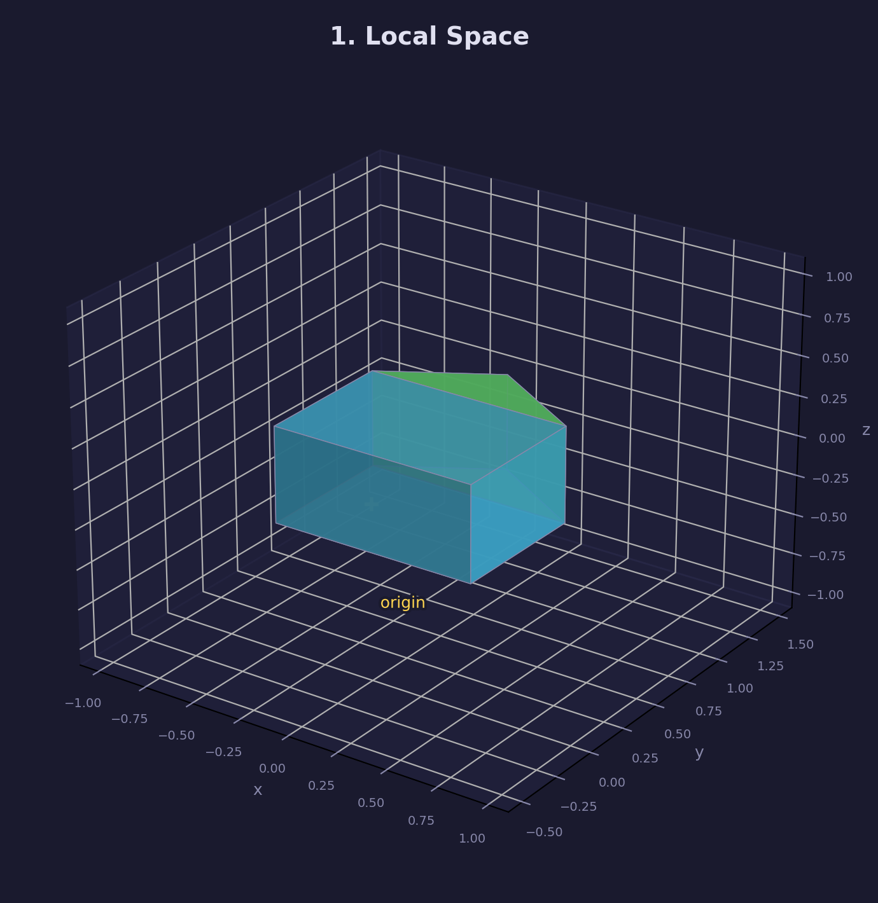
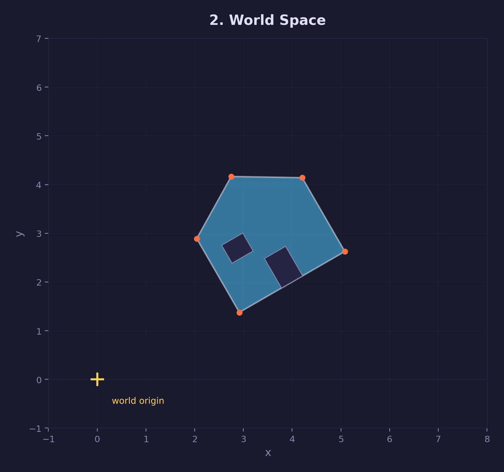
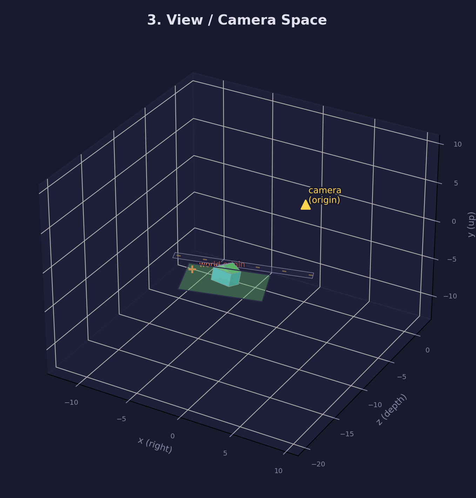
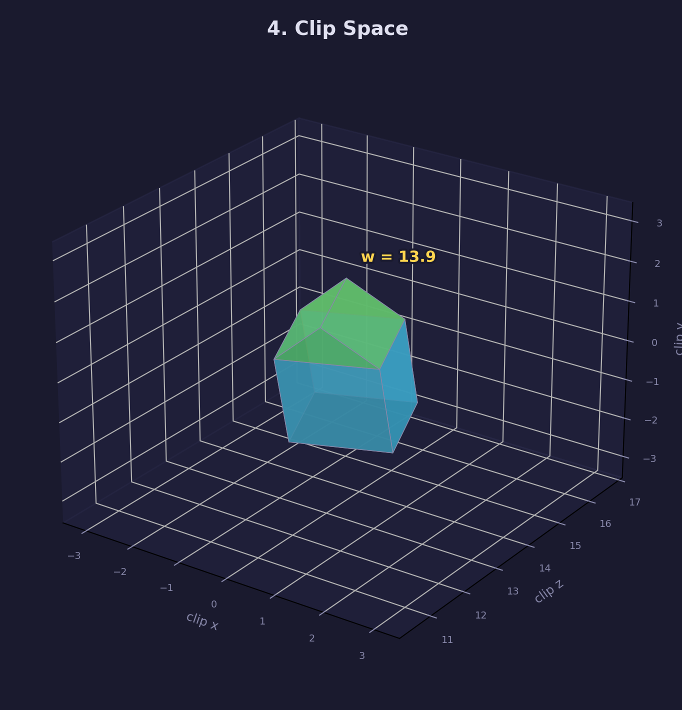
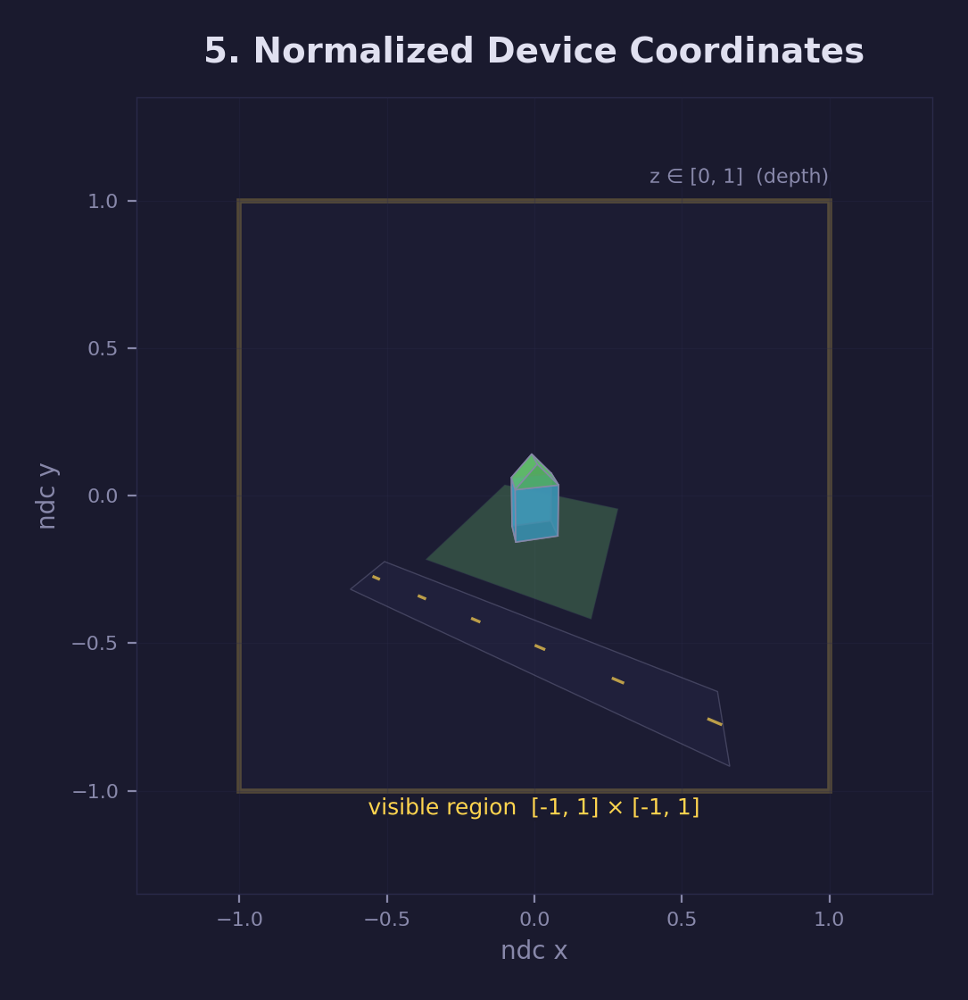
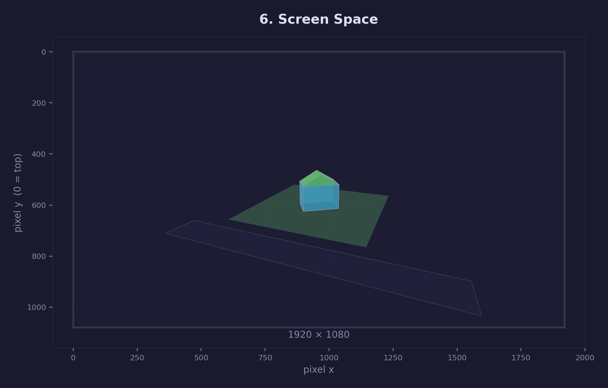
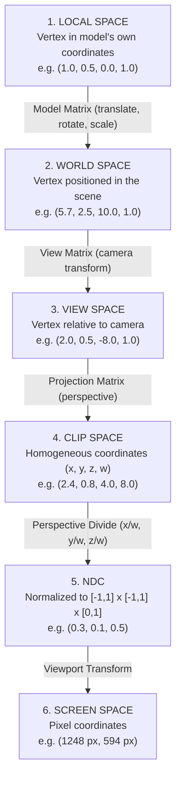

# Math Lesson 02 — Coordinate Spaces

Understanding the transformation pipeline from your 3D model to pixels on screen.

## What you'll learn

- The six coordinate spaces used in 3D graphics
- Why each space exists and what it's used for
- How transformations move between spaces
- The complete pipeline: Model → World → View → Clip → NDC → Screen
- How to use `mat4_look_at()` and `mat4_perspective()` for camera and projection

## Key concepts

- **Coordinate spaces** — Different reference frames for representing geometry at each pipeline stage
- **Homogeneous coordinates** — The w component enables perspective division and distinguishes positions (w=1) from directions (w=0)
- **Model matrix** — Transforms from local object space to world scene space
- **View matrix** — Transforms from world space to camera-relative space (created with `mat4_look_at`)
- **Projection matrix** — Transforms from view space to clip space with perspective (created with `mat4_perspective`)
- **Perspective divide** — Dividing x, y, z by w converts clip space to NDC
- **Transformation pipeline** — The sequence: Model → World → View → Clip → NDC → Screen

## Why coordinate spaces matter

When you're building a 3D game or renderer, you work with many different coordinate systems:

- Your character model is defined in its own "local" coordinates
- That character exists at a position in the game "world"
- The player views the world through a "camera"
- The GPU renders to a rectangular "screen" of pixels

**Coordinate spaces** are the different reference frames we use to represent the same geometry as it moves through the rendering pipeline.

## The Six Spaces

### 1. Local / Model Space



**What it is:** The coordinate system used to define a 3D model.

**Origin:** The model's center (or wherever the artist placed it)

**Purpose:** Makes modeling easier — a cube centered at (0,0,0) is simpler to work with than one offset at (57, 103, -42).

Think of local space the way you think about building with LEGO. When you
design a spaceship out of bricks, you build it right in front of you on the
table — you don't worry about where it will end up on the shelf later. The
bricks have positions relative to the spaceship itself: the cockpit is at the
front, the engines are at the back. That self-contained coordinate system is
local space. Every 3D model — a character, a tree, a sword — is built the same
way, with its own origin and its own axes. This means an artist can model a
chair once and a game can place thousands of copies of that chair throughout a
scene, each at a different position and rotation, without ever changing the
original vertex data.

**Example:**

```c
/* A simple triangle in local space */
vec3 vertices[] = {
    vec3_create(-0.5f,  0.0f, 0.0f),  /* Left corner */
    vec3_create( 0.5f,  0.0f, 0.0f),  /* Right corner */
    vec3_create( 0.0f,  1.0f, 0.0f)   /* Top corner */
};
```

Each mesh/model has its own local space. You define it once, then reuse it everywhere.

---

### 2. World Space



**What it is:** The coordinate system for your entire scene.

**Origin:** Wherever you decide the "center of the world" is (often (0, 0, 0))

**Purpose:** Position multiple objects relative to each other. The player is at (10, 0, 5), the enemy is at (20, 0, 3), etc.

**Transformation:** `Model Matrix` (combines translation, rotation, scale)

World space is the shared coordinate system that every object in your scene
agrees on. If local space is like building a LEGO spaceship on your desk, world
space is the shelf where you place the finished model alongside all your other
models. It gives every object a common frame of reference so you can answer
questions like "how far is the player from the enemy?" or "is the light above
the table?" Without a shared space, each object would only know about its own
coordinates and would have no way to relate to anything else. The
transformation from local space to world space is called the **model matrix**,
and it encodes three properties: where the object is (translation), which way
it faces (rotation), and how large it is (scale). Each object in the scene has
its own model matrix, but they all land in the same world space.

**Example:**

```c
/* Place a tree at (5, 0, 10) in the world */
vec3 position = vec3_create(5.0f, 0.0f, 10.0f);
mat4 model_matrix = mat4_translate(position);

/* Transform the tree's vertices from local → world */
vec4 local_vertex = vec4_create(0.0f, 2.0f, 0.0f, 1.0f);  /* Top of tree */
vec4 world_vertex = mat4_multiply_vec4(model_matrix, local_vertex);
/* Now at (5, 2, 10) in world space */
```

The **model matrix** encodes "where is this object in the world?"

---

### 3. View / Camera Space



**What it is:** Coordinates relative to the camera's position and orientation.

**Origin:** The camera position

**Axes:**

- +X points to the camera's right
- +Y points up
- **-Z points forward** (where the camera is looking)
  - Yes, negative Z! This is a convention to make the math work nicely.

**Purpose:** Simplifies rendering — the GPU assumes the camera is at the origin looking down -Z.

**Transformation:** `View Matrix` (inverse of the camera's model matrix)

View space re-expresses the entire scene from the camera's point of view.
Imagine you are standing in a room and you turn your head to look at a painting
on the wall. From the room's perspective (world space), neither you nor the
painting moved — but from *your* perspective, the painting is now directly in
front of you. That shift in perspective is exactly what the view matrix does:
it takes every object's world-space position and recalculates it relative to
where the camera is and which direction it faces. The reason GPUs want this is
practical — all the projection and clipping math that comes next is much
simpler when the camera is fixed at the origin looking down a known axis. The
view matrix is technically the *inverse* of the camera's own model matrix: if
the camera's model matrix says "the camera is at position (0, 2, 10) facing
the origin," the view matrix says "shift the whole world so that point ends up
at the origin, looking down -Z." For a deep dive into how view matrices are
built — including both look-at and quaternion-based approaches — see
[Math Lesson 09 — View Matrix & Virtual Camera](../09-view-matrix/).

**Example:**

```c
/* Create a camera at (0, 2, 10), looking at the origin */
vec3 eye = vec3_create(0.0f, 2.0f, 10.0f);
vec3 target = vec3_create(0.0f, 0.0f, 0.0f);
vec3 up = vec3_create(0.0f, 1.0f, 0.0f);

mat4 view_matrix = mat4_look_at(eye, target, up);
```

The **view matrix** encodes "where is the camera, and what is it looking at?"

**How `mat4_look_at` works:**

1. Compute the camera's orientation (forward, right, up vectors)
2. Build a rotation matrix using those vectors
3. Apply a translation to move the world opposite to the camera
4. Result: world space → view space

In view space, objects in front of the camera have **negative Z** values.

---

### 4. Clip Space



**What it is:** Coordinates after applying perspective projection.

**Purpose:** Apply perspective foreshortening (distant objects appear smaller) and prepare for clipping.

**Transformation:** `Projection Matrix`

**Key property:** The **w component is no longer 1** — it encodes depth for perspective division.

Clip space is where the rendering pipeline applies perspective — the property
that makes railroad tracks appear to converge in the distance. Up to this
point every transformation has been a rigid rearrangement of geometry: moving
it, rotating it, scaling it. The projection matrix does something
fundamentally different. It reshapes the camera's pyramid-shaped viewing volume
(called the **frustum**) into a box, and in doing so it encodes each vertex's
distance from the camera into the **w component** of its coordinates. Before
projection, w is always 1. After projection, w holds a value proportional to
depth, which is why this space uses four-component **homogeneous coordinates**.
The name "clip space" comes from what happens next: the GPU uses these
coordinates to **clip** — discard — any geometry that falls outside the
viewing volume. Triangles that are partly inside and partly outside get cut
along the frustum boundaries, so only the visible portion continues down the
pipeline.

**Example:**

```c
float fov = 60.0f * FORGE_DEG2RAD;           /* Field of view */
float aspect = 1920.0f / 1080.0f;            /* Screen aspect ratio */
float near = 0.1f;                           /* Near clipping plane */
float far = 100.0f;                          /* Far clipping plane */

mat4 projection_matrix = mat4_perspective(fov, aspect, near, far);
```

After applying the projection matrix, vertices are in **homogeneous coordinates** (x, y, z, w).

**Clipping:** The GPU discards (clips) geometry outside the view frustum before continuing.

---

### 5. NDC (Normalized Device Coordinates)



**What it is:** Coordinates after **perspective division** (dividing x, y, z by w).

**Range:**

- X ∈ [-1, 1] — left to right
- Y ∈ [-1, 1] — bottom to top
- Z ∈ [0, 1] — near to far (Vulkan/Metal/D3D12)
  - OpenGL uses [-1, 1] for Z, but SDL GPU uses [0, 1]

**Purpose:** Normalize coordinates to a standard cube regardless of screen size or aspect ratio.

**Transformation:** Automatic perspective divide (GPU does this)

NDC exists to decouple the rendering math from any particular screen resolution
or aspect ratio. After the perspective divide (dividing x, y, and z by w), every
visible point lands inside a small standardized cube — x and y between -1 and 1,
z between 0 and 1. It does not matter whether the final window is 640×480 or
3840×2160; in NDC, the left edge of the screen is always -1 and the right edge
is always +1. This is what makes the same scene renderable at any resolution
without changing any of the vertex math. The perspective divide itself is the
step that actually produces the perspective effect: objects with a larger w
(farther from the camera) get divided by a bigger number, so they shrink toward
the center of the screen — exactly how real-world perspective works. The GPU
performs this division automatically after clipping, so you rarely compute it
yourself, but understanding it is essential for debugging cases where geometry
appears at the wrong size or in the wrong place.

**Example:**

```c
vec4 clip_point = vec4_create(2.0f, 1.0f, 0.5f, 2.0f);

/* GPU performs perspective division */
vec3 ndc_point = vec3_create(
    clip_point.x / clip_point.w,  /* 2.0 / 2.0 = 1.0 */
    clip_point.y / clip_point.w,  /* 1.0 / 2.0 = 0.5 */
    clip_point.z / clip_point.w   /* 0.5 / 2.0 = 0.25 */
);
/* Result: (1.0, 0.5, 0.25) — at the right edge, halfway up, quarter depth */
```

**Why w matters:** Perspective division makes distant objects (large w) get mapped to smaller NDC coordinates. This is how perspective works!

---

### 6. Screen / Pixel Space



**What it is:** Final pixel coordinates on your screen.

**Origin:** Top-left (0, 0) or bottom-left (API-dependent)

**Range:**

- X ∈ [0, screen_width]
- Y ∈ [0, screen_height]

**Purpose:** The actual pixels the GPU will color.

**Transformation:** `Viewport Transform` (GPU does this automatically)

Screen space is the end of the line — it is where abstract math becomes colored
pixels on your monitor. The viewport transform takes the normalized -1 to +1
range of NDC and stretches it to match the actual pixel dimensions of your
window. If your window is 1920×1080, then NDC x = -1 maps to pixel 0 (left
edge) and NDC x = +1 maps to pixel 1920 (right edge). One subtlety that trips
up beginners: most graphics APIs put the screen-space origin at the **top-left**
corner with +Y pointing downward, which is the opposite of NDC where +Y points
up. The viewport transform handles this Y-flip automatically, but it matters
when you do your own screen-space math — for example, converting a mouse click
position back into a 3D ray (a process called **unprojection** or
**ray casting**). You almost never compute the viewport transform yourself; the
GPU does it as the final step before rasterization. But knowing the mapping
helps you debug issues like upside-down rendering or off-by-half-pixel
alignment.

**Example:**

```c
int screen_width = 1920;
int screen_height = 1080;

/* NDC point at (0.5, -0.25) */
float ndc_x = 0.5f;
float ndc_y = -0.25f;

/* Convert to screen pixels */
float pixel_x = (ndc_x + 1.0f) * 0.5f * screen_width;   /* 1440 px */
float pixel_y = (1.0f - ndc_y) * 0.5f * screen_height;  /* 675 px */
/* Note: Y is flipped because NDC +Y is up, but screen +Y is down */
```

You don't usually compute this manually — the GPU handles it. But understanding the mapping helps debug rendering issues.

---

## The Complete Pipeline

Here's how a vertex flows through the entire pipeline:



**In shader code (vertex shader):**

```hlsl
float4 position_local = float4(input.position, 1.0);
float4 position_world = mul(model_matrix, position_local);
float4 position_view = mul(view_matrix, position_world);
float4 position_clip = mul(projection_matrix, position_view);

/* GPU automatically does perspective divide and viewport transform */
return position_clip;
```

**Combined transform (common optimization):**

```c
/* Precompute on CPU once per frame */
mat4 model_view_projection = mat4_multiply(
    mat4_multiply(projection_matrix, view_matrix),
    model_matrix
);

/* Upload to GPU as uniform */
/* Shader just does: output.position = mul(mvp, input.position); */
```

---

## Why So Many Spaces?

Each space exists for a reason:

| Space | Purpose |
|-------|---------|
| **Local** | Model geometry once, reuse everywhere |
| **World** | Position objects relative to each other |
| **View** | Simplify rendering math (camera at origin) |
| **Clip** | Apply perspective and prepare for clipping |
| **NDC** | Normalize to standard range (hardware-friendly) |
| **Screen** | Map to actual pixels |

You could theoretically skip some of these (e.g., go straight from world to clip), but each step makes certain operations simpler.

---

## Where Coordinate Spaces Appear in forge-gpu

### In GPU Lessons

**Lesson 01 — Hello Window**

- No coordinate transforms yet — just opening a window

**Lesson 02 — First Triangle**

- Vertices are in **clip space** directly (we skip the earlier spaces)
- Range: [-1, 1] for visible vertices
- See: [lessons/gpu/02-first-triangle](../../gpu/02-first-triangle/)

**Lesson 03 — Uniforms & Motion**

- Introduces **model matrix** via push constants
- Still outputs to clip space, but now we can rotate geometry
- See: [lessons/gpu/03-uniforms-and-motion](../../gpu/03-uniforms-and-motion/)

**Future lessons (coming soon):**

- **Camera lesson** — `mat4_look_at` for view matrix (world → view space)
- **3D rendering** — `mat4_perspective` for projection (view → clip space)
- **Multiple objects** — Separate model matrices for each object

### In the Math Library

All the transformation functions are in `common/math/forge_math.h`:

**For model space → world space:**

- `mat4_translate(vec3)` — position in world
- `mat4_rotate_x/y/z(float)` — orientation
- `mat4_scale(vec3)` — size
- `mat4_multiply(a, b)` — combine transforms

**For world space → view space:**

- `mat4_look_at(eye, target, up)` — create view matrix

**For view space → clip space:**

- `mat4_perspective(fov, aspect, near, far)` — create projection matrix

**For transforming vertices:**

- `mat4_multiply_vec4(matrix, vector)` — apply a transformation

See [common/math/README.md](../../../common/math/README.md) for full API.

---

## Building

```bash
cmake -B build
cmake --build build --config Debug
```

Run:

```bash
python scripts/run.py math/02

# Or directly:
# Windows
build\lessons\math\02-coordinate-spaces\Debug\02-coordinate-spaces.exe
# Linux / macOS
./build/lessons/math/02-coordinate-spaces/02-coordinate-spaces
```

The demo program takes a single point and prints its coordinates at each stage of the pipeline. Watch how the values change!

---

## Result

A console program that traces a single point through all six coordinate spaces, printing its coordinates at each transformation stage. The output shows the complete pipeline from model space to screen pixels.

**Example output:**

```text
====================================================================
  Coordinate Spaces - The Transformation Pipeline
====================================================================

1. LOCAL / MODEL SPACE
  Local point:         (1.00, 0.50, 0.00, 1.00)

2. WORLD SPACE
  World point:         (5.35, 3.06, 0.00, 1.00)

3. VIEW / CAMERA SPACE
  View point:          (5.13, 2.52, -8.54, 1.00)

4. CLIP SPACE
  Clip point:          (5.00, 4.36, 8.45, 8.54)

5. NDC (Normalized Device Coordinates)
  NDC point:           (0.59, 0.51, 0.99, 1.00)
  [OK] Point is INSIDE the visible range - would be rendered!

6. SCREEN SPACE
  Screen pixel:        (1521.7, 264.3)
```

## Exercises

1. **Modify the demo:**
   - Change the model matrix to place the point somewhere else
   - Change the camera position and target
   - Adjust the FOV and see how it affects the final pixel position

2. **Clip a point:**
   - Modify the local point so it ends up outside the NDC range [-1, 1]
   - Confirm the demo prints "OUTSIDE the visible range"

3. **Trace a triangle:**
   - Define three vertices of a triangle in local space
   - Transform each vertex through the pipeline
   - Print the final screen coordinates
   - Would the triangle be visible?

4. **Build a camera controller:**
   - Create a program that lets you move the camera with arrow keys
   - Print the view matrix after each movement
   - See how the view-space coordinates change

5. **Perspective vs. orthographic:**
   - See [Math Lesson 06 — Projections](../06-projections/) for both projection types
   - Compare the results of `mat4_perspective` and `mat4_orthographic`

---

## Common Mistakes

### Mistake 1: Confusing w=0 and w=1

```c
/* WRONG: Position with w=0 */
vec4 position = vec4_create(1.0f, 2.0f, 3.0f, 0.0f);
/* This is a DIRECTION, not a position! Translation won't affect it. */

/* CORRECT: Position with w=1 */
vec4 position = vec4_create(1.0f, 2.0f, 3.0f, 1.0f);
```

**Rule:** Positions use `w=1`, directions use `w=0`.

---

### Mistake 2: Wrong matrix multiplication order

```c
/* WRONG: */
mat4 mvp = mat4_multiply(model, mat4_multiply(view, projection));
/* Transforms are applied right-to-left, so this does projection → view → model */

/* CORRECT: */
mat4 mvp = mat4_multiply(mat4_multiply(projection, view), model);
/* Or more clearly: */
mat4 view_projection = mat4_multiply(projection, view);
mat4 mvp = mat4_multiply(view_projection, model);
```

**Rule:** `C = mat4_multiply(A, B)` means "apply B first, then A".

---

### Mistake 3: Forgetting perspective division

```c
/* After projection, clip space coordinates might be: */
vec4 clip = vec4_create(4.0f, 2.0f, 8.0f, 4.0f);

/* WRONG: Treating these as NDC */
if (clip.x > 1.0f) {
    /* This check is meaningless in clip space! */
}

/* CORRECT: Divide by w first */
vec3 ndc = vec3_create(clip.x / clip.w, clip.y / clip.w, clip.z / clip.w);
if (ndc.x > 1.0f) {
    /* Now this makes sense — it's outside the visible range */
}
```

**Rule:** The GPU does perspective division automatically, but if you're doing math on the CPU, you must divide by w to get NDC.

---

### Mistake 4: Wrong up vector for look_at

```c
/* WRONG: Up vector parallel to forward */
vec3 eye = vec3_create(0.0f, 5.0f, 0.0f);
vec3 target = vec3_create(0.0f, 0.0f, 0.0f);
vec3 up = vec3_create(0.0f, -1.0f, 0.0f);  /* Points straight down! */
mat4 view = mat4_look_at(eye, target, up);
/* The cross product will be zero — produces a degenerate view matrix! */

/* CORRECT: Up vector not parallel to forward */
vec3 up = vec3_create(0.0f, 1.0f, 0.0f);   /* Or (0, 0, 1), etc. */
```

**Rule:** The `up` vector should be roughly perpendicular to the forward direction (target - eye).

---

## Visualizing Coordinate Spaces

If you're a visual learner, here are some ways to build intuition:

1. **Sketch it:** Draw the same triangle on paper in different spaces. Label the axes.
2. **Print transforms:** Modify the demo to print the transformation matrices themselves.
3. **Interactive tool:** Build a small program with SDL that lets you drag objects around and see their coordinates update in real-time.
4. **Shader debugging:** In a GPU lesson, output intermediate coordinates as colors to visualize the spaces.

---

## Further Reading

- [Learn OpenGL — Coordinate Systems](https://learnopengl.com/Getting-started/Coordinate-Systems) — Great visual explanations
- [Scratchapixel — Geometry](https://www.scratchapixel.com/lessons/3d-basic-rendering/computing-pixel-coordinates-of-3d-point/mathematics-computing-2d-coordinates-of-3d-points.html) — Deep dive into the math
- **forge-gpu lessons:**
  - [Lesson 01 — Vectors](../01-vectors/) — Foundation for positions and directions
  - [Lesson 03 — Uniforms & Motion](../../gpu/03-uniforms-and-motion/) — Using model matrices in practice

---

**Key takeaway:** Every coordinate space exists to make a specific task easier. Understanding the pipeline helps you debug rendering issues, implement camera controls, and build 3D scenes confidently.

When in doubt, trace a point through the pipeline step by step — just like the demo does!
