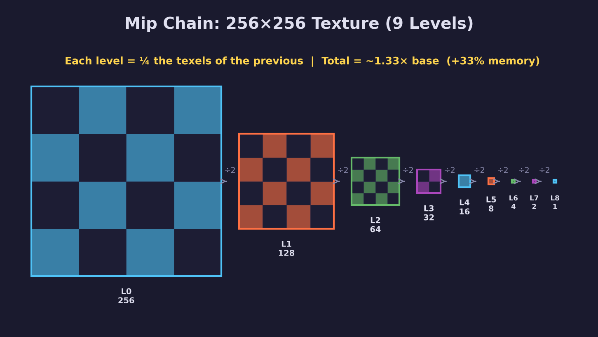
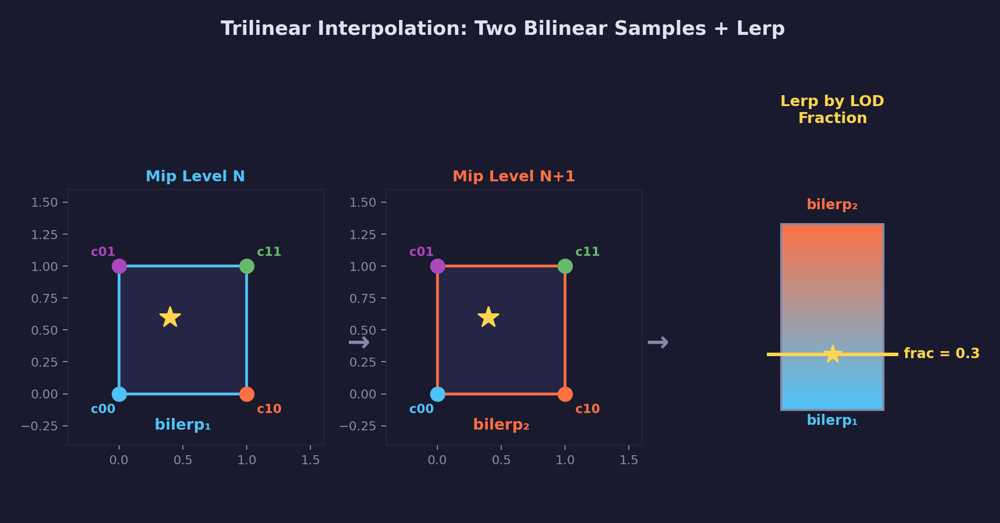
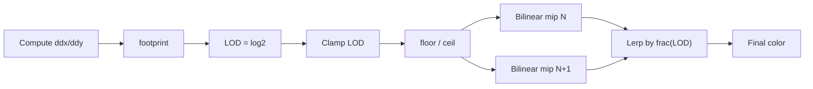

# Math Lesson 04 — Mipmaps & LOD

## What you'll learn

- Why textures need mipmaps (the aliasing problem)
- How mip chains work (halving, log2 level count, memory cost)
- Trilinear interpolation (two bilinear samples + lerp between mip levels)
- LOD selection (how the GPU picks the right mip level)
- How `forge_log2f`, `forge_clampf`, and `forge_trilerpf` connect to the GPU

## Result

After running this lesson you will understand how mip chains are computed (level
count, memory cost), how the GPU selects a mip level via LOD, and how trilinear
interpolation blends between two mip levels for smooth transitions. The console
output walks through each concept with concrete numbers.

## Key concepts

- **Mip chain** — a series of progressively halved textures, from full size down to 1x1
- **LOD (Level of Detail)** — $\log_2(\text{footprint})$, how the GPU picks which mip level to sample
- **Trilinear interpolation** — bilinear sample from two adjacent mip levels, then lerp between them
- **Screen-space derivatives** — `ddx`/`ddy` measure how fast UVs change across pixels, driving LOD selection

## Building

```bash
python scripts/run.py math/04
```

Requires SDL3 and a C99 compiler (see project root README for full setup).

## The problem: aliasing

When a texture is viewed at a distance, many texels map to a single screen
pixel. The GPU can only sample a few texels per pixel, so it misses most of the
fine detail. The result is shimmering, moire patterns, and visual noise.

```text
Near: 1 texel ~ 1 pixel (looks great)

    pixel grid          texel grid
    +---+---+---+       +---+---+---+
    |   |   |   |       | A | B | C |
    +---+---+---+       +---+---+---+
    |   |   |   |  <->  | D | E | F |
    +---+---+---+       +---+---+---+

Far: many texels per pixel (aliasing!)

    pixel grid          texel grid
    +---+               +--+--+--+--+--+--+--+--+
    |   |  covers  ->   |  |  |  |  |  |  |  |  |
    +---+               +--+--+--+--+--+--+--+--+
                        |  |  |  |  |  |  |  |  |
                        +--+--+--+--+--+--+--+--+
```

## The solution: mipmaps

**Mip** stands for "multum in parvo" — "much in a small space." A mipmap is a
pre-computed chain of progressively smaller versions of a texture, where each
level is half the size of the previous one.



### How many levels?

$$\text{num\_levels} = \lfloor \log_2(\max(\text{width}, \text{height})) \rfloor + 1$$

```c
int num_levels = (int)forge_log2f((float)max_dimension) + 1;
```

A 256x256 texture: $\lfloor \log_2(256) \rfloor + 1 = 8 + 1 = 9$ levels.

### Memory cost

Each level has $\frac{1}{4}$ the texels of the previous level. The total is a
geometric series:

$$\sum_{k=0}^{\infty} \frac{1}{4^k} = 1 + \frac{1}{4} + \frac{1}{16} + \frac{1}{64} + \cdots = \frac{4}{3}$$

So mipmaps add exactly **33%** extra memory — a small price for eliminating
aliasing.

## LOD selection

**LOD** (Level of Detail) determines which mip level to sample from. The GPU
computes it automatically from screen-space derivatives:

$$\text{footprint} = \max\!\left(\left|\frac{\partial U}{\partial x}\right|, \left|\frac{\partial V}{\partial y}\right|\right) \times \text{texture\_size}$$

$$\text{LOD} = \log_2(\text{footprint})$$

When one screen pixel covers:

- **1 texel** — $\text{LOD} = \log_2(1) = 0$ (use the base texture)
- **2 texels** — $\text{LOD} = \log_2(2) = 1$ (use the half-size mip)
- **4 texels** — $\text{LOD} = \log_2(4) = 2$ (use the quarter-size mip)
- **n texels** — $\text{LOD} = \log_2(n)$

The GPU computes `ddx(uv)` and `ddy(uv)` — the rate of change of UVs across
adjacent pixels — using **helper invocations** that run fragment shaders in 2x2
quads. This is why `discard` can be problematic in some shaders: it can
invalidate derivative computations for neighboring pixels.

## Trilinear interpolation

When the LOD is 2.3, the GPU:

1. **Bilinear samples** from mip level 2 (4 texels)
2. **Bilinear samples** from mip level 3 (4 texels)
3. **Lerps** between the two results using the fractional LOD (0.3)

This is **trilinear filtering** — it eliminates visible "pops" when
transitioning between mip levels.



The formula combines two bilinear interpolations with a third lerp:

$$\text{result} = \text{lerp}\!\big(\text{bilerp}(\text{mip}_N),\; \text{bilerp}(\text{mip}_{N+1}),\; \text{frac}(\text{LOD})\big)$$

This uses 8 texels total — 4 from each mip level — blended by three parameters:
$t_x$, $t_y$ (fractional UV within each mip level) and $t_z$ (fractional LOD
between levels).

### The forge_math.h implementation

```c
// Scalar trilinear: 8 corner values + 3 blend factors
float result = forge_trilerpf(
    c000, c100, c010, c110,   // front face (mip level N)
    c001, c101, c011, c111,   // back face  (mip level N+1)
    tx, ty, tz);              // tx,ty = UV fraction; tz = LOD fraction

// RGB trilinear: same structure with vec3
vec3 color = vec3_trilerp(
    mip_n_corners...,
    mip_n1_corners...,
    tx, ty, tz);
```

## Sampler mipmap modes

| Mode | Behavior | Use case |
|------|----------|----------|
| `NEAREST` | Picks the single closest mip level | Fast, but visible "pops" |
| `LINEAR` | Blends between two adjacent levels | Smooth transitions (trilinear) |

Combined with min/mag filter modes:

| Filter combination | Name | Quality |
|--------------------|------|---------|
| NEAREST + NEAREST mip | Point sampling | Lowest (pixelated + pops) |
| LINEAR + NEAREST mip | Bilinear | Medium (smooth within level, pops between) |
| LINEAR + LINEAR mip | Trilinear | High (smooth everywhere) |

## How the GPU samples a mipmapped texture



1. Compute UV derivatives (`ddx`/`ddy`) at each pixel
2. Calculate the footprint in texel space
3. $\text{LOD} = \log_2(\text{footprint})$
4. Clamp LOD to `[min_lod, max_lod]` from the sampler
5. Split LOD into integer + fractional parts
6. Bilinear sample from $\lfloor \text{LOD} \rfloor$ and $\lceil \text{LOD} \rceil$
7. Lerp between them using $\text{frac}(\text{LOD})$

## Functions added to forge_math.h

| Function | Description |
|----------|-------------|
| `forge_log2f(x)` | Base-2 logarithm (mip level count) |
| `forge_clampf(x, lo, hi)` | Clamp scalar to range (LOD clamping) |
| `forge_trilerpf(...)` | Scalar trilinear interpolation |
| `vec3_trilerp(...)` | vec3 trilinear (RGB colors) |
| `vec4_trilerp(...)` | vec4 trilinear (RGBA colors) |

## Running the demo

```bash
python scripts/run.py math/04
```

## Exercises

1. **Mip chain math**: Calculate the total number of texels in a 1024x1024
   mip chain. Verify it's ~33% more than the base level.

2. **Non-square textures**: A 512x256 texture has $\log_2(512) + 1 = 10$ levels.
   At level 1 it's 256x128, at level 9 it's 1x1. Work through the sizes.

3. **LOD bias**: If `mip_lod_bias = 1.0`, the GPU adds 1 to the computed LOD.
   This shifts sampling toward smaller (blurrier) mip levels. When would you
   want this? (Hint: sharpening vs. blurring trade-offs.)

4. **Anisotropic filtering**: Trilinear assumes the pixel footprint is square.
   What happens when the surface is viewed at a steep angle? Research
   anisotropic filtering and how it extends trilinear.

## See also

- [Math Lesson 03 — Bilinear Interpolation](../03-bilinear-interpolation/) — the 2D building block
- [GPU Lesson 05 — Mipmaps](../../gpu/05-mipmaps/) — using `SDL_GenerateMipmapsForGPUTexture`
- [Math library API](../../../common/math/README.md) — full function reference
