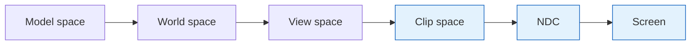
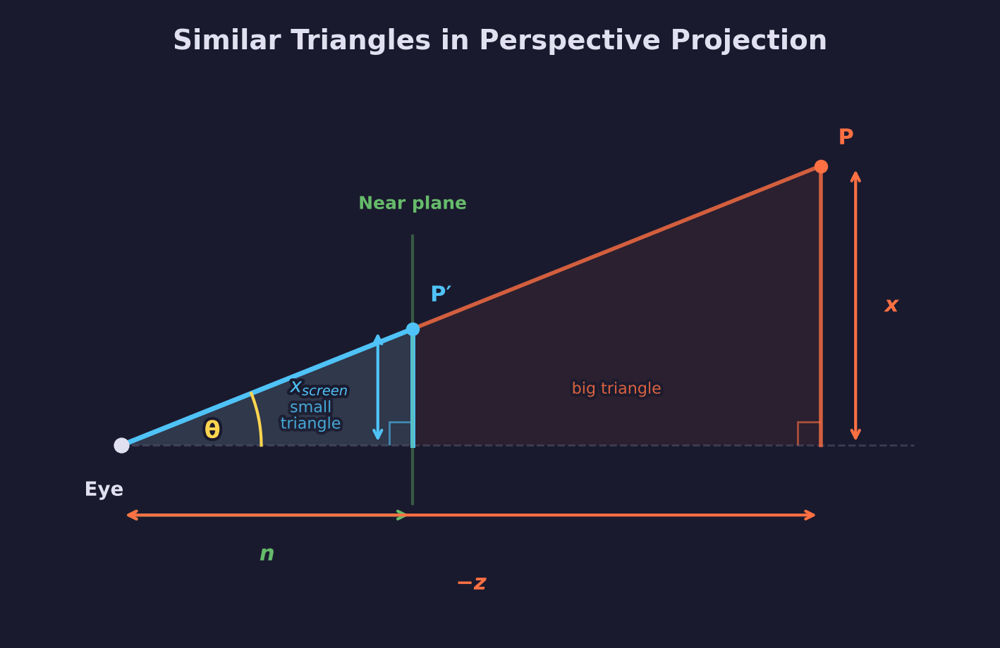
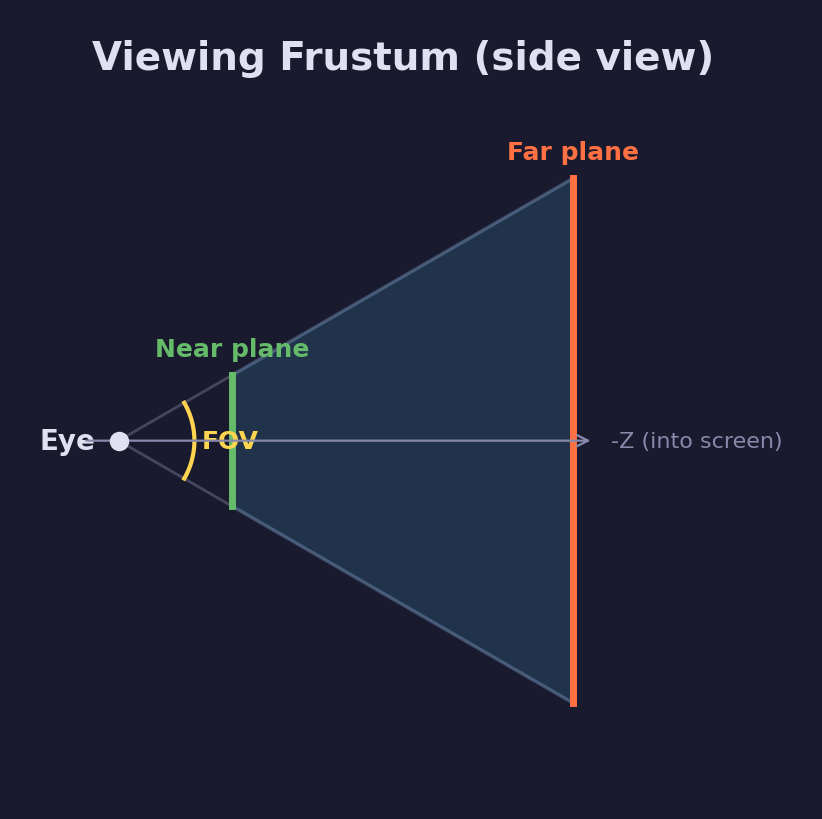
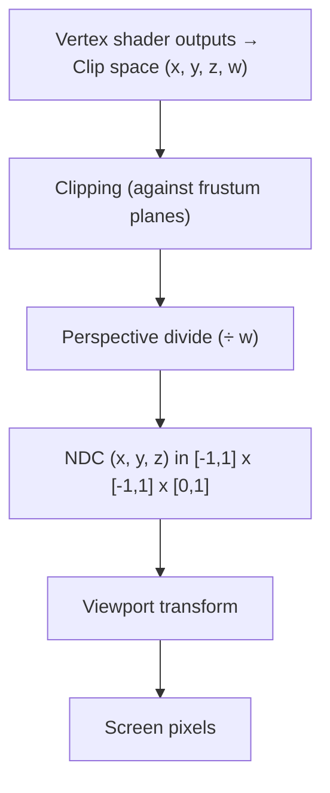

# Math Lesson 06 — Projections

How 3D scenes map to 2D screens.

## What you'll learn

- The core insight behind perspective: similar triangles
- What a viewing frustum is and how FOV/aspect define it
- How the perspective projection matrix works, step by step
- Clip space vs NDC and the perspective divide
- Why naive screen-space interpolation fails and how the GPU fixes it
- Orthographic projection: when and why to use it
- Asymmetric perspective for VR and multi-monitor setups
- How to compare projections side by side

## Result

Running the program prints a guided walkthrough of the full projection pipeline:

```text
=============================================================
  Math Lesson 06 — Projections
  How 3D scenes map to 2D screens
=============================================================

── 1. Perspective without a matrix ────────────────────────
  ...projecting points at increasing depth...

── 2. The perspective projection matrix ───────────────────
  ...90° FOV, 16:9 perspective matrix and clip-space output...

── 3. Clip space to NDC (perspective divide) ──────────────
  ...near plane → NDC z ≈ 0, far plane → NDC z ≈ 1...

── 8. Comparing projections ───────────────────────────────
  ...perspective shrinks with depth, orthographic stays constant...
```

Each section demonstrates one concept with concrete numbers so you can see
exactly how the math transforms coordinates.

## Prerequisites

- [Math Lesson 05 — Matrices](../05-matrices/) — matrix multiplication, identity,
  column-major layout
- [Math Lesson 02 — Coordinate Spaces](../02-coordinate-spaces/) — model, view,
  clip, NDC spaces and the transform pipeline

## Key Concepts

### What is projection?

Projection is the process of mapping 3D coordinates to a 2D screen. It's the
final step in the transform pipeline:



The highlighted stages are where projection operates.

Think of it like a pinhole camera: light from the 3D scene passes through a
single point and hits a flat surface (the screen).

### Similar triangles

Two triangles are **similar** when they have the same angles. Their shapes are
identical — one is just a scaled version of the other. The key property: the
ratios of corresponding sides are equal. If one triangle has sides $a$, $b$, $c$
and a similar triangle has sides $a'$, $b'$, $c'$, then:

$$
\frac{a'}{a} = \frac{b'}{b} = \frac{c'}{c}
$$

This property is the mathematical foundation of perspective projection.

### Perspective without a matrix

The core insight requires no matrices at all — just similar triangles.

Imagine a camera (eye) at the origin looking down the negative Z axis. A point
$P$ sits at $(x, y, z)$ in view space, and the near plane is at distance $n$
from the eye. Drawing a line from the eye through $P$ to the near plane creates
two similar right triangles:



The small triangle (eye to $P'$ on the near plane) and the big triangle (eye
to $P$ at depth $-z$) share the angle $\theta$ at the eye. Both have a right
angle where the point meets the axis. Same angles mean similar triangles, so
their side ratios are equal:

$$
\frac{x_{\text{screen}}}{n} = \frac{x}{-z}
$$

Solving for $x_{\text{screen}}$:

$$
x_{\text{screen}} = \frac{x \cdot n}{-z}, \quad y_{\text{screen}} = \frac{y \cdot n}{-z}
$$

That's it. Objects farther away (larger `-z`) get divided by a bigger number,
so they appear smaller on screen. This is **perspective foreshortening**.

### The viewing frustum



The frustum is the volume of space visible to the camera — a truncated pyramid.

FOV (field of view) and aspect ratio determine the pyramid's shape:

- $h = n \cdot \tan\!\left(\frac{\text{fov}_y}{2}\right)$ — near plane half-height
- $w = h \cdot \text{aspect}$ — near plane half-width

Everything inside the frustum is visible. Everything outside is clipped.

### The perspective projection matrix

`mat4_perspective(fov, aspect, near, far)` packages the similar-triangles
formula into a 4x4 matrix that also:

1. Scales X and Y by $\frac{1}{\tan(\text{fov}/2)}$ (and aspect) for the FOV
2. Maps the Z range $[n, f]$ to $[0, 1]$ for the depth buffer
3. Sets $w = -z$ so the GPU can perform the perspective divide

The matrix doesn't divide by `-z` directly — it stores `-z` in the `w`
component and lets the GPU do the division later.

### Clip space and NDC

These are two separate coordinate spaces, and the distinction matters:



**Clip space** has 4 components. Clipping happens here (before dividing by `w`)
because the math is simpler in homogeneous coordinates.

**NDC** has 3 components. After clipping, the GPU divides `(x, y, z)` by `w`.
The result is in Normalized Device Coordinates:

- X ∈ [-1, 1] — left to right
- Y ∈ [-1, 1] — bottom to top
- Z ∈ [0, 1] — near to far (Vulkan/Metal/D3D12 convention)

### The perspective divide

The GPU performs:

$$
\text{NDC} = \left(\frac{x_c}{w_c}, \frac{y_c}{w_c}, \frac{z_c}{w_c}\right)
$$

For perspective projection, $w_c = -z_{\text{view}}$ (the negated view-space depth).
Dividing by $w$ is dividing by depth — this is what makes far objects smaller.

For orthographic projection, $w_c = 1$, so the divide is a no-op.

We provide `vec3_perspective_divide()` for CPU-side computation (useful for
picking, debug visualization, and understanding the pipeline).

### Perspective-correct interpolation

When the GPU rasterizes a triangle, it interpolates vertex attributes (UVs,
colors, etc.) across the surface. But naive screen-space linear interpolation
gives **wrong** results in perspective:

```text
Wrong (screen-space lerp):
  u = lerp(u_near, u_far, t)            ← textures "swim"

Correct (perspective-correct):
  u = lerp(u_near/w_near, u_far/w_far, t)
      ────────────────────────────────────
      lerp(1/w_near, 1/w_far, t)        ← divide to recover
```

The key insight: interpolate `attribute/w` and `1/w` in screen space (both of which
vary linearly in screen space), then divide to get the correct attribute value.
The GPU does this automatically for every interpolated value.

### Orthographic projection

Orthographic projection maps a box to NDC **without** foreshortening:

- Objects at any depth appear the same size
- Parallel lines remain parallel
- `w` stays 1 (no perspective divide)

Use orthographic for:

- **2D rendering / UI** — `mat4_orthographic(0, width, 0, height, -1, 1)`
- **Shadow maps** — from the light's perspective
- **CAD / architecture** — where parallel lines must stay parallel

The matrix scales `[left,right]` to `[-1,1]`, `[bottom,top]` to `[-1,1]`,
and `[-near,-far]` to `[0,1]`.

### Asymmetric perspective

`mat4_perspective_from_planes(left, right, bottom, top, near, far)` is the
general form — it takes the near-plane rectangle directly instead of computing
it from FOV and aspect.

`mat4_perspective` is a symmetric special case where `left = -right` and
`bottom = -top`. Asymmetric frustums are needed for:

- **VR** — each eye's frustum is shifted slightly off-center
- **Multi-monitor** — each screen covers a different part of the frustum
- **Oblique clipping** — portals and mirrors with tilted near planes

### Comparing projections

| Property | Perspective | Orthographic |
|----------|-------------|--------------|
| Distant objects | Appear smaller | Same size |
| Parallel lines | Converge | Stay parallel |
| w component | -z (varies) | 1 (constant) |
| Depth distribution | Non-linear | Linear |
| Use cases | 3D games, realistic scenes | 2D, shadow maps, CAD |

## Building

```bash
python scripts/run.py math/06
```

Or build manually:

```bash
cmake -B build
cmake --build build --config Debug

# Windows
build\lessons\math\06-projections\Debug\06-projections.exe

# Linux / macOS
./build/lessons/math/06-projections/06-projections
```

## Exercises

1. **Depth precision:**
   - Try `near=0.001` and `near=1.0` with the same far plane
   - Transform several points and compare the NDC z values
   - Notice how tiny `near` values waste precision near the camera

2. **Reverse-Z projection:**
   - Modify `mat4_perspective` to map near→1 and far→0 instead of near→0, far→1
   - This improves depth precision for far objects
   - Many modern engines use this technique

3. **Manual perspective matrix:**
   - Build a perspective matrix from scratch using the similar-triangles formula
   - Verify it produces the same results as `mat4_perspective`

4. **Asymmetric stereo:**
   - Compute left and right eye frustums for 65mm IPD (interpupillary distance)
   - Transform the same point through both and compare the NDC x values

5. **Perspective-correct UV:**
   - Pick three 3D triangle vertices with known UVs and depths
   - Project them to screen space, interpolate with both methods
   - Verify the perspective-correct version matches expected values

## See also

- [Math Lesson 05 — Matrices](../05-matrices/) — matrix fundamentals
- [Math Lesson 02 — Coordinate Spaces](../02-coordinate-spaces/) — transform pipeline
- [GPU Lesson 06 — Depth Buffer & 3D Transforms](../../gpu/06-depth-and-3d/) — projections
  in practice
- [Math library](../../../common/math/README.md) — `mat4_perspective`,
  `mat4_orthographic`, `vec3_perspective_divide`
