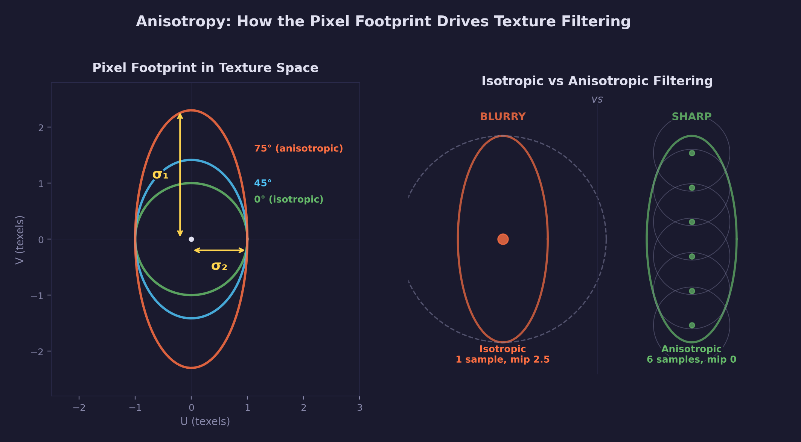

# Math Lesson 10 — Anisotropy vs Isotropy

Direction-dependent vs direction-independent behavior, and how GPUs use it
to sample textures sharply at steep viewing angles.

## What you'll learn

- What **isotropy** and **anisotropy** mean (equal vs directional behavior)
- How a **2x2 matrix** maps a circle to an ellipse (the geometric view)
- The **screen-space Jacobian** — how texture coordinates change per pixel
- **Singular values** — the axes of the pixel footprint ellipse
- How the **anisotropy ratio** drives GPU texture filtering decisions
- **Eigenvalues of $J^T J$** — how GPUs compute this efficiently
- **Anisotropic noise** — creating directional patterns (wood grain, brushed metal)
- **Anisotropic friction** — direction-dependent resistance in physics

## Key concepts

- **Isotropic** — Same in all directions. A circle is isotropic. Trilinear
  filtering is isotropic (picks one mip level for both axes).
- **Anisotropic** — Different depending on direction. An ellipse is anisotropic.
  Anisotropic filtering adapts to the footprint's shape.
- **Jacobian matrix** — A 2x2 matrix of partial derivatives that captures how
  texture coordinates change per screen pixel. It maps the unit circle (one pixel)
  to an ellipse in texture space (the pixel footprint).
- **Singular values** — The semi-axis lengths of the ellipse a matrix maps the
  unit circle to. They measure the maximum and minimum stretch.
- **Anisotropy ratio** — $\sigma_1 / \sigma_2$, the ratio of the largest to
  smallest singular value. 1:1 is isotropic; 8:1 is highly anisotropic.
- **Pixel footprint** — The region of texture space that a single screen pixel
  covers. Isotropic when square, anisotropic when elongated.

## The Math



### Isotropy and anisotropy

The words come from Greek: *iso* (equal) + *tropos* (direction) = "equal in all
directions." The prefix *an-* negates it: *anisotropic* means "not equal in all
directions."

A **circle** is isotropic — its radius is the same no matter which direction you
measure. An **ellipse** is anisotropic — its radius depends on direction. The
ratio of the longest to shortest radius is a measure of *how* anisotropic it is.

This distinction appears throughout graphics and physics:

| Domain | Isotropic | Anisotropic |
|--------|-----------|-------------|
| Texture filtering | Trilinear (square footprint) | AF (elongated footprint) |
| Noise patterns | Perlin noise (uniform) | Stretched noise (wood grain) |
| Friction | Rubber on concrete | Ice skate blade |

### The pixel footprint

When a textured surface is rendered, each screen pixel corresponds to a region
of texture space called the **pixel footprint**. This footprint tells the GPU
which texels contribute to that pixel's color.

**Viewed straight-on**, the footprint is approximately square — one pixel covers
roughly one texel in each direction. Filtering is simple: sample the texture at
that point (or bilinearly blend the 4 nearest texels).

**Viewed at an angle**, the footprint becomes elongated. A pixel that covers 1
texel horizontally might cover 6 texels along the tilted direction. If the GPU
treats this as a square footprint, it must either:

- Use the *large* axis to pick a mip level → sharp along the long axis but
  **blurry** along the short axis (wastes detail)
- Use the *small* axis to pick a mip level → sharp everywhere but **aliases**
  along the long axis (too few samples)

Anisotropic filtering solves this by adapting to the footprint's shape.

### The screen-space Jacobian

The **Jacobian matrix** captures exactly how the pixel footprint is shaped. It is
named after German mathematician **Carl Gustav Jacob Jacobi** (1804–1851), who
studied matrices of partial derivatives extensively in his work on differential
equations and determinant theory. A Jacobian is a 2x2 matrix of partial
derivatives:

$$
J = \begin{bmatrix} \frac{\partial u}{\partial x} & \frac{\partial u}{\partial y} \\ \frac{\partial v}{\partial x} & \frac{\partial v}{\partial y} \end{bmatrix}
$$

Each entry answers a specific question:

- $\frac{\partial u}{\partial x}$: "If I move one pixel right on screen, how many
  texels do I move in the U direction?"
- $\frac{\partial v}{\partial y}$: "If I move one pixel down on screen, how many
  texels do I move in the V direction?"
- The off-diagonal entries capture rotation and shear.

**Example — tilted plane:** A flat textured plane tilted around the horizontal
axis by angle $\theta$:

$$
J = \begin{bmatrix} 1 & 0 \\ 0 & \frac{1}{\cos\theta} \end{bmatrix}
$$

- **Horizontal** (U axis): one pixel still maps to one texel (unchanged).
- **Vertical** (V axis): each pixel spans $1/\cos\theta$ texels. As $\theta$
  increases toward 90 degrees, this grows without bound — the surface is nearly
  edge-on, and each pixel covers a huge strip of texture.

The Jacobian maps the **unit circle** (representing one pixel) to an **ellipse**
in texture space (the pixel footprint). The shape of that ellipse tells us
everything we need for filtering.

### Singular values

The **singular values** of the Jacobian are the semi-axis lengths of the pixel
footprint ellipse. They answer: "how much does this matrix stretch space in its
most-stretched and least-stretched directions?"

For any 2x2 matrix $M$:

1. Compute $S = M^T M$ (a symmetric, positive semi-definite matrix)
2. Find the eigenvalues of $S$ (using the quadratic formula for 2x2)
3. The singular values are the square roots: $\sigma_i = \sqrt{\lambda_i}$

For a 2x2 symmetric matrix $S = \begin{bmatrix} p & q \\ q & r \end{bmatrix}$,
the eigenvalues have a closed-form solution:

$$
\lambda = \frac{p + r}{2} \pm \sqrt{\left(\frac{p - r}{2}\right)^2 + q^2}
$$

The larger eigenvalue gives $\sigma_1$ (major axis), the smaller gives $\sigma_2$
(minor axis).

#### What are eigenvalues?

An **eigenvalue** $\lambda$ of a matrix $S$ is a scalar such that $S \mathbf{v}
= \lambda \mathbf{v}$ for some non-zero vector $\mathbf{v}$ (the
**eigenvector**). In other words, the matrix acts on the eigenvector by simply
scaling it — no rotation, just stretching. For the symmetric matrix $J^T J$, the
eigenvalues are always non-negative real numbers, and the eigenvectors point
along the axes of the footprint ellipse.

#### What is a singular value?

A **singular value** $\sigma$ of a matrix $M$ is the square root of an eigenvalue
of $M^T M$. It represents the factor by which $M$ stretches space along a
particular direction. If $M$ has singular values $\sigma_1 = 4$ and
$\sigma_2 = 1$, then $M$ stretches space by 4x along one direction and leaves
the other unchanged — an anisotropy ratio of 4:1.

### Anisotropy ratio

The **anisotropy ratio** is:

$$
\text{ratio} = \frac{\sigma_1}{\sigma_2} = \frac{\text{major axis}}{\text{minor axis}}
$$

| Ratio | Description | Filtering impact |
|-------|-------------|------------------|
| 1:1 | Isotropic (circle) | Trilinear is perfect |
| 2:1 | Mild anisotropy | 2x AF gives noticeable improvement |
| 4:1 | Moderate | AF clearly better than trilinear |
| 8:1+ | Highly anisotropic | AF essential (floors, roads at a distance) |

GPUs typically cap the ratio at **16:1** (the `maxAnisotropy` setting), because
the cost grows linearly with the ratio and returns diminish beyond ~16 samples.

### Isotropic vs anisotropic filtering

**Isotropic filtering (trilinear)** treats the footprint as a circle. It uses the
*largest* singular value to pick the mip level:

$$
\text{mip}_\text{iso} = \log_2(\sigma_1)
$$

This guarantees no aliasing, but blurs the axis that didn't need such a high mip
level. At 80 degrees tilt with a 5.76:1 ratio, trilinear picks mip 2.53 — the
untilted axis gets blurred 5.76x more than necessary.

**Anisotropic filtering** treats the footprint as an ellipse. It uses the
*smallest* singular value for the mip level (preserving detail) and takes
multiple samples along the major axis:

$$
\text{mip}_\text{aniso} = \log_2(\sigma_2)
$$
$$
\text{samples} = \lceil \sigma_1 / \sigma_2 \rceil
$$

At 80 degrees tilt: mip 0 (full detail) with 6 samples along the stretched axis.
The result is sharp *and* alias-free.

### How GPUs compute the Jacobian

GPUs compute the screen-space derivatives automatically using **finite
differences** between neighboring pixels. Every fragment shader has access to:

- `ddx(uv)` — the change in UV between this pixel and its right neighbor
- `ddy(uv)` — the change in UV between this pixel and its bottom neighbor

These two vectors are the columns of the Jacobian. The GPU then computes
$J^T J$ — a symmetric 2x2 matrix — and finds its eigenvalues using the
closed-form formula. The eigenvalues of $J^T J$ are the *squares* of the
singular values, which is all the GPU needs (it computes $\log_2$ of the
square root, which is just half the $\log_2$ of the eigenvalue). This avoids
a full singular value decomposition.

#### What are partial derivatives?

A **partial derivative** like $\frac{\partial u}{\partial x}$ measures how one
quantity ($u$) changes when you vary another ($x$) while holding everything else
fixed. In this context, the GPU compares the UV coordinates at two adjacent
pixels — if pixel (100, 200) has UV = (0.5, 0.3) and pixel (101, 200) has
UV = (0.52, 0.3), then $\frac{\partial u}{\partial x} \approx 0.02$ and
$\frac{\partial v}{\partial x} \approx 0.0$.

### Anisotropy beyond textures

The concept of direction-dependent behavior appears in many domains:

**Procedural noise:** Isotropic noise (Perlin, simplex) produces uniform-looking
patterns. To create directional patterns, scale the input coordinates differently
along each axis: `noise(x * sx, y * sy)`. The ratio `sx / sy` (or `sy / sx`) is
the anisotropy ratio of the noise. Wood grain uses ~8:1, brushed metal uses
~12:1.

**Physics — friction:** An isotropic surface like rubber on concrete resists
motion equally in all directions. An anisotropic surface like an ice skate blade
has dramatically different friction along vs across the blade (0.01 vs 0.50,
a 50:1 ratio). Other examples: grooved metal surfaces, tire grip (low rolling
resistance, high lateral grip).

## Where it's used

Graphics and game programming uses anisotropy for:

- **Texture filtering** — Anisotropic filtering (AF) on tilted surfaces like
  floors, roads, walls viewed at glancing angles
- **Procedural textures** — Generating directional patterns (wood, metal, fabric)
- **Material shading** — Anisotropic BRDFs for brushed metal, hair, silk
- **LOD selection** — Choosing the right level of detail based on viewing angle

**In forge-gpu lessons:**

- [Lesson 04 — Mipmaps & LOD](../04-mipmaps-and-lod/) explains mip chains and
  trilinear interpolation (the isotropic approach); exercise 4 introduces
  anisotropic filtering as an extension
- [GPU Lesson 05 — Mipmaps](../../gpu/05-mipmaps/) demonstrates mipmap creation
  and sampler configuration, where anisotropic filtering can be enabled

**In the math library:**

- `mat2_singular_values()` — Compute the singular values of a 2x2 matrix
- `mat2_anisotropy_ratio()` — Compute the anisotropy ratio

## Building

```bash
cmake -B build
cmake --build build --config Debug

# Windows
build\lessons\math\10-anisotropy\Debug\10-anisotropy.exe

# Linux / macOS
./build/lessons/math/10-anisotropy/10-anisotropy
```

The demo prints 8 sections covering the core concept, Jacobian matrices, singular
values, filtering comparisons, noise, and friction. No GPU required.

## Result

A console program that walks through 8 parts, from the basic concept (circle vs
ellipse) through the Jacobian and singular values to practical applications in
texture filtering, noise, and physics.

**Example output (abbreviated):**

```text
==============================================================
  Anisotropy vs Isotropy
==============================================================

  Isotropic  = same in all directions     (iso = equal)
  Anisotropic = different in some directions (an = not)

Part 4: Singular values = pixel footprint axes
--------------------------------------------------------------

  Tilt     sigma_1  sigma_2  Ratio   Description
  ------   -------  -------  ------  ----------------------
      0     1.0000   1.0000    1.00  isotropic
     30     1.1547   1.0000    1.15  mild anisotropy
     60     2.0000   1.0000    2.00  moderate
     80     5.7588   1.0000    5.76  highly anisotropic
     85    11.4737   1.0000   11.47  highly anisotropic

Part 5: Isotropic vs anisotropic texture filtering
--------------------------------------------------------------

  Tilt   | Isotropic              | Anisotropic
  -------|------------------------|------------------------------
      0  | mip  0.00 (1 sample)   | mip  0.00 (1 samples)
     60  | mip  1.00 (1 sample)   | mip  0.00 (3 samples)
     80  | mip  2.53 (1 sample)   | mip  0.00 (6 samples)
     85  | mip  3.52 (1 sample)   | mip  0.00 (12 samples)
```

## Exercises

1. **Rotated Jacobian**: Instead of a pure tilt, create a Jacobian where the
   stretching is rotated 45 degrees (the off-diagonal entries are non-zero).
   Verify that `mat2_singular_values()` still gives the correct axis lengths.

2. **Anisotropy map**: For a grid of viewing directions (varying azimuth and
   elevation), compute the anisotropy ratio and print a 2D grid showing where
   the ratio is highest. Where on a sphere does anisotropy peak?

3. **Max anisotropy clamping**: Modify the filtering comparison to clamp the
   anisotropy ratio at 4, 8, and 16. How does the sample count change? At what
   tilt angle does 4x AF stop being sufficient?

4. **Shear Jacobian**: Create a Jacobian with shear (e.g., `mat2_create(1, 0.5,
   0, 1)`) and compute its singular values. Verify that the anisotropy ratio
   increases with the shear amount.

## Further reading

- [Lesson 04 — Mipmaps & LOD](../04-mipmaps-and-lod/) — Prerequisites for this
  lesson: mip chains, trilinear interpolation, LOD selection
- [Lesson 05 — Matrices](../05-matrices/) — Matrix multiplication, transpose,
  determinant — the building blocks for Jacobian analysis
- [GPU Lesson 05 — Mipmaps](../../gpu/05-mipmaps/) — Practical mipmap usage
  with SDL GPU, where anisotropic filtering extends the trilinear approach
