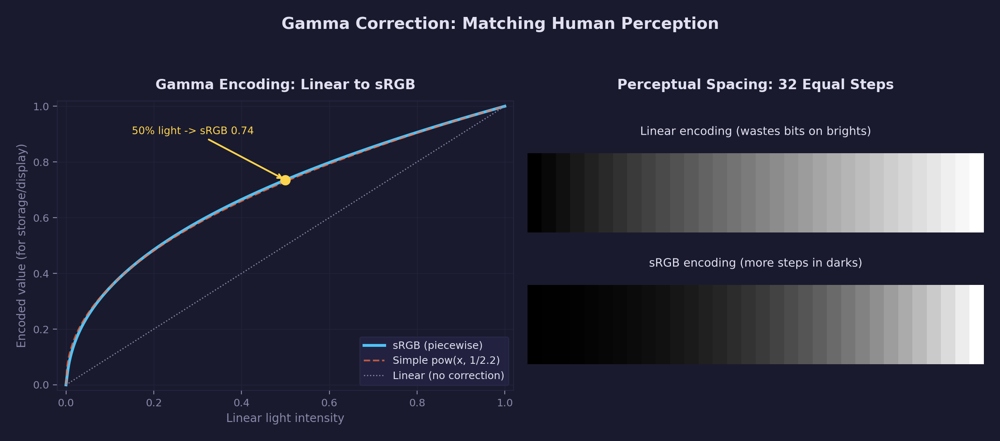
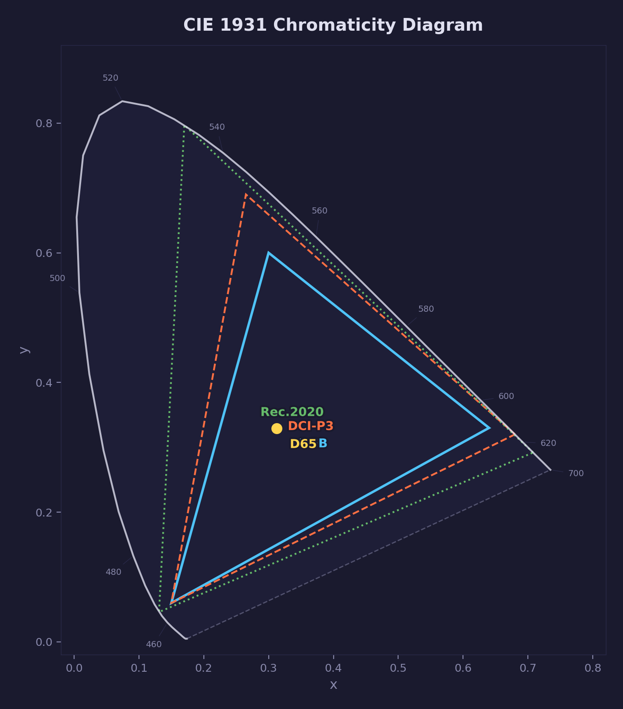
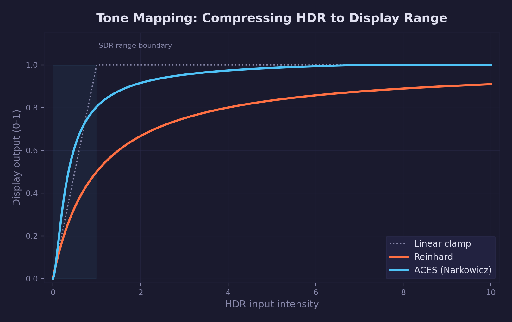

# Math Lesson 11 — Color Spaces

How computers represent, convert, and display color — and why getting it
wrong makes your renderer look bad.

## What you'll learn

- **Gamma correction** — the sRGB transfer function and why it is not `pow(x, 2.2)`
- **Linear space** — why all lighting, blending, and interpolation must happen
  in linear light, and what goes wrong when it doesn't
- **Luminance** — perceptual brightness, the BT.709 coefficients, and why green
  dominates
- **RGB ↔ HSL** — decomposing color into hue, saturation, and lightness
- **RGB ↔ HSV** — decomposing color into hue, saturation, and value, and how it
  differs from HSL
- **CIE XYZ** — the device-independent reference color space (1931 standard
  observer)
- **CIE xyY chromaticity** — separating color from brightness on the
  chromaticity diagram
- **Gamut** — why some colors cannot be displayed on a given device, and how
  wide-gamut displays expand the range
- **Tone mapping** — compressing HDR intensities to displayable range (Reinhard,
  ACES)
- **Exposure** — photographic stops (EV) and the HDR rendering pipeline

## Result

The demo program walks through each concept with computed values, round-trip
accuracy tests, and practical comparisons.

**Example output (abbreviated):**

```text
=============================================================
  Math Lesson 11 -- Color Spaces
=============================================================

1. GAMMA CORRECTION: sRGB Transfer Function
--------------------------------------------------------------

  The sRGB standard uses a PIECEWISE transfer function:
    Near black (<=0.04045): linear segment (s / 12.92)
    Rest:                   power curve ((s+0.055)/1.055)^2.4

  sRGB value   sRGB->linear pow(x,2.2)   Difference
  ----------   -----------  ---------    ----------
  0.0000       0.0000       0.0000       +0.0000
  0.0100       0.0008       0.0000       +0.0007
  0.0404       0.0031       0.0009       +0.0023
  0.1000       0.0100       0.0063       +0.0037
  0.2000       0.0331       0.0290       +0.0041
  0.5000       0.2140       0.2176       -0.0036
  0.7350       0.4995       0.5080       -0.0085
  0.9000       0.7874       0.7931       -0.0057
  1.0000       1.0000       1.0000       +0.0000

3. LUMINANCE: How Bright Does Each Color Look?
--------------------------------------------------------------

  Color                     Luminance  Relative
  -----                     ---------  --------
  Pure red   (1,0,0)        0.2126     21.3      %
  Pure green (0,1,0)        0.7152     71.5      %
  Pure blue  (0,0,1)        0.0722     7.2       %
  Yellow     (1,1,0)        0.9278     92.8      %
  White      (1,1,1)        1.0000     100.0     %

7. CIE xyY: Chromaticity Coordinates
--------------------------------------------------------------

  Color            Computed (x,y)  Expected (x,y)  Match?
  Red primary      (0.6400,0.3300)  (0.6400,0.3300)  [OK]
  Green primary    (0.3000,0.6000)  (0.3000,0.6000)  [OK]
  Blue primary     (0.1500,0.0600)  (0.1500,0.0600)  [OK]
  D65 white        (0.3127,0.3290)  (0.3127,0.3290)  [OK]

9. TONE MAPPING: HDR to Display Range
--------------------------------------------------------------

  Input       Reinhard      ACES          Linear clamp
  0.1         0.0909        0.1258        0.1000
  0.5         0.3333        0.6163        0.5000
  1.0         0.5000        0.8038        1.0000
  4.0         0.8000        0.9734        1.0000
  16.0        0.9412        1.0000        1.0000
```

## Key concepts

- **Linear light** — Physical light intensity where doubling the value means
  doubling the photons. All math (lighting, blending, interpolation) belongs
  here.
- **sRGB** — A perceptual encoding that redistributes precision to match human
  vision. More steps in the darks (where we see banding), fewer in the brights
  (where we cannot tell the difference).
- **Transfer function** — The mathematical curve that converts between linear
  and encoded values. sRGB uses a piecewise function, not a simple power law.
- **Luminance** — A single number describing how bright a color appears to a
  human observer, weighted by the eye's spectral sensitivity
  ( $Y = 0.2126R + 0.7152G + 0.0722B$ ).
- **Chromaticity** — Color independent of brightness. The CIE xy diagram plots
  every visible color as a 2D point.
- **Gamut** — The subset of visible colors that a particular device can
  reproduce. On the chromaticity diagram, a display's gamut is the triangle
  formed by its red, green, and blue primaries.
- **Tone mapping** — A curve that compresses the infinite range of real-world
  light intensities $[0, \infty)$ into the displayable range $[0, 1]$.

## The Math

### Gamma correction and the sRGB transfer function

Monitors do not emit light linearly. If you send a pixel value of 0.5 to a
CRT, you do not get 50% of the maximum brightness — you get roughly 22%. This
is because CRT phosphors have a power-law response with an exponent around 2.2.

The **sRGB standard** defines a transfer function to compensate. It is often
approximated as $\gamma = 2.2$, but the actual specification uses a
**piecewise function** with a linear segment near black:

**Encoding** (linear → sRGB, for storage/display):

$$
\text{sRGB}(x) = \begin{cases} 12.92 \cdot x & x \le 0.0031308 \\ 1.055 \cdot x^{1/2.4} - 0.055 & x > 0.0031308 \end{cases}
$$

**Decoding** (sRGB → linear, for computation):

$$
\text{linear}(s) = \begin{cases} s / 12.92 & s \le 0.04045 \\ \left(\frac{s + 0.055}{1.055}\right)^{2.4} & s > 0.04045 \end{cases}
$$

The linear segment exists because a pure power curve has an infinite derivative
(slope) at zero. The linear segment avoids numerical instability and makes the
curve continuously differentiable at the junction point.

### Why linear space matters

The most common color mistake in real-time graphics is doing math in the wrong
space. When you blend, interpolate, or light colors, you are computing physical
quantities — and physics is linear.

**Example: averaging black and white.**

- Averaging sRGB values directly: $(0 + 1) / 2 = 0.5$ sRGB, which decodes to
  linear 0.214 — only 21% of the light
- Averaging in linear space: $(0 + 1) / 2 = 0.5$ linear, which encodes to
  sRGB 0.735

The correct perceptual midpoint between black and white looks much brighter
than sRGB 0.5 on screen. If your renderer blends in sRGB, gradients will
appear too dark in the midtones.

**The rule:** Convert sRGB inputs to linear on load. Do all math in linear.
Convert back to sRGB only for the final display output.

### Human perception and luminance

The human visual system does not respond equally to all wavelengths. We are
most sensitive to green (around 555 nm, near the peak of the solar spectrum),
moderately sensitive to red, and least sensitive to blue. The **BT.709/sRGB
luminance coefficients** quantify this:

$$
Y = 0.2126 \cdot R + 0.7152 \cdot G + 0.0722 \cdot B
$$

These coefficients come from the CIE 1931 standard observer — a set of
color-matching experiments conducted in the 1920s that measured how average
human observers perceive color. The Y value in the CIE XYZ color space
is defined to equal luminance, which is why the second row of the
sRGB-to-XYZ matrix contains exactly these coefficients.

Green alone ( $Y = 0.715$ ) is brighter than red and blue combined
( $0.213 + 0.072 = 0.285$ ). This is why green-channel noise is the most
visible, and why luminance-preserving color operations weight green so heavily.



The diagram above shows how sRGB gamma encoding redistributes precision. The
human visual system responds roughly logarithmically to light intensity —
we can distinguish far more steps between 0% and 10% brightness than between
90% and 100%. sRGB encoding matches this by mapping the first 10% of light
intensity across roughly 35% of the 8-bit range (about 89 out of 255 levels).

Without this encoding, 8-bit images would show visible **banding** in dark
regions — staircase-like jumps where smooth gradients should be.

### HSL: Hue, Saturation, Lightness

HSL decomposes an RGB color into three axes that match how artists think about
color:

- **Hue (H):** Position on the color wheel (0–360°). Red is at 0°, green at
  120°, blue at 240°.
- **Saturation (S):** Vividness (0 = gray, 1 = fully saturated). Controls how
  far the color is from the gray axis.
- **Lightness (L):** How light or dark (0 = black, 0.5 = pure color, 1 = white).

The conversion identifies which 60° **sextant** (one of six equal segments of
the 360° color wheel) the hue falls in, based on which RGB channel is largest.
It then computes saturation and lightness from the range of channel values:

$$
L = \frac{\max(R,G,B) + \min(R,G,B)}{2}
$$

$$
S = \begin{cases} \frac{\Delta}{\max + \min} & L \le 0.5 \\ \frac{\Delta}{2 - \max - \min} & L > 0.5 \end{cases}
$$

where $\Delta = \max(R,G,B) - \min(R,G,B)$.

HSL is useful for UI color pickers and artistic adjustments (shift hue, reduce
saturation), but it is **not perceptually uniform**. A perceptually uniform
color space is one where a given numerical distance corresponds to the same
perceived difference anywhere in the space (CIELAB and OKLAB are examples).
HSL does not have this property — equal steps in L do not produce equal
perceived brightness changes.

### HSV: Hue, Saturation, Value

HSV is similar to HSL but defines brightness differently:

- **Value (V) = max(R, G, B)** — the intensity of the brightest channel
- **HSL lightness = (max + min) / 2** — the midpoint

This means:

| Color    | HSV (H, S, V)  | HSL (H, S, L)  |
|----------|----------------|-----------------|
| Red      | (0, 1.0, 1.0)  | (0, 1.0, 0.5)  |
| Dark red | (0, 1.0, 0.5)  | (0, 1.0, 0.25) |

HSV is common in color pickers (Photoshop, Unity, Unreal) because at S=1,
V=1 you get a vivid color at any hue, while HSL requires L=0.5 for the same.

### CIE XYZ: the device-independent reference

The CIE 1931 XYZ color space was created to encompass all visible colors in
a coordinate system where every component is non-negative. It serves as the
**universal translator** between color spaces.

The conversion from linear sRGB to XYZ is a 3×3 matrix multiplication. The
matrix is derived from two pieces of information:

1. **The chromaticity coordinates of the sRGB primaries** — where the monitor's
   red, green, and blue phosphors/LEDs sit on the chromaticity diagram
2. **The white point** — the color of "white" on the monitor (D65 = 6504K
   daylight)

$$
\begin{bmatrix} X \\ Y \\ Z \end{bmatrix} = \begin{bmatrix} 0.4124 & 0.3576 & 0.1805 \\ 0.2126 & 0.7152 & 0.0722 \\ 0.0193 & 0.1192 & 0.9505 \end{bmatrix} \begin{bmatrix} R \\ G \\ B \end{bmatrix}
$$

The second row is the luminance coefficients — this is not a coincidence.
CIE XYZ was designed so that Y equals luminance.

### CIE xyY: chromaticity coordinates

The chromaticity diagram separates **color** (hue + saturation) from
**brightness** by projecting XYZ onto the plane where $X + Y + Z = 1$:

$$
x = \frac{X}{X + Y + Z} \qquad y = \frac{Y}{X + Y + Z}
$$

The luminance $Y$ is carried along as a third coordinate, giving the full
**xyY** representation. Two colors with the same $(x, y)$ but different $Y$
are the same hue and saturation at different brightness levels.



The horseshoe-shaped boundary is the **spectral locus** — it traces the
chromaticity of monochromatic (single-wavelength) light from 380 nm (violet)
to 700 nm (red). The straight line connecting the two ends is the **purple
line** — purples are not spectral colors and can only be produced by mixing
red and blue light.

Every visible color falls inside this boundary. A display's **gamut** is the
triangle connecting its three primary chromaticities. The sRGB triangle is
relatively small; DCI-P3 and Rec.2020 are progressively larger, covering
more of the visible spectrum.

### Gamut

A **gamut** is the complete set of colors that a device can reproduce. On the
chromaticity diagram, it appears as a triangle (for RGB displays) whose
vertices are the red, green, and blue primary chromaticities.

When you convert a color from XYZ to a specific RGB space, the result may
have **negative or greater-than-one components**. This means the color lies
outside that RGB space's gamut — it physically cannot be produced by that
display.

| Gamut    | Red (x, y)      | Green (x, y)    | Blue (x, y)     |
|----------|-----------------|-----------------|-----------------|
| sRGB     | (0.640, 0.330)  | (0.300, 0.600)  | (0.150, 0.060)  |
| DCI-P3   | (0.680, 0.320)  | (0.265, 0.690)  | (0.150, 0.060)  |
| Rec.2020 | (0.708, 0.292)  | (0.170, 0.797)  | (0.131, 0.046)  |

Each wider gamut can reproduce more saturated colors. DCI-P3 covers roughly
25% more visible colors than sRGB, and Rec.2020 covers about 75% more. Modern
Apple displays, for instance, use the DCI-P3 gamut.

### Tone mapping

Real-world scenes have enormous **dynamic range** — the ratio between the
brightest and darkest visible detail. Sunlight can be 100,000× brighter than
a shadow. But an SDR (Standard Dynamic Range) display can only show values
from 0 to about 300 cd/m² (candelas per square meter, a unit of brightness
also called "nits"). **Tone mapping** compresses the infinite range of HDR
(High Dynamic Range) values into the displayable range.



**Linear clamp** — $\min(x, 1)$ — simply clips everything above 1.0 — all
highlights become pure white with no detail.

**Reinhard** maps $[0, \infty) \to [0, 1)$:

$$
\text{Reinhard}(x) = \frac{x}{x + 1}
$$

It preserves all detail but produces washed-out highlights with no
contrast in the bright end.

**ACES filmic curve** (Narkowicz 2015 approximation):

$$
f(x) = \frac{x(2.51x + 0.03)}{x(2.43x + 0.59) + 0.14}
$$

This is a rational polynomial (a ratio of two polynomial expressions) that
approximates the Academy Color Encoding System's Reference Rendering
Transform. It produces a natural, film-like response with a gentle
**shoulder** — the region of the curve where bright values are gradually
compressed toward white instead of clipping abruptly — and slightly lifted
blacks. This is the look audiences expect from cinema.

**AgX** is a more recent alternative to ACES that handles saturated colors
more gracefully, avoiding the oversaturation and hue shifts that ACES can
produce with very bright, vivid colors. It works by first compressing the
color into a log-encoded space, then applying a per-channel sigmoid curve.
GPU Lesson 21 (HDR & Tone Mapping) will cover AgX in practice.

### Exposure

Exposure adjustment simulates a camera's brightness control using
**photographic stops (EV)**:

$$
\text{output} = \text{input} \times 2^{EV}
$$

Each stop doubles ( $+1$ EV) or halves ( $-1$ EV) the light intensity. This
matches how photographers and cinematographers think about brightness — in
relative ratios, not absolute values.

The full HDR rendering pipeline is:

1. **Render** in linear HDR (floating-point render target)
2. **Expose** — multiply by $2^{EV}$ to set the overall brightness
3. **Tone map** — compress to $[0, 1]$ with Reinhard, ACES, or AgX
4. **Gamma encode** — convert linear $\to$ sRGB for the display

## Where it's used

Graphics and game programming uses color space math for:

- **sRGB textures** — GPU texture formats like `SDL_GPU_TEXTUREFORMAT_R8G8B8A8_UNORM_SRGB`
  automatically decode sRGB to linear on sample and encode linear to sRGB on
  write
- **Lighting calculations** — all lighting models (Blinn-Phong, PBR) must
  operate in linear space (see
  [GPU Lesson 10 — Basic Lighting](../../gpu/10-basic-lighting/) for
  Blinn-Phong)
- **Post-processing** — bloom, color grading, and tone mapping operate on
  linear HDR values
- **Color grading** — HSL/HSV adjustments for artistic control (saturation
  boost, hue shift)
- **HDR rendering** — rendering to floating-point targets, then tone mapping
  for display

**In forge-gpu lessons:**

- [GPU Lesson 02 — First Triangle](../../gpu/02-first-triangle/) uses an sRGB
  swapchain format, which automatically gamma-encodes output
- [GPU Lesson 10 — Basic Lighting](../../gpu/10-basic-lighting/) performs
  Blinn-Phong shading in linear space
- GPU Lesson 21 — HDR & Tone Mapping (planned) will use `color_tonemap_aces()`,
  `color_apply_exposure()`, and the full linear → tone map → sRGB pipeline

## Building

```bash
cmake -B build
cmake --build build --config Debug

# Windows
build\lessons\math\11-color-spaces\Debug\11-color-spaces.exe

# Linux / macOS
./build/lessons/math/11-color-spaces/11-color-spaces
```

The demo runs in the console and prints tables comparing color space
conversions, round-trip accuracy, and tone mapping curves.

## Exercises

1. **Gamma banding:** Write a small program that creates two 256-step grayscale
   gradients — one stored in linear, one in sRGB — and compare them visually.
   Where does the linear gradient show visible banding?

2. **Hue rotation:** Use `color_rgb_to_hsl()` to shift the hue of a color by
   180° (complementary color), then convert back. Verify the result makes
   sense (red → cyan, blue → yellow).

3. **Gamut mapping:** Convert a set of Rec.2020 primary colors to sRGB. Which
   ones produce negative RGB values? Implement a simple gamut-mapping strategy
   (desaturate toward white until all channels are non-negative).

4. **Tone map comparison:** Feed the same set of HDR values (0.1 through 100.0)
   through Reinhard and ACES. Plot the curves. At what input intensity does
   ACES clip to 1.0? How does Reinhard behave differently?

5. **Full pipeline:** Take an HDR color like (10.0, 5.0, 2.0), apply exposure
   at -2 EV, tone map with ACES, then gamma-encode for sRGB display. What
   final pixel values do you get? Try different exposure values and observe
   how the result changes.

## Further reading

- [GPU Lesson 02 — First Triangle](../../gpu/02-first-triangle/) — sRGB
  swapchain setup
- [GPU Lesson 10 — Basic Lighting](../../gpu/10-basic-lighting/) — lighting in
  linear space
- [Charles Poynton — Gamma FAQ](http://poynton.ca/GammaFAQ.html) — the
  definitive reference on gamma correction
- [Krzysztof Narkowicz — ACES Filmic Tone Mapping](https://knarkowicz.wordpress.com/2016/01/06/aces-filmic-tone-mapping-curve/) — the ACES fit used here
- [CIE 1931 Color Space (Wikipedia)](https://en.wikipedia.org/wiki/CIE_1931_color_space) — standard observer and chromaticity
