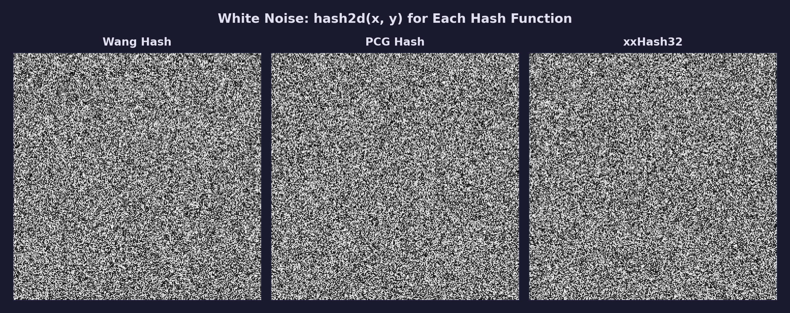
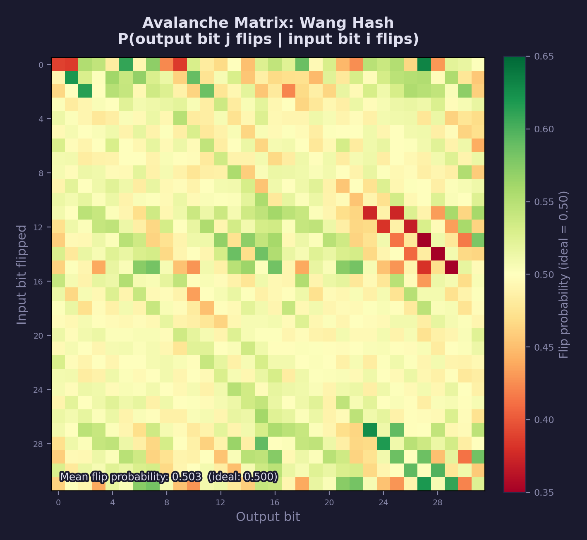
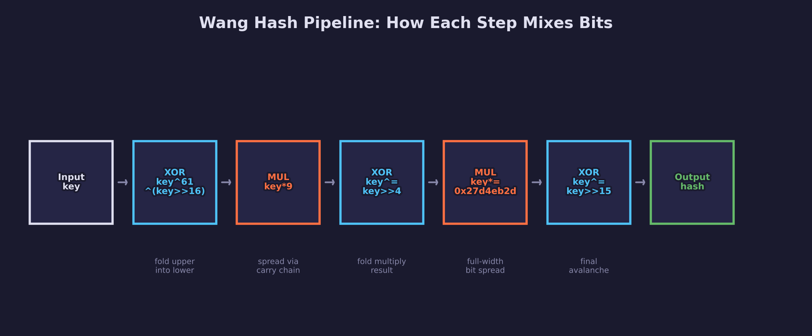
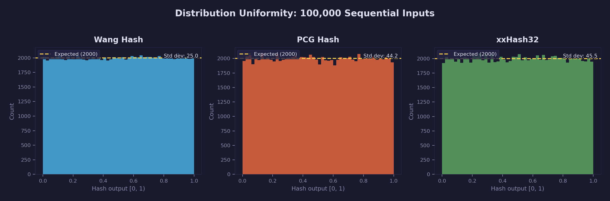

# Math Lesson 12 — Hash Functions & White Noise

Integer hashing for deterministic, reproducible randomness in GPU shaders.

## What you'll learn

- Why GPU shaders use hash functions instead of `rand()`
- How integer hash functions work (bitwise mixing to achieve the avalanche effect)
- Three common hash functions: Wang hash, PCG, and xxHash32 finalizer
- Where the key constants in hash functions come from
- How to convert hash output to uniform floats in [0, 1)
- How to seed hashes with position, time, and frame index for multi-dimensional
  noise
- What white noise is and how hashing generates it

## Result

The demo program walks through 10 sections covering hash function behavior,
quality analysis, and practical application patterns.

**Example output (abbreviated):**

```text
=============================================================
  Math Lesson 12 -- Hash Functions & White Noise
=============================================================

1. WHY HASHING: Deterministic Randomness for GPUs
--------------------------------------------------------------

  rand() uses shared mutable state — not usable on GPUs.
  Hash functions take an input and return a fixed output:
    hash(0) = 0xd86b048b  (same every time)
    hash(1) = 0xb1fd0798
    hash(2) = 0x3bfb0e68
  No state. No dependencies. Every thread computes independently.

5. AVALANCHE: One-Bit Input Change Flips ~16 Output Bits
--------------------------------------------------------------

  Wang hash avalanche analysis (4096 samples):
    Average bits changed: 15.98 / 32  (ideal = 16.00)

8. DISTRIBUTION: Uniformity of Hash-to-Float Conversion
--------------------------------------------------------------

  Bucket       Expected   Wang       PCG        xxHash32
  ------       --------   ----       ---        --------
  [0.0, 0.1)   10000      10015      9932       9935
  [0.1, 0.2)   10000      9963       10094      10045
  ...

10. WHITE NOISE: 2D Hash Visualization
--------------------------------------------------------------

  .,:;=+*#%@   (dark -> bright)

  Hashing every (x, y) coordinate with forge_hash2d produces
  a 60x30 ASCII "image" of white noise — the building block
  for structured noise like Perlin, blue noise, and dithering.
```



Each section builds on the previous, from basic determinism through avalanche
quality to practical multi-dimensional seeding and visualization.

## Key concepts

- **Deterministic hashing** — Same input always produces the same output, with
  no shared state. This makes hashing parallel-safe and reproducible.
- **Avalanche effect** — A single input bit change flips roughly half of the
  output bits. This is the core quality metric for a hash function.
- **Hash-to-float conversion** — Mapping 32-bit integers to uniform floats
  using the top 24 bits (matching float's mantissa precision).
- **Multi-dimensional seeding** — Combining spatial coordinates and time into
  a single hash seed using cascaded hashing.
- **White noise** — A signal where every sample is independent and uniformly
  distributed, containing equal energy at all frequencies.

## The Math

### Why hashing instead of rand()?

C's `rand()` maintains a global state variable. Each call mutates this state to
produce the next number in a pseudorandom sequence:

```text
state = state * 1103515245 + 12345;   // Linear Congruential Generator
return (state >> 16) & 0x7fff;
```

This has three problems for GPU use:

1. **Sequential dependency** — Each output depends on the previous state. You
   cannot compute the 1000th value without computing all 999 before it.
2. **Shared mutable state** — Thousands of GPU threads would need to read and
   write the same state variable simultaneously, causing race conditions.
3. **Non-reproducible** — Thread execution order varies between frames, so the
   same scene renders differently each time.

Hash functions solve all three problems. A hash takes an integer input
(pixel position, vertex ID, frame counter) and returns a pseudorandom output
with no state and no dependencies between invocations. Every GPU thread computes
its value independently.

### The avalanche effect

A good hash function has the **avalanche property**: changing a single bit of
the input changes approximately half of the output bits. For a 32-bit hash, that
means flipping one input bit should flip roughly 16 output bits.

Why does this matter? If nearby inputs (like adjacent pixel coordinates)
produced similar outputs, the noise pattern would show visible structure —
gradients, bands, or repetition. The avalanche effect destroys any such
correlation, making the output appear random even when the inputs are sequential.

The avalanche effect is measured with an **avalanche matrix**: for each pair of
input bit *i* and output bit *j*, compute the probability that flipping input
bit *i* flips output bit *j*. In a perfect hash, every entry in this matrix
would be exactly 0.5 (50%).



The heatmap above shows the Wang hash's avalanche matrix computed over 4,096
samples. Yellow (the dominant color) means the flip probability is near the
ideal 0.50. Red or green cells indicate slight bias — but the mean across all
1,024 bit pairs is very close to 0.50, confirming good avalanche quality.

### Wang hash

Thomas Wang published a family of integer hashes in 2007 using a
multiply-xor-shift structure. The variant used in this lesson is widely cited
in graphics programming.

The diagram below shows the full pipeline — each box is one operation,
alternating between XOR-shift (mixing) and multiply (spreading):



```c
uint32_t h = key;
h = (h ^ 61u) ^ (h >> 16);    /* fold upper bits into lower bits     */
h *= 9u;                       /* multiply by small odd number        */
h ^= h >> 4;                   /* mix bits from multiply              */
h *= 0x27d4eb2du;              /* multiply by large odd constant      */
h ^= h >> 15;                  /* final fold for full avalanche       */
```

Each step serves a purpose:

- **XOR with shifted self** (`h ^= h >> 16`): copies the upper half of the
  bits into the lower half. Without this, the lower bits would never be
  influenced by the upper bits.
- **Multiply by an odd constant** (`h *= 0x27d4eb2d`): a single multiply
  propagates every input bit to many output positions through carry chains.
  The constant must be odd — meaning it shares no common factor with $2^{32}$
  (which is a power of 2). Two numbers that share no common factor are called
  *coprime*, and coprimality guarantees the multiply is invertible (no two
  inputs map to the same output).

### PCG hash

The PCG (Permuted Congruential Generator) was introduced by Melissa O'Neill in
2014. The standalone hash version — as used in shader noise by Jarzynski & Olano
(JCGT, 2020) — applies the PCG output permutation to a single linear
congruential step:

```c
uint32_t state = input * 747796405u + 2891336453u;
uint32_t word  = ((state >> ((state >> 28) + 4)) ^ state) * 277803737u;
uint32_t hash  = (word >> 22) ^ word;
```

The distinguishing feature of PCG is the **data-dependent shift**: the amount
by which `state` is right-shifted depends on the top 4 bits of `state` itself
(`state >> 28` gives a value 0–15, plus the constant 4 gives shifts of 4–19).
This introduces non-linearity — the output depends on the input in a way that
cannot be expressed as a fixed sequence of arithmetic operations.

The multiplier 747,796,405 and increment 2,891,336,453 were selected by O'Neill
through statistical testing of the combined LCG-plus-permutation output quality.
The output multiplier 277,803,737 was chosen to complement the permutation.

### xxHash32 finalizer

Yann Collet's xxHash (2012) is a fast non-cryptographic hash designed for data
integrity checking in compression algorithms (LZ4, Zstandard). Its 32-bit
finalizer ensures full avalanche on the accumulated hash state:

```c
h ^= h >> 15;
h *= 0x85ebca77u;     /* PRIME32_2 = 2,246,822,519 */
h ^= h >> 13;
h *= 0xc2b2ae3du;     /* PRIME32_3 = 3,266,489,917 */
h ^= h >> 16;
```

This follows the same xor-shift-multiply pattern as MurmurHash3's finalizer
(Austin Appleby, 2008). The specific primes — PRIME32_2 and PRIME32_3 — were
found by Collet through automated search: testing large numbers of candidate
multipliers and selecting those with the lowest measured bias across all 32
output bits.

The shift amounts (15, 13, 16) were chosen so that after two rounds of
shift-xor-multiply, every output bit depends on every input bit. The first shift
(15) is close to half of 32, giving maximum initial mixing. The second (13) and
final (16) complete the avalanche.

### Where the key constants come from

Hash functions rely on specific constants. These are not arbitrary — each serves
a mathematical purpose.

**Large odd primes** (e.g., 0x27d4eb2d, 277803737, 0x85ebca77):

Multiplying by a large prime ensures that every input bit can influence every
output bit through carry propagation. The number must be **odd** — multiplying
by an even number always clears the lowest bit, losing information. Being
**prime** avoids periodic patterns that composite numbers can create. Being
**large** ensures the carries propagate across many bit positions rather than
staying local.

**The golden ratio constant** (0x9e3779b9):

This is $\lfloor 2^{32} / \varphi \rfloor$ where
$\varphi = (1 + \sqrt{5})/2 \approx 1.618$ is the golden ratio. The golden
ratio has a unique property among irrational numbers: its continued fraction
representation is $[1; 1, 1, 1, \ldots]$ — all ones. (A continued fraction
expresses a number as a nested sequence of integer-plus-reciprocal steps; the
smaller the integers, the harder the number is to approximate with simple
fractions.) This makes its rational approximations converge as slowly as
possible, which in turn means that when used
as an additive constant modulo $2^{32}$, it spreads values as evenly as possible
around the integer ring. It appears in `forge_hash_combine` for this reason.

**Xor-shift amounts** (>> 15, >> 13, >> 16):

Right-shifting and XORing folds the upper bits of a value into its lower bits.
A shift of $k$ bits means that output bit $i$ now depends on both input bit $i$
and input bit $i + k$. After two or three rounds with different shift amounts,
every output bit depends on every input bit. The amounts are chosen by testing
all combinations and measuring the resulting avalanche quality — there is no
closed-form formula for the optimal values.

**Computer-searched constants:**

Modern hash constants are found by automated search rather than mathematical
derivation. The process: generate millions of candidate multipliers (typically
large odd numbers), test each one using chi-squared goodness-of-fit tests and
avalanche matrix analysis, and keep the constants with the lowest measured bias.
The PCG multiplier, xxHash primes, and many other modern constants were refined
this way.

### Hash-to-float conversion

To use a hash as a "random" float in [0, 1), we convert the 32-bit integer:

```c
float f = (float)(h >> 8) * (1.0f / 16777216.0f);
```

The shift and divisor are not arbitrary. A 32-bit IEEE 754 float has 23 explicit
mantissa bits plus 1 implicit leading bit, giving **24 bits of integer
precision**. This means floats can represent every integer from 0 to
$2^{24} = 16{,}777{,}216$ exactly — but beyond that, consecutive integers round
to the same float value.

By right-shifting 8 bits (keeping the top 24), we produce a 24-bit integer in
[0, $2^{24}$). Dividing by $2^{24}$ maps this to one of 16,777,216
evenly-spaced float values in [0, 1), with no rounding gaps or duplicate
mappings.

Using all 32 bits (dividing by $2^{32}$) would not improve the distribution — it
would just cause groups of 256 consecutive hash values to round to the same
float, wasting 8 bits of hash quality.

The histogram below shows all three hash functions producing near-uniform
distributions when hashing 100,000 sequential integers:



For the signed variant [-1, 1), a simple rescaling suffices:

```c
float sf = f * 2.0f - 1.0f;
```

### Multi-dimensional seeding

Shader noise typically needs to hash 2D or 3D coordinates. The straightforward
approach — XOR the coordinates together and hash once — fails because XOR is
commutative: `hash(x ^ y)` gives the same result for (3, 5) and (5, 3).

The solution is **cascaded hashing**: hash each dimension separately and fold
the results together:

```c
uint32_t hash2d(uint32_t x, uint32_t y) {
    return hash(x ^ hash(y));
}
```

By hashing `y` before XORing with `x`, the symmetry is broken — the inner hash
transforms `y` into a pseudorandom value before combining with `x`, so
swapping the inputs produces different intermediate values.

For three dimensions (2D position + time):

```c
uint32_t hash3d(uint32_t x, uint32_t y, uint32_t z) {
    return hash(x ^ hash(y ^ hash(z)));
}
```

In a shader, the typical seeding pattern is:

- **Spatial noise**: `hash2d(pixel_x, pixel_y)` — same every frame (static)
- **Temporal noise**: `hash3d(pixel_x, pixel_y, frame_index)` — different each
  frame (animated)
- **Object noise**: `hash(vertex_id)` or `hash(instance_id)` — per-object
  variation (random color per instance, etc.)

### White noise

When you hash every pixel coordinate independently, the result is **white
noise** — a pattern where each sample is statistically independent of its
neighbors and uniformly distributed across [0, 1).

The name comes from an analogy with white light: just as white light contains
all wavelengths (frequencies) of visible light in roughly equal amounts, white
noise contains equal energy at all spatial frequencies. A frequency analysis
(decomposing the signal into its component sine waves — a technique called the
Fourier transform) of white noise shows a flat power spectrum — no frequency
dominates.


All three hash functions produce visually indistinguishable white noise when used
to hash 2D pixel coordinates. The patterns look like TV static — no structure,
no banding, no directional bias.

White noise on its own is rarely used directly in rendering (it looks like TV
static). But it is the **foundation** for structured noise:

- **Gradient noise** (Perlin, simplex): random gradients at integer lattice
  points, smoothly interpolated between them
  (see [Math Lesson 13 — Gradient Noise](../13-gradient-noise/))
- **Blue noise**: white noise with low-frequency content suppressed, reducing
  visible clumps
  (see [Math Lesson 14 — Blue Noise](../14-blue-noise/) when available)
- **Dithering**: adding small amounts of noise to break up color banding in
  gradients

## Where it's used

Graphics and game programming uses hash functions for:

- **Procedural textures** — noise-based materials (stone, wood, clouds)
- **Dithering** — breaking up color banding in gradients and tone mapping
- **Dissolve effects** — comparing hash output against a threshold to
  progressively reveal or hide geometry
- **Particle variation** — per-particle random color, size, or lifetime
  from `hash(particle_id)`
- **Instance variation** — per-instance random rotation, scale, or tint
  from `hash(instance_id)`

**In forge-gpu lessons:**

- [GPU Lesson 25 — Shader Noise](../../gpu/25-shader-noise/) will use these
  hash functions for white noise in fragment shaders (when available)
- [GPU Lesson 27 — SSAO](../../gpu/27-ssao/) will use noise textures for
  random sample rotation (when available)

## Building

```bash
cmake -B build
cmake --build build --config Debug

# Windows
build\lessons\math\12-hash-functions\Debug\12-hash-functions.exe

# Linux / macOS
./build/lessons/math/12-hash-functions/12-hash-functions
```

The demo prints 10 sections covering all the concepts above: hash function
outputs, avalanche analysis, distribution tests, multi-dimensional seeding,
and an ASCII white noise visualization.

## Exercises

1. **Compare avalanche quality**: Modify the avalanche demo to test PCG and
   xxHash32 instead of Wang hash. Which function gets closest to the ideal
   16.0 average bits changed?

2. **Frequency analysis**: Hash 10,000 sequential integers and compute the
   mean and variance of the float outputs. A uniform distribution on [0, 1)
   has mean = 0.5 and variance = 1/12 ≈ 0.0833. How close do the three hash
   functions get?

3. **Animated noise**: Modify the white noise visualization to take a "frame"
   parameter and use `forge_hash3d(x, y, frame)`. Run it for frames 0–4 and
   observe how the pattern changes while remaining deterministic.

4. **Tiling noise**: Hash `(x % tile_size, y % tile_size)` instead of `(x, y)`.
   The noise pattern will tile every `tile_size` pixels. Try tile sizes of 8,
   16, and 32.

## Further reading

- [Math Lesson 13 — Gradient Noise](../13-gradient-noise/) —
  builds on hash functions to create smooth, continuous noise
- [Math Lesson 14 — Blue Noise](../14-blue-noise/) (when available) —
  improving sample distribution by removing low-frequency clumps
- Jarzynski & Olano, "Hash Functions for GPU Rendering" (JCGT, 2020) — survey
  and comparison of hash functions suitable for shaders
- O'Neill, "PCG: A Family of Simple Fast Space-Efficient Statistically Good
  Algorithms for Random Number Generation" (2014) — the original PCG paper
