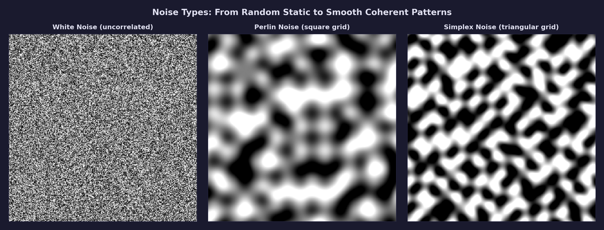
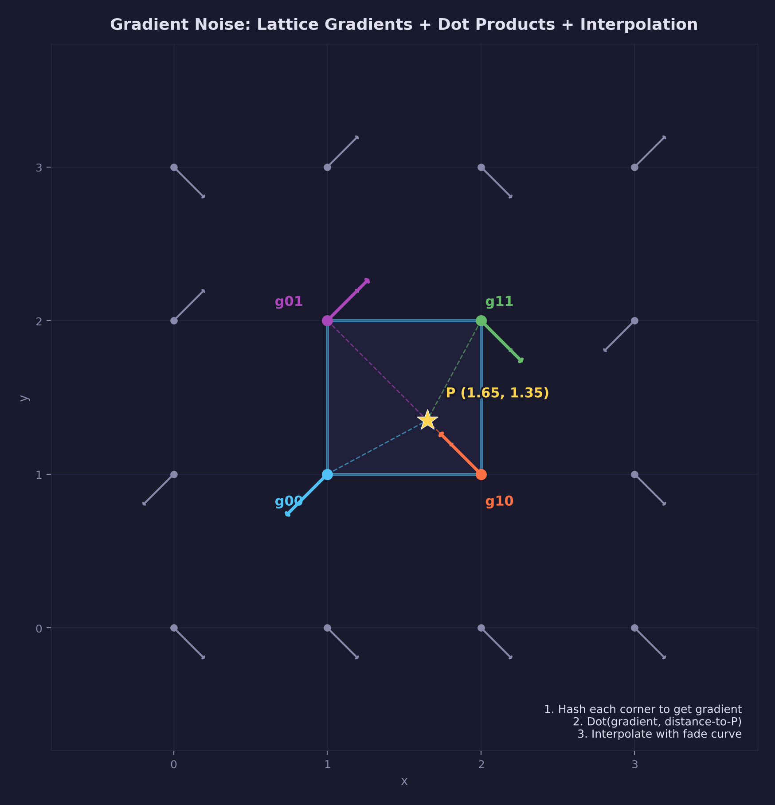
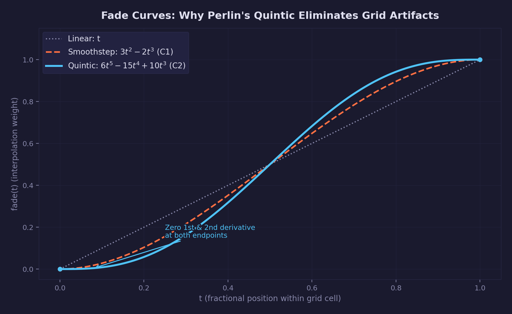
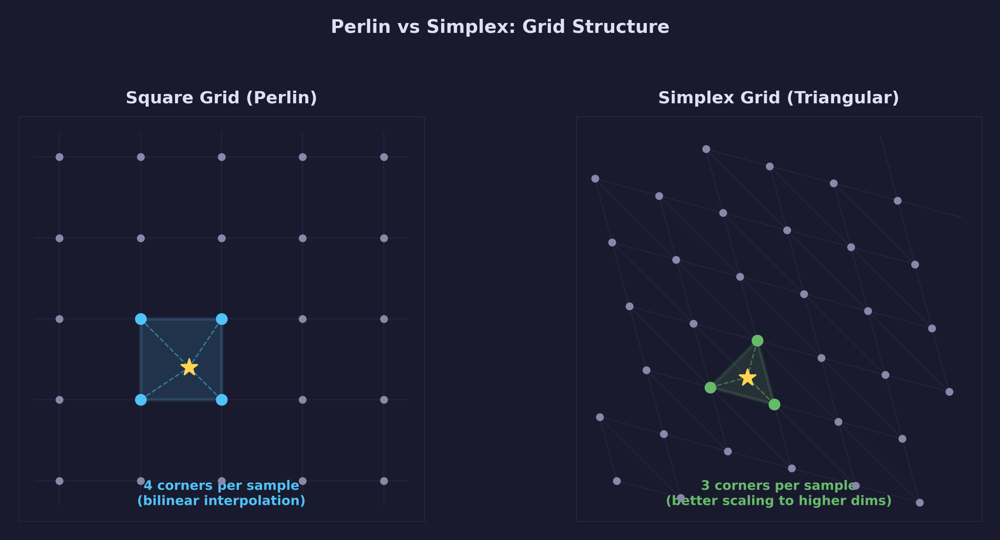
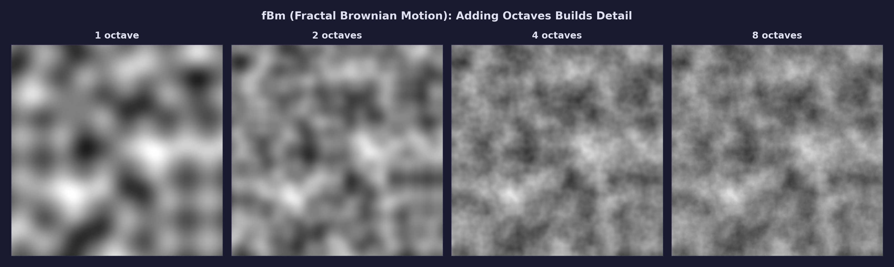
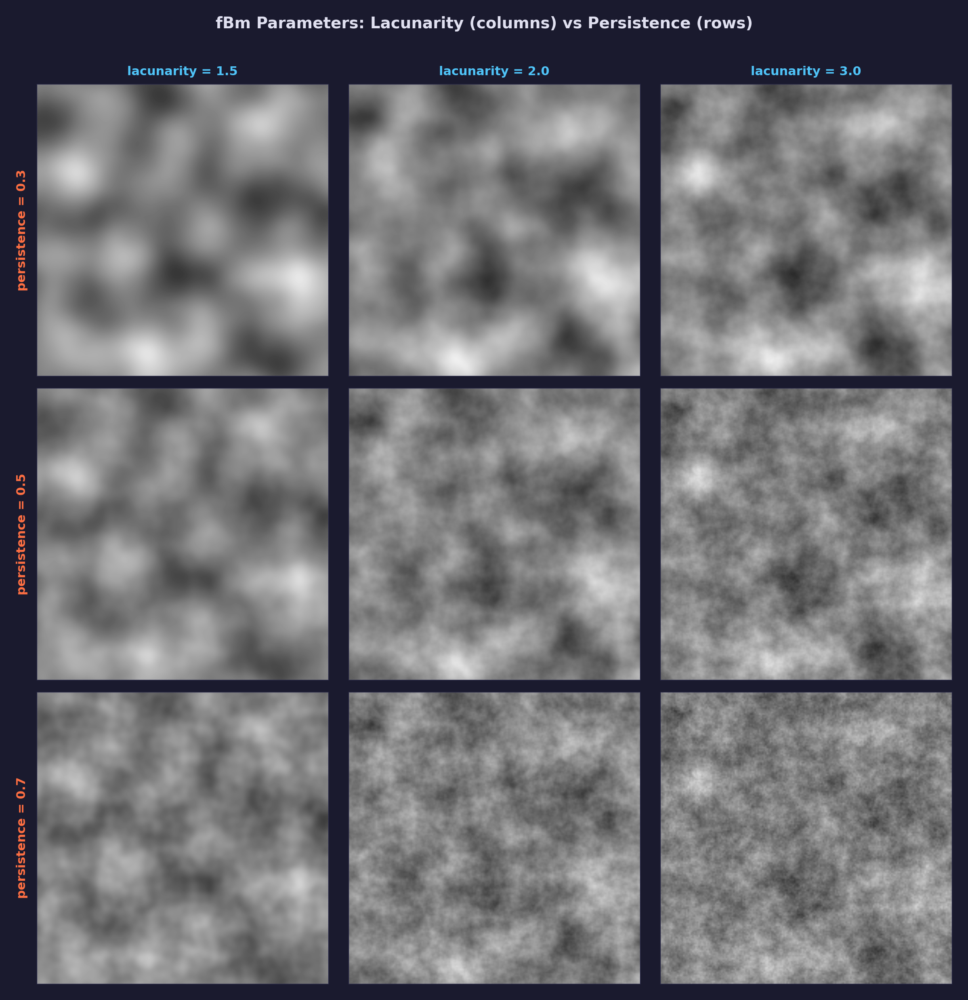
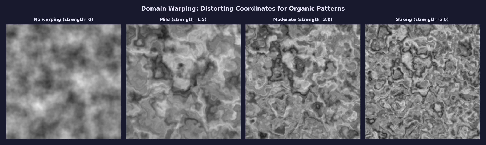

# Math Lesson 13 — Gradient Noise (Perlin & Simplex)

Lattice-based noise functions that produce smooth, continuous pseudorandom
patterns — the foundation of procedural generation in games and graphics.

## What you'll learn

- How gradient noise works: random gradients at grid points, dot products
  with distance vectors, smooth interpolation
- Perlin's improved noise (2002): the quintic fade curve and why it
  eliminates visible grid artifacts
- Simplex noise: the triangular grid, fewer samples, better isotropy
  (uniformity in all directions — no axis-aligned bias)
- Fractal Brownian motion (fBm): stacking octaves for multi-scale detail
- Lacunarity and persistence: how they control the character of fBm
- Domain warping: distorting coordinates for organic, fluid-like patterns

## Result

The demo program prints visualizations of each noise type as ASCII art,
showing the progression from white noise to gradient noise, fBm, and domain
warping.

**Example output (abbreviated):**

```text
=============================================================
  Math Lesson 13 -- Gradient Noise (Perlin & Simplex)
=============================================================

1. WHITE NOISE vs GRADIENT NOISE
--------------------------------------------------------------

  White noise (hash-based) has no spatial correlation:
  each sample is independent of its neighbors.

  Gradient noise (Perlin) produces smooth, continuous values:
  nearby inputs give nearby outputs.

3. FADE CURVES: Linear vs Cubic vs Quintic
--------------------------------------------------------------

  t       Linear      Cubic       Quintic
  ------  ----------  ----------  ----------
   0.00    0.000000    0.000000    0.000000
   0.10    0.100000    0.028000    0.028520
   0.20    0.200000    0.104000    0.115200
   0.30    0.300000    0.216000    0.262710
   0.50    0.500000    0.500000    0.500000
   0.70    0.700000    0.784000    0.737290
   0.80    0.800000    0.896000    0.884800
   0.90    0.900000    0.972000    0.971480
   1.00    1.000000    1.000000    1.000000
```



## Key concepts

- **Gradient noise** — Assigns random gradient vectors at integer lattice
  points and interpolates based on dot products with distance vectors.
  Produces smooth, continuous noise with no spatial frequency bias.
- **Fade curve (quintic smoothstep)** — The function
  $6t^5 - 15t^4 + 10t^3$ that ensures smooth interpolation between grid
  cells. Its zero first and second derivatives at the endpoints give C2
  continuity, eliminating visible seams.
- **Simplex noise** — Uses a triangular (simplex) grid instead of squares.
  Evaluates only N+1 gradient contributions per sample (3 in 2D, 4 in 3D)
  compared to Perlin's $2^N$ (4 in 2D, 8 in 3D).
- **fBm (fractal Brownian motion)** — Sums multiple octaves of noise at
  increasing frequencies and decreasing amplitudes. Produces natural-looking
  multi-scale detail.
- **Lacunarity** — The frequency multiplier between successive octaves
  (typically 2.0). Higher values create more separation between scales.
- **Persistence** — The amplitude multiplier between successive octaves
  (typically 0.5). Higher values give fine detail more influence.
- **Domain warping** — Distorts the input coordinates using noise before
  sampling more noise. Creates organic, flowing patterns.

## The Math

### From white noise to gradient noise

[Math Lesson 12 — Hash Functions](../12-hash-functions/) introduced white
noise: every sample is independent and uniformly distributed. White noise
looks like television static — useful as a building block, but too chaotic
for natural-looking patterns like terrain, clouds, or textures.

Gradient noise solves this by imposing spatial structure. The core
observation: if we assign random values at integer grid points and
interpolate between them, we get smooth transitions. But simple value
interpolation (assigning random *values* at grid points) produces bland,
pillowy patterns with visible grid alignment.

Ken Perlin's key insight (1985) was to assign random *gradients* (slopes,
directions) instead of random values, and compute contributions via dot
products. This produces richer patterns with zero crossings, ridges, and
valleys — all without the bias toward the grid axes that plagues value
noise.

### The gradient noise algorithm

The algorithm has four steps. Here is how it works in 2D:

**Step 1 — Find the grid cell.** Given a sample point $(x, y)$, find the
integer lattice cell containing it:

$$
ix = \lfloor x \rfloor, \quad iy = \lfloor y \rfloor
$$

The fractional position within the cell is:

$$
fx = x - ix, \quad fy = y - iy
$$

Both $fx$ and $fy$ are in $[0, 1)$.

**Step 2 — Assign gradients.** Hash each of the four corner coordinates
to select a gradient direction. The hash function
(from [Lesson 12](../12-hash-functions/)) provides deterministic
pseudorandom values. Each gradient is a unit-length direction vector.

In our implementation, we use four diagonal gradients:
$(1,1)$, $(-1,1)$, $(1,-1)$, $(-1,-1)$. All four have the same
magnitude ($\sqrt{2}$), ensuring consistent noise amplitude regardless
of which gradient is selected.

**Step 3 — Compute dot products.** For each corner, compute the dot
product between that corner's gradient and the vector from the corner
to the sample point:

$$
g_{00} = \vec{grad}_{00} \cdot (fx, fy)
$$

$$
g_{10} = \vec{grad}_{10} \cdot (fx - 1, fy)
$$

$$
g_{01} = \vec{grad}_{01} \cdot (fx, fy - 1)
$$

$$
g_{11} = \vec{grad}_{11} \cdot (fx - 1, fy - 1)
$$

These dot products measure how much the sample point "agrees" with each
corner's gradient direction. The result is positive when the point is
in the direction the gradient points, negative when opposite, and zero
when perpendicular.

**Step 4 — Interpolate.** Use the fade curve (see next section) to
compute smooth interpolation weights $u = \text{fade}(fx)$ and
$v = \text{fade}(fy)$, then bilinearly interpolate:

$$
\text{result} = \text{lerp}(\text{lerp}(g_{00}, g_{10}, u),
                             \text{lerp}(g_{01}, g_{11}, u), v)
$$



### The fade curve

The interpolation weight function is critical. Using linear interpolation
($\text{fade}(t) = t$) would produce visible seams at grid boundaries
because the first derivative of the interpolation is discontinuous there.

Perlin's original noise (1985) used a cubic smoothstep:

$$
\text{smoothstep}(t) = 3t^2 - 2t^3
$$

This has zero first derivative at $t = 0$ and $t = 1$ (C1 continuity),
which eliminates the visible seams. However, the *second* derivative is
still discontinuous at the grid boundaries. When computing lighting
normals from noise (which requires the gradient of the noise function),
C1 continuity is not enough — the derivative itself has visible kinks.

Perlin's improved noise (2002) replaced the cubic with a quintic:

$$
\text{fade}(t) = 6t^5 - 15t^4 + 10t^3
$$

This polynomial has zero first *and* second derivatives at both endpoints:

$$
\text{fade}'(0) = 0, \quad \text{fade}'(1) = 0
$$

$$
\text{fade}''(0) = 0, \quad \text{fade}''(1) = 0
$$

The result is C2 continuity — both the noise value and its gradient are
smooth everywhere, with no visible grid artifacts even in derivative-
dependent applications like normal-mapped terrain.



### Perlin's improved noise (2002)

Ken Perlin's "Improving Noise" paper (SIGGRAPH 2002) introduced two
changes to his original 1985 algorithm:

1. **The quintic fade curve** (described above) — provides C2 continuity
   instead of C1, eliminating second-derivative discontinuities.

2. **A better gradient set for 3D** — The original 1985 noise used
   random gradient vectors from the unit sphere. The improved version
   uses exactly 12 gradients pointing to the midpoints of the 12 edges
   of a cube:

   $(1,1,0)$, $(-1,1,0)$, $(1,-1,0)$, $(-1,-1,0)$,
   $(1,0,1)$, $(-1,0,1)$, $(1,0,-1)$, $(-1,0,-1)$,
   $(0,1,1)$, $(0,-1,1)$, $(0,1,-1)$, $(0,-1,-1)$

   These directions have good angular distribution and can be computed
   with bit manipulation (no lookup table needed), which Perlin encoded
   using just the low 4 bits of the hash value.

Our implementation uses hash functions from
[Lesson 12](../12-hash-functions/) instead of the traditional permutation
table. The hash approach is stateless (no 256-byte table to initialize),
supports arbitrary seeds, and gives equivalent quality.

### Simplex noise

Ken Perlin introduced simplex noise in 2001 as a successor to his
lattice-based gradient noise. The key change: replace the square grid
with a **simplex grid** — the simplest shape that tiles space in a given
dimension.

In 2D, the simplex is an equilateral triangle. In 3D, it is a
tetrahedron. The simplex grid has three advantages over the square grid:

**1. Fewer gradient evaluations.** A simplex in $N$ dimensions has $N+1$
vertices. In 2D, each sample evaluates 3 corners (vs 4 for Perlin). In
3D, 4 corners (vs 8). In higher dimensions the savings grow dramatically:
$N+1$ vs $2^N$.

**2. Better isotropy.** The triangular grid has no axis-aligned edges, so
simplex noise has less directional bias than Perlin noise. This is
particularly noticeable in terrain generation, where Perlin noise can
produce subtle grid-aligned ridges.

**3. Radial falloff kernel.** Instead of bilinear interpolation, simplex
noise uses a radial falloff around each vertex:

$$
\text{contribution} = \max(0, r^2 - d^2)^4 \cdot \text{grad} \cdot \vec{d}
$$

where $r^2 = 0.5$ and $d^2 = |\vec{d}|^2$ is the squared distance from
the vertex to the sample point. Each vertex's influence drops smoothly to
zero at a fixed radius, giving natural circular falloff.

#### The skewing method

The challenge with a triangular grid is determining which triangle
contains a given point. Perlin's solution: **skew** the input coordinates
so that the equilateral triangle grid maps to a grid of right triangles
aligned with integer coordinates, making the lookup trivial.

The skew factor for 2D is:

$$
F_2 = \frac{\sqrt{3} - 1}{2} \approx 0.366
$$

This transforms equilateral triangles into right triangles on a square
grid. After finding the cell, we determine which of the two triangles
(upper-left or lower-right) contains the point by checking whether
$x_0 > y_0$.

The unskew factor reverses the transformation:

$$
G_2 = \frac{3 - \sqrt{3}}{6} \approx 0.211
$$



### Fractal Brownian motion (fBm)

A single layer of Perlin or simplex noise produces smooth blobs at a
single spatial frequency. Natural patterns (terrain, clouds, coastlines)
have detail at *many* scales simultaneously — mountains have ridges, which
have boulders, which have pebbles.

Fractal Brownian motion (fBm) creates multi-scale detail by summing
multiple "octaves" of noise, each at a higher frequency and lower
amplitude:

$$
\text{fBm}(p) = \sum_{i=0}^{n-1} a^i \cdot \text{noise}(f^i \cdot p)
$$

where $a$ is the persistence (amplitude ratio, typically 0.5) and $f$ is
the lacunarity (frequency ratio, typically 2.0).

Each octave adds detail at a finer scale:

| Octave | Frequency | Amplitude | What it adds |
|--------|-----------|-----------|--------------|
| 0 | 1x | 1.0 | Large shapes (continents, mountain ranges) |
| 1 | 2x | 0.5 | Medium features (valleys, hills) |
| 2 | 4x | 0.25 | Small details (rocks, bumps) |
| 3 | 8x | 0.125 | Fine texture (pebbles, roughness) |

The name "fractal Brownian motion" comes from the mathematical connection
to Brownian motion (random walks). When you decompose fBm into its
component frequencies (via Fourier analysis — see
[Lesson 12](../12-hash-functions/) for the frequency perspective on
noise), the energy at each frequency follows a **power law**: higher
frequencies have proportionally less energy, with the ratio controlled by
persistence. Lower persistence gives smoother terrain (less energy at
high frequencies), higher persistence gives rougher terrain.



### Lacunarity and persistence

These two parameters control the character of fBm:

**Lacunarity** ($f$) — The frequency multiplier between successive
octaves. A lacunarity of 2.0 means each octave has double the frequency
of the previous one (the standard "octave" in the musical sense). Higher
lacunarity values create more visual separation between the scales of
detail; lower values blend them more smoothly.

**Persistence** ($a$) — The amplitude multiplier between successive
octaves. A persistence of 0.5 means each octave has half the amplitude
of the previous one. This controls how much influence fine detail has
relative to large-scale structure:

- **Low persistence (0.3):** Smooth, dominated by large features. Fine
  detail is barely visible.
- **Medium persistence (0.5):** Balanced, natural look. This is the most
  commonly used value.
- **High persistence (0.7):** Rough and detailed. Fine-scale features
  compete with large-scale structure.

The relationship between lacunarity and persistence determines the
**fractal dimension** of the noise — a measure of how much detail appears
at each scale. A higher fractal dimension means the noise retains more
fine-scale structure (it fills more of the space), while a lower fractal
dimension produces smoother results where large-scale features dominate.
In terrain generation, typical values are lacunarity = 2.0 and
persistence = 0.5, but these are starting points — the right values depend
on the visual effect you want.



### Domain warping

Domain warping distorts the input coordinates before sampling noise,
producing organic, fluid-like patterns that are difficult to achieve with
fBm alone. The method is straightforward:

1. Sample fBm at $(x, y)$ with seed $s$ to get a horizontal offset $w_x$
2. Sample fBm at $(x, y)$ with seed $s+1$ to get a vertical offset $w_y$
3. Sample fBm at the warped position
   $(x + k \cdot w_x, \; y + k \cdot w_y)$ with seed $s+2$

The parameter $k$ (warp strength) controls how much distortion to apply.
Values around 1.0–4.0 produce interesting results; higher values create
more extreme distortion.

This method was popularized by Inigo Quilez and is used for marble
textures, wood grain, lava flows, terrain with erosion features, and
many other procedural effects. The key insight is that using noise to
distort other noise creates feedback loops that produce organic-looking
swirls and filaments.



## Where it's used

Graphics and game programming uses gradient noise for:

- **Terrain generation** — fBm heightmaps for landscapes, with domain
  warping for erosion-like features
- **Cloud rendering** — 3D fBm sampled along view rays for volumetric
  clouds
- **Procedural textures** — Marble, wood, stone, lava, water surfaces
- **Animation** — Use the z-axis (or time) to animate 2D noise patterns
- **Normal map perturbation** — Add noise to surface normals for
  roughness
- **Particle effects** — Domain warping for fire, smoke, fog, and fluid
  simulation

**In forge-gpu lessons:**

- [GPU Lesson 12 — Shader Grid](../../gpu/12-shader-grid/) uses
  procedural patterns in fragment shaders
- [Math Lesson 12 — Hash Functions](../12-hash-functions/) provides the
  hash building blocks used by gradient noise

## Building

```bash
cmake -B build
cmake --build build --config Debug

# Windows
build\lessons\math\13-gradient-noise\Debug\13-gradient-noise.exe

# Linux / macOS
./build/lessons/math/13-gradient-noise/13-gradient-noise
```

The demo prints ASCII visualizations of all noise types, showing the
progression from white noise to gradient noise, fBm, and domain warping.

## Exercises

1. **Animate 1D noise:** Use `forge_noise_perlin1d` with a time offset
   to create a smoothly varying signal. Print a waveform that scrolls
   across the screen.
2. **Height-based terrain coloring:** Use `forge_noise_fbm2d` to generate
   a heightmap, then assign ASCII characters based on height: `.` for
   water, `-` for beach, `*` for grass, `^` for mountains, `#` for peaks.
3. **Experiment with persistence:** Generate the same noise pattern with
   persistence values from 0.1 to 0.9 and observe how the roughness
   changes.
4. **Multi-level domain warping:** Apply domain warping twice — warp the
   coordinates, then warp the warped coordinates. What kind of patterns
   emerge?
5. **3D noise slice:** Generate a grid of `forge_noise_perlin3d` values
   at different z-slices. Print several slices to see how the 3D pattern
   varies through space.

## Further reading

- [Math Lesson 12 — Hash Functions](../12-hash-functions/) — The hash
  building blocks used by gradient noise
- [Perlin, K. "Improving Noise" (2002)](https://mrl.cs.nyu.edu/~perlin/paper445.pdf)
  — The improved noise paper with quintic fade and better gradients
- [Perlin, K. "Noise hardware" (2001)](https://www.csee.umbc.edu/~olano/s2002c36/ch02.pdf)
  — Introduction of simplex noise
- [Gustavson, S. "Simplex noise demystified" (2005)](https://weber.itn.liu.se/~stegu/simplexnoise/simplexnoise.pdf)
  — Clear mathematical explanation of simplex noise
- [Quilez, I. "Domain Warping"](https://iquilezles.org/articles/warp/)
  — The definitive article on domain warping techniques
