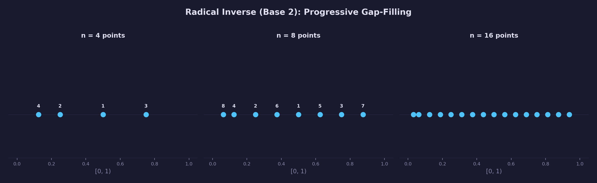
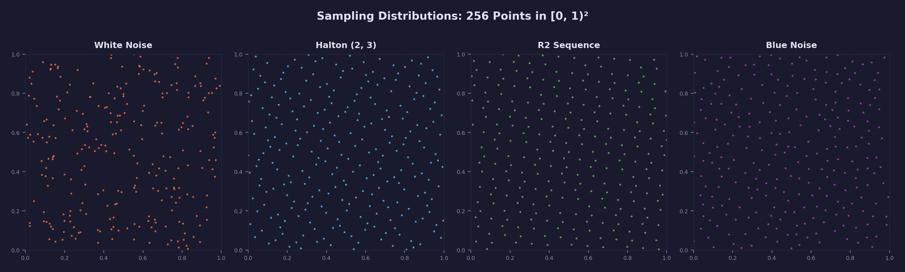
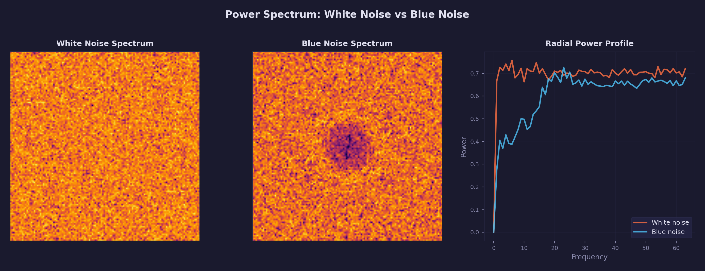
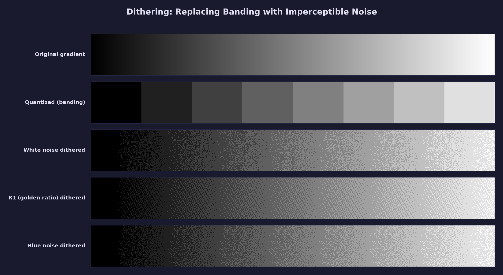

# Math Lesson 14 — Blue Noise & Low-Discrepancy Sequences

Why random sampling produces clumps and gaps, and how low-discrepancy
sequences and blue noise solve this for rendering.

## What you'll learn

- Why uniform random sampling distributes points unevenly (clumping)
- What **discrepancy** means and how it measures sampling quality
- **Blue noise** — a point distribution with energy concentrated away from
  low frequencies, producing visually even spacing
- How to **generate blue noise** with Mitchell's best candidate algorithm
- **Low-discrepancy sequences** — Halton, Sobol, and R2 — that fill space
  more uniformly than random sampling
- How the **radical inverse** operation constructs the Halton sequence
- How the **plastic constant** and **golden ratio** produce optimal additive
  recurrences (R2 and R1)
- Applications: **dithering** (replacing banding with imperceptible noise),
  **sampling** (anti-aliasing, AO kernels), and **stippling**

## Result

The demo program runs in the console and shows:

1. Side-by-side ASCII plots of random vs low-discrepancy point distributions
2. Halton, R2, and Sobol sequence values with explanations
3. Blue noise vs random point placement
4. Discrepancy measurements comparing all sequences
5. Dithering, sampling, and stippling applications

## Key concepts

- **Discrepancy** — A measure of how uniformly a point set fills a region.
  Star discrepancy $D^*$ is the maximum gap between the fraction of points in
  any axis-aligned box and the box's area. Lower discrepancy means more uniform
  coverage
- **Low-discrepancy sequence** — A deterministic sequence with discrepancy
  $D^* \sim (\log N)^k / N$, much lower than random sampling's
  $D^* \sim \sqrt{\log N / N}$. Also called quasi-random sequences
- **Blue noise** — A spatial distribution where points maintain a minimum
  distance from each other. The power spectrum has suppressed low frequencies
  (no clumps) and energy at high frequencies (fine-scale variation only)
- **Radical inverse** — The operation of reversing the digits of an integer in
  a given base and placing them after the decimal point. This is the building
  block of the Halton sequence
- **Halton sequence** — Uses radical inverses in successive prime bases (2, 3,
  5, ...) to generate coordinates in N dimensions
- **R2 sequence** — An additive recurrence using constants derived from the
  plastic constant. The simplest and fastest high-quality 2D sequence
- **Sobol sequence** — Uses direction numbers (powers of two and XOR) for
  provably optimal discrepancy bounds in low dimensions
- **Dithering** — Adding controlled noise before quantization to replace
  visible banding with imperceptible grain

## The Math

### Why random sampling clumps

Uniform random sampling sounds like it should distribute points evenly, but it
does not. Each sample is placed independently, with no awareness of where
previous samples landed. By probability alone, some regions accumulate excess
points while others remain empty.

This is a consequence of the **birthday paradox** generalized to continuous
space: the probability of two random points being "close" grows much faster
than intuition suggests. With $N$ random points in a unit square, the expected
number of close pairs grows as $N^2$, while coverage only grows as $N$.

The result is visible in any scatter plot of random points: irregular clusters
and conspicuous voids. For rendering, this means:

- **Integration estimates** (anti-aliasing, ambient occlusion) converge slowly
  because some regions are oversampled and others undersampled
- **Dithering** with white noise produces visible clumps of similar error that
  the eye detects as grain patterns

### Discrepancy: measuring uniformity

**Star discrepancy** $D^*$ formalizes the intuition of "how far from uniform."
For a set of $N$ points in $[0,1)^d$, it is:

$$
D^*(P) = \sup_{u \in [0,1]^d} \left| \frac{|\{p \in P : p \in [0,u)\}|}{N} - \text{Vol}([0,u)) \right|
$$

In words: consider every axis-aligned box anchored at the origin. For each box,
compare the fraction of points inside it to the box's volume (its "expected"
fraction). The largest such gap is the star discrepancy.

- A perfect grid of $N$ points achieves $D^* \sim 1/N$
- Random points achieve $D^* \sim \sqrt{\log N / N}$ (slow improvement)
- Low-discrepancy sequences achieve $D^* \sim (\log N)^d / N$ (fast improvement)


The **Koksma-Hlawka inequality** connects discrepancy to integration error:

$$
\left| \frac{1}{N} \sum_{i=1}^{N} f(x_i) - \int f(x)\,dx \right| \leq V(f) \cdot D^*(P)
$$

where $V(f)$ is the variation of the integrand. This is why low-discrepancy
sequences converge faster in Monte Carlo rendering — lower discrepancy directly
translates to lower integration error.

### The Halton sequence



The Halton sequence constructs each coordinate using the **radical inverse**
in a different prime base. The radical inverse reverses the digits of an integer
and places them after the decimal point.

**Example in base 2:**

| Index | Binary | Reversed | Value |
|-------|--------|----------|-------|
| 1 | 1 | 0.1 | 0.5 |
| 2 | 10 | 0.01 | 0.25 |
| 3 | 11 | 0.11 | 0.75 |
| 4 | 100 | 0.001 | 0.125 |
| 5 | 101 | 0.101 | 0.625 |
| 6 | 110 | 0.011 | 0.375 |
| 7 | 111 | 0.111 | 0.875 |

Each new value lands in the midpoint of the largest remaining gap. After 2
samples you have {0.5, 0.25}, covering [0, 0.5) and [0.5, 1). After 4 samples,
every quarter is represented.

For 2D, the x-coordinate uses base 2 and the y-coordinate uses base 3:

$$
x_i = \phi_2(i), \quad y_i = \phi_3(i)
$$

where $\phi_b$ denotes the radical inverse in base $b$. Using coprime bases
ensures the 2D points don't fall on regular grid lines.

**Implementation** (from `forge_math.h`):

```c
float x = forge_halton(i, 2);  /* base-2 radical inverse */
float y = forge_halton(i, 3);  /* base-3 radical inverse */
```

### The R2 sequence

The R2 sequence is an **additive recurrence** — each new point is generated by
adding a fixed offset and taking the fractional part:

$$
x_n = \text{frac}(0.5 + n \cdot \alpha_1), \quad y_n = \text{frac}(0.5 + n \cdot \alpha_2)
$$

The constants $\alpha_1$ and $\alpha_2$ come from the **plastic constant**
$p \approx 1.3247$, the unique real root of $x^3 = x + 1$:

$$
\alpha_1 = 1/p \approx 0.7549, \quad \alpha_2 = 1/p^2 \approx 0.5698
$$

**Why the plastic constant?** In 1D, the golden ratio
$\phi = (1 + \sqrt{5})/2$ produces the most uniform additive recurrence (this
is the R1 sequence, also called the golden-ratio sequence). The golden ratio is
"most irrational" — its continued fraction expansion is all 1s, making it the
hardest number to approximate with rationals. The plastic constant is the 2D
generalization: it produces an additive recurrence in two dimensions with the
lowest achievable discrepancy.

R2 is the **simplest** high-quality 2D sequence: just a multiply, an add, and
a floor subtraction. No loops, no bit manipulation, no lookup tables.

**Implementation** (from `forge_math.h`):

```c
float x, y;
forge_r2(42, &x, &y);  /* 42nd R2 sample */
```

**R1 (1D variant):** For one-dimensional applications like dithering thresholds,
the R1 sequence uses the golden ratio conjugate $1/\phi \approx 0.6180$:

```c
float threshold = forge_r1(pixel_index);
```

### The Sobol sequence

Sobol sequences use **direction numbers** and XOR operations to construct
samples with provably optimal discrepancy bounds. The construction works
differently from Halton and R2:

1. **Dimension 1** uses Van der Corput base-2 — the same bit-reversal as
   Halton base-2, but computed with fast bit operations instead of a loop
2. **Dimension 2** uses direction numbers derived from a **primitive polynomial**
   over **GF(2)**

**GF(2)** (Galois Field of order 2) is the simplest finite field: it contains
only the elements {0, 1}, where addition is XOR and multiplication is AND. A
**primitive polynomial** over GF(2) is an irreducible polynomial whose roots
generate all non-zero elements of an extension field — this ensures the
direction numbers produce a maximally spread sequence. For dimension 2, the
primitive polynomial is $x + 1$, which gives direction numbers where each is
XORed with the previous, shifted right by one bit.

A **direction number** $v_i$ is a carefully chosen power-of-two fraction
that controls where the $i$-th bit of the index places its contribution in
$[0, 1)$. The XOR combination of direction numbers ensures that each new
sample bisects the space in a dimension-aware way — this is why XOR is the
right operation (it is addition in GF(2)).

The key property of Sobol is **stratification**: for any power-of-two count
$N = 2^k$, the first $N$ Sobol points exactly stratify the unit square into
$N$ equal sub-squares with one point each. For example, the first 4 Sobol
points always place exactly one point in each quadrant. No other sequence
family guarantees this.

**Implementation** (from `forge_math.h`):

```c
float x, y;
forge_sobol_2d(i, &x, &y);
```

### Blue noise

Blue noise is a **spatial** property, not a sequential one. Where
low-discrepancy sequences minimize discrepancy (how uniformly points fill
space), blue noise minimizes **perceptual artifacts** (how uniformly the eye
perceives the distribution).

The defining characteristic is the **power spectrum**: blue noise has
suppressed energy at low frequencies (no large-scale clumps) and energy
concentrated at high frequencies (fine-grain variation). The name comes from
the analogy with visible light — blue has high frequency.





#### Generating blue noise: Mitchell's best candidate

Mitchell's best candidate algorithm (1991) is a simple method that approximates
**Poisson disk sampling** — a distribution where no two points are closer than
a minimum distance $r$.

The algorithm:

1. Place the first point randomly
2. For each subsequent point, generate $m$ random candidates
3. For each candidate, compute the distance to its nearest existing neighbor
4. Keep the candidate with the **largest** nearest-neighbor distance

By always choosing the point that is farthest from all existing points, the
algorithm naturally produces a well-separated distribution. The quality
parameter $m$ (candidates per point) controls the trade-off between generation
speed and output quality. Values of 10–30 work well in practice.

**Implementation** (from `forge_math.h`):

```c
float px[256], py[256];
forge_blue_noise_2d(px, py, 256, 20, 42);
/* px[], py[] now contain 256 blue-noise-distributed points in [0, 1) */
```

The `forge_blue_noise_2d` function uses toroidal (wrapping) distance so the
resulting point set tiles seamlessly.

#### Other generation methods: void-and-cluster

Mitchell's best candidate is the method implemented in this lesson's math
library. For completeness, the **void-and-cluster** algorithm (Ulichney, 1993)
is worth knowing about — it generates blue noise **textures** (2D arrays of
threshold values) rather than point sets:

1. Start with a binary pattern (a sparse set of initial points)
2. Find the **largest void** (the point farthest from any initial point,
   weighted by a Gaussian) and insert a new point there
3. Find the **tightest cluster** (the point closest to its neighbors) and
   remove it, assigning it the lowest remaining rank
4. Repeat until all pixels have ranks

The result is a texture where thresholding at any value $t$ produces a blue
noise point set with $t \times N$ points. This property makes void-and-cluster
textures ideal for **ordered dithering** — different threshold levels produce
progressively denser blue noise patterns.

Void-and-cluster is more complex to implement than Mitchell's best candidate
but produces higher-quality results for texture generation. In practice, blue
noise textures are pre-computed offline and shipped as assets — see Christoph
Peters' [free blue noise textures](http://momentsingraphics.de/BlueNoise.html)
for ready-to-use resources.

### Low-discrepancy vs blue noise

Low-discrepancy sequences and blue noise solve different aspects of the
sampling problem:

| Property | Low-discrepancy (LDS) | Blue noise |
|---|---|---|
| **Goal** | Minimize integration error | Minimize perceptual artifacts |
| **Measure** | Star discrepancy $D^*$ | Power spectrum profile |
| **Deterministic** | Yes (index → point) | Generated stochastically |
| **Progressive** | Yes (add more points) | Fixed set (regenerate for more) |
| **Tiling** | Not inherently | Often tileable |
| **Best for** | Monte Carlo integration | Dithering, stippling |

In modern rendering, both are used:

- **LDS** for sample positions in integration tasks (anti-aliasing jitter,
  AO hemisphere samples, soft shadow rays)
- **Blue noise** for dithering and temporal noise (banding removal, TAA noise
  patterns, stochastic transparency)

## Applications

### Dithering: replacing banding with noise

When a smooth gradient is quantized to a limited number of levels (e.g., 8-bit
color = 256 levels), the result shows visible **banding** — sharp steps where
the gradient crosses a quantization threshold.



**Dithering** adds a small random offset before quantization. This randomizes
which side of the threshold each pixel falls on, replacing sharp bands with
fine grain. The key insight: the human visual system is far more sensitive to
structured patterns (bands) than to unstructured noise (grain).

The dithering formula for a value $v$ quantized to $L$ levels:

$$
q = \text{floor}\left(\left(v + \frac{n - 0.5}{L}\right) \times L\right) / L
$$

where $n$ is a noise value in $[0, 1)$.

**White noise dithering** works but produces visible clumps of similar error.
**Blue noise dithering** distributes the error evenly, producing grain that is
nearly imperceptible at normal viewing distances. **R1 dithering** (golden
ratio sequence) is the simplest approach for 1D gradients — each pixel uses a
different R1 value as its dither offset.

### Sampling: anti-aliasing and AO kernels

Monte Carlo rendering estimates pixel colors by averaging multiple samples.
The Koksma-Hlawka inequality (see [Discrepancy](#discrepancy-measuring-uniformity))
guarantees that low-discrepancy sequences produce lower integration error than
random sampling for the same number of samples.

**Anti-aliasing:** Instead of sampling at the pixel center, jitter sample
positions within the pixel using a low-discrepancy sequence. R2 or Halton
points provide better coverage than random jitter, especially at low sample
counts (4–16 samples per pixel).

**Ambient occlusion kernels:** AO computes how much of the hemisphere above
each surface point is occluded. The hemisphere must be sampled uniformly.
Using Halton or Sobol sample directions instead of random directions reduces
noise at any given sample count.

**Soft shadows:** Area light sources require multiple shadow rays per pixel.
Low-discrepancy sample positions on the light surface reduce the noise in
penumbra regions.

### Stippling: density-driven point placement

**Stippling** represents an image using dots of uniform size, varying only
their density. Darker regions get more dots; lighter regions get fewer. The
aesthetic depends on even dot spacing — clumped dots create visual artifacts.

Blue noise provides the ideal foundation: start with a blue noise point set
(evenly spaced), then accept or reject each point with probability proportional
to the image darkness at that location. The blue noise base ensures no clumping
even in transition regions.

## Where it's used

Graphics and game programming uses these techniques for:

- **Anti-aliasing** — Low-discrepancy sample positions within each pixel
- **Ambient occlusion** — Uniform hemisphere sampling with Halton or Sobol
- **Soft shadows** — Even sampling across area light sources
- **Dithering** — Blue noise or R1 sequences to eliminate color banding
- **Temporal anti-aliasing (TAA)** — Cycling through low-discrepancy jitter
  offsets across frames
- **Screen-space effects** — Blue noise textures for stochastic sampling
  (SSR, volumetric fog ray offsets)
- **Stippling and halftoning** — Non-photorealistic rendering
- **Procedural placement** — Object scattering (trees, rocks) without clumps

**In forge-gpu lessons:**

- [Lesson 12 — Hash Functions & White Noise](../12-hash-functions/) provides
  the hash functions used to generate random candidates
- [Lesson 13 — Gradient Noise](../13-gradient-noise/) builds on hash functions
  for coherent noise; blue noise is the spatial complement (even spacing vs
  smooth variation)
- [GPU Lesson 25 — Shader Noise](../../gpu/25-shader-noise/) (planned) will
  apply blue noise dithering and low-discrepancy sampling on the GPU

## Building

```bash
cmake -B build
cmake --build build --config Debug

# Windows
build\lessons\math\14-blue-noise-sequences\Debug\14-blue-noise-sequences.exe

# Linux / macOS
./build/lessons/math/14-blue-noise-sequences/14-blue-noise-sequences
```

The program outputs text to the console — no window is created.

## Exercises

1. **Extend to 3D:** Modify the Halton demo to generate 3D points using bases
   2, 3, and 5. Visualize slices of the point cloud at fixed z values. Compare
   with 3D random sampling.

2. **Convergence plot:** Write a program that estimates $\pi$ using the
   quarter-circle method (as in demo 8) with increasing sample counts.
   Plot the error vs N for random, Halton, R2, and Sobol. Verify that the
   low-discrepancy sequences converge roughly as $O(1/N)$ while random
   converges as $O(1/\sqrt{N})$.

3. **Blue noise texture:** Use `forge_blue_noise_2d` to generate a 64x64 array
   of points, then convert to a threshold texture where each pixel's value is
   its rank order (0 = first point placed, 255 = last). Apply this texture as
   an ordered dither pattern to an image.

4. **Stratified sampling:** Implement a stratified sampler that divides
   $[0,1)^2$ into an NxN grid and places one random point in each cell.
   Compare its discrepancy with Halton, R2, and pure random using
   `forge_star_discrepancy_2d`.

## Further reading

- [Math Lesson 12 — Hash Functions & White Noise](../12-hash-functions/) —
  The hash functions underlying all noise generation
- [Math Lesson 13 — Gradient Noise](../13-gradient-noise/) — Coherent noise
  for smooth procedural patterns
- Martin Roberts, [*The Unreasonable Effectiveness of Quasirandom Sequences*](http://extremelearning.com.au/unreasonable-effectiveness-of-quasirandom-sequences/)
  — The R2 sequence derivation
- Don Mitchell, [*Spectrally Optimal Sampling for Distribution Ray Tracing*](https://dl.acm.org/doi/10.1145/122718.122736) (SIGGRAPH 1991)
  — Mitchell's best candidate algorithm
- Robert Ulichney, *Digital Halftoning* (MIT Press, 1987) — Void-and-cluster
  and blue noise dithering theory
- Christoph Peters, [*Free Blue Noise Textures*](http://momentsingraphics.de/BlueNoise.html)
  — Pre-computed blue noise textures for rendering
