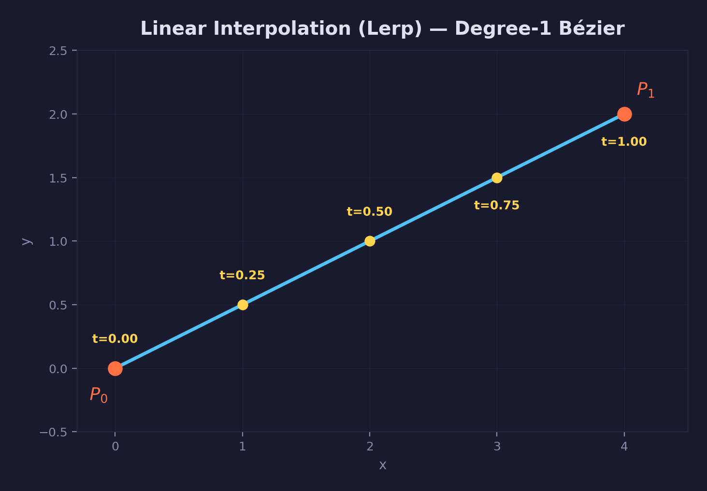
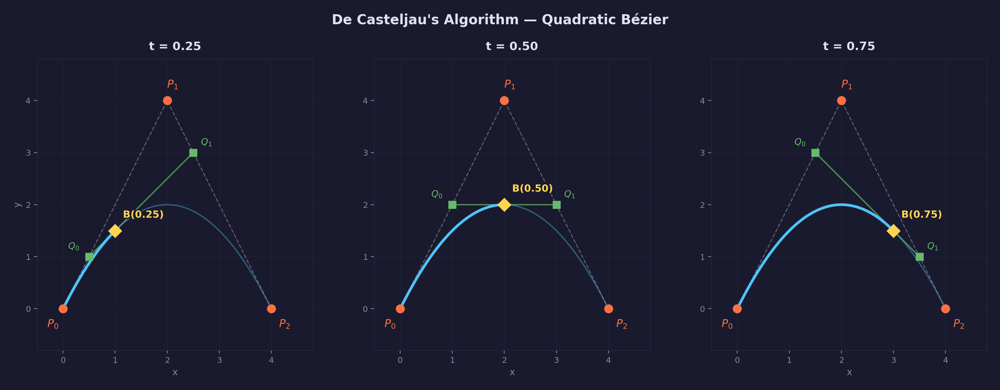
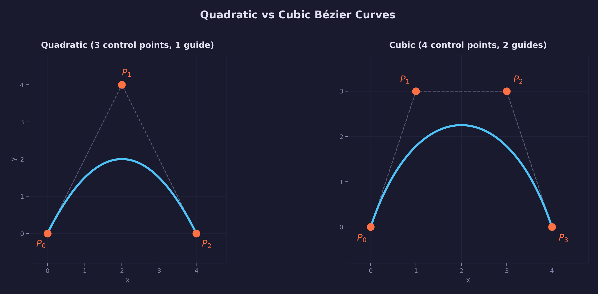
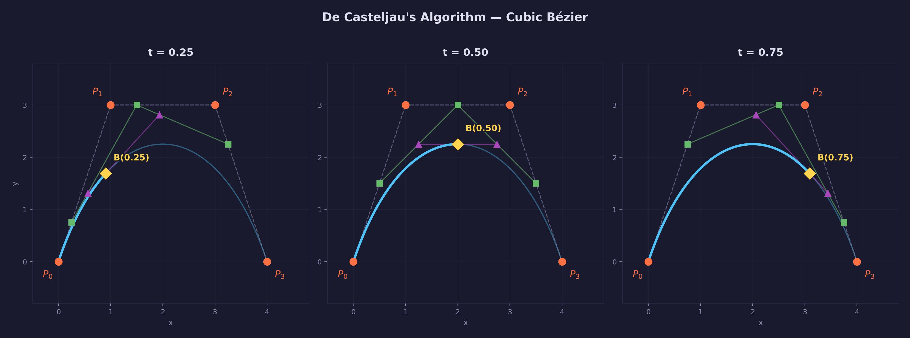
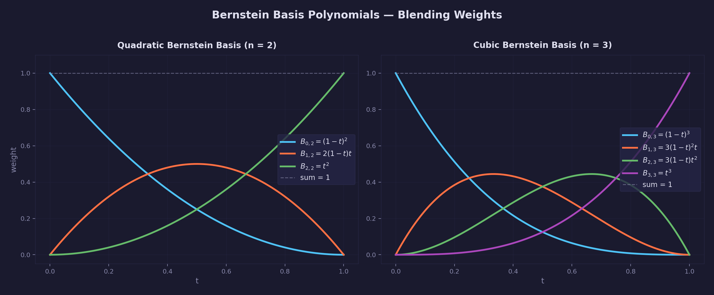
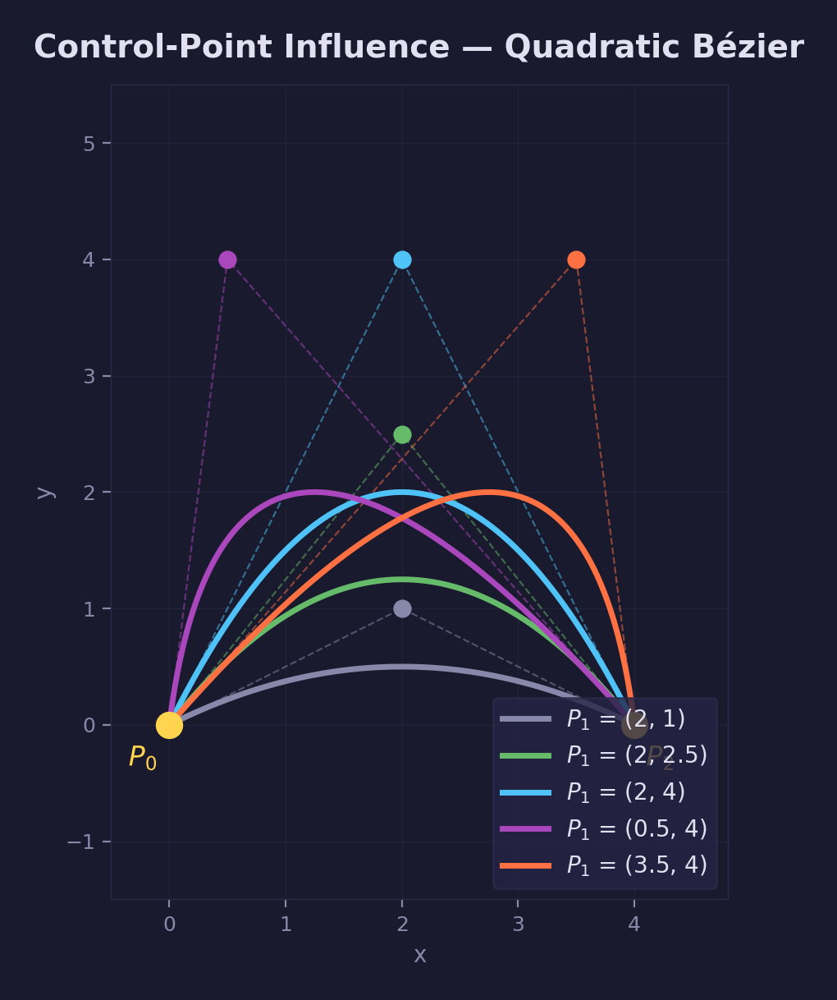
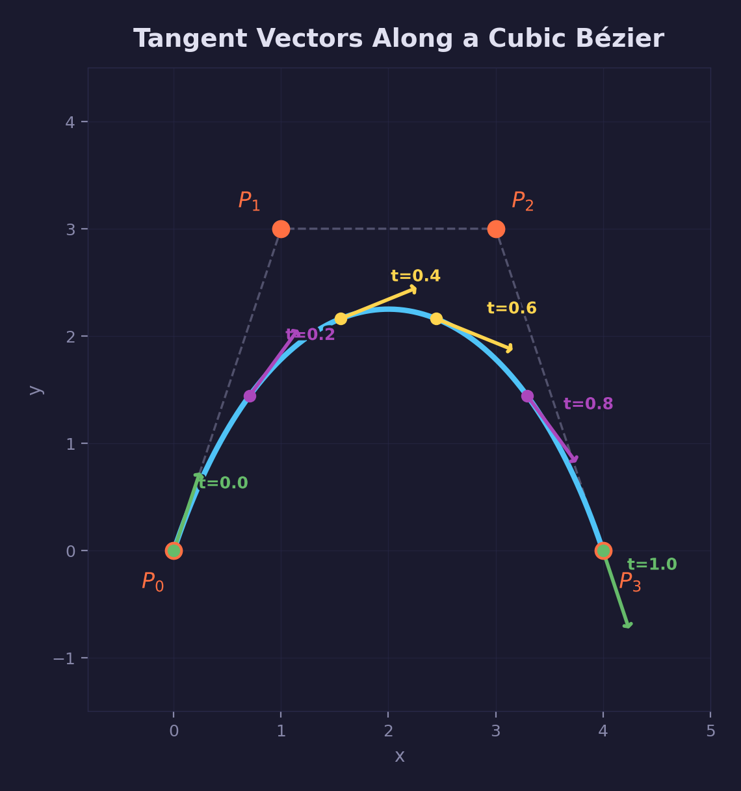
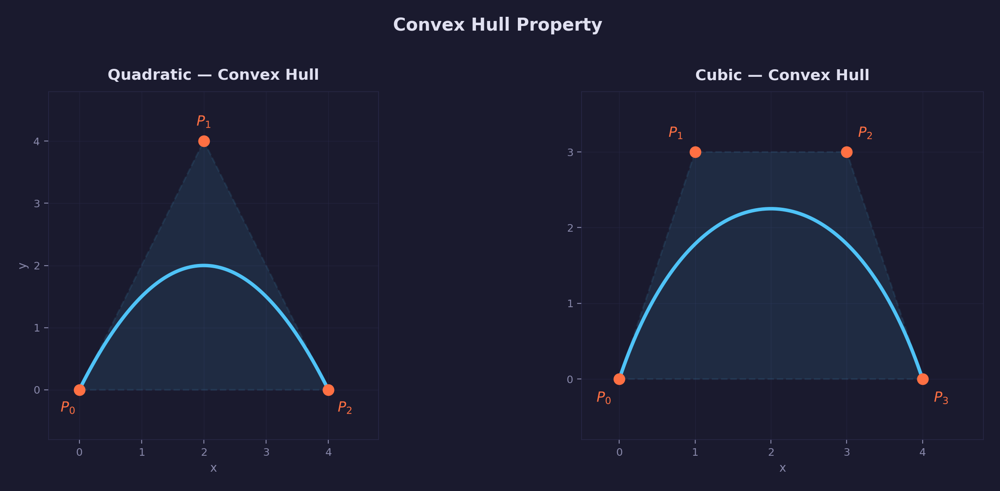
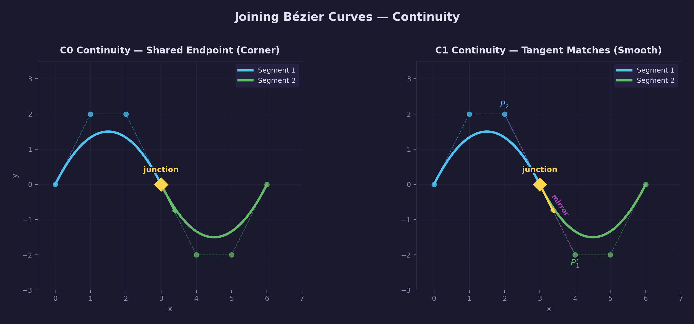
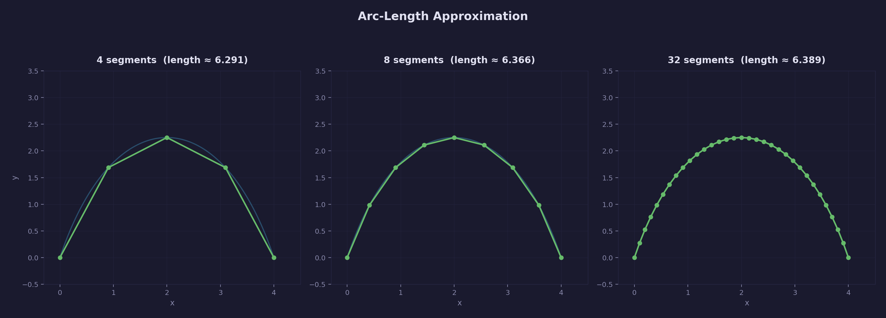

# Math Lesson 15 — Bézier Curves

Quadratic and cubic Bézier curves: the foundation of smooth curves in computer
graphics, font rendering, animation paths, and vector art.

## What you'll learn

- How linear interpolation (lerp) is the building block for all Bézier curves
- Quadratic Bézier curves (3 control points) and De Casteljau's algorithm
- Cubic Bézier curves (4 control points) and their additional flexibility
- Bernstein basis polynomials — the weighting functions behind Bézier curves
- Tangent vectors (first derivatives) for direction and motion along curves
- The convex hull property and why control points bound the curve
- How to join curves with C0 and C1 continuity for smooth paths
- Arc-length approximation by summing line segments
- Curve splitting via De Casteljau subdivision
- Degree elevation — converting quadratic curves to cubic form
- Adaptive flattening — converting curves to line segments for rendering

## Key concepts

- **De Casteljau's algorithm** — Evaluate any Bézier curve by repeatedly
  applying lerp. Quadratic = 2 rounds, cubic = 3 rounds. Also naturally
  produces subdivision (splitting) as a byproduct.
- **Control polygon** — The straight-line path connecting the control points
  in order. The curve "follows" this polygon but smooths out the corners.
- **Bernstein basis polynomials** — The weighting functions that determine how
  much influence each control point has at every parameter value t.
- **Endpoint interpolation** — The curve always passes through the first and
  last control points. Interior "guide" points pull the curve toward themselves
  but the curve does not pass through them (in general).
- **Tangent vector** — The first derivative $B'(t)$ gives the direction and
  speed of travel along the curve at parameter t.
- **Convex hull** — A Bézier curve always lies inside the convex hull of its
  control points. This is useful for bounding-box tests and collision detection.
- **Continuity (C0, C1)** — C0 means curves share an endpoint (position
  matches). C1 means the tangent also matches at the junction, producing a
  visually smooth join.
- **Adaptive flattening** — Recursively split a curve until each piece is flat
  enough to approximate with a line segment. This is how font renderers and
  vector graphics engines convert curves to pixels.

## Prerequisites

This lesson builds on concepts from earlier lessons:

- [Lesson 01 — Vectors](../01-vectors/): vector addition, subtraction,
  scaling, and the `vec2` type used throughout this lesson
- [Lesson 01 — Vectors](../01-vectors/): linear interpolation (lerp) —
  the single most important operation for understanding Bézier curves

## The Math

### Lerp — the foundation

Every Bézier curve is built from one operation: **linear interpolation**
(lerp). Given two points $A$ and $B$ and a parameter $t$ in $[0, 1]$:

$$
\text{lerp}(A, B, t) = A + t \cdot (B - A) = (1-t) \cdot A + t \cdot B
$$

When $t = 0$ the result is $A$; when $t = 1$ it is $B$; when $t = 0.5$ it is
the midpoint. A straight line segment is itself a degree-1 Bézier curve — just
one lerp.



### Quadratic Bézier curve (degree 2)

A **quadratic Bézier curve** uses three control points:

- $P_0$ — the **start point** (the curve passes through here at $t=0$)
- $P_1$ — the **guide point** (pulls the curve toward itself)
- $P_2$ — the **end point** (the curve passes through here at $t=1$)

The guide point $P_1$ influences the curvature — it "attracts" the curve —
but the curve does not generally pass through it.

#### De Casteljau's algorithm (quadratic)

To find the point on the curve at parameter $t$, apply lerp twice:

**Round 1** — Lerp between adjacent control points:

$$
Q_0 = \text{lerp}(P_0, P_1, t)
$$

$$
Q_1 = \text{lerp}(P_1, P_2, t)
$$

**Round 2** — Lerp the results:

$$
B(t) = \text{lerp}(Q_0, Q_1, t)
$$

That is the entire algorithm. Two rounds of the same operation you already
know from [Lesson 01](../01-vectors/).



#### Explicit formula (quadratic)

Expanding the nested lerps gives the equivalent closed-form expression:

$$
B(t) = (1-t)^2 \, P_0 + 2(1-t)t \, P_1 + t^2 \, P_2
$$

The three coefficients — $(1-t)^2$, $2(1-t)t$, and $t^2$ — are the
**Bernstein basis polynomials** of degree 2 (see
[Bernstein basis polynomials](#bernstein-basis-polynomials) below).

### Cubic Bézier curve (degree 3)

A **cubic Bézier curve** uses four control points:

- $P_0$ — start point
- $P_1$ — first guide point (controls the departure direction from $P_0$)
- $P_2$ — second guide point (controls the arrival direction into $P_3$)
- $P_3$ — end point

Having two guide points instead of one gives you independent control over how
the curve leaves and arrives, making cubic Bézier curves much more versatile
than quadratic ones. This is why they are the standard in most vector graphics
formats (SVG, PostScript, OpenType CFF fonts).



#### De Casteljau's algorithm (cubic)

Three rounds of lerp instead of two:

**Round 1** — Lerp between adjacent pairs (3 lerps):

$$
Q_0 = \text{lerp}(P_0, P_1, t), \quad Q_1 = \text{lerp}(P_1, P_2, t), \quad Q_2 = \text{lerp}(P_2, P_3, t)
$$

**Round 2** — Lerp the results (2 lerps):

$$
R_0 = \text{lerp}(Q_0, Q_1, t), \quad R_1 = \text{lerp}(Q_1, Q_2, t)
$$

**Round 3** — Final lerp (1 lerp):

$$
B(t) = \text{lerp}(R_0, R_1, t)
$$

The pattern is always the same: start with $n$ control points, reduce by one
each round, until you reach a single point.



#### Explicit formula (cubic)

$$
B(t) = (1-t)^3 \, P_0 + 3(1-t)^2 t \, P_1 + 3(1-t) t^2 \, P_2 + t^3 \, P_3
$$

### Bernstein basis polynomials

The coefficients in the explicit Bézier formulas are called **Bernstein basis
polynomials**. For a degree-$n$ Bézier curve, the $i$-th basis polynomial is:

$$
B_{i,n}(t) = \binom{n}{i} (1-t)^{n-i} t^i
$$

where $\binom{n}{i}$ is the **binomial coefficient** — the number of ways to
choose $i$ items from $n$ items. It equals $\frac{n!}{i!(n-i)!}$ where $n!$
(read "$n$ factorial") means $n \times (n-1) \times \cdots \times 1$.

For the degrees we use:

- **Quadratic ($n=2$):** $\binom{2}{0}=1$, $\binom{2}{1}=2$,
  $\binom{2}{2}=1$
- **Cubic ($n=3$):** $\binom{3}{0}=1$, $\binom{3}{1}=3$,
  $\binom{3}{2}=3$, $\binom{3}{3}=1$

Each basis polynomial controls how much influence one control point has at
parameter $t$. Two important properties:

1. **Non-negative:** Every $B_{i,n}(t) \geq 0$ for $t \in [0,1]$
2. **Partition of unity:** They always sum to 1:
   $\sum_{i=0}^{n} B_{i,n}(t) = 1$

Together, these properties mean that the curve point is always a **weighted
average** of the control points — which is why the curve always lies inside
their convex hull.



### Control-point influence

Moving a guide point reshapes the curve. The guide point acts as an "attractor"
— the closer the curve's parameter brings it to that guide point's Bernstein
basis peak, the more the curve is pulled toward it.

- Raising a guide point pulls the curve higher
- Moving a guide point laterally shifts the peak of the curve
- The further a guide point is from the line connecting the endpoints, the
  more pronounced the curvature



### Tangent vectors (first derivative)

The **tangent vector** $B'(t)$ is the first derivative of the curve with
respect to $t$. It tells you:

- The **direction of travel** along the curve at parameter $t$
- The **speed** of a point moving along the curve (the tangent's magnitude)

A **derivative** measures how a quantity changes. If the curve gives you a
position, its derivative gives you the rate of change of that position — the
velocity. Informally, $B'(t)$ answers "which way is the curve heading, and how
fast?"

For a **quadratic** Bézier:

$$
B'(t) = 2(1-t)(P_1 - P_0) + 2t(P_2 - P_1)
$$

For a **cubic** Bézier:

$$
B'(t) = 3(1-t)^2(P_1 - P_0) + 6(1-t)t(P_2 - P_1) + 3t^2(P_3 - P_2)
$$

At the endpoints:

- At $t=0$, the tangent points from $P_0$ toward $P_1$
- At $t=1$, the tangent points from $P_{n-1}$ toward $P_n$

This is why the first and last control-point pairs determine the curve's
departure and arrival directions.

The tangent is **not** unit-length. To get just the direction (a unit vector),
normalize it: `vec2_normalize(tangent)`. See
[Lesson 01 — Vectors](../01-vectors/) for normalization.



### Convex hull property

A **convex hull** is the smallest convex shape that encloses a set of points.
Think of it as stretching a rubber band around all the control points — the
shape the rubber band makes is the convex hull. A shape is **convex** if any
straight line between two points inside it stays entirely inside the shape (no
dents or concavities).

A Bézier curve always lies entirely within the convex hull of its control
points. This follows from the Bernstein basis properties: every point on the
curve is a weighted average of the control points with non-negative weights
that sum to 1.

This property is useful for:

- **Bounding-box tests** — If the convex hull doesn't overlap a region, the
  curve doesn't either
- **Collision detection** — Quick rejection test before expensive curve-curve
  intersection
- **Adaptive subdivision** — When the convex hull is nearly flat, the curve
  is nearly a straight line



### Joining curves — continuity

A single Bézier curve has a fixed number of control points. For longer, more
complex paths (a font glyph outline, a racing-game track), you chain
multiple Bézier segments together. The quality of the join depends on
**continuity**:

- **C0 continuity (positional)** — The endpoint of one segment equals the start
  of the next. The path is connected but may have a visible corner (a sharp
  change in direction).
- **C1 continuity (tangent)** — In addition to sharing an endpoint, the tangent
  vectors match at the junction — same direction and same magnitude. The join
  is visually smooth with no corner.

To achieve C1 continuity between two cubic segments, the last control point of
the first segment, the shared junction point, and the first control point of
the second segment must be **collinear** (all on the same line) and
**equally spaced**. Concretely, if segment 1 ends with control points
$P_2, P_3$ and segment 2 starts at $P_3$, then:

$$
P_1' = P_3 + (P_3 - P_2)
$$

where $P_1'$ is the first guide point of segment 2. This "mirrors" $P_2$
across the junction $P_3$.

**Collinear** means three or more points lie on the same straight line. Here,
$P_2$, the junction $P_3$, and the mirrored guide $P_1'$ are collinear because
$P_1'$ is constructed by extending the line from $P_2$ through $P_3$ by the
same distance.



### Arc-length approximation

Unlike a straight line, a Bézier curve has no simple formula for its total
length. The standard approach is to **approximate** the length by:

1. Sampling the curve at many evenly-spaced $t$ values
2. Connecting those sample points with straight line segments
3. Summing the lengths of all the segments

More segments gives a more accurate result. The approximation converges
quickly — 64 segments is usually sufficient for practical use.

```text
Cubic Bezier arc length with increasing segments:
    4 segments -> length = 6.290732
    8 segments -> length = 6.365891
   16 segments -> length = 6.384710
   32 segments -> length = 6.389410
   64 segments -> length = 6.390584
  128 segments -> length = 6.390876
```

The arc length is always at least as long as the straight-line distance
between the endpoints. A curved path is longer than a straight one.



### Curve splitting (De Casteljau subdivision)

De Casteljau's algorithm does more than evaluate a single point — it naturally
produces all the control points needed to **split** the curve into two
sub-curves at parameter $t$.

For a cubic Bézier split at $t$:

- **Left sub-curve** (covers the original range $[0, t]$): uses the "left
  edge" of the De Casteljau triangle — $\{P_0, Q_0, R_0, B(t)\}$
- **Right sub-curve** (covers $[t, 1]$): uses the "right edge" —
  $\{B(t), R_1, Q_2, P_3\}$

Both sub-curves are themselves valid Bézier curves. Evaluating the left half at
its own $t=0.5$ gives the same point as evaluating the original curve at
$t=0.25$.

This is the core operation behind **adaptive flattening** (see below) and is
essential for font rendering, collision detection, and clipping curves to
rectangles.

### Degree elevation (quadratic to cubic)

Every quadratic Bézier can be represented exactly as a cubic Bézier — the two
curves trace the same path. This conversion is called **degree elevation**
because you are increasing the polynomial degree from 2 to 3.

Given quadratic control points $P_0, P_1, P_2$, the equivalent cubic control
points are:

$$
C_0 = P_0
$$

$$
C_1 = \tfrac{1}{3} P_0 + \tfrac{2}{3} P_1
$$

$$
C_2 = \tfrac{2}{3} P_1 + \tfrac{1}{3} P_2
$$

$$
C_3 = P_2
$$

This is useful because TrueType fonts store glyph outlines as quadratic Bézier
curves, while OpenType CFF fonts and most vector graphics formats use cubic
curves. Degree elevation lets you convert TrueType outlines to cubic form so
you can process everything with a single code path.

### Adaptive flattening

To render a Bézier curve on screen, you need to convert it to something the
GPU can draw — typically line segments (a polyline). **Adaptive flattening**
does this efficiently:

1. Check if the curve is "flat enough" — meaning the control points are
   close enough to the straight line connecting the endpoints. The
   **flatness test** measures the perpendicular distance from each interior
   control point to the baseline (the line from the first control point to
   the last). A **perpendicular distance** is the shortest distance from a
   point to a line, measured at a right angle (90 degrees) to the line.
2. If flat enough, approximate with a single line segment.
3. If not flat enough, **split** the curve at $t=0.5$ (using De Casteljau
   subdivision) and recurse on each half.

The `tolerance` parameter controls the trade-off between accuracy and
segment count:

```text
Flattening cubic Bezier at different tolerances:
  tolerance=2.00 ->  2 line segments ( 3 points)
  tolerance=0.50 ->  4 line segments ( 5 points)
  tolerance=0.10 ->  8 line segments ( 9 points)
  tolerance=0.01 -> 22 line segments (23 points)
```

A tolerance of 0.5 pixels is typical for screen rendering — any finer and the
segments are smaller than a pixel.

## Where it's used

Graphics and game programming uses Bézier curves for:

- **Font rendering** — TrueType uses quadratic Bézier curves for glyph
  outlines; OpenType CFF uses cubic. Adaptive flattening converts them to
  triangles for rasterization.
- **Animation paths** — Moving objects, cameras, or UI elements along smooth
  curves. The tangent gives velocity direction.
- **Vector graphics** — SVG, PostScript, and PDF use cubic Bézier curves as
  their fundamental curve primitive.
- **UI design** — CSS `cubic-bezier()` timing functions for easing animations
  are cubic Bézier curves in (time, value) space.
- **Level design** — Race tracks, rail paths, rivers, and roads defined by
  control points.

**In forge-gpu lessons:**

- [UI Lesson 01 — TTF Parsing](../../ui/01-ttf-parsing/) uses quadratic Bézier
  curves from TrueType glyph data

## Building

```bash
cmake -B build
cmake --build build --config Debug

# Windows
build\lessons\math\15-bezier-curves\Debug\15-bezier-curves.exe

# Linux / macOS
./build/lessons/math/15-bezier-curves/15-bezier-curves
```

The demo is a console program that walks through each concept with numerical
examples, showing both the manual De Casteljau steps and the equivalent
library function calls.

## Result

The program demonstrates lerp, quadratic and cubic evaluation, tangent
vectors, control-point influence, arc length, continuity, splitting, degree
elevation, and adaptive flattening — all with concrete numbers.

**Example output:**

```text
=== Bezier Curves Demo ===

--- 1. Linear Interpolation (Lerp) ---
Bezier curves are built entirely from lerp (linear interpolation).
lerp(a, b, t) = a + t * (b - a)

Endpoints:  a = (0, 0),  b = (4, 2)
  lerp(a, b, 0.00) = (0.0000, 0.0000)
  lerp(a, b, 0.25) = (1.0000, 0.5000)
  lerp(a, b, 0.50) = (2.0000, 1.0000)
  lerp(a, b, 0.75) = (3.0000, 1.5000)
  lerp(a, b, 1.00) = (4.0000, 2.0000)
A straight line segment IS a degree-1 Bezier curve.

--- 2. Quadratic Bezier Curve (3 Control Points) ---
De Casteljau's algorithm: lerp twice to get the curve point.

Control points:
  p0 (start) = (0.0000, 0.0000)
  p1 (guide) = (2.0000, 4.0000)
  p2 (end)   = (4.0000, 0.0000)

De Casteljau at t = 0.5:
  Round 1: q0 = lerp(p0, p1, 0.5) = (1.0000, 2.0000)
  Round 1: q1 = lerp(p1, p2, 0.5) = (3.0000, 2.0000)
  Round 2: result = lerp(q0, q1, 0.5) = (2.0000, 2.0000)

--- 3. Cubic Bezier Curve (4 Control Points) ---
Three rounds of lerp for four control points.

De Casteljau at t = 0.5:
  Round 1: q0 = lerp(p0, p1, 0.5) = (0.5000, 1.5000)
  Round 1: q1 = lerp(p1, p2, 0.5) = (2.0000, 3.0000)
  Round 1: q2 = lerp(p2, p3, 0.5) = (3.5000, 1.5000)
  Round 2: r0 = lerp(q0, q1, 0.5) = (1.2500, 2.2500)
  Round 2: r1 = lerp(q1, q2, 0.5) = (2.7500, 2.2500)
  Round 3: result = lerp(r0, r1, 0.5) = (2.0000, 2.2500)

--- 4. Tangent Vectors ---
Quadratic Bezier tangent:
  t=0.00  tangent=(4.0000, 8.0000)  |tangent|=8.9443
  t=0.50  tangent=(4.0000, 0.0000)  |tangent|=4.0000
  t=1.00  tangent=(4.0000, -8.0000)  |tangent|=8.9443

--- 9. Curve Splitting (Subdivision) ---
Splitting cubic curve at t=0.5:
  Left half:  ( 0.00, 0.00) ( 0.50, 1.50) ( 1.25, 2.25) ( 2.00, 2.25)
  Right half: ( 2.00, 2.25) ( 2.75, 2.25) ( 3.50, 1.50) ( 4.00, 0.00)

--- 10. Degree Elevation (Quadratic -> Cubic) ---
Quadratic: p0=(0.0,0.0) p1=(2.0,4.0) p2=(4.0,0.0)
Cubic:     p0=(0.0000,0.0000) p1=(1.3333,2.6667) p2=(2.6667,2.6667) p3=(4.0000,0.0000)

--- 11. Adaptive Flattening ---
Flattening cubic Bezier at different tolerances:
  tolerance=2.00 -> 2 line segments (3 points)
  tolerance=0.50 -> 4 line segments (5 points)
  tolerance=0.10 -> 8 line segments (9 points)
  tolerance=0.01 -> 22 line segments (23 points)
```

## Math library functions

This lesson adds the following functions to `common/math/forge_math.h`:

### Curve evaluation

| Function | Description |
|----------|-------------|
| `vec2_bezier_quadratic(p0, p1, p2, t)` | Evaluate quadratic Bézier at t |
| `vec2_bezier_cubic(p0, p1, p2, p3, t)` | Evaluate cubic Bézier at t |
| `vec3_bezier_quadratic(p0, p1, p2, t)` | 3D quadratic Bézier |
| `vec3_bezier_cubic(p0, p1, p2, p3, t)` | 3D cubic Bézier |

### Tangent (first derivative)

| Function | Description |
|----------|-------------|
| `vec2_bezier_quadratic_tangent(p0, p1, p2, t)` | Quadratic tangent at t |
| `vec2_bezier_cubic_tangent(p0, p1, p2, p3, t)` | Cubic tangent at t |
| `vec3_bezier_quadratic_tangent(p0, p1, p2, t)` | 3D quadratic tangent |
| `vec3_bezier_cubic_tangent(p0, p1, p2, p3, t)` | 3D cubic tangent |

### Arc length

| Function | Description |
|----------|-------------|
| `vec2_bezier_quadratic_length(p0, p1, p2, segs)` | Approximate quadratic arc length |
| `vec2_bezier_cubic_length(p0, p1, p2, p3, segs)` | Approximate cubic arc length |

### Splitting

| Function | Description |
|----------|-------------|
| `vec2_bezier_quadratic_split(p0, p1, p2, t, left, right)` | Split quadratic at t |
| `vec2_bezier_cubic_split(p0, p1, p2, p3, t, left, right)` | Split cubic at t |

### Degree elevation

| Function | Description |
|----------|-------------|
| `vec2_bezier_quadratic_to_cubic(p0, p1, p2, out)` | Convert quadratic to cubic |

### Flatness testing and adaptive flattening

| Function | Description |
|----------|-------------|
| `vec2_bezier_quadratic_is_flat(p0, p1, p2, tol)` | Test if quadratic is flat |
| `vec2_bezier_cubic_is_flat(p0, p1, p2, p3, tol)` | Test if cubic is flat |
| `vec2_bezier_quadratic_flatten(p0, p1, p2, tol, out, max, count)` | Flatten quadratic to polyline |
| `vec2_bezier_cubic_flatten(p0, p1, p2, p3, tol, out, max, count)` | Flatten cubic to polyline |

## Exercises

1. **Visualize De Casteljau:** Write a program that draws the intermediate
   construction lines (the "scaffolding") for a cubic Bézier at a user-chosen
   $t$. Show the control polygon, the round-1 and round-2 segments, and the
   final curve point. Animate $t$ from 0 to 1 to see how the construction
   moves.

2. **Normal vectors:** The tangent gives you the direction along the curve. The
   **normal** is perpendicular to the tangent (rotate 90 degrees). Compute
   normals along a cubic Bézier and visualize them — this is how you would
   orient objects moving along a path or extrude a 2D curve into a 3D ribbon.

3. **Arc-length parameterization:** The parameter $t$ does not move at constant
   speed along the curve. Build a lookup table mapping arc length to $t$, then
   use it to move a point at constant speed. Compare the visual result to
   naive $t$-based movement.

4. **Font outline rendering:** Load a TrueType font glyph (see
   [UI Lesson 01](../../ui/01-ttf-parsing/)), extract the quadratic Bézier
   segments, flatten them with `vec2_bezier_quadratic_flatten`, and draw the
   resulting polyline.

## Further reading

- [Lesson 01 — Vectors](../01-vectors/) — lerp, the building block of Bézier
  curves
- [Lesson 03 — Bilinear Interpolation](../03-bilinear-interpolation/) — another
  technique built from nested lerps
- [A Primer on Bézier Curves](https://pomax.github.io/bezierinfo/) — Pomax's
  comprehensive online book covering Bézier curves in depth
- [The Beauty of Bézier Curves](https://www.youtube.com/watch?v=aVwxzDHniEw) —
  Freya Holmér's visual explanation
